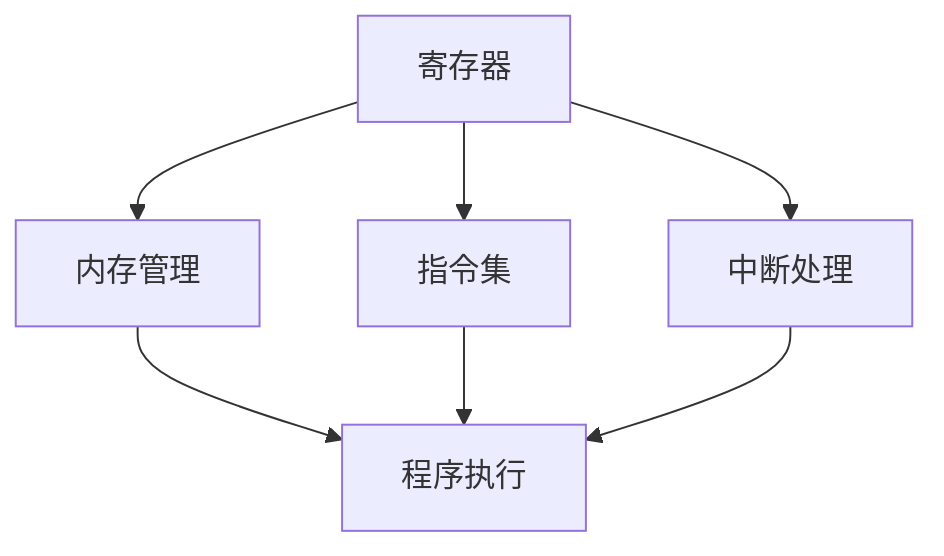

                 

汇编语言是计算机科学中最基础的语言之一，它直接控制计算机硬件的运行。本文将深入探讨x86汇编语言的设计理念、核心概念、算法原理、应用场景以及未来的发展趋势。通过本文的阅读，读者将能够理解x86汇编语言的重要性和实际应用，为后续深入学习和编程打下坚实基础。

## 关键词
- x86汇编语言
- 硬件操作
- 程序设计
- 计算机架构
- 算法实现

## 摘要
本文旨在为读者提供对x86汇编语言全面而深入的了解。我们将从背景介绍开始，逐步探讨汇编语言的核心概念、算法原理、数学模型以及实际应用。通过详细的代码实例和运行结果展示，读者将能够掌握汇编语言的基本操作和编程技巧。最后，我们将对未来的发展趋势和面临的挑战进行展望，为读者提供进一步的学习和研究方向。

## 1. 背景介绍
汇编语言诞生于计算机科学的早期阶段，是介于机器语言和高级语言之间的一种编程语言。它使用助记符（Mnemonics）来表示机器语言的指令，使得程序员能够以更易读、更易于理解的方式编写程序。相对于机器语言，汇编语言提供了更高的抽象层次，使得程序员可以更专注于程序的逻辑而非底层的硬件操作。

### 1.1 汇编语言的起源
汇编语言最早出现于20世纪50年代，随着第一台电子计算机的出现而诞生。早期的计算机程序员使用机器语言编写程序，这需要记忆大量的二进制指令和地址。汇编语言的引入极大地提高了编程效率，因为它将复杂的机器指令映射为更易读的符号指令。

### 1.2 x86架构的崛起
x86架构是Intel在1971年推出的第一代微处理器架构，如今已成为全球最广泛使用的计算机架构之一。x86架构因其良好的兼容性和强大的扩展性而得到了广泛应用，从个人电脑到服务器，从嵌入式系统到高性能计算，x86架构无处不在。

### 1.3 x86汇编语言的重要性
x86汇编语言具有以下几个重要特点：
- **低级操作**：汇编语言直接控制计算机硬件，可以实现非常底层的操作，如寄存器读写、内存管理、中断处理等。
- **高性能**：汇编语言编写的程序可以充分利用计算机硬件资源，实现高效的数据处理和执行。
- **系统编程**：汇编语言常用于操作系统、驱动程序和嵌入式系统的开发，因为它们需要直接与硬件进行交互。

## 2. 核心概念与联系
### 2.1 x86架构核心概念
在x86架构中，核心概念包括寄存器、内存管理、指令集和中断处理等。

### 2.2 x86汇编语言架构流程图
下面是x86架构的Mermaid流程图，展示了核心概念之间的联系。



### 2.3 x86汇编语言与硬件的联系
x86汇编语言通过直接操作计算机硬件，实现了对底层硬件资源的有效利用和控制。例如，寄存器的使用可以优化程序的执行速度，内存管理可以控制程序的数据存储，指令集提供了丰富的操作指令，中断处理可以处理系统事件和异常。

## 3. 核心算法原理 & 具体操作步骤
### 3.1 算法原理概述
x86汇编语言的核心算法原理主要包括指令集的执行、寄存器的使用、内存的访问以及中断的处理。以下是对这些核心算法原理的简要概述。

### 3.2 算法步骤详解
#### 3.2.1 指令集的执行
指令集的执行是汇编语言的核心功能之一。汇编语言的指令包括数据操作指令、控制指令、输入输出指令等。数据操作指令用于对寄存器和内存中的数据进行操作，如加法、减法、移位等；控制指令用于程序的控制流，如跳转、循环等；输入输出指令用于与外部设备进行数据交换。

#### 3.2.2 寄存器的使用
寄存器是计算机中的高速存储单元，用于存储临时数据和指令。x86架构提供了多种寄存器，如通用寄存器、指数寄存器、堆栈寄存器等。合理使用寄存器可以提高程序的执行效率，因为寄存器的访问速度远高于内存。

#### 3.2.3 内存访问
内存访问是汇编语言中的一项基本操作，用于读写内存中的数据。x86架构提供了内存管理单元（MMU）来管理内存，包括内存分配、内存保护等。通过内存访问，程序可以读取和写入数据，实现复杂的数据处理和存储。

#### 3.2.4 中断处理
中断处理是汇编语言中的一项重要功能，用于响应系统事件和异常。中断可以由硬件产生，也可以由软件产生。中断处理程序负责处理中断事件，如键盘输入、系统错误等。

### 3.3 算法优缺点
汇编语言的算法优缺点如下：
- **优点**：汇编语言提供了对硬件的直接操作，可以实现高性能的程序执行。它也使得程序员能够深入理解计算机的工作原理。
- **缺点**：汇编语言相对于高级语言来说，编写和维护较为困难。它需要程序员对硬件有深入的了解，并且容易出错。

### 3.4 算法应用领域
汇编语言广泛应用于以下领域：
- **操作系统开发**：汇编语言用于操作系统的核心部分，如内核、驱动程序等。
- **嵌入式系统**：嵌入式系统通常对性能和资源占用有较高要求，汇编语言能够提供更好的控制。
- **游戏开发**：游戏开发中对性能要求较高，汇编语言可以优化游戏的执行效率。
- **计算机体系结构研究**：汇编语言是研究计算机体系结构的重要工具，通过汇编语言可以深入了解计算机的内部工作原理。

## 4. 数学模型和公式 & 详细讲解 & 举例说明
### 4.1 数学模型构建
在汇编语言中，数学模型主要用于描述程序中的运算和数据处理过程。例如，我们可以使用以下数学模型来计算两个整数的和：

```latex
S = A + B
```

其中，S、A和B分别表示和以及参与运算的两个整数。

### 4.2 公式推导过程
要计算两个整数的和，我们可以使用加法运算符。在x86汇编语言中，加法运算通常使用`ADD`指令来实现。以下是计算两个整数和的汇编代码示例：

```assembly
section .data
A dd 10 ; 定义数据A的值为10
B dd 20 ; 定义数据B的值为20
S dd 0  ; 定义存储和的结果S

section .text
global _start

_start:
    mov eax, [A] ; 将A的值移动到eax寄存器
    mov ebx, [B] ; 将B的值移动到ebx寄存器
    add eax, ebx ; 将ebx的值加到eax寄存器中
    mov [S], eax ; 将和的结果存储到S中

    ; 输出结果
    mov edx, [S]
    mov ecx, msg
    mov ebx, 1
    mov eax, 4
    int 0x80

    ; 退出程序
    mov eax, 1
    int 0x80

section .data
msg db "Sum: ", 0
```

在上面的代码中，我们首先将数据A和B的值分别移动到eax和ebx寄存器中，然后使用`add`指令将两个寄存器的值相加，最后将结果存储到S中。

### 4.3 案例分析与讲解
以下是一个更复杂的数学模型，用于计算两个整数的最大公约数（Greatest Common Divisor，GCD）：

```latex
GCD(A, B) =
\begin{cases}
A, & \text{if } B = 0 \\
GCD(B, A \mod B), & \text{otherwise}
\end{cases}
```

这个模型使用欧几里得算法来计算最大公约数。以下是使用x86汇编语言实现这个算法的代码示例：

```assembly
section .data
A dd 48 ; 定义数据A的值为48
B dd 18 ; 定义数据B的值为18
R dd 0  ; 定义存储最大公约数R的值

section .text
global _start

_start:
    mov eax, [A] ; 将A的值移动到eax寄存器
    mov ebx, [B] ; 将B的值移动到ebx寄存器

gcd_loop:
    cmp ebx, 0
    je gcd_done ; 如果B为0，则跳转到结束
    mov edx, eax
    div ebx ; 计算A除以B的余数
    mov eax, ebx ; 将B的值赋给A
    mov ebx, edx ; 将余数赋给B
    jmp gcd_loop ; 循环计算

gcd_done:
    mov [R], eax ; 将最大公约数存储到R中

    ; 输出结果
    mov edx, [R]
    mov ecx, msg
    mov ebx, 1
    mov eax, 4
    int 0x80

    ; 退出程序
    mov eax, 1
    int 0x80

section .data
msg db "GCD: ", 0
```

在这个代码中，我们首先将数据A和B的值分别移动到eax和ebx寄存器中，然后进入循环计算最大公约数。每次循环中，我们使用`div`指令计算A除以B的余数，并将余数赋给ebx。然后，将B的值赋给A，继续下一次循环。当B为0时，我们退出循环，并将最大公约数存储到R中。

## 5. 项目实践：代码实例和详细解释说明
### 5.1 开发环境搭建
要在计算机上编写和运行x86汇编语言程序，您需要安装以下软件：
- 汇编器：用于将汇编代码转换为机器代码。常见的汇编器包括MASM、NASM等。
- 链接器：用于将汇编代码与其他模块链接，生成可执行文件。
- 模拟器或调试器：用于模拟程序的执行或调试汇编代码。

对于Windows用户，可以使用MASM和Visual Studio；对于Linux用户，可以使用NASM和GDB。

### 5.2 源代码详细实现
以下是一个简单的汇编程序，用于计算两个整数的和：

```assembly
section .data
A dd 10 ; 定义数据A的值为10
B dd 20 ; 定义数据B的值为20
S dd 0  ; 定义存储和的结果S

section .text
global _start

_start:
    mov eax, [A] ; 将A的值移动到eax寄存器
    add eax, [B] ; 将B的值加到eax寄存器中
    mov [S], eax ; 将和的结果存储到S中

    ; 输出结果
    mov eax, [S]
    mov ecx, msg
    mov ebx, 1
    mov edx, 4
    int 0x80

    ; 退出程序
    mov eax, 1
    int 0x80

section .data
msg db "Sum: ", 0
```

在这个程序中，我们首先定义了三个数据段：`.data`，其中包含了三个双字（double word）变量A、B和S，分别表示参与运算的两个整数和结果。接着，在`.text`段中，我们编写了程序的入口点`_start`。程序首先将A的值移动到eax寄存器中，然后通过`add`指令将B的值加到eax寄存器中。最后，我们将结果存储到S中，并通过系统调用`write`将结果输出到控制台。

### 5.3 代码解读与分析
在这个程序中，我们使用了以下指令：
- `mov`：用于寄存器和内存之间的数据传输。
- `add`：用于执行加法操作。
- `int`：用于执行系统调用。

以下是对每条指令的详细解读：

- `mov eax, [A]`：将A的值（10）移动到eax寄存器中。
- `add eax, [B]`：将B的值（20）加到eax寄存器中的值上，结果为30。
- `mov [S], eax`：将eax寄存器中的值（30）存储到S中。
- `mov eax, [S]`：将S的值（30）移动到eax寄存器中，为输出做准备。
- `mov ecx, msg`：将字符串msg的地址（内存地址）移动到ecx寄存器中。
- `mov ebx, 1`：将文件描述符1（标准输出）移动到ebx寄存器中。
- `mov edx, 4`：将输出字符串的长度（4）移动到edx寄存器中。
- `int 0x80`：执行系统调用，将eax寄存器中的值（sys_write）作为系统调用的编号传递给操作系统。
- `mov eax, 1`：将系统调用的编号（sys_exit）移动到eax寄存器中。
- `int 0x80`：执行系统调用，退出程序。

### 5.4 运行结果展示
当我们运行这个汇编程序时，会在控制台上输出以下结果：

```shell
Sum: 30
```

这表示两个整数10和20的和为30。

## 6. 实际应用场景
### 6.1 操作系统开发
汇编语言在操作系统开发中扮演着重要角色。操作系统需要直接与硬件进行交互，以管理计算机资源、控制硬件设备等。汇编语言提供了对硬件的直接操作能力，使得操作系统可以高效地实现这些功能。例如，操作系统的内核通常使用汇编语言编写，以实现硬件初始化、设备驱动、中断处理等核心功能。

### 6.2 嵌入式系统
嵌入式系统通常对性能和资源占用有较高要求，而汇编语言能够提供更好的控制。嵌入式系统的开发者可以使用汇编语言编写关键部分，以优化系统的性能和效率。例如，在嵌入式系统的实时操作系统（RTOS）中，汇编语言可以用于实现关键任务调度、中断处理等关键功能。

### 6.3 游戏开发
游戏开发中对性能要求较高，汇编语言可以优化游戏的执行效率。游戏开发者可以使用汇编语言编写关键的部分，如游戏引擎、图形渲染、物理引擎等，以实现更高的性能和更流畅的游戏体验。

### 6.4 计算机体系结构研究
汇编语言是研究计算机体系结构的重要工具。通过汇编语言，研究人员可以深入了解计算机的内部工作原理，分析指令集、内存管理、中断处理等关键组件的工作机制。汇编语言也为计算机体系结构的设计和优化提供了实验平台。

## 7. 工具和资源推荐
### 7.1 学习资源推荐
- 《x86汇编语言教程》：这是一本经典的x86汇编语言教程，涵盖了汇编语言的基础知识和编程技巧。
- 《深入理解计算机系统》：这本书详细介绍了计算机体系结构和工作原理，包括汇编语言编程。
- 《汇编语言》：刘未鹏编写的《汇编语言》是国内最受欢迎的汇编语言教材之一，适合初学者入门。

### 7.2 开发工具推荐
- MASM：微软汇编器，适用于Windows平台，功能强大。
- NASM：Netwide汇编器，适用于多种平台，开源免费。
- Visual Studio：微软的开发环境，包含汇编器、链接器等工具。

### 7.3 相关论文推荐
- 《x86 Architecture and Optimization》：关于x86架构和优化的论文，涵盖了汇编语言编程的关键技术。
- 《Instruction-Level Parallelism and Superscalar Processors》：关于指令级并行和超标量处理器的论文，深入探讨了计算机体系结构的优化方法。

## 8. 总结：未来发展趋势与挑战
### 8.1 研究成果总结
汇编语言作为计算机科学的基础语言之一，已取得了显著的成果。现代计算机体系结构中，汇编语言的应用日益广泛，特别是在操作系统、嵌入式系统、游戏开发和计算机体系结构研究等领域。随着计算机技术的不断发展，汇编语言也在不断演进，以适应新的硬件架构和编程需求。

### 8.2 未来发展趋势
未来，汇编语言将继续在以下几个方面发展：
- **新的指令集**：随着硬件技术的进步，新的指令集将不断涌现，汇编语言需要适应这些新的指令集。
- **高级汇编语言**：为了提高编程效率和降低开发难度，高级汇编语言的研究和开发将成为重要方向。
- **跨平台汇编语言**：汇编语言将更加跨平台，以适应不同操作系统和硬件架构。

### 8.3 面临的挑战
尽管汇编语言有着广泛的应用前景，但它也面临着以下挑战：
- **开发难度**：汇编语言相对于高级语言来说，编写和维护较为困难，需要程序员具备较强的硬件知识。
- **安全性问题**：汇编语言编写的不当程序容易导致系统崩溃和漏洞，需要程序员具备良好的编程习惯和安全意识。
- **性能优化**：汇编语言需要程序员深入理解硬件的工作原理，以实现性能优化。

### 8.4 研究展望
展望未来，汇编语言将继续在计算机科学领域发挥重要作用。通过不断的研究和开发，汇编语言将不断改进，以适应新的技术和需求。同时，汇编语言也将与其他高级语言和工具相结合，实现更高效、更安全的编程。

## 9. 附录：常见问题与解答
### 9.1 汇编语言与机器语言的区别是什么？
汇编语言是一种符号化的机器语言，使用助记符（Mnemonics）来表示机器指令，使得程序员可以以更易读、更易于理解的方式编写程序。机器语言是由二进制指令组成的，直接控制计算机硬件的运行。

### 9.2 学习汇编语言需要具备哪些基础知识？
学习汇编语言需要具备以下基础知识：
- 计算机硬件基础：了解计算机的内部结构和基本工作原理。
- 编程语言基础：掌握至少一种高级编程语言，如C、C++等。
- 数学基础：熟悉基本的数学概念和算法原理。

### 9.3 汇编语言的主要应用领域是什么？
汇编语言的主要应用领域包括：
- 操作系统开发：操作系统需要直接与硬件进行交互，汇编语言提供了这种能力。
- 嵌入式系统：嵌入式系统通常对性能和资源占用有较高要求，汇编语言可以优化系统的性能。
- 游戏开发：游戏开发中对性能要求较高，汇编语言可以优化游戏的执行效率。
- 计算机体系结构研究：汇编语言是研究计算机体系结构的重要工具，通过汇编语言可以深入了解计算机的内部工作原理。

### 9.4 汇编语言与高级语言的优缺点是什么？
汇编语言与高级语言各有优缺点：
- **优点**：
  - **性能**：汇编语言可以提供更高的性能，因为程序员可以直接控制计算机硬件。
  - **控制力**：汇编语言提供了对硬件的直接操作能力，使得程序员可以深入控制计算机的工作。
- **缺点**：
  - **开发难度**：汇编语言编写和维护较为困难，需要程序员具备较强的硬件知识和编程技巧。
  - **可读性**：汇编语言的代码可读性较差，难以理解和维护。
  - **兼容性**：汇编语言通常与特定的硬件架构紧密相关，不具备良好的跨平台性。

高级语言：
- **优点**：
  - **易读性**：高级语言的代码可读性更好，易于理解和维护。
  - **开发效率**：高级语言提供了丰富的库和框架，提高了编程效率。
  - **跨平台性**：高级语言通常具有较好的跨平台性，可以在不同的操作系统和硬件上运行。
- **缺点**：
  - **性能**：高级语言编写的程序通常性能较低，因为它们需要通过编译器转换为机器语言。
  - **控制力**：高级语言无法提供对硬件的直接操作能力。

## 作者署名
作者：禅与计算机程序设计艺术 / Zen and the Art of Computer Programming
----------------------------------------------------------------

以上就是本文《x86汇编语言程序设计》的完整内容。通过本文的阅读，读者将能够对x86汇编语言有深入的了解，掌握汇编语言的基本操作和编程技巧，并为未来的学习和研究打下坚实基础。希望本文能够对您在计算机科学领域的探索提供有益的启示。

