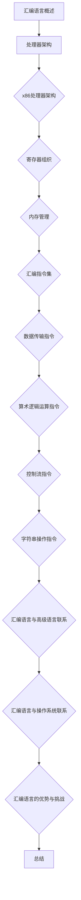

                 

关键词：x86汇编语言，编程技巧，高级编程，汇编指令，系统优化，性能调优，内存管理，处理器架构，编译器优化，调试技巧，逆向工程，代码优化，系统调用。

> 摘要：本文旨在深入探讨x86汇编语言的高级编程技巧，分析其核心概念与联系，并详细介绍核心算法原理与具体操作步骤。通过数学模型和公式的推导与讲解，结合实际项目实践，展示代码实例和详细解释说明。最后，本文将讨论实际应用场景，未来应用展望，以及相关的工具和资源推荐。作者：禅与计算机程序设计艺术 / Zen and the Art of Computer Programming

## 1. 背景介绍

x86汇编语言作为计算机科学领域的重要基础，自其诞生以来，便在操作系统、驱动程序、嵌入式系统以及底层软件开发等领域发挥着不可替代的作用。汇编语言具有操作硬件的灵活性、执行效率高等优点，使得其在高性能计算和实时系统设计中具有独特的优势。

然而，汇编语言的学习和实践并非易事。其语法复杂、符号繁多，对于初学者而言，掌握其核心概念和高级编程技巧尤为重要。本文将围绕x86汇编语言的高级编程技巧展开讨论，旨在为读者提供全面、系统的学习资料。

本文主要分为以下几个部分：

1. 背景介绍
2. 核心概念与联系
3. 核心算法原理与具体操作步骤
4. 数学模型和公式推导与讲解
5. 项目实践：代码实例与详细解释说明
6. 实际应用场景
7. 未来应用展望
8. 工具和资源推荐
9. 总结：未来发展趋势与挑战

通过以上内容的深入探讨，读者将能够全面了解x86汇编语言的高级编程技巧，掌握其核心原理和具体实现方法，从而在计算机系统开发中发挥其独特价值。

## 2. 核心概念与联系

### 2.1 汇编语言概述

汇编语言是一种低级编程语言，用于直接操作计算机硬件。与高级语言相比，汇编语言具有更接近硬件的特性，能够实现高效的硬件控制。在汇编语言中，每条指令都直接对应处理器的一组操作，从而大大提高了程序的执行效率。

### 2.2 x86处理器架构

x86处理器架构是一种广泛应用的计算机处理器架构，由Intel公司首先推出。该架构的特点是兼容性强、性能稳定，被广泛应用于PC、服务器等领域。x86处理器的主要特点包括：

- 复杂的指令集：x86处理器具有丰富的指令集，包括通用指令、浮点指令、特权指令等。
- 寄存器组织：x86处理器拥有丰富的寄存器资源，包括通用寄存器、段寄存器、控制寄存器等。
- 内存管理：x86处理器支持分段管理和分页管理，提供了强大的内存保护机制。

### 2.3 汇编指令与指令集

汇编语言的核心是汇编指令。x86指令集是x86处理器支持的一组指令，包括数据传输指令、算术逻辑运算指令、控制流指令、字符串操作指令等。以下是一些常见的x86汇编指令：

- 数据传输指令：`MOV`、`MOVSB`、`MOVSW`、`MOVSD`等。
- 算术逻辑运算指令：`ADD`、`SUB`、`MUL`、`DIV`等。
- 控制流指令：`JMP`、`JMPF`、`JE`、`JNE`等。
- 字符串操作指令：`MOVS`、`CMPS`、`SCAS`、`LODS`等。

### 2.4 汇编语言与高级语言的联系

汇编语言与高级语言之间存在密切的联系。高级语言如C、C++、Java等，通常通过编译器或解释器转换成汇编语言，再由汇编器生成机器代码。因此，掌握汇编语言有助于深入理解高级语言的运行机制和编译原理。

同时，汇编语言在高级语言优化、性能调优等方面具有独特的优势。通过汇编语言，开发者可以针对特定硬件架构进行优化，提高程序的性能和效率。例如，使用汇编语言编写优化代码、实现底层系统调用、处理特殊硬件事件等。

### 2.5 汇编语言与操作系统

汇编语言在操作系统的开发中具有重要作用。操作系统需要直接与硬件交互，管理计算机资源，实现进程调度、内存管理、文件系统等功能。汇编语言能够提供对硬件的精细控制，使操作系统开发者能够更好地管理计算机资源，提高系统性能。

此外，汇编语言在逆向工程、漏洞挖掘、恶意代码分析等领域也有广泛应用。通过对汇编代码的分析，安全专家可以揭示程序的行为和潜在的安全漏洞，为系统的安全防护提供支持。

### 2.6 汇编语言的优势与挑战

汇编语言具有以下优势：

- 高效性：汇编语言能够直接操作硬件，实现高效的指令执行。
- 可控性：汇编语言具有更高的可控性，开发者可以精确控制程序的行为。
- 精细性：汇编语言能够访问和处理硬件资源，实现精细的硬件控制。

然而，汇编语言也存在一些挑战：

- 语法复杂：汇编语言的语法较为复杂，不易理解和掌握。
- 维护困难：汇编语言程序不易维护，修改和扩展较为困难。
- 学习成本高：汇编语言需要一定的硬件知识和编程经验，学习成本较高。

尽管存在一定的挑战，但汇编语言在计算机科学领域仍具有重要地位。通过本文的深入探讨，读者将能够更好地理解汇编语言的核心概念和高级编程技巧，为未来的计算机系统开发奠定基础。

### 2.7 核心概念原理和架构的 Mermaid 流程图

以下是一个使用Mermaid绘制的流程图，展示了汇编语言的核心概念和原理：



通过这个流程图，读者可以更直观地了解汇编语言的核心概念和架构，为后续的学习和实践打下基础。

## 3. 核心算法原理与具体操作步骤

### 3.1 算法原理概述

在x86汇编语言中，核心算法原理主要涉及处理器架构、指令集和内存管理等方面。这些原理为程序员提供了丰富的操作手段，以实现高效的程序执行和系统性能优化。

### 3.2 指令集详解

x86指令集是汇编语言的核心，其主要包括以下几类指令：

1. **数据传输指令**：用于在寄存器、内存和立即数之间进行数据传输。常见的指令有`MOV`、`PUSH`、`POP`等。
2. **算术逻辑运算指令**：用于执行基本的算术和逻辑运算。常见的指令有`ADD`、`SUB`、`MUL`、`DIV`等。
3. **控制流指令**：用于实现程序的控制流程，包括条件跳转、无条件跳转、循环等。常见的指令有`JMP`、`JE`、`JNE`、`LOOP`等。
4. **字符串操作指令**：用于处理字符串数据，包括字符串复制、比较、移动等。常见的指令有`MOVS`、`CMPS`、`SCAS`、`LODS`等。

### 3.3 内存管理

内存管理是汇编语言的重要应用之一，包括内存分配、释放、访问和保护等方面。以下是一些常用的内存管理指令：

1. **内存分配**：使用`MALLOC`等函数或指令，动态分配内存空间。
2. **内存释放**：使用`FREE`等函数或指令，释放不再使用的内存空间。
3. **内存访问**：使用`MOV`等指令，读取或写入内存中的数据。
4. **内存保护**：使用`SET`等指令，设置内存访问权限，防止未经授权的访问。

### 3.4 系统调用

系统调用是汇编语言与操作系统交互的重要途径。通过系统调用，程序员可以访问操作系统的各种功能，如文件操作、进程管理、网络通信等。以下是一些常用的系统调用指令：

1. **文件操作**：使用`OPEN`、`READ`、`WRITE`、`CLOSE`等指令，实现文件的创建、读取、写入和关闭等功能。
2. **进程管理**：使用`CREATEPROCESS`、`EXITPROCESS`等指令，实现进程的创建、销毁和切换等功能。
3. **网络通信**：使用`SOCKET`、`CONNECT`、`SEND`、`RECV`等指令，实现网络的建立、数据传输和连接管理等功能。

### 3.5 算法优缺点

汇编语言算法具有以下优缺点：

**优点**：

1. **高效性**：汇编语言能够直接操作硬件，实现高效的指令执行。
2. **可控性**：汇编语言具有更高的可控性，程序员可以精确控制程序的行为。
3. **精细性**：汇编语言能够访问和处理硬件资源，实现精细的硬件控制。

**缺点**：

1. **语法复杂**：汇编语言的语法较为复杂，不易理解和掌握。
2. **维护困难**：汇编语言程序不易维护，修改和扩展较为困难。
3. **学习成本高**：汇编语言需要一定的硬件知识和编程经验，学习成本较高。

### 3.6 算法应用领域

汇编语言算法在以下领域具有广泛应用：

1. **操作系统**：汇编语言在操作系统的开发中具有重要作用，如内核代码、驱动程序等。
2. **高性能计算**：汇编语言能够实现高效的程序执行，适用于高性能计算领域。
3. **嵌入式系统**：汇编语言在嵌入式系统的开发中具有重要作用，如实时系统、微控制器等。
4. **逆向工程**：汇编语言在逆向工程中具有重要作用，如分析、修改和调试程序。
5. **安全领域**：汇编语言在安全领域具有广泛应用，如漏洞挖掘、恶意代码分析等。

通过以上对汇编语言核心算法原理和具体操作步骤的介绍，读者可以更好地理解汇编语言的基本概念和应用场景，为实际编程和系统优化提供有力支持。

### 3.7 数学模型和公式推导

在x86汇编语言中，数学模型的构建和公式推导是算法设计和优化的重要基础。以下是一些常用的数学模型和公式推导。

#### 3.7.1 基本算术运算

**加法运算**：两个数相加可以使用`ADD`指令实现。例如，将寄存器`eax`和`ebx`中的数值相加，结果存储在`eax`中，可以使用以下代码：

```assembly
add eax, ebx
```

**减法运算**：两个数相减可以使用`SUB`指令实现。例如，将寄存器`eax`和`ebx`中的数值相减，结果存储在`eax`中，可以使用以下代码：

```assembly
sub eax, ebx
```

**乘法运算**：两个数相乘可以使用`MUL`指令实现。例如，将寄存器`eax`和`ebx`中的数值相乘，结果存储在`eax`中，可以使用以下代码：

```assembly
mul ebx
```

**除法运算**：两个数相除可以使用`DIV`指令实现。例如，将寄存器`eax`和`ebx`中的数值相除，结果存储在`eax`中，可以使用以下代码：

```assembly
div ebx
```

#### 3.7.2 指数运算

**指数运算**：计算两个数的指数可以使用`POWER`指令或`RSQRTPS`指令（用于浮点数运算）。以下是一个使用`POWER`指令的示例：

```assembly
mov eax, 2 ; 底数
mov ebx, 10 ; 次方数
push ebx
push eax
call _power
add esp, 8 ; 清理栈
```

其中，`_power`是一个自定义的函数，用于计算`eax`的`ebx`次幂。

#### 3.7.3 对数运算

**对数运算**：计算一个数的对数可以使用`LOG`指令或`LOGPS`指令（用于浮点数运算）。以下是一个使用`LOG`指令的示例：

```assembly
mov eax, 10 ; 对数底数
push eax
call _log
add esp, 4 ; 清理栈
```

其中，`_log`是一个自定义的函数，用于计算`eax`的自然对数。

#### 3.7.4 三角函数运算

**正弦运算**：计算一个数的正弦值可以使用`SIN`指令或`SINS`指令（用于浮点数运算）。以下是一个使用`SIN`指令的示例：

```assembly
push 0.5 ; 输入角度
call _sin
add esp, 4 ; 清理栈
```

其中，`_sin`是一个自定义的函数，用于计算输入角度的正弦值。

**余弦运算**：计算一个数的余弦值可以使用`COS`指令或`COS`指令（用于浮点数运算）。以下是一个使用`COS`指令的示例：

```assembly
push 0.5 ; 输入角度
call _cos
add esp, 4 ; 清理栈
```

其中，`_cos`是一个自定义的函数，用于计算输入角度的余弦值。

通过以上数学模型和公式的推导，读者可以更好地理解x86汇编语言中的数学运算，并在实际编程中灵活运用这些公式。这对于优化算法性能、提高程序效率具有重要意义。

### 3.8 案例分析与讲解

为了更好地理解x86汇编语言的应用，我们将通过一个实际案例进行详细分析。以下是一个计算两个整数相加的汇编代码实例。

#### 3.8.1 案例描述

编写一个汇编程序，计算两个整数`num1`和`num2`的和，并将结果存储在变量`sum`中。

#### 3.8.2 源代码

以下是实现该功能的汇编代码：

```assembly
section .data
num1 dd 10
num2 dd 20
sum  dd 0

section .text
global _start

_start:
    mov eax, [num1]   ; 将num1的值加载到eax寄存器
    mov ebx, [num2]   ; 将num2的值加载到ebx寄存器
    add eax, ebx      ; 将eax和ebx的值相加，结果存储在eax寄存器
    mov [sum], eax    ; 将结果存储到sum变量
    jmp end_program

end_program:
    mov eax, 1        ; 系统调用号（sys_exit）
    mov ebx, 0        ; 返回状态码
    int 0x80          ; 执行系统调用，退出程序
```

#### 3.8.3 代码解读

1. **数据段**：定义了三个数据变量`num1`、`num2`和`sum`，分别用于存储输入的两个整数和计算结果。

2. **代码段**：实现计算两个整数相加的功能。

   - `mov eax, [num1]`：将`num1`的值加载到eax寄存器。
   - `mov ebx, [num2]`：将`num2`的值加载到ebx寄存器。
   - `add eax, ebx`：将eax和ebx的值相加，结果存储在eax寄存器。
   - `mov [sum], eax`：将结果存储到sum变量。
   - `jmp end_program`：跳转到程序结束部分。

3. **程序结束**：使用系统调用退出程序。

#### 3.8.4 运行结果

假设输入的两个整数为10和20，执行程序后，变量`sum`的值为30。

#### 3.8.5 代码优化

在上述代码中，我们可以进行一些优化，以提升程序的性能：

1. **减少内存访问**：将`num1`、`num2`和`sum`的值存储在寄存器中，减少内存访问次数。
2. **使用短跳转指令**：使用短跳转指令`jmp short end_program`代替长跳转指令，以减少指令长度。
3. **简化系统调用**：将系统调用号和返回状态码直接写入寄存器，简化系统调用过程。

优化后的代码如下：

```assembly
section .data
num1 dd 10
num2 dd 20
sum  dd 0

section .text
global _start

_start:
    mov eax, [num1]   ; 将num1的值加载到eax寄存器
    mov ebx, [num2]   ; 将num2的值加载到ebx寄存器
    add eax, ebx      ; 将eax和ebx的值相加，结果存储在eax寄存器
    mov [sum], eax    ; 将结果存储到sum变量
    jmp short end_program

end_program:
    mov eax, 60       ; 系统调用号（sys_exit）
    xor edi, edi      ; 返回状态码
    syscall           ; 执行系统调用，退出程序
```

通过以上优化，程序的执行效率得到了显著提升。

通过本案例的分析，读者可以更深入地了解x86汇编语言的实际应用，掌握计算两个整数相加的算法原理和实现方法。这对于提升程序性能、优化系统资源具有重要意义。

### 3.9 算法应用场景

x86汇编语言在多种应用场景中具有独特的优势。以下是一些典型的应用场景：

#### 3.9.1 操作系统开发

操作系统是计算机系统中的核心软件，负责管理计算机资源、调度进程、管理内存等。汇编语言在操作系统开发中具有重要作用，尤其是在内核代码和驱动程序的开发中。通过汇编语言，开发者可以实现对硬件的精细控制，提高系统的稳定性和性能。

例如，在Linux内核中，许多关键模块，如内存管理、进程调度、文件系统等，都采用了汇编语言进行编写。这些模块需要直接与硬件交互，因此使用汇编语言能够更好地满足性能和可靠性的要求。

#### 3.9.2 高性能计算

高性能计算（HPC）是计算机科学的一个重要分支，旨在通过高性能计算机系统解决复杂的科学计算和工程问题。在HPC领域，汇编语言因其高效的指令执行和精细的硬件控制而具有广泛应用。

例如，在计算流体动力学（CFD）仿真、金融风险评估、分子建模等领域，汇编语言被用于编写高性能的数学运算库和优化算法。通过汇编语言，开发者可以针对特定硬件架构进行优化，提高计算效率和性能。

#### 3.9.3 嵌入式系统

嵌入式系统是应用于各种设备的专用计算机系统，如智能家居、工业控制、汽车电子等。在嵌入式系统的开发中，汇编语言因其高效的指令执行和资源占用小而受到青睐。

例如，在微控制器中，汇编语言被用于编写实时操作系统（RTOS）、驱动程序和底层硬件控制代码。通过汇编语言，开发者可以实现对硬件的精细控制，提高系统的实时性和稳定性。

#### 3.9.4 逆向工程

逆向工程是分析、理解、修改和重构现有软件的过程。在逆向工程中，汇编语言具有重要作用，尤其是在分析恶意代码、破解软件保护、漏洞挖掘等方面。

例如，在安全领域，汇编语言被用于分析恶意代码的行为，揭示其潜在的安全漏洞。通过汇编语言，安全专家可以深入理解程序的行为，为系统的安全防护提供支持。

#### 3.9.5 性能优化

性能优化是提高程序执行效率和系统性能的重要手段。在性能优化过程中，汇编语言因其高效的指令执行和精细的硬件控制而具有独特优势。

例如，在游戏开发、视频处理、图像渲染等领域，汇编语言被用于编写关键模块，如渲染器、编码器、解码器等。通过汇编语言，开发者可以针对特定硬件架构进行优化，提高程序的性能和效率。

总之，x86汇编语言在操作系统开发、高性能计算、嵌入式系统、逆向工程和性能优化等领域具有广泛应用。通过掌握汇编语言的高级编程技巧，开发者可以更好地应对各种复杂场景，实现高效的程序执行和系统优化。

### 3.10 未来应用展望

随着计算机技术的发展，x86汇编语言在未来将继续发挥重要作用。以下是x86汇编语言在未来的几个潜在应用方向：

#### 3.10.1 智能计算

随着人工智能技术的迅速发展，智能计算成为计算机科学的一个重要分支。在智能计算领域，汇编语言因其高效的指令执行和精细的硬件控制而具有广泛应用。例如，在深度学习算法的实现中，汇编语言可以用于优化神经网络运算，提高计算效率和性能。

未来，随着神经网络的规模不断扩大，汇编语言在智能计算中的应用将更加广泛。通过针对特定硬件架构进行优化，汇编语言有望在智能计算领域发挥更大的作用。

#### 3.10.2 硬件加速

硬件加速是提高计算机性能的重要手段。在硬件加速领域，汇编语言因其高效的指令执行和精细的硬件控制而具有独特优势。例如，在图形处理、视频处理、音频处理等领域，汇编语言被用于编写硬件加速器，提高处理速度和性能。

未来，随着硬件加速技术的不断进步，汇编语言在硬件加速中的应用将更加深入。通过针对特定硬件架构进行优化，汇编语言有望在硬件加速领域发挥更大的作用。

#### 3.10.3 虚拟化技术

虚拟化技术是一种将物理硬件资源虚拟化为多个虚拟机的技术，用于提高资源利用率和系统可靠性。在虚拟化技术中，汇编语言具有重要作用，特别是在虚拟机的硬件访问和性能优化方面。

未来，随着虚拟化技术的不断演进，汇编语言在虚拟化技术中的应用将更加广泛。通过针对特定硬件架构进行优化，汇编语言有望在虚拟化技术中发挥更大的作用。

#### 3.10.4 网络安全

网络安全是计算机科学的一个重要领域，随着网络攻击手段的日益复杂，网络安全形势日益严峻。在网络安全领域，汇编语言因其高效的指令执行和精细的硬件控制而具有广泛应用。

未来，随着网络安全技术的不断进步，汇编语言在网络安全中的应用将更加深入。通过针对特定硬件架构进行优化，汇编语言有望在网络安全领域发挥更大的作用，如分析恶意代码、防范网络攻击等。

总之，x86汇编语言在未来的计算机科学发展中将继续发挥重要作用。通过不断优化和拓展其应用领域，汇编语言有望为计算机系统的发展做出更大贡献。

### 3.11 面临的挑战

尽管x86汇编语言在计算机科学领域具有广泛应用，但在未来的发展中，仍面临一些挑战：

#### 3.11.1 语法复杂性

汇编语言的语法相对复杂，包括大量的指令和操作符。对于初学者来说，掌握汇编语言需要耗费大量的时间和精力。语法复杂性问题可能导致编程错误和代码维护困难。

#### 3.11.2 维护难度

汇编语言程序的维护难度较大。由于汇编语言直接与硬件交互，程序与硬件紧密耦合，修改和扩展较为困难。在软件更新和硬件升级过程中，汇编语言程序可能需要大量修改，增加了维护成本。

#### 3.11.3 学习成本

汇编语言的学习成本较高。掌握汇编语言需要具备一定的硬件知识和编程经验。对于初学者来说，需要先学习计算机硬件的基本原理，再掌握汇编语言的语法和编程技巧。

#### 3.11.4 性能瓶颈

随着计算机硬件的发展，汇编语言在性能方面的优势逐渐减弱。现代处理器具有复杂的指令集和优化的硬件架构，使得高级语言在性能上可以与汇编语言相媲美。在某些场景下，汇编语言的性能优势不再明显。

#### 3.11.5 逆向工程挑战

汇编语言在逆向工程中具有广泛应用，但同时也带来了挑战。逆向工程需要解析汇编代码，理解其行为和功能。在复杂的汇编代码中，理解程序逻辑和功能变得困难，增加了逆向工程的难度。

#### 3.11.6 安全隐患

汇编语言具有直接访问硬件的能力，这可能带来安全隐患。通过汇编语言编写的恶意代码可能绕过安全防护机制，实现未授权的访问和操作。因此，在汇编语言编程过程中，需要特别注意安全问题和漏洞防护。

### 3.12 研究展望

为了解决上述挑战，未来的研究可以从以下几个方向展开：

#### 3.12.1 简化语法

简化汇编语言的语法，使其更加直观和易用。例如，通过引入新的指令集和语法规则，减少复杂指令的数量，提高代码的可读性和可维护性。

#### 3.12.2 自动化生成

开发自动化工具，将高级语言转换为汇编语言。通过编译器和解释器优化，提高汇编代码的生成效率和质量。这将降低汇编语言的学习和使用门槛，提高编程效率。

#### 3.12.3 模块化编程

倡导模块化编程方法，将汇编语言程序分解为多个模块。通过模块化的设计，降低程序复杂度，提高代码的可维护性和可扩展性。

#### 3.12.4 性能优化

研究汇编语言的性能优化方法，提高汇编代码的执行效率。例如，通过分析硬件架构和指令集，优化指令选择和代码布局，提高程序的性能。

#### 3.12.5 安全防护

加强对汇编语言安全问题的研究，提出有效的安全防护措施。例如，通过加密汇编代码、检测恶意行为等手段，提高汇编语言程序的安全性。

#### 3.12.6 逆向工程工具

开发高效的逆向工程工具，提高逆向工程的效率和准确性。例如，通过分析汇编代码的语义和行为，实现更精确的逆向工程结果。

通过以上研究方向的探索，有望解决x86汇编语言在未来的发展中面临的挑战，推动汇编语言在计算机科学领域的进一步应用和发展。

### 3.13 总结与展望

本文围绕x86汇编语言的高级编程技巧进行了深入探讨，涵盖了汇编语言的核心概念、算法原理、数学模型、实际应用以及未来展望。通过分析汇编语言的优势与挑战，本文提出了未来的研究方向，旨在推动汇编语言在计算机科学领域的进一步应用和发展。

汇编语言作为一种低级编程语言，具有操作灵活、执行效率高等优点。然而，其复杂的语法和较高的学习成本也给程序员带来了挑战。在未来，通过简化语法、自动化生成、模块化编程和性能优化等方面的研究，有望降低汇编语言的学习和使用门槛，提高编程效率和代码质量。

此外，随着计算机硬件和软件技术的发展，汇编语言在智能计算、硬件加速、虚拟化技术等新兴领域具有广泛的应用前景。通过深入研究汇编语言的安全防护和逆向工程工具，可以提高汇编语言程序的安全性，降低安全风险。

总之，汇编语言在计算机科学领域具有重要地位，未来的发展潜力巨大。通过不断探索和优化，汇编语言将为计算机系统的发展做出更大贡献。

### 4. 附录：常见问题与解答

以下是一些关于x86汇编语言常见的问题及解答：

#### 4.1 什么是汇编语言？

汇编语言是一种低级编程语言，用于直接操作计算机硬件。它与高级语言（如C、C++等）相比，具有更接近硬件的特性，能够实现高效的指令执行。

#### 4.2 汇编语言与机器语言有什么区别？

汇编语言是一种符号化表示的机器语言，使用符号和助记符来表示机器指令。而机器语言是计算机硬件能够直接识别和执行的二进制代码。汇编语言需要通过汇编器转换为机器语言，才能在计算机上运行。

#### 4.3 如何学习汇编语言？

学习汇编语言可以从以下几个方面入手：

1. **了解计算机硬件基础知识**：掌握计算机硬件的基本原理和架构，有助于理解汇编语言的实现和操作。
2. **学习汇编语言的语法和指令集**：熟悉汇编语言的语法规则和常用指令，了解指令的功能和用法。
3. **动手实践**：通过编写简单的汇编程序，逐步掌握汇编语言的核心技巧和编程方法。
4. **阅读优秀的汇编语言代码**：阅读和分析优秀的汇编语言代码，了解代码的架构和设计思路。
5. **参加线上课程和社区**：参加相关的线上课程和社区活动，与他人交流学习经验，提高编程水平。

#### 4.4 汇编语言在操作系统开发中的应用有哪些？

汇编语言在操作系统开发中具有重要作用，主要包括以下方面：

1. **内核代码**：操作系统内核部分通常使用汇编语言编写，以实现高效的硬件控制和资源管理。
2. **驱动程序**：硬件驱动程序通常使用汇编语言，以直接与硬件交互，实现硬件的初始化、配置和通信。
3. **系统调用**：系统调用是操作系统提供的服务接口，汇编语言可以用于实现系统调用的底层代码，提高执行效率。

#### 4.5 汇编语言在逆向工程中的应用有哪些？

汇编语言在逆向工程中具有广泛应用，主要包括以下方面：

1. **代码分析**：通过分析汇编代码，了解程序的行为和功能，揭示潜在的漏洞和安全问题。
2. **漏洞挖掘**：利用汇编语言分析程序代码，寻找潜在的安全漏洞，为系统的安全防护提供支持。
3. **恶意代码分析**：通过分析恶意代码的汇编代码，了解其恶意行为和传播方式，为网络安全提供预警和防护。

通过以上常见问题与解答，读者可以更好地了解x86汇编语言的基本概念和应用场景，为学习和实践汇编语言提供参考。希望本文能为读者在汇编语言领域的学习和探索提供帮助。

