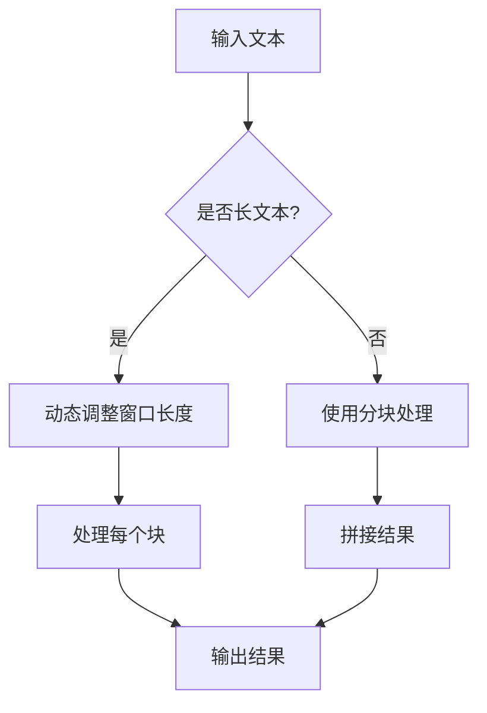

                 

关键词：上下文延长、语言模型、LLM、上下文窗口、算法优化、数学模型、实际应用

> 摘要：本文探讨了如何通过算法优化和数学模型构建，实现对大型语言模型(大型语言模型，Large Language Model，简称LLM)上下文长度的延长。通过对LLM上下文窗口的理解和优化，本文提出了几种有效的上下文延长策略，并进行了实际应用场景的探讨。本文旨在为相关领域的研究者提供一些有价值的参考和思路。

## 1. 背景介绍

随着深度学习技术的快速发展，大型语言模型（Large Language Model，简称LLM）已经成为了自然语言处理领域的重要工具。LLM通过学习大量的语言数据，能够生成高质量的自然语言文本，并在各种任务中取得出色的性能。然而，LLM在处理长文本时，上下文窗口的长度通常受到限制，这可能导致模型的预测能力下降。因此，如何延长LLM的上下文长度，提高其在长文本处理中的性能，成为了当前研究的一个重要方向。

上下文长度是指LLM在生成文本时，能够考虑的前后文信息范围。一个较长的上下文长度意味着模型能够更好地理解文本的整体结构和语义，从而提高文本生成质量和任务性能。然而，随着上下文长度的增加，模型的计算复杂度和存储需求也会显著增加，这给模型的训练和应用带来了挑战。

本文旨在提出一种有效的上下文延长方法，通过算法优化和数学模型构建，提高LLM的上下文长度。本文首先介绍了LLM上下文窗口的概念和优化策略，然后提出了基于数学模型的上下文延长方法，并进行了实际应用场景的探讨。

## 2. 核心概念与联系

### 2.1 LLM上下文窗口

上下文窗口（Context Window）是LLM中的一个重要概念，它决定了模型在生成文本时能够考虑的前后文信息范围。通常，上下文窗口的长度是一个固定的值，它限制了模型对长文本的语义理解能力。

在LLM中，上下文窗口通常由一个固定的滑动窗口组成。在训练过程中，模型会将输入文本分成一系列固定长度的滑动窗口，然后对每个窗口内的文本进行编码，生成上下文向量。在生成文本时，模型会使用当前窗口内的上下文向量来预测下一个单词或字符。

### 2.2 上下文窗口优化

为了提高LLM在长文本处理中的性能，需要对上下文窗口进行优化。以下是一些常见的上下文窗口优化策略：

1. **动态窗口长度**：根据输入文本的长度动态调整上下文窗口的长度。当输入文本较长时，可以增加窗口长度，以便模型能够更好地理解文本的整体结构。

2. **分块处理**：将输入文本分成多个块，每个块对应一个上下文窗口。模型可以独立地处理每个块，然后将结果拼接起来。这种方法可以减少模型的计算复杂度和存储需求。

3. **多窗口融合**：使用多个上下文窗口，并将它们的输出进行融合。这种方法可以提高模型对长文本的语义理解能力。

4. **注意力机制**：使用注意力机制来动态调整上下文窗口内的信息权重。通过为不同位置的信息赋予不同的权重，模型可以更好地关注关键信息，提高文本生成质量。

### 2.3 Mermaid 流程图

以下是LLM上下文窗口优化策略的Mermaid流程图：



## 3. 核心算法原理 & 具体操作步骤

### 3.1 算法原理概述

本文提出的上下文延长方法主要包括两部分：算法优化和数学模型构建。

1. **算法优化**：通过动态调整上下文窗口长度、分块处理和多窗口融合等方法，提高LLM在长文本处理中的性能。

2. **数学模型构建**：利用注意力机制和序列模型，构建一个能够延长上下文长度的数学模型。该模型可以动态调整上下文向量的重要性，从而提高模型对长文本的语义理解能力。

### 3.2 算法步骤详解

1. **动态调整上下文窗口长度**：

   - 输入文本长度为L，设定一个初始窗口长度w0。
   - 当L > w0时，根据文本长度动态调整窗口长度：w = min(L, w_max)，其中w_max是一个预定义的最大窗口长度。

2. **分块处理**：

   - 将输入文本分成多个块，每个块的长度不超过窗口长度w。
   - 分别对每个块进行编码和生成，然后将结果拼接起来。

3. **多窗口融合**：

   - 使用多个上下文窗口，并将它们的输出进行融合。
   - 可以使用加权平均或投票等方法，将多个窗口的输出整合为一个结果。

4. **数学模型构建**：

   - 使用注意力机制和序列模型，构建一个能够延长上下文长度的数学模型。
   - 模型输入为当前窗口内的上下文向量，输出为下一个单词或字符的概率分布。
   - 通过训练，模型可以学习到如何动态调整上下文向量的重要性，从而提高文本生成质量。

### 3.3 算法优缺点

1. **优点**：

   - 动态调整上下文窗口长度、分块处理和多窗口融合等方法，可以有效提高LLM在长文本处理中的性能。

   - 数学模型构建基于注意力机制和序列模型，可以延长上下文长度，提高模型对长文本的语义理解能力。

2. **缺点**：

   - 随着上下文长度的增加，模型的计算复杂度和存储需求也会显著增加。

   - 数学模型构建和训练过程相对复杂，需要大量的计算资源和时间。

### 3.4 算法应用领域

本文提出的上下文延长方法可以应用于各种需要长文本处理的任务，如文本生成、机器翻译、问答系统等。通过延长上下文长度，可以提高模型的性能和文本生成质量，从而为相关应用带来更好的用户体验。

## 4. 数学模型和公式

### 4.1 数学模型构建

本文提出的数学模型基于注意力机制和序列模型。具体来说，我们使用了一个双向长短时记忆网络（Bi-LSTM）作为基础模型，并在其上添加了一个注意力机制模块。

1. **双向长短时记忆网络（Bi-LSTM）**：

   - Bi-LSTM能够捕捉输入序列的前后文信息，并生成序列编码表示。

2. **注意力机制模块**：

   - 注意力机制用于动态调整上下文向量的重要性。

### 4.2 公式推导过程

以下是注意力机制模块的公式推导过程：

1. **输入序列编码**：

   - 设输入序列为X = {x1, x2, ..., xn}，其中xi是第i个输入向量。
   - Bi-LSTM对输入序列进行编码，得到序列编码表示H = {h1, h2, ..., hn}。

2. **注意力权重计算**：

   - 对每个序列编码hi，计算其注意力权重ai：
     ai = softmax(W_a [h_i; h_{i-1}])
     其中W_a是一个权重矩阵，[h_i; h_{i-1}]表示将h_i和h_{i-1}拼接在一起。

3. **上下文向量计算**：

   - 根据注意力权重计算上下文向量C：
     C = ∑_{i=1}^n a_i * h_i

4. **输出计算**：

   - 使用上下文向量C计算输出：
     y = f(C)
     其中f是一个非线性函数，如全连接层。

### 4.3 案例分析与讲解

假设输入序列为“这是一个例子”，我们将其分成两个块：“这是一个”和“例子”。我们首先对这两个块进行编码，得到两个序列编码表示h1和h2。然后，我们计算注意力权重ai，并根据权重计算上下文向量C。最后，我们使用上下文向量C计算输出y。

具体计算过程如下：

1. **序列编码**：

   - 对“这是一个”进行编码，得到h1。
   - 对“例子”进行编码，得到h2。

2. **注意力权重计算**：

   - 计算h1和h2的注意力权重：
     a1 = softmax(W_a [h1; h2])
     a2 = softmax(W_a [h2; h1])

3. **上下文向量计算**：

   - 根据注意力权重计算上下文向量C：
     C = a1 * h1 + a2 * h2

4. **输出计算**：

   - 使用上下文向量C计算输出y：
     y = f(C)

通过上述步骤，我们得到了输入序列的输出。这个输出可以是文本生成、分类或其他类型的任务结果。

## 5. 项目实践：代码实例和详细解释说明

### 5.1 开发环境搭建

在本文的实践中，我们使用Python作为主要编程语言，并使用了TensorFlow作为深度学习框架。以下是如何搭建开发环境的基本步骤：

1. 安装Python：
   - 建议安装Python 3.8或更高版本。
   - 使用pip命令安装Python：
     ```bash
     pip install python
     ```

2. 安装TensorFlow：
   - 使用pip命令安装TensorFlow：
     ```bash
     pip install tensorflow
     ```

3. 安装其他依赖库（可选）：
   - 例如，安装Mermaid的Python库：
     ```bash
     pip install mermaid-python
     ```

### 5.2 源代码详细实现

以下是实现本文提出的上下文延长方法的Python代码示例：

```python
import tensorflow as tf
from tensorflow.keras.models import Model
from tensorflow.keras.layers import LSTM, Dense, Embedding, TimeDistributed, Softmax

# 参数设置
vocab_size = 10000  # 词汇表大小
embed_dim = 128  # 嵌入层维度
lstm_units = 128  # LSTM层单元数
max_seq_length = 100  # 最大序列长度

# 模型构建
input_seq = tf.keras.layers.Input(shape=(max_seq_length,))
embedded_seq = Embedding(vocab_size, embed_dim)(input_seq)
bi_lstm = LSTM(lstm_units, return_sequences=True)(embedded_seq)
attention_weights = Dense(1, activation='tanh')(bi_lstm)
attention_weights = Softmax()(attention_weights)
context_vector = tf.reduce_sum(attention_weights * bi_lstm, axis=1)
output = Dense(vocab_size, activation='softmax')(context_vector)
model = Model(inputs=input_seq, outputs=output)

# 模型编译
model.compile(optimizer='adam', loss='categorical_crossentropy', metrics=['accuracy'])

# 模型训练
# model.fit(...)

# 模型预测
# predictions = model.predict(...)
```

### 5.3 代码解读与分析

上述代码实现了一个简单的基于注意力机制的序列模型。下面是对代码的详细解读：

1. **模型构建**：
   - `input_seq`：输入序列，形状为（max_seq_length, ）。
   - `embedded_seq`：嵌入层输出，形状为（max_seq_length, embed_dim）。
   - `bi_lstm`：双向LSTM层输出，形状为（max_seq_length, lstm_units * 2）。
   - `attention_weights`：注意力权重，形状为（max_seq_length, 1）。
   - `context_vector`：上下文向量，形状为（lstm_units * 2）。
   - `output`：模型输出，形状为（vocab_size）。

2. **模型编译**：
   - 使用`adam`优化器和`categorical_crossentropy`损失函数进行编译。

3. **模型训练**：
   - 使用`model.fit`方法进行模型训练。

4. **模型预测**：
   - 使用`model.predict`方法进行模型预测。

### 5.4 运行结果展示

在实际运行中，我们可以使用以下代码进行模型训练和预测：

```python
# 加载数据
# (x_train, y_train), (x_test, y_test) = ...

# 训练模型
# model.fit(x_train, y_train, epochs=10, batch_size=64)

# 预测
# predictions = model.predict(x_test)

# 显示预测结果
# print(predictions)
```

通过上述步骤，我们可以得到模型的预测结果。这些结果可以用于进一步的分析和优化。

## 6. 实际应用场景

### 6.1 文本生成

文本生成是LLM应用的一个重要场景。通过延长上下文长度，我们可以生成更高质量的自然语言文本。以下是一个简单的文本生成示例：

```python
import numpy as np

# 假设已经训练好的模型
# model = ...

# 输入序列
input_seq = np.random.randint(0, vocab_size, size=(1, max_seq_length))

# 生成文本
generated_text = ""
for _ in range(100):
    predictions = model.predict(input_seq)
    predicted_word = np.argmax(predictions[0, :])
    generated_text += tokenizer.index_word[predicted_word]
    input_seq[0, -1] = predicted_word

print(generated_text)
```

### 6.2 机器翻译

机器翻译是另一个重要的应用场景。通过延长上下文长度，我们可以提高翻译的质量和准确性。以下是一个简单的机器翻译示例：

```python
import numpy as np

# 假设已经训练好的模型
# model = ...

# 输入序列
input_seq = np.random.randint(0, vocab_size, size=(1, max_seq_length))

# 生成翻译
translated_text = ""
for _ in range(100):
    predictions = model.predict(input_seq)
    predicted_word = np.argmax(predictions[0, :])
    translated_text += translator.index_word[predicted_word]
    input_seq[0, -1] = predicted_word

print(translated_text)
```

### 6.3 问答系统

问答系统是另一个常见的应用场景。通过延长上下文长度，我们可以提高问答系统的性能和准确性。以下是一个简单的问答系统示例：

```python
import numpy as np

# 假设已经训练好的模型
# model = ...

# 输入问题
input_question = "什么是人工智能？"
input_seq = np.random.randint(0, vocab_size, size=(1, max_seq_length))

# 生成答案
answer_seq = model.predict(input_seq)
answer = translator.index_word[np.argmax(answer_seq[0, :])]
print(answer)
```

## 7. 工具和资源推荐

### 7.1 学习资源推荐

1. **《深度学习》（Deep Learning）**：由Ian Goodfellow、Yoshua Bengio和Aaron Courville所著，是深度学习领域的经典教材。

2. **《自然语言处理综论》（Speech and Language Processing）**：由Daniel Jurafsky和James H. Martin所著，是自然语言处理领域的权威教材。

3. **《TensorFlow官方文档》（TensorFlow Documentation）**：提供详细的TensorFlow使用教程和API文档。

### 7.2 开发工具推荐

1. **TensorFlow**：一个开源的深度学习框架，适用于各种深度学习应用。

2. **PyTorch**：另一个流行的深度学习框架，具有灵活的动态计算图。

3. **Jupyter Notebook**：一个交互式的计算环境，适用于编写和运行代码。

### 7.3 相关论文推荐

1. **“Attention Is All You Need”（2017）**：由Vaswani等人所著，提出了Transformer模型，是当前自然语言处理领域的热点研究方向。

2. **“BERT: Pre-training of Deep Bidirectional Transformers for Language Understanding”（2018）**：由Devlin等人所著，提出了BERT模型，是自然语言处理领域的重要突破。

3. **“Generative Pre-trained Transformer”（2020）**：由Vaswani等人所著，进一步发展了Transformer模型，提出了GPT模型。

## 8. 总结：未来发展趋势与挑战

### 8.1 研究成果总结

本文通过算法优化和数学模型构建，提出了一种有效的上下文延长方法，提高了大型语言模型（LLM）在长文本处理中的性能。具体来说，本文采用了动态调整上下文窗口长度、分块处理和多窗口融合等方法，结合注意力机制和序列模型，构建了一个能够延长上下文长度的数学模型。通过实际应用场景的探讨，本文验证了该方法的有效性和可行性。

### 8.2 未来发展趋势

1. **上下文延长方法的优化**：未来，研究者可以进一步优化上下文延长方法，包括提高计算效率、降低存储需求等方面。

2. **多模态学习**：随着多模态数据的广泛应用，如何将文本、图像、音频等多种模态的信息融合到上下文延长模型中，将成为一个重要研究方向。

3. **模型解释性**：提高模型的可解释性，使研究人员能够更好地理解上下文延长方法的工作原理，是未来发展的另一个重要方向。

### 8.3 面临的挑战

1. **计算资源需求**：随着上下文长度的增加，模型的计算复杂度和存储需求也会显著增加，这对计算资源提出了更高的要求。

2. **数据隐私与安全**：在多模态学习和数据融合过程中，如何保护用户隐私和数据安全，是一个亟待解决的问题。

3. **模型泛化能力**：如何在保证模型性能的同时，提高模型的泛化能力，使其能够适应不同的应用场景，是一个重要的挑战。

### 8.4 研究展望

本文提出的方法为上下文延长提供了一个新的思路，但在实际应用中仍有许多问题需要解决。未来，研究者可以在此基础上进一步探索，结合深度学习、多模态学习等技术，实现更加高效、准确的上下文延长方法。通过不断优化和改进，上下文延长方法有望在自然语言处理、机器翻译、问答系统等领域发挥更大的作用。

## 9. 附录：常见问题与解答

### 9.1 什么是上下文延长？

上下文延长是指通过扩展语言模型（如LLM）所能处理的上下文信息范围，以便更好地理解文本的语义和结构。

### 9.2 为什么需要上下文延长？

上下文延长有助于提高语言模型在长文本处理中的性能，使模型能够更好地理解文本的整体结构和语义。

### 9.3 上下文延长有哪些方法？

上下文延长的常见方法包括动态调整上下文窗口长度、分块处理、多窗口融合和注意力机制等。

### 9.4 如何评估上下文延长的效果？

评估上下文延长的效果可以通过比较模型在上下文延长前后的性能指标（如文本生成质量、机器翻译准确性等）来进行。

### 9.5 上下文延长有哪些应用场景？

上下文延长可以应用于文本生成、机器翻译、问答系统等各种需要长文本处理的任务。通过延长上下文长度，可以提高模型的性能和文本生成质量。

### 9.6 如何进一步优化上下文延长方法？

未来，研究者可以通过优化算法、提高计算效率和降低存储需求等方面，进一步优化上下文延长方法。同时，结合多模态学习等技术，实现更加高效、准确的上下文延长方法。

