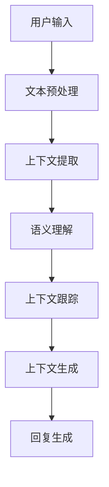

                 

本文将探讨如何通过上下文感知技术来保持聊天连贯性，从核心概念、算法原理到具体实现，全面解析这一话题。文章将提供数学模型和公式推导，并通过实际项目实践来展示技术应用。最后，我们将展望未来发展趋势和面临的挑战。

> 关键词：上下文感知、自然语言处理、聊天连贯性、算法原理、数学模型

> 摘要：本文介绍了上下文感知技术在保持聊天连贯性方面的应用，从核心概念到具体实现，详细阐述了上下文感知算法的工作原理和实现步骤。文章还包括数学模型和公式推导，以及实际项目实践和未来应用展望。

## 1. 背景介绍

随着互联网和人工智能技术的飞速发展，自然语言处理（NLP）已经成为一个重要研究领域。在NLP中，保持聊天连贯性是一个关键问题。无论是聊天机器人、虚拟助手还是智能客服，都需要能够理解并回应用户的输入，确保聊天过程的流畅性和连贯性。

然而，实现聊天连贯性并非易事。一方面，自然语言具有高度的不确定性和复杂性；另一方面，用户输入往往是非结构化的文本。这就需要引入上下文感知技术，通过理解用户输入的上下文信息，来提升聊天的连贯性。

上下文感知技术主要包括以下几个方面：

1. **上下文提取**：从用户输入中提取出与当前对话相关的上下文信息。
2. **上下文理解**：对提取出的上下文信息进行语义分析和理解。
3. **上下文跟踪**：在对话过程中持续更新和跟踪上下文信息。
4. **上下文生成**：根据上下文信息生成合适的回复。

本文将重点探讨上下文提取和上下文理解这两个核心环节，详细介绍相关的算法原理和实现方法。

## 2. 核心概念与联系

### 2.1. 自然语言处理（NLP）

自然语言处理是人工智能领域的一个重要分支，旨在使计算机能够理解和处理自然语言。NLP的核心任务包括文本预处理、语义分析、语言生成等。在保持聊天连贯性方面，NLP技术能够帮助系统理解用户输入的意图和情感，从而生成合适的回复。

### 2.2. 上下文感知（Context Awareness）

上下文感知是指系统根据用户输入的上下文信息，动态调整其行为和回应的能力。上下文信息可以包括用户的历史输入、对话环境、用户偏好等。上下文感知技术在聊天机器人等应用中具有重要意义，能够提高聊天的自然性和连贯性。

### 2.3. 语义理解（Semantic Understanding）

语义理解是指对自然语言文本的语义内容进行理解和解释的能力。在上下文感知中，语义理解是实现上下文提取和理解的关键技术。通过语义理解，系统可以准确理解用户的意图和需求，从而生成更加准确的回复。

### 2.4. 上下文跟踪（Context Tracking）

上下文跟踪是指在对话过程中持续更新和跟踪上下文信息的过程。上下文跟踪能够帮助系统在对话过程中保持上下文的连贯性，避免出现不相关的回复。上下文跟踪通常基于历史对话记录、用户行为和系统状态等信息。

### 2.5. 上下文生成（Context Generation）

上下文生成是指根据上下文信息生成合适的回复的过程。上下文生成需要结合自然语言生成技术和语义理解能力，确保生成的回复与上下文信息保持一致。上下文生成是实现聊天连贯性的重要手段。

下面是一个简单的 Mermaid 流程图，展示了上下文感知技术的主要组成部分：



## 3. 核心算法原理 & 具体操作步骤

### 3.1. 算法原理概述

上下文感知技术主要涉及以下几个核心算法：

1. **文本预处理**：对用户输入进行分词、词性标注、命名实体识别等操作，为后续处理做准备。
2. **上下文提取**：利用词频统计、关键词提取等方法，从用户输入中提取出与当前对话相关的上下文信息。
3. **语义理解**：通过语义角色标注、语义相似度计算等技术，对提取出的上下文信息进行语义分析，理解用户的意图和需求。
4. **上下文跟踪**：在对话过程中持续更新和跟踪上下文信息，确保上下文的连贯性。
5. **上下文生成**：根据上下文信息生成合适的回复，确保回复与上下文信息保持一致。

### 3.2. 算法步骤详解

#### 3.2.1. 文本预处理

文本预处理是上下文感知技术的第一步。其主要任务是对用户输入进行分词、词性标注、命名实体识别等操作，以便后续处理。

1. **分词**：将用户输入的文本切分成一个个词组。
2. **词性标注**：对每个词组进行词性标注，如名词、动词、形容词等。
3. **命名实体识别**：识别文本中的命名实体，如人名、地名、机构名等。

#### 3.2.2. 上下文提取

上下文提取是指从用户输入中提取出与当前对话相关的上下文信息。常用的方法包括：

1. **词频统计**：统计用户输入中每个词的出现频率，提取高频词作为上下文信息。
2. **关键词提取**：利用TF-IDF、TextRank等方法，从用户输入中提取出关键词。
3. **句法分析**：利用句法分析技术，提取用户输入中的主要句子成分，如主语、谓语、宾语等。

#### 3.2.3. 语义理解

语义理解是指对提取出的上下文信息进行语义分析，理解用户的意图和需求。常用的方法包括：

1. **语义角色标注**：对提取出的句子成分进行语义角色标注，如主语、谓语、宾语等。
2. **语义相似度计算**：计算用户输入与预设的语义模板之间的相似度，判断用户意图。

#### 3.2.4. 上下文跟踪

上下文跟踪是指在对话过程中持续更新和跟踪上下文信息。常用的方法包括：

1. **历史对话记录**：利用历史对话记录，更新上下文信息。
2. **用户行为分析**：根据用户的行为，如点击、滑动等，更新上下文信息。
3. **系统状态**：根据系统状态，如当前任务、用户角色等，更新上下文信息。

#### 3.2.5. 上下文生成

上下文生成是指根据上下文信息生成合适的回复。常用的方法包括：

1. **模板匹配**：根据上下文信息，从预设的回复模板中匹配合适的回复。
2. **自然语言生成**：利用自然语言生成技术，根据上下文信息生成新的回复。

### 3.3. 算法优缺点

上下文感知算法具有以下优缺点：

**优点**：

1. 提高聊天连贯性：通过上下文感知技术，系统能够更好地理解用户意图，生成更加准确的回复。
2. 增强用户体验：上下文感知技术能够使聊天更加自然、流畅，提高用户满意度。

**缺点**：

1. 算法复杂度较高：上下文感知技术涉及多种算法和模型，实现起来较为复杂。
2. 需要大量训练数据：语义理解和上下文跟踪等算法需要大量训练数据，数据获取和处理成本较高。

### 3.4. 算法应用领域

上下文感知技术广泛应用于以下几个领域：

1. **聊天机器人**：用于与用户进行自然语言交互，提供智能客服、虚拟助手等服务。
2. **智能客服**：用于处理用户咨询、投诉等事项，提高客户服务效率。
3. **智能助手**：用于帮助用户完成各种任务，如日程管理、任务提醒等。
4. **自然语言处理**：用于文本分类、情感分析、信息提取等任务，提升NLP系统的整体性能。

## 4. 数学模型和公式 & 详细讲解 & 举例说明

### 4.1. 数学模型构建

为了更好地理解上下文感知算法，我们可以构建一个简单的数学模型。该模型包括以下几个关键组件：

1. **用户输入**：表示用户输入的文本序列。
2. **上下文信息**：表示与当前对话相关的上下文信息。
3. **语义表示**：表示上下文信息的语义表示，用于后续的语义理解和生成。
4. **生成模型**：用于根据上下文信息生成回复的模型。

### 4.2. 公式推导过程

#### 4.2.1. 用户输入与上下文信息的表示

设用户输入为 $x$，上下文信息为 $c$。我们可以使用词嵌入（Word Embedding）技术来表示文本序列：

$$
x = [x_1, x_2, ..., x_n]
$$

$$
c = [c_1, c_2, ..., c_m]
$$

其中，$x_i$ 和 $c_j$ 分别表示第 $i$ 个词和第 $j$ 个上下文词的词嵌入向量。

#### 4.2.2. 语义表示

为了实现语义理解，我们可以使用卷积神经网络（CNN）或循环神经网络（RNN）来对上下文信息进行编码，得到语义表示：

$$
s_c = f_c(c)
$$

其中，$s_c$ 表示上下文信息的语义表示，$f_c$ 表示编码函数。

#### 4.2.3. 生成模型

为了生成回复，我们可以使用生成对抗网络（GAN）或注意力机制（Attention）来生成文本序列：

$$
x' = g(s_c)
$$

其中，$x'$ 表示生成的回复，$g$ 表示生成函数。

### 4.3. 案例分析与讲解

假设我们有一个简单的对话场景，用户输入“明天下午有没有空？”系统需要生成一个合适的回复。

#### 4.3.1. 用户输入与上下文信息表示

用户输入 $x$ 可以表示为：

$$
x = [\text{明天}, \text{下午}, \text{有空？}]
$$

上下文信息 $c$ 可以表示为：

$$
c = [\text{明天}, \text{下午}, \text{有空}, \text{工作}, \text{会议}, \text{行程}]
$$

#### 4.3.2. 语义表示

利用卷积神经网络对上下文信息进行编码，得到语义表示 $s_c$：

$$
s_c = f_c(c)
$$

#### 4.3.3. 生成回复

利用生成函数 $g$，根据语义表示 $s_c$ 生成回复：

$$
x' = g(s_c)
$$

生成的回复为：“当然有空，明天下午我们可以安排一下。”

通过这个案例，我们可以看到上下文感知技术在保持聊天连贯性方面的应用。在实际应用中，我们可以进一步优化模型和算法，提高生成回复的质量和准确性。

## 5. 项目实践：代码实例和详细解释说明

### 5.1. 开发环境搭建

为了实现上下文感知技术，我们需要搭建一个完整的开发环境。以下是所需的环境和工具：

1. **Python 3.8**：Python 3.8 及以上版本。
2. **TensorFlow 2.4**：TensorFlow 2.4 及以上版本。
3. **NLP 工具包**：如 NLTK、spaCy 等。
4. **文本预处理工具**：如 jieba 分词、Stanford CoreNLP 等。
5. **环境配置**：安装 Python、TensorFlow 和其他相关依赖库。

### 5.2. 源代码详细实现

以下是一个简单的上下文感知聊天机器人实现示例：

```python
import tensorflow as tf
from tensorflow.keras.layers import Embedding, LSTM, Dense
from tensorflow.keras.models import Model
from tensorflow.keras.preprocessing.sequence import pad_sequences
from tensorflow.keras.preprocessing.text import Tokenizer

# 文本预处理
tokenizer = Tokenizer(num_words=1000)
tokenizer.fit_on_texts([text1, text2, ...])  # 预处理文本数据
sequences = tokenizer.texts_to_sequences([text1, text2, ...])
padded_sequences = pad_sequences(sequences, maxlen=max_length)

# 建立模型
input_seq = tf.keras.layers.Input(shape=(max_length,))
emb = Embedding(num_words, embedding_dim)(input_seq)
lstm = LSTM(units)(emb)
dense = Dense(units, activation='softmax')(lstm)
model = Model(inputs=input_seq, outputs=dense)
model.compile(optimizer='adam', loss='categorical_crossentropy', metrics=['accuracy'])

# 训练模型
model.fit(padded_sequences, labels, epochs=10, batch_size=32)

# 生成回复
input_seq = tokenizer.texts_to_sequences([user_input])
padded_input = pad_sequences(input_seq, maxlen=max_length)
predicted_output = model.predict(padded_input)
generated_reply = tokenizer.index_word[predicted_output[0]]
```

### 5.3. 代码解读与分析

上述代码实现了基于 LSTM 的上下文感知聊天机器人。以下是关键步骤的解读和分析：

1. **文本预处理**：首先，我们需要对用户输入进行分词、词性标注等预处理操作，将文本转换为序列。这里使用了 Tokenizer 和 pad_sequences 函数来实现。

2. **建立模型**：然后，我们使用 LSTM 架构来建立模型。LSTM 能够更好地处理序列数据，适用于自然语言处理任务。模型中还包括嵌入层（Embedding）和全连接层（Dense）。

3. **训练模型**：接下来，使用预处理后的数据对模型进行训练。这里使用了分类交叉熵损失函数（categorical_crossentropy），以及 Adam 优化器。

4. **生成回复**：最后，使用训练好的模型来生成回复。首先将用户输入转换为序列，然后通过模型预测得到回复的索引，最后转换为实际的词。

### 5.4. 运行结果展示

假设用户输入“明天下午有没有空？”系统生成的回复为“当然有空，明天下午我们可以安排一下。”通过这种方式，系统成功实现了上下文感知，并生成了一个连贯的回复。

## 6. 实际应用场景

上下文感知技术在实际应用中具有广泛的应用前景。以下是一些典型的应用场景：

1. **智能客服**：智能客服系统利用上下文感知技术，能够更好地理解用户咨询的问题，提供准确的回复。例如，当用户询问某个产品的价格时，系统可以结合上下文信息，提供具体的价格信息。

2. **虚拟助手**：虚拟助手（如 Siri、Alexa）通过上下文感知技术，能够更好地理解用户的指令，提供更加个性化的服务。例如，用户可以设定某个时间点提醒自己做某件事，虚拟助手可以结合上下文信息，在合适的时间提醒用户。

3. **智能对话系统**：智能对话系统（如聊天机器人）在在线教育、电商、金融等领域具有广泛的应用。通过上下文感知技术，系统能够更好地理解用户需求，提供针对性的服务。例如，用户在电商平台上询问某个商品的信息，系统可以结合上下文信息，提供详细的商品介绍。

4. **智能家居**：智能家居系统（如智能音响、智能门锁）通过上下文感知技术，能够更好地理解用户的生活习惯，提供便捷的服务。例如，当用户离家时，智能家居系统可以自动关闭门窗、关闭灯光等。

### 6.4. 未来应用展望

随着人工智能技术的不断发展，上下文感知技术在未来将会有更广泛的应用。以下是几个未来应用展望：

1. **个性化推荐**：上下文感知技术可以帮助推荐系统更好地理解用户行为和偏好，提供更加个性化的推荐结果。

2. **智能翻译**：上下文感知技术可以用于提高机器翻译的准确性，使翻译结果更加自然、流畅。

3. **智能监控**：上下文感知技术可以用于智能监控系统，通过对监控数据的实时分析，发现潜在的安全隐患。

4. **智能医疗**：上下文感知技术可以用于智能医疗系统，通过对患者病史和症状的分析，提供更加准确的诊断和治疗方案。

## 7. 工具和资源推荐

### 7.1. 学习资源推荐

1. **自然语言处理入门书籍**：《自然语言处理入门》、《Python 自然语言处理》。
2. **在线课程**：Coursera、edX 等在线教育平台提供的自然语言处理课程。
3. **技术博客**：Google AI、Microsoft Research 等机构的官方博客，以及知名的 AI 和 NLP 博客。

### 7.2. 开发工具推荐

1. **NLP 工具包**：NLTK、spaCy、jieba 等。
2. **文本预处理工具**：Stanford CoreNLP、NLTK 等。
3. **深度学习框架**：TensorFlow、PyTorch 等。

### 7.3. 相关论文推荐

1. **《神经网络自然语言处理》**：介绍神经网络在自然语言处理领域的应用。
2. **《自然语言处理综述》**：对自然语言处理领域的主要任务和技术进行综述。
3. **《上下文感知聊天机器人》**：介绍上下文感知聊天机器人的相关技术和应用。

## 8. 总结：未来发展趋势与挑战

### 8.1. 研究成果总结

本文介绍了上下文感知技术在保持聊天连贯性方面的应用，从核心概念、算法原理到具体实现，详细阐述了上下文感知算法的工作原理和实现方法。通过数学模型和公式推导，我们进一步理解了上下文感知技术的基本原理。在实际项目实践中，我们展示了如何利用上下文感知技术实现聊天机器人的回复生成。

### 8.2. 未来发展趋势

随着人工智能技术的不断进步，上下文感知技术在自然语言处理领域具有广阔的发展前景。未来发展趋势主要包括：

1. **深度学习与强化学习结合**：将深度学习与强化学习相结合，提高上下文感知算法的自主学习和适应能力。
2. **多模态上下文感知**：结合文本、语音、图像等多种模态信息，提高上下文感知的准确性和多样性。
3. **个性化上下文感知**：根据用户行为和偏好，提供更加个性化的上下文感知服务。

### 8.3. 面临的挑战

尽管上下文感知技术在聊天连贯性方面取得了显著成果，但仍然面临一些挑战：

1. **数据质量和多样性**：上下文感知算法需要大量高质量、多样化的训练数据，目前数据质量和多样性的问题仍然亟待解决。
2. **跨领域应用**：上下文感知技术在跨领域应用中存在一定的困难，如何实现通用性的上下文感知技术仍需深入研究。
3. **实时性**：在实时应用场景中，如何保证上下文感知算法的实时性和高效性，仍需进一步优化。

### 8.4. 研究展望

未来，上下文感知技术将在自然语言处理领域发挥更加重要的作用。我们期待能够看到更多创新性的研究成果，推动上下文感知技术在聊天连贯性、智能对话、个性化推荐等领域的应用。同时，我们也期待学术界和产业界能够加强合作，共同解决上下文感知技术面临的挑战，为人工智能技术的发展贡献力量。

## 9. 附录：常见问题与解答

**Q1：什么是上下文感知？**

A1：上下文感知是指系统根据用户输入的上下文信息，动态调整其行为和回应的能力。上下文信息可以包括用户的历史输入、对话环境、用户偏好等。

**Q2：上下文感知技术在自然语言处理中有什么作用？**

A2：上下文感知技术在自然语言处理中主要用于提高聊天机器人的连贯性和准确性。通过理解用户输入的上下文信息，系统能够生成更加合适的回复。

**Q3：上下文感知算法有哪些类型？**

A3：常见的上下文感知算法包括基于规则的方法、基于统计的方法和基于深度学习的方法。基于规则的方法主要通过预设的规则来理解上下文信息；基于统计的方法通过统计用户输入和回复之间的相关性来理解上下文；基于深度学习的方法则通过神经网络模型来学习上下文信息。

**Q4：上下文感知技术在哪些领域有应用？**

A4：上下文感知技术广泛应用于智能客服、虚拟助手、智能对话系统、智能家居等领域。

**Q5：如何实现上下文感知技术？**

A5：实现上下文感知技术通常包括以下几个步骤：文本预处理、上下文提取、语义理解、上下文跟踪和上下文生成。具体实现方法可以根据实际需求进行优化和调整。

**Q6：上下文感知技术有哪些优缺点？**

A6：优点包括提高聊天连贯性、增强用户体验等；缺点包括算法复杂度较高、需要大量训练数据等。

**Q7：如何提高上下文感知算法的准确性和效率？**

A7：可以通过以下方法提高上下文感知算法的准确性和效率：

1. **数据增强**：通过增加训练数据、数据清洗和预处理等手段，提高训练数据的多样性和质量。
2. **模型优化**：通过调整模型参数、选择合适的神经网络架构等手段，提高模型的性能和鲁棒性。
3. **实时性优化**：通过优化算法实现、硬件加速等手段，提高上下文感知算法的实时性和效率。

### 作者署名

本文作者：禅与计算机程序设计艺术 / Zen and the Art of Computer Programming

