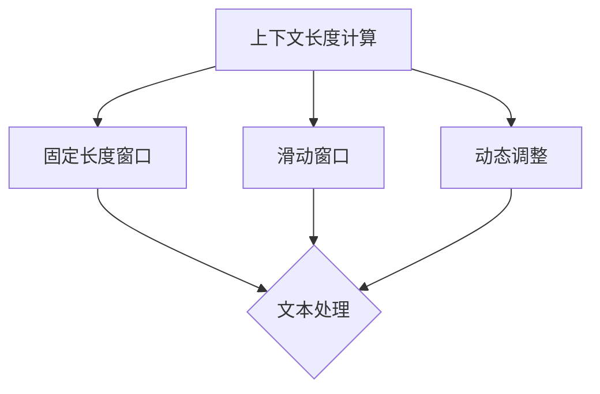

                 

关键词：上下文长度、自然语言处理、语言理解能力、机器学习、神经网络、序列模型、文本生成、人工智能

> 摘要：本文将探讨上下文长度在自然语言处理中的重要性，分析其在机器学习和神经网络中的应用，并探讨上下文长度对于语言理解能力的影响。通过介绍序列模型和文本生成技术，本文将探讨如何通过优化上下文长度来提升语言理解能力，并展望未来的发展趋势。

## 1. 背景介绍

自然语言处理（Natural Language Processing，NLP）作为人工智能领域的一个重要分支，旨在使计算机能够理解、生成和处理自然语言。随着深度学习技术的发展，神经网络在NLP领域取得了显著的成果，使得计算机能够更好地理解和生成自然语言。然而，在自然语言处理中，如何有效地处理上下文信息成为了关键问题。上下文长度作为上下文信息的一个量化指标，对于提升语言理解能力具有重要意义。

上下文长度是指在特定场景下，与当前词相关的文本长度。上下文长度越长，包含的信息量越多，有助于提高语言理解能力。然而，过长的上下文长度可能导致计算复杂度增加，影响模型性能。因此，如何平衡上下文长度与计算复杂度，提高语言理解能力成为当前研究的热点。

## 2. 核心概念与联系

### 2.1 上下文长度概念

上下文长度是指在特定场景下，与当前词相关的文本长度。它可以用来量化上下文信息的重要性，从而影响语言理解能力。在自然语言处理中，上下文长度通常表示为当前词前后的一定数量的词汇。

### 2.2 上下文长度的计算方法

上下文长度的计算方法主要有以下几种：

1. **固定长度窗口**：在处理文本时，将当前词前后的一定数量的词汇作为上下文，上下文长度为固定值。

2. **滑动窗口**：在处理文本时，以当前词为中心，逐步向前或向后移动，每次移动一定数量的词汇，形成多个窗口，取窗口中的最大长度作为上下文长度。

3. **动态调整**：根据文本内容和任务需求，动态调整上下文长度，以适应不同的场景。

### 2.3 上下文长度的作用

1. **增强语言理解能力**：上下文长度越长，包含的信息量越多，有助于计算机更好地理解文本内容。

2. **降低误解风险**：在自然语言处理中，上下文长度有助于减少对词语的误解，提高文本处理的准确性。

3. **优化计算复杂度**：适当调整上下文长度，可以在保证语言理解能力的同时，降低计算复杂度，提高模型性能。

### 2.4 上下文长度的 Mermaid 流程图



## 3. 核心算法原理 & 具体操作步骤

### 3.1 算法原理概述

在自然语言处理中，核心算法主要涉及序列模型和文本生成技术。序列模型通过对输入序列进行处理，提取序列中的特征信息，从而实现对文本内容的理解和生成。文本生成技术则利用序列模型生成具有自然语言特性的文本。

### 3.2 算法步骤详解

1. **序列模型训练**：首先，利用大规模文本语料库，通过预训练技术，训练一个预训练模型，如BERT、GPT等。预训练模型通过学习文本的语义信息，提高语言理解能力。

2. **序列模型微调**：在特定任务上，利用预训练模型，通过微调技术，调整模型参数，使其适应特定任务的需求。例如，在文本分类任务中，利用微调后的模型对文本进行分类。

3. **文本生成**：利用微调后的模型，生成具有自然语言特性的文本。例如，在生成文本摘要任务中，利用模型生成简洁、准确的文本摘要。

### 3.3 算法优缺点

1. **优点**：
   - 提高语言理解能力：通过预训练和微调技术，模型能够更好地理解文本内容，提高语言理解能力。
   - 生成自然语言文本：利用序列模型生成文本，具有自然语言特性，易于理解和处理。

2. **缺点**：
   - 计算复杂度高：序列模型涉及大量的参数训练，计算复杂度较高，对硬件资源要求较高。
   - 数据依赖性强：序列模型在训练过程中需要大量高质量的数据，数据质量直接影响模型性能。

### 3.4 算法应用领域

1. **文本分类**：利用序列模型对文本进行分类，如情感分析、新闻分类等。

2. **文本摘要**：利用序列模型生成简洁、准确的文本摘要。

3. **问答系统**：利用序列模型实现智能问答，如搜索引擎、对话系统等。

## 4. 数学模型和公式 & 详细讲解 & 举例说明

### 4.1 数学模型构建

在自然语言处理中，常用的数学模型包括序列模型和生成模型。序列模型主要涉及循环神经网络（RNN）、长短期记忆网络（LSTM）和门控循环单元（GRU）等。生成模型主要涉及变分自编码器（VAE）和生成对抗网络（GAN）等。

### 4.2 公式推导过程

以下以循环神经网络（RNN）为例，介绍数学模型的具体推导过程。

1. **输入向量表示**：假设输入序列为\( x_1, x_2, ..., x_T \)，其中\( x_t \)为第\( t \)个词的向量表示。

2. **隐藏层状态更新**：循环神经网络通过隐藏层状态\( h_t \)来表示当前时刻的上下文信息。隐藏层状态更新公式为：

   $$ h_t = \sigma(W_h \cdot [h_{t-1}, x_t] + b_h) $$

   其中，\( W_h \)为权重矩阵，\( b_h \)为偏置项，\( \sigma \)为激活函数，如ReLU函数。

3. **输出向量表示**：循环神经网络通过输出层输出向量\( y_t \)来表示当前时刻的预测结果。输出层公式为：

   $$ y_t = \sigma(W_y \cdot h_t + b_y) $$

   其中，\( W_y \)为权重矩阵，\( b_y \)为偏置项，\( \sigma \)为激活函数。

### 4.3 案例分析与讲解

以下以情感分析任务为例，介绍循环神经网络在自然语言处理中的应用。

1. **数据准备**：首先，收集大量带有情感标签的文本数据，如正面、负面等。

2. **数据预处理**：对文本数据进行分词、去停用词等预处理操作。

3. **模型训练**：利用预处理后的数据，训练循环神经网络模型。通过优化模型参数，提高模型性能。

4. **模型评估**：在测试集上评估模型性能，如准确率、召回率等。

5. **模型应用**：利用训练好的模型，对新的文本数据进行情感分析，预测其情感标签。

## 5. 项目实践：代码实例和详细解释说明

### 5.1 开发环境搭建

1. 安装Python环境（如Python 3.8及以上版本）。
2. 安装自然语言处理库（如NLTK、spaCy等）。
3. 安装深度学习框架（如TensorFlow、PyTorch等）。

### 5.2 源代码详细实现

以下是一个简单的情感分析项目的实现过程：

```python
import tensorflow as tf
from tensorflow.keras.layers import Embedding, LSTM, Dense
from tensorflow.keras.models import Sequential

# 数据预处理
def preprocess_text(text):
    # 分词、去停用词等操作
    return processed_text

# 构建模型
model = Sequential()
model.add(Embedding(input_dim=vocab_size, output_dim=embedding_size))
model.add(LSTM(units=128, activation='relu'))
model.add(Dense(units=num_classes, activation='softmax'))

# 编译模型
model.compile(optimizer='adam', loss='categorical_crossentropy', metrics=['accuracy'])

# 训练模型
model.fit(x_train, y_train, epochs=10, batch_size=32)

# 评估模型
model.evaluate(x_test, y_test)
```

### 5.3 代码解读与分析

以上代码实现了一个简单的情感分析项目。首先，对文本数据进行预处理，包括分词、去停用词等操作。然后，构建一个序列模型，包括嵌入层、LSTM层和输出层。嵌入层将文本数据转换为词向量，LSTM层处理文本序列，输出层进行情感分类。最后，编译模型并训练，评估模型性能。

## 6. 实际应用场景

### 6.1 问答系统

上下文长度在问答系统中具有重要意义。通过适当调整上下文长度，可以使计算机更好地理解用户的问题，提高问答系统的准确性。

### 6.2 文本生成

上下文长度在文本生成任务中也有重要应用。通过优化上下文长度，可以生成更具连贯性和自然性的文本。

### 6.3 情感分析

在情感分析任务中，上下文长度有助于提高情感分类的准确性。适当调整上下文长度，可以更好地捕捉文本中的情感信息。

## 7. 未来应用展望

随着自然语言处理技术的不断发展，上下文长度将在更多领域得到应用。未来，我们可以期待上下文长度在多模态任务、跨领域任务等方面的应用，进一步提升语言理解能力。

## 8. 总结：未来发展趋势与挑战

随着深度学习技术的不断发展，上下文长度在自然语言处理中的应用将越来越广泛。未来，我们需要关注以下几个方面：

1. **优化上下文长度计算方法**：研究更高效的上下文长度计算方法，降低计算复杂度。
2. **多模态上下文长度研究**：探索多模态数据中的上下文长度计算，提高多模态任务的语言理解能力。
3. **跨领域上下文长度应用**：研究跨领域上下文长度的计算和应用，提高跨领域任务的语言理解能力。

## 9. 附录：常见问题与解答

### 9.1 什么是上下文长度？

上下文长度是指在特定场景下，与当前词相关的文本长度。它可以用来量化上下文信息的重要性，从而影响语言理解能力。

### 9.2 上下文长度如何影响语言理解能力？

适当调整上下文长度可以增强语言理解能力，提高文本处理的准确性。过长的上下文长度可能导致计算复杂度增加，影响模型性能。

### 9.3 上下文长度的计算方法有哪些？

上下文长度的计算方法主要有固定长度窗口、滑动窗口和动态调整等。

### 9.4 上下文长度在自然语言处理中的应用有哪些？

上下文长度在问答系统、文本生成、情感分析等任务中具有重要应用。

----------------------------------------------------------------

作者：禅与计算机程序设计艺术 / Zen and the Art of Computer Programming


