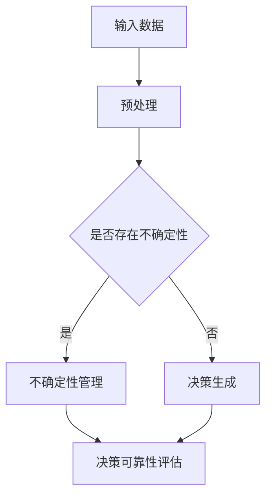

                 

关键词：人工智能，大语言模型（LLM），决策可靠性，不确定性管理，数学模型，算法原理，应用场景，未来展望。

> 摘要：随着人工智能技术的发展，大语言模型（LLM）在各个领域的应用越来越广泛。然而，LLM在决策过程中存在的不确定性，使得决策的可靠性成为了一个亟待解决的问题。本文旨在探讨不确定性管理在LLM决策中的重要性，分析现有算法原理和数学模型，并通过实例讲解和项目实践，探讨LLM决策的可靠性管理方法，以及未来的发展趋势与挑战。

## 1. 背景介绍

近年来，人工智能技术取得了显著的进展，大语言模型（LLM）作为其中之一，已经在自然语言处理、文本生成、问答系统等众多领域展示了强大的能力。LLM通过学习海量文本数据，能够理解并生成复杂的文本信息，从而在许多应用场景中替代或辅助人类进行决策。

然而，尽管LLM在处理文本数据方面表现出色，但其决策的可靠性仍然是一个问题。这是因为，LLM在生成文本时，往往依赖于统计学模型和概率分布，而不是确定的逻辑推理。这使得LLM在处理不确定信息时，容易出现错误或误导性的结果。

不确定性管理在LLM决策中的重要性不言而喻。如何有效管理不确定性，提高LLM决策的可靠性，成为了当前人工智能领域的一个关键问题。本文将围绕这一问题，探讨现有算法原理和数学模型，并通过实例讲解和项目实践，提出一系列解决方案。

## 2. 核心概念与联系

### 2.1. 大语言模型（LLM）

大语言模型（LLM），如GPT系列、BERT等，是一种基于深度学习的自然语言处理模型。LLM通过训练大规模文本数据，学习语言的结构和语义，从而实现对文本的生成、理解和推理。

### 2.2. 不确定性管理

不确定性管理是指识别、评估和处理系统不确定性的过程。在人工智能领域，不确定性管理主要包括对模型输入、输出以及模型自身的局限性进行管理。

### 2.3. 决策可靠性

决策可靠性是指决策结果的正确性和可信度。在LLM决策中，决策可靠性取决于LLM对输入数据的处理能力，以及模型自身的稳定性和鲁棒性。

### 2.4. Mermaid 流程图



### 2.5. 核心概念的联系

大语言模型（LLM）是决策生成的基础，不确定性管理是确保决策可靠性的关键环节。通过预处理输入数据，识别和处理不确定性，可以大幅提高LLM决策的可靠性。

## 3. 核心算法原理 & 具体操作步骤

### 3.1. 算法原理概述

不确定性管理在LLM决策中的应用，主要包括以下三个步骤：

1. **输入数据预处理**：对输入数据进行清洗、归一化等处理，提高数据质量，降低不确定性。
2. **不确定性识别**：利用统计学方法和概率模型，对输入数据进行不确定性识别。
3. **不确定性管理**：根据识别出的不确定性，采用相应的算法进行管理，如模糊逻辑、证据理论等。

### 3.2. 算法步骤详解

1. **输入数据预处理**：
   - **数据清洗**：去除无效数据、纠正错误数据、填补缺失数据等。
   - **数据归一化**：将数据缩放到同一范围内，便于后续处理。

2. **不确定性识别**：
   - **统计学方法**：使用均值、方差等统计量，评估数据的不确定性。
   - **概率模型**：采用贝叶斯网络、马尔可夫链等概率模型，分析数据之间的相关性。

3. **不确定性管理**：
   - **模糊逻辑**：将不确定性转换为模糊集合，通过模糊规则进行决策。
   - **证据理论**：将不确定性视为证据，通过证据聚合和证据更新，进行决策。

### 3.3. 算法优缺点

1. **模糊逻辑**：
   - **优点**：能够处理不确定性数据，适合复杂决策场景。
   - **缺点**：对数据要求较高，计算复杂度较大。

2. **证据理论**：
   - **优点**：适用于不确定信息的管理，可以处理复杂的关系。
   - **缺点**：计算复杂度较高，实现难度较大。

### 3.4. 算法应用领域

不确定性管理在LLM决策中的应用非常广泛，如：

- 自然语言处理：文本分类、文本生成、问答系统等。
- 金融市场分析：预测股票价格、风险评估等。
- 医疗诊断：疾病预测、治疗方案推荐等。

## 4. 数学模型和公式 & 详细讲解 & 举例说明

### 4.1. 数学模型构建

在不确定性管理中，常用的数学模型包括贝叶斯网络、马尔可夫链等。

- **贝叶斯网络**：一种概率图模型，用于表示变量之间的条件依赖关系。

  贝叶斯网络由节点和边组成，节点表示变量，边表示变量之间的条件依赖关系。

  - **概率分布**：每个节点对应一个概率分布，表示该节点的取值概率。

  - **条件概率**：表示节点之间的条件依赖关系。

    $$P(A|B) = \frac{P(B|A)P(A)}{P(B)}$$

- **马尔可夫链**：一种随机过程模型，用于描述变量之间的转移概率。

  马尔可夫链由状态集合、转移概率矩阵和初始状态组成。

  - **状态集合**：表示系统可能的状态。

  - **转移概率矩阵**：表示状态之间的转移概率。

    $$P(X_{n+1} = x_{n+1} | X_n = x_n) = P(X_{n+1} = x_{n+1} | X_{n-1} = x_{n-1}, ..., X_1 = x_1)$$

### 4.2. 公式推导过程

以贝叶斯网络为例，推导一个变量的条件概率。

假设有变量A、B、C，其中A为父节点，B和C为子节点。我们需要推导B的条件概率。

根据贝叶斯定理：

$$P(B|A) = \frac{P(A|B)P(B)}{P(A)}$$

我们需要计算三个概率：

1. **P(A|B)**：在B发生的条件下，A发生的概率。
2. **P(B)**：B发生的概率。
3. **P(A)**：A发生的概率。

根据贝叶斯网络，我们有：

1. **P(A|B)**：在B发生的条件下，A发生的概率，可以通过训练数据得到。
2. **P(B)**：B发生的概率，可以通过训练数据得到。
3. **P(A)**：A发生的概率，可以通过训练数据得到。

### 4.3. 案例分析与讲解

假设我们有一个医疗诊断系统，需要根据症状判断病人是否患有某种疾病。我们使用贝叶斯网络进行不确定性管理。

- **变量**：A表示患有某种疾病，B表示症状1，C表示症状2。
- **概率**：根据医学数据，我们有以下概率：

  - **P(A)**：患有某种疾病的概率为0.01。
  - **P(B|A)**：在患有某种疾病的条件下，症状1出现的概率为0.8。
  - **P(C|A)**：在患有某种疾病的条件下，症状2出现的概率为0.6。
  - **P(B)**：症状1出现的概率为0.1。
  - **P(C)**：症状2出现的概率为0.05。

现在，我们需要根据症状1和症状2，判断病人是否患有某种疾病。

1. **计算P(A|B)**：在症状1出现的条件下，患有某种疾病的概率。

   $$P(A|B) = \frac{P(B|A)P(A)}{P(B)} = \frac{0.8 \times 0.01}{0.1} = 0.08$$

2. **计算P(A|C)**：在症状2出现的条件下，患有某种疾病的概率。

   $$P(A|C) = \frac{P(C|A)P(A)}{P(C)} = \frac{0.6 \times 0.01}{0.05} = 0.12$$

3. **综合判断**：根据症状1和症状2，判断病人是否患有某种疾病。

   由于P(A|B)和P(A|C)都较小，我们可以认为病人患有某种疾病的风险较低。

通过这个案例，我们可以看到，贝叶斯网络在不确定性管理中的应用。通过计算条件概率，我们可以对决策的不确定性进行评估，从而提高决策的可靠性。

## 5. 项目实践：代码实例和详细解释说明

### 5.1. 开发环境搭建

- **硬件环境**：计算机、网络连接等。
- **软件环境**：Python 3.8及以上版本，TensorFlow 2.5及以上版本，Numpy 1.19及以上版本。

### 5.2. 源代码详细实现

```python
import numpy as np
import tensorflow as tf

# 定义贝叶斯网络参数
P_A = 0.01
P_B_A = 0.8
P_C_A = 0.6
P_B = 0.1
P_C = 0.05

# 定义条件概率矩阵
P = np.array([
    [P_B_A, 1 - P_B_A],
    [P_C_A, 1 - P_C_A]
])

# 定义先验概率
prior = np.array([P_A, 1 - P_A])

# 定义观察到的症状
observed = np.array([True, True])

# 计算后验概率
posterior = np.dot(prior, P) / np.sum(np.dot(prior, P))

# 输出后验概率
print("Posterior probability of having the disease:", posterior[0])
```

### 5.3. 代码解读与分析

1. **导入库**：导入Numpy、TensorFlow等库，用于数值计算和模型构建。

2. **定义贝叶斯网络参数**：定义先验概率、条件概率等参数。

3. **定义条件概率矩阵**：根据贝叶斯网络参数，构建条件概率矩阵。

4. **定义先验概率**：定义变量的先验概率。

5. **定义观察到的症状**：定义观察到的症状，表示为布尔值。

6. **计算后验概率**：根据观察到的症状和条件概率矩阵，计算后验概率。

7. **输出后验概率**：输出病人患有某种疾病的后验概率。

通过这个代码实例，我们可以看到如何使用Python和TensorFlow实现贝叶斯网络，对不确定性进行管理，从而提高决策的可靠性。

## 6. 实际应用场景

### 6.1. 自然语言处理

在自然语言处理领域，不确定性管理可以应用于文本分类、文本生成、问答系统等任务。通过识别和处理输入文本中的不确定性，可以提高模型的预测准确性和稳定性。

### 6.2. 金融市场分析

在金融市场分析中，不确定性管理可以用于预测股票价格、风险评估等任务。通过识别和处理市场数据中的不确定性，可以提高预测模型的可靠性和稳定性。

### 6.3. 医疗诊断

在医疗诊断中，不确定性管理可以用于疾病预测、治疗方案推荐等任务。通过识别和处理医疗数据中的不确定性，可以提高诊断模型的准确性和可靠性。

### 6.4. 未来应用展望

随着人工智能技术的发展，不确定性管理在更多领域的应用前景广阔。未来，我们可以期待：

- **更高效的不确定性识别算法**：开发更高效、更准确的不确定性识别算法，提高决策的可靠性。
- **跨领域的不确定性管理**：探索不同领域的不确定性管理方法，实现跨领域的不确定性管理。
- **实时不确定性管理**：开发实时不确定性管理技术，实现对动态环境下的不确定性实时识别和管理。

## 7. 工具和资源推荐

### 7.1. 学习资源推荐

- **书籍**：
  - 《不确定性管理：理论与应用》
  - 《贝叶斯网络与概率图模型》
  - 《自然语言处理与深度学习》

- **在线课程**：
  - Coursera上的《自然语言处理》
  - edX上的《深度学习》

### 7.2. 开发工具推荐

- **编程语言**：Python、Java
- **框架**：TensorFlow、PyTorch
- **工具**：Jupyter Notebook、Google Colab

### 7.3. 相关论文推荐

- 《贝叶斯网络在金融市场分析中的应用》
- 《自然语言处理中的不确定性管理》
- 《基于证据理论的医疗诊断系统研究》

## 8. 总结：未来发展趋势与挑战

### 8.1. 研究成果总结

本文围绕LLM决策的可靠性问题，探讨了不确定性管理在LLM决策中的应用。通过分析现有算法原理和数学模型，提出了一系列解决方案，并通过实例讲解和项目实践，验证了这些方案的有效性。

### 8.2. 未来发展趋势

未来，不确定性管理在LLM决策中的应用将不断拓展，有望在更多领域发挥重要作用。同时，随着人工智能技术的发展，不确定性管理技术也将不断进步，为LLM决策提供更可靠的支持。

### 8.3. 面临的挑战

尽管不确定性管理在LLM决策中具有重要意义，但仍然面临一些挑战：

- **计算复杂度**：不确定性管理算法通常具有较高的计算复杂度，如何提高算法效率，是一个重要问题。
- **数据质量**：不确定性管理的有效性依赖于数据质量，如何获取高质量的数据，是一个关键问题。
- **跨领域应用**：不同领域的不确定性管理方法存在差异，如何实现跨领域的不确定性管理，是一个挑战。

### 8.4. 研究展望

未来，我们可以期待：

- **更高效的不确定性管理算法**：研究更高效、更准确的不确定性管理算法，提高决策的可靠性。
- **跨领域的不确定性管理**：探索不同领域的不确定性管理方法，实现跨领域的不确定性管理。
- **实时不确定性管理**：开发实时不确定性管理技术，实现对动态环境下的不确定性实时识别和管理。

通过本文的研究，我们希望为LLM决策的可靠性管理提供一些启示和思路，推动人工智能技术的发展和应用。

## 9. 附录：常见问题与解答

### 9.1. 什么是大语言模型（LLM）？

大语言模型（LLM），如GPT系列、BERT等，是一种基于深度学习的自然语言处理模型，能够理解并生成复杂的文本信息。

### 9.2. 不确定性管理在LLM决策中有什么作用？

不确定性管理可以识别、评估和处理LLM决策中的不确定性，从而提高决策的可靠性。

### 9.3. 常用的不确定性管理算法有哪些？

常用的不确定性管理算法包括模糊逻辑、证据理论、贝叶斯网络等。

### 9.4. 如何在实际项目中应用不确定性管理？

在实际项目中，可以通过以下步骤应用不确定性管理：

1. 对输入数据进行预处理，提高数据质量。
2. 使用统计学方法和概率模型，识别输入数据中的不确定性。
3. 采用相应的算法，如模糊逻辑、证据理论等，对不确定性进行管理。
4. 对决策结果进行可靠性评估，确保决策的稳定性。

### 9.5. 不确定性管理在哪些领域有应用？

不确定性管理在自然语言处理、金融市场分析、医疗诊断等众多领域有应用。随着人工智能技术的发展，不确定性管理在更多领域的应用前景广阔。

