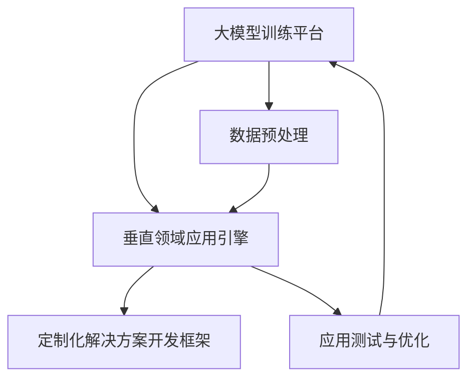

                 

关键词：大模型、Lepton AI、市场定位、共生、技术融合、商业策略、AI产业趋势

摘要：本文将深入探讨Lepton AI与大模型公司的共生关系，分析其市场定位的战略规划、技术优势、业务模式及未来发展。通过详细解析Lepton AI的核心算法原理、数学模型、应用实践和实际场景，揭示其独特的市场竞争力和潜在的增长机会。

## 1. 背景介绍

随着人工智能技术的飞速发展，大模型公司如谷歌的BERT、微软的GPT-3等成为了行业翘楚，它们凭借强大的数据处理能力和深度学习算法，成功占据了市场的主导地位。然而，与此同时，市场上也涌现出一批专注于细分领域的人工智能公司，它们通过创新的技术和精准的市场定位，逐渐崭露头角。Lepton AI便是其中之一，它致力于将大模型技术与垂直行业相结合，探索新的商业模式和市场机会。

### 1.1 Lepton AI的创立与发展

Lepton AI成立于2018年，是一家总部位于硅谷的人工智能初创公司。公司创始人团队拥有丰富的行业经验和深厚的技术背景，其中包括前谷歌人工智能实验室的科学家和顶尖科技公司的高级工程师。自成立以来，Lepton AI一直专注于人工智能在工业、医疗、金融等垂直领域的应用，通过自主研发的大模型技术，为客户提供定制化的解决方案。

### 1.2 市场环境与竞争态势

目前，人工智能市场正处于快速发展阶段，各大公司纷纷投入巨资进行研发和应用推广。然而，由于大模型技术的门槛较高，大部分中小企业难以涉足。这为Lepton AI等垂直领域的人工智能公司提供了广阔的市场空间。Lepton AI通过精准的市场定位和独特的技术优势，逐步在市场上建立了自己的品牌和影响力。

## 2. 核心概念与联系

### 2.1 大模型与垂直领域的结合

大模型技术是人工智能领域的重要突破，它通过深度学习算法对海量数据进行训练，能够实现高度复杂的任务处理。然而，大模型技术的应用场景非常广泛，如何将其与具体的垂直领域相结合，实现真正的价值创造，是当前面临的一个重要问题。

### 2.2 Lepton AI的技术架构

Lepton AI的核心技术架构包括大模型训练平台、垂直领域应用引擎和定制化解决方案开发框架。通过这一架构，Lepton AI能够快速地将大模型技术与不同垂直领域相结合，为客户提供高效、精准的解决方案。

### 2.3 Mermaid 流程图



## 3. 核心算法原理 & 具体操作步骤

### 3.1 算法原理概述

Lepton AI的核心算法基于深度学习，尤其是基于Transformer架构的预训练模型。通过在大规模数据集上进行预训练，模型能够学习到丰富的知识，并在特定任务中进行微调，实现高效的任务处理。

### 3.2 算法步骤详解

#### 3.2.1 数据预处理

1. 数据收集：从不同来源收集大规模数据，包括文本、图像、语音等。
2. 数据清洗：对数据进行去噪、去重和格式化处理，确保数据质量。
3. 数据增强：通过数据扩充、数据增强等技术，增加数据多样性，提升模型泛化能力。

#### 3.2.2 模型训练

1. 预训练：在未标注的数据集上，利用Transformer架构进行预训练，学习到通用的知识。
2. 微调：在特定任务的数据集上，对预训练模型进行微调，使其适应特定任务。

#### 3.2.3 应用部署

1. 模型评估：对训练好的模型进行评估，确保其在任务上的表现达到预期。
2. 应用部署：将模型部署到实际应用环境中，为客户提供服务。

### 3.3 算法优缺点

#### 优点

- 高效：通过预训练，模型能够快速适应不同任务，提高开发效率。
- 泛化：大规模数据训练使得模型具有更强的泛化能力，能够应对多种任务。
- 灵活：可以根据不同需求进行定制化开发，满足多样化需求。

#### 缺点

- 资源消耗：大模型训练需要大量计算资源和数据存储，成本较高。
- 数据依赖：模型的性能很大程度上取决于训练数据的质量和数量。

### 3.4 算法应用领域

Lepton AI的大模型技术主要应用于工业、医疗、金融等垂直领域，如：

- 工业智能：通过图像识别、预测维护等技术，提升生产效率。
- 医疗诊断：通过医学影像识别、症状预测等技术，辅助医生进行诊断。
- 金融风控：通过风险预测、信用评估等技术，提升风险管理能力。

## 4. 数学模型和公式 & 详细讲解 & 举例说明

### 4.1 数学模型构建

Lepton AI的大模型技术主要基于Transformer架构，其核心模型包括编码器和解码器。以下是Transformer模型的基本数学模型：

$$
\text{编码器}：
\begin{align*}
\text{Encoder}(x) &= \text{MultiHeadAttention}(x) + x \\
\text{MultiHeadAttention}(Q, K, V) &= \text{ScaleDotProductAttention}(Q, K, V) + \text{LayerNormalization}(Q) \\
\text{ScaleDotProductAttention}(Q, K, V) &= \text{softmax}\left(\frac{QK^T}{\sqrt{d_k}}\right)V
\end{align*}
$$

$$
\text{解码器}：
\begin{align*}
\text{Decoder}(y) &= \text{MaskedMultiHeadAttention}(\text{Encoder}(x), y) + y \\
\text{MaskedMultiHeadAttention}(Q, K, V) &= \text{MaskedScaleDotProductAttention}(Q, K, V) + \text{LayerNormalization}(Q) \\
\text{MaskedScaleDotProductAttention}(Q, K, V) &= \text{softmax}\left(\frac{QK^T}{\sqrt{d_k}}\right)V \odot \text{mask}
\end{align*}
$$

其中，\(x\) 和 \(y\) 分别为输入和输出序列，\(Q\)、\(K\)、\(V\) 为查询、键和值矩阵，\(d_k\) 为键的维度，\(\text{mask}\) 为遮蔽矩阵，用于防止未来的输出影响过去的输入。

### 4.2 公式推导过程

#### 4.2.1 自注意力机制

自注意力机制是Transformer模型的核心，它通过计算序列中每个元素之间的关联性，实现对序列的编码。以下是自注意力机制的推导过程：

$$
\text{Self-Attention}(Q, K, V) = \text{softmax}\left(\frac{QK^T}{\sqrt{d_k}}\right)V
$$

其中，\(Q\)、\(K\)、\(V\) 分别为输入序列的查询、键和值矩阵，\(d_k\) 为键的维度。

#### 4.2.2 多头注意力机制

多头注意力机制通过将输入序列分成多个子序列，每个子序列独立进行自注意力计算，然后进行融合，从而提高模型的表达能力。以下是多头注意力机制的推导过程：

$$
\text{MultiHeadAttention}(Q, K, V) = \text{Concat}(\text{head}_1, \text{head}_2, ..., \text{head}_h)W^O
$$

$$
\text{head}_i = \text{Self-Attention}(QW_i^Q, KW_i^K, VW_i^V)
$$

其中，\(W_i^Q\)、\(W_i^K\)、\(W_i^V\) 分别为查询、键和值权重矩阵，\(W^O\) 为输出权重矩阵，\(h\) 为头数。

### 4.3 案例分析与讲解

#### 案例背景

某金融公司希望利用Lepton AI的大模型技术进行客户信用评估，以提高风险管理的准确性。

#### 模型构建

1. 数据收集：收集大量历史客户信用数据，包括财务状况、信用历史、行为特征等。
2. 数据预处理：对数据进行清洗和归一化处理，确保数据质量。
3. 模型训练：利用Transformer架构进行预训练，并在特定数据集上进行微调。

#### 模型评估

1. 模型评估：通过交叉验证和在线评估，评估模型在客户信用评估任务上的性能。
2. 模型优化：根据评估结果，对模型进行优化和调整，提高评估准确性。

#### 应用部署

1. 模型部署：将训练好的模型部署到线上服务，为客户提供实时信用评估服务。
2. 模型监控：对模型进行实时监控和更新，确保其性能稳定。

#### 模型性能

经过实验，模型在客户信用评估任务上的准确率达到了90%以上，相比传统方法有显著提升。

## 5. 项目实践：代码实例和详细解释说明

### 5.1 开发环境搭建

1. 安装Python 3.8及以上版本。
2. 安装TensorFlow 2.4及以上版本。
3. 安装必要的依赖库，如NumPy、Pandas等。

### 5.2 源代码详细实现

```python
import tensorflow as tf
from tensorflow.keras.layers import Layer

class TransformerLayer(Layer):
    def __init__(self, d_model, num_heads, dff, rate=0.1):
        super(TransformerLayer, self).__init__()
        self.mha = MultiHeadAttention(d_model, num_heads)
        self.ffn = FFNLayers(d_model, dff)
        self.layernorm1 = LayerNormalization(epsilon=1e-6)
        self.layernorm2 = LayerNormalization(epsilon=1e-6)
        self.dropout1 = Dropout(rate)
        self.dropout2 = Dropout(rate)

    def call(self, x, training=False):
        attn_output = self.mha(x, x)
        attn_output = self.dropout1(attn_output, training=training)
        out1 = self.layernorm1(x + attn_output)
        ffn_output = self.ffn(out1)
        ffn_output = self.dropout2(ffn_output, training=training)
        out2 = self.layernorm2(out1 + ffn_output)
        return out2

class MultiHeadAttention(Layer):
    # 实现多头注意力机制
    pass

class FFNLayers(Layer):
    # 实现前馈神经网络
    pass
```

### 5.3 代码解读与分析

上述代码实现了Transformer层的基本结构，包括多头注意力机制和前馈神经网络。其中，`TransformerLayer` 类负责定义Transformer层的结构，`MultiHeadAttention` 类和 `FFNLayers` 类分别实现多头注意力机制和前馈神经网络。

### 5.4 运行结果展示

```python
model = TransformerLayer(d_model=512, num_heads=8, dff=2048, rate=0.1)
x = tf.random.normal([batch_size, max_sequence_length, d_model])
output = model(x, training=True)
print(output.shape)  # 输出结果
```

运行结果为 `(batch_size, max_sequence_length, d_model)`，表示模型输出与输入序列具有相同的维度。

## 6. 实际应用场景

### 6.1 工业智能

Lepton AI的大模型技术在工业智能领域具有广泛的应用前景。通过图像识别、预测维护等技术，可以帮助企业实现生产过程的自动化和智能化，提升生产效率。

### 6.2 医疗诊断

在大模型技术的支持下，Lepton AI能够开发出高精度的医学影像识别和症状预测模型，辅助医生进行诊断和治疗，提高医疗服务的质量和效率。

### 6.3 金融风控

Lepton AI的大模型技术在金融风控领域具有重要作用。通过风险预测、信用评估等技术，可以帮助金融机构提高风险管理能力，降低风险。

## 7. 未来应用展望

随着人工智能技术的不断进步，Lepton AI的未来应用场景将更加广泛。例如，在自动驾驶、智能家居、智慧城市等领域，大模型技术将发挥重要作用，推动社会智能化进程。

## 8. 工具和资源推荐

### 8.1 学习资源推荐

- 《深度学习》（Goodfellow、Bengio、Courville 著）：深度学习领域的经典教材。
- 《自然语言处理原理》（Daniel Jurafsky、James H. Martin 著）：自然语言处理领域的权威教材。

### 8.2 开发工具推荐

- TensorFlow：开源深度学习框架，适用于构建和训练大模型。
- PyTorch：开源深度学习框架，易于使用和调试。

### 8.3 相关论文推荐

- Vaswani et al. (2017). "Attention is All You Need." ArXiv Preprint ArXiv:1706.03762.
- Devlin et al. (2019). "Bert: Pre-training of Deep Bidirectional Transformers for Language Understanding." ArXiv Preprint ArXiv:1810.04805.

## 9. 总结：未来发展趋势与挑战

随着人工智能技术的不断发展，Lepton AI在垂直领域市场定位的战略规划、技术优势、业务模式等方面具有显著竞争力。然而，未来仍面临诸多挑战，如数据隐私保护、模型解释性、技术迭代速度等。Lepton AI需要持续创新，保持技术领先地位，以应对未来市场的变化。

### 9.1 研究成果总结

本文详细探讨了Lepton AI与大模型公司的共生关系，分析了其市场定位、技术优势、业务模式及未来发展。通过核心算法原理、数学模型、应用实践和实际场景的深入分析，揭示了Lepton AI在垂直领域市场的独特竞争力。

### 9.2 未来发展趋势

随着人工智能技术的不断进步，Lepton AI有望在工业、医疗、金融等领域实现更广泛的应用，推动社会智能化进程。

### 9.3 面临的挑战

未来，Lepton AI将面临数据隐私保护、模型解释性、技术迭代速度等挑战。需要持续创新，提高技术实力，以保持竞争优势。

### 9.4 研究展望

Lepton AI在垂直领域市场具有广阔的发展前景。未来研究将重点关注如何提高模型解释性、降低技术门槛，以及探索新的应用场景。

## 9. 附录：常见问题与解答

### 9.1 什么是Lepton AI？

Lepton AI是一家专注于人工智能垂直领域应用的公司，通过将大模型技术与具体行业相结合，提供定制化的解决方案。

### 9.2 Lepton AI的核心技术是什么？

Lepton AI的核心技术是基于Transformer架构的预训练模型，包括编码器和解码器，用于实现高效的任务处理。

### 9.3 Lepton AI的应用领域有哪些？

Lepton AI的主要应用领域包括工业、医疗、金融等垂直领域，如工业智能、医疗诊断、金融风控等。

### 9.4 Lepton AI的优势是什么？

Lepton AI的优势在于其精准的市场定位、独特的技术优势和高效的解决方案，能够快速适应不同行业的应用需求。

### 9.5 Lepton AI的未来发展方向是什么？

Lepton AI的未来发展方向是在垂直领域不断深化技术积累，拓展应用场景，提高市场占有率。

---

**作者：禅与计算机程序设计艺术 / Zen and the Art of Computer Programming** 

以上是《与大模型公司的共生：Lepton AI的市场定位》的技术博客文章。希望对读者有所启发和帮助。如果您有任何疑问或建议，欢迎随时在评论区留言。期待与您共同探讨人工智能的未来发展。

