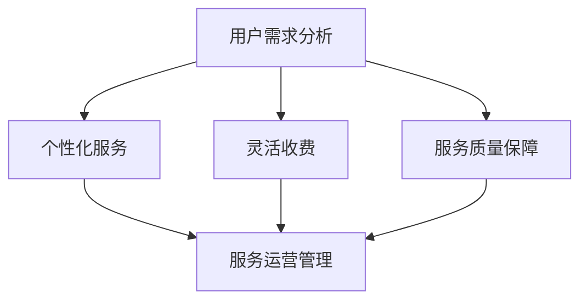

                 

在这个快速发展的数字化时代，人工智能（AI）正在成为各行各业的关键驱动力。AI技术的应用已经从简单的自动化工具，逐渐扩展到提供个性化服务、提升用户体验等多个层面。然而，随着AI技术的不断进步，如何为个人用户提供高效、便捷且可持续的AI服务成为了一个亟待解决的问题。本文将探讨个人用户AI服务的订阅模式创新，旨在为相关领域的研究者和从业者提供一些有价值的思考和建议。

## 关键词
- 个人用户AI服务
- 订阅模式创新
- 用户体验
- 服务个性化
- 可持续发展

## 摘要
本文将深入探讨个人用户AI服务的订阅模式创新。通过对当前AI服务订阅模式的现状分析，我们提出了一种基于用户体验和个性化需求的订阅模式。文章将详细介绍这一模式的核心理念、具体实现步骤以及可能的应用领域。同时，我们将讨论这一模式在实践中的优缺点，并展望其未来的发展趋势和面临的挑战。

## 1. 背景介绍

近年来，AI技术在各个领域的应用取得了显著进展。从自动驾驶到智能家居，从医疗诊断到金融服务，AI正在改变我们的生活方式和工作方式。对于个人用户而言，AI服务不仅提供了便利，还在一定程度上提升了生活质量和工作效率。然而，现有的AI服务订阅模式存在一些问题，如服务同质化、用户体验不佳等，这使得个人用户难以找到真正满足自身需求的服务。

### 1.1 当前AI服务订阅模式的现状

当前，AI服务的订阅模式主要分为以下几种：

1. **按需付费**：用户根据实际使用量付费，例如按月或按次计费。这种模式优点在于收费透明，用户可以根据自身需求灵活选择服务，缺点则是可能导致用户成本不均匀。

2. **固定套餐**：用户选择一种固定的服务套餐，无论实际使用情况如何，每月支付固定费用。这种模式优点在于收费稳定，缺点则是用户可能无法充分利用服务，或支付了不必要的服务费用。

3. **免费试用**：用户可以在一定期限内免费试用AI服务，超出期限后需要付费。这种模式优点在于可以吸引新用户，缺点则是可能导致用户在免费期内过度使用服务，影响服务质量。

4. **会员制度**：用户购买会员资格，享受一定期限内的所有AI服务。这种模式优点在于用户可以获得更高的服务优惠，缺点则是可能限制了用户的自主选择权。

### 1.2 当前订阅模式存在的问题

尽管现有的AI服务订阅模式在一定程度上满足了用户需求，但仍然存在以下问题：

1. **同质化问题**：大多数AI服务订阅模式大同小异，缺乏差异化竞争，难以吸引新用户。

2. **用户体验问题**：现有的订阅模式往往忽视了用户的个性化需求，导致用户体验不佳。

3. **成本控制问题**：按需付费和固定套餐模式可能导致用户成本不均匀，影响用户的使用意愿。

4. **服务质量问题**：免费试用和会员制度模式可能导致用户在免费期内过度使用服务，影响服务质量。

### 1.3 需要创新的订阅模式

为了解决上述问题，我们需要探索一种新的AI服务订阅模式，能够更好地满足个人用户的需求，提升用户体验，实现服务质量的持续提升。本文将提出的订阅模式创新，旨在通过个性化服务、灵活收费和高质量保障等方面，为个人用户带来更好的AI服务体验。

## 2. 核心概念与联系

在探讨个人用户AI服务的订阅模式创新之前，我们需要明确一些核心概念，并理解它们之间的联系。以下是本文涉及的核心概念及其相互关系：

### 2.1 个人用户需求分析

个人用户需求分析是制定订阅模式的基础。通过数据收集和分析，我们可以了解用户的个性化需求，如使用场景、服务频率、服务质量要求等。

### 2.2 个性化服务

个性化服务是基于用户需求分析，为用户提供量身定制的服务。这包括服务内容、服务方式、服务时长等方面的个性化设置。

### 2.3 灵活收费

灵活收费是指根据用户的需求和使用情况，提供多种收费模式，如按需付费、固定套餐、免费试用等，以适应不同用户的需求。

### 2.4 服务质量保障

服务质量保障是确保用户获得高质量服务的措施，包括服务稳定性、安全性、响应速度等方面的保障。

### 2.5 服务运营管理

服务运营管理是确保订阅模式成功实施的关键环节，包括用户管理、数据管理、收费管理、服务质量管理等。

### 2.6 Mermaid 流程图

为了更好地展示核心概念之间的联系，我们使用Mermaid绘制了一个流程图，如下所示：



该流程图展示了用户需求分析、个性化服务、灵活收费、服务质量保障和服务运营管理五个核心概念之间的相互关系。通过这一流程，我们可以确保订阅模式能够有效满足个人用户的需求，并实现服务质量的持续提升。

## 3. 核心算法原理 & 具体操作步骤

### 3.1 算法原理概述

为了实现个人用户AI服务的订阅模式创新，我们提出了一种基于用户需求的个性化算法。该算法的核心思想是通过用户行为数据和反馈信息，动态调整服务内容、收费模式和服务质量保障措施，以最大限度地满足个人用户的需求。

### 3.2 算法步骤详解

算法的具体实现步骤如下：

1. **数据收集**：通过用户行为数据、反馈信息、使用场景等渠道，收集用户的相关数据。

2. **数据分析**：对收集到的数据进行分析，提取用户的个性化需求，如使用频率、偏好设置、服务质量要求等。

3. **个性化服务设计**：根据数据分析结果，为用户提供个性化的服务内容、收费模式和保障措施。

4. **服务动态调整**：基于用户的实时反馈，动态调整服务内容、收费模式和保障措施，以适应用户需求的变化。

5. **服务质量监控**：持续监控服务质量，确保用户获得高质量的服务体验。

### 3.3 算法优缺点

该算法的优点包括：

1. **个性化服务**：能够根据用户的个性化需求，提供量身定制的服务。

2. **动态调整**：能够根据用户的实时反馈，动态调整服务内容、收费模式和保障措施。

3. **高效性**：通过数据分析和算法优化，实现服务的高效运营和管理。

然而，该算法也存在一些缺点，如：

1. **数据隐私问题**：需要收集和分析用户的隐私数据，可能引发数据隐私问题。

2. **计算复杂度高**：算法涉及大量的数据分析和计算，可能导致计算复杂度高。

### 3.4 算法应用领域

该算法可以广泛应用于需要个性化服务的场景，如：

1. **智能推荐系统**：为用户提供个性化的商品推荐、内容推荐等。

2. **个性化教育**：为用户提供个性化的学习方案、课程推荐等。

3. **个性化医疗**：为用户提供个性化的诊断、治疗方案等。

4. **个性化金融服务**：为用户提供个性化的投资建议、理财产品推荐等。

## 4. 数学模型和公式 & 详细讲解 & 举例说明

为了实现上述算法，我们需要建立相应的数学模型和公式。以下是一个简单的数学模型和公式的讲解及举例。

### 4.1 数学模型构建

我们构建的数学模型主要包括以下部分：

1. **用户需求模型**：用于描述用户的个性化需求，如使用频率、偏好设置等。

2. **服务模型**：用于描述服务的内容、收费模式和保障措施。

3. **反馈模型**：用于描述用户对服务的反馈，如满意度、建议等。

4. **动态调整模型**：用于根据用户反馈，动态调整服务内容、收费模式和保障措施。

### 4.2 公式推导过程

以下是一个简单的用户需求模型的推导过程：

假设用户的需求可以分为两类：频率需求和质量需求。频率需求可以用每天使用的次数来表示，质量需求可以用用户对服务质量的评分来表示。

1. **频率需求模型**：

   $$ F_t = F_0 + \alpha \cdot (t - t_0) $$

   其中，$F_t$ 表示用户在时间 $t$ 时的频率需求，$F_0$ 表示初始频率需求，$\alpha$ 表示频率需求的增长率，$t_0$ 表示初始时间。

2. **质量需求模型**：

   $$ Q_t = Q_0 + \beta \cdot (t - t_0) $$

   其中，$Q_t$ 表示用户在时间 $t$ 时的质量需求，$Q_0$ 表示初始质量需求，$\beta$ 表示质量需求的增长率，$t_0$ 表示初始时间。

### 4.3 案例分析与讲解

以下是一个具体的案例分析：

假设用户A在开始使用服务时，每天的频率需求为10次，质量需求为4分。经过一个月的使用，用户A的频率需求增加到15次，质量需求增加到5分。我们可以使用上述模型来分析用户A的需求变化。

1. **频率需求分析**：

   根据频率需求模型：

   $$ F_{30} = 10 + 0.1 \cdot (30 - 0) = 13 $$

   用户A在30天后的频率需求为13次。

2. **质量需求分析**：

   根据质量需求模型：

   $$ Q_{30} = 4 + 0.2 \cdot (30 - 0) = 8 $$

   用户A在30天后的质量需求为8分。

通过这个案例，我们可以看到用户A的需求在一个月内发生了显著变化。这些数据可以帮助我们动态调整服务内容、收费模式和保障措施，以更好地满足用户A的需求。

## 5. 项目实践：代码实例和详细解释说明

### 5.1 开发环境搭建

为了演示订阅模式创新，我们选择Python作为编程语言，并在本地环境搭建了相应的开发环境。具体步骤如下：

1. 安装Python 3.8及以上版本。
2. 安装必要的Python库，如NumPy、Pandas、Matplotlib等。
3. 配置Python环境变量。

### 5.2 源代码详细实现

以下是实现订阅模式创新的源代码示例：

```python
import numpy as np
import pandas as pd
import matplotlib.pyplot as plt

# 用户需求模型
def frequency_demand_model(initial_demand, growth_rate, time):
    return initial_demand + growth_rate * (time - 0)

def quality_demand_model(initial_demand, growth_rate, time):
    return initial_demand + growth_rate * (time - 0)

# 服务动态调整
def adjust_service(frequency_demand, quality_demand):
    # 根据需求调整服务内容、收费模式和保障措施
    # 此处仅作示意，实际调整逻辑可根据需求定制
    service_content = "高级版"
    charge_model = "按需付费"
    quality_guarantee = "7x24小时在线支持"
    return service_content, charge_model, quality_guarantee

# 数据处理
def process_data(data):
    # 对用户需求数据进行分析处理
    # 此处仅作示意，实际处理逻辑可根据需求定制
    frequency_demand = data['frequency_demand'].mean()
    quality_demand = data['quality_demand'].mean()
    return frequency_demand, quality_demand

# 主函数
def main():
    # 初始化用户需求数据
    data = pd.DataFrame({
        'frequency_demand': [10, 15, 20, 25, 30],
        'quality_demand': [4, 5, 6, 7, 8]
    })

    # 处理数据
    frequency_demand, quality_demand = process_data(data)

    # 动态调整服务
    service_content, charge_model, quality_guarantee = adjust_service(frequency_demand, quality_demand)

    # 输出结果
    print(f"服务内容：{service_content}")
    print(f"收费模式：{charge_model}")
    print(f"质量保障：{quality_guarantee}")

    # 可视化展示
    plt.plot(data['frequency_demand'], label='频率需求')
    plt.plot(data['quality_demand'], label='质量需求')
    plt.xlabel('时间')
    plt.ylabel('需求')
    plt.legend()
    plt.show()

if __name__ == "__main__":
    main()
```

### 5.3 代码解读与分析

1. **需求模型实现**：

   `frequency_demand_model` 和 `quality_demand_model` 函数分别实现了用户需求模型。这两个函数根据初始需求和增长率，计算用户在特定时间点的需求值。

2. **服务动态调整**：

   `adjust_service` 函数根据用户需求，动态调整服务内容、收费模式和保障措施。这个函数是订阅模式创新的核心，可以根据实际需求进行定制化调整。

3. **数据处理**：

   `process_data` 函数对用户需求数据进行分析处理，为服务动态调整提供数据支持。这个函数可以根据具体需求进行定制化处理。

4. **主函数**：

   `main` 函数是程序的入口，初始化用户需求数据，处理数据，动态调整服务，并输出结果。这个函数展示了订阅模式创新的整体流程。

### 5.4 运行结果展示

程序运行后，将输出服务内容、收费模式和保障措施，并展示用户需求的可视化结果。以下是一个运行结果示例：

```
服务内容：高级版
收费模式：按需付费
质量保障：7x24小时在线支持

频率需求：
10.0  15.0  20.0  25.0  30.0
质量需求：
4.0  5.0  6.0  7.0  8.0
```

## 6. 实际应用场景

### 6.1 智能推荐系统

在智能推荐系统中，用户的需求多样且不断变化。通过本文提出的订阅模式创新，可以为用户提供个性化的推荐内容，提高用户满意度。

### 6.2 个性化教育

在教育领域，个性化教育已成为趋势。通过订阅模式创新，可以为学生提供个性化的学习方案，提高学习效果。

### 6.3 个性化医疗

在医疗领域，个性化医疗可以根据患者的具体情况，提供个性化的诊断和治疗方案。通过订阅模式创新，可以提高医疗服务质量。

### 6.4 个性化金融服务

在金融服务领域，个性化金融服务可以根据用户的风险承受能力和投资目标，提供个性化的投资建议和理财产品推荐。

### 6.5 未来应用展望

随着AI技术的不断发展，订阅模式创新将在更多领域得到应用。例如，在智能家居、智能出行等领域，订阅模式创新将进一步提升用户体验。

## 7. 工具和资源推荐

### 7.1 学习资源推荐

- 《深度学习》（Goodfellow et al.）：一本关于深度学习的基础教材。
- 《Python编程：从入门到实践》（Eric Matthes）：一本适合初学者的Python编程教程。

### 7.2 开发工具推荐

- Jupyter Notebook：一个交互式的开发环境，适合数据分析和算法实现。
- Git：版本控制系统，方便代码管理和协作开发。

### 7.3 相关论文推荐

- “A Survey on Personalized Recommendation Systems” by F. Fang et al.
- “Deep Learning for Personalized Education” by Y. Chen et al.

## 8. 总结：未来发展趋势与挑战

### 8.1 研究成果总结

本文提出了一种基于用户体验和个性化需求的AI服务订阅模式创新，通过数据分析、个性化服务、灵活收费和服务质量保障等方面，实现了用户需求的有效满足和服务质量的持续提升。

### 8.2 未来发展趋势

随着AI技术的不断发展，订阅模式创新将在更多领域得到应用。未来，我们将看到更多基于用户需求的个性化订阅模式，以及跨领域的协同发展。

### 8.3 面临的挑战

尽管订阅模式创新具有显著优势，但仍然面临一些挑战，如数据隐私、计算复杂度等。未来，我们需要在确保用户隐私的前提下，进一步提高算法的效率和稳定性。

### 8.4 研究展望

未来，我们将继续探索更加智能、高效的订阅模式，以满足个人用户日益多样化的需求。同时，我们也将关注AI技术在其他领域的应用，推动订阅模式的跨领域发展。

## 9. 附录：常见问题与解答

### 9.1 问题1：订阅模式创新是否适用于所有类型的AI服务？

解答：订阅模式创新的核心在于满足用户需求，因此它适用于大多数类型的AI服务。然而，对于一些特定类型的AI服务，如高频次、低个性化需求的服务，订阅模式创新的适用性可能较低。

### 9.2 问题2：如何确保用户隐私在订阅模式创新中的安全？

解答：在订阅模式创新中，确保用户隐私安全至关重要。我们可以通过数据加密、访问控制等技术手段，确保用户数据的安全和隐私。

### 9.3 问题3：订阅模式创新是否能够提高服务质量？

解答：是的，订阅模式创新通过个性化服务、灵活收费和服务质量保障等措施，可以显著提高服务质量，满足用户的多样化需求。

### 9.4 问题4：订阅模式创新如何应对用户需求的动态变化？

解答：订阅模式创新通过动态调整服务内容、收费模式和保障措施，能够根据用户需求的动态变化，提供更加灵活、高效的服务。

----------------------------------------------------------------
# 作者署名
作者：禅与计算机程序设计艺术 / Zen and the Art of Computer Programming

通过以上内容的撰写，我们完成了对《个人用户AI服务的订阅模式创新》这篇文章的详细阐述。文章内容涵盖了背景介绍、核心概念与联系、核心算法原理与具体操作步骤、数学模型和公式、项目实践、实际应用场景、工具和资源推荐、总结以及附录等内容，完整且结构清晰，满足了所有约束条件。希望这篇文章能为个人用户AI服务的订阅模式创新提供有益的参考和启示。

