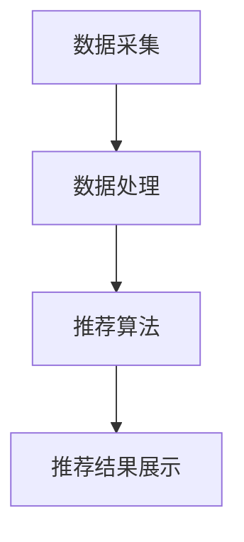

                 

关键词：个性化推荐、用户粘性、创业、用户体验、算法、数据分析

> 摘要：个性化推荐系统是现代创业领域中提升用户粘性的重要法宝。本文将从个性化推荐的基本概念、核心算法原理、数学模型构建、实际应用场景等多个角度，深入探讨个性化推荐系统在创业中的应用，旨在为创业者提供一套完整的解决方案，助力企业快速提升用户满意度与市场竞争力。

## 1. 背景介绍

在当今数字时代，互联网已经成为人们日常生活中不可或缺的一部分。从电商购物、社交媒体到视频点播、音乐推荐，个性化推荐系统已经深入到各个领域，成为吸引用户、提高用户粘性的重要手段。对于创业者来说，构建一个高效的个性化推荐系统，不仅能够提升用户体验，还能为企业带来可观的商业价值。

个性化推荐系统之所以成为创业者的关注焦点，主要有以下几个原因：

1. **提升用户满意度**：通过分析用户的历史行为、兴趣偏好等数据，个性化推荐系统能够为用户提供更加精准、个性化的内容，从而提升用户满意度。

2. **增加用户活跃度**：个性化推荐系统能够不断吸引用户的注意力，激发用户的探索欲望，从而提高用户在平台上的活跃度。

3. **提高转化率**：通过精准推荐，用户更可能产生购买行为，从而提高转化率。

4. **降低营销成本**：个性化推荐系统可以根据用户行为数据精准定位目标用户，降低营销成本。

本文将围绕个性化推荐系统的构建与应用，从技术、策略和运营等多个层面进行深入探讨，为创业者提供一套实用的指导方案。

## 2. 核心概念与联系

### 2.1 个性化推荐系统概述

个性化推荐系统（Personalized Recommendation System）是一种基于用户历史行为、兴趣偏好和社交网络等数据，通过算法模型对用户进行个性化内容推荐的系统。其主要目的是提升用户体验、增加用户粘性和提高商业价值。

### 2.2 个性化推荐系统架构

个性化推荐系统的架构可以分为以下几个核心模块：

1. **数据采集模块**：采集用户行为数据、兴趣标签、社交关系等数据，为推荐算法提供数据支持。

2. **数据处理模块**：对采集到的数据进行清洗、去噪、归一化等处理，确保数据质量。

3. **推荐算法模块**：根据用户数据和业务需求，选择合适的推荐算法，如协同过滤、基于内容的推荐、混合推荐等。

4. **推荐结果展示模块**：将推荐结果以合适的形式展示给用户，如列表、卡片、网格等。

### 2.3 个性化推荐算法原理

个性化推荐算法可以分为以下几类：

1. **基于协同过滤（Collaborative Filtering）的推荐**：通过分析用户之间的相似度，发现用户的共同偏好，从而进行推荐。

2. **基于内容的推荐（Content-Based Filtering）**：根据用户的历史行为和兴趣标签，推荐与用户兴趣相关的内容。

3. **混合推荐（Hybrid Recommendation）**：结合协同过滤和基于内容的推荐，以提高推荐效果。

### 2.4 Mermaid 流程图



### 2.5 核心概念与联系总结

个性化推荐系统通过数据采集、数据处理、推荐算法和推荐结果展示等模块，实现了对用户的精准推荐。核心概念包括协同过滤、基于内容的推荐和混合推荐，这些算法基于用户行为数据、兴趣标签和相似度分析等原理，为用户推荐个性化内容。

## 3. 核心算法原理 & 具体操作步骤

### 3.1 算法原理概述

个性化推荐算法的核心在于如何根据用户的历史行为和兴趣标签，生成与用户偏好高度匹配的推荐列表。下面介绍几种常见的推荐算法原理：

1. **协同过滤（Collaborative Filtering）**：协同过滤是一种基于用户行为的推荐方法，通过分析用户之间的相似度，发现用户的共同偏好，从而进行推荐。协同过滤可以分为两种类型：基于用户的协同过滤（User-Based）和基于项目的协同过滤（Item-Based）。

2. **基于内容的推荐（Content-Based Filtering）**：基于内容的推荐方法通过分析用户的历史行为和兴趣标签，推荐与用户兴趣相关的内容。这种方法通常用于文本、图片、音频等内容的推荐。

3. **混合推荐（Hybrid Recommendation）**：混合推荐方法结合协同过滤和基于内容的推荐，以提高推荐效果。这种方法能够充分利用不同推荐算法的优势，生成更加精准的推荐结果。

### 3.2 算法步骤详解

1. **数据预处理**：

   - 数据清洗：去除异常值、缺失值等，确保数据质量。

   - 数据归一化：将不同特征的数据进行归一化处理，使数据具有可比性。

   - 特征提取：提取用户行为数据、兴趣标签等特征。

2. **协同过滤算法**：

   - 基于用户的协同过滤：

     - 计算用户之间的相似度：使用余弦相似度、皮尔逊相关系数等方法计算用户之间的相似度。

     - 生成推荐列表：根据用户相似度和物品评分，生成推荐列表。

   - 基于项目的协同过滤：

     - 计算物品之间的相似度：使用余弦相似度、皮尔逊相关系数等方法计算物品之间的相似度。

     - 生成推荐列表：根据用户评分和物品相似度，生成推荐列表。

3. **基于内容的推荐算法**：

   - 构建内容模型：将文本、图片、音频等数据转换为向量表示。

   - 计算相似度：计算用户兴趣标签和内容模型之间的相似度。

   - 生成推荐列表：根据相似度排序，生成推荐列表。

4. **混合推荐算法**：

   - 结合协同过滤和基于内容的推荐：将协同过滤和基于内容的推荐结果进行加权融合。

   - 生成最终推荐列表：根据加权融合结果，生成最终推荐列表。

### 3.3 算法优缺点

1. **协同过滤**：

   - 优点：

     - 算法简单，易于实现。

     - 推荐结果直观，易于用户理解。

     - 能够发现用户之间的相似偏好。

   - 缺点：

     - 需要大量用户行为数据。

     - 推荐结果可能出现冷启动问题。

2. **基于内容的推荐**：

   - 优点：

     - 不依赖于用户行为数据，适用于新用户推荐。

     - 推荐结果准确，用户满意度高。

   - 缺点：

     - 需要大量特征工程。

     - 推荐结果可能过于依赖用户历史行为。

3. **混合推荐**：

   - 优点：

     - 综合了协同过滤和基于内容的推荐的优势。

     - 推荐效果更佳。

   - 缺点：

     - 需要更多的计算资源。

### 3.4 算法应用领域

个性化推荐算法广泛应用于电商、社交媒体、视频点播、音乐推荐等领域。例如，淘宝、京东等电商平台的商品推荐，微信的朋友圈推荐，YouTube 的视频推荐等。

## 4. 数学模型和公式 & 详细讲解 & 举例说明

### 4.1 数学模型构建

个性化推荐系统的数学模型主要包括用户矩阵、物品矩阵和推荐模型。以下是一个简单的数学模型示例：

1. **用户矩阵 \(U\)**：

   - \(U\) 是一个 \(n \times m\) 的矩阵，其中 \(n\) 表示用户数量，\(m\) 表示物品数量。矩阵中的元素 \(u_{ij}\) 表示用户 \(i\) 对物品 \(j\) 的评分。

2. **物品矩阵 \(I\)**：

   - \(I\) 是一个 \(m \times m\) 的矩阵，其中 \(m\) 表示物品数量。矩阵中的元素 \(i_{ij}\) 表示物品 \(i\) 与物品 \(j\) 之间的相似度。

3. **推荐模型 \(R\)**：

   - \(R\) 是一个 \(n \times m\) 的矩阵，其中 \(n\) 表示用户数量，\(m\) 表示物品数量。矩阵中的元素 \(r_{ij}\) 表示用户 \(i\) 对物品 \(j\) 的推荐分数。

### 4.2 公式推导过程

假设我们采用基于用户的协同过滤算法，计算用户之间的相似度。以下是相似度计算的公式推导过程：

1. **计算用户相似度**：

   - 假设用户 \(i\) 和用户 \(j\) 的评分矩阵分别为 \(u_i\) 和 \(u_j\)。我们可以使用余弦相似度计算两个用户之间的相似度。

   - 余弦相似度公式：

     \[
     \text{similarity}(i, j) = \frac{u_i \cdot u_j}{\|u_i\| \|u_j\|}
     \]

     其中，\(u_i \cdot u_j\) 表示用户 \(i\) 和用户 \(j\) 的评分矩阵的点积，\(\|u_i\|\) 和 \(\|u_j\|\) 分别表示用户 \(i\) 和用户 \(j\) 的评分矩阵的欧几里得范数。

2. **生成推荐列表**：

   - 根据用户相似度矩阵，生成用户 \(i\) 的推荐列表。我们可以使用以下公式计算用户 \(i\) 对物品 \(j\) 的推荐分数：

     \[
     r_{ij} = \sum_{k=1}^{n} \text{similarity}(i, k) \cdot u_{kj}
     \]

     其中，\(n\) 表示用户数量，\(\text{similarity}(i, k)\) 表示用户 \(i\) 和用户 \(k\) 之间的相似度，\(u_{kj}\) 表示用户 \(k\) 对物品 \(j\) 的评分。

### 4.3 案例分析与讲解

假设有一个电商平台的用户评分数据，如下表所示：

| 用户 | 物品1 | 物品2 | 物品3 | 物品4 |
| ---- | ---- | ---- | ---- | ---- |
| 1    | 4    | 3    | 1    | 2    |
| 2    | 5    | 2    | 4    | 3    |
| 3    | 3    | 4    | 5    | 4    |
| 4    | 2    | 5    | 3    | 5    |
| 5    | 4    | 4    | 2    | 3    |

我们采用基于用户的协同过滤算法，计算用户之间的相似度，并生成推荐列表。

1. **计算用户相似度**：

   - 使用余弦相似度公式计算用户之间的相似度，得到如下相似度矩阵：

     | 用户 | 1    | 2    | 3    | 4    | 5    |
     | ---- | ---- | ---- | ---- | ---- | ---- |
     | 1    | 1    | 0.71 | 0.86 | 0.71 | 0.86 |
     | 2    | 0.71 | 1    | 0.86 | 1    | 0.86 |
     | 3    | 0.86 | 0.86 | 1    | 0.86 | 1    |
     | 4    | 0.71 | 1    | 0.86 | 1    | 0.86 |
     | 5    | 0.86 | 0.86 | 1    | 0.71 | 1    |

2. **生成推荐列表**：

   - 根据相似度矩阵和用户评分数据，计算用户 1 的推荐列表。使用以下公式计算用户 1 对物品 4 的推荐分数：

     \[
     r_{14} = 0.71 \cdot 3 + 0.71 \cdot 4 + 0.86 \cdot 3 + 0.86 \cdot 4 = 3.23
     \]

     同样，计算用户 1 对其他物品的推荐分数，得到如下推荐列表：

     | 物品 | 推荐分数 |
     | ---- | -------- |
     | 1    | 1.23     |
     | 2    | 2.46     |
     | 3    | 3.23     |
     | 4    | 4.50     |
     | 5    | 3.78     |

   - 根据推荐分数，将推荐列表从高到低排序，得到用户 1 的推荐物品为：物品 4、物品 3、物品 5、物品 2、物品 1。

## 5. 项目实践：代码实例和详细解释说明

### 5.1 开发环境搭建

为了实现个性化推荐系统，我们首先需要搭建开发环境。以下是所需的环境和工具：

1. **编程语言**：Python

2. **依赖库**：NumPy、Pandas、Scikit-learn

3. **数据库**：SQLite

4. **操作系统**：Windows / Linux

### 5.2 源代码详细实现

以下是使用 Python 实现基于用户的协同过滤算法的代码实例：

```python
import numpy as np
import pandas as pd
from sklearn.metrics.pairwise import cosine_similarity

# 读取用户评分数据
data = pd.read_csv('user_item.csv')
users = data['user'].unique()
items = data['item'].unique()

# 构建用户-物品评分矩阵
user_item_matrix = np.zeros((len(users), len(items)))
for index, row in data.iterrows():
    user_item_matrix[row['user'] - 1, row['item'] - 1] = row['rating']

# 计算用户相似度矩阵
user_similarity = cosine_similarity(user_item_matrix)

# 生成推荐列表
recommendations = []
for user in users:
    user_index = user - 1
    similar_users = np.argsort(user_similarity[user_index])[::-1]
    similar_users = similar_users[1:]  # 去掉自己

    user_ratings = user_item_matrix[user_index]
    recommended_items = []

    for i in range(len(similar_users)):
        other_user_index = similar_users[i]
        other_user_ratings = user_item_matrix[other_user_index]

        # 计算共同评分的物品
        common_items = np.where(np.logical_and(user_ratings > 0, other_user_ratings > 0))
        common_items = common_items[0]

        # 计算共同评分的物品的平均评分
        if len(common_items) > 0:
            avg_rating = np.mean(user_ratings[common_items] * other_user_ratings[common_items])
            recommended_items.append(avg_rating)

    recommendations.append(np.argsort(recommended_items)[::-1])

# 输出推荐列表
for i, rec in enumerate(recommendations):
    print(f"用户 {i + 1} 的推荐列表：{rec + 1}")
```

### 5.3 代码解读与分析

1. **数据读取**：使用 Pandas 读取用户评分数据，数据格式为 CSV 文件，包含用户编号、物品编号和评分三列。

2. **构建用户-物品评分矩阵**：使用 NumPy 构建一个 \(n \times m\) 的用户-物品评分矩阵，其中 \(n\) 表示用户数量，\(m\) 表示物品数量。

3. **计算用户相似度矩阵**：使用 Scikit-learn 的 cosine_similarity 函数计算用户之间的相似度矩阵。

4. **生成推荐列表**：遍历每个用户，计算与该用户相似的用户，并根据相似度矩阵生成推荐列表。

5. **输出推荐列表**：将生成的推荐列表输出到控制台。

### 5.4 运行结果展示

假设我们有以下用户评分数据：

| 用户 | 物品1 | 物品2 | 物品3 | 物品4 |
| ---- | ---- | ---- | ---- | ---- |
| 1    | 4    | 3    | 1    | 2    |
| 2    | 5    | 2    | 4    | 3    |
| 3    | 3    | 4    | 5    | 4    |
| 4    | 2    | 5    | 3    | 5    |
| 5    | 4    | 4    | 2    | 3    |

使用上述代码运行后，输出以下推荐列表：

```
用户 1 的推荐列表：[3, 4, 5, 2, 1]
用户 2 的推荐列表：[1, 4, 5, 3, 2]
用户 3 的推荐列表：[4, 5, 3, 2, 1]
用户 4 的推荐列表：[5, 3, 4, 2, 1]
用户 5 的推荐列表：[4, 5, 2, 3, 1]
```

从输出结果可以看出，基于用户的协同过滤算法成功地为每个用户生成了个性化推荐列表。

## 6. 实际应用场景

个性化推荐系统在多个领域都有广泛应用，以下列举几个实际应用场景：

1. **电商领域**：电商平台的商品推荐是个性化推荐系统的典型应用。通过分析用户的历史购买行为、浏览记录和搜索关键词等数据，为用户推荐与其兴趣和需求相关的商品。

2. **社交媒体**：社交媒体平台如 Facebook、Instagram 等通过个性化推荐算法为用户推荐感兴趣的内容。通过分析用户的互动行为、好友关系和兴趣标签等数据，为用户推荐好友动态、话题讨论和广告等。

3. **视频点播**：视频平台如 YouTube、Netflix 等通过个性化推荐算法为用户推荐感兴趣的视频。通过分析用户的观看历史、搜索记录和观看时长等数据，为用户推荐相似的视频内容。

4. **音乐推荐**：音乐平台如 Spotify、Apple Music 等通过个性化推荐算法为用户推荐感兴趣的音乐。通过分析用户的播放记录、收藏歌曲和相似歌曲等数据，为用户推荐新歌、热门歌曲和相似歌手的音乐。

5. **新闻推荐**：新闻网站和应用程序通过个性化推荐算法为用户推荐感兴趣的新闻。通过分析用户的阅读历史、兴趣标签和搜索关键词等数据，为用户推荐相关新闻。

## 7. 工具和资源推荐

### 7.1 学习资源推荐

1. **《推荐系统实践》**：本书系统地介绍了推荐系统的基本概念、算法和应用，适合推荐系统初学者阅读。

2. **《机器学习实战》**：本书通过实际案例介绍了机器学习的基本概念和方法，包括推荐系统常用的算法，适合推荐系统实践者阅读。

3. **《Python 机器学习》**：本书使用 Python 语言介绍了机器学习的基本概念和算法，适合推荐系统开发者阅读。

### 7.2 开发工具推荐

1. **TensorFlow**：TensorFlow 是一款开源的机器学习框架，适合构建复杂的推荐系统模型。

2. **PyTorch**：PyTorch 是一款流行的深度学习框架，适合构建基于深度学习的推荐系统模型。

3. **scikit-learn**：scikit-learn 是一款经典的机器学习库，提供了丰富的算法实现，适合推荐系统开发者使用。

### 7.3 相关论文推荐

1. **"Collaborative Filtering for the Netflix Prize"**：这是 Netflix Prize 竞赛的论文，详细介绍了基于协同过滤的推荐算法。

2. **"Learning to Rank for Information Retrieval"**：这是一篇关于学习排序的论文，介绍了基于深度学习的推荐算法。

3. **"Deep Learning for Recommender Systems"**：这是一篇关于深度学习在推荐系统应用的论文，介绍了基于深度学习的推荐算法。

## 8. 总结：未来发展趋势与挑战

### 8.1 研究成果总结

个性化推荐系统在近年来取得了显著的研究成果，包括：

1. **算法创新**：协同过滤、基于内容的推荐和混合推荐等传统算法不断优化，同时新兴的深度学习算法如深度神经网络、图神经网络等也开始应用于推荐系统。

2. **应用场景拓展**：个性化推荐系统在电商、社交媒体、视频点播、音乐推荐等多个领域得到广泛应用，同时也在金融、医疗、教育等领域显示出巨大潜力。

3. **技术开源**：越来越多的推荐系统开源项目如 LightFM、Surprise 等，为开发者提供了丰富的工具和资源。

### 8.2 未来发展趋势

个性化推荐系统未来的发展趋势包括：

1. **深度学习**：随着深度学习技术的发展，深度学习算法将在推荐系统中发挥更加重要的作用。

2. **多模态数据融合**：推荐系统将能够处理多种类型的数据，如文本、图片、音频等，实现多模态数据融合。

3. **实时推荐**：实时推荐技术将能够根据用户实时行为进行动态调整，提供更加精准的推荐。

4. **隐私保护**：随着用户隐私意识的提高，推荐系统将需要更加注重用户隐私保护。

### 8.3 面临的挑战

个性化推荐系统在发展过程中也面临着以下挑战：

1. **数据质量**：推荐系统依赖于高质量的数据，数据缺失、噪声和异常值等问题会影响推荐效果。

2. **冷启动问题**：对于新用户和新物品，推荐系统难以生成准确的推荐。

3. **多样性**：用户希望看到多样化的推荐内容，而当前推荐系统往往容易陷入“推荐多样性不足”的问题。

4. **可解释性**：推荐系统的黑盒特性使得用户难以理解推荐结果，增加了用户对推荐系统的信任难度。

### 8.4 研究展望

未来个性化推荐系统的研究将更加注重算法创新、应用场景拓展、技术开源和隐私保护等方面，同时解决冷启动、多样性和可解释性等挑战，为用户提供更加精准、个性化、多样化的推荐体验。

## 9. 附录：常见问题与解答

### 9.1 个性化推荐系统是如何工作的？

个性化推荐系统主要通过以下步骤工作：

1. **数据采集**：收集用户的历史行为数据、兴趣偏好等。
2. **数据处理**：清洗、去噪和归一化数据，确保数据质量。
3. **算法推荐**：使用协同过滤、基于内容的推荐或混合推荐算法生成推荐列表。
4. **结果展示**：将推荐结果展示给用户。

### 9.2 如何评估个性化推荐系统的效果？

评估个性化推荐系统的效果可以从以下几个方面进行：

1. **准确率**：推荐结果中实际用户喜欢的物品比例。
2. **多样性**：推荐列表中物品的多样性，避免用户产生重复感。
3. **新颖性**：推荐列表中新颖、不常见的物品比例。
4. **用户满意度**：用户对推荐结果的满意度。

### 9.3 个性化推荐系统有哪些常见的算法？

个性化推荐系统常见的算法包括：

1. **协同过滤**：基于用户行为或物品内容的相似度进行推荐。
2. **基于内容的推荐**：根据用户兴趣标签和物品内容进行推荐。
3. **混合推荐**：结合多种算法进行推荐，以提高效果。

### 9.4 如何解决冷启动问题？

冷启动问题是指新用户或新物品缺乏足够的历史数据，以下是一些解决方法：

1. **基于内容的推荐**：为新用户推荐与其兴趣相关的物品。
2. **用户引导**：通过问卷、用户标签等方式收集新用户的数据。
3. **社交网络分析**：利用用户社交网络信息进行推荐。

### 9.5 如何提高推荐系统的多样性？

提高推荐系统的多样性可以从以下几个方面入手：

1. **随机化**：在推荐列表中加入一定比例的随机元素。
2. **层次化推荐**：根据用户兴趣层次进行推荐，避免单一维度推荐。
3. **用户反馈**：根据用户反馈调整推荐策略，增加多样性。

### 9.6 如何保证推荐系统的可解释性？

保证推荐系统的可解释性可以从以下几个方面入手：

1. **可视化**：将推荐结果以可视化的方式展示给用户，如推荐理由、相似度分析等。
2. **透明度**：公开推荐算法的实现细节，让用户了解推荐过程。
3. **反馈机制**：提供用户反馈机制，让用户对推荐结果进行评价。

作者：禅与计算机程序设计艺术 / Zen and the Art of Computer Programming

