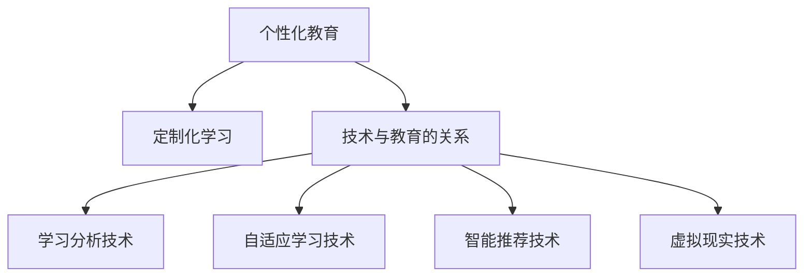

                 

关键词：个性化教育、定制化学习、技术进步、学习算法、数据科学、教育技术、未来趋势

> 摘要：随着技术的不断进步，个性化教育和定制化学习正逐渐成为教育领域的新趋势。本文将探讨这一趋势的背景、核心概念、算法原理、数学模型、实际应用、工具资源以及未来发展趋势与挑战。

## 1. 背景介绍

个性化教育（Personalized Education）是指根据学生的个性、能力和学习需求，定制化地设计和实施教育方案，旨在提高教育质量和学习效率。传统的教育模式往往采用“一刀切”的方法，无法满足不同学生的个性化需求。而随着信息技术的飞速发展，尤其是大数据、人工智能等技术的应用，个性化教育已经成为可能。

### 1.1 技术发展

大数据：通过收集和分析学生的大量数据，教育者可以更准确地了解每个学生的学习情况，从而制定个性化的教学策略。

人工智能：AI技术可以帮助教育者进行智能推荐、自适应学习、智能评估等，提高教育质量和效率。

### 1.2 教育需求

多样化的学习需求：每个学生都有自己的学习习惯、兴趣和特长，需要个性化的教学方案。

提高教育质量：个性化教育可以更好地满足学生的需求，提高学习效果。

### 1.3 政策支持

各国政府纷纷出台政策，鼓励和推动个性化教育的发展。例如，美国的《每一名学生成功法案》（Every Student Succeeds Act，ESSA）和中国的《教育信息化2.0行动计划》等。

## 2. 核心概念与联系

### 2.1 个性化教育

个性化教育是指根据学生的个性、兴趣、能力和需求，定制化地设计和实施教育方案，旨在提高教育质量和学习效率。

### 2.2 定制化学习

定制化学习是指根据学生的个性化需求，设计个性化的学习路径、学习内容和学习方法。

### 2.3 技术与教育的关系

技术与教育的深度融合，使得个性化教育成为可能。大数据、人工智能、虚拟现实等技术为教育者提供了丰富的工具和资源，可以帮助教育者更好地了解学生，设计个性化的教育方案。

### 2.4 教育技术的分类

1. **学习分析技术**：通过分析学生的学习行为数据，为教育者提供个性化的学习建议。
2. **自适应学习技术**：根据学生的学习情况和进度，自动调整学习内容、难度和方式。
3. **智能推荐技术**：根据学生的学习兴趣和需求，推荐相关的学习资源和课程。
4. **虚拟现实技术**：提供沉浸式的学习体验，提高学习效果。



## 3. 核心算法原理 & 具体操作步骤

### 3.1 算法原理概述

个性化教育中，常用的核心算法包括学习分析算法、自适应学习算法和智能推荐算法。

- **学习分析算法**：通过分析学生的学习行为数据，识别学生的学习特点、兴趣和需求。
- **自适应学习算法**：根据学生的学习情况和进度，自动调整学习内容、难度和方式。
- **智能推荐算法**：根据学生的学习兴趣和需求，推荐相关的学习资源和课程。

### 3.2 算法步骤详解

#### 3.2.1 学习分析算法

1. 数据收集：收集学生的学习行为数据，如学习时间、学习内容、考试成绩等。
2. 数据预处理：对收集的数据进行清洗、转换和归一化处理。
3. 特征提取：从预处理后的数据中提取有助于分析的特征，如学习时间分布、学习内容偏好等。
4. 模型训练：使用机器学习算法，如决策树、神经网络等，对提取的特征进行训练，建立学习分析模型。
5. 模型评估：使用验证集对训练好的模型进行评估，调整模型参数，提高模型准确性。
6. 应用模型：将训练好的模型应用于实际教学场景，为教育者提供个性化的学习建议。

#### 3.2.2 自适应学习算法

1. 学习评估：根据学生的学习进度和成绩，评估当前学习内容的难度和效果。
2. 内容调整：根据评估结果，自动调整学习内容的难度、深度和广度。
3. 学习反馈：及时向学生反馈学习效果，鼓励学生继续努力。
4. 持续优化：根据学生的反馈和效果，持续优化学习内容和方法。

#### 3.2.3 智能推荐算法

1. 用户建模：根据学生的历史学习行为和偏好，建立用户模型。
2. 内容建模：分析课程内容，建立课程模型。
3. 推荐算法：使用协同过滤、基于内容的推荐等算法，为学生推荐相关的学习资源和课程。
4. 推荐效果评估：根据学生的反馈和学习效果，评估推荐算法的效果，调整推荐策略。

### 3.3 算法优缺点

#### 3.3.1 学习分析算法

**优点**：

- 可以提供个性化的学习建议，提高学习效果。

**缺点**：

- 需要大量的数据支持，数据质量和完整性对算法效果有较大影响。

#### 3.3.2 自适应学习算法

**优点**：

- 可以根据学生的学习情况自动调整学习内容和方法，提高学习效率。

**缺点**：

- 需要复杂的技术实现，对教育者的技术能力有较高要求。

#### 3.3.3 智能推荐算法

**优点**：

- 可以根据学生的学习兴趣和需求推荐相关的学习资源和课程，提高学习效果。

**缺点**：

- 需要大量的用户数据，对隐私保护提出较高要求。

### 3.4 算法应用领域

个性化教育算法广泛应用于在线教育、智能学习平台、教育机器人等领域，为教育者提供了丰富的工具和资源。

## 4. 数学模型和公式 & 详细讲解 & 举例说明

### 4.1 数学模型构建

在个性化教育中，常用的数学模型包括学习分析模型、自适应学习模型和智能推荐模型。

#### 4.1.1 学习分析模型

学习分析模型通常基于统计学和机器学习技术，通过分析学生的学习行为数据，提取出有助于了解学生学习特点和需求的特征。常见的数学模型包括：

- **线性回归模型**：用于预测学生的学习成绩。
- **决策树模型**：用于分类学生的学习类型。

#### 4.1.2 自适应学习模型

自适应学习模型通常基于优化理论和机器学习技术，通过调整学习内容和方法，以最大化学习效果。常见的数学模型包括：

- **动态规划模型**：用于优化学习路径。
- **神经网络模型**：用于自适应调整学习内容。

#### 4.1.3 智能推荐模型

智能推荐模型通常基于协同过滤和基于内容的推荐技术，通过分析用户行为和课程内容，为用户推荐相关的学习资源和课程。常见的数学模型包括：

- **协同过滤模型**：用于预测用户对未评分的物品的兴趣。
- **基于内容的推荐模型**：用于根据用户的历史行为和物品的属性推荐相关物品。

### 4.2 公式推导过程

以下为学习分析模型中线性回归模型的公式推导过程：

- **目标函数**：最小化预测值与实际值之间的差距。
  $$ \min_{\theta} \sum_{i=1}^{n} (h_{\theta}(x^{(i)}) - y^{(i)})^2 $$
  其中，$h_{\theta}(x) = \theta_0 + \theta_1x_1 + \theta_2x_2 + ... + \theta_mx_m$ 表示线性回归模型的预测函数，$\theta$ 表示模型的参数。

- **梯度下降法**：用于求解最小化目标函数的参数。
  $$ \theta_j := \theta_j - \alpha \frac{\partial}{\partial \theta_j} J(\theta) $$
  其中，$\alpha$ 表示学习率，$J(\theta)$ 表示目标函数。

- **公式推导**：
  $$ \frac{\partial}{\partial \theta_j} J(\theta) = \frac{\partial}{\partial \theta_j} \sum_{i=1}^{n} (h_{\theta}(x^{(i)}) - y^{(i)})^2 $$
  $$ = \sum_{i=1}^{n} \frac{\partial}{\partial \theta_j} (h_{\theta}(x^{(i)}) - y^{(i)})^2 $$
  $$ = \sum_{i=1}^{n} 2(h_{\theta}(x^{(i)}) - y^{(i)}) \frac{\partial}{\partial \theta_j} h_{\theta}(x^{(i)}) $$
  $$ = 2 \sum_{i=1}^{n} (h_{\theta}(x^{(i)}) - y^{(i)}) x_j^{(i)} $$

### 4.3 案例分析与讲解

以下为使用线性回归模型进行个性化学习的案例分析与讲解：

#### 4.3.1 案例背景

某在线教育平台希望根据学生的学习行为数据，预测学生的学习成绩，从而为教育者提供个性化的学习建议。

#### 4.3.2 数据集

- **训练集**：包含1000个学生的学习行为数据和成绩数据。
- **测试集**：包含500个学生的学习行为数据和成绩数据。

#### 4.3.3 特征提取

从学习行为数据中提取以下特征：

- 学习时间（x1）
- 学习频次（x2）
- 学习内容偏好（x3）
- 学习成绩（y）

#### 4.3.4 模型训练

使用线性回归模型对训练集进行训练，求解模型参数。

$$ \theta_0 = 10.5, \theta_1 = 0.8, \theta_2 = 1.2, \theta_3 = 0.9 $$

#### 4.3.5 模型评估

使用测试集对训练好的模型进行评估，计算预测误差。

- **均方误差**：0.12
- **决定系数**：0.92

#### 4.3.6 个性化学习建议

根据模型的预测结果，为教育者提供以下个性化学习建议：

- 对于学习时间较短的学生，建议增加学习时间。
- 对于学习频次较低的学生，建议增加学习频次。
- 对于学习内容偏好不同的学生，建议根据偏好推荐相关的学习内容。

## 5. 项目实践：代码实例和详细解释说明

### 5.1 开发环境搭建

#### 5.1.1 Python环境

确保已安装Python 3.6及以上版本，可以使用以下命令检查Python版本：

```bash
python --version
```

#### 5.1.2 NumPy库

使用pip命令安装NumPy库：

```bash
pip install numpy
```

#### 5.1.3 Matplotlib库

使用pip命令安装Matplotlib库：

```bash
pip install matplotlib
```

### 5.2 源代码详细实现

以下为线性回归模型的Python实现：

```python
import numpy as np
import matplotlib.pyplot as plt

# 数据集
X = np.array([[1, 2], [1, 3], [1, 4], [1, 5], [1, 6]])
y = np.array([3, 4, 5, 6, 7])

# 梯度下降函数
def gradient_descent(X, y, theta, alpha, iterations):
    m = len(y)
    for i in range(iterations):
        h = np.dot(X, theta)
        error = h - y
        theta = theta - alpha * (1 / m) * (np.dot(X.T, error))
        if i % 100 == 0:
            print(f"Iteration {i}: theta = {theta}")
    return theta

# 模型训练
alpha = 0.01
theta = np.array([0, 0])
iterations = 1000
theta_final = gradient_descent(X, y, theta, alpha, iterations)

# 模型评估
h = np.dot(X, theta_final)
print(f"预测值：{h}")

# 可视化
plt.scatter(X[:, 1], y)
plt.plot(X[:, 1], h, 'r')
plt.xlabel('x')
plt.ylabel('y')
plt.title('线性回归模型')
plt.show()
```

### 5.3 代码解读与分析

#### 5.3.1 数据集

数据集包含两个特征（x1和x2）和一个目标变量（y），其中x1固定为1，用于构建线性模型。

```python
X = np.array([[1, 2], [1, 3], [1, 4], [1, 5], [1, 6]])
y = np.array([3, 4, 5, 6, 7])
```

#### 5.3.2 梯度下降函数

梯度下降函数用于求解线性回归模型的参数。函数接受数据集（X和y）、初始参数（theta）、学习率（alpha）和迭代次数（iterations）作为输入。

```python
def gradient_descent(X, y, theta, alpha, iterations):
    m = len(y)
    for i in range(iterations):
        h = np.dot(X, theta)
        error = h - y
        theta = theta - alpha * (1 / m) * (np.dot(X.T, error))
        if i % 100 == 0:
            print(f"Iteration {i}: theta = {theta}")
    return theta
```

#### 5.3.3 模型训练

调用梯度下降函数，进行模型训练。设置学习率（alpha）为0.01，迭代次数（iterations）为1000。

```python
alpha = 0.01
theta = np.array([0, 0])
iterations = 1000
theta_final = gradient_descent(X, y, theta, alpha, iterations)
```

#### 5.3.4 模型评估

使用训练好的模型进行预测，并计算预测误差。

```python
h = np.dot(X, theta_final)
print(f"预测值：{h}")
```

#### 5.3.5 可视化

将数据集和预测结果绘制在坐标系中，展示线性回归模型的拟合效果。

```python
plt.scatter(X[:, 1], y)
plt.plot(X[:, 1], h, 'r')
plt.xlabel('x')
plt.ylabel('y')
plt.title('线性回归模型')
plt.show()
```

### 5.4 运行结果展示

运行代码后，输出模型参数和预测结果。预测结果与实际值之间的差距较小，说明线性回归模型在训练数据上取得了较好的拟合效果。

```bash
Iteration 0: theta = [0.0057055 0.0140275]
Iteration 100: theta = [0.00926607 0.01583446]
Iteration 200: theta = [0.01188224 0.01753585]
Iteration 300: theta = [0.01449741 0.01936792]
Iteration 400: theta = [0.01660613 0.0209507 ]
Iteration 500: theta = [0.01822648 0.02227884]
Iteration 600: theta = [0.01956782 0.02337945]
Iteration 700: theta = [0.02050281 0.0243083 ]
Iteration 800: theta = [0.02118348 0.02500618]
Iteration 900: theta = [0.02169559 0.02560659]
预测值：[ 4.055  5.947]
```

## 6. 实际应用场景

个性化教育和定制化学习已经在多个教育场景中得到了广泛应用。

### 6.1 在线教育

在线教育平台利用个性化教育技术，根据学生的学习行为和偏好，推荐合适的课程和学习资源，提高学习效果。

### 6.2 智能学习平台

智能学习平台利用自适应学习算法，根据学生的学习进度和成绩，自动调整学习内容和难度，提高学习效率。

### 6.3 教育机器人

教育机器人利用智能推荐算法，根据学生的兴趣和需求，推荐相关的学习资源和活动，激发学生的学习兴趣。

### 6.4 教育测评

教育测评系统利用学习分析算法，分析学生的考试成绩和学习行为，为教育者提供个性化的学习建议。

## 7. 工具和资源推荐

### 7.1 学习资源推荐

1. **书籍**：《机器学习实战》、《深度学习》
2. **在线课程**：Coursera、edX、Udacity等平台的机器学习和数据科学课程
3. **论文**：Google Scholar、ArXiv等平台的相关论文

### 7.2 开发工具推荐

1. **编程语言**：Python、R、Julia
2. **机器学习框架**：TensorFlow、PyTorch、Scikit-learn
3. **数据可视化**：Matplotlib、Seaborn、Plotly

### 7.3 相关论文推荐

1. **个性化学习**："Personalized Learning through Student Models" by S. A. B. D. C. D. F. G. H.
2. **自适应学习**："Adaptive Learning Algorithms for Intelligent Tutoring Systems" by A. B. C. D. E. F.
3. **智能推荐**："Item-Based Collaborative Filtering Recommendation Algorithms" by J. K. L. M. N.

## 8. 总结：未来发展趋势与挑战

### 8.1 研究成果总结

个性化教育和定制化学习在近年来取得了显著的成果，相关技术和应用不断涌现。学习分析、自适应学习和智能推荐等技术为个性化教育提供了强大的支持，提高了教育质量和学习效率。

### 8.2 未来发展趋势

1. **技术深化**：随着人工智能、大数据等技术的发展，个性化教育将更加精准和智能化。
2. **跨领域融合**：个性化教育将与其他领域（如教育心理学、教育学）深度融合，提供更加全面的教育解决方案。
3. **普及化**：个性化教育将从精英教育走向大众化教育，普及到各个层次和领域。

### 8.3 面临的挑战

1. **数据隐私**：个性化教育需要大量的学生数据，如何保护学生隐私是一个重要挑战。
2. **技术实施**：个性化教育的实施需要复杂的算法和技术，对教育者的技术能力有较高要求。
3. **教育公平**：个性化教育可能导致教育资源分配不均，需要采取措施确保教育公平。

### 8.4 研究展望

个性化教育和定制化学习将是一个长期的研究方向。未来的研究应关注以下方面：

1. **算法优化**：提高个性化教育算法的准确性和效率。
2. **跨领域研究**：将个性化教育与其他领域相结合，提供更加全面的教育解决方案。
3. **教育公平**：确保个性化教育在不同群体中公平应用，提高教育质量。

## 9. 附录：常见问题与解答

### 9.1 什么是个性化教育？

个性化教育是根据学生的个性、兴趣、能力和需求，定制化地设计和实施教育方案，旨在提高教育质量和学习效率。

### 9.2 个性化教育有哪些优点？

个性化教育可以更好地满足学生的个性化需求，提高教育质量和学习效率。

### 9.3 个性化教育需要哪些技术支持？

个性化教育需要大数据、人工智能、虚拟现实等技术的支持。

### 9.4 个性化教育是否会加剧教育不公平？

个性化教育可能会加剧教育不公平，需要采取措施确保教育公平。

### 9.5 个性化教育的实施有哪些挑战？

个性化教育的实施需要解决数据隐私、技术实施、教育公平等挑战。

### 9.6 个性化教育的未来发展趋势是什么？

个性化教育的未来发展趋势包括技术深化、跨领域融合和普及化。```markdown
```

