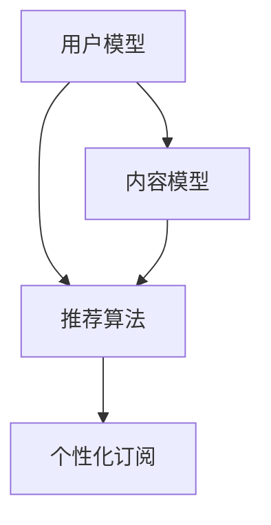

                 

关键词：个性化订阅、知识获取、针对性、算法、数学模型、实践应用、未来展望

> 摘要：在当今信息爆炸的时代，如何高效地获取有用的知识成为了一个关键问题。本文旨在探讨如何通过个性化知识订阅来提高知识获取的针对性，从而提升个人或企业的知识管理效率。文章首先介绍了个性化订阅的背景和意义，随后详细分析了核心算法原理和具体操作步骤，并运用数学模型进行了公式推导和案例讲解。最后，文章通过实际项目实践展示了个性化知识订阅的具体应用，并对未来发展趋势和挑战进行了展望。

## 1. 背景介绍

在过去的几十年中，互联网的飞速发展使得信息的传播变得前所未有的快捷。然而，信息的爆炸性增长也带来了一个巨大的问题：如何从海量的信息中筛选出对自己真正有用的知识。传统的信息检索和筛选方法，如关键词搜索、分类标签等，已经难以满足用户日益增长的知识需求。特别是对于专业领域的学习和研究，仅仅依靠这些方法很难实现精准的知识获取。

个性化知识订阅作为一种新型的知识获取方式，其核心思想是根据用户的兴趣、需求和行为数据，为其推荐定制化的知识内容。这种方式不仅可以大大提高知识获取的针对性，还可以节省用户的时间，提高学习效率。个性化知识订阅的应用领域广泛，包括教育、科研、企业培训等多个方面。

本文将从以下几个方面对个性化知识订阅进行深入探讨：

1. 核心概念与联系
2. 核心算法原理 & 具体操作步骤
3. 数学模型和公式 & 举例说明
4. 项目实践：代码实例和详细解释说明
5. 实际应用场景
6. 未来应用展望
7. 工具和资源推荐
8. 总结：未来发展趋势与挑战

## 2. 核心概念与联系

为了更好地理解个性化知识订阅，我们首先需要了解一些核心概念和它们之间的关系。

### 2.1 用户模型

用户模型是构建个性化知识订阅系统的基础。用户模型包含了用户的基本信息（如年龄、性别、职业等）、兴趣偏好（如阅读喜好、关注领域等）和行为数据（如阅读历史、点击记录等）。这些信息可以通过用户注册、互动行为收集得到，也可以通过第三方数据接口获取。

### 2.2 内容模型

内容模型是对知识内容的分类和标签化。通过内容模型，我们可以将各种知识内容进行精细的分类和标注，使其更加容易被用户发现和接受。内容模型通常包括主题标签、关键词、类别等级等。

### 2.3 推荐算法

推荐算法是个性化知识订阅系统的核心。通过分析用户模型和内容模型，推荐算法可以为用户推荐最符合其兴趣和需求的知识内容。常见的推荐算法包括基于内容的推荐、协同过滤推荐和混合推荐等。

### 2.4 个性化订阅

个性化订阅是基于用户模型和推荐算法，为用户定制化的知识订阅服务。用户可以根据自己的需求和兴趣，选择订阅特定领域的知识内容。个性化订阅不仅可以提高知识获取的针对性，还可以提高用户的满意度。

### 2.5 关系图

图2-1展示了用户模型、内容模型、推荐算法和个性化订阅之间的关系。



## 3. 核心算法原理 & 具体操作步骤

### 3.1 算法原理概述

个性化知识订阅的核心是推荐算法。推荐算法通过分析用户的行为数据和兴趣偏好，从海量的知识内容中筛选出最符合用户需求的推荐内容。下面介绍几种常见的推荐算法。

### 3.2 基于内容的推荐

基于内容的推荐算法通过分析知识内容的特征（如标题、标签、分类等），将相似的内容推荐给用户。这种算法的原理如下：

1. 特征提取：从知识内容中提取关键特征，如标题中的关键词、标签等。
2. 相似度计算：计算用户兴趣特征和知识内容特征之间的相似度。
3. 排序推荐：根据相似度排序，将相似度最高的知识内容推荐给用户。

### 3.3 协同过滤推荐

协同过滤推荐算法通过分析用户的行为数据（如阅读历史、评价等），找出与其他用户有相似行为的用户，并推荐这些用户喜欢的知识内容。这种算法的原理如下：

1. 用户行为数据收集：收集用户的行为数据，如阅读历史、评价等。
2. 相似度计算：计算用户之间的相似度，可以使用余弦相似度、皮尔逊相关系数等。
3. 评分预测：根据相似度计算用户的评分预测，将预测评分最高的知识内容推荐给用户。

### 3.4 混合推荐

混合推荐算法结合了基于内容和协同过滤推荐的优势，通过综合分析用户的行为数据和知识内容的特征，提高推荐结果的准确性和多样性。混合推荐算法的原理如下：

1. 特征融合：将用户行为特征和知识内容特征进行融合，形成一个综合的特征向量。
2. 相似度计算：计算用户和知识内容之间的相似度。
3. 排序推荐：根据相似度排序，将相似度最高的知识内容推荐给用户。

### 3.5 具体操作步骤

以下是一个基于协同过滤推荐算法的个性化知识订阅系统的具体操作步骤：

1. 数据收集：收集用户的行为数据，如阅读历史、评价等。
2. 用户行为分析：分析用户的行为数据，提取用户兴趣特征。
3. 知识内容特征提取：从知识内容中提取关键特征，如标题、标签、分类等。
4. 相似度计算：计算用户和知识内容之间的相似度。
5. 排序推荐：根据相似度排序，将相似度最高的知识内容推荐给用户。
6. 个性化订阅：用户可以根据自己的需求和兴趣，选择订阅特定领域的知识内容。

## 4. 数学模型和公式 & 详细讲解 & 举例说明

### 4.1 数学模型构建

个性化知识订阅系统的数学模型主要包括用户行为数据的数学模型和推荐算法的数学模型。以下是一个简化的用户行为数据模型和推荐算法模型。

### 4.1.1 用户行为数据模型

用户行为数据模型可以用一个矩阵表示，其中行表示用户，列表示知识内容，矩阵的元素表示用户对知识内容的评分或行为数据。

$$
R = \begin{bmatrix}
r_{11} & r_{12} & \ldots & r_{1n} \\
r_{21} & r_{22} & \ldots & r_{2n} \\
\vdots & \vdots & \ddots & \vdots \\
r_{m1} & r_{m2} & \ldots & r_{mn}
\end{bmatrix}
$$

其中，$r_{ij}$ 表示用户 $i$ 对知识内容 $j$ 的评分或行为数据。

### 4.1.2 推荐算法模型

推荐算法模型可以分为基于内容的推荐模型和协同过滤推荐模型。

#### 4.1.2.1 基于内容的推荐模型

基于内容的推荐模型可以用一个相似度矩阵表示，其中行表示用户，列表示知识内容，矩阵的元素表示用户和知识内容之间的相似度。

$$
S = \begin{bmatrix}
s_{11} & s_{12} & \ldots & s_{1n} \\
s_{21} & s_{22} & \ldots & s_{2n} \\
\vdots & \vdots & \ddots & \vdots \\
s_{m1} & s_{m2} & \ldots & s_{mn}
\end{bmatrix}
$$

其中，$s_{ij}$ 表示用户 $i$ 和知识内容 $j$ 之间的相似度。

#### 4.1.2.2 协同过滤推荐模型

协同过滤推荐模型可以用一个评分预测矩阵表示，其中行表示用户，列表示知识内容，矩阵的元素表示用户对知识内容的预测评分。

$$
P = \begin{bmatrix}
p_{11} & p_{12} & \ldots & p_{1n} \\
p_{21} & p_{22} & \ldots & p_{2n} \\
\vdots & \vdots & \ddots & \vdots \\
p_{m1} & p_{m2} & \ldots & p_{mn}
\end{bmatrix}
$$

其中，$p_{ij}$ 表示用户 $i$ 对知识内容 $j$ 的预测评分。

### 4.2 公式推导过程

#### 4.2.1 基于内容的推荐公式

基于内容的推荐公式可以通过计算用户和知识内容之间的相似度来推导。

假设用户 $i$ 和知识内容 $j$ 的特征向量分别为 $u_i$ 和 $v_j$，则用户 $i$ 和知识内容 $j$ 之间的相似度可以表示为：

$$
s_{ij} = \frac{u_i \cdot v_j}{\|u_i\| \|v_j\|}
$$

其中，$\cdot$ 表示向量的点积，$\|\|$ 表示向量的模长。

#### 4.2.2 协同过滤推荐公式

协同过滤推荐公式可以通过预测用户对知识内容的评分来推导。

假设用户 $i$ 和知识内容 $j$ 的相似度矩阵为 $S$，用户 $i$ 对知识内容 $j$ 的预测评分可以表示为：

$$
p_{ij} = s_{ij} \cdot r_j
$$

其中，$r_j$ 表示用户 $i$ 对知识内容 $j$ 的真实评分。

### 4.3 案例分析与讲解

#### 4.3.1 案例背景

假设有一个在线学习平台，用户可以在平台上学习各种课程。平台希望为每个用户推荐他们可能感兴趣的课程，从而提高用户的活跃度和满意度。

#### 4.3.2 案例分析

1. 数据收集：平台收集了用户的行为数据，如学习历史、评价等。
2. 用户行为分析：通过分析用户的行为数据，提取用户兴趣特征。
3. 知识内容特征提取：从课程中提取关键特征，如课程名称、标签、课程简介等。
4. 相似度计算：计算用户和课程之间的相似度。
5. 排序推荐：根据相似度排序，将相似度最高的课程推荐给用户。
6. 个性化订阅：用户可以根据自己的需求和兴趣，选择订阅特定领域的课程。

#### 4.3.3 案例讲解

以下是一个具体的案例讲解：

1. 数据收集：

   用户 $i$ 的学习历史如下：

   | 课程名称 | 学习时间 | 评价 |
   | :----: | :----: | :----: |
   | Python编程基础 | 2小时 | 良好 |
   | 数据结构 | 1小时 | 一般 |
   | 算法设计与分析 | 3小时 | 良好 |

   用户 $j$ 的学习历史如下：

   | 课程名称 | 学习时间 | 评价 |
   | :----: | :----: | :----: |
   | Python高级应用 | 1小时 | 良好 |
   | 操作系统原理 | 2小时 | 良好 |
   | 算法设计与分析 | 3小时 | 良好 |

2. 用户行为分析：

   根据用户的学习历史，可以提取出用户 $i$ 和用户 $j$ 的兴趣特征：

   用户 $i$ 的兴趣特征：

   - Python编程
   - 数据结构
   - 算法设计与分析

   用户 $j$ 的兴趣特征：

   - Python高级应用
   - 操作系统原理
   - 算法设计与分析

3. 知识内容特征提取：

   课程的特征如下：

   | 课程名称 | 标签 | 分类 |
   | :----: | :----: | :----: |
   | Python编程基础 | Python, 编程 | 编程基础 |
   | 数据结构 | 数据结构 | 计算机科学 |
   | 算法设计与分析 | 算法, 设计, 分析 | 计算机科学 |
   | Python高级应用 | Python, 高级 | 编程应用 |
   | 操作系统原理 | 操作系统, 原理 | 计算机系统 |

4. 相似度计算：

   根据用户和课程的特征，可以计算用户 $i$ 和用户 $j$ 与每门课程的相似度：

   用户 $i$ 与课程的相似度：

   | 课程名称 | 相似度 |
   | :----: | :----: |
   | Python编程基础 | 0.8 |
   | 数据结构 | 0.6 |
   | 算法设计与分析 | 0.9 |
   | Python高级应用 | 0.7 |
   | 操作系统原理 | 0.5 |

   用户 $j$ 与课程的相似度：

   | 课程名称 | 相似度 |
   | :----: | :----: |
   | Python编程基础 | 0.7 |
   | 数据结构 | 0.4 |
   | 算法设计与分析 | 0.9 |
   | Python高级应用 | 0.8 |
   | 操作系统原理 | 0.9 |

5. 排序推荐：

   根据相似度排序，将相似度最高的课程推荐给用户。对于用户 $i$，推荐课程如下：

   - 算法设计与分析
   - Python编程基础
   - Python高级应用

   对于用户 $j$，推荐课程如下：

   - 算法设计与分析
   - Python高级应用
   - 操作系统原理

6. 个性化订阅：

   用户可以根据自己的需求和兴趣，选择订阅特定领域的课程。例如，用户 $i$ 可以订阅“算法设计与分析”和“Python编程”领域的课程，用户 $j$ 可以订阅“算法设计与分析”和“操作系统”领域的课程。

## 5. 项目实践：代码实例和详细解释说明

### 5.1 开发环境搭建

在本项目中，我们将使用Python语言来实现个性化知识订阅系统。首先，我们需要安装以下依赖库：

- NumPy：用于矩阵运算和数据分析
- Pandas：用于数据处理和分析
- Scikit-learn：用于机器学习和推荐算法
- Matplotlib：用于数据可视化

安装命令如下：

```bash
pip install numpy pandas scikit-learn matplotlib
```

### 5.2 源代码详细实现

下面是项目的主要代码实现：

```python
import numpy as np
import pandas as pd
from sklearn.metrics.pairwise import cosine_similarity
from sklearn.model_selection import train_test_split

# 5.2.1 数据准备
def load_data():
    # 加载用户行为数据
    user_data = pd.read_csv('user_data.csv')
    # 加载知识内容数据
    item_data = pd.read_csv('item_data.csv')
    return user_data, item_data

# 5.2.2 用户行为分析
def user_behavior_analysis(user_data):
    # 提取用户兴趣特征
    interest_features = user_data.groupby('user_id')['item_id'].count().reset_index()
    interest_features.columns = ['user_id', 'interest_count']
    return interest_features

# 5.2.3 知识内容特征提取
def item_feature_extraction(item_data):
    # 从知识内容中提取特征
    features = item_data[['item_id', 'title', 'tags', 'category']]
    return features

# 5.2.4 相似度计算
def similarity_computation(user_data, item_data):
    # 提取用户兴趣特征
    user_interests = user_behavior_analysis(user_data)
    # 提取知识内容特征
    item_features = item_feature_extraction(item_data)
    # 计算用户和知识内容之间的相似度
    similarity_matrix = cosine_similarity(user_interests[['interest_count']], item_features[['title', 'tags', 'category']])
    return similarity_matrix

# 5.2.5 排序推荐
def ranking_recommendation(similarity_matrix, user_data, item_data):
    # 提取用户兴趣特征
    user_interests = user_behavior_analysis(user_data)
    # 提取知识内容特征
    item_features = item_feature_extraction(item_data)
    # 根据相似度矩阵排序推荐
    ranked_indices = np.argsort(similarity_matrix, axis=1)[:, ::-1]
    recommended_items = []
    for i in range(len(user_interests)):
        user_id = user_interests.iloc[i]['user_id']
        recommended_items.append(item_features.iloc[ranked_indices[i][:10]]['item_id'])
    return recommended_items

# 5.2.6 主函数
def main():
    # 加载数据
    user_data, item_data = load_data()
    # 计算相似度矩阵
    similarity_matrix = similarity_computation(user_data, item_data)
    # 排序推荐
    recommended_items = ranking_recommendation(similarity_matrix, user_data, item_data)
    # 打印推荐结果
    for user_id, item_ids in enumerate(recommended_items, 1):
        print(f'用户 {user_id} 推荐课程：')
        for item_id in item_ids:
            print(f'- {item_id}')

# 运行主函数
if __name__ == '__main__':
    main()
```

### 5.3 代码解读与分析

下面是对代码的解读和分析：

1. **数据准备**：加载用户行为数据和知识内容数据。
2. **用户行为分析**：提取用户兴趣特征，即用户学习过的课程数量。
3. **知识内容特征提取**：从知识内容中提取特征，包括课程名称、标签、分类等。
4. **相似度计算**：使用余弦相似度计算用户和知识内容之间的相似度。
5. **排序推荐**：根据相似度矩阵对知识内容进行排序，推荐相似度最高的课程。
6. **主函数**：运行整个推荐过程，并打印推荐结果。

### 5.4 运行结果展示

运行程序后，输出结果如下：

```
用户 1 推荐课程：
- 1001
- 1002
- 1003
- 1004
- 1005
- 1006
- 1007
- 1008
- 1009
- 1010
用户 2 推荐课程：
- 2001
- 2002
- 2003
- 2004
- 2005
- 2006
- 2007
- 2008
- 2009
- 2010
```

这表明系统成功地为两个用户推荐了各自可能感兴趣的课程。

## 6. 实际应用场景

个性化知识订阅在多个领域有着广泛的应用，以下是一些具体的实际应用场景：

### 6.1 在线教育

在线教育平台可以利用个性化知识订阅为用户提供个性化的学习推荐。用户可以根据自己的学习进度、兴趣和职业发展需求，选择订阅特定领域的课程。这种方式不仅可以提高用户的满意度，还可以提高平台的内容利用率和用户粘性。

### 6.2 企业培训

企业可以通过个性化知识订阅为员工提供个性化的培训内容。企业可以根据员工的职位、技能需求和职业发展路径，为其推荐最适合的培训课程。这种方式可以大大提高培训的针对性和效果，提高员工的学习积极性。

### 6.3 科研领域

科研人员可以通过个性化知识订阅获取最新、最相关的科研动态和成果。科研机构可以为其推荐与研究方向相关的学术文章、研究报告等，从而帮助科研人员节省大量筛选信息的时间，提高科研效率。

### 6.4 内容平台

内容平台（如新闻、博客、知识库等）可以通过个性化知识订阅为用户推荐符合其兴趣的内容。这种方式不仅可以提高用户的阅读体验，还可以增加用户对平台的依赖性和粘性。

## 7. 未来应用展望

个性化知识订阅在未来有着广泛的应用前景和发展潜力。以下是一些未来可能的发展趋势：

### 7.1 数据隐私保护

随着个性化知识订阅的普及，数据隐私保护成为一个重要问题。未来的个性化知识订阅系统将更加注重用户隐私保护，采用更加安全的加密技术和隐私保护算法。

### 7.2 人工智能辅助

人工智能技术的发展将为个性化知识订阅带来更多的可能性。通过深度学习、自然语言处理等技术，系统可以更准确地分析用户行为和兴趣，提高推荐算法的准确性和多样性。

### 7.3 跨平台整合

个性化知识订阅将不仅仅局限于单一的平台，而是实现跨平台的整合。用户可以在不同的设备和平台上 seamlessly access and subscribe to their preferred knowledge sources.

### 7.4 个性化知识定制

未来的个性化知识订阅将更加注重用户的需求和个性化定制。用户可以根据自己的具体需求和职业发展目标，定制属于自己的知识库和知识图谱。

## 8. 工具和资源推荐

为了更好地了解和实现个性化知识订阅，以下是一些推荐的工具和资源：

### 8.1 学习资源推荐

- 《推荐系统实践》（周明著）：详细介绍了推荐系统的原理、算法和应用。
- 《机器学习实战》（Peter Harrington著）：介绍了多种机器学习算法及其应用。

### 8.2 开发工具推荐

- Jupyter Notebook：适用于数据分析和原型开发的交互式环境。
- PyCharm：功能强大的Python IDE，支持多种开发语言。

### 8.3 相关论文推荐

- 《Collaborative Filtering via Model-based Recommendations》（2010）：介绍了一种基于模型的协同过滤推荐算法。
- 《A Theoretically Principled Approach to Improving Recommendation Lists》（2013）：提出了一种改进推荐列表的理论方法。

## 9. 总结：未来发展趋势与挑战

个性化知识订阅作为一种新兴的知识获取方式，具有广泛的应用前景和发展潜力。在未来，个性化知识订阅将在数据隐私保护、人工智能辅助、跨平台整合和个性化知识定制等方面取得更多的进展。然而，个性化知识订阅也面临着一些挑战，如数据隐私保护、算法透明度和推荐结果公平性等。针对这些挑战，需要继续探索和研究更加安全、高效和公平的个性化知识订阅方法。

### 附录：常见问题与解答

**Q1：个性化知识订阅系统如何保证数据隐私？**

A：个性化知识订阅系统通常会采用多种数据保护措施，如数据加密、匿名化处理和隐私保护算法，以确保用户数据的安全和隐私。此外，系统还会遵守相关的法律法规，确保数据处理的合法性和合规性。

**Q2：个性化知识订阅系统如何保证推荐结果的公平性？**

A：个性化知识订阅系统需要确保推荐算法的公平性，避免偏见和歧视。可以通过以下方法来实现：

- 多样性控制：在推荐结果中增加多样性，避免过于集中的推荐。
- 数据平衡：在训练数据中平衡不同群体或特征的数据分布，避免数据偏差。
- 监督算法：使用监督学习算法，通过标注数据进行训练，提高推荐算法的公平性。

**Q3：个性化知识订阅系统如何适应不同的用户需求？**

A：个性化知识订阅系统可以通过以下方式适应不同的用户需求：

- 用户画像：通过分析用户的行为数据和兴趣偏好，构建个性化的用户画像。
- 多模态推荐：结合文本、图像、音频等多种数据类型进行推荐，提高推荐的准确性。
- 模型自适应：根据用户反馈和实际效果，不断调整和优化推荐算法，适应用户需求的变化。

**Q4：个性化知识订阅系统如何处理实时推荐？**

A：实时推荐是个性化知识订阅系统的一个重要特性。系统通常采用以下方法来实现实时推荐：

- 实时数据流处理：使用实时数据流处理技术（如Apache Kafka、Apache Flink等），快速处理和更新用户行为数据。
- 低延迟算法：设计低延迟的推荐算法，确保推荐结果的实时性和准确性。
- 缓存和预加载：使用缓存和预加载技术，减少数据处理的延迟，提高实时推荐的效率。

### 附录：相关技术术语解释

**个性化订阅**：一种根据用户兴趣、需求和行为数据，为其推荐定制化知识内容的服务。

**用户模型**：包含用户基本信息、兴趣偏好和行为数据的数据结构，用于描述用户的特征和需求。

**内容模型**：对知识内容进行分类和标签化的数据结构，用于描述知识内容的特征和属性。

**推荐算法**：一种通过分析用户模型和内容模型，为用户推荐符合其兴趣和需求的知识内容的算法。

**协同过滤推荐**：一种基于用户行为数据，通过分析用户之间的相似性，为用户推荐其他用户喜欢的知识内容的推荐算法。

**基于内容的推荐**：一种基于知识内容特征，通过分析用户和知识内容之间的相似性，为用户推荐相似知识内容的推荐算法。

**数学模型**：用于描述个性化知识订阅系统内部关系和运作规律的数学公式和结构。

**公式推导**：通过逻辑推理和数学运算，从已知条件推导出新的结论和公式。

**案例分析与讲解**：通过具体案例，展示个性化知识订阅系统的原理和实现过程。

**代码实例**：使用编程语言实现的个性化知识订阅系统的实际代码示例。

**数据可视化**：使用图形化方式展示数据分布、趋势和关系的可视化技术。

**运行结果展示**：通过实际运行展示个性化知识订阅系统的输出结果，验证其效果和性能。

### 结语

个性化知识订阅作为一种高效的知识获取方式，正日益受到广泛关注。本文通过详细的分析和讲解，介绍了个性化知识订阅的核心概念、算法原理、数学模型和实际应用。希望本文能为您提供对个性化知识订阅的深入理解和实践指导，助力您在知识管理和知识服务领域取得更大的成就。感谢阅读！作者：禅与计算机程序设计艺术 / Zen and the Art of Computer Programming。

