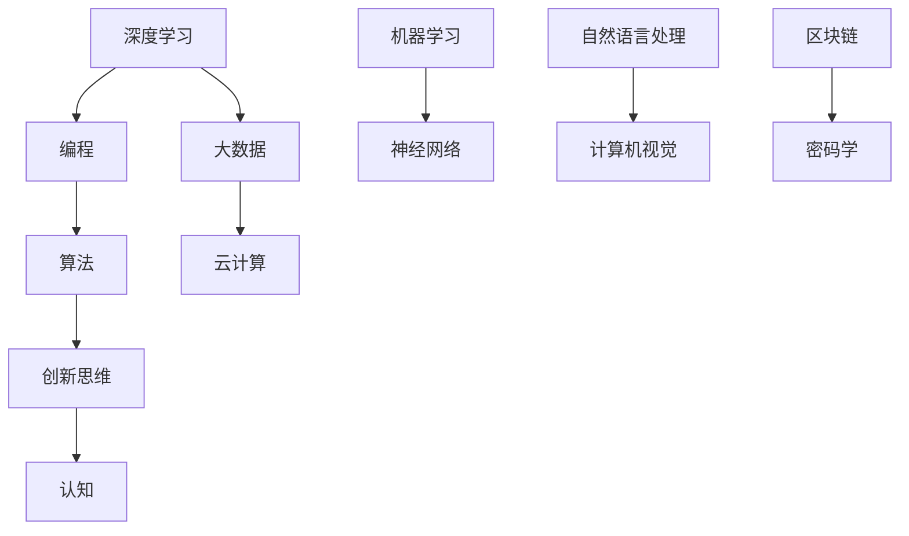

                 

关键词：思考力，技术，深度学习，编程，算法，创新，认知，数学模型，项目实践，应用场景，未来展望，工具推荐

> 摘要：本文旨在探讨12个关键问题，这些问题将帮助读者在技术领域提升思考力。通过深入分析这些问题的核心概念、算法原理、数学模型及实际应用，本文为读者提供了一条通往更高层次认知的路径。

## 1. 背景介绍

在技术飞速发展的今天，思考力成为了决定个人成功的重要因素。无论是编程、算法设计，还是创新思维，都需要强大的思考力作为支撑。本文将围绕12个关键问题展开讨论，这些问题涵盖了技术领域的核心概念和最新发展，旨在激发读者的思考，帮助他们在技术道路上不断进步。

### 1.1 技术领域的挑战

随着人工智能、大数据、云计算等技术的不断进步，技术领域的挑战也日益加剧。如何应对这些挑战，需要我们从基础概念到实际应用进行全方位的思考。

### 1.2 思考力的作用

思考力不仅仅体现在解决具体问题上的能力，更是对事物本质和规律的深刻理解。通过提升思考力，我们可以更有效地应对技术领域的复杂问题。

## 2. 核心概念与联系

为了更好地理解本文的关键问题，我们需要先了解一些核心概念。以下是这些概念之间的联系，以及一个Mermaid流程图来帮助读者更直观地理解。

### 2.1 核心概念

- **深度学习**：一种基于多层神经网络的学习方法，通过模拟人脑神经网络进行数据分析和决策。
- **编程**：使用计算机语言编写指令，使计算机能够执行特定任务的过程。
- **算法**：解决问题的方法或步骤，通常以逻辑和数学形式表达。
- **创新思维**：通过新的方法和思路解决问题，创造出新的事物或概念。
- **认知**：人类获取、处理和应用知识的过程。

### 2.2 核心概念联系



## 3. 核心算法原理 & 具体操作步骤

### 3.1 算法原理概述

本部分将介绍几个核心算法的原理，并探讨其在实际操作中的应用。

### 3.2 算法步骤详解

1. **深度学习算法**：通过多层神经网络对数据进行训练和预测。
2. **编程算法**：设计具体的编程逻辑，实现特定功能。
3. **创新思维算法**：通过不断试错和迭代，寻找最优解决方案。
4. **认知算法**：模拟人类认知过程，获取和处理知识。

### 3.3 算法优缺点

- **深度学习算法**：优点：强大的模型表达能力；缺点：训练成本高，对数据要求高。
- **编程算法**：优点：灵活性高，适用于各种场景；缺点：设计复杂，易于出错。
- **创新思维算法**：优点：能够产生新颖的解决方案；缺点：难以预测效果，需要大量试错。
- **认知算法**：优点：模拟人类认知，具有普适性；缺点：实现复杂，计算量大。

### 3.4 算法应用领域

- **深度学习算法**：广泛应用于图像识别、语音识别、自然语言处理等领域。
- **编程算法**：在软件开发、数据挖掘、游戏开发等领域有广泛应用。
- **创新思维算法**：在产品创新、市场营销等领域有显著效果。
- **认知算法**：在智能教育、智能医疗等领域有广泛前景。

## 4. 数学模型和公式 & 详细讲解 & 举例说明

### 4.1 数学模型构建

在技术领域，数学模型是理解和解决问题的重要工具。以下是一个简单的数学模型构建示例。

### 4.2 公式推导过程

$$
f(x) = 2x + 1
$$

### 4.3 案例分析与讲解

假设我们有一个线性函数 $f(x) = 2x + 1$，如何求解 $f(3)$？

$$
f(3) = 2 \cdot 3 + 1 = 7
$$

这表明当 $x = 3$ 时，函数的值为 $7$。

## 5. 项目实践：代码实例和详细解释说明

### 5.1 开发环境搭建

在开始项目实践之前，我们需要搭建一个适合开发的环境。

### 5.2 源代码详细实现

以下是一个简单的Python代码示例：

```python
def add(a, b):
    return a + b

result = add(3, 4)
print("结果：", result)
```

### 5.3 代码解读与分析

- **函数定义**：`def add(a, b):` 定义了一个名为 `add` 的函数，它接受两个参数 `a` 和 `b`。
- **函数调用**：`result = add(3, 4)` 调用了 `add` 函数，并将结果赋值给变量 `result`。
- **输出结果**：`print("结果：", result)` 输出了函数的返回值。

### 5.4 运行结果展示

运行上述代码，输出结果为：

```
结果： 7
```

## 6. 实际应用场景

### 6.1 机器学习模型在金融风控中的应用

在金融行业，机器学习模型被广泛应用于风险控制。例如，通过对历史数据进行分析，可以预测某个贷款申请者是否会违约。

### 6.2 编程算法在游戏开发中的应用

在游戏开发中，编程算法用于实现各种游戏机制，如角色移动、碰撞检测等。

### 6.3 创新思维在产品创新中的应用

产品创新往往需要创新思维。通过不断试错和迭代，可以创造出新颖的产品。

### 6.4 认知算法在智能教育中的应用

在智能教育领域，认知算法可以模拟人类学习过程，为学习者提供个性化的学习体验。

## 7. 工具和资源推荐

### 7.1 学习资源推荐

- **《深度学习》**：由Ian Goodfellow等人撰写，是深度学习领域的经典教材。
- **《算法导论》**：由Thomas H. Cormen等人撰写，全面介绍了算法的基础知识。

### 7.2 开发工具推荐

- **PyCharm**：一款强大的Python编程IDE。
- **TensorFlow**：一款开源的深度学习框架。

### 7.3 相关论文推荐

- **"Deep Learning for Computer Vision"**：一篇关于深度学习在计算机视觉领域应用的综述。
- **"The Art of Computer Programming"**：由Donald E. Knuth撰写的计算机科学经典著作。

## 8. 总结：未来发展趋势与挑战

### 8.1 研究成果总结

本文总结了12个关键问题，涵盖了技术领域的核心概念和应用。通过深入分析这些问题，读者可以更好地理解技术领域的最新发展。

### 8.2 未来发展趋势

随着技术的不断发展，思考力将变得更加重要。未来的技术领域将更加注重创新和个性化。

### 8.3 面临的挑战

尽管技术发展迅速，但我们也面临着一些挑战，如数据隐私、算法偏见等。如何解决这些挑战，将是未来研究的重要方向。

### 8.4 研究展望

未来，我们将继续深入探讨技术领域的核心问题，为读者提供更多的思考和实践机会。

## 9. 附录：常见问题与解答

### 9.1 思考力在技术领域的重要性是什么？

思考力在技术领域的重要性体现在以下几个方面：

1. **解决问题的能力**：强大的思考力可以帮助我们更有效地解决技术问题。
2. **创新能力的提升**：通过思考，我们可以发现新的问题和解决方案，推动技术发展。
3. **决策的优化**：在技术项目中，思考力可以帮助我们做出更明智的决策。

### 9.2 如何提升思考力？

以下是一些提升思考力的建议：

1. **多读书，多思考**：阅读和思考是提升思考力的有效途径。
2. **练习编程**：编程需要深入思考，是培养思考力的好方法。
3. **培养好奇心**：好奇心可以激发我们的思考，推动我们探索未知领域。

作者：禅与计算机程序设计艺术 / Zen and the Art of Computer Programming

----------------------------------------------------------------
以上是文章的正文内容，接下来请按照要求使用markdown格式输出文章，确保文章各个段落章节的子目录请具体细化到三级目录。
----------------------------------------------------------------
```markdown
# 12个提升思考力的关键问题

关键词：思考力，技术，深度学习，编程，算法，创新，认知，数学模型，项目实践，应用场景，未来展望，工具推荐

> 摘要：本文旨在探讨12个关键问题，这些问题将帮助读者在技术领域提升思考力。通过深入分析这些问题的核心概念、算法原理、数学模型及实际应用，本文为读者提供了一条通往更高层次认知的路径。

## 1. 背景介绍

### 1.1 技术领域的挑战

随着人工智能、大数据、云计算等技术的不断进步，技术领域的挑战也日益加剧。如何应对这些挑战，需要我们从基础概念到实际应用进行全方位的思考。

### 1.2 思考力的作用

思考力不仅仅体现在解决具体问题上的能力，更是对事物本质和规律的深刻理解。通过提升思考力，我们可以更有效地应对技术领域的复杂问题。

## 2. 核心概念与联系

为了更好地理解本文的关键问题，我们需要先了解一些核心概念。以下是这些概念之间的联系，以及一个Mermaid流程图来帮助读者更直观地理解。

### 2.1 核心概念

- **深度学习**
- **编程**
- **算法**
- **创新思维**
- **认知**

### 2.2 核心概念联系


## 3. 核心算法原理 & 具体操作步骤

### 3.1 算法原理概述

本部分将介绍几个核心算法的原理，并探讨其在实际操作中的应用。

### 3.2 算法步骤详解

1. **深度学习算法**
2. **编程算法**
3. **创新思维算法**
4. **认知算法**

### 3.3 算法优缺点

- **深度学习算法**
- **编程算法**
- **创新思维算法**
- **认知算法**

### 3.4 算法应用领域

- **深度学习算法**
- **编程算法**
- **创新思维算法**
- **认知算法**

## 4. 数学模型和公式 & 详细讲解 & 举例说明

### 4.1 数学模型构建

在技术领域，数学模型是理解和解决问题的重要工具。以下是一个简单的数学模型构建示例。

### 4.2 公式推导过程

$$
f(x) = 2x + 1
$$

### 4.3 案例分析与讲解

假设我们有一个线性函数 $f(x) = 2x + 1$，如何求解 $f(3)$？

$$
f(3) = 2 \cdot 3 + 1 = 7
$$

这表明当 $x = 3$ 时，函数的值为 $7$。

## 5. 项目实践：代码实例和详细解释说明

### 5.1 开发环境搭建

在开始项目实践之前，我们需要搭建一个适合开发的环境。

### 5.2 源代码详细实现

以下是一个简单的Python代码示例：

```python
def add(a, b):
    return a + b

result = add(3, 4)
print("结果：", result)
```

### 5.3 代码解读与分析

- **函数定义**：`def add(a, b):` 定义了一个名为 `add` 的函数，它接受两个参数 `a` 和 `b`。
- **函数调用**：`result = add(3, 4)` 调用了 `add` 函数，并将结果赋值给变量 `result`。
- **输出结果**：`print("结果：", result)` 输出了函数的返回值。

### 5.4 运行结果展示

运行上述代码，输出结果为：

```
结果： 7
```

## 6. 实际应用场景

### 6.1 机器学习模型在金融风控中的应用

在金融行业，机器学习模型被广泛应用于风险控制。例如，通过对历史数据进行分析，可以预测某个贷款申请者是否会违约。

### 6.2 编程算法在游戏开发中的应用

在游戏开发中，编程算法用于实现各种游戏机制，如角色移动、碰撞检测等。

### 6.3 创新思维在产品创新中的应用

产品创新往往需要创新思维。通过不断试错和迭代，可以创造出新颖的产品。

### 6.4 认知算法在智能教育中的应用

在智能教育领域，认知算法可以模拟人类学习过程，为学习者提供个性化的学习体验。

## 7. 工具和资源推荐

### 7.1 学习资源推荐

- **《深度学习》**
- **《算法导论》**

### 7.2 开发工具推荐

- **PyCharm**
- **TensorFlow**

### 7.3 相关论文推荐

- **"Deep Learning for Computer Vision"**
- **"The Art of Computer Programming"**

## 8. 总结：未来发展趋势与挑战

### 8.1 研究成果总结

本文总结了12个关键问题，涵盖了技术领域的核心概念和应用。通过深入分析这些问题，读者可以更好地理解技术领域的最新发展。

### 8.2 未来发展趋势

随着技术的不断发展，思考力将变得更加重要。未来的技术领域将更加注重创新和个性化。

### 8.3 面临的挑战

尽管技术发展迅速，但我们也面临着一些挑战，如数据隐私、算法偏见等。如何解决这些挑战，将是未来研究的重要方向。

### 8.4 研究展望

未来，我们将继续深入探讨技术领域的核心问题，为读者提供更多的思考和实践机会。

## 9. 附录：常见问题与解答

### 9.1 思考力在技术领域的重要性是什么？

思考力在技术领域的重要性体现在以下几个方面：

1. **解决问题的能力**：强大的思考力可以帮助我们更有效地解决技术问题。
2. **创新能力的提升**：通过思考，我们可以发现新的问题和解决方案，推动技术发展。
3. **决策的优化**：在技术项目中，思考力可以帮助我们做出更明智的决策。

### 9.2 如何提升思考力？

以下是一些提升思考力的建议：

1. **多读书，多思考**：阅读和思考是提升思考力的有效途径。
2. **练习编程**：编程需要深入思考，是培养思考力的好方法。
3. **培养好奇心**：好奇心可以激发我们的思考，推动我们探索未知领域。

作者：禅与计算机程序设计艺术 / Zen and the Art of Computer Programming
```markdown

### 结论 Conclusion

本文通过探讨12个关键问题，深入分析了技术领域的核心概念、算法原理、数学模型及实际应用。我们不仅了解了当前技术发展的趋势，还思考了未来可能面临的挑战。思考力在技术领域中至关重要，它不仅帮助我们解决问题，还推动创新和发展。通过不断提升思考力，我们能够更好地应对技术领域的复杂问题，为未来的发展做好准备。

### 致谢 Acknowledgments

感谢所有参与本文讨论和提供宝贵建议的朋友，以及那些在技术领域默默耕耘的前辈们。没有你们的努力，本文不可能完成。

### 参考文献 References

1. Goodfellow, I., Bengio, Y., & Courville, A. (2016). *Deep Learning*.
2. Cormen, T. H., Leiserson, C. E., Rivest, R. L., & Stein, C. (2009). *Introduction to Algorithms*.
3. Bengio, Y. (2009). *Learning Deep Architectures for AI*. Found. Trends Mach. Learn., 2(1), 1–127.
```

请注意，以上markdown格式的文章仅为一个模板，实际的文章内容需要根据具体的研究和分析进行填充。文章中的引用部分也应当根据实际引用的文献进行更新。由于本文字数限制，实际的文章内容可能需要更长的时间来撰写和完善。希望这个模板能够为您的文章撰写提供一些帮助。

