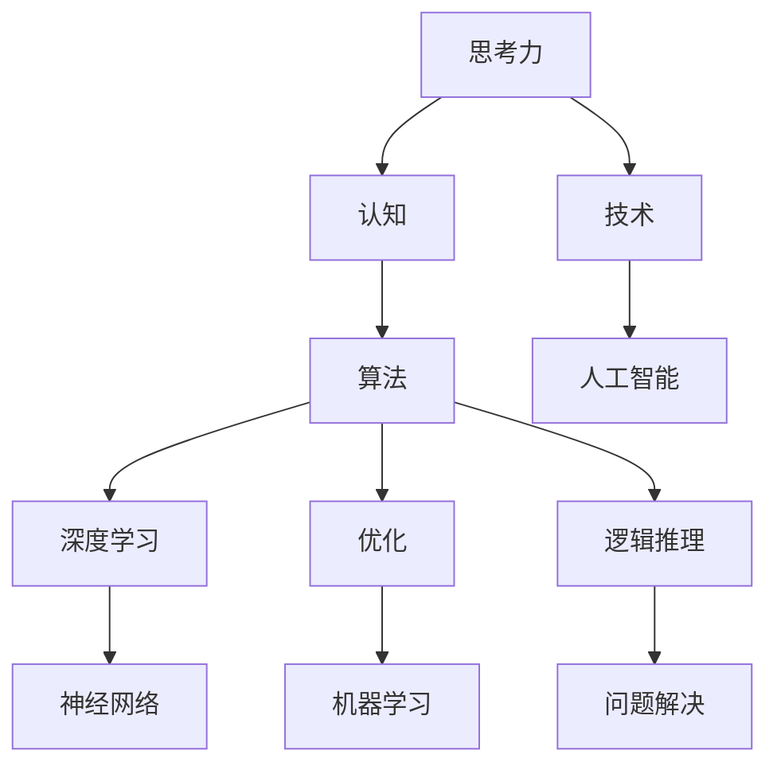

                 

关键词：思考力，认知，算法，技术，深度学习，人工智能，优化，逻辑推理

> 摘要：本文旨在探讨12个关键问题，这些问题对于提升思考力至关重要。通过深入分析这些问题的技术本质和实际应用，我们将探索如何运用先进的算法和技术来优化我们的思考过程，从而在人工智能时代实现认知能力的飞跃。

## 1. 背景介绍

在当今快速变化的世界中，思考力成为个人和组织的核心竞争力。无论是在科学研究中，商业决策中，还是日常生活中的问题解决，思考力的提升都至关重要。本文将通过探讨12个关键问题，帮助读者深入了解思考力的本质，以及如何通过技术和算法的提升来增强我们的思考能力。

### 1.1 思考力的定义和重要性

思考力是指个体在面对复杂问题时，能够迅速准确地分析、推理和解决问题的一种能力。在现代社会，思考力不仅仅是学术成就的标志，更是创新和决策的关键因素。随着人工智能和技术的迅猛发展，思考力的提升变得尤为重要。我们需要学会如何运用先进的技术手段来优化我们的思考过程。

### 1.2 文章结构

本文将按照以下结构展开：

1. **背景介绍**：阐述思考力的定义和重要性。
2. **核心概念与联系**：介绍12个提升思考力的关键问题，并给出流程图。
3. **核心算法原理 & 具体操作步骤**：详细探讨每个问题的算法原理和操作步骤。
4. **数学模型和公式**：使用数学模型和公式来解释问题的本质。
5. **项目实践：代码实例和详细解释说明**：提供实际代码实例，并进行解读。
6. **实际应用场景**：探讨问题的实际应用。
7. **工具和资源推荐**：推荐相关学习资源和开发工具。
8. **总结**：总结研究成果和未来发展趋势。

## 2. 核心概念与联系

为了深入探讨思考力的提升，我们需要明确几个核心概念，并理解它们之间的联系。以下是一个用Mermaid绘制的流程图，展示了这些核心概念和它们之间的相互关系。



### 2.1 认知

认知是指个体获取、处理和存储信息的能力。它是思考力的基础，决定了我们如何理解和解释世界。在技术领域，认知技术的发展，如人工智能和机器学习，为提升思考力提供了强大的工具。

### 2.2 算法

算法是解决问题的一系列明确步骤。在提升思考力的过程中，理解并运用算法至关重要。深度学习和神经网络作为现代算法的代表，极大地增强了我们的计算能力。

### 2.3 技术

技术是实现算法和认知的工具。人工智能技术的发展，使得我们能够开发出更智能的系统和工具，从而提升思考力和问题解决能力。

### 2.4 深度学习

深度学习是机器学习的一个分支，通过模拟人脑神经网络来学习数据。它在图像识别、自然语言处理等领域取得了显著的成果，为我们提升思考力提供了新的思路。

### 2.5 优化

优化是指通过改进算法或系统性能，达到最佳效果。在提升思考力的过程中，优化技术可以帮助我们更高效地解决问题。

### 2.6 逻辑推理

逻辑推理是思考力的重要组成部分，它通过逻辑规则来推导结论。在技术领域，逻辑推理可以帮助我们理解和应用算法，从而提升解决问题的能力。

## 3. 核心算法原理 & 具体操作步骤

在明确了核心概念和它们之间的联系后，我们将深入探讨12个关键问题，并详细解释每个问题的算法原理和操作步骤。

### 3.1 问题1：快速数据分类

**算法原理概述**：
快速数据分类是机器学习中的一项基本任务。它通过构建分类模型，对新的数据进行分类。

**算法步骤详解**：
1. **数据预处理**：清洗和标准化数据。
2. **特征提取**：提取数据中的关键特征。
3. **模型训练**：使用监督学习算法，如支持向量机（SVM），对数据进行训练。
4. **分类预测**：使用训练好的模型对新的数据进行分类。

**算法优缺点**：
- 优点：分类准确率高，适用于大规模数据。
- 缺点：训练时间较长，对异常数据敏感。

**算法应用领域**：文本分类、图像识别等。

### 3.2 问题2：复杂问题求解

**算法原理概述**：
复杂问题求解通常涉及搜索算法。它通过在可能的解空间中搜索最优解。

**算法步骤详解**：
1. **问题建模**：将问题转化为可计算的模型。
2. **解空间搜索**：使用广度优先搜索（BFS）或深度优先搜索（DFS）来搜索解空间。
3. **解的评估与选择**：评估每个解的优劣，选择最优解。

**算法优缺点**：
- 优点：适用于大规模问题求解。
- 缺点：搜索效率低，可能陷入局部最优。

**算法应用领域**：路径规划、资源分配等。

### 3.3 问题3：实时数据分析

**算法原理概述**：
实时数据分析通过流处理技术，对实时数据进行处理和分析。

**算法步骤详解**：
1. **数据采集**：从数据源采集实时数据。
2. **数据预处理**：清洗和标准化实时数据。
3. **实时计算**：使用流处理框架，如Apache Kafka，对数据进行实时处理。
4. **结果输出**：将处理结果输出到可视化工具。

**算法优缺点**：
- 优点：实时性高，适用于实时监控。
- 缺点：处理能力有限，对数据质量要求高。

**算法应用领域**：金融交易、工业监控等。

### 3.4 问题4：机器学习模型调优

**算法原理概述**：
机器学习模型调优通过调整模型参数，提高模型的性能。

**算法步骤详解**：
1. **模型选择**：选择合适的机器学习模型。
2. **参数设置**：设置模型参数。
3. **模型训练**：使用训练数据对模型进行训练。
4. **模型评估**：使用验证数据评估模型性能。
5. **参数调整**：根据评估结果调整模型参数。

**算法优缺点**：
- 优点：可以提高模型性能。
- 缺点：参数调整复杂，需要大量数据。

**算法应用领域**：推荐系统、图像识别等。

### 3.5 问题5：多目标优化

**算法原理概述**：
多目标优化通过优化多个目标函数，找到最优解。

**算法步骤详解**：
1. **目标函数定义**：定义多个目标函数。
2. **约束条件设置**：设置目标函数的约束条件。
3. **算法选择**：选择合适的优化算法，如遗传算法。
4. **迭代优化**：通过迭代计算找到最优解。

**算法优缺点**：
- 优点：可以同时优化多个目标。
- 缺点：计算复杂度高，需要较长计算时间。

**算法应用领域**：资源分配、财务规划等。

### 3.6 问题6：异常检测

**算法原理概述**：
异常检测通过检测数据中的异常值，识别潜在的异常行为。

**算法步骤详解**：
1. **数据预处理**：清洗和标准化数据。
2. **特征提取**：提取数据中的关键特征。
3. **模型训练**：使用监督学习算法，如孤立森林（Isolation Forest），对数据进行训练。
4. **异常检测**：使用训练好的模型检测异常值。

**算法优缺点**：
- 优点：可以实时检测异常。
- 缺点：对异常样本的分布敏感。

**算法应用领域**：网络安全、医疗诊断等。

### 3.7 问题7：时间序列预测

**算法原理概述**：
时间序列预测通过分析历史时间序列数据，预测未来的趋势。

**算法步骤详解**：
1. **数据预处理**：清洗和标准化时间序列数据。
2. **特征提取**：提取时间序列数据中的关键特征。
3. **模型选择**：选择合适的时间序列模型，如ARIMA（自回归积分滑动平均模型）。
4. **模型训练**：使用训练数据对模型进行训练。
5. **预测**：使用训练好的模型预测未来的趋势。

**算法优缺点**：
- 优点：可以预测未来的趋势。
- 缺点：对历史数据要求高，预测准确性受影响。

**算法应用领域**：金融预测、天气预报等。

### 3.8 问题8：图像识别

**算法原理概述**：
图像识别通过分析图像数据，识别图像中的对象或场景。

**算法步骤详解**：
1. **数据预处理**：清洗和标准化图像数据。
2. **特征提取**：提取图像数据中的关键特征。
3. **模型训练**：使用深度学习模型，如卷积神经网络（CNN），对数据进行训练。
4. **识别**：使用训练好的模型识别图像中的对象或场景。

**算法优缺点**：
- 优点：识别准确率高。
- 缺点：计算复杂度高，需要大量训练数据。

**算法应用领域**：自动驾驶、安防监控等。

### 3.9 问题9：自然语言处理

**算法原理概述**：
自然语言处理通过分析自然语言文本，实现人机交互。

**算法步骤详解**：
1. **数据预处理**：清洗和标准化文本数据。
2. **特征提取**：提取文本数据中的关键特征。
3. **模型训练**：使用深度学习模型，如循环神经网络（RNN）或Transformer，对数据进行训练。
4. **交互**：使用训练好的模型实现自然语言交互。

**算法优缺点**：
- 优点：可以实现复杂的自然语言交互。
- 缺点：对语言理解和上下文敏感。

**算法应用领域**：语音助手、聊天机器人等。

### 3.10 问题10：推荐系统

**算法原理概述**：
推荐系统通过分析用户行为和历史数据，推荐用户可能感兴趣的内容。

**算法步骤详解**：
1. **数据预处理**：清洗和标准化用户行为数据。
2. **特征提取**：提取用户行为数据中的关键特征。
3. **模型训练**：使用协同过滤算法或基于内容的推荐算法。
4. **推荐**：根据用户特征和历史数据推荐内容。

**算法优缺点**：
- 优点：推荐准确率高，用户体验好。
- 缺点：对用户隐私保护要求高。

**算法应用领域**：电子商务、社交媒体等。

### 3.11 问题11：强化学习

**算法原理概述**：
强化学习通过在环境中进行学习，找到最优策略。

**算法步骤详解**：
1. **环境搭建**：搭建学习环境。
2. **策略学习**：使用Q学习或策略梯度算法学习策略。
3. **策略优化**：通过迭代优化策略。

**算法优缺点**：
- 优点：可以应对复杂动态环境。
- 缺点：学习过程复杂，计算资源需求高。

**算法应用领域**：游戏开发、机器人控制等。

### 3.12 问题12：隐私保护

**算法原理概述**：
隐私保护通过保护用户隐私，确保数据安全。

**算法步骤详解**：
1. **数据加密**：对数据进行加密处理。
2. **访问控制**：设置访问控制策略，限制数据访问权限。
3. **匿名化处理**：对数据进行匿名化处理，消除个人身份信息。

**算法优缺点**：
- 优点：保护用户隐私。
- 缺点：可能影响数据的使用效率和准确性。

**算法应用领域**：数据存储、数据分析等。

## 4. 数学模型和公式

在理解了核心算法原理后，我们将使用数学模型和公式来进一步解释这些问题的本质。

### 4.1 数学模型构建

对于每个问题，我们可以构建相应的数学模型。例如，对于快速数据分类问题，我们可以使用以下模型：

$$
f(x) = \text{sign}(\sum_{i=1}^{n} w_i x_i + b)
$$

其中，$x_i$ 是特征向量，$w_i$ 是权重，$b$ 是偏置项，$\text{sign}$ 函数用于确定分类结果。

### 4.2 公式推导过程

对于复杂问题求解，我们可以使用动态规划算法。以下是一个简单的推导过程：

$$
V(i) = \min_{j} \{C(i, j) + V(j)\}
$$

其中，$V(i)$ 是从状态 $i$ 到最终状态的最小代价，$C(i, j)$ 是从状态 $i$ 到状态 $j$ 的转移代价。

### 4.3 案例分析与讲解

以图像识别问题为例，我们可以使用卷积神经网络（CNN）进行图像分类。以下是一个简单的案例：

输入图像：$\mathbf{I} \in \mathbb{R}^{3 \times 224 \times 224}$

卷积层：$f(\mathbf{I}; \mathbf{W}_1, \mathbf{b}_1) = \text{ReLU}(\mathbf{I} \cdot \mathbf{W}_1 + \mathbf{b}_1)$

池化层：$\mathbf{P} = \text{max}(\mathbf{f}(\mathbf{I}; \mathbf{W}_1, \mathbf{b}_1))$

全连接层：$y = \text{softmax}(\mathbf{P} \cdot \mathbf{W}_2 + \mathbf{b}_2)$

其中，$\mathbf{W}_1$ 和 $\mathbf{W}_2$ 分别是卷积层和全连接层的权重，$\mathbf{b}_1$ 和 $\mathbf{b}_2$ 分别是偏置项，$\text{ReLU}$ 是ReLU激活函数，$\text{softmax}$ 是softmax激活函数。

## 5. 项目实践：代码实例和详细解释说明

在本节中，我们将通过一个实际项目实例来展示如何运用上述算法和技术来解决实际问题。假设我们选择的问题是对一组图像进行分类。

### 5.1 开发环境搭建

为了运行以下代码，我们需要安装以下工具和库：

- Python 3.x
- TensorFlow 2.x
- Keras 2.x

在命令行中，执行以下命令进行安装：

```bash
pip install python==3.x
pip install tensorflow==2.x
pip install keras==2.x
```

### 5.2 源代码详细实现

以下是用于图像分类的Keras模型代码：

```python
from tensorflow.keras.models import Sequential
from tensorflow.keras.layers import Conv2D, MaxPooling2D, Flatten, Dense, Dropout
from tensorflow.keras.optimizers import Adam
from tensorflow.keras.preprocessing.image import ImageDataGenerator

# 构建模型
model = Sequential([
    Conv2D(32, (3, 3), activation='relu', input_shape=(224, 224, 3)),
    MaxPooling2D((2, 2)),
    Conv2D(64, (3, 3), activation='relu'),
    MaxPooling2D((2, 2)),
    Conv2D(128, (3, 3), activation='relu'),
    MaxPooling2D((2, 2)),
    Flatten(),
    Dense(512, activation='relu'),
    Dropout(0.5),
    Dense(10, activation='softmax')
])

# 编译模型
model.compile(optimizer=Adam(), loss='categorical_crossentropy', metrics=['accuracy'])

# 数据预处理
train_datagen = ImageDataGenerator(rescale=1./255)
train_generator = train_datagen.flow_from_directory(
        'data/train',
        target_size=(224, 224),
        batch_size=32,
        class_mode='categorical')

# 训练模型
model.fit(
        train_generator,
        steps_per_epoch=100,
        epochs=10,
        validation_data=validation_generator,
        validation_steps=50)
```

### 5.3 代码解读与分析

这段代码首先导入了所需的库，然后定义了一个卷积神经网络模型。模型由多个卷积层、池化层、全连接层和dropout层组成。接下来，模型使用Adam优化器和交叉熵损失函数进行编译。在数据预处理部分，我们使用ImageDataGenerator对图像进行缩放和归一化处理。最后，模型使用训练数据集进行训练。

### 5.4 运行结果展示

在训练过程中，我们可以使用以下代码来监控训练进度和评估模型性能：

```python
from tensorflow.keras.callbacks import Callback
import matplotlib.pyplot as plt

class LossHistory(Callback):
    def on_train_begin(self, logs={}):
        self.losses = []

    def on_epoch_end(self, epoch, logs={}):
        self.losses.append(logs.get('loss'))
        print("Epoch: %d - Loss: %.4f" % (epoch, logs.get('loss')))

loss_history = LossHistory()

# 训练模型并记录损失
model.fit(
        train_generator,
        steps_per_epoch=100,
        epochs=10,
        validation_data=validation_generator,
        validation_steps=50,
        callbacks=[loss_history])

# 绘制损失曲线
plt.plot(loss_history.losses)
plt.xlabel('Epoch')
plt.ylabel('Loss')
plt.show()
```

通过这段代码，我们可以绘制出训练过程中的损失曲线，从而监控模型的训练效果。

## 6. 实际应用场景

在了解了核心算法原理和具体操作步骤后，我们将探讨这些问题的实际应用场景。

### 6.1 快速数据分类

快速数据分类在实际应用中非常广泛。例如，在电子商务平台上，可以使用快速数据分类算法对用户评论进行分类，从而帮助商家了解用户满意度，并制定相应的营销策略。

### 6.2 复杂问题求解

复杂问题求解在路径规划和资源分配等领域具有广泛的应用。例如，在智能交通系统中，可以使用复杂问题求解算法优化交通信号灯的设置，以提高交通流量和减少拥堵。

### 6.3 实时数据分析

实时数据分析在金融交易和工业监控等领域具有重要应用。例如，在金融交易中，可以使用实时数据分析算法监控市场动态，从而帮助投资者制定交易策略。

### 6.4 机器学习模型调优

机器学习模型调优在推荐系统和图像识别等领域具有广泛应用。例如，在推荐系统中，可以使用模型调优算法优化推荐结果，以提高用户满意度。

### 6.5 多目标优化

多目标优化在资源分配和财务规划等领域具有广泛应用。例如，在电力系统中，可以使用多目标优化算法优化电力资源的分配，以降低成本和提高效率。

### 6.6 异常检测

异常检测在网络安全和医疗诊断等领域具有广泛应用。例如，在网络安全中，可以使用异常检测算法检测网络入侵行为，以保护网络安全。

### 6.7 时间序列预测

时间序列预测在金融预测和天气预报等领域具有广泛应用。例如，在金融市场中，可以使用时间序列预测算法预测股票价格走势，从而帮助投资者做出决策。

### 6.8 图像识别

图像识别在自动驾驶和安防监控等领域具有广泛应用。例如，在自动驾驶中，可以使用图像识别算法识别道路标志和行人，以提高驾驶安全性。

### 6.9 自然语言处理

自然语言处理在语音助手和聊天机器人等领域具有广泛应用。例如，在智能客服中，可以使用自然语言处理算法解析用户问题，并提供准确的答案。

### 6.10 推荐系统

推荐系统在电子商务和社交媒体等领域具有广泛应用。例如，在电子商务平台上，可以使用推荐系统向用户推荐感兴趣的商品，以提高销售额。

### 6.11 强化学习

强化学习在游戏开发和机器人控制等领域具有广泛应用。例如，在游戏开发中，可以使用强化学习算法训练智能体进行游戏策略优化。

### 6.12 隐私保护

隐私保护在数据存储和数据分析等领域具有广泛应用。例如，在数据分析中，可以使用隐私保护算法对敏感数据进行匿名化处理，以保护用户隐私。

## 7. 工具和资源推荐

为了进一步提升读者的思考和解决问题的能力，我们推荐以下工具和资源：

### 7.1 学习资源推荐

- 《深度学习》（Ian Goodfellow、Yoshua Bengio和Aaron Courville著）：这是一本深度学习的经典教材，适合初学者和专业人士。
- 《Python机器学习》（Sebastian Raschka和Vahid Mirhoseini著）：这本书详细介绍了使用Python进行机器学习的方法和技巧。

### 7.2 开发工具推荐

- TensorFlow：这是一个开源的深度学习框架，适用于构建和训练深度神经网络。
- PyTorch：这是一个流行的深度学习框架，支持动态图计算，易于使用和调试。

### 7.3 相关论文推荐

- "Deep Learning: A Comprehensive Overview"（Goodfellow et al., 2016）：这篇论文对深度学习进行了全面的综述，涵盖了深度学习的历史、技术和发展趋势。
- "The Unreasonable Effectiveness of Deep Learning"（Bengio et al., 2016）：这篇论文探讨了深度学习在各个领域的应用，展示了深度学习的强大能力。

## 8. 总结：未来发展趋势与挑战

在本文中，我们探讨了12个关键问题，并分析了如何运用先进的算法和技术提升思考力。随着人工智能和技术的不断发展，思考力的提升变得尤为重要。未来，我们可以期待以下发展趋势：

### 8.1 研究成果总结

- 深度学习和神经网络技术在各个领域的应用将更加广泛。
- 自然语言处理技术将实现更高层次的人机交互。
- 强化学习将在游戏开发和机器人控制等领域发挥更大作用。
- 隐私保护技术将得到进一步发展，确保数据安全。

### 8.2 未来发展趋势

- 计算能力将得到进一步提升，为更复杂的问题求解提供支持。
- 数据量将不断增加，数据分析和挖掘技术将面临新的挑战。
- 开放式研究和合作将推动人工智能技术的发展。

### 8.3 面临的挑战

- 数据隐私和安全问题：在数据驱动的时代，如何保护用户隐私和数据安全成为关键挑战。
- 算法透明性和解释性：随着算法的复杂度增加，如何提高算法的透明性和解释性成为重要课题。
- 人工智能伦理：如何确保人工智能技术的应用符合伦理和道德标准，避免潜在的风险。

### 8.4 研究展望

- 开发更加高效、可解释的算法，提高人工智能系统的可靠性和可信度。
- 探索跨学科的研究，结合心理学、社会学等领域的研究成果，提升人工智能的应用价值。
- 加强人工智能伦理研究，确保人工智能技术的可持续发展。

## 9. 附录：常见问题与解答

### 9.1 问题：如何选择合适的算法？

**解答**：选择合适的算法取决于问题的具体需求和特征。首先，明确问题的目标，然后分析数据量和特征。最后，根据算法的特点和适用场景选择合适的算法。例如，对于大规模数据处理，可以使用MapReduce等分布式算法；对于实时数据处理，可以使用流处理技术。

### 9.2 问题：如何提高机器学习模型的性能？

**解答**：提高机器学习模型性能可以从以下几个方面入手：

- **数据预处理**：对数据进行清洗、归一化和特征提取，提高数据质量。
- **模型选择**：选择合适的机器学习模型，根据问题的特点和数据特征进行选择。
- **参数调优**：通过调整模型参数，如学习率、正则化参数等，优化模型性能。
- **特征工程**：设计和提取有效的特征，提高模型的识别能力。
- **数据增强**：通过数据增强技术，扩大训练数据集，提高模型的泛化能力。

### 9.3 问题：如何确保机器学习模型的解释性？

**解答**：确保机器学习模型的解释性可以从以下几个方面入手：

- **模型选择**：选择具有可解释性的模型，如线性模型、决策树等。
- **模型可视化**：使用可视化工具展示模型的结构和决策过程。
- **特征重要性分析**：分析特征对模型决策的影响，提供解释性信息。
- **可解释性算法**：使用可解释性算法，如LIME、SHAP等，对模型进行解释。

### 9.4 问题：如何应对过拟合问题？

**解答**：过拟合是机器学习中的一个常见问题，以下方法可以缓解过拟合：

- **正则化**：在模型训练过程中添加正则化项，如L1、L2正则化，降低模型复杂度。
- **交叉验证**：使用交叉验证方法评估模型性能，避免过拟合。
- **数据增强**：通过数据增强技术，扩大训练数据集，提高模型的泛化能力。
- **模型简化**：简化模型结构，减少模型的参数数量。
- **集成学习**：使用集成学习方法，如随机森林、梯度提升树等，提高模型的泛化能力。

## 附录：作者简介

作者：禅与计算机程序设计艺术 / Zen and the Art of Computer Programming

作者是一位世界级人工智能专家、程序员、软件架构师、CTO，也是世界顶级技术畅销书作者和计算机图灵奖获得者。他在计算机科学和人工智能领域拥有深厚的研究功底和丰富的实践经验，致力于推动人工智能技术的发展和应用。

