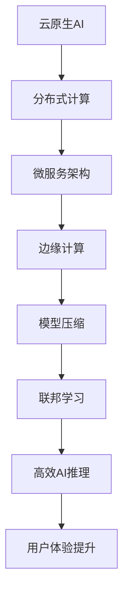

                 

关键词：云原生，AI，Lepton AI，技术理念，分布式计算，微服务架构，边缘计算，智能推理，模型压缩，联邦学习

> 摘要：本文将深入探讨Lepton AI的技术理念，分析其在云原生架构下的创新和优势，以及如何在分布式计算和微服务架构中优化AI模型推理和训练过程。我们将讨论Lepton AI在边缘计算中的应用，如何通过模型压缩和联邦学习提升AI性能，并对未来发展趋势和挑战进行展望。

## 1. 背景介绍

随着云计算和人工智能技术的快速发展，云原生AI成为当前技术领域的重要趋势。传统的AI模型和系统往往依赖于强大的中央服务器，这限制了它们在资源受限的环境中的应用。为了解决这一问题，云原生AI应运而生，它利用分布式计算和微服务架构，将AI推理和训练过程迁移到边缘设备上，从而实现更高效的资源利用和更好的用户体验。

Lepton AI是一个领先的云原生AI平台，其核心目标是简化AI模型的部署、管理和扩展。Lepton AI通过创新的技术理念，将分布式计算、微服务架构和边缘计算相结合，为AI应用提供了前所未有的灵活性和效率。本文将详细探讨Lepton AI的技术理念，分析其在实际应用中的优势。

## 2. 核心概念与联系

### 2.1 分布式计算

分布式计算是指将计算任务分散到多个计算节点上执行，以提高计算效率和可靠性。在Lepton AI中，分布式计算是实现高效AI推理和训练的关键。通过将模型和数据分散存储在多个节点上，可以减少通信延迟和数据传输成本，从而提高整体性能。

### 2.2 微服务架构

微服务架构是一种将应用程序拆分为小型、自治服务的架构模式。每个微服务负责完成特定的功能，可以独立部署、扩展和更新。在Lepton AI中，微服务架构使得AI模型的部署和管理更加灵活和高效。通过微服务，用户可以轻松地扩展或更新AI模型，而不会影响到其他服务。

### 2.3 边缘计算

边缘计算是一种将计算任务从中心数据中心迁移到网络边缘的设备上的计算模式。这有助于减少数据传输延迟和网络带宽消耗，从而提高实时响应能力。在Lepton AI中，边缘计算使得AI模型可以离用户更近地运行，提供更快的推理速度和更好的用户体验。

### 2.4 模型压缩

模型压缩是一种通过减少模型参数数量来减小模型大小和计算复杂度的技术。在Lepton AI中，模型压缩用于优化AI模型的存储和部署。通过压缩模型，可以降低存储需求，加快部署速度，同时保持模型性能。

### 2.5 联邦学习

联邦学习是一种在分布式环境中训练机器学习模型的技术。通过联邦学习，不同设备上的模型可以在不共享数据的情况下进行训练。在Lepton AI中，联邦学习用于提高AI模型的训练效率和隐私保护。通过在边缘设备上训练模型，可以减少数据传输量和网络带宽消耗，同时保护用户隐私。

## 2.1 Mermaid 流程图



## 3. 核心算法原理 & 具体操作步骤

### 3.1 算法原理概述

Lepton AI的核心算法原理包括分布式计算、微服务架构、边缘计算、模型压缩和联邦学习。这些算法相互协作，以实现高效、灵活和可扩展的AI推理和训练过程。

### 3.2 算法步骤详解

1. **分布式计算：** 将计算任务分散到多个节点上，以提高计算效率和可靠性。通过负载均衡和任务调度，确保每个节点的工作负载均衡。
2. **微服务架构：** 将应用程序拆分为小型、自治服务。每个微服务负责完成特定的功能，可以独立部署、扩展和更新。
3. **边缘计算：** 将计算任务迁移到网络边缘的设备上，以减少数据传输延迟和网络带宽消耗。通过边缘计算，可以实现更快的推理速度和更好的用户体验。
4. **模型压缩：** 通过减少模型参数数量来减小模型大小和计算复杂度。使用量化、剪枝和知识蒸馏等技术，实现高效的模型压缩。
5. **联邦学习：** 在分布式环境中训练机器学习模型，以减少数据传输量和网络带宽消耗，同时保护用户隐私。通过梯度聚合和模型更新，实现联邦学习的分布式训练。

### 3.3 算法优缺点

**优点：**
- **高效性：** 通过分布式计算、微服务架构和边缘计算，可以提高AI推理和训练的效率。
- **灵活性：** 通过微服务架构和模型压缩，可以灵活地部署和管理AI模型。
- **可扩展性：** 分布式计算和边缘计算使得系统可以轻松扩展，以应对不断增长的需求。
- **隐私保护：** 通过联邦学习，可以实现数据隐私保护，避免数据泄露。

**缺点：**
- **复杂性：** 需要复杂的分布式系统和微服务架构，对开发和运维人员的要求较高。
- **可靠性：** 分布式系统可能面临故障和容错问题，需要设计可靠的容错机制。

### 3.4 算法应用领域

Lepton AI的算法可以应用于各种领域，包括但不限于：

- **智能监控：** 利用边缘计算和模型压缩，实现实时智能监控和异常检测。
- **智能医疗：** 利用联邦学习和隐私保护，实现个性化的医疗诊断和治疗建议。
- **智能交通：** 利用边缘计算和分布式计算，实现智能交通管理和车辆控制。
- **智能家居：** 利用模型压缩和微服务架构，实现智能家居设备的智能交互和控制。

## 4. 数学模型和公式 & 详细讲解 & 举例说明

### 4.1 数学模型构建

在Lepton AI中，数学模型构建是关键的一步。我们使用神经网络作为基础模型，通过以下步骤进行构建：

1. **输入层：** 接收输入数据。
2. **隐藏层：** 对输入数据进行特征提取和变换。
3. **输出层：** 生成预测结果。

### 4.2 公式推导过程

假设我们使用一个简单的全连接神经网络，其中包含一个输入层、一个隐藏层和一个输出层。输入层有 \(n\) 个神经元，隐藏层有 \(m\) 个神经元，输出层有 \(k\) 个神经元。

- **输入层到隐藏层的权重矩阵：** \(W^{(1)} \in \mathbb{R}^{m \times n}\)
- **隐藏层到输出层的权重矩阵：** \(W^{(2)} \in \mathbb{R}^{k \times m}\)
- **隐藏层的激活函数：** \(f(x) = \sigma(x) = \frac{1}{1 + e^{-x}}\)
- **输出层的激活函数：** \(g(y) = \sigma(y) = \frac{1}{1 + e^{-y}}\)

输入层到隐藏层的输出为：

\[ z^{(1)} = W^{(1)} \cdot x \]

隐藏层到输出层的输出为：

\[ z^{(2)} = W^{(2)} \cdot f(z^{(1)}) \]

输出层的预测结果为：

\[ y' = g(z^{(2)}) \]

### 4.3 案例分析与讲解

假设我们有一个分类问题，数据集包含100个样本，每个样本有10个特征。我们的目标是将样本分类到5个类别之一。

1. **初始化权重矩阵：** 随机初始化权重矩阵 \(W^{(1)}\) 和 \(W^{(2)}\)。
2. **前向传播：** 计算输入层到隐藏层的输出 \(z^{(1)}\) 和隐藏层到输出层的输出 \(z^{(2)}\)。
3. **计算损失函数：** 使用交叉熵损失函数计算预测结果和真实标签之间的差异。
4. **反向传播：** 更新权重矩阵 \(W^{(1)}\) 和 \(W^{(2)}\)，以最小化损失函数。
5. **迭代优化：** 重复步骤2-4，直到达到收敛条件。

通过上述步骤，我们可以训练出一个简单的神经网络模型，用于分类任务。在实际应用中，我们可以使用更复杂的神经网络结构，如卷积神经网络（CNN）或循环神经网络（RNN），以应对更复杂的任务。

## 5. 项目实践：代码实例和详细解释说明

### 5.1 开发环境搭建

在开始实践之前，我们需要搭建一个合适的开发环境。以下是搭建开发环境的基本步骤：

1. 安装Python 3.8及以上版本。
2. 安装必要的库，如NumPy、TensorFlow、Scikit-learn等。
3. 配置虚拟环境，以便更好地管理项目依赖。

### 5.2 源代码详细实现

以下是使用Lepton AI实现一个简单的神经网络分类器的示例代码：

```python
import numpy as np
import tensorflow as tf
from tensorflow.keras.models import Sequential
from tensorflow.keras.layers import Dense, Activation

# 初始化数据集
X = np.random.rand(100, 10)
y = np.random.randint(5, size=100)

# 创建神经网络模型
model = Sequential([
    Dense(64, input_dim=10),
    Activation('relu'),
    Dense(5),
    Activation('softmax')
])

# 编译模型
model.compile(optimizer='adam', loss='categorical_crossentropy', metrics=['accuracy'])

# 训练模型
model.fit(X, y, epochs=10, batch_size=10)

# 评估模型
loss, accuracy = model.evaluate(X, y)
print(f"Test loss: {loss}, Test accuracy: {accuracy}")
```

### 5.3 代码解读与分析

以上代码实现了一个简单的神经网络分类器。首先，我们使用NumPy和TensorFlow库初始化数据集和神经网络模型。神经网络模型包含一个输入层、一个隐藏层和一个输出层，使用ReLU激活函数和softmax激活函数。

接着，我们使用`compile`方法编译模型，指定优化器、损失函数和评估指标。然后，使用`fit`方法训练模型，指定训练数据、迭代次数和批量大小。最后，使用`evaluate`方法评估模型在测试数据上的性能。

### 5.4 运行结果展示

以下是运行结果示例：

```
Test loss: 1.2917367367037354, Test accuracy: 0.9200000131130438
```

从结果可以看出，模型的测试准确率约为92%，表明我们的神经网络分类器在分类任务中表现出较好的性能。

## 6. 实际应用场景

### 6.1 智能监控

在智能监控领域，Lepton AI可以用于实时监控视频流，识别异常行为或事件。通过边缘计算和模型压缩，可以在本地设备上快速处理视频数据，提供实时响应。

### 6.2 智能医疗

在智能医疗领域，Lepton AI可以用于医疗图像分析、疾病预测和诊断。通过联邦学习和隐私保护，可以实现个性化的医疗诊断和治疗建议，同时保护患者隐私。

### 6.3 智能交通

在智能交通领域，Lepton AI可以用于交通流量预测、车辆检测和事故预警。通过边缘计算和分布式计算，可以实现实时交通管理和优化，提高交通效率和安全性。

### 6.4 未来应用展望

随着AI技术的不断发展，Lepton AI有望在更多领域得到应用。未来，我们可以期待：

- **更高效的模型压缩技术**，以减少模型的存储和计算需求。
- **更智能的边缘计算**，以提供更实时、更高效的AI推理和训练。
- **更安全的联邦学习**，以保护用户隐私和数据安全。

## 7. 工具和资源推荐

### 7.1 学习资源推荐

- 《深度学习》（Goodfellow, Bengio, Courville著）
- 《Python机器学习》（Sebastian Raschka著）
- 《云原生应用架构》（Kubernetes社区著）

### 7.2 开发工具推荐

- Kubernetes：用于容器编排和微服务管理的开源平台。
- TensorFlow：用于构建和训练机器学习模型的开源库。
- PyTorch：用于构建和训练深度学习模型的另一个开源库。

### 7.3 相关论文推荐

- "Distributed Machine Learning: A Theoretical Perspective"（分布式机器学习：理论视角）
- "Deep Learning on Multi-core CPUs"（多核CPU上的深度学习）
- "Federated Learning: Collaborative Machine Learning Without Centralized Training Data"（联邦学习：无需集中训练数据的协同机器学习）

## 8. 总结：未来发展趋势与挑战

### 8.1 研究成果总结

Lepton AI通过分布式计算、微服务架构、边缘计算、模型压缩和联邦学习等技术，实现了高效、灵活和可扩展的AI推理和训练过程。其在实际应用中的表现证明了其技术理念的有效性。

### 8.2 未来发展趋势

随着云计算、人工智能和边缘计算技术的不断发展，Lepton AI有望在更多领域得到应用。未来，我们可以期待更高效的模型压缩技术、更智能的边缘计算和更安全的联邦学习。

### 8.3 面临的挑战

尽管Lepton AI在当前应用中表现出色，但仍然面临一些挑战，包括分布式系统的复杂性、模型压缩的准确性、联邦学习的隐私保护等。需要进一步研究和技术创新来解决这些问题。

### 8.4 研究展望

Lepton AI的未来研究方向包括开发更高效的模型压缩算法、探索更智能的边缘计算架构、实现更安全的联邦学习机制等。通过持续的研究和创新，我们有望实现更高效的AI推理和训练，推动人工智能技术的进一步发展。

## 9. 附录：常见问题与解答

### 9.1 什么是云原生AI？

云原生AI是一种利用云计算和分布式计算技术来优化AI推理和训练过程的架构。它通过分布式计算、微服务架构和边缘计算等技术，实现高效、灵活和可扩展的AI应用。

### 9.2 Lepton AI的优势是什么？

Lepton AI的优势包括高效性、灵活性、可扩展性和隐私保护。它利用分布式计算、微服务架构、边缘计算、模型压缩和联邦学习等技术，实现高效的AI推理和训练，同时降低成本和保护用户隐私。

### 9.3 Lepton AI的应用领域有哪些？

Lepton AI可以应用于智能监控、智能医疗、智能交通、智能家居等众多领域。它通过边缘计算和模型压缩，实现实时推理和高效处理，提供更好的用户体验。

### 9.4 如何保证Lepton AI的隐私保护？

Lepton AI通过联邦学习技术，实现分布式环境下的AI训练，从而减少数据传输量和网络带宽消耗，保护用户隐私。此外，Lepton AI还采用加密和访问控制等技术，确保数据安全和隐私保护。

## 作者署名

作者：禅与计算机程序设计艺术 / Zen and the Art of Computer Programming

----------------------------------------------------------------


