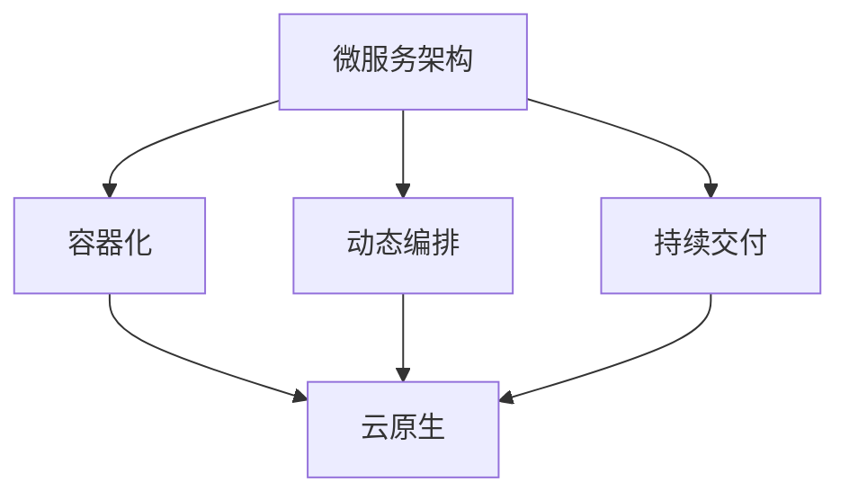

                 

 > 关键词：云原生、微服务架构、设计模式、最佳实践、DevOps

> 摘要：本文将探讨云原生微服务架构的核心概念、设计模式与最佳实践，旨在帮助开发者理解和应用这一现代软件开发模式，提高系统的可扩展性、可靠性和灵活性。

## 1. 背景介绍

随着云计算技术的飞速发展，传统的单体架构（Monolithic Architecture）逐渐暴露出诸多问题，如系统可扩展性差、部署困难、技术债务积累等。为了应对这些挑战，微服务架构（Microservices Architecture）应运而生。微服务架构将大型单体应用分解为多个小型、独立部署和管理的服务，从而提高了系统的灵活性和可维护性。

云原生（Cloud Native）进一步扩展了微服务架构，将容器技术、自动化部署和持续交付等理念融入其中，使得应用程序能够更加轻松地在云环境中运行和扩展。云原生应用通常由多个微服务组成，并且能够利用容器（如Docker）、服务网格（如Istio）、持续集成与持续部署（CI/CD）等现代技术。

本文将首先介绍云原生微服务架构的核心概念，然后探讨设计模式与最佳实践，以帮助开发者构建高效、可靠的云原生微服务系统。

## 2. 核心概念与联系

### 2.1. 微服务架构（Microservices Architecture）

微服务架构是一种软件架构风格，它将大型单体应用拆分为多个独立、自治的小服务。这些服务通常围绕业务领域进行划分，每个服务都拥有自己的数据存储、业务逻辑和API。以下是微服务架构的核心概念：

- **自治性**：每个服务都是独立的，可以独立开发、测试、部署和扩展。
- **松耦合**：服务之间通过轻量级的通信协议（如HTTP/REST、gRPC）进行通信，降低服务之间的依赖。
- **业务领域驱动**：服务通常按照业务领域进行划分，使得每个服务都专注于解决特定的问题。
- **分布式系统**：微服务架构构建了分布式系统，这要求开发者具备处理分布式系统中常见问题（如网络延迟、故障恢复等）的能力。

### 2.2. 云原生（Cloud Native）

云原生是一个更广泛的术语，它不仅包括微服务架构，还涵盖了容器化、自动化部署、持续交付等理念。以下是云原生的一些核心概念：

- **容器化**：应用程序及其依赖项被打包到容器中，如Docker，以便在一致的运行环境中部署和运行。
- **动态编排**：容器编排工具（如Kubernetes）用于自动化容器的部署、扩展和管理。
- **自动化部署与持续交付**：自动化工具（如Jenkins、GitLab CI/CD）用于构建、测试和部署应用程序，提高开发效率。
- **DevOps**：DevOps是一种文化、实践和工具集，旨在缩短产品开发周期、提高软件质量、增强团队协作。

### 2.3. Mermaid 流程图

下面是一个简单的Mermaid流程图，展示了微服务架构和云原生技术之间的联系：



## 3. 核心算法原理 & 具体操作步骤

### 3.1. 算法原理概述

云原生微服务架构的核心算法原理在于服务的自治性、松耦合和动态扩展。以下是一些关键原理：

- **服务自治性**：每个服务都是独立的，具有自己的生命周期、配置和管理机制。
- **服务发现**：服务需要能够动态地发现其他服务，以实现松耦合的通信。
- **负载均衡**：为了提高系统的可用性和性能，需要将请求均衡地分配到多个服务实例上。
- **服务监控和健康检查**：系统需要监控每个服务的运行状态，以便及时发现并处理故障。

### 3.2. 算法步骤详解

以下是构建云原生微服务架构的基本步骤：

1. **服务划分**：根据业务领域和功能需求，将应用程序分解为多个微服务。
2. **服务定义**：为每个服务定义API，包括数据模型、操作接口和版本管理。
3. **服务实现**：实现每个服务的业务逻辑，并确保服务之间具有良好的接口定义和通信机制。
4. **容器化**：使用Docker等工具将服务及其依赖项打包到容器中。
5. **动态编排**：使用Kubernetes等工具对容器进行自动化部署、扩展和管理。
6. **服务发现与负载均衡**：实现服务发现机制，并使用负载均衡器（如Nginx、HAProxy）将请求分配到不同的服务实例。
7. **监控与日志**：使用Prometheus、ELK（Elasticsearch、Logstash、Kibana）等工具对系统进行监控和日志管理。

### 3.3. 算法优缺点

**优点**：

- **高可扩展性**：通过动态扩展服务实例，系统可以根据需求自动调整资源。
- **高灵活性**：服务可以独立部署和扩展，便于迭代和优化。
- **高可靠性**：服务之间松耦合，单个服务的故障不会影响整个系统的运行。
- **高可维护性**：服务自治性使得每个服务可以独立开发和维护。

**缺点**：

- **复杂性**：需要管理和协调多个服务，增加了系统的复杂度。
- **服务发现与通信**：服务之间的通信需要实现服务发现和负载均衡机制，增加了系统的通信开销。
- **分布式事务**：跨服务的分布式事务处理相对复杂，需要使用补偿事务等策略。

### 3.4. 算法应用领域

云原生微服务架构适用于以下领域：

- **电子商务**：提供高可扩展性和高可用性的在线购物体验。
- **金融科技**：处理高并发、高可靠性的金融交易。
- **物流与供应链**：实现高效、可靠的物流信息系统。
- **在线教育**：提供灵活、可扩展的在线学习平台。
- **物联网**：管理大规模物联网设备，实现高效的实时数据处理和分析。

## 4. 数学模型和公式 & 详细讲解 & 举例说明

### 4.1. 数学模型构建

在云原生微服务架构中，我们可以使用以下数学模型来分析系统的性能和扩展性：

- **服务响应时间**：每个服务的响应时间可以用均值和方差来描述。
- **系统吞吐量**：系统的吞吐量可以用每个服务实例的吞吐量和负载均衡策略来计算。
- **资源利用率**：系统的资源利用率可以用CPU、内存和网络带宽等资源的利用率来表示。

### 4.2. 公式推导过程

以下是上述数学模型的推导过程：

1. **服务响应时间**：
   - 均值（μ）: \( \mu = \frac{1}{N} \sum_{i=1}^{N} r_i \)
   - 方差（σ²）: \( \sigma^2 = \frac{1}{N} \sum_{i=1}^{N} (r_i - \mu)^2 \)
   其中，N是服务实例的数量，\( r_i \)是第i个服务实例的响应时间。

2. **系统吞吐量**：
   - \( T = \frac{1}{\mu} \)
   其中，T是系统的吞吐量，μ是单个服务的响应时间。

3. **资源利用率**：
   - CPU利用率：\( \frac{C}{C_{max}} \)
   - 内存利用率：\( \frac{M}{M_{max}} \)
   - 网络带宽利用率：\( \frac{N}{N_{max}} \)
   其中，C、M、N分别是当前CPU、内存和网络带宽的利用率，\( C_{max} \)、\( M_{max} \)、\( N_{max} \)分别是CPU、内存和网络带宽的最大利用率。

### 4.3. 案例分析与讲解

假设我们有一个电子商务系统，包含商品服务、订单服务、支付服务和库存服务。每个服务都有10个实例，每个实例的响应时间均值为100ms，方差为10ms。

1. **服务响应时间**：
   - 平均响应时间：\( \mu = 100ms \)
   - 方差：\( \sigma^2 = 10ms \)

2. **系统吞吐量**：
   - 吞吐量：\( T = \frac{1}{\mu} = \frac{1}{100ms} = 10 \text{请求/s} \)

3. **资源利用率**：
   - CPU利用率：\( \frac{C}{C_{max}} = 1 \)
   - 内存利用率：\( \frac{M}{M_{max}} = 0.5 \)
   - 网络带宽利用率：\( \frac{N}{N_{max}} = 0.5 \)

通过这个例子，我们可以看到系统的性能和扩展性。为了提高系统的吞吐量，我们可以增加服务实例的数量，或者优化服务实现的效率。为了提高资源利用率，我们可以优化服务之间的负载均衡策略，或者调整服务实例的配置。

## 5. 项目实践：代码实例和详细解释说明

### 5.1. 开发环境搭建

在本文中，我们将使用Docker和Kubernetes来构建一个简单的云原生微服务架构。首先，我们需要在本地计算机上安装Docker和Kubernetes。

1. **安装Docker**：
   - 访问[Docker官网](https://www.docker.com/)，下载适用于您操作系统的Docker安装包。
   - 按照安装指南完成Docker的安装。

2. **安装Kubernetes**：
   - 访问[Kubernetes官网](https://kubernetes.io/)，了解如何安装Kubernetes。
   - 使用minikube在本地计算机上启动一个Kubernetes集群。

### 5.2. 源代码详细实现

接下来，我们将创建一个简单的云原生微服务项目，包含以下服务：

1. **商品服务（Product Service）**：
   - 功能：提供商品的查询和更新接口。
   - 实现语言：Go。

2. **订单服务（Order Service）**：
   - 功能：处理订单的创建、更新和取消。
   - 实现语言：Python。

3. **支付服务（Payment Service）**：
   - 功能：处理支付请求，更新订单状态。
   - 实现语言：Java。

4. **库存服务（Inventory Service）**：
   - 功能：提供库存查询和更新接口。
   - 实现语言：Node.js。

### 5.3. 代码解读与分析

以下是商品服务的代码示例：

```go
package main

import (
    "encoding/json"
    "log"
    "net/http"
)

type Product struct {
    ID       string  `json:"id"`
    Name     string  `json:"name"`
    Price    float64 `json:"price"`
}

var products = map[string]Product{
    "1": {"iPhone 12", 799.00},
    "2": {"Samsung Galaxy S21", 999.00},
}

func getProduct(w http.ResponseWriter, r *http.Request) {
    id := r.URL.Query().Get("id")
    product, exists := products[id]
    if !exists {
        http.Error(w, "Product not found", http.StatusNotFound)
        return
    }
    json.NewEncoder(w).Encode(product)
}

func main() {
    http.HandleFunc("/products", getProduct)
    log.Fatal(http.ListenAndServe(":8080", nil))
}
```

这个简单的Go程序提供了一个RESTful接口，用于查询商品信息。下面是代码的主要部分：

- `Product`结构体定义了商品的基本信息，如ID、名称和价格。
- `products`映射了商品的ID到其实例。
- `getProduct`函数处理HTTP GET请求，根据请求中的ID查询商品，并将结果返回给客户端。
- `main`函数设置HTTP服务监听端口并启动服务。

### 5.4. 运行结果展示

为了运行这个商品服务，我们需要创建一个Dockerfile，将Go应用程序打包到容器中。以下是Dockerfile的示例：

```Dockerfile
FROM golang:1.18-alpine
WORKDIR /app
COPY . .
RUN go build -o main .
EXPOSE 8080
CMD ["./main"]
```

接下来，我们使用以下命令构建和运行容器：

```sh
docker build -t product-service .
docker run -d --name product-service product-service
```

然后，我们可以使用curl命令测试商品服务的接口：

```sh
curl "http://localhost:8080/products?id=1"
```

返回结果：

```json
{
  "id": "1",
  "name": "iPhone 12",
  "price": 799
}
```

通过这个简单的示例，我们可以看到如何使用Docker和Go构建一个云原生微服务。类似地，我们可以创建其他服务的Dockerfile和运行命令，从而构建一个完整的云原生微服务架构。

## 6. 实际应用场景

云原生微服务架构在多个行业和领域得到了广泛应用。以下是一些实际应用场景：

### 6.1. 电子商务

电子商务平台通常具有高并发、高可用性的需求。云原生微服务架构可以帮助电子商务平台实现灵活的扩展和高效的管理。例如，淘宝、京东等大型电商平台都采用了微服务架构，以提高系统的性能和可靠性。

### 6.2. 金融科技

金融科技（Fintech）领域对系统的安全性、稳定性和响应速度有严格要求。微服务架构可以帮助金融科技公司快速迭代产品、优化用户体验，并确保系统的可靠性和可扩展性。例如，支付宝、微信支付等支付平台都采用了微服务架构。

### 6.3. 物联网

物联网（IoT）系统通常需要处理大量的实时数据。微服务架构可以帮助物联网系统实现高效的数据处理和灵活的扩展。例如，智能家居系统、智慧城市项目等都可以采用微服务架构。

### 6.4. 未来应用展望

随着云计算和物联网的不断发展，云原生微服务架构将在更多领域得到应用。以下是一些未来应用展望：

- **人工智能**：云原生微服务架构可以帮助人工智能系统实现高效的训练和推理，提高AI应用的性能和可靠性。
- **边缘计算**：边缘计算结合云原生微服务架构，可以实现高效的数据处理和实时响应，为智能交通、智能医疗等领域提供支持。
- **区块链**：区块链技术结合微服务架构，可以实现分布式账本的高效管理和安全运行。

## 7. 工具和资源推荐

为了更好地理解和实践云原生微服务架构，以下是一些推荐的学习资源、开发工具和相关论文：

### 7.1. 学习资源推荐

- **《云原生应用架构指南》**：介绍了云原生应用的核心概念、设计模式和最佳实践。
- **Kubernetes官方文档**：提供了详尽的Kubernetes教程和API文档。
- **Docker官方文档**：介绍了Docker的基本概念、安装和使用方法。

### 7.2. 开发工具推荐

- **Docker**：用于容器化应用程序。
- **Kubernetes**：用于容器编排和管理。
- **Jenkins**：用于持续集成和持续部署。
- **Prometheus**：用于监控和告警。
- **ELK（Elasticsearch、Logstash、Kibana）**：用于日志管理和分析。

### 7.3. 相关论文推荐

- **《Microservices: A Definition》**：对微服务架构进行了全面的定义和解释。
- **《Docker: A Brief History of Decay》**：分析了Docker的发展历程和面临的挑战。
- **《Kubernetes: Up and Running》**：介绍了Kubernetes的基本原理和实践方法。

## 8. 总结：未来发展趋势与挑战

云原生微服务架构已经成为现代软件开发的基石。随着云计算、物联网、人工智能等技术的发展，云原生微服务架构将继续扩展其应用范围和影响力。以下是对未来发展趋势和挑战的总结：

### 8.1. 研究成果总结

- **云原生微服务架构**：研究成果集中在提高系统的可扩展性、可靠性和灵活性。
- **服务网格**：研究成果集中在提高服务间通信的安全性和性能。
- **自动化与持续交付**：研究成果集中在提高开发效率和软件质量。
- **分布式系统技术**：研究成果集中在处理分布式系统中常见的问题，如网络延迟、故障恢复等。

### 8.2. 未来发展趋势

- **智能化**：随着人工智能技术的发展，云原生微服务架构将更加智能化，如自动服务发现、自动负载均衡等。
- **多云与混合云**：云原生微服务架构将更好地支持多云和混合云环境，提高系统的灵活性和可扩展性。
- **边缘计算与云原生**：边缘计算与云原生微服务架构的融合，将为实时数据处理和响应提供更强支持。

### 8.3. 面临的挑战

- **服务治理**：随着服务数量的增加，服务治理（如服务发现、负载均衡、服务监控等）的复杂性将增加。
- **跨服务事务**：分布式事务处理仍然是一个挑战，需要新的技术和方法来处理跨服务的事务。
- **安全性**：随着云原生微服务架构的广泛应用，安全性问题将变得更加突出，需要更加严密的安全措施。

### 8.4. 研究展望

未来，云原生微服务架构的研究将集中在以下几个方面：

- **服务自治性**：提高服务的自治性，实现更加灵活和高效的服务管理。
- **分布式系统优化**：优化分布式系统的性能和可靠性，降低系统的复杂度。
- **多技术融合**：将多种技术（如人工智能、区块链等）与云原生微服务架构相结合，实现更广泛的应用场景。

总之，云原生微服务架构将继续发展，为现代软件开发带来更多的机遇和挑战。

## 9. 附录：常见问题与解答

### 9.1. 什么是云原生？

云原生是指利用云计算资源和自动化工具构建、运行和管理应用程序的方法。云原生应用程序具有以下几个特点：

- **容器化**：应用程序及其依赖项被打包到容器中，以便在一致的运行环境中部署和运行。
- **动态编排**：使用容器编排工具（如Kubernetes）自动化部署、扩展和管理容器。
- **持续交付**：使用自动化工具（如Jenkins、GitLab CI/CD）实现持续集成和持续交付。
- **微服务架构**：应用程序由多个独立、自治的微服务组成，每个服务都可以独立开发、测试和部署。

### 9.2. 微服务架构和单体架构有什么区别？

微服务架构和单体架构的主要区别在于：

- **架构风格**：微服务架构将大型单体应用分解为多个独立、自治的小服务；而单体架构则将所有功能集中在一个庞大的应用中。
- **部署方式**：微服务架构允许独立部署和扩展每个服务，而单体架构通常需要整体部署和扩展。
- **依赖关系**：微服务架构中的服务之间通常通过轻量级的通信协议进行通信，而单体架构中的模块之间可能存在紧密的依赖关系。
- **可维护性**：微服务架构提高了系统的可维护性，每个服务都可以独立开发和维护；而单体架构在维护时可能需要修改多个模块。

### 9.3. 什么是服务网格？

服务网格是一种基础设施层，用于管理和服务间通信。服务网格的主要功能包括：

- **服务发现**：自动发现和服务注册，使得服务可以动态地发现其他服务。
- **负载均衡**：将请求均衡地分配到不同的服务实例，提高系统的可用性和性能。
- **安全**：提供安全通信机制，如TLS加密、身份验证和授权等。
- **监控与日志**：收集和聚合服务间通信的监控数据和日志，以便进行性能分析和故障排查。

### 9.4. 如何实现分布式事务？

分布式事务是指在多个服务之间处理事务的方法。以下是一些实现分布式事务的方法：

- **两阶段提交（2PC）**：两阶段提交是一种分布式事务协议，分为准备阶段和提交阶段。通过协调多个参与者的状态，实现事务的一致性。
- **补偿事务**：补偿事务是一种在分布式系统中处理事务的方法，通过在失败事务发生后执行补偿操作来恢复系统状态。
- **本地事务**：在分布式系统中，某些部分可能采用本地事务，如使用本地数据库实现事务管理。
- **分布式事务框架**：如Seata、TCC（Try、Confirm、Cancel）等，这些框架提供了一套分布式事务处理机制，简化了分布式事务的实现。

### 9.5. 如何监控云原生微服务架构？

监控云原生微服务架构的方法包括：

- **Prometheus**：用于监控和收集服务指标，如响应时间、吞吐量、错误率等。
- **Kubernetes集群监控**：使用如Grafana、Kube-state-metrics等工具监控Kubernetes集群的状态和性能。
- **服务网格监控**：使用如Istio、Linkerd等服务网格工具监控服务间通信的性能和安全性。
- **日志管理**：使用如ELK（Elasticsearch、Logstash、Kibana）等工具收集、存储和分析服务日志。
- **告警系统**：设置告警规则，以便在系统出现问题时及时通知相关人员。

通过上述方法，可以实现对云原生微服务架构的全面监控和性能分析，确保系统的稳定运行。

### 9.6. 如何优化云原生微服务架构的性能？

以下是一些优化云原生微服务架构性能的方法：

- **服务拆分**：合理划分服务边界，避免服务过大导致性能瓶颈。
- **缓存**：使用缓存（如Redis、Memcached）减少数据库访问次数，提高系统性能。
- **数据库优化**：使用数据库索引、分库分表等技术提高数据库性能。
- **负载均衡**：合理配置负载均衡器（如Nginx、HAProxy），确保请求均匀分配到服务实例。
- **资源扩展**：根据需求动态扩展服务实例，提高系统的可用性和性能。
- **服务网格优化**：优化服务网格（如Istio、Linkerd）的配置，减少服务间通信的开销。

通过上述方法，可以显著提高云原生微服务架构的性能和可靠性。

### 9.7. 如何保证云原生微服务架构的安全性？

以下是一些保证云原生微服务架构安全性的方法：

- **容器镜像安全**：确保容器镜像来自可信的仓库，并使用扫描工具（如Clair、Docker Bench for Security）检查容器镜像的安全性。
- **服务认证与授权**：使用OAuth 2.0、JWT等认证机制确保服务间通信的安全性，并使用RBAC（基于角色的访问控制）确保服务访问权限。
- **网络隔离**：使用网络隔离策略（如防火墙、网络命名空间）限制服务之间的通信，防止恶意攻击。
- **日志审计**：记录和审计服务访问日志，及时发现和处理潜在的安全问题。
- **加密与加密存储**：对敏感数据进行加密，并使用加密存储（如AES加密算法）保护数据安全。

通过上述方法，可以显著提高云原生微服务架构的安全性。

