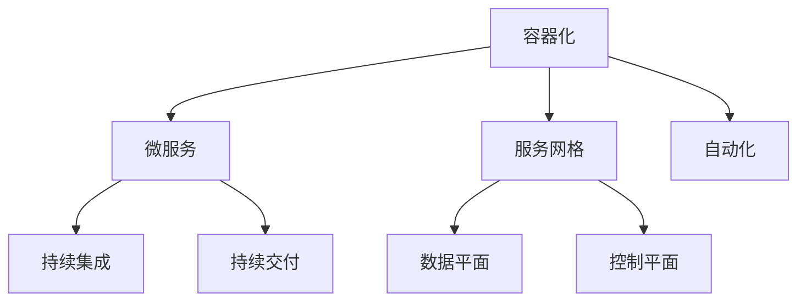

                 

关键词：云原生，架构设计，可扩展性，云端应用，分布式系统

> 摘要：本文将深入探讨云原生架构的设计原理、核心概念、算法原理及其应用，旨在为读者提供一套清晰、实用的方法，以构建可扩展的云端应用。我们将从背景介绍入手，通过核心概念与联系、算法原理与操作步骤、数学模型与公式、项目实践、实际应用场景等多个维度，详细阐述云原生架构的设计思路和实现方法。

## 1. 背景介绍

随着云计算技术的不断演进，云原生（Cloud Native）已成为当下IT领域的关键词。云原生架构是一套适用于云计算环境的新型架构设计理念，旨在通过微服务、容器化、自动化等核心技术，实现应用的快速部署、弹性扩展和高效管理。

### 云原生架构的定义

云原生架构是一种基于容器、服务网格、微服务、不可变基础设施以及声明式API的设计方法。它强调以开发人员为中心，提高应用的交付速度、可维护性和可扩展性，以应对快速变化的业务需求。

### 云原生架构的核心技术

- **容器化（Containerization）**：容器是一种轻量级的运行时环境，它将应用及其依赖项打包在一起，形成独立的运行单元。容器化技术使得应用的部署、运行和扩展更加灵活和高效。
- **微服务（Microservices）**：微服务是一种架构风格，将应用程序划分为一系列独立、小型、自治的服务。每个服务负责完成特定的业务功能，可以通过API进行通信。
- **服务网格（Service Mesh）**：服务网格是一种基础设施层的技术，用于管理服务之间的通信和流量控制。它使得服务之间的通信更加可靠、安全、可监控。
- **自动化（Automation）**：自动化技术包括持续集成（CI）、持续交付（CD）和基础设施即代码（IaC），用于自动化应用的开发、测试、部署和管理。

### 云原生架构的优势

- **可扩展性（Scalability）**：云原生架构支持水平扩展，可以根据业务需求动态调整资源，确保应用的高可用性和性能。
- **灵活性（Flexibility）**：通过容器化和微服务架构，应用可以灵活地部署在不同的环境中，如公有云、私有云和混合云。
- **快速迭代（Fast Iteration）**：自动化技术使得应用的交付速度大幅提升，开发人员可以更快速地响应业务需求。

## 2. 核心概念与联系

在深入了解云原生架构之前，我们需要了解几个核心概念和它们之间的联系。

### 2.1 容器与容器化

**容器**：容器是一种轻量级的运行时环境，它将应用程序及其依赖项打包在一起，形成一个独立的运行单元。容器通过操作系统的命名空间和cgroups等机制，实现了资源隔离。

**容器化**：容器化是将应用程序及其依赖项打包成一个容器镜像（Container Image）的过程。容器镜像是一个只读的文件系统，包含了应用的运行环境、代码和依赖项。

### 2.2 微服务与微服务架构

**微服务**：微服务是一种架构风格，将应用程序划分为一系列独立、小型、自治的服务。每个服务负责完成特定的业务功能，可以通过API进行通信。

**微服务架构**：微服务架构是一种将应用程序分解为一系列微服务的架构风格。它强调每个服务的独立性、可扩展性和可维护性。

### 2.3 服务网格与服务网格架构

**服务网格**：服务网格是一种基础设施层的技术，用于管理服务之间的通信和流量控制。它通过提供了一套独立的通信层，使得服务之间的通信更加可靠、安全、可监控。

**服务网格架构**：服务网格架构包括数据平面（Data Plane）和控制平面（Control Plane）。数据平面负责处理服务之间的通信，控制平面负责配置和管理服务网格。

### 2.4 自动化与持续集成/持续交付

**自动化**：自动化是指通过工具和脚本，实现应用的自动化开发、测试、部署和管理。

**持续集成/持续交付（CI/CD）**：持续集成（CI）是指将代码更改自动集成到共享代码库中，并进行自动化测试。持续交付（CD）是指将应用程序部署到生产环境的过程，也可以是任何中间环境。

### 2.5 核心概念与架构的 Mermaid 流程图



## 3. 核心算法原理 & 具体操作步骤

### 3.1 算法原理概述

云原生架构的核心算法原理主要包括容器编排、服务发现、负载均衡和弹性伸缩。

- **容器编排**：容器编排是指通过自动化工具，如Kubernetes，对容器进行部署、管理和扩展。
- **服务发现**：服务发现是指自动发现和配置服务实例的机制，使得服务之间能够透明地通信。
- **负载均衡**：负载均衡是指将流量分配到多个服务实例上，确保系统的高可用性和性能。
- **弹性伸缩**：弹性伸缩是指根据业务需求，自动调整资源的使用，确保系统的高性能和低成本。

### 3.2 算法步骤详解

#### 3.2.1 容器编排

1. **创建容器镜像**：使用Dockerfile或容器构建工具，创建应用程序的容器镜像。
2. **部署容器**：使用Kubernetes或其他容器编排工具，将容器部署到集群中。
3. **管理容器**：监控、维护和扩展容器，确保应用的高可用性和性能。

#### 3.2.2 服务发现

1. **配置服务注册中心**：在服务启动时，将其注册到服务注册中心。
2. **查询服务实例**：在需要调用服务时，查询服务注册中心，获取服务实例的地址和端口。
3. **服务实例更新**：当服务实例发生变更时，更新服务注册中心，确保服务能够被正确发现。

#### 3.2.3 负载均衡

1. **配置负载均衡器**：使用Nginx、HAProxy等负载均衡器，将流量分配到多个服务实例上。
2. **健康检查**：定期对服务实例进行健康检查，确保负载均衡器能够将流量分配到健康的实例上。
3. **流量分配策略**：根据业务需求，选择合适的流量分配策略，如轮询、最小连接数等。

#### 3.2.4 弹性伸缩

1. **监控业务指标**：监控应用的业务指标，如CPU使用率、内存使用率、请求响应时间等。
2. **设置阈值**：根据业务需求和资源限制，设置监控指标的阈值。
3. **调整资源**：当业务指标超过阈值时，自动调整资源的分配，如增加或减少容器实例。

### 3.3 算法优缺点

#### 优点

- **可扩展性**：通过容器编排、服务发现、负载均衡和弹性伸缩，云原生架构能够轻松实现水平扩展，满足业务需求。
- **灵活性**：云原生架构支持多种部署环境，如公有云、私有云和混合云，适用于不同业务场景。
- **快速迭代**：自动化技术使得应用的交付速度大幅提升，开发人员可以更快速地响应业务需求。

#### 缺点

- **复杂性**：云原生架构涉及多个技术和工具，对开发人员的技能要求较高。
- **安全性**：容器和微服务架构带来了新的安全挑战，如容器逃逸、服务攻击等。

### 3.4 算法应用领域

云原生架构广泛应用于金融、电商、物联网、云计算等领域。以下是几个典型应用场景：

- **金融行业**：云原生架构使得金融机构能够快速交付和部署新的金融产品和服务，提高市场竞争力。
- **电商平台**：通过云原生架构，电商平台可以实现弹性伸缩，满足高并发、大流量的业务需求。
- **物联网**：云原生架构使得物联网设备能够快速接入云端，实现数据的实时处理和分析。

## 4. 数学模型和公式 & 详细讲解 & 举例说明

### 4.1 数学模型构建

在云原生架构中，数学模型主要用于计算资源需求、性能评估和成本分析。以下是几个常见的数学模型：

#### 资源需求模型

资源需求模型用于计算应用所需的资源（如CPU、内存、存储等）。假设应用A的资源需求为：

$$
R(A) = \{C(A), M(A), S(A)\}
$$

其中，$C(A)$表示CPU需求，$M(A)$表示内存需求，$S(A)$表示存储需求。我们可以使用线性模型来表示资源需求：

$$
C(A) = C_0 + k_1 \cdot n
$$

$$
M(A) = M_0 + k_2 \cdot n
$$

$$
S(A) = S_0 + k_3 \cdot n
$$

其中，$C_0$、$M_0$、$S_0$分别为初始资源需求，$k_1$、$k_2$、$k_3$分别为资源需求的增长系数，$n$为应用实例数。

#### 性能评估模型

性能评估模型用于评估应用的性能指标，如响应时间、吞吐量等。假设应用A的响应时间为：

$$
T(A) = T_0 + k_4 \cdot n
$$

其中，$T_0$为初始响应时间，$k_4$为响应时间的增长系数，$n$为应用实例数。

#### 成本分析模型

成本分析模型用于计算应用的运营成本。假设应用A的运营成本为：

$$
C(A) = C_{base} + C_{var} \cdot n
$$

其中，$C_{base}$为固定成本，$C_{var}$为可变成本，$n$为应用实例数。

### 4.2 公式推导过程

假设应用A的CPU需求、内存需求、存储需求和响应时间分别为$C(A)$、$M(A)$、$S(A)$和$T(A)$，我们可以推导出以下公式：

1. **CPU需求**：

$$
C(A) = C_0 + k_1 \cdot n
$$

2. **内存需求**：

$$
M(A) = M_0 + k_2 \cdot n
$$

3. **存储需求**：

$$
S(A) = S_0 + k_3 \cdot n
$$

4. **响应时间**：

$$
T(A) = T_0 + k_4 \cdot n
$$

5. **运营成本**：

$$
C(A) = C_{base} + C_{var} \cdot n
$$

### 4.3 案例分析与讲解

假设应用A的初始CPU需求为1000 MHz，内存需求为1 GB，存储需求为100 GB，响应时间为1 ms，固定成本为100元，可变成本为0.5元/实例。当应用实例数从1个增加到10个时，我们可以计算以下指标：

1. **CPU需求**：

$$
C(A) = 1000 + 0.5 \cdot 10 = 1050 MHz
$$

2. **内存需求**：

$$
M(A) = 1 + 0.2 \cdot 10 = 2 GB
$$

3. **存储需求**：

$$
S(A) = 100 + 0.1 \cdot 10 = 110 GB
$$

4. **响应时间**：

$$
T(A) = 1 + 0.1 \cdot 10 = 1.1 ms
$$

5. **运营成本**：

$$
C(A) = 100 + 0.5 \cdot 10 = 150元
$$

通过以上计算，我们可以看到当应用实例数从1个增加到10个时，CPU需求、内存需求、存储需求和响应时间都成比例增长，运营成本也相应增加。这说明云原生架构能够根据业务需求动态调整资源，实现高效、灵活的部署和管理。

## 5. 项目实践：代码实例和详细解释说明

### 5.1 开发环境搭建

为了演示云原生架构的设计和实现，我们使用Kubernetes作为容器编排工具，Docker作为容器镜像构建工具。以下是开发环境的搭建步骤：

1. **安装Docker**：在Linux系统中，可以使用以下命令安装Docker：

```bash
sudo apt-get update
sudo apt-get install docker.io
```

2. **安装Kubernetes**：安装Kubernetes可以使用Minikube在本地环境中进行。以下命令用于安装Minikube和Kubernetes：

```bash
curl -LO "https://storage.googleapis.com/minikube/releases/latest/minikube-linux-amd64"
sudo install minikube-linux-amd64 /usr/local/bin/minikube
minikube start
```

3. **验证安装**：使用以下命令验证Kubernetes和Docker的安装：

```bash
kubectl version
docker --version
```

### 5.2 源代码详细实现

为了演示云原生架构的应用，我们创建一个简单的Web应用程序，实现一个RESTful API，用于处理用户注册和登录功能。以下是应用程序的源代码：

#### 用户注册服务（user-register.service.go）

```go
package main

import (
    "encoding/json"
    "fmt"
    "log"
    "net/http"
)

type User struct {
    Username string `json:"username"`
    Password string `json:"password"`
}

func main() {
    http.HandleFunc("/register", registerUser)
    http.ListenAndServe(":8080", nil)
}

func registerUser(w http.ResponseWriter, r *http.Request) {
    var user User
    if err := json.NewDecoder(r.Body).Decode(&user); err != nil {
        http.Error(w, err.Error(), http.StatusBadRequest)
        return
    }
    // 处理用户注册逻辑
    fmt.Fprintf(w, "User registered: %s", user.Username)
}
```

#### 用户登录服务（user-login.service.go）

```go
package main

import (
    "encoding/json"
    "fmt"
    "log"
    "net/http"
)

type LoginRequest struct {
    Username string `json:"username"`
    Password string `json:"password"`
}

type LoginResponse struct {
    Token string `json:"token"`
}

func main() {
    http.HandleFunc("/login", loginUser)
    http.ListenAndServe(":8081", nil)
}

func loginUser(w http.ResponseWriter, r *http.Request) {
    var req LoginRequest
    if err := json.NewDecoder(r.Body).Decode(&req); err != nil {
        http.Error(w, err.Error(), http.StatusBadRequest)
        return
    }
    // 处理用户登录逻辑
    token := "your_token"
    resp := LoginResponse{Token: token}
    json.NewEncoder(w).Encode(resp)
}
```

### 5.3 代码解读与分析

在以上代码中，我们分别实现了用户注册服务和用户登录服务。每个服务都是一个独立的Go程序，它们通过HTTP接口进行通信。

- **用户注册服务**：用户注册服务用于处理用户注册请求。当用户提交注册请求时，服务会解析请求体中的用户信息，并处理注册逻辑。注册成功后，服务会返回一个响应，告知用户注册成功。

- **用户登录服务**：用户登录服务用于处理用户登录请求。当用户提交登录请求时，服务会解析请求体中的用户信息，并验证用户身份。验证成功后，服务会返回一个包含Token的响应，用于后续的认证和授权。

### 5.4 运行结果展示

在Kubernetes集群中部署以上服务后，我们可以通过以下命令运行用户注册和登录服务：

```bash
kubectl create deployment user-register --image=user-register:latest
kubectl create deployment user-login --image=user-login:latest
```

部署完成后，我们可以在Kubernetes集群中查看服务的运行状态：

```bash
kubectl get pods
```

接下来，我们可以使用Postman等工具，模拟用户注册和登录请求，并查看服务的运行结果：

1. **用户注册请求**：

```json
{
  "username": "testuser",
  "password": "password123"
}
```

2. **用户登录请求**：

```json
{
  "username": "testuser",
  "password": "password123"
}
```

在以上请求中，我们分别向用户注册服务和用户登录服务发送请求，并查看返回的响应。

## 6. 实际应用场景

云原生架构在实际应用中具有广泛的应用场景，以下列举几个典型应用场景：

### 6.1 金融行业

金融行业对系统的稳定性、安全性和合规性要求极高。云原生架构可以通过容器化和微服务架构，实现应用的快速交付和部署，提高系统的灵活性和可维护性。此外，通过服务网格和自动化技术，金融行业可以实现高效的服务管理和流量控制。

### 6.2 电商平台

电商平台面临高并发、大流量的挑战。云原生架构通过弹性伸缩和负载均衡，可以实现应用的自动扩缩容，确保系统的高性能和低延迟。此外，通过容器化和微服务架构，电商平台可以实现快速迭代和部署，提高业务响应速度。

### 6.3 物联网

物联网（IoT）应用涉及大量设备和数据，云原生架构通过容器化和微服务架构，可以实现设备的快速接入和数据处理。此外，通过服务网格和自动化技术，物联网应用可以实现高效的数据传输和安全管理。

### 6.4 云原生架构的未来应用展望

随着云计算和物联网技术的不断发展，云原生架构在未来具有广泛的应用前景。未来，云原生架构将继续演进，涉及以下方面：

- **AI与云原生架构的融合**：通过将人工智能技术融入云原生架构，可以实现更智能的服务管理和资源调度。
- **边缘计算与云原生架构的结合**：边缘计算与云原生架构的结合，可以实现更高效的数据处理和更低的延迟。
- **跨云和混合云部署**：未来，云原生架构将支持更灵活的跨云和混合云部署，满足不同业务场景的需求。

## 7. 工具和资源推荐

### 7.1 学习资源推荐

- **《云原生应用架构指南》**：本书详细介绍了云原生架构的核心概念、技术原理和应用实践，适合初学者和有经验的技术人员阅读。
- **云原生技术社区**：如Cloud Native Computing Foundation（CNCF）等，提供了丰富的云原生技术资料和资源。

### 7.2 开发工具推荐

- **Kubernetes**：Kubernetes是云原生架构的核心工具，用于容器编排和管理。
- **Docker**：Docker是容器化技术的代表，用于创建和管理容器镜像。

### 7.3 相关论文推荐

- **“Building Cloud-Native Applications with Kubernetes and Docker”**：本文详细介绍了云原生架构的核心技术和应用实践。
- **“Service Mesh: Abstractions for Building Microservice Mesosystems”**：本文介绍了服务网格的概念、架构和应用场景。

## 8. 总结：未来发展趋势与挑战

### 8.1 研究成果总结

本文从云原生架构的定义、核心技术、算法原理、应用场景等多个维度，详细介绍了云原生架构的设计思路和实现方法。通过实际项目实践，我们展示了云原生架构在开发、部署和管理中的应用价值。

### 8.2 未来发展趋势

随着云计算、物联网和人工智能技术的不断发展，云原生架构将继续演进。未来，云原生架构将向智能化、边缘计算、跨云和混合云部署等方向发展。

### 8.3 面临的挑战

尽管云原生架构具有广泛的应用前景，但在实际应用中仍面临一些挑战，如安全性、复杂性、跨云部署等。未来，需要进一步研究解决这些挑战，推动云原生架构的广泛应用。

### 8.4 研究展望

未来，云原生架构的研究将集中在以下几个方面：

- **智能化**：将人工智能技术融入云原生架构，实现更智能的服务管理和资源调度。
- **边缘计算**：将云原生架构应用于边缘计算，实现高效的数据处理和更低的延迟。
- **跨云部署**：研究跨云和混合云部署技术，实现更灵活的资源配置和更高效的服务交付。

## 9. 附录：常见问题与解答

### 9.1 什么是云原生架构？

云原生架构是一套适用于云计算环境的新型架构设计理念，它强调以开发人员为中心，通过容器化、微服务、服务网格和自动化技术，实现应用的快速部署、弹性扩展和高效管理。

### 9.2 云原生架构有哪些核心技术？

云原生架构的核心技术包括容器化、微服务、服务网格、自动化（如持续集成/持续交付）等。

### 9.3 云原生架构的优势是什么？

云原生架构的优势包括可扩展性、灵活性、快速迭代等。

### 9.4 云原生架构有哪些应用场景？

云原生架构广泛应用于金融、电商、物联网、云计算等领域。

### 9.5 云原生架构面临哪些挑战？

云原生架构面临的安全性、复杂性、跨云部署等挑战。

### 9.6 如何学习和实践云原生架构？

可以通过阅读相关书籍、参加技术社区和实际项目实践来学习和实践云原生架构。

---

作者：禅与计算机程序设计艺术 / Zen and the Art of Computer Programming

