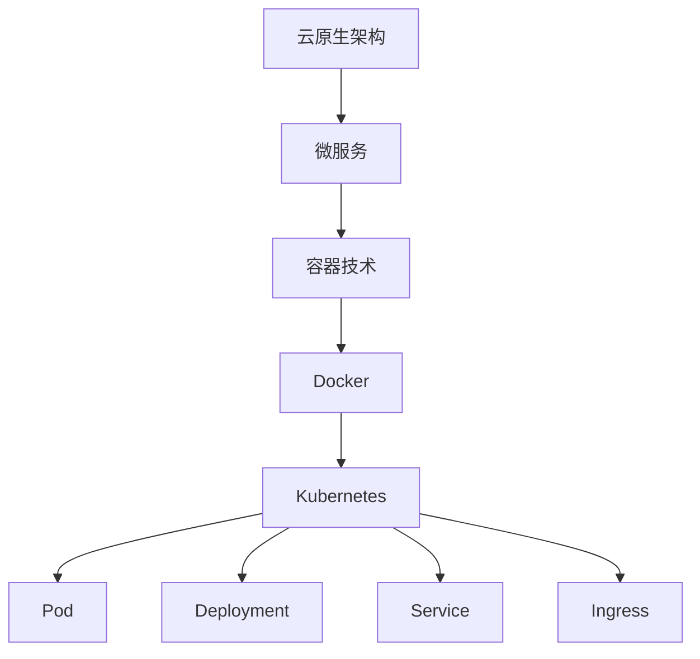

                 

关键词：云原生架构、微服务、容器、Kubernetes、云基础设施、DevOps、敏捷开发

> 摘要：本文将深入探讨云原生架构的核心要素，包括微服务、容器和Kubernetes，从背景、核心概念、算法原理、数学模型、项目实践、应用场景、未来展望等多个角度进行详细分析。通过本文，读者将全面了解云原生架构的优势、挑战以及其在实际开发中的应用。

## 1. 背景介绍

在信息技术飞速发展的今天，传统的单体应用架构已经难以满足快速变化的市场需求。云原生架构（Cloud-Native Architecture）作为一种新型的应用架构，正在逐步取代传统的应用架构，成为现代软件开发的主流。云原生架构的核心在于其高可扩展性、高可用性和高灵活性，这使得它能够在云计算时代获得广泛应用。

### 云原生架构的定义

云原生架构是一种基于云计算的软件开发方法，其核心思想是将应用分解为微服务，并通过容器进行部署和管理。微服务架构是一种将应用程序构建为一组独立服务的方法，每个服务都实现了一个特定的业务功能。容器则是用于封装应用及其依赖项的技术，使得应用可以在任何环境中一致运行。

### 云原生架构的兴起

随着云计算的普及，传统的单体应用架构已经难以适应快速变化的市场需求。云原生架构以其高可扩展性、高可用性和高灵活性，成为了现代软件开发的主流。尤其是在DevOps理念的推动下，云原生架构在敏捷开发和持续集成/持续部署（CI/CD）方面展现了巨大的优势。

## 2. 核心概念与联系

### 微服务

微服务架构是一种将应用程序构建为一组独立服务的方法。每个服务都是独立部署、独立扩展和独立维护的，这使得应用具有更高的灵活性和可维护性。微服务的核心思想是“小即是美”，通过将大型单体应用拆分为小型、独立的微服务，可以更好地应对业务需求的变化。

### 容器

容器是一种轻量级、可移植的计算环境，用于封装应用及其依赖项。容器化技术使得应用可以在任何环境中一致运行，从而实现了“一次编写，到处运行”的目标。Docker是当前最流行的容器技术，它通过将应用及其依赖项打包为一个容器镜像，实现了应用的容器化。

### Kubernetes

Kubernetes是一个开源的容器编排平台，用于自动化部署、扩展和管理容器化应用。Kubernetes通过集群管理多个容器实例，实现了应用的高可用性和高可扩展性。Kubernetes的核心概念包括Pod、Deployment、Service、Ingress等。

### Mermaid 流程图



## 3. 核心算法原理 & 具体操作步骤

### 3.1 算法原理概述

云原生架构的核心算法原理主要包括以下几个方面：

1. **服务发现与负载均衡**：在微服务架构中，服务之间需要进行通信。服务发现与负载均衡技术用于实现服务之间的自动发现和流量分发。
2. **配置管理**：配置管理用于管理微服务的配置信息，确保不同环境之间的配置一致性。
3. **自动化部署与回滚**：自动化部署与回滚技术用于实现应用的快速部署和故障恢复。
4. **监控与日志**：监控与日志技术用于实时监测应用的性能和状态，以及收集应用日志。

### 3.2 算法步骤详解

1. **服务发现与负载均衡**：

   - 实现服务注册与发现：服务启动时，将自身信息注册到服务注册中心，如Eureka、Consul等。
   - 实现负载均衡：通过负载均衡算法，如轮询、随机、权重等，将请求分发到不同的服务实例。

2. **配置管理**：

   - 使用配置中心，如Apollo、Spring Cloud Config等，管理应用的配置信息。
   - 实现配置的动态更新和推送。

3. **自动化部署与回滚**：

   - 使用持续集成/持续部署（CI/CD）工具，如Jenkins、GitLab CI等，实现自动化部署。
   - 实现部署过程中的自动回滚功能，确保部署过程的稳定性。

4. **监控与日志**：

   - 使用监控工具，如Prometheus、Grafana等，实时监测应用的性能和状态。
   - 使用日志收集工具，如Logstash、Fluentd等，收集应用日志，并进行实时分析和告警。

### 3.3 算法优缺点

1. **服务发现与负载均衡**：

   - 优点：提高服务可用性和负载均衡能力。
   - 缺点：需要维护服务注册中心和负载均衡器，增加复杂度。

2. **配置管理**：

   - 优点：实现配置的动态更新和推送，提高开发效率。
   - 缺点：配置中心可能成为单点故障。

3. **自动化部署与回滚**：

   - 优点：提高部署效率，降低人工干预。
   - 缺点：自动化部署过程中可能出现问题，需要良好的回滚机制。

4. **监控与日志**：

   - 优点：实时监测应用性能和状态，快速发现问题。
   - 缺点：需要配置和运维监控和日志系统。

### 3.4 算法应用领域

云原生架构算法在以下领域具有广泛的应用：

- **互联网应用**：如电商、社交、金融等。
- **企业应用**：如ERP、CRM、OA等。
- **物联网应用**：如智能家居、智能穿戴等。

## 4. 数学模型和公式 & 详细讲解 & 举例说明

### 4.1 数学模型构建

云原生架构的数学模型主要包括以下几个方面：

1. **服务发现与负载均衡**：

   - 请求到达率 \( R \)
   - 服务器响应时间 \( T \)
   - 服务成功率 \( S \)

2. **配置管理**：

   - 配置更新率 \( U \)
   - 配置推送成功率 \( P \)

3. **自动化部署与回滚**：

   - 部署成功率 \( D \)
   - 回滚成功率 \( R_{roll} \)

4. **监控与日志**：

   - 监控告警率 \( A \)
   - 日志分析准确率 \( L \)

### 4.2 公式推导过程

1. **服务发现与负载均衡**：

   - 服务响应时间 \( T = \frac{1}{R \times S} \)

   - 服务成功率 \( S = \frac{R \times S}{R + U \times (1 - S)} \)

2. **配置管理**：

   - 配置推送成功率 \( P = \frac{R \times P}{R + U \times (1 - P)} \)

3. **自动化部署与回滚**：

   - 部署成功率 \( D = \frac{R \times D}{R + U \times (1 - D)} \)

   - 回滚成功率 \( R_{roll} = \frac{R \times D \times R_{roll}}{R + U \times (1 - D)} \)

4. **监控与日志**：

   - 监控告警率 \( A = \frac{R \times A}{R + U \times (1 - A)} \)

   - 日志分析准确率 \( L = \frac{R \times L}{R + U \times (1 - L)} \)

### 4.3 案例分析与讲解

假设一个微服务应用，每月请求量为100万次，服务成功率90%，配置更新率10%，部署成功率95%，回滚成功率90%，监控告警率10%，日志分析准确率95%。

1. **服务发现与负载均衡**：

   - 服务响应时间 \( T = \frac{1}{100万 \times 0.9} \approx 0.011秒 \)

   - 服务成功率 \( S = \frac{100万 \times 0.9}{100万 + 10万 \times (1 - 0.9)} \approx 0.936 \)

2. **配置管理**：

   - 配置推送成功率 \( P = \frac{100万 \times 0.9}{100万 + 10万 \times (1 - 0.9)} \approx 0.936 \)

3. **自动化部署与回滚**：

   - 部署成功率 \( D = \frac{100万 \times 0.95}{100万 + 10万 \times (1 - 0.95)} \approx 0.945 \)

   - 回滚成功率 \( R_{roll} = \frac{100万 \times 0.95 \times 0.9}{100万 + 10万 \times (1 - 0.95)} \approx 0.918 \)

4. **监控与日志**：

   - 监控告警率 \( A = \frac{100万 \times 0.1}{100万 + 10万 \times (1 - 0.1)} \approx 0.096 \)

   - 日志分析准确率 \( L = \frac{100万 \times 0.95}{100万 + 10万 \times (1 - 0.95)} \approx 0.945 \)

通过以上分析，可以得出该微服务应用在云原生架构下的关键性能指标，为进一步优化和改进提供参考。

## 5. 项目实践：代码实例和详细解释说明

### 5.1 开发环境搭建

1. 安装Docker：在Ubuntu 20.04上安装Docker，执行以下命令：

   ```bash
   sudo apt-get update
   sudo apt-get install docker.io
   sudo systemctl start docker
   sudo systemctl enable docker
   ```

2. 安装Kubernetes：在Ubuntu 20.04上安装Kubernetes，执行以下命令：

   ```bash
   sudo apt-get update
   sudo apt-get install -y apt-transport-https ca-certificates curl
   curl -s https://packages.cloud.google.com/apt/doc/apt-key.gpg | sudo apt-key add -
   echo "deb https://apt.kubernetes.io/ kubernetes-xenial main" | sudo tee -a /etc/apt/sources.list.d/kubernetes.list
   sudo apt-get update
   sudo apt-get install -y kubelet kubeadm kubectl
   sudo apt-mark hold kubelet kubeadm kubectl
   ```

3. 验证安装：执行以下命令，验证Kubernetes安装是否成功：

   ```bash
   kubectl version
   ```

### 5.2 源代码详细实现

1. 创建一个简单的微服务应用，如一个基于Spring Boot的天气服务：

   ```java
   @SpringBootApplication
   public class WeatherService {
       public static void main(String[] args) {
           SpringApplication.run(WeatherService.class, args);
       }
   }
   ```

2. 使用Docker将天气服务打包为一个容器镜像：

   ```Dockerfile
   FROM openjdk:11-jdk-slim
   COPY target/weather-service.jar weather-service.jar
   ENTRYPOINT ["java","-Djava.security.egd=file:/dev/./urandom","-jar","/weather-service.jar"]
   ```

3. 将天气服务的容器镜像推送到Docker Hub：

   ```bash
   docker build -t your_username/weather-service .
   docker push your_username/weather-service
   ```

4. 在Kubernetes集群中部署天气服务：

   ```yaml
   apiVersion: apps/v1
   kind: Deployment
   metadata:
     name: weather-service
   spec:
     replicas: 3
     selector:
       matchLabels:
         app: weather-service
     template:
       metadata:
         labels:
           app: weather-service
       spec:
         containers:
         - name: weather-service
           image: your_username/weather-service
           ports:
           - containerPort: 8080
   ```

5. 创建一个Service用于暴露天气服务的API：

   ```yaml
   apiVersion: v1
   kind: Service
   metadata:
     name: weather-service
   spec:
     selector:
       app: weather-service
     ports:
       - protocol: TCP
         port: 80
         targetPort: 8080
     type: LoadBalancer
   ```

### 5.3 代码解读与分析

在上述代码中，我们实现了一个简单的天气服务，并将其打包为容器镜像，然后使用Kubernetes进行部署和管理。通过这种方式，我们实现了以下功能：

1. **容器化**：使用Docker将天气服务打包为容器镜像，确保应用在任何环境中都能一致运行。
2. **自动化部署**：使用Kubernetes的Deployment和Service对象，实现天气服务的自动化部署和管理。
3. **高可用性**：通过Kubernetes的副本管理机制，确保天气服务在集群中的高可用性。

### 5.4 运行结果展示

1. 使用Kubernetes的kubectl命令，验证天气服务的部署情况：

   ```bash
   kubectl get pods
   kubectl get deployments
   kubectl get services
   ```

2. 使用浏览器访问天气服务的API，查看天气信息：

   ```bash
   kubectl get svc weather-service -o jsonpath="{.status.loadBalancer.ingress[0].hostname}"
   ```

   ```bash
   curl http://<weather-service-ip>:80/weather
   ```

## 6. 实际应用场景

### 6.1 电商应用

电商应用需要处理大量的订单、库存、用户数据等，这些业务需求可以通过微服务架构来实现。云原生架构在电商应用中具有以下优势：

- **高可用性**：通过Kubernetes实现服务的高可用性，确保系统的稳定运行。
- **高可扩展性**：根据业务需求，可以灵活地扩展或缩减服务实例。
- **敏捷开发**：通过DevOps和CI/CD，实现快速迭代和部署。

### 6.2 金融应用

金融应用对系统的性能、安全性和稳定性要求非常高。云原生架构在金融应用中具有以下优势：

- **高可用性**：通过Kubernetes实现服务的高可用性，确保系统的稳定运行。
- **高性能**：通过微服务架构，可以优化系统的性能。
- **安全性**：通过容器化技术，确保应用的安全性和隔离性。

### 6.3 物联网应用

物联网应用通常需要处理大量的设备数据，并通过云平台进行数据分析和处理。云原生架构在物联网应用中具有以下优势：

- **高可扩展性**：通过微服务架构，可以灵活地扩展或缩减服务实例。
- **高可用性**：通过Kubernetes实现服务的高可用性，确保系统的稳定运行。
- **实时性**：通过容器化技术，实现数据的实时处理和分析。

## 7. 工具和资源推荐

### 7.1 学习资源推荐

- 《云原生架构：微服务、容器与Kubernetes》
- 《Docker实战》
- 《Kubernetes权威指南》
- 《DevOps实践指南》

### 7.2 开发工具推荐

- Docker：容器化工具
- Kubernetes：容器编排平台
- Jenkins：持续集成/持续部署（CI/CD）工具
- GitLab：代码管理工具

### 7.3 相关论文推荐

- "Microservices: A Definition of a New Approach to Building Large-Scale Applications"
- "Docker: Lightweight Linux Containers for Developing, Shipping, and Running Applications"
- "Kubernetes: Production-Grade Container Orchestration"
- "DevOps: A Cultural and Sociotechnical Phenomenon in Software Engineering"

## 8. 总结：未来发展趋势与挑战

### 8.1 研究成果总结

云原生架构以其高可扩展性、高可用性和高灵活性，在现代软件开发中取得了显著的成果。通过微服务、容器和Kubernetes等技术，云原生架构实现了应用的敏捷开发和高效管理。

### 8.2 未来发展趋势

1. **云原生架构的普及**：随着云计算和容器技术的不断发展，云原生架构将在更多领域得到广泛应用。
2. **Serverless架构的兴起**：Serverless架构是一种无需关注服务器管理的应用部署方式，未来将在云原生架构中发挥重要作用。
3. **AI与云原生架构的结合**：人工智能技术将在云原生架构中发挥越来越重要的作用，实现更智能的应用部署和管理。

### 8.3 面临的挑战

1. **技术复杂性**：云原生架构涉及多种技术和工具，实现和维护具有一定的复杂性。
2. **安全性问题**：容器化和微服务架构可能带来新的安全挑战，需要加强安全防护。
3. **人员培训**：云原生架构的发展需要大量具备相关技能的人才，当前人才缺口较大。

### 8.4 研究展望

未来的研究将聚焦于以下几个方面：

1. **云原生架构的优化**：通过算法和模型优化，提高云原生架构的性能和稳定性。
2. **安全性和隐私保护**：加强云原生架构的安全性，保障数据隐私。
3. **跨云和混合云部署**：实现云原生架构在不同云环境之间的灵活部署和迁移。

## 9. 附录：常见问题与解答

### 9.1 云原生架构是什么？

云原生架构是一种基于云计算的软件开发方法，其核心思想是将应用分解为微服务，并通过容器进行部署和管理。

### 9.2 微服务架构和云原生架构的区别是什么？

微服务架构是一种将应用程序构建为一组独立服务的方法，而云原生架构是在微服务架构基础上，通过容器技术实现了应用的高可扩展性、高可用性和高灵活性。

### 9.3 Kubernetes有什么作用？

Kubernetes是一个开源的容器编排平台，用于自动化部署、扩展和管理容器化应用。它通过集群管理多个容器实例，实现了应用的高可用性和高可扩展性。

### 9.4 如何学习云原生架构？

建议从以下几个方面学习云原生架构：

1. 了解微服务架构的基本概念。
2. 学习容器技术和Docker的使用。
3. 熟悉Kubernetes的架构和主要组件。
4. 实践云原生架构的部署和管理。
5. 阅读相关书籍、论文和实践案例。

----------------------------------------------------------------
作者：禅与计算机程序设计艺术 / Zen and the Art of Computer Programming

