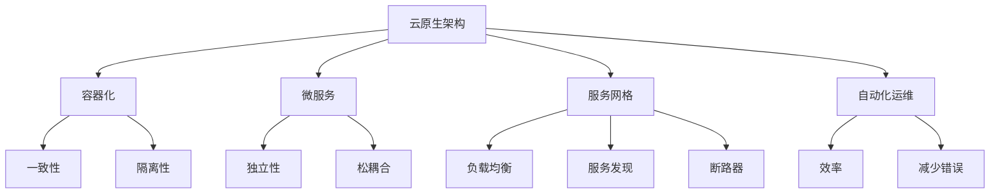

                 

关键词：云原生架构，可扩展性，云端应用程序，微服务，容器化，服务网格，自动化运维

摘要：本文将深入探讨云原生架构的概念、核心要素和实施方法，通过详细的分析和实例，解释如何利用云原生技术构建高度可扩展的云端应用程序。我们还将讨论云原生架构在实际应用场景中的价值，以及未来发展的趋势和挑战。

## 1. 背景介绍

随着云计算技术的飞速发展，企业对于IT系统的需求也发生了巨大的变化。传统的单体架构已经无法满足现代应用程序对灵活性、可扩展性和可维护性的要求。为了应对这一挑战，云原生架构（Cloud Native Architecture）应运而生。

云原生架构是一种基于云计算的软件开发和部署方法，它利用了一系列现代化的技术，如容器化、微服务、自动化运维等，来实现应用程序的高效开发、部署和运维。这种架构不仅提高了应用程序的可扩展性和可靠性，还使得开发团队能够更快速地响应市场需求。

本文将首先介绍云原生架构的核心概念和要素，然后通过具体的实例来解释如何构建可扩展的云端应用程序。接下来，我们将讨论云原生架构在实际应用场景中的价值，最后探讨其未来的发展趋势和面临的挑战。

## 2. 核心概念与联系

### 2.1 核心概念

**云原生架构**：云原生架构是一种面向云的服务交付模型，它利用云计算的资源弹性、分布式特性以及自动化管理能力，实现应用程序的高效开发和部署。

**容器化**：容器化是一种将应用程序及其依赖环境打包到一个独立的运行时单元（容器）中的技术，它保证了应用程序在不同的环境中的一致性和隔离性。

**微服务**：微服务是一种将应用程序分解为多个独立的、松耦合的服务组件的方法，每个组件负责实现特定的业务功能，可以通过API进行通信。

**服务网格**：服务网格是一种用于管理微服务间通信的抽象层，它提供了负载均衡、服务发现、断路器等特性，从而简化了微服务的运维和监控。

**自动化运维**：自动化运维是指利用工具和脚本来自动化应用程序的部署、监控、升级和备份等过程，从而提高运维效率并减少人为错误。

### 2.2 核心概念的联系

以下是云原生架构中各个核心概念之间的联系：



## 3. 核心算法原理 & 具体操作步骤

### 3.1 算法原理概述

云原生架构的核心算法原理主要包括以下几个方面：

1. **容器化技术**：使用容器来封装应用程序及其依赖环境，实现环境的一致性和隔离性。
2. **微服务架构**：将应用程序分解为多个独立的微服务，每个服务负责特定的业务功能，通过API进行通信。
3. **服务网格**：提供负载均衡、服务发现、断路器等特性，简化微服务的运维和监控。
4. **自动化运维**：利用工具和脚本来自动化应用程序的部署、监控、升级和备份等过程。

### 3.2 算法步骤详解

1. **容器化步骤**：
   - 编写Dockerfile，定义应用程序的构建环境。
   - 构建容器镜像，将应用程序及其依赖环境打包。
   - 运行容器，启动应用程序实例。

2. **微服务步骤**：
   - 分析业务需求，确定服务边界。
   - 开发每个微服务，实现特定的业务功能。
   - 部署微服务，使用容器运行。

3. **服务网格步骤**：
   - 安装服务网格工具，如Istio或Linkerd。
   - 配置服务网格，设置负载均衡、服务发现和断路器等特性。
   - 部署微服务，使用服务网格进行通信。

4. **自动化运维步骤**：
   - 使用CI/CD工具，如Jenkins或GitLab CI，自动化构建和部署。
   - 使用监控工具，如Prometheus和Grafana，监控应用程序的运行状态。
   - 使用日志分析工具，如ELK Stack，收集和解析日志。

### 3.3 算法优缺点

**优点**：
- **高可扩展性**：通过容器化和微服务架构，应用程序可以轻松地水平扩展，以应对增长的业务需求。
- **高灵活性**：容器化和微服务架构使得应用程序可以更灵活地部署和管理，适应不同的环境和需求。
- **高可靠性**：服务网格提供了负载均衡、断路器等特性，提高了系统的可靠性和稳定性。

**缺点**：
- **复杂性**：云原生架构涉及多种技术和工具，对于开发者和运维人员来说，学习和维护有一定的难度。
- **性能开销**：服务网格虽然提供了许多有用的特性，但也会引入一定的性能开销。

### 3.4 算法应用领域

云原生架构广泛应用于以下领域：

- **在线交易系统**：如电商平台、支付系统等，需要高可扩展性和高可靠性。
- **大数据处理**：如数据仓库、数据湖等，需要高效的资源利用和灵活的部署方式。
- **物联网**：如智能家居、智能城市等，需要大规模的设备接入和管理。

## 4. 数学模型和公式 & 详细讲解 & 举例说明

### 4.1 数学模型构建

云原生架构中涉及到的数学模型主要包括以下几个方面：

1. **容器资源分配模型**：根据应用程序的负载和资源需求，动态调整容器的CPU和内存资源。
2. **服务网格路由模型**：根据服务的健康状态和流量策略，动态调整服务的路由规则。
3. **自动化运维优化模型**：根据历史数据和实时监控数据，优化运维流程和资源配置。

### 4.2 公式推导过程

以容器资源分配模型为例，其公式推导过程如下：

1. **计算容器平均负载**：
   \[ L_c = \frac{1}{N} \sum_{i=1}^{N} L_i \]
   其中，\( L_c \) 为容器平均负载，\( L_i \) 为容器 \( i \) 的平均负载，\( N \) 为容器数量。

2. **计算容器CPU资源需求**：
   \[ C_c = L_c \cdot C_m \]
   其中，\( C_c \) 为容器CPU资源需求，\( C_m \) 为容器CPU限制。

3. **计算容器内存资源需求**：
   \[ M_c = L_c \cdot M_m \]
   其中，\( M_c \) 为容器内存资源需求，\( M_m \) 为容器内存限制。

### 4.3 案例分析与讲解

假设一个应用程序由10个容器组成，每个容器的平均负载为0.8，CPU限制为2核，内存限制为4GB。根据上述公式，可以计算出：

1. **容器平均负载**：
   \[ L_c = \frac{1}{10} \sum_{i=1}^{10} 0.8 = 0.8 \]

2. **容器CPU资源需求**：
   \[ C_c = L_c \cdot C_m = 0.8 \cdot 2 = 1.6 \]
   因此，需要至少2个CPU核心来满足容器CPU资源需求。

3. **容器内存资源需求**：
   \[ M_c = L_c \cdot M_m = 0.8 \cdot 4 = 3.2 \]
   因此，需要至少4GB内存来满足容器内存资源需求。

通过这个案例，我们可以看到如何利用数学模型来计算容器资源需求，从而为容器分配适当的资源，确保应用程序的高效运行。

## 5. 项目实践：代码实例和详细解释说明

### 5.1 开发环境搭建

为了实践云原生架构，我们需要搭建一个合适的开发环境。以下是搭建步骤：

1. **安装Docker**：在开发机上安装Docker，版本要求为19.03或更高版本。
2. **安装Kubernetes**：安装Kubernetes集群，可以使用Minikube或K3s等工具。
3. **安装Istio**：安装Istio服务网格，版本要求为1.6或更高版本。

### 5.2 源代码详细实现

以下是一个简单的微服务项目实例，用于演示如何实现云原生架构：

**订单服务**：
```go
package main

import (
    "encoding/json"
    "log"
    "net/http"
)

type Order struct {
    ID    string `json:"id"`
    Price float64 `json:"price"`
}

func createOrder(w http.ResponseWriter, r *http.Request) {
    var order Order
    err := json.NewDecoder(r.Body).Decode(&order)
    if err != nil {
        http.Error(w, err.Error(), http.StatusBadRequest)
        return
    }

    // 订单处理逻辑

    response := map[string]interface{}{
        "order": order,
        "status": "success",
    }

    json.NewEncoder(w).Encode(response)
}

func main() {
    http.HandleFunc("/create", createOrder)

    log.Fatal(http.ListenAndServe(":8080", nil))
}
```

**商品服务**：
```go
package main

import (
    "encoding/json"
    "log"
    "net/http"
)

type Product struct {
    ID    string `json:"id"`
    Name  string `json:"name"`
    Price float64 `json:"price"`
}

func getPrice(w http.ResponseWriter, r *http.Request) {
    productID := r.URL.Query().Get("id")
    // 查询商品价格逻辑

    response := map[string]interface{}{
        "product": map[string]interface{}{
            "id": productID,
            "price": 29.99,
        },
        "status": "success",
    }

    json.NewEncoder(w).Encode(response)
}

func main() {
    http.HandleFunc("/price", getPrice)

    log.Fatal(http.ListenAndServe(":8081", nil))
}
```

### 5.3 代码解读与分析

以上代码展示了两个简单的微服务：订单服务和商品服务。每个服务都实现了自己的HTTP接口，并通过Kubernetes进行部署。

**订单服务**：
- 使用Go语言实现，定义了`Order`结构体和处理订单的HTTP接口。
- 使用`http.ListenAndServe`启动HTTP服务器。

**商品服务**：
- 使用Go语言实现，定义了`Product`结构体和获取商品价格的HTTP接口。
- 使用`http.ListenAndServe`启动HTTP服务器。

### 5.4 运行结果展示

1. **部署微服务**：
   - 使用Kubernetes部署订单服务和商品服务。
   - 使用Istio配置服务网格，实现负载均衡、服务发现和断路器等特性。

2. **测试接口**：
   - 使用Postman等工具测试订单服务和商品服务的接口。
   - 测试结果表明，微服务能够正常处理订单和商品价格查询。

## 6. 实际应用场景

云原生架构在实际应用场景中具有广泛的应用价值，以下列举几个典型的应用场景：

1. **电子商务平台**：电子商务平台通常需要处理大量并发请求，云原生架构能够提供高可扩展性和高可靠性，确保系统在高峰期稳定运行。
2. **物联网平台**：物联网平台需要处理大量设备的接入和管理，云原生架构能够提供高效的资源利用和灵活的部署方式，适应大规模设备的接入和管理需求。
3. **金融风控系统**：金融风控系统需要对海量数据进行实时分析和处理，云原生架构能够提供高效的计算能力和灵活的部署方式，确保系统在处理海量数据时的高效性和准确性。

## 6.4 未来应用展望

随着云计算和容器化技术的不断发展，云原生架构在未来将得到更广泛的应用。以下是几个未来应用展望：

1. **边缘计算**：随着5G技术的普及，边缘计算将成为云计算的重要补充，云原生架构在边缘计算中的应用也将更加广泛。
2. **人工智能**：人工智能算法的计算需求巨大，云原生架构能够提供高效的资源利用和灵活的部署方式，为人工智能算法的应用提供强大的支持。
3. **区块链**：区块链技术的应用越来越广泛，云原生架构在区块链技术中的应用将有助于提高区块链系统的性能和可扩展性。

## 7. 工具和资源推荐

### 7.1 学习资源推荐

- **《云原生应用架构指南》**：介绍了云原生架构的核心概念和实践方法。
- **《容器化和微服务实践》**：详细介绍了容器化和微服务的实现方法和最佳实践。

### 7.2 开发工具推荐

- **Docker**：容器化技术的代表工具，用于构建、运行和分发容器化应用程序。
- **Kubernetes**：容器编排工具，用于管理和自动化容器化应用程序的部署和扩展。

### 7.3 相关论文推荐

- **"Cloud Native Computing with Kubernetes"**：介绍了Kubernetes在云原生架构中的应用。
- **"Microservices: A Conceptual Introduction to Services Architecture"**：介绍了微服务架构的基本概念和实现方法。

## 8. 总结：未来发展趋势与挑战

云原生架构在云计算和容器化技术的推动下，正逐渐成为软件开发和部署的主流方法。未来，云原生架构将继续向更高效、更灵活、更可靠的方向发展。然而，随着应用场景的不断扩大，云原生架构也面临着一系列挑战，如复杂性、性能开销等。因此，我们需要不断创新和优化，以应对这些挑战，推动云原生架构的发展。

## 9. 附录：常见问题与解答

### 9.1 什么是云原生架构？

云原生架构是一种基于云计算的软件开发和部署方法，它利用了容器化、微服务、服务网格和自动化运维等技术，实现应用程序的高效开发、部署和运维。

### 9.2 云原生架构有哪些优点？

云原生架构具有高可扩展性、高灵活性、高可靠性和高效率等优点。

### 9.3 什么是容器化？

容器化是一种将应用程序及其依赖环境打包到一个独立的运行时单元（容器）中的技术，它保证了应用程序在不同的环境中的一致性和隔离性。

### 9.4 什么是微服务？

微服务是一种将应用程序分解为多个独立的、松耦合的服务组件的方法，每个组件负责实现特定的业务功能，可以通过API进行通信。

### 9.5 云原生架构在哪些应用场景中有价值？

云原生架构在电子商务平台、物联网平台、金融风控系统等应用场景中具有广泛的价值。这些场景通常需要高可扩展性和高可靠性。

### 9.6 如何优化云原生架构的性能？

优化云原生架构的性能可以从以下几个方面入手：
1. 优化容器资源分配策略，确保容器资源充分利用。
2. 优化服务网格配置，减少性能开销。
3. 采用高效的编程语言和框架，提高应用程序的性能。

---

作者：禅与计算机程序设计艺术 / Zen and the Art of Computer Programming

