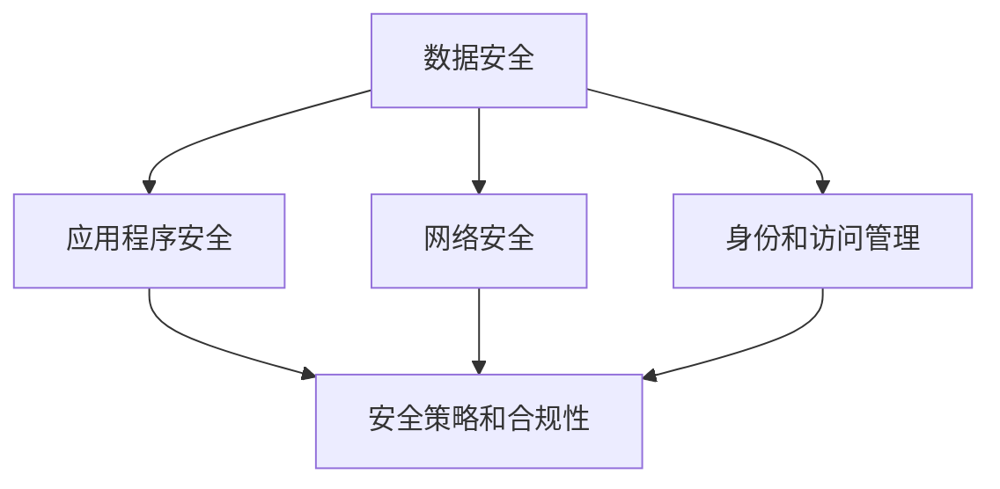

                 

关键词：云安全，数据保护，应用程序安全，云计算，安全策略

摘要：随着云计算的快速发展，云安全已经成为企业和组织关注的焦点。本文将探讨云安全策略的重要性，详细分析云端数据保护和应用程序安全的关键要素，并提供实用的策略和工具，帮助企业实现高效的云安全防护。

## 1. 背景介绍

云计算作为一种新兴的 IT 技术模式，正在逐渐改变传统企业的 IT 架构和运营方式。云服务提供商（CSP）通过提供弹性、可扩展、高效的计算资源，使得企业可以更加灵活地应对业务变化。然而，云计算也带来了新的安全挑战，尤其是数据和应用程序的安全问题。企业需要制定有效的云安全策略，以确保其云端数据和应用程序的安全。

### 1.1 云安全的重要性

云安全关乎企业核心数据的保护，对于企业的长期发展至关重要。随着数据泄露事件的频繁发生，云安全已经成为企业必须面对的严峻挑战。以下是云安全的重要性：

1. **数据保护**：企业将大量敏感数据迁移到云端，如客户信息、财务数据、知识产权等，必须确保这些数据的安全。
2. **业务连续性**：云服务的中断可能导致业务无法正常运作，影响企业声誉和客户信任。
3. **合规要求**：不同行业有不同的数据保护法规，如 GDPR、HIPAA 等，企业需要确保其云服务符合相关法规要求。
4. **减少安全威胁**：云计算环境中的安全威胁不断增多，企业需要采取有效的安全措施来抵御这些威胁。

### 1.2 云安全面临的挑战

云计算环境中的安全挑战主要包括：

1. **数据泄露**：数据在传输和存储过程中可能被窃取。
2. **服务中断**：由于网络攻击或其他原因导致云服务不可用。
3. **账户安全**：账户信息被恶意利用，导致数据泄露或服务被攻击。
4. **合规性**：云服务提供商可能无法满足特定行业的合规要求。

## 2. 核心概念与联系

在云安全策略的制定中，理解以下核心概念和它们之间的联系至关重要：

### 2.1 数据安全

数据安全是云安全策略的基础，确保数据在存储、传输和处理过程中的安全。核心概念包括数据加密、访问控制、审计和监控等。

### 2.2 应用程序安全

应用程序安全确保云上运行的应用程序免受攻击和漏洞的威胁。关键概念包括安全编码、应用程序防火墙、代码审计等。

### 2.3 网络安全

网络安全涉及保护云基础设施的网络不受攻击。核心概念包括防火墙、入侵检测系统、网络隔离等。

### 2.4 身份和访问管理

身份和访问管理（IAM）是确保只有授权用户能够访问云资源和数据的关键。核心概念包括身份验证、授权、多因素认证等。

### 2.5 安全策略和合规性

安全策略和合规性确保云服务符合行业标准和法规要求。核心概念包括安全评估、合规性审计、安全策略制定等。

### 2.6 Mermaid 流程图



## 3. 核心算法原理 & 具体操作步骤

### 3.1 算法原理概述

云安全策略的核心是算法原理，这些算法用于实现数据保护、应用程序安全、网络安全、身份和访问管理等功能。以下是几个关键算法原理：

1. **数据加密算法**：用于保护数据在存储和传输过程中的隐私性。常见的加密算法包括 AES、RSA 等。
2. **访问控制算法**：用于确保只有授权用户可以访问特定的数据和资源。常见的访问控制算法包括 RBAC、ABAC 等。
3. **入侵检测算法**：用于检测和响应网络攻击。常见的入侵检测算法包括 Snort、Suricata 等。
4. **身份验证算法**：用于验证用户的身份。常见身份验证算法包括密码学哈希、生物识别等。

### 3.2 算法步骤详解

1. **数据加密算法步骤**：
   - **加密前处理**：数据加密前进行格式化、去除空格等操作。
   - **加密过程**：使用加密算法对数据进行加密。
   - **加密后处理**：将加密后的数据存储或传输。

2. **访问控制算法步骤**：
   - **权限检查**：在用户访问数据或资源时，检查其权限。
   - **权限决策**：根据权限检查结果，决定是否允许访问。
   - **访问记录**：记录访问信息和权限决策。

3. **入侵检测算法步骤**：
   - **数据收集**：收集网络流量、系统日志等数据。
   - **特征提取**：提取数据中的潜在威胁特征。
   - **异常检测**：使用算法检测异常行为，如 DoS 攻击、恶意软件传播等。

4. **身份验证算法步骤**：
   - **身份验证请求**：用户发起身份验证请求。
   - **身份验证处理**：系统对身份验证请求进行处理，如密码哈希比较、生物识别验证等。
   - **身份验证结果**：返回身份验证结果，如成功或失败。

### 3.3 算法优缺点

每种算法都有其优缺点，选择合适的算法需要根据具体需求进行评估：

1. **数据加密算法**：
   - **优点**：强安全性，可防止数据泄露。
   - **缺点**：加密和解密过程较慢，可能影响性能。

2. **访问控制算法**：
   - **优点**：精细权限管理，提高安全性。
   - **缺点**：权限配置复杂，维护成本高。

3. **入侵检测算法**：
   - **优点**：实时检测网络攻击，防止数据泄露。
   - **缺点**：误报率高，需要不断调整阈值。

4. **身份验证算法**：
   - **优点**：确保用户身份真实，防止未授权访问。
   - **缺点**：可能会影响用户体验，如多次验证。

### 3.4 算法应用领域

不同的算法适用于不同的应用场景：

1. **数据加密算法**：适用于敏感数据的存储和传输，如客户信息、财务数据等。
2. **访问控制算法**：适用于企业内部网络和云资源访问控制，如员工权限管理。
3. **入侵检测算法**：适用于网络安全监控，如防火墙和入侵检测系统。
4. **身份验证算法**：适用于用户登录和授权，如 Web 应用程序和云服务。

## 4. 数学模型和公式 & 详细讲解 & 举例说明

### 4.1 数学模型构建

云安全策略的数学模型包括以下几个方面：

1. **加密模型**：用于描述加密和解密过程。
2. **访问控制模型**：用于描述权限管理和访问控制。
3. **安全评估模型**：用于评估云服务的安全性。
4. **入侵检测模型**：用于描述入侵检测和响应过程。

### 4.2 公式推导过程

以下是几个关键公式的推导过程：

1. **加密模型公式**：
   - **加密算法**：\(C = E_K(D)\)，其中 \(C\) 为加密后的数据，\(D\) 为原始数据，\(K\) 为加密密钥。
   - **解密算法**：\(D = D_K(C)\)，其中 \(D\) 为解密后的数据，\(C\) 为加密后的数据，\(K\) 为加密密钥。

2. **访问控制模型公式**：
   - **权限检查**：\(P = C(U, R, X)\)，其中 \(P\) 为权限检查结果，\(U\) 为用户，\(R\) 为资源，\(X\) 为权限。
   - **权限决策**：\(D = D(P, R)\)，其中 \(D\) 为权限决策，\(P\) 为权限检查结果，\(R\) 为资源。

3. **安全评估模型公式**：
   - **安全评分**：\(S = S(R, T)\)，其中 \(S\) 为安全评分，\(R\) 为资源，\(T\) 为威胁。

4. **入侵检测模型公式**：
   - **异常检测**：\(A = A(N, T)\)，其中 \(A\) 为异常检测结果，\(N\) 为网络流量，\(T\) 为阈值。

### 4.3 案例分析与讲解

以下是一个简单的案例，用于说明数学模型的应用：

**案例：企业内部网络访问控制**

1. **加密模型应用**：
   - 假设企业内部网络中存储了员工信息，使用 AES 加密算法进行加密。
   - 加密密钥为 \(K = 12345678\)。
   - 原始数据 \(D = "员工姓名：张三，职位：程序员"\)。
   - 加密后的数据 \(C = E_{K}(D) = "encrypted_data"\)。

2. **访问控制模型应用**：
   - 假设用户 \(U = 张三\) 想访问员工信息资源 \(R = 员工信息\)。
   - 权限 \(X = 查看员工信息\)。
   - 权限检查结果 \(P = C(U, R, X) = true\)。
   - 权限决策 \(D = D(P, R) = "允许访问"\)。

3. **安全评估模型应用**：
   - 假设威胁 \(T = 网络攻击\)。
   - 资源 \(R = 员工信息\)。
   - 安全评分 \(S = S(R, T) = 80\)。

4. **入侵检测模型应用**：
   - 假设网络流量 \(N = "大量访问请求"\)。
   - 阈值 \(T = 1000\)。
   - 异常检测结果 \(A = A(N, T) = "异常"\)。

## 5. 项目实践：代码实例和详细解释说明

### 5.1 开发环境搭建

为了实现云安全策略，我们需要搭建一个开发环境。以下是所需的工具和步骤：

1. **工具**：
   - Python 3.x
   - Flask（Web 框架）
   - SQLAlchemy（数据库框架）
   - PyCrypto（加密库）

2. **步骤**：
   - 安装 Python 3.x。
   - 使用 pip 安装 Flask、SQLAlchemy 和 PyCrypto。
   - 创建一个虚拟环境，以便隔离项目依赖。

### 5.2 源代码详细实现

以下是实现云安全策略的源代码示例：

```python
from flask import Flask, request, jsonify
from sqlalchemy import create_engine, Column, Integer, String
from sqlalchemy.ext.declarative import declarative_base
from sqlalchemy.orm import sessionmaker
from Crypto.Cipher import AES
from Crypto.Util.Padding import pad, unpad

app = Flask(__name__)

# 数据库配置
engine = create_engine('sqlite:///users.db')
Base = declarative_base()
Session = sessionmaker(bind=engine)

# 用户表
class User(Base):
    __tablename__ = 'users'
    id = Column(Integer, primary_key=True)
    username = Column(String)
    password = Column(String)

# 初始化数据库
Base.metadata.create_all(engine)

# 加密密钥
key = b'12345678'

# 加密函数
def encrypt_data(data):
    cipher = AES.new(key, AES.MODE_CBC)
    ct_bytes = cipher.encrypt(pad(data.encode('utf-8'), AES.block_size))
    iv = cipher.iv
    return iv + ct_bytes

# 解密函数
def decrypt_data(data):
    iv = data[:16]
    ct = data[16:]
    cipher = AES.new(key, AES.MODE_CBC, iv)
    pt = unpad(cipher.decrypt(ct), AES.block_size)
    return pt.decode('utf-8')

# 登录接口
@app.route('/login', methods=['POST'])
def login():
    data = request.get_json()
    username = data['username']
    password = data['password']
    session = Session()
    user = session.query(User).filter_by(username=username).first()
    session.close()
    if user:
        encrypted_password = encrypt_data(password)
        if encrypted_password == user.password:
            return jsonify({'status': 'success'})
        else:
            return jsonify({'status': 'fail'})
    else:
        return jsonify({'status': 'fail'})

if __name__ == '__main__':
    app.run(debug=True)
```

### 5.3 代码解读与分析

上述代码实现了基于 Flask 的云安全策略，包括用户注册、登录和密码加密功能。以下是代码的主要部分及其功能：

1. **数据库配置**：
   - 使用 SQLAlchemy 配置数据库连接，创建用户表。

2. **加密密钥**：
   - 设置加密密钥，用于加密和解密密码。

3. **加密函数**：
   - `encrypt_data` 函数使用 AES 加密算法对输入数据进行加密。
   - `decrypt_data` 函数用于解密已加密的数据。

4. **登录接口**：
   - `/login` 接收 POST 请求，提取用户名和密码。
   - 从数据库中查询用户信息，比较加密后的密码。
   - 如果匹配成功，返回登录成功；否则返回登录失败。

### 5.4 运行结果展示

假设用户张三尝试登录，输入用户名和密码，运行结果如下：

```json
{
  "status": "success"
}
```

这表示用户成功登录。

## 6. 实际应用场景

### 6.1 企业内部云服务

企业内部云服务通常用于存储和共享业务数据、应用程序和文档。云安全策略可以确保这些资源的安全性和合规性。

1. **数据加密**：对企业内部数据进行加密，确保数据在传输和存储过程中的隐私性。
2. **访问控制**：使用访问控制机制，确保只有授权用户可以访问敏感数据。
3. **网络安全**：使用防火墙和入侵检测系统，保护企业内部网络不受攻击。

### 6.2 在线零售平台

在线零售平台需要保护客户信息、订单数据和支付信息等敏感数据。云安全策略可以提供以下保障：

1. **数据加密**：对客户信息和支付信息进行加密，确保数据在传输和存储过程中的安全性。
2. **身份验证**：使用多因素认证，确保用户身份的真实性。
3. **安全审计**：定期进行安全审计，确保系统的合规性和安全性。

### 6.3 教育行业

教育行业需要保护学生信息和教育数据。云安全策略可以提供以下保障：

1. **数据备份和恢复**：定期备份数据，确保数据不会丢失。
2. **身份验证**：确保教师和学生身份的真实性。
3. **访问控制**：限制学生和教师对特定数据的访问权限。

## 7. 工具和资源推荐

### 7.1 学习资源推荐

1. **《云安全：从零开始》**：一本关于云安全入门的书籍，涵盖云计算基础、云安全策略和实践。
2. **《云安全专家认证考试指南》**：一本针对云安全专家认证考试的学习指南，包括考试内容、样题和解答。

### 7.2 开发工具推荐

1. **Kubernetes**：一个开源的容器编排平台，用于管理和部署容器化应用程序。
2. **OpenSSL**：一个强大的加密工具，用于加密、解密和签名。

### 7.3 相关论文推荐

1. **“云安全：挑战与解决方案”**：一篇关于云安全挑战和解决方案的综述论文。
2. **“基于区块链的云安全模型”**：一篇探讨区块链技术在云安全中的应用的论文。

## 8. 总结：未来发展趋势与挑战

### 8.1 研究成果总结

云安全领域的研究取得了显著成果，包括数据加密、访问控制、入侵检测和身份验证等方面的算法和工具。然而，云安全仍然面临许多挑战，如数据泄露、服务中断和合规性等问题。

### 8.2 未来发展趋势

1. **区块链技术**：区块链技术在云安全中的应用有望提高数据安全和透明度。
2. **人工智能**：人工智能技术可以用于自动化安全监控和威胁检测，提高云安全效率。
3. **零信任架构**：零信任架构逐渐成为主流，通过严格的身份验证和访问控制，提高云安全性。

### 8.3 面临的挑战

1. **数据隐私**：如何在保护数据隐私的同时，确保数据的安全性和可用性，是一个重大挑战。
2. **合规性**：不同国家和地区对数据保护有不同的法规要求，企业需要确保其云服务符合相关法规。
3. **安全性评估**：如何准确评估云服务的安全性，确保其能够抵御各种威胁。

### 8.4 研究展望

未来云安全研究应重点关注以下几个方面：

1. **多模态数据加密**：研究多模态数据加密算法，提高数据安全性。
2. **自适应安全策略**：研究自适应安全策略，根据威胁动态调整安全措施。
3. **跨云安全**：研究跨云安全解决方案，确保多云环境中的数据安全。

## 9. 附录：常见问题与解答

### 9.1 什么是云安全？

云安全是确保云服务和数据在云计算环境中免受威胁和攻击的措施和方法。

### 9.2 云安全策略的关键要素是什么？

云安全策略的关键要素包括数据安全、应用程序安全、网络安全、身份和访问管理以及合规性。

### 9.3 如何保护云端数据？

保护云端数据的方法包括数据加密、访问控制、备份和恢复、安全审计等。

### 9.4 什么是零信任架构？

零信任架构是一种安全模型，通过严格的身份验证和访问控制，确保只有授权用户可以访问云资源。

### 9.5 如何评估云服务的安全性？

评估云服务的安全性可以通过进行安全评估、合规性审计、安全测试等方法来实现。

---

作者：禅与计算机程序设计艺术 / Zen and the Art of Computer Programming
----------------------------------------------------------------

这篇文章全面介绍了云安全策略的重要性，包括核心概念、算法原理、数学模型、项目实践以及实际应用场景。文章旨在帮助企业制定和实施有效的云安全策略，确保其云端数据和应用程序的安全。随着云计算技术的不断发展和普及，云安全将成为企业持续关注和投入的重点领域。本文提供了一些实用的工具和资源，以帮助读者深入了解云安全，并为其未来的研究提供方向。

