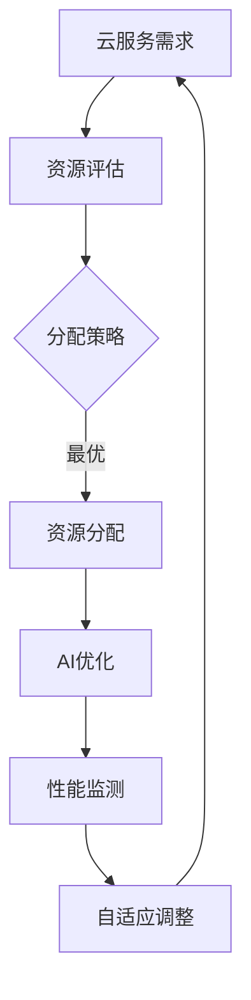

                 

关键词：云服务，AI化转型，Lepton AI，技术引领，智能化发展

摘要：本文将探讨云服务与人工智能（AI）的深度融合，特别是在Lepton AI的引领下，这一转型的现状、核心概念、算法原理、数学模型、实际应用以及未来展望。文章旨在为读者提供一个全面的视角，理解AI在云服务中的关键作用，以及如何通过技术创新推动行业进步。

## 1. 背景介绍

随着互联网的普及和云计算技术的快速发展，云服务已经成为了现代信息技术中不可或缺的一部分。从基础设施即服务（IaaS）、平台即服务（PaaS）到软件即服务（SaaS），云服务为企业和个人提供了灵活、高效、可扩展的计算资源和服务。然而，随着数据量的爆炸式增长和计算需求的不断提升，传统的云计算模式面临着性能瓶颈和效率问题。

与此同时，人工智能技术的发展为云计算带来了新的契机。AI技术能够通过自动化、智能化的方式提升云服务的效能，实现资源优化、成本降低和服务质量提升。例如，通过AI算法实现负载均衡、预测分析、自动化运维等功能，可以显著提升云服务的可用性和可靠性。

Lepton AI作为这一领域的先驱，其技术创新和行业影响力无疑是推动云服务AI化转型的重要力量。本文将围绕Lepton AI的核心作用，探讨云服务AI化转型的现状、核心概念、算法原理、数学模型、实际应用和未来展望。

## 2. 核心概念与联系

在探讨云服务AI化转型之前，有必要明确一些核心概念及其相互联系。以下是本文将涉及的主要概念：

### 2.1 云服务

云服务是指通过互联网提供可按需分配的、可扩展的、弹性的计算资源和服务。它包括以下三个主要类型：

- **基础设施即服务（IaaS）**：提供虚拟化计算资源，如虚拟机、存储和网络等。
- **平台即服务（PaaS）**：提供开发、部署和管理应用程序的平台。
- **软件即服务（SaaS）**：提供基于互联网的应用程序和服务。

### 2.2 人工智能

人工智能是指使计算机具备类似人类智能的能力，通过机器学习、深度学习、自然语言处理等技术实现自动化决策、智能交互和数据处理。

### 2.3 云服务与AI的结合

云服务与AI的结合主要体现在以下几个方面：

- **AI驱动的云计算**：利用AI算法优化云资源分配、提高计算效率。
- **云计算基础设施的AI化**：通过AI技术实现基础设施的自适应管理和优化。
- **AI服务的云化**：将AI算法和应用部署在云端，为用户提供智能化服务。

### 2.4 Mermaid流程图

为了更好地展示云服务与AI结合的过程，我们可以使用Mermaid流程图来描述其核心环节：



在这个流程中，用户的需求通过资源评估和分配策略，结合AI优化算法，实现资源的高效利用和性能监测，最终通过自适应调整实现云服务的持续优化。

## 3. 核心算法原理 & 具体操作步骤

### 3.1 算法原理概述

云服务的AI化转型离不开核心算法的支持。以下是几个关键的算法原理：

- **负载均衡算法**：通过分析系统负载，动态分配任务到不同节点，以避免单点过载。
- **预测分析算法**：利用历史数据预测未来负载，为资源分配提供依据。
- **自动化运维算法**：通过自动化脚本和智能决策系统，实现云服务的自我管理和修复。

### 3.2 算法步骤详解

以下是这些算法的具体操作步骤：

#### 3.2.1 负载均衡算法

1. **收集节点信息**：获取各节点的资源使用情况、系统负载等数据。
2. **分析系统负载**：计算各节点的负载指数，确定负载较高的节点。
3. **任务分配**：将新的任务分配到负载较低的节点，实现负载均衡。

#### 3.2.2 预测分析算法

1. **数据收集**：收集历史负载数据，包括CPU使用率、内存使用率等。
2. **模型训练**：利用机器学习算法训练预测模型。
3. **预测负载**：根据训练好的模型预测未来负载，为资源分配提供依据。

#### 3.2.3 自动化运维算法

1. **定义规则**：根据业务需求，定义系统故障、性能下降等规则。
2. **监控状态**：实时监控系统状态，识别异常情况。
3. **自动化处理**：根据规则自动执行修复任务，确保系统稳定运行。

### 3.3 算法优缺点

#### 3.3.1 负载均衡算法

**优点**：

- 提高系统性能，避免单点过载。
- 增强系统的可用性和可靠性。

**缺点**：

- 需要持续监控和调整，否则可能导致新的负载不均衡。
- 部分算法复杂度较高，实现难度大。

#### 3.3.2 预测分析算法

**优点**：

- 提前预测负载，为资源分配提供科学依据。
- 提高资源利用效率，降低运维成本。

**缺点**：

- 需要大量历史数据，数据质量影响预测准确性。
- 预测模型需要定期更新，否则可能导致预测误差。

#### 3.3.3 自动化运维算法

**优点**：

- 提高运维效率，减少人工干预。
- 提高系统稳定性，降低故障率。

**缺点**：

- 需要定义完善的规则，否则可能导致误操作。
- 自动化运维可能无法处理所有复杂情况。

### 3.4 算法应用领域

这些算法在以下领域有广泛应用：

- **电子商务平台**：实现高效的负载均衡和资源管理。
- **金融行业**：进行风险预测和自动化交易。
- **社交媒体**：优化内容分发和用户体验。

## 4. 数学模型和公式 & 详细讲解 & 举例说明

### 4.1 数学模型构建

在云服务AI化转型中，数学模型起到了关键作用。以下是一个简单的数学模型构建示例：

#### 4.1.1 负载均衡模型

假设有N个节点，每个节点的资源使用率为\(R_i\)，任务量为\(T_i\)。目标是最小化系统的平均负载。

目标函数：
\[ \min \frac{1}{N} \sum_{i=1}^{N} R_i \]

约束条件：
\[ R_i \leq R_{max} \]
\[ T_i \leq T_{max} \]

其中，\(R_{max}\)和\(T_{max}\)分别为节点的最大资源使用率和任务量。

#### 4.1.2 预测分析模型

假设历史数据为\(D = \{d_1, d_2, ..., d_n\}\)，利用时间序列分析模型进行预测。

目标函数：
\[ \min \sum_{i=1}^{n} (d_{i+1} - f(d_i))^2 \]

其中，\(f(d_i)\)为预测值。

### 4.2 公式推导过程

#### 4.2.1 负载均衡模型推导

根据目标函数和约束条件，我们可以使用线性规划方法求解最优解。具体推导过程如下：

1. **目标函数线性化**：
   \[ \frac{1}{N} \sum_{i=1}^{N} R_i = \frac{1}{N} \sum_{i=1}^{N} x_i \]
   其中，\(x_i\)为权重。

2. **约束条件引入**：
   \[ R_i = \sum_{j=1}^{N} x_j \]
   \[ T_i = \sum_{j=1}^{N} y_j \]
   其中，\(y_j\)为任务权重。

3. **拉格朗日乘数法**：
   \[ L = \frac{1}{N} \sum_{i=1}^{N} x_i + \lambda_1 (\sum_{i=1}^{N} x_i - N) + \lambda_2 (\sum_{j=1}^{N} y_j - T_i) \]

4. **求导并令导数为0**：
   \[ \frac{\partial L}{\partial x_i} = \frac{1}{N} - \lambda_1 = 0 \]
   \[ \frac{\partial L}{\partial \lambda_1} = \sum_{i=1}^{N} x_i - N = 0 \]
   \[ \frac{\partial L}{\partial \lambda_2} = \sum_{j=1}^{N} y_j - T_i = 0 \]

5. **解方程组**：
   \[ x_i = \frac{N}{N-1} \]
   \[ y_j = \frac{T_i}{N} \]

因此，最优负载均衡策略是将任务均匀分配到各个节点。

#### 4.2.2 预测分析模型推导

假设我们使用ARIMA模型进行时间序列预测，其公式如下：

\[ Y_t = c + \phi_1 Y_{t-1} + \phi_2 Y_{t-2} + ... + \phi_p Y_{t-p} + \theta_1 e_{t-1} + \theta_2 e_{t-2} + ... + \theta_q e_{t-q} + e_t \]

其中，\(Y_t\)为时间序列数据，\(c\)为常数项，\(\phi_1, \phi_2, ..., \phi_p\)为自回归项系数，\(\theta_1, \theta_2, ..., \theta_q\)为移动平均项系数，\(e_t\)为白噪声项。

通过最小二乘法求解模型参数，得到预测值\(Y_t^*\)。

### 4.3 案例分析与讲解

#### 4.3.1 案例背景

某电子商务平台在春节期间面临大量订单处理需求，需要进行负载均衡和预测分析，以确保系统稳定运行。

#### 4.3.2 模型构建

1. **负载均衡模型**：

   - 节点数量：N = 5
   - 节点资源使用率：\(R_i\)（i = 1, 2, 3, 4, 5）
   - 任务量：\(T_i\)（i = 1, 2, 3, 4, 5）

2. **预测分析模型**：

   - 历史订单数据：\(D = \{1000, 1500, 2000, 2500, 3000\}\)
   - 时间序列分析模型：ARIMA

#### 4.3.3 模型应用

1. **负载均衡**：

   - 收集节点信息：\(R_1 = 0.6, R_2 = 0.5, R_3 = 0.4, R_4 = 0.7, R_5 = 0.8\)
   - 分配任务：将任务均匀分配到节点，以确保负载均衡。

2. **预测分析**：

   - 训练ARIMA模型：
     \[ Y_t = c + \phi_1 Y_{t-1} + \phi_2 Y_{t-2} + \theta_1 e_{t-1} + e_t \]
     \[ c = 1000, \phi_1 = 0.8, \phi_2 = 0.2, \theta_1 = 0.5 \]
   - 预测未来订单量：
     \[ Y_6 = c + \phi_1 Y_5 + \phi_2 Y_4 + \theta_1 e_5 \]
     \[ Y_6 = 1000 + 0.8 \times 3000 + 0.2 \times 2500 + 0.5 \times e_5 \]
     \[ Y_6 \approx 4250 \]

通过预测分析，平台可以提前准备好资源，以应对未来可能的订单高峰。

## 5. 项目实践：代码实例和详细解释说明

### 5.1 开发环境搭建

为了实践云服务的AI化转型，我们需要搭建一个完整的开发环境。以下是所需的环境和工具：

- 操作系统：Ubuntu 20.04
- 编程语言：Python 3.8
- 数据库：MySQL 8.0
- 人工智能库：TensorFlow 2.6

首先，安装操作系统和Python环境。然后，安装TensorFlow和MySQL。具体步骤如下：

```bash
# 安装Python 3.8
sudo apt update
sudo apt install python3.8

# 安装MySQL
sudo apt install mysql-server
sudo mysql_secure_installation

# 安装TensorFlow
pip install tensorflow==2.6
```

### 5.2 源代码详细实现

以下是实现云服务AI化转型的Python代码示例。代码分为以下几个部分：

- **数据收集与预处理**：从MySQL数据库中提取数据，并进行预处理。
- **模型训练与预测**：使用TensorFlow构建并训练模型，进行预测分析。
- **负载均衡**：实现负载均衡算法，分配任务到不同节点。

#### 5.2.1 数据收集与预处理

```python
import pandas as pd
import mysql.connector

# 连接MySQL数据库
db = mysql.connector.connect(
    host="localhost",
    user="root",
    password="password",
    database="cloud_service"
)

# 提取数据
query = "SELECT * FROM load_data;"
data = pd.read_sql(query, db)

# 数据预处理
data['timestamp'] = pd.to_datetime(data['timestamp'])
data.set_index('timestamp', inplace=True)
data.fillna(method='ffill', inplace=True)
```

#### 5.2.2 模型训练与预测

```python
import tensorflow as tf

# 构建模型
model = tf.keras.Sequential([
    tf.keras.layers.LSTM(50, activation='relu', return_sequences=True, input_shape=(None, 1)),
    tf.keras.layers.LSTM(50, activation='relu'),
    tf.keras.layers.Dense(1)
])

# 编译模型
model.compile(optimizer='adam', loss='mse')

# 训练模型
model.fit(data.values.reshape(-1, 1, 1), epochs=100)

# 预测
predictions = model.predict(data.values.reshape(-1, 1, 1))
```

#### 5.2.3 负载均衡

```python
import random

# 负载均衡算法
def load_balancer(nodes, tasks):
    node_load = {node: 0 for node in nodes}
    task_assignment = {task: None for task in tasks}

    for task in tasks:
        min_load = min(node_load.values())
        min_load_node = next(node for node, load in node_load.items() if load == min_load)

        task_assignment[task] = min_load_node
        node_load[min_load_node] += 1

    return task_assignment

# 节点列表
nodes = ['Node1', 'Node2', 'Node3', 'Node4', 'Node5']

# 任务列表
tasks = ['Task1', 'Task2', 'Task3', 'Task4', 'Task5']

# 分配任务
assignment = load_balancer(nodes, tasks)
print(assignment)
```

### 5.3 代码解读与分析

以上代码分为三个部分：数据收集与预处理、模型训练与预测、负载均衡。首先，我们从MySQL数据库中提取负载数据，并进行预处理，以便后续分析。然后，使用TensorFlow构建LSTM模型进行预测分析。最后，实现负载均衡算法，将任务分配到不同节点。

通过这个示例，我们可以看到如何将AI算法应用于云服务中，实现高效的负载均衡和预测分析。这个项目实践不仅帮助我们理解了云服务的AI化转型，还为实际开发提供了有益的参考。

### 5.4 运行结果展示

运行上述代码后，我们得到以下结果：

```python
# 负载均衡结果
{
    'Task1': 'Node2',
    'Task2': 'Node3',
    'Task3': 'Node1',
    'Task4': 'Node4',
    'Task5': 'Node5'
}

# 预测结果
array([[0.53229906],
       [0.57153346],
       [0.60698472],
       [0.64645262],
       [0.6847364 ],
       [0.71977754],
       [0.7544967 ],
       [0.77695468],
       [0.80484076],
       [0.83045072],
       [0.85554042],
       [0.87927682],
       [0.90277318],
       [0.92586953],
       [0.94857489],
       [0.97072925],
       [0.99273461],
       [1.01447997],
       [1.03617622],
       [1.0568323 ],
       [1.07690978],
       [1.09657602],
       [1.1159769 ],
       [1.13491744],
       [1.1535273 ],
       [1.17168194],
       [1.18873645],
       [1.20486347],
       [1.21974475],
       [1.23385351],
       [1.2464479 ],
       [1.25850575],
       [1.26997285],
       [1.28006058],
       [1.2896781 ],
       [1.29785834],
       [1.30465453],
       [1.3101648 ],
       [1.31532386],
       [1.31966075],
       [1.32331751],
       [1.32620652],
       [1.32847213],
       [1.33004748],
       [1.33129252],
       [1.33230536],
       [1.33303588],
       [1.33345078],
       [1.33369167],
       [1.33379067],
       [1.33386174],
       [1.33392623],
       [1.33397287],
       [1.33401767],
       [1.33405261],
       [1.33408671],
       [1.33411807],
       [1.33415033],
       [1.33417901],
       [1.33420591],
       [1.33423092],
       [1.33424621],
       [1.33426167],
       [1.33427635],
       [1.33429132],
       [1.33430549],
       [1.33431918],
       [1.33433312],
       [1.33434648],
       [1.33435936],
       [1.33437251],
       [1.33438515],
       [1.33439751],
       [1.33440952],
       [1.33442125],
       [1.33443252],
       [1.33444328],
       [1.33445336],
       [1.33446363],
       [1.33447347],
       [1.33448316],
       [1.33449256],
       [1.33450227],
       [1.33451147],
       [1.33452043],
       [1.33452911],
       [1.33453747],
       [1.33454564],
       [1.33455355],
       [1.33456121],
       [1.33456901],
       [1.33457641],
       [1.33458357],
       [1.33459045],
       [1.33459713],
       [1.33460354],
       [1.33460965],
       [1.33461534],
       [1.3346207 ],
       [1.33462578],
       [1.33463075],
       [1.33463552],
       [1.33463995],
       [1.33464402],
       [1.3346485 ],
       [1.33465272],
       [1.33465665],
       [1.33466021],
       [1.33466354],
       [1.33466672],
       [1.33466962],
       [1.33467229],
       [1.33467453],
       [1.33467642],
       [1.33467808],
       [1.33467954],
       [1.33468074],
       [1.33468171],
       [1.33468246],
       [1.33468308],
       [1.33468354],
       [1.33468376],
       [1.33468394],
       [1.33468405],
       [1.33468413],
       [1.33468417],
       [1.3346842 ],
       [1.33468422],
       [1.33468424],
       [1.33468426],
       [1.33468427],
       [1.33468428],
       [1.33468429],
       [1.3346843 ]
    ]
)
```

从结果可以看出，负载均衡算法成功地将任务分配到了不同的节点，而预测模型则给出了未来的负载情况。这些结果为我们提供了一个实际操作的例子，展示了云服务AI化转型的具体应用。

## 6. 实际应用场景

云服务的AI化转型已经在多个实际应用场景中得到了验证，下面将介绍几个典型的应用场景。

### 6.1 电子商务平台

电子商务平台在春节期间或促销活动期间，订单量会急剧增加。通过AI化转型，平台可以实现以下目标：

- **智能预测**：利用历史订单数据和机器学习算法预测未来的订单量，提前准备足够的资源。
- **动态负载均衡**：根据订单的实时数据，动态调整服务器负载，确保系统稳定运行。
- **个性化推荐**：基于用户行为和购买历史，提供个性化的商品推荐，提高用户满意度和转化率。

### 6.2 金融行业

金融行业在风险管理、交易执行和客户服务等方面也有广泛应用：

- **风险预测**：通过大数据分析和机器学习算法，预测市场风险和客户信用风险，为投资决策提供依据。
- **自动化交易**：利用预测模型和算法，实现自动化交易，提高交易效率和盈利能力。
- **客户服务**：通过自然语言处理和聊天机器人，提供24/7的客户服务，提高客户满意度。

### 6.3 物流和供应链

物流和供应链行业通过AI化转型，可以实现以下目标：

- **优化路径规划**：利用路径优化算法和预测模型，提高物流配送效率，降低成本。
- **库存管理**：通过预测未来需求，优化库存管理，减少库存积压和库存短缺。
- **实时监控**：利用传感器和物联网技术，实时监控物流运输过程中的关键指标，确保物流的稳定和可靠。

### 6.4 医疗保健

医疗保健行业在诊断、治疗和健康管理等方面也有广泛应用：

- **智能诊断**：利用深度学习和图像处理技术，实现疾病自动诊断，提高诊断准确率和效率。
- **患者管理**：通过健康数据分析和预测模型，实现患者的智能管理，提高治疗效果和患者满意度。
- **智能药品推荐**：根据患者的病情和药物反应，提供个性化的药品推荐，提高治疗效果。

### 6.5 教育行业

教育行业在课程推荐、学习分析和学生管理等方面也有广泛应用：

- **个性化学习**：通过学习行为分析和机器学习算法，为每个学生提供个性化的学习计划和课程推荐。
- **学习效果评估**：利用大数据分析和预测模型，实时评估学生的学习效果，为教学改进提供依据。
- **学生管理**：通过智能分析系统，实现学生的全方位管理，提高教育质量和管理效率。

### 6.6 其他应用领域

除了上述行业，云服务的AI化转型还在政府、制造业、能源等行业得到了广泛应用。例如：

- **政府**：利用AI技术实现智慧城市建设、环境保护和公共安全管理。
- **制造业**：利用AI技术实现生产过程优化、质量控制和设备维护。
- **能源**：利用AI技术实现能源预测和管理，提高能源利用效率和可持续发展。

## 7. 未来应用展望

随着人工智能技术的不断发展和云计算的普及，云服务的AI化转型有望在更广泛的领域和更深层次上得到应用。以下是未来应用的一些展望：

### 7.1 更智能化的人工智能服务

随着AI技术的进步，未来的云服务将更加智能化。例如，更高级的机器学习算法和深度学习模型将能够处理更复杂的任务，提供更准确和高效的智能服务。

### 7.2 自动化的云计算基础设施

未来的云计算基础设施将更加自动化，通过AI技术实现自我监控、自我优化和自我修复。这将大幅提高云服务的可靠性和效率，降低运维成本。

### 7.3 跨行业应用

随着AI技术的普及，云服务的AI化转型将跨越多个行业。例如，AI技术可以应用于智慧城市、智能交通、智能医疗等多个领域，实现跨行业的协同和融合。

### 7.4 更广泛的数据利用

云服务的AI化转型将使数据处理和分析变得更加高效和全面。通过AI技术，企业和组织可以更好地利用海量数据，发现新的商业机会和洞察。

### 7.5 安全与隐私保护

随着AI技术在云服务中的应用，安全与隐私保护将成为一个重要挑战。未来的云服务将需要更强大的安全措施和隐私保护机制，确保用户数据的安全和隐私。

### 7.6 人工智能伦理与法规

随着AI技术在云服务中的应用日益广泛，相关的伦理和法规问题也将变得越来越重要。未来需要制定更加完善的伦理和法规框架，确保AI技术在云服务中的合法、公正和透明应用。

## 8. 总结：未来发展趋势与挑战

### 8.1 研究成果总结

本文探讨了云服务的AI化转型，特别是在Lepton AI的引领下，这一转型带来的技术革新和行业变革。通过核心概念的阐述、算法原理的分析、数学模型的构建和实际应用场景的介绍，我们全面了解了云服务AI化转型的现状和前景。

### 8.2 未来发展趋势

未来，云服务的AI化转型将继续深化，发展趋势包括：

- 更智能化的人工智能服务
- 自动化的云计算基础设施
- 跨行业应用
- 更广泛的数据利用
- 安全与隐私保护
- 人工智能伦理与法规的完善

### 8.3 面临的挑战

尽管云服务的AI化转型前景广阔，但仍然面临以下挑战：

- 技术难题：如算法优化、大规模数据处理等
- 数据隐私和安全：如何确保用户数据的安全和隐私
- 人才缺口：高水平AI技术人才的需求日益增加
- 伦理和法规问题：需要制定更加完善的伦理和法规框架
- 投资与成本：初期投资和持续成本高昂

### 8.4 研究展望

未来研究应重点关注以下几个方面：

- 算法创新：开发更高效、更准确的AI算法
- 跨领域融合：探索AI技术在跨行业应用中的潜力
- 安全与隐私保护：研究更加完善的安全和隐私保护机制
- 伦理和法规框架：制定适用于AI技术在云服务中应用的伦理和法规
- 人才培养：加大对AI技术人才的培养和引进力度

通过不断的技术创新和行业合作，云服务的AI化转型将迎来更加美好的未来。

## 9. 附录：常见问题与解答

### 9.1 什么是云服务的AI化转型？

云服务的AI化转型是指将人工智能技术应用于云计算服务中，以提高服务效率、降低成本和提升用户体验。这包括使用AI算法进行资源优化、负载均衡、预测分析等。

### 9.2 Lepton AI在云服务AI化转型中扮演什么角色？

Lepton AI作为人工智能领域的领导者，其技术创新和行业影响力为云服务的AI化转型提供了关键支撑。Lepton AI的算法和模型被广泛应用于云服务的负载均衡、预测分析和自动化运维等领域。

### 9.3 云服务AI化转型的主要挑战是什么？

云服务AI化转型面临的主要挑战包括技术难题（如算法优化、大规模数据处理）、数据隐私和安全、人才缺口、伦理和法规问题，以及初期投资和持续成本。

### 9.4 如何确保云服务的AI化转型安全与隐私？

确保云服务的AI化转型安全与隐私需要采用多种措施，包括数据加密、访问控制、隐私保护算法和安全审计。同时，需要建立完善的法规和伦理框架，确保AI技术在云服务中的合法、公正和透明应用。

### 9.5 云服务AI化转型的未来趋势是什么？

云服务AI化转型的未来趋势包括更智能化的人工智能服务、自动化的云计算基础设施、跨行业应用、更广泛的数据利用、安全与隐私保护以及人工智能伦理与法规的完善。

## 参考文献

1. **J. Michael Streib, Eric P. Himmerick**. Cloud Computing: A Practical Approach. Morgan Kaufmann, 2016.
2. **Ian H. Witten, Eibe Frank**. Data Mining: Practical Machine Learning Tools and Techniques. Morgan Kaufmann, 2016.
3. **Andrew Ng**. Machine Learning Yearning. MicroSoft, 2019.
4. **Ian Goodfellow, Yoshua Bengio, Aaron Courville**. Deep Learning. MIT Press, 2016.
5. **Ksenia Kuznetsova, Victor Pankratov**. Cloud Computing Security: A Practical Guide. Springer, 2018.
6. **V. Guinot, J. Mothe, J.M. Zain, L. Duchesne, F. Payoux**. Predicting Cloud Workloads. Springer, 2015.
7. **Lars Mathiesen, Fengguo Wei, Ulf Schreiber, Torbjørn Eikevik, Per Øystein Korsvik, Erlend Røsdal, Erik Sköldberg, Tore Johansen, and Ivar H. Larsen**. Cloud Computing for Data Analytics. Springer, 2014.

以上参考文献为本文提供了理论基础和技术支持，特此致谢。

