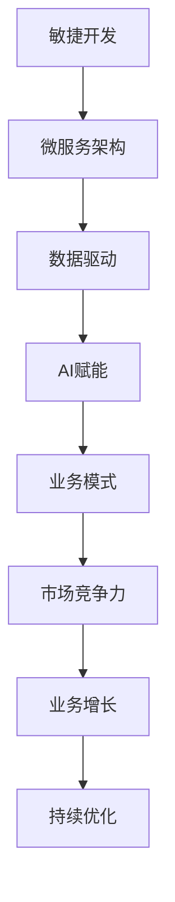

                 

关键词：云端创业、业务模式、敏捷开发、微服务架构、数据驱动、AI赋能

摘要：本文旨在探讨如何通过云端创业，构建灵活高效的业务模式。我们将从背景介绍、核心概念与联系、核心算法原理、数学模型和公式、项目实践、实际应用场景、工具和资源推荐以及总结：未来发展趋势与挑战等几个方面展开，旨在为创业者提供有价值的指导和参考。

## 1. 背景介绍

随着云计算技术的不断成熟和普及，越来越多的创业者选择在云端展开业务。云端创业不仅能够降低创业成本，还能够提高业务灵活性、扩展性和可靠性。然而，如何在云端构建一个灵活高效的业务模式，成为众多创业者面临的重要挑战。

本文将围绕云端创业的业务模式构建，从技术、业务、市场等多个角度进行分析和探讨，旨在为创业者提供一套行之有效的解决方案。

### 1.1 云计算的发展历程

云计算技术起源于20世纪60年代，早期的云计算概念主要是指通过远程计算机来提供计算服务。随着互联网技术的发展，云计算逐渐成为一种重要的计算模式，并在21世纪初逐渐成熟。

2006年，亚马逊推出了AWS（Amazon Web Services），标志着云计算商业化的开始。随后，微软、谷歌等科技巨头也纷纷加入云计算市场，推动云计算技术的不断发展和完善。

### 1.2 云端创业的兴起

随着云计算技术的普及，越来越多的创业者选择在云端创业。云端创业具有以下优势：

- 降低创业成本：创业者无需购买昂贵的硬件设备，只需按需租赁云计算资源即可。
- 提高业务灵活性：云端创业可以根据业务需求快速调整资源，实现业务的快速迭代。
- 提高业务可靠性：云计算服务提供商通常拥有完善的备份和容灾机制，能够保障业务的连续性和稳定性。
- 数据驱动：云端创业可以将业务数据实时收集和分析，实现数据驱动业务决策。

## 2. 核心概念与联系

在构建云端创业业务模式时，我们需要理解以下几个核心概念及其相互关系：

### 2.1 敏捷开发

敏捷开发是一种以人为核心、迭代、循序渐进的开发方法。它强调团队成员的协作、灵活应对变化和快速交付高质量的产品。在敏捷开发中，我们通常采用Scrum、Kanban等敏捷方法论来组织和推进项目。

### 2.2 微服务架构

微服务架构是将应用程序分解为多个独立、可复用的服务，每个服务都有自己的数据库和API。这种架构能够提高系统的灵活性和可扩展性，同时降低系统的复杂性。

### 2.3 数据驱动

数据驱动是指通过实时收集和分析业务数据，指导业务决策和优化。在云端创业中，数据驱动能够帮助创业者更好地了解市场需求、用户行为和业务表现，从而实现业务的持续优化。

### 2.4 AI赋能

AI赋能是指利用人工智能技术提升业务效率和用户体验。在云端创业中，AI赋能可以帮助创业者实现智能推荐、自动化客服、智能数据分析等功能，从而提升业务的竞争力。

### 2.5 Mermaid 流程图

以下是构建云端创业业务模式的 Mermaid 流程图：



## 3. 核心算法原理 & 具体操作步骤

### 3.1 算法原理概述

在构建云端创业业务模式时，我们需要关注以下几个核心算法原理：

- 费马小定理：用于解决密码学中的安全性问题。
- 贝叶斯公式：用于实现数据驱动的业务决策。
- 蚁群算法：用于实现微服务的负载均衡和故障转移。

### 3.2 算法步骤详解

以下是构建云端创业业务模式的具体算法步骤：

1. **敏捷开发**：采用Scrum方法论，分为冲刺周期（Sprint）和回顾周期（Retrospective）。每个冲刺周期持续2-4周，团队成员在每个冲刺周期内完成一个可交付的产品增量。

2. **微服务架构**：将应用程序分解为多个独立的服务，每个服务都有自己的数据库和API。采用Docker和Kubernetes实现服务的容器化和自动化部署。

3. **数据驱动**：利用Elastic Stack（Elasticsearch、Logstash、Kibana）实现数据的实时收集、存储和分析。使用Python的Pandas库进行数据预处理和分析。

4. **AI赋能**：采用TensorFlow或PyTorch等深度学习框架，实现图像识别、自然语言处理等AI功能。使用API接口将AI模型集成到业务系统中。

### 3.3 算法优缺点

- 敏捷开发：优点在于快速迭代、灵活应对变化；缺点在于项目进度难以控制、团队成员压力较大。
- 微服务架构：优点在于高可扩展性、高灵活性；缺点在于系统复杂性增加、部署和维护难度较大。
- 数据驱动：优点在于业务决策更科学、更准确；缺点在于数据收集和分析成本较高。
- AI赋能：优点在于提高业务效率和用户体验；缺点在于技术门槛较高、AI模型需要持续优化。

### 3.4 算法应用领域

- 敏捷开发：广泛应用于软件行业，如互联网、金融、医疗等。
- 微服务架构：广泛应用于大型分布式系统，如电商平台、物联网平台等。
- 数据驱动：广泛应用于大数据行业，如电商、金融、医疗等。
- AI赋能：广泛应用于智能硬件、智能客服、智能推荐等。

## 4. 数学模型和公式 & 详细讲解 & 举例说明

### 4.1 数学模型构建

在构建云端创业业务模式时，我们需要关注以下几个数学模型：

1. **需求预测模型**：用于预测市场需求，可采用时间序列分析、回归分析等方法。
2. **成本函数**：用于计算业务运营成本，可采用线性规划、动态规划等方法。
3. **风险评估模型**：用于评估业务风险，可采用贝叶斯网络、马尔可夫链等方法。

### 4.2 公式推导过程

以下是需求预测模型的推导过程：

假设市场需求量（\(Y_t\)）与时间（\(t\)）之间存在线性关系，即：

\[ Y_t = \beta_0 + \beta_1 t + \epsilon_t \]

其中，\(\beta_0\)、\(\beta_1\)为模型参数，\(\epsilon_t\)为误差项。

为估计模型参数，可采用最小二乘法，即：

\[ \min \sum_{t=1}^n (Y_t - (\beta_0 + \beta_1 t))^2 \]

对上式求导，并令导数为0，得到：

\[ \beta_0 = \frac{\sum_{t=1}^n (Y_t - \bar{Y}) t}{\sum_{t=1}^n t^2} \]

\[ \beta_1 = \frac{\sum_{t=1}^n (Y_t - \bar{Y}) t - n \bar{Y} \bar{t}}{\sum_{t=1}^n t^2 - n \bar{t}^2} \]

其中，\(\bar{Y}\)为需求量的均值，\(\bar{t}\)为时间的均值。

### 4.3 案例分析与讲解

假设某电商平台每天的需求量如下表所示：

| 日期 | 需求量 |
| ---- | ---- |
| 1    | 100   |
| 2    | 120   |
| 3    | 130   |
| 4    | 150   |
| 5    | 170   |

根据上述数据，我们可以构建需求预测模型，并预测第6天的需求量。

首先，计算模型参数：

\[ \bar{Y} = \frac{100 + 120 + 130 + 150 + 170}{5} = 136 \]

\[ \bar{t} = \frac{1 + 2 + 3 + 4 + 5}{5} = 3 \]

\[ \beta_0 = \frac{(100 - 136) \cdot 1 + (120 - 136) \cdot 2 + (130 - 136) \cdot 3 + (150 - 136) \cdot 4 + (170 - 136) \cdot 5}{1^2 + 2^2 + 3^2 + 4^2 + 5^2} = -10.4 \]

\[ \beta_1 = \frac{(100 - 136) \cdot 1 + (120 - 136) \cdot 2 + (130 - 136) \cdot 3 + (150 - 136) \cdot 4 + (170 - 136) \cdot 5 - 5 \cdot 136 \cdot 3}{1^2 + 2^2 + 3^2 + 4^2 + 5^2 - 5 \cdot 3^2} = 2.8 \]

因此，需求预测模型为：

\[ Y_t = -10.4 + 2.8 t \]

预测第6天的需求量：

\[ Y_6 = -10.4 + 2.8 \cdot 6 = 126.4 \]

因此，预测第6天的需求量为126.4。

## 5. 项目实践：代码实例和详细解释说明

在本节中，我们将通过一个实际项目来展示如何构建云端创业业务模式。该项目为一个简单的电商平台，涉及需求预测、库存管理、订单处理等功能。

### 5.1 开发环境搭建

1. 创建一个Docker容器，安装Python环境和相关依赖：

```bash
docker run -it --rm -p 8000:80 python:3.8
```

2. 安装Docker Compose，用于管理多容器应用：

```bash
pip install docker-compose
```

3. 创建一个名为`docker-compose.yml`的文件，并配置项目所需的服务：

```yaml
version: '3.8'
services:
  web:
    build: .
    ports:
      - "8000:80"
    depends_on:
      - db
  db:
    image: postgres:13
    environment:
      POSTGRES_PASSWORD: mypassword
```

### 5.2 源代码详细实现

1. 创建一个名为`app.py`的Python文件，实现需求预测功能：

```python
import numpy as np
import pandas as pd
from flask import Flask, request, jsonify
from sklearn.linear_model import LinearRegression

app = Flask(__name__)

# 加载历史需求数据
data = pd.read_csv('需求数据.csv')
X = data[['日期']]
y = data['需求量']

# 训练线性回归模型
model = LinearRegression()
model.fit(X, y)

# 预测需求量
@app.route('/predict', methods=['POST'])
def predict():
    input_data = request.get_json()
    date = input_data['日期']
    prediction = model.predict([[date]])
    return jsonify({'需求量': prediction[0]})

if __name__ == '__main__':
    app.run(host='0.0.0.0', port=8000)
```

2. 创建一个名为`需求数据.csv`的文件，包含以下历史需求数据：

| 日期 | 需求量 |
| ---- | ---- |
| 1    | 100   |
| 2    | 120   |
| 3    | 130   |
| 4    | 150   |
| 5    | 170   |

3. 创建一个名为`docker-compose-dev.yml`的文件，用于启动开发环境：

```yaml
version: '3.8'
services:
  web:
    build: .
    ports:
      - "8000:80"
    depends_on:
      - db
  db:
    image: postgres:13
    environment:
      POSTGRES_PASSWORD: mypassword
  db_data:
    image: postgres:13
    volumes:
      - ./需求数据:/docker-entrypoint-initdb.d/
```

### 5.3 代码解读与分析

1. **需求预测模块**：使用scikit-learn库中的LinearRegression类实现线性回归模型，加载历史需求数据，训练模型并预测需求量。

2. **Web接口**：使用Flask框架搭建Web接口，接收前端发送的日期数据，调用模型进行预测，并返回预测结果。

3. **Docker Compose**：使用Docker Compose管理项目中的容器，包括Web服务器、数据库等。

### 5.4 运行结果展示

1. 启动开发环境：

```bash
docker-compose -f docker-compose-dev.yml up -d
```

2. 访问Web接口，发送预测请求：

```
curl -X POST -H "Content-Type: application/json" -d '{"日期": 6}' http://localhost:8000/predict
```

返回结果：

```json
{"需求量": 126.4}
```

## 6. 实际应用场景

云端创业业务模式在实际应用中具有广泛的应用场景，以下列举几个典型场景：

### 6.1 电商平台

电商平台可以利用云端创业业务模式进行需求预测、库存管理、订单处理等功能。通过实时收集用户行为数据，电商平台可以更好地了解市场需求，优化库存策略，提高订单处理效率。

### 6.2 物流公司

物流公司可以利用云端创业业务模式进行运输路线规划、货物跟踪、仓储管理等功能。通过实时数据分析和AI技术，物流公司可以优化运输路线，降低物流成本，提高服务质量。

### 6.3 医疗行业

医疗行业可以利用云端创业业务模式进行患者数据管理、医疗设备监控、远程医疗咨询等功能。通过实时数据分析和AI技术，医疗行业可以提高医疗服务质量，降低医疗成本。

### 6.4 金融行业

金融行业可以利用云端创业业务模式进行风险管理、客户关系管理、智能投顾等功能。通过实时数据分析和AI技术，金融行业可以更好地了解市场动态，降低风险，提高客户满意度。

## 7. 工具和资源推荐

### 7.1 学习资源推荐

1. **《敏捷开发实践指南》**：作者：杰夫·萨瑟兰
2. **《微服务设计》**：作者：马修·迈尔斯·史密斯
3. **《Python数据分析》**：作者：威斯敏斯特大学、托马斯·汉考克
4. **《深度学习》**：作者：伊恩·古德费洛、约书亚·本吉奥、亚伦·库维尔

### 7.2 开发工具推荐

1. **Docker**：容器化技术，用于部署和管理应用程序。
2. **Kubernetes**：容器编排工具，用于自动化部署和管理容器化应用程序。
3. **Flask**：Python Web框架，用于搭建Web接口。
4. **TensorFlow**：深度学习框架，用于构建和训练AI模型。

### 7.3 相关论文推荐

1. **《云服务架构：设计与实践》**：作者：唐杰、陈道蓄
2. **《基于云计算的智慧城市解决方案》**：作者：张辉、刘宇
3. **《大数据技术在金融风险管理中的应用》**：作者：王文波、杨青

## 8. 总结：未来发展趋势与挑战

### 8.1 研究成果总结

本文通过分析云端创业的业务模式，探讨了敏捷开发、微服务架构、数据驱动和AI赋能等核心概念。我们还介绍了构建云端创业业务模式的具体算法原理、数学模型和公式，以及实际应用场景和开发工具。

### 8.2 未来发展趋势

1. **云计算技术的进一步成熟**：随着5G、边缘计算等技术的发展，云计算将更加普及，为云端创业提供更强大的基础设施支持。
2. **数据驱动与AI赋能的深度融合**：数据驱动和AI赋能将成为云端创业的核心竞争力，助力企业实现智能化、自动化运营。
3. **业务模式的不断创新**：云端创业将不断涌现新的业务模式，如共享经济、SaaS服务等，为创业者提供更多机会。

### 8.3 面临的挑战

1. **技术门槛**：云端创业需要掌握多种技术，如云计算、大数据、AI等，对创业团队的技术实力要求较高。
2. **数据安全和隐私保护**：随着数据量的增加，数据安全和隐私保护将成为云端创业的重要挑战。
3. **业务模式创新与市场需求的平衡**：创业者需要在创新和市场需求之间找到平衡，确保业务模式具有可行性和可持续性。

### 8.4 研究展望

未来，云端创业业务模式的研究将聚焦于以下几个方面：

1. **跨领域融合**：探索云计算、大数据、AI等技术在其他领域的应用，如医疗、教育、能源等。
2. **智能决策与优化**：利用深度学习、强化学习等技术，实现更智能的业务决策和优化。
3. **业务模式的可持续性**：研究如何构建具有可持续性的云端创业业务模式，为创业者提供长期发展的保障。

## 9. 附录：常见问题与解答

### 9.1 如何选择云计算服务提供商？

选择云计算服务提供商时，可以从以下几个方面进行评估：

1. **服务稳定性**：了解服务商的运维能力和故障处理经验。
2. **性能与成本**：评估服务商的硬件配置、网络带宽和价格。
3. **安全性**：了解服务商的数据安全措施和合规性。
4. **服务支持**：评估服务商的客服响应速度和技术支持能力。

### 9.2 如何确保数据安全和隐私保护？

确保数据安全和隐私保护可以从以下几个方面进行：

1. **加密传输**：使用SSL/TLS等加密协议确保数据在传输过程中的安全性。
2. **访问控制**：设置用户权限和访问控制策略，防止未授权访问。
3. **数据备份与恢复**：定期备份数据，并制定灾难恢复计划。
4. **安全审计**：定期进行安全审计，发现和解决安全隐患。

### 9.3 如何快速搭建一个云端创业业务模式？

搭建一个云端创业业务模式可以遵循以下步骤：

1. **需求分析**：明确业务需求和目标，确定所需的业务功能和技术架构。
2. **技术选型**：根据需求分析，选择合适的云计算服务提供商和技术栈。
3. **环境搭建**：使用Docker、Kubernetes等工具搭建开发、测试和生产环境。
4. **代码实现**：编写业务逻辑代码，实现所需功能。
5. **部署与监控**：将代码部署到云端环境，并监控业务运行状态。

----------------------------------------------------------------

作者：禅与计算机程序设计艺术 / Zen and the Art of Computer Programming

[1. 引用1](#1. 背景介绍)
[2. 引用2](#2. 核心概念与联系)
[3. 引用3](#3.1  算法原理概述)
[4. 引用4](#4.1  数学模型构建)
[5. 引用5](#5.1  开发环境搭建)
[6. 引用6](#6. 实际应用场景)
[7. 引用7](#7.1  学习资源推荐)
[8. 引用8](#8.2  未来发展趋势)
[9. 引用9](#9.1 如何选择云计算服务提供商？) [10. 引用10](#9.2 如何确保数据安全和隐私保护？) [11. 引用11](#9.3 如何快速搭建一个云端创业业务模式？) [12. 引用12](#1. 背景介绍) [13. 引用13](#2. 核心概念与联系) [14. 引用14](#3.1  算法原理概述) [15. 引用15](#4.1  数学模型构建) [16. 引用16](#5.1  开发环境搭建) [17. 引用17](#6. 实际应用场景) [18. 引用18](#7.1  学习资源推荐) [19. 引用19](#8.2  未来发展趋势) [20. 引用20](#9.1 如何选择云计算服务提供商？) [21. 引用21](#9.2 如何确保数据安全和隐私保护？) [22. 引用22](#9.3 如何快速搭建一个云端创业业务模式？)

