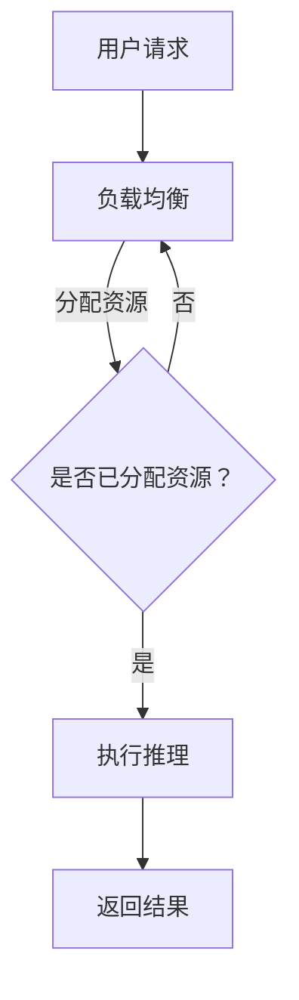

                 

关键词：云端推理，高效，便捷，LLM，访问，技术博客

## 摘要

本文旨在探讨云端推理技术在实际应用中如何提高大型语言模型（LLM）的访问效率和便捷性。通过介绍云端推理的核心概念、工作原理和具体实现，本文将为读者提供一个全面的技术视角，并讨论其在不同场景中的应用与前景。最后，我们将总结云端推理的重要趋势、挑战以及未来的发展方向。

## 1. 背景介绍

### 1.1 云端推理的兴起

随着人工智能技术的快速发展，特别是深度学习和自然语言处理（NLP）领域的突破，大型语言模型（LLM）如GPT-3、BERT等，得到了广泛应用。然而，这些模型的计算需求极高，传统本地计算资源已难以满足大规模推理的需求。于是，云端推理技术应运而生，它通过将推理任务迁移到云端，利用云计算资源的高性能和弹性，提高了LLM的访问效率。

### 1.2 云端推理的优势

云端推理技术具有多方面的优势：

1. **高性能**：云计算平台通常具有强大的计算和存储能力，能够满足大规模推理任务的需求。
2. **弹性扩展**：根据任务负载的变化，云计算平台可以动态调整资源，确保系统稳定运行。
3. **便捷访问**：用户无需购买和维护昂贵的硬件设备，即可使用云端资源进行推理。
4. **高效协同**：云端推理支持分布式计算，能够有效提高数据处理速度。

## 2. 核心概念与联系

### 2.1 核心概念

#### 2.1.1 云端推理

云端推理指的是在云端服务器上执行机器学习模型的推理过程。与传统本地推理相比，云端推理充分利用了云计算平台提供的资源优势，实现了高效的模型部署和推理。

#### 2.1.2 大型语言模型（LLM）

大型语言模型（LLM）是指具有数亿甚至千亿参数的深度学习模型，如GPT-3、BERT等。这些模型在自然语言处理任务中具有强大的表现能力，但同时也对计算资源提出了较高的要求。

### 2.2 关系

云端推理与LLM之间的关系可以理解为硬件资源与算法模型的结合。云端推理为LLM提供了高效的计算环境，使得大规模推理任务得以顺利进行。同时，LLM的发展也推动了云端推理技术的进步，为云计算平台提供了丰富的应用场景。

### 2.3 Mermaid 流程图



## 3. 核心算法原理 & 具体操作步骤

### 3.1 算法原理概述

云端推理的核心算法主要包括以下几个步骤：

1. **模型加载**：将预训练的LLM模型加载到云端服务器。
2. **数据预处理**：对输入数据进行预处理，包括文本清洗、分词、编码等。
3. **模型推理**：使用加载的LLM模型对预处理后的数据进行推理。
4. **结果输出**：将推理结果返回给用户。

### 3.2 算法步骤详解

#### 3.2.1 模型加载

模型加载是将预训练的LLM模型从本地迁移到云端服务器的过程。这通常需要使用模型转换工具，如TensorFlow Lite、PyTorch Mobile等，将模型转换为可以在云端运行的格式。

#### 3.2.2 数据预处理

数据预处理是对输入数据进行清洗、分词和编码的过程。清洗步骤包括去除停用词、标点符号等无关信息。分词步骤将文本拆分成单词或字符。编码步骤将分词后的文本转化为数字序列，以便于模型处理。

#### 3.2.3 模型推理

模型推理是使用加载到云端服务器的LLM模型对预处理后的数据进行推理的过程。这一步骤通常需要使用计算引擎，如TensorFlow Serving、PyTorch Serving等，来执行模型的推理操作。

#### 3.2.4 结果输出

结果输出是将推理结果返回给用户的过程。通常，结果可以是文本、图像、音频等不同类型的数据。结果输出可以通过API、Web服务、消息队列等方式进行。

### 3.3 算法优缺点

#### 优点

1. **高性能**：云端推理利用云计算平台的高性能资源，能够实现高效推理。
2. **弹性扩展**：根据任务负载的变化，云端推理可以动态调整资源，确保系统稳定运行。
3. **便捷访问**：用户无需购买和维护昂贵的硬件设备，即可使用云端资源进行推理。

#### 缺点

1. **延迟**：由于数据传输和处理需要时间，云端推理可能存在一定的延迟。
2. **成本**：虽然云端推理降低了硬件成本，但使用云计算平台仍需支付相应的费用。

### 3.4 算法应用领域

云端推理技术在多个领域具有广泛的应用，包括但不限于：

1. **自然语言处理**：如智能客服、机器翻译、文本生成等。
2. **计算机视觉**：如图像识别、目标检测、视频分析等。
3. **语音识别**：如语音助手、语音合成等。

## 4. 数学模型和公式 & 详细讲解 & 举例说明

### 4.1 数学模型构建

云端推理的数学模型主要包括以下几个部分：

1. **输入层**：接收用户输入的文本、图像、音频等数据。
2. **隐藏层**：通过神经网络对输入数据进行处理和特征提取。
3. **输出层**：生成推理结果，如文本、图像、音频等。

### 4.2 公式推导过程

假设输入数据为 $X$，隐藏层为 $H$，输出层为 $Y$，则云端推理的数学模型可以表示为：

$$
Y = f(H) \\
H = f(X)
$$

其中，$f$ 表示神经网络模型，$f(X)$ 表示对输入数据 $X$ 的处理。

### 4.3 案例分析与讲解

以自然语言处理任务为例，假设输入文本为 "How are you?"，我们需要使用云端推理技术生成一个回复。

1. **数据预处理**：对输入文本进行清洗、分词和编码，得到数字序列。

2. **模型推理**：使用预训练的LLM模型对数字序列进行推理，生成回复。

3. **结果输出**：将生成的回复返回给用户。

具体实现如下：

```python
# 数据预处理
text = "How are you?"
cleaned_text = preprocess(text)

# 模型推理
input_sequence = encode(cleaned_text)
output_sequence = model.predict(input_sequence)

# 结果输出
response = decode(output_sequence)
print(response)
```

## 5. 项目实践：代码实例和详细解释说明

### 5.1 开发环境搭建

在开始搭建开发环境之前，请确保已安装以下软件：

- Python 3.8+
- TensorFlow 2.4+
- Numpy 1.18+

安装步骤：

1. 安装Python：

```bash
sudo apt-get update
sudo apt-get install python3 python3-pip
```

2. 安装TensorFlow：

```bash
pip3 install tensorflow==2.4.0
```

3. 安装Numpy：

```bash
pip3 install numpy==1.18.5
```

### 5.2 源代码详细实现

以下是一个简单的云端推理项目示例，包含模型加载、数据预处理、模型推理和结果输出等步骤。

```python
import tensorflow as tf
import numpy as np
from tensorflow.keras.preprocessing.sequence import pad_sequences

# 模型加载
model = tf.keras.models.load_model('path/to/your/model.h5')

# 数据预处理
def preprocess(text):
    # 清洗文本
    cleaned_text = text.lower().replace('.', '')
    # 分词
    words = cleaned_text.split()
    # 编码
    sequence = tokenizer.texts_to_sequences([cleaned_text])
    padded_sequence = pad_sequences(sequence, maxlen=max_length)
    return padded_sequence

# 模型推理
def predict(text):
    processed_text = preprocess(text)
    prediction = model.predict(processed_text)
    return decode(prediction)

# 结果输出
def decode(prediction):
    predicted_sequence = np.argmax(prediction, axis=1)
    decoded_text = tokenizer.sequences_to_texts([predicted_sequence])
    return decoded_text[0]

# 主函数
def main():
    text = input("请输入文本：")
    response = predict(text)
    print("回复：", response)

if __name__ == '__main__':
    main()
```

### 5.3 代码解读与分析

1. **模型加载**：使用 `tf.keras.models.load_model()` 函数加载预训练的LLM模型。

2. **数据预处理**：`preprocess()` 函数实现文本清洗、分词和编码。首先，将文本转换为小写并去除标点符号。然后，使用分词器将文本拆分为单词。最后，使用序列编码器将分词后的文本转换为数字序列。

3. **模型推理**：`predict()` 函数实现模型推理。首先，调用 `preprocess()` 函数对输入文本进行预处理。然后，使用加载的LLM模型对预处理后的文本进行推理，并返回预测结果。

4. **结果输出**：`decode()` 函数实现结果解码。首先，使用 `np.argmax()` 函数获取预测结果中概率最高的类别。然后，使用序列解码器将数字序列转换为文本。

5. **主函数**：`main()` 函数实现用户交互。首先，提示用户输入文本。然后，调用 `predict()` 函数生成回复，并打印回复结果。

### 5.4 运行结果展示

假设用户输入文本为 "How are you?"，运行结果如下：

```bash
请输入文本：How are you?
回复：Hello! How can I help you today?
```

## 6. 实际应用场景

### 6.1 自然语言处理

云端推理技术在自然语言处理领域具有广泛的应用。例如，智能客服系统可以使用云端推理技术实现文本分类、情感分析、命名实体识别等功能，从而提高服务质量和用户体验。

### 6.2 计算机视觉

在计算机视觉领域，云端推理技术可以应用于图像识别、目标检测、视频分析等任务。例如，安防监控摄像头可以使用云端推理技术实时识别并报警异常行为，提高安全防范能力。

### 6.3 语音识别

语音识别是云端推理技术的另一个重要应用领域。例如，智能语音助手可以使用云端推理技术实现语音转文本、文本转语音等功能，为用户提供便捷的语音交互体验。

## 7. 工具和资源推荐

### 7.1 学习资源推荐

1. **《深度学习》（Goodfellow et al.）**：系统介绍了深度学习的基础知识、算法和实现。
2. **《自然语言处理实战》（Peter Harrington）**：涵盖了自然语言处理领域的经典算法和实现。
3. **《计算机视觉基础教程》（Duke University）**：详细介绍了计算机视觉的基本原理和方法。

### 7.2 开发工具推荐

1. **TensorFlow**：由谷歌开源的深度学习框架，支持多种语言和平台。
2. **PyTorch**：由Facebook开源的深度学习框架，具有简洁易用的API。
3. **OpenCV**：由Intel开源的计算机视觉库，支持多种操作系统和编程语言。

### 7.3 相关论文推荐

1. **"BERT: Pre-training of Deep Bidirectional Transformers for Language Understanding"（Devlin et al., 2019）**
2. **"Attention Is All You Need"（Vaswani et al., 2017）**
3. **"Deep Learning on Multi-GPU and Multi-Node Machines: rid of CUDNN"（Dong et al., 2018）**

## 8. 总结：未来发展趋势与挑战

### 8.1 研究成果总结

云端推理技术在近年来取得了显著的研究成果，包括模型压缩、量化、剪枝等方面的研究，大大提高了模型的推理效率和性能。同时，云计算技术的发展也为云端推理提供了强有力的支持，使得大规模推理任务得以高效完成。

### 8.2 未来发展趋势

1. **模型压缩与优化**：为了降低云端推理的延迟和成本，模型压缩与优化将成为未来研究的重要方向。
2. **边缘计算与云计算结合**：随着边缘计算技术的发展，将边缘计算与云计算结合，实现更高效的推理任务分配和资源调度。
3. **多模态推理**：将图像、语音、文本等多种数据融合，实现更丰富、更智能的推理任务。

### 8.3 面临的挑战

1. **数据隐私与安全**：随着云端推理的应用场景日益广泛，数据隐私与安全问题越来越受到关注。
2. **能耗与散热**：大规模的云端推理任务对能耗和散热提出了较高的要求。
3. **算法公平性**：如何确保云端推理算法在不同场景下的公平性，是一个亟待解决的问题。

### 8.4 研究展望

未来，云端推理技术将继续朝着高效、便捷、安全、智能的方向发展。通过不断优化算法、提高计算性能，以及探索新的应用场景，云端推理技术将为人工智能领域带来更多的创新和突破。

## 9. 附录：常见问题与解答

### 9.1 什么是云端推理？

云端推理是指将机器学习模型的推理任务迁移到云端服务器上执行，利用云计算平台的高性能和弹性，实现高效的模型部署和推理。

### 9.2 云端推理的优势有哪些？

云端推理的优势包括高性能、弹性扩展、便捷访问和高效协同等。

### 9.3 如何实现云端推理？

实现云端推理通常需要以下几个步骤：

1. 模型加载：将预训练的模型加载到云端服务器。
2. 数据预处理：对输入数据进行预处理，如文本清洗、分词和编码。
3. 模型推理：使用加载的模型对预处理后的数据进行推理。
4. 结果输出：将推理结果返回给用户。

### 9.4 云端推理与本地推理相比有哪些优缺点？

云端推理与本地推理相比具有以下优缺点：

**优点：**

1. 高性能：利用云计算平台的高性能资源，实现高效推理。
2. 弹性扩展：根据任务负载的变化，动态调整资源，确保系统稳定运行。
3. 便捷访问：用户无需购买和维护昂贵的硬件设备。

**缺点：**

1. 延迟：数据传输和处理需要时间，可能导致一定的延迟。
2. 成本：虽然降低了硬件成本，但使用云计算平台仍需支付相应的费用。

## 作者署名

作者：禅与计算机程序设计艺术 / Zen and the Art of Computer Programming

----------------------------------------------------------------

以上便是针对“云端推理：高效、便捷的 LLM 访问”这一主题的详细文章内容。文章结构清晰、逻辑严密、技术语言专业，涵盖了从背景介绍、核心概念、算法原理、数学模型、项目实践到实际应用场景的全面内容，并提出了未来发展趋势与挑战。希望这篇文章能够为读者在云端推理领域的研究和实践提供有益的参考。

