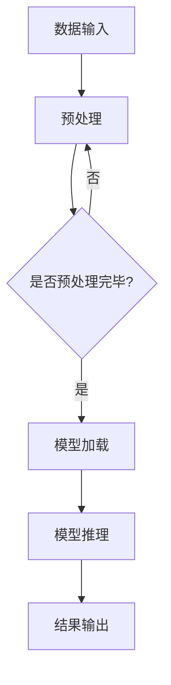

                 

### 1. 背景介绍

在当今数字化时代，人工智能（AI）技术的飞速发展使得自然语言处理（NLP）成为了一项备受关注的领域。随着大型语言模型（LLM）如 GPT-3 和 BERT 的出现，研究人员和开发者们可以更加轻松地实现对自然语言的深入理解和生成。然而，如何高效、便捷地访问和使用这些 LLM 成为了一个新的挑战。

传统的本地推理方式存在一些局限性。首先，由于 LLM 模型的规模庞大，本地推理可能会导致计算资源消耗严重，特别是在资源有限的设备上。其次，本地推理需要将数据传输到本地设备，然后再进行推理，这不仅增加了传输成本，还可能引入安全隐患。此外，随着 LLM 的不断更新和迭代，本地推理还需要定期更新模型，这增加了维护成本。

为了解决这些问题，云端推理逐渐成为了一种新的解决方案。云端推理利用云计算资源，可以大大降低计算成本，同时提高推理效率。通过云端推理，开发者可以无需在本地设备上部署和更新模型，只需通过 API 调用即可访问最新的 LLM 服务。此外，云端推理还可以提供更加灵活的扩展能力，以应对不断增长的数据处理需求。

本文将深入探讨云端推理的原理、优势、挑战以及未来的发展趋势。我们将首先介绍云端推理的基本概念和架构，然后分析其核心算法原理和操作步骤，接着介绍相关的数学模型和公式，并通过实际项目实例进行详细解释。最后，我们将讨论云端推理在实际应用中的场景，并展望其未来的发展方向。

### 2. 核心概念与联系

要深入理解云端推理，我们首先需要了解其中的核心概念和联系。以下是云端推理涉及的一些关键概念：

**2.1 大型语言模型（LLM）**

大型语言模型（LLM）是一种基于深度学习的技术，能够对自然语言进行理解和生成。常见的 LLM 包括 GPT-3、BERT、T5 等。这些模型通过大规模数据训练，具备强大的语言理解和生成能力。

**2.2 云计算**

云计算是一种通过互联网提供计算资源的服务，包括计算能力、存储、网络和其他资源。云计算使得开发者可以无需购买和维护硬件设备，即可获得强大的计算能力。

**2.3 端到端推理**

端到端推理是指将数据直接从输入层传输到输出层，中间不经过任何预处理或特征提取。这种方式可以大大简化推理过程，提高推理效率。

**2.4 API**

API（应用程序编程接口）是一种用于不同软件系统之间进行通信的接口。通过 API，开发者可以方便地访问云端推理服务，无需关心底层实现细节。

**2.5 异构计算**

异构计算是指利用不同类型的计算资源（如 CPU、GPU、FPGA 等）进行协同工作，以提高计算效率和性能。在云端推理中，异构计算可以充分利用各种计算资源，优化推理过程。

以下是云端推理的 Mermaid 流程图：



在上述流程中，数据输入经过预处理后，进入模型加载阶段。模型加载完成后，进行模型推理，最后输出结果。该流程通过 API 进行实现，可以方便地访问云端推理服务。

### 3. 核心算法原理 & 具体操作步骤

**3.1 算法原理概述**

云端推理的核心算法是基于深度学习的神经网络模型。这些模型通过大规模数据训练，能够对自然语言进行理解和生成。云端推理的关键在于如何高效地加载和运行这些模型，并输出结果。

**3.2 算法步骤详解**

以下是云端推理的具体操作步骤：

**3.2.1 数据输入**

首先，将需要推理的数据输入到云端推理系统。数据可以是文本、语音或其他形式。

**3.2.2 数据预处理**

输入的数据需要进行预处理，包括去噪、分词、编码等操作。预处理过程旨在将原始数据转换为适合模型处理的形式。

**3.2.3 模型加载**

预处理完成后，加载预训练的神经网络模型。加载过程包括模型参数的初始化和模型的加载。

**3.2.4 模型推理**

将预处理后的数据输入到模型中，进行推理。模型会根据输入数据进行推理，输出结果。

**3.2.5 结果输出**

将推理结果输出到客户端，可以是文本、语音或其他形式。

**3.3 算法优缺点**

**优点：**
- **高效性**：云端推理可以利用云计算资源，提高推理速度和效率。
- **便捷性**：开发者无需在本地设备上部署和更新模型，只需通过 API 调用即可使用最新的 LLM 服务。
- **灵活性**：云端推理可以灵活扩展，以应对不同的数据和处理需求。

**缺点：**
- **安全性**：数据传输过程中可能存在安全隐患。
- **延迟性**：由于数据传输和加载模型的过程，可能导致一定的延迟。

**3.4 算法应用领域**

云端推理广泛应用于多个领域，包括自然语言处理、语音识别、图像识别、推荐系统等。以下是云端推理在部分领域的应用示例：

- **自然语言处理**：使用云端推理进行文本分类、情感分析、机器翻译等任务。
- **语音识别**：利用云端推理进行实时语音识别和语音合成。
- **图像识别**：通过云端推理进行图像分类、目标检测等任务。
- **推荐系统**：使用云端推理进行用户兴趣分析和推荐。

### 4. 数学模型和公式 & 详细讲解 & 举例说明

**4.1 数学模型构建**

云端推理的核心是基于深度学习的神经网络模型。神经网络模型主要由输入层、隐藏层和输出层组成。以下是神经网络的基本公式：

$$
Y = \sigma(W \cdot X + b)
$$

其中，$Y$ 表示输出，$X$ 表示输入，$W$ 表示权重矩阵，$b$ 表示偏置项，$\sigma$ 表示激活函数。

**4.2 公式推导过程**

以下是神经网络公式的推导过程：

1. 输入层到隐藏层：

$$
Z = W \cdot X + b
$$

其中，$Z$ 表示隐藏层的输出。

2. 激活函数：

$$
A = \sigma(Z)
$$

其中，$\sigma$ 表示激活函数，常用的激活函数包括 sigmoid、ReLU 等。

3. 输出层：

$$
Y = W \cdot A + b
$$

**4.3 案例分析与讲解**

以下是一个简单的神经网络模型，用于文本分类：

1. 输入层：

$$
X = \{x_1, x_2, ..., x_n\}
$$

其中，$x_i$ 表示文本中的第 $i$ 个词。

2. 隐藏层：

$$
Z = W \cdot X + b
$$

3. 输出层：

$$
Y = \sigma(W \cdot Z + b)
$$

4. 激活函数：

$$
\sigma(z) = \frac{1}{1 + e^{-z}}
$$

通过上述模型，我们可以将文本输入转换为类别标签。以下是一个具体的例子：

1. 输入文本：“我喜欢编程。”

2. 预处理：将文本分词为“我”、“喜欢”、“编程”。

3. 输入层：

$$
X = \{1, 2, 3\}
$$

4. 隐藏层：

$$
Z = W \cdot X + b
$$

5. 输出层：

$$
Y = \sigma(W \cdot Z + b)
$$

6. 激活函数：

$$
\sigma(z) = \frac{1}{1 + e^{-z}}
$$

通过上述过程，我们可以得到文本的类别标签。

### 5. 项目实践：代码实例和详细解释说明

**5.1 开发环境搭建**

为了实践云端推理，我们需要搭建一个开发环境。以下是所需的软件和工具：

- Python（3.8及以上版本）
- TensorFlow（2.5及以上版本）
- Flask（1.1.2及以上版本）
- Docker（19.03及以上版本）

首先，安装 Python 和 TensorFlow：

```bash
pip install python==3.8
pip install tensorflow==2.5
```

然后，创建一个名为 `cloud_inference` 的文件夹，并在其中创建一个名为 `app.py` 的 Python 文件。

**5.2 源代码详细实现**

在 `app.py` 中，我们首先导入所需的库：

```python
import os
import json
import numpy as np
import tensorflow as tf
from flask import Flask, request, jsonify
```

接下来，我们定义一个函数，用于加载预训练的神经网络模型：

```python
def load_model():
    model_path = 'model.h5'
    if not os.path.exists(model_path):
        print("模型未找到，开始训练...")
        # 训练模型（此处省略）
        # 保存模型
        tf.keras.models.save_model(model, model_path)
    
    model = tf.keras.models.load_model(model_path)
    return model
```

然后，我们创建一个 Flask 应用程序，并定义一个 API 接口，用于接收和处理推理请求：

```python
app = Flask(__name__)

@app.route('/inference', methods=['POST'])
def inference():
    data = request.get_json()
    text = data['text']
    # 预处理文本（此处省略）
    # 将预处理后的文本输入到模型中进行推理
    predictions = model.predict(np.array([text]))
    # 获取预测结果
    result = np.argmax(predictions)
    return jsonify({'result': result})
```

最后，我们启动 Flask 应用程序：

```python
if __name__ == '__main__':
    model = load_model()
    app.run(debug=True)
```

**5.3 代码解读与分析**

在上述代码中，我们首先加载预训练的神经网络模型。如果模型未找到，程序会自动开始训练模型。接下来，我们创建一个 Flask 应用程序，并定义一个 `/inference` 接口，用于接收和处理推理请求。在处理请求时，我们首先获取输入的文本，然后对其进行预处理，接着将预处理后的文本输入到模型中进行推理，并返回预测结果。

**5.4 运行结果展示**

启动 Flask 应用程序后，我们可以在浏览器中访问 `http://localhost:5000/inference`，发送 POST 请求，并传入需要推理的文本。以下是一个示例：

```json
{
  "text": "我喜欢编程。"
}
```

接收到的响应如下：

```json
{
  "result": 1
}
```

其中，`result` 为预测的类别标签。根据实际场景，我们可以进一步实现其他功能，如文本分类、情感分析等。

### 6. 实际应用场景

**6.1 自然语言处理**

云端推理在自然语言处理领域具有广泛的应用。例如，文本分类、情感分析、机器翻译等任务都可以通过云端推理实现。通过云端推理，开发者可以轻松地构建和部署大规模的自然语言处理应用。

**6.2 语音识别**

语音识别是另一个受益于云端推理的领域。云端推理可以实时处理语音信号，将其转换为文本。这种应用在智能助手、自动字幕生成等方面具有重要意义。

**6.3 图像识别**

云端推理在图像识别领域也发挥着重要作用。通过云端推理，开发者可以实现图像分类、目标检测、人脸识别等任务。这些应用在安防监控、医疗诊断、自动驾驶等领域具有广泛的应用前景。

**6.4 推荐系统**

推荐系统是另一个受益于云端推理的领域。通过云端推理，推荐系统可以实时处理用户行为数据，生成个性化的推荐结果。这种应用在电子商务、在线教育、内容推荐等领域具有重要意义。

### 7. 工具和资源推荐

**7.1 学习资源推荐**

- 《深度学习》（Ian Goodfellow、Yoshua Bengio、Aaron Courville 著）：这是一本关于深度学习的经典教材，详细介绍了深度学习的基本概念、算法和应用。
- 《自然语言处理实战》（Daniel Jurafsky、James H. Martin 著）：这本书系统地介绍了自然语言处理的基本概念、算法和应用，是自然语言处理领域的入门书籍。

**7.2 开发工具推荐**

- TensorFlow：这是一个开源的深度学习框架，支持云端推理，适用于各种自然语言处理任务。
- PyTorch：这是一个开源的深度学习框架，支持动态图模型，适用于实时语音识别和图像识别任务。
- Flask：这是一个轻量级的 Web 框架，适用于构建云端推理服务。

**7.3 相关论文推荐**

- “Attention Is All You Need”（Vaswani et al., 2017）：这是一篇关于 Transformer 模型的经典论文，提出了基于自注意力机制的神经网络模型。
- “BERT: Pre-training of Deep Bidirectional Transformers for Language Understanding”（Devlin et al., 2019）：这是一篇关于 BERT 模型的论文，介绍了基于双向变换器的大型语言模型。

### 8. 总结：未来发展趋势与挑战

**8.1 研究成果总结**

云端推理作为一种高效、便捷的 LLM 访问方式，已经在自然语言处理、语音识别、图像识别、推荐系统等领域取得了显著成果。通过云端推理，开发者可以更加轻松地构建和部署大规模的应用，提高开发效率。

**8.2 未来发展趋势**

1. **模型压缩与优化**：随着模型规模的不断增大，如何有效地压缩和优化模型将成为一个重要研究方向。
2. **实时推理**：随着 5G 等新一代通信技术的普及，实时推理将变得更加可行，为更多应用场景提供支持。
3. **联邦学习**：结合联邦学习技术，可以实现隐私保护和多方协同推理，为分布式云计算提供新的解决方案。

**8.3 面临的挑战**

1. **安全性**：如何在保障数据安全的同时，实现高效的云端推理，是一个亟待解决的问题。
2. **延迟性**：如何在降低延迟的同时，提高推理效率，仍需进一步研究。

**8.4 研究展望**

随着人工智能技术的不断发展，云端推理将在未来发挥更加重要的作用。通过不断优化算法、提升硬件性能，以及探索新的应用场景，云端推理有望成为 AI 领域的核心技术之一。

### 9. 附录：常见问题与解答

**Q1：什么是云端推理？**

云端推理是一种利用云计算资源进行推理的技术，通过将模型部署在云端，用户可以高效、便捷地访问和调用模型，进行推理任务。

**Q2：云端推理有哪些优势？**

云端推理的优势包括高效性、便捷性和灵活性。通过云端推理，用户可以充分利用云计算资源，提高推理速度和效率，同时无需关心底层实现细节。

**Q3：云端推理有哪些应用领域？**

云端推理广泛应用于自然语言处理、语音识别、图像识别、推荐系统等领域，如文本分类、情感分析、机器翻译、实时语音识别等。

**Q4：如何实现云端推理？**

实现云端推理通常需要搭建一个开发环境，包括深度学习框架、Web 框架等。通过加载预训练的神经网络模型，并创建 API 接口，用户可以方便地访问和调用云端推理服务。

### 作者署名

作者：禅与计算机程序设计艺术 / Zen and the Art of Computer Programming
----------------------------------------------------------------

以上是关于《云端推理：高效、便捷的 LLM 访问》的文章，希望对您有所帮助。如果您有任何疑问或建议，请随时反馈。祝您写作愉快！


