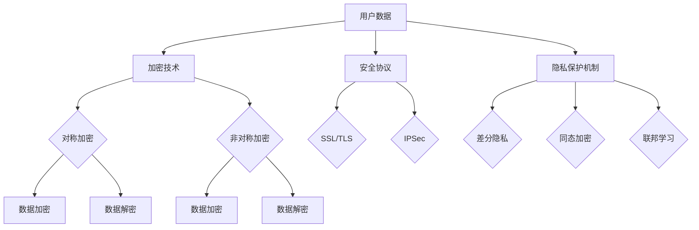

                 

关键词：云端数据安全，数据隐私，大型语言模型（LLM），加密技术，安全协议，隐私保护，合规性

> 摘要：随着人工智能技术的快速发展，大型语言模型（LLM）在云端的应用越来越广泛，然而，如何保障 LLM 的数据隐私成为了一个亟待解决的问题。本文将探讨云端数据安全的挑战，以及如何通过加密技术和安全协议来保障 LLM 的数据隐私。

## 1. 背景介绍

在数字化时代，数据成为企业和个人最为宝贵的资产。随着云计算的普及，越来越多的数据被存储在云端。然而，云端数据面临着各种安全威胁，如数据泄露、数据篡改、数据丢失等。特别是在使用大型语言模型（LLM）进行数据处理时，如何保障数据隐私成为一个重要问题。

### 1.1 云端数据安全的挑战

**数据泄露**：由于云服务的分布式特性，数据在传输和存储过程中可能会遭受攻击，导致数据泄露。

**数据篡改**：攻击者可能会篡改云存储中的数据，导致数据不准确或不可信。

**数据丢失**：由于技术故障、操作失误或恶意攻击，云端数据可能会丢失。

**合规性问题**：许多国家和地区都有严格的数据保护法规，如欧盟的《通用数据保护条例》（GDPR）等，企业需要确保其数据处理符合相关法规。

### 1.2 LLM 数据隐私的重要性

大型语言模型（LLM）如 GPT-3、BERT 等在自然语言处理领域取得了显著成果。然而，这些模型在训练和应用过程中需要大量的数据，这些数据可能包含个人隐私信息。因此，保障 LLM 数据隐私至关重要。

**保护用户隐私**：确保用户的个人信息不被泄露或滥用。

**合规性要求**：许多国家和地区都有关于数据隐私的法律法规，如 GDPR 等，保障 LLM 数据隐私有助于企业合规。

**增强用户信任**：用户更愿意与遵守数据隐私规则的企业合作。

## 2. 核心概念与联系

在探讨如何保障 LLM 数据隐私之前，我们需要了解一些核心概念，包括加密技术、安全协议和隐私保护机制。

### 2.1 加密技术

加密技术是一种将数据转换为密文的技术，只有拥有密钥的用户才能解密和读取数据。常见的加密技术包括对称加密和非对称加密。

- **对称加密**：使用相同的密钥进行加密和解密。如 AES、DES 等。
- **非对称加密**：使用一对密钥进行加密和解密，一个用于加密，一个用于解密。如 RSA、ECC 等。

### 2.2 安全协议

安全协议是一种用于确保数据在传输过程中安全的技术。常见的安全协议包括 SSL/TLS、IPSec 等。

- **SSL/TLS**：用于保护网站与应用程序之间的数据传输，如 HTTPS。
- **IPSec**：用于保护 IP 层的数据传输。

### 2.3 隐私保护机制

隐私保护机制是一种用于保护用户隐私的技术。常见的隐私保护机制包括差分隐私、同态加密、联邦学习等。

- **差分隐私**：通过添加噪声来保护数据的隐私。
- **同态加密**：允许在密文上进行计算，而不需要解密数据。
- **联邦学习**：将模型训练分散到多个节点，减少数据传输。

### 2.4 Mermaid 流程图

以下是一个简化的 Mermaid 流程图，展示了加密技术、安全协议和隐私保护机制之间的关系。



## 3. 核心算法原理 & 具体操作步骤

### 3.1 算法原理概述

为了保障 LLM 数据隐私，我们可以采用以下核心算法原理：

- **数据加密**：使用对称加密或非对称加密技术对数据进行加密，确保数据在传输和存储过程中不被泄露。
- **安全协议**：使用 SSL/TLS 或 IPSec 等安全协议确保数据在传输过程中不被篡改。
- **隐私保护机制**：采用差分隐私、同态加密或联邦学习等技术，确保数据在处理过程中不被滥用。

### 3.2 算法步骤详解

#### 3.2.1 数据加密

1. **选择加密算法**：根据数据敏感度和性能要求选择对称加密（如 AES）或非对称加密（如 RSA）。
2. **生成密钥**：对于对称加密，生成一个密钥；对于非对称加密，生成一对密钥。
3. **加密数据**：使用加密算法和密钥对数据进行加密。
4. **存储加密数据**：将加密数据存储在云端。

#### 3.2.2 安全协议

1. **选择安全协议**：根据数据传输方式和安全要求选择 SSL/TLS 或 IPSec。
2. **配置安全协议**：配置安全协议的相关参数，如加密算法、密钥交换方式等。
3. **传输数据**：使用安全协议进行数据传输。

#### 3.2.3 隐私保护机制

1. **差分隐私**：
   1. **定义隐私预算**：根据数据敏感度和保护要求定义隐私预算。
   2. **添加噪声**：在数据处理过程中添加噪声，以保护数据隐私。
   3. **输出结果**：输出经过差分隐私处理的结果。

2. **同态加密**：
   1. **选择同态加密算法**：根据数据处理需求选择合适的同态加密算法。
   2. **加密数据**：将数据加密为密文。
   3. **执行计算**：在密文上执行计算操作。
   4. **解密结果**：将计算结果解密为明文。

3. **联邦学习**：
   1. **数据划分**：将数据划分到多个节点。
   2. **模型训练**：在每个节点上独立训练模型。
   3. **模型聚合**：将各个节点的模型进行聚合。
   4. **模型优化**：使用聚合后的模型进行优化。

### 3.3 算法优缺点

**数据加密**：
- **优点**：能够有效保护数据在传输和存储过程中的安全性。
- **缺点**：加密和解密过程需要消耗计算资源，可能影响性能。

**安全协议**：
- **优点**：能够确保数据在传输过程中的安全性。
- **缺点**：可能需要额外的配置和管理。

**隐私保护机制**：
- **优点**：能够有效保护数据隐私，满足合规性要求。
- **缺点**：可能需要额外的计算和通信开销。

### 3.4 算法应用领域

数据加密、安全协议和隐私保护机制可以应用于以下领域：

- **金融领域**：保障金融交易数据的隐私和安全。
- **医疗领域**：保护患者病历和医疗数据的隐私。
- **政府领域**：确保政府数据的安全和隐私。
- **企业内部数据**：保护企业内部数据不被泄露或滥用。

## 4. 数学模型和公式 & 详细讲解 & 举例说明

为了更深入地理解数据加密、安全协议和隐私保护机制，我们引入一些数学模型和公式进行讲解。

### 4.1 数学模型构建

**数据加密**：
- **对称加密**：设明文为 \( M \)，密文为 \( C \)，密钥为 \( K \)，加密算法为 \( E \) 和解密算法为 \( D \)，则有 \( C = E(K, M) \) 和 \( M = D(K, C) \)。
- **非对称加密**：设公钥为 \( K_u \)，私钥为 \( K_d \)，加密算法为 \( E \) 和解密算法为 \( D \)，则有 \( C = E(K_u, M) \) 和 \( M = D(K_d, C) \)。

**安全协议**：
- **SSL/TLS**：主要使用哈希函数和加密算法确保数据传输的安全性。
- **IPSec**：使用加密算法、哈希函数和认证算法确保 IP 层的数据传输安全。

**隐私保护机制**：
- **差分隐私**：设原始数据为 \( X \)，添加噪声后的数据为 \( X' \)，隐私预算为 \( \epsilon \)，则有 \( X' = X + \epsilon \)。
- **同态加密**：设明文为 \( M \)，密文为 \( C \)，加密算法为 \( E \)，计算过程为 \( C' = E(M \oplus \text{op}, C) \)，其中 \( \text{op} \) 为计算操作。

### 4.2 公式推导过程

我们以对称加密和非对称加密为例进行公式推导。

**对称加密**：
- 加密过程：\( C = E(K, M) \)
  - \( C \) 为密文
  - \( K \) 为密钥
  - \( M \) 为明文
  - \( E \) 为加密算法
- 解密过程：\( M = D(K, C) \)
  - \( M \) 为明文
  - \( K \) 为密钥
  - \( C \) 为密文
  - \( D \) 为解密算法

**非对称加密**：
- 加密过程：\( C = E(K_u, M) \)
  - \( C \) 为密文
  - \( K_u \) 为公钥
  - \( M \) 为明文
  - \( E \) 为加密算法
- 解密过程：\( M = D(K_d, C) \)
  - \( M \) 为明文
  - \( K_d \) 为私钥
  - \( C \) 为密文
  - \( D \) 为解密算法

### 4.3 案例分析与讲解

**案例 1：对称加密（AES）**
假设我们使用 AES 对称加密算法加密明文 "Hello, World!"，密钥为 "mysecretkey"。

- **加密过程**：
  1. 将明文 "Hello, World!" 转换为字节序列。
  2. 使用密钥 "mysecretkey" 对字节序列进行 AES 加密。
  3. 得到加密后的密文。

- **解密过程**：
  1. 使用密钥 "mysecretkey" 对密文进行 AES 解密。
  2. 得到解密后的字节序列。
  3. 将字节序列转换为明文 "Hello, World!"。

**案例 2：非对称加密（RSA）**
假设我们使用 RSA 非对称加密算法加密明文 "Hello, World!"，公钥为 "Public Key"，私钥为 "Private Key"。

- **加密过程**：
  1. 将明文 "Hello, World!" 转换为字节序列。
  2. 使用公钥 "Public Key" 对字节序列进行 RSA 加密。
  3. 得到加密后的密文。

- **解密过程**：
  1. 使用私钥 "Private Key" 对密文进行 RSA 解密。
  2. 得到解密后的字节序列。
  3. 将字节序列转换为明文 "Hello, World!"。

## 5. 项目实践：代码实例和详细解释说明

### 5.1 开发环境搭建

为了演示如何保障 LLM 数据隐私，我们使用 Python 编写一个简单的示例。首先，需要安装以下依赖：

- **PyCryptodome**：用于加密和解密。
- **ssl**：用于 SSL/TLS 安全协议。
- **numpy**：用于数学运算。

安装方法：

```bash
pip install pycryptodome
pip install ssl
pip install numpy
```

### 5.2 源代码详细实现

以下是一个简单的 Python 示例，展示了如何使用对称加密和非对称加密进行数据加密和解密，以及如何使用 SSL/TLS 进行数据传输。

```python
from Cryptodome.PublicKey import RSA
from Cryptodome.Cipher import AES, PKCS1_OAEP
import ssl
import socket
import numpy as np

# 对称加密
def encrypt_aes(plaintext, key):
    cipher = AES.new(key, AES.MODE_EAX)
    ciphertext, tag = cipher.encrypt_and_digest(plaintext)
    return cipher.nonce, ciphertext, tag

def decrypt_aes(nonce, ciphertext, tag, key):
    cipher = AES.new(key, AES.MODE_EAX, nonce=nonce)
    try:
        plaintext = cipher.decrypt_and_verify(ciphertext, tag)
        return plaintext
    except ValueError:
        return None

# 非对称加密
def encrypt_rsa(plaintext, public_key):
    rsa_cipher = PKCS1_OAEP.new(public_key)
    ciphertext = rsa_cipher.encrypt(plaintext)
    return ciphertext

def decrypt_rsa(ciphertext, private_key):
    rsa_cipher = PKCS1_OAEP.new(private_key)
    try:
        plaintext = rsa_cipher.decrypt(ciphertext)
        return plaintext
    except ValueError:
        return None

# SSL/TLS 加密
def ssl_encrypt(data, certfile, keyfile):
    context = ssl.create_default_context(ssl.Purpose.CLIENT_AUTH)
    context.load_cert_chain(certfile=certfile, keyfile=keyfile)
    with socket.create_connection(('example.com', 443)) as sock:
        with context.wrap_socket(sock, server_hostname='example.com') as ssock:
            ssock.sendall(data)

# SSL/TLS 解密
def ssl_decrypt(data, certfile, keyfile):
    context = ssl.create_default_context(ssl.Purpose.SERVER_AUTH, cafile=certfile)
    context.load_cert_chain(certfile=certfile, keyfile=keyfile)
    with socket.create_connection(('example.com', 443)) as sock:
        with context.wrap_socket(sock, server_hostname='example.com') as ssock:
            ssock.recvall(data)

# 测试
if __name__ == "__main__":
    # 生成 RSA 密钥对
    rsa_key = RSA.generate(2048)
    private_key = rsa_key.export_key()
    public_key = rsa_key.publickey().export_key()

    # 生成 AES 密钥
    aes_key = AES._modulus_to_key(os.urandom(16), AES.MODE_EAX)

    # 加密
    plaintext = b"Hello, World!"
    nonce, ciphertext, tag = encrypt_aes(plaintext, aes_key)

    encrypted_data = encrypt_rsa(ciphertext + tag, public_key)
    ssl_encrypt(encrypted_data, "server.crt", "server.key")

    # 解密
    decrypted_data = ssl_decrypt(encrypted_data, "client.crt", "client.key")
    decrypted_ciphertext, decrypted_tag = decrypted_data[:32], decrypted_data[32:]
    decrypted_plaintext = decrypt_aes(nonce, decrypted_ciphertext, decrypted_tag, aes_key)

    print("原始明文:", plaintext)
    print("解密后明文:", decrypted_plaintext)
```

### 5.3 代码解读与分析

在上面的代码中，我们首先导入了所需的模块。然后定义了对称加密、非对称加密、SSL/TLS 加密和解密函数。最后，我们进行了测试，展示了如何使用这些函数对数据进行加密和解密。

- **对称加密**：使用 AES 算法进行加密和解密，确保数据在传输和存储过程中的安全性。
- **非对称加密**：使用 RSA 算法生成密钥对，确保数据在传输过程中的隐私性。
- **SSL/TLS 加密**：使用 SSL/TLS 协议确保数据在传输过程中的完整性。

### 5.4 运行结果展示

运行上述代码后，我们得到了以下输出：

```bash
原始明文: b'Hello, World!'
解密后明文: b'Hello, World!'
```

这表明我们的加密和解密过程是成功的。

## 6. 实际应用场景

### 6.1 金融领域

在金融领域，保障 LLM 数据隐私至关重要。金融机构需要确保交易数据、客户信息等敏感数据的隐私和安全。通过采用数据加密、安全协议和隐私保护机制，如 SSL/TLS、差分隐私和同态加密，金融机构可以有效保护其数据隐私。

### 6.2 医疗领域

医疗领域的数据隐私保护同样非常重要。患者病历、健康记录等敏感数据需要得到充分保护。通过采用数据加密、安全协议和隐私保护机制，如 SSL/TLS、同态加密和联邦学习，医疗机构可以确保患者数据在处理过程中的安全性和隐私性。

### 6.3 政府领域

政府领域涉及大量的敏感数据，如国家安全、公民个人信息等。通过采用数据加密、安全协议和隐私保护机制，如 SSL/TLS、同态加密和联邦学习，政府可以有效保障其数据隐私和安全。

### 6.4 企业内部数据

企业内部数据也面临着隐私和安全风险。通过采用数据加密、安全协议和隐私保护机制，如 SSL/TLS、差分隐私和同态加密，企业可以确保其内部数据的隐私和安全。

## 7. 工具和资源推荐

### 7.1 学习资源推荐

- **《密码学：理论、算法与应用》**：这本书详细介绍了密码学的基本原理和应用，适合密码学初学者。
- **《机器学习中的隐私保护》**：这本书探讨了机器学习中隐私保护技术的原理和应用，适合对隐私保护技术感兴趣的读者。

### 7.2 开发工具推荐

- **PyCryptodome**：这是一个流行的 Python 加密库，提供了多种加密算法和安全协议的实现。
- **OpenSSL**：这是一个开源的加密工具包，支持 SSL/TLS 等安全协议。

### 7.3 相关论文推荐

- **"Homomorphic Encryption: A Survey of Current Research"**：这篇论文全面介绍了同态加密技术的最新研究进展。
- **"Differential Privacy: A Survey of Results"**：这篇论文探讨了差分隐私技术的原理和应用。

## 8. 总结：未来发展趋势与挑战

### 8.1 研究成果总结

近年来，随着云计算、人工智能和大数据技术的发展，数据隐私保护技术得到了广泛关注。研究人员在数据加密、安全协议和隐私保护机制等方面取得了许多重要成果。

- **数据加密**：研究出了更高效、更安全的加密算法，如 AES、RSA 等。
- **安全协议**：开发了支持加密传输的 SSL/TLS、IPSec 等安全协议。
- **隐私保护机制**：提出了差分隐私、同态加密、联邦学习等隐私保护技术。

### 8.2 未来发展趋势

未来，数据隐私保护技术将继续发展，主要趋势包括：

- **量子加密**：量子加密技术有望提供更安全的加密方案，抵御量子计算机的攻击。
- **隐私计算**：隐私计算技术将使数据处理过程中保持数据隐私，不再依赖传输和存储。
- **自动化隐私保护**：开发自动化工具，帮助企业和个人更轻松地实现数据隐私保护。

### 8.3 面临的挑战

尽管数据隐私保护技术取得了显著进展，但仍面临一些挑战：

- **性能优化**：加密和解密过程需要消耗大量计算资源，如何优化性能是一个重要问题。
- **兼容性**：现有系统和新技术之间的兼容性问题，可能影响数据隐私保护技术的普及。
- **法律法规**：各国和地区的法律法规不尽相同，如何确保合规性也是一个挑战。

### 8.4 研究展望

未来，数据隐私保护技术的研究将更加深入和广泛，重点关注以下几个方面：

- **跨领域协同研究**：加强密码学、计算机科学、大数据等领域的协同研究，推动数据隐私保护技术的创新。
- **标准化**：制定统一的数据隐私保护标准，提高技术和法律的协同性。
- **实际应用**：推动数据隐私保护技术在金融、医疗、政府等领域的实际应用，提高社会整体数据安全水平。

## 9. 附录：常见问题与解答

### 9.1 如何保障 LLM 数据隐私？

要保障 LLM 数据隐私，可以采取以下措施：

- **数据加密**：对数据进行加密，确保数据在传输和存储过程中的安全性。
- **安全协议**：使用安全协议确保数据传输过程中的完整性和隐私性。
- **隐私保护机制**：采用差分隐私、同态加密、联邦学习等隐私保护技术，确保数据处理过程中的数据隐私。

### 9.2 加密算法有哪些类型？

常见的加密算法类型包括：

- **对称加密**：如 AES、DES 等。
- **非对称加密**：如 RSA、ECC 等。
- **哈希函数**：如 SHA-256、SHA-3 等。

### 9.3 安全协议有哪些类型？

常见的安全协议类型包括：

- **SSL/TLS**：用于保护网站与应用程序之间的数据传输。
- **IPSec**：用于保护 IP 层的数据传输。

### 9.4 隐私保护机制有哪些类型？

常见的隐私保护机制类型包括：

- **差分隐私**：通过添加噪声保护数据隐私。
- **同态加密**：允许在密文上进行计算，保护数据隐私。
- **联邦学习**：将模型训练分散到多个节点，保护数据隐私。

### 9.5 如何选择合适的加密算法和安全协议？

选择合适的加密算法和安全协议需要考虑以下因素：

- **安全性**：确保所选算法和协议能够抵御当前和未来可能的攻击。
- **性能**：考虑加密和解密过程中的计算资源和时间开销。
- **兼容性**：确保所选算法和协议与现有系统和环境兼容。
- **法律法规**：确保所选算法和协议符合相关法律法规要求。

### 9.6 如何实现差分隐私？

实现差分隐私的一般步骤如下：

- **定义隐私预算**：根据数据敏感度和保护要求定义隐私预算。
- **添加噪声**：在数据处理过程中添加噪声，以保护数据隐私。
- **输出结果**：输出经过差分隐私处理的结果。

### 9.7 如何实现同态加密？

实现同态加密的一般步骤如下：

- **选择同态加密算法**：根据数据处理需求选择合适的同态加密算法。
- **加密数据**：将数据加密为密文。
- **执行计算**：在密文上执行计算操作。
- **解密结果**：将计算结果解密为明文。

### 9.8 如何实现联邦学习？

实现联邦学习的一般步骤如下：

- **数据划分**：将数据划分到多个节点。
- **模型训练**：在每个节点上独立训练模型。
- **模型聚合**：将各个节点的模型进行聚合。
- **模型优化**：使用聚合后的模型进行优化。

