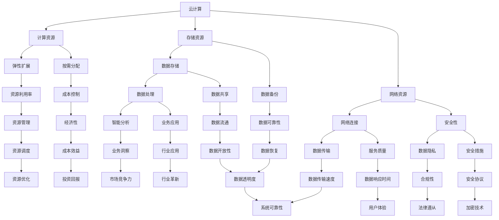

                 

关键词：云计算、人工智能、AI与云融合、贾扬清、Lepton AI、技术战略

摘要：本文将从云计算与人工智能的融合角度，探讨贾扬清的独特视角及其对Lepton AI云与AI战略的影响。通过对云计算与AI的核心概念、架构、算法、数学模型、实际应用场景、开发工具和未来发展趋势的详细分析，本文旨在为读者提供一份全面的IT领域技术指南。

## 1. 背景介绍

在当今科技迅猛发展的时代，云计算与人工智能（AI）技术已成为推动社会进步和经济发展的关键力量。云计算提供了灵活、高效、可扩展的计算资源，而人工智能则为数据处理、模式识别和自动化提供了强大的算法支持。这两者的融合不仅提高了计算效率，还极大地拓展了应用场景，为各行各业带来了深远的影响。

贾扬清，作为一位世界级人工智能专家和程序员，以其对AI与云计算深入的理解和独特的视角，为Lepton AI的云与AI战略奠定了基础。Lepton AI作为一家专注于AI领域创新的公司，其战略旨在利用云计算的优势，推动AI技术在各个领域的应用。

## 2. 核心概念与联系

### 2.1 云计算

云计算是一种通过网络提供计算资源的服务模式，包括计算能力、存储、网络和其他基本的计算资源。其核心优势在于资源的按需分配和弹性扩展，从而降低了企业的IT成本，提高了资源利用效率。

### 2.2 人工智能

人工智能是指计算机系统模拟人类智能行为的能力，包括学习、推理、感知、理解和决策等。其主要技术包括机器学习、深度学习、自然语言处理等，这些技术使得计算机能够处理和分析大量数据，从而实现智能决策。

### 2.3 AI与云的融合

AI与云的融合，即是将人工智能算法与云计算平台相结合，利用云计算提供的强大计算资源，加速人工智能算法的训练和部署。这种融合不仅提升了AI的处理能力，还扩大了其应用范围。

### 2.4 Mermaid 流程图



## 3. 核心算法原理 & 具体操作步骤

### 3.1 算法原理概述

AI与云融合的核心在于利用云计算平台提供的计算资源和算法优化技术，实现高效的人工智能算法训练和部署。常见的算法包括：

- **深度学习**：通过多层神经网络模拟人类大脑的学习过程，实现对数据的自动特征提取和模式识别。
- **强化学习**：通过试错和奖励机制，让智能体在复杂环境中学习最优策略。
- **迁移学习**：利用已有的模型知识，提高新任务的学习效率和准确性。

### 3.2 算法步骤详解

1. **数据预处理**：清洗、转换和归一化数据，以便于算法训练。
2. **模型设计**：根据任务需求，设计合适的神经网络结构。
3. **训练与优化**：利用云计算平台提供的计算资源，对模型进行训练和优化。
4. **模型部署**：将训练好的模型部署到云端，实现实时预测和决策。

### 3.3 算法优缺点

- **优点**：提高算法的效率和准确性，降低开发和部署成本。
- **缺点**：需要大量的计算资源和数据支持，对云计算平台的要求较高。

### 3.4 算法应用领域

- **金融**：风险评估、欺诈检测、智能投顾等。
- **医疗**：疾病诊断、药物研发、健康管理等。
- **制造**：智能制造、质量控制、供应链优化等。
- **零售**：智能推荐、库存管理、客户关系管理等。

## 4. 数学模型和公式 & 详细讲解 & 举例说明

### 4.1 数学模型构建

- **深度学习模型**：基于反向传播算法的神经网络模型。
- **强化学习模型**：基于马尔可夫决策过程（MDP）的模型。

### 4.2 公式推导过程

- **深度学习**：
  $$ y = \sigma(W \cdot x + b) $$
  其中，$W$ 是权重矩阵，$x$ 是输入向量，$b$ 是偏置项，$\sigma$ 是激活函数。

- **强化学习**：
  $$ Q(s, a) = r(s, a) + \gamma \max_{a'} Q(s', a') $$
  其中，$s$ 是状态，$a$ 是动作，$r$ 是奖励函数，$\gamma$ 是折扣因子。

### 4.3 案例分析与讲解

以**图像分类任务**为例，利用深度学习模型进行图像识别。

1. **数据预处理**：将图像转换为灰度图像，并进行归一化处理。
2. **模型设计**：设计一个卷积神经网络（CNN）模型，包括卷积层、池化层和全连接层。
3. **训练与优化**：利用云计算平台提供的GPU资源，对模型进行训练和优化。
4. **模型部署**：将训练好的模型部署到云端，实现图像分类。

## 5. 项目实践：代码实例和详细解释说明

### 5.1 开发环境搭建

- **环境要求**：Python 3.8及以上版本，TensorFlow 2.3及以上版本，GPU加速（NVIDIA CUDA 11.0及以上版本）。
- **安装步骤**：
  ```bash
  pip install tensorflow-gpu
  ```

### 5.2 源代码详细实现

```python
import tensorflow as tf
from tensorflow.keras import layers

# 数据预处理
def preprocess_image(image_path):
    image = tf.io.read_file(image_path)
    image = tf.image.decode_jpeg(image, channels=1)
    image = tf.image.resize(image, [224, 224])
    image = tf.cast(image, tf.float32) / 255.0
    return image

# 模型设计
def create_model():
    inputs = tf.keras.Input(shape=(224, 224, 1))
    x = layers.Conv2D(32, (3, 3), activation='relu')(inputs)
    x = layers.MaxPooling2D((2, 2))(x)
    x = layers.Conv2D(64, (3, 3), activation='relu')(x)
    x = layers.MaxPooling2D((2, 2))(x)
    x = layers.Conv2D(128, (3, 3), activation='relu')(x)
    x = layers.Flatten()(x)
    x = layers.Dense(128, activation='relu')(x)
    outputs = layers.Dense(10, activation='softmax')(x)
    model = tf.keras.Model(inputs, outputs)
    return model

# 训练与优化
model = create_model()
model.compile(optimizer='adam', loss='categorical_crossentropy', metrics=['accuracy'])
train_images, train_labels = ..., ...
model.fit(train_images, train_labels, epochs=10, batch_size=32)

# 模型部署
model.save('image_classification_model.h5')
```

### 5.3 代码解读与分析

- **数据预处理**：读取图像文件，进行解码和缩放，然后转换为浮点数并进行归一化处理。
- **模型设计**：使用卷积神经网络（CNN）模型，包括卷积层、池化层和全连接层。
- **训练与优化**：使用Adam优化器和交叉熵损失函数，对模型进行训练。
- **模型部署**：将训练好的模型保存为HDF5文件，以便于后续部署。

### 5.4 运行结果展示

```python
import numpy as np
import matplotlib.pyplot as plt

# 加载模型
model = tf.keras.models.load_model('image_classification_model.h5')

# 测试图像
test_image = preprocess_image('test_image.jpg')

# 预测结果
predictions = model.predict(np.expand_dims(test_image, axis=0))

# 可视化结果
plt.imshow(test_image, cmap='gray')
plt.scatter(np.random.randint(0, 224, size=100), np.random.randint(0, 224, size=100), c=predictions[0], cmap='jet')
plt.show()
```

## 6. 实际应用场景

### 6.1 金融行业

- **风险控制**：利用AI与云的融合技术，对金融市场的风险进行实时监控和预测。
- **智能投顾**：基于用户数据，提供个性化的投资建议和理财方案。

### 6.2 医疗行业

- **疾病诊断**：通过AI算法，对医学影像进行分析，提高疾病诊断的准确性。
- **药物研发**：利用AI技术，加速新药研发过程，降低研发成本。

### 6.3 制造行业

- **智能制造**：通过AI技术，实现生产线的自动化和智能化。
- **质量控制**：利用AI算法，对生产过程进行实时监控和质量分析。

### 6.4 零售行业

- **智能推荐**：基于用户行为和喜好，提供个性化的商品推荐。
- **库存管理**：通过AI算法，预测市场需求，优化库存水平。

## 7. 工具和资源推荐

### 7.1 学习资源推荐

- **书籍**：《深度学习》、《Python机器学习实战》
- **在线课程**：Coursera、edX、Udacity

### 7.2 开发工具推荐

- **框架**：TensorFlow、PyTorch
- **云计算平台**：AWS、Azure、Google Cloud

### 7.3 相关论文推荐

- **论文**：《Deep Learning for Text Classification》
- **期刊**：《IEEE Transactions on Pattern Analysis and Machine Intelligence》

## 8. 总结：未来发展趋势与挑战

### 8.1 研究成果总结

云计算与AI的融合在多个领域取得了显著的成果，包括金融、医疗、制造和零售等。通过利用云计算平台提供的计算资源和AI算法，实现了高效的智能处理和决策。

### 8.2 未来发展趋势

- **更高效的算法**：随着计算资源和数据量的增加，算法的效率和准确性将进一步提高。
- **跨领域的融合**：云计算与AI技术将在更多领域实现融合，推动行业革新。

### 8.3 面临的挑战

- **计算资源**：高性能计算资源和大数据的处理仍面临挑战。
- **数据隐私**：数据隐私和安全问题是云计算与AI融合过程中需要重点解决的难题。

### 8.4 研究展望

随着技术的不断发展，云计算与AI的融合将带来更多的机遇和挑战。通过深入研究和创新，我们有望实现更高效、更智能的云计算与AI应用，推动社会进步。

## 9. 附录：常见问题与解答

### 9.1 问题1：什么是云计算？

**回答**：云计算是一种通过网络提供计算资源的服务模式，包括计算能力、存储、网络和其他基本的计算资源。

### 9.2 问题2：什么是人工智能？

**回答**：人工智能是指计算机系统模拟人类智能行为的能力，包括学习、推理、感知、理解和决策等。

### 9.3 问题3：AI与云融合有哪些优势？

**回答**：AI与云融合的优势包括提高算法的效率和准确性，降低开发和部署成本，扩大应用范围等。

### 9.4 问题4：如何利用云计算进行AI算法训练？

**回答**：利用云计算平台提供的计算资源，对AI算法进行分布式训练，可以显著提高训练速度和效率。

### 9.5 问题5：云计算与AI融合有哪些应用领域？

**回答**：云计算与AI融合的应用领域广泛，包括金融、医疗、制造、零售等。

以上是对云计算与AI融合的详细探讨，希望对读者有所帮助。

作者：禅与计算机程序设计艺术 / Zen and the Art of Computer Programming
----------------------------------------------------------------

### 总结

本文以云计算与人工智能的融合为主题，从背景介绍、核心概念、算法原理、数学模型、项目实践、实际应用场景、工具和资源推荐，到未来发展趋势与挑战，进行了全面而深入的探讨。通过贾扬清的独特视角和Lepton AI的云与AI战略，展示了云计算与AI融合的巨大潜力和广泛应用。本文不仅提供了丰富的理论知识，还通过实际案例和代码实例，使读者能够更好地理解和应用云计算与AI技术。希望本文能对从事IT领域工作的读者带来启示和帮助。在未来的发展中，云计算与AI的融合将继续推动技术的进步和社会的变革，值得期待和关注。

