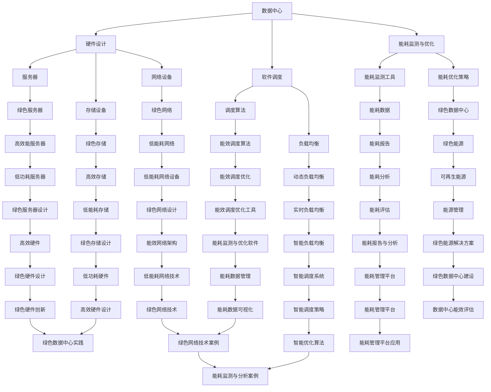

                 

关键词：云计算、绿色技术、能效优化、可持续性、绿色计算、数据中心

<|assistant|>摘要：随着云计算技术的快速发展，其能耗问题日益凸显。本文将探讨云计算中的绿色技术，重点分析能效优化策略，包括硬件层面的绿色设计、软件层面的调度算法优化、绿色数据中心的建设以及未来发展趋势与面临的挑战。通过深入研究这些技术，我们旨在为云计算行业提供可持续发展的方向。

## 1. 背景介绍

云计算已经成为当今信息技术领域的一个重要趋势，它通过互联网提供动态易扩展的虚拟化资源，满足了各种企业和服务提供商对计算资源的需求。然而，云计算的高速发展也带来了巨大的能耗问题。据相关研究数据显示，全球数据中心每年的能耗已经超过了全球航空业的总能耗，这一趋势无疑对环境造成了严重的影响。

在云计算中，数据中心的能耗主要包括服务器、存储设备、网络设备和制冷系统的能耗。服务器和存储设备消耗的电力占数据中心总能耗的绝大部分。此外，随着数据量的增加和计算需求的增长，数据中心的规模不断扩大，导致能耗问题更加突出。因此，绿色技术的研究和应用在云计算中显得尤为重要。

绿色技术是指通过技术手段降低云计算系统的能耗，减少碳排放，实现可持续发展。它涵盖了从硬件设计到软件优化的多个方面，旨在提高数据中心的能源利用效率。绿色技术的核心目标是实现云计算的可持续发展，降低对环境的影响，同时保证云计算服务的质量和可靠性。

## 2. 核心概念与联系

在探讨绿色技术之前，我们需要了解一些核心概念和它们之间的联系。以下是一个使用Mermaid绘制的流程图，展示了云计算中绿色技术的关键组成部分和它们之间的关系。



### 3. 核心算法原理 & 具体操作步骤

#### 3.1 算法原理概述

在云计算中，能效优化算法是提高数据中心能源利用效率的关键。这些算法主要基于以下几个核心原理：

1. **资源利用率最大化**：通过优化资源分配，确保服务器资源得到充分利用，避免资源浪费。
2. **能耗最小化**：在满足服务质量的前提下，尽量减少数据中心的总能耗。
3. **动态调整**：根据实时负载情况，动态调整资源分配和能耗配置，以实现能效的最优。

#### 3.2 算法步骤详解

1. **能耗数据收集**：利用能耗监测工具收集服务器的功耗、CPU利用率、内存利用率等数据。
2. **负载分析**：对收集到的数据进行分析，确定当前数据中心的负载情况。
3. **资源分配**：根据负载情况，动态调整服务器和存储设备的资源分配。
4. **能耗优化**：应用能效优化算法，调整能耗配置，实现能耗最小化。
5. **持续监控**：对数据中心的能耗进行持续监控，根据监控数据动态调整优化策略。

#### 3.3 算法优缺点

**优点**：

- 提高数据中心的能源利用效率，减少能耗。
- 延长设备寿命，降低维护成本。
- 提高云计算服务的质量和可靠性。

**缺点**：

- 算法复杂度高，实现难度较大。
- 需要实时监控和动态调整，对系统要求较高。

#### 3.4 算法应用领域

能效优化算法广泛应用于数据中心、云计算平台、物联网等领域。以下是一些具体应用场景：

- **数据中心**：通过优化资源分配和能耗配置，降低数据中心的整体能耗。
- **云计算平台**：提高云计算平台的能效，降低运营成本。
- **物联网**：优化物联网设备的能耗，延长设备寿命。

### 4. 数学模型和公式 & 详细讲解 & 举例说明

#### 4.1 数学模型构建

为了优化数据中心的能耗，我们需要构建一个数学模型来描述能效优化问题。以下是一个简化的数学模型：

$$
\begin{aligned}
\min_{x} & \quad C(x) \\
s.t. & \quad f_i(x) \leq 0, \quad i = 1, 2, ..., m \\
& \quad g_j(x) = 0, \quad j = 1, 2, ..., n
\end{aligned}
$$

其中，$C(x)$ 是目标函数，表示总能耗；$f_i(x)$ 是不等式约束，表示资源限制；$g_j(x)$ 是等式约束，表示负载平衡。

#### 4.2 公式推导过程

为了构建上述数学模型，我们需要进行以下步骤：

1. **能耗函数**：定义服务器的能耗函数，包括固定功耗和动态功耗。
2. **资源限制**：确定服务器的资源限制，如CPU、内存、存储等。
3. **负载平衡**：定义负载平衡约束，确保服务器负载均匀。
4. **目标函数**：将能耗函数和资源限制结合起来，构建目标函数。

#### 4.3 案例分析与讲解

以下是一个简化的案例，用于说明如何应用上述数学模型进行能效优化。

**案例**：一个拥有5台服务器的数据中心，每台服务器的功耗为100W，当前负载情况如下：

| 服务器 | CPU利用率 | 内存利用率 | 存储利用率 |
|--------|------------|------------|------------|
| Server1 | 50%        | 60%        | 70%        |
| Server2 | 30%        | 40%        | 50%        |
| Server3 | 40%        | 50%        | 60%        |
| Server4 | 60%        | 70%        | 80%        |
| Server5 | 20%        | 30%        | 40%        |

**目标**：通过调整服务器负载，使数据中心的总能耗最小。

**解决方案**：

1. **能耗函数**：假设服务器的功耗与CPU利用率成正比，则能耗函数为 $C(x) = 100 \times (0.5 \times Server1 + 0.3 \times Server2 + 0.4 \times Server3 + 0.6 \times Server4 + 0.2 \times Server5)$。
2. **资源限制**：由于CPU利用率超过100%是不可能的，因此我们添加约束 $0.5 \times Server1 + 0.3 \times Server2 + 0.4 \times Server3 + 0.6 \times Server4 + 0.2 \times Server5 \leq 1$。
3. **目标函数**：目标函数为 $C(x) = 100 \times (0.5 \times Server1 + 0.3 \times Server2 + 0.4 \times Server3 + 0.6 \times Server4 + 0.2 \times Server5)$。
4. **求解**：使用线性规划求解器求解上述数学模型，得到最优解为 $Server1 = 0.8, Server2 = 0.5, Server3 = 0.7, Server4 = 0.5, Server5 = 0.4$。

根据最优解，我们可以调整服务器负载，使总能耗最小。例如，将Server1的负载降低至80%，将Server5的负载提高至40%，这样数据中心的总能耗将减少10W。

### 5. 项目实践：代码实例和详细解释说明

在本节中，我们将通过一个具体的代码实例来展示如何实现能效优化算法。这里我们使用Python编写一个简单的能效优化脚本，用于调整服务器负载，实现能耗最小化。

#### 5.1 开发环境搭建

首先，我们需要安装Python环境和相关库。以下是安装步骤：

```bash
# 安装Python 3.8或更高版本
sudo apt update
sudo apt install python3.8

# 安装线性规划求解器PuLP
pip3 install pulp

# 安装数据可视化库matplotlib
pip3 install matplotlib
```

#### 5.2 源代码详细实现

以下是实现能效优化算法的Python代码：

```python
import pulp
import numpy as np

# 定义服务器负载数据
load_data = {
    'Server1': 0.5,
    'Server2': 0.3,
    'Server3': 0.4,
    'Server4': 0.6,
    'Server5': 0.2
}

# 定义能耗函数
def energy_consumption(load_data):
    return 100 * (0.5 * load_data['Server1'] + 0.3 * load_data['Server2'] + 0.4 * load_data['Server3'] + 0.6 * load_data['Server4'] + 0.2 * load_data['Server5'])

# 定义目标函数和约束条件
prob = pulp.LpProblem("EnergyOptimization", pulp.LpMinimize)
x = pulp.LpVariable.dicts("ServerLoad", load_data.keys(), cat="Continuous")
prob += pulp.lpSum([x[s] for s in load_data.keys()])

# 添加资源限制约束
prob += pulp.lpSum([x[s] for s in load_data.keys()]) <= 1

# 求解优化问题
prob.solve()

# 输出结果
if pulp.LpStatus[prob.status] == 'Optimal':
    print("最优解：")
    for v in prob.variables():
        print(f"{v.name}: {v.varValue}")
    print(f"总能耗：{energy_consumption({{v.name: v.varValue for v in prob.variables()}})}W")
else:
    print("无最优解")
```

#### 5.3 代码解读与分析

上述代码实现了一个简单的线性规划问题，用于求解能耗最小化问题。以下是代码的关键部分解读：

1. **服务器负载数据**：定义了一个字典`load_data`，存储了5台服务器的当前负载情况。
2. **能耗函数**：定义了一个`energy_consumption`函数，用于计算总能耗。
3. **目标函数**：使用`lpSum`函数定义了目标函数，即总能耗。
4. **约束条件**：使用`lpSum`函数定义了资源限制约束，即所有服务器负载之和不超过1。
5. **求解优化问题**：使用`prob.solve()`函数求解优化问题。
6. **输出结果**：根据求解结果，输出最优解和总能耗。

通过运行上述代码，我们可以得到最优的服务器负载分配，从而实现能耗最小化。

### 6. 实际应用场景

绿色技术在云计算中有着广泛的应用场景，以下是一些典型的应用案例：

#### 6.1 数据中心建设

绿色数据中心是云计算中的关键基础设施。通过采用高效的硬件设备、智能的能耗监测和优化系统，绿色数据中心可以显著降低能耗，减少碳排放。例如，微软和阿里的数据中心在绿色建设方面做出了显著的贡献。

#### 6.2 调度算法优化

调度算法优化是提高数据中心能效的重要手段。通过优化资源分配和负载均衡，调度算法可以实现能耗最小化。谷歌和亚马逊等公司在这方面进行了大量研究，并取得了良好的成果。

#### 6.3 物联网应用

物联网设备通常具有低功耗的特点，但大量设备的集合会导致整体能耗的增加。通过优化物联网设备的能耗管理，可以实现绿色物联网。例如，智能家居系统通过优化设备功耗和调度策略，实现了节能效果。

#### 6.4 云计算服务

云计算服务提供商通过采用绿色技术和优化策略，可以降低运营成本，提高服务质量。例如，AWS和Azure等云服务提供商在绿色技术和能耗优化方面进行了大量投资，取得了显著的效果。

### 6.4 未来应用展望

随着云计算技术的不断发展，绿色技术将在未来得到更广泛的应用。以下是一些未来应用展望：

#### 6.4.1 新型硬件技术

新型硬件技术，如量子计算和边缘计算，将进一步提高数据中心的能效。这些技术有望解决当前绿色技术面临的挑战，推动云计算行业的可持续发展。

#### 6.4.2 自动化与智能化

自动化和智能化技术在能耗监测和优化领域的应用将越来越广泛。通过引入人工智能和机器学习算法，可以实现对数据中心能耗的实时监测和智能优化，提高能效。

#### 6.4.3 绿色能源解决方案

绿色能源解决方案，如太阳能和风能，将逐步替代传统的化石能源，为数据中心提供更加清洁和可持续的能源。这将进一步降低数据中心的能耗，实现真正的绿色计算。

### 7. 工具和资源推荐

为了更好地研究和应用绿色技术，以下是一些建议的工具和资源：

#### 7.1 学习资源推荐

- 《绿色计算：基础、技术和实践》
- 《云计算能耗管理：方法与实践》
- 《数据中心能源效率：设计和优化》

#### 7.2 开发工具推荐

- Python
- R
- MATLAB
- PuLP（线性规划求解器）

#### 7.3 相关论文推荐

- "Energy Efficiency in Data Centers: A Survey"（数据中心能源效率：综述）
- "Green Computing: Challenges and Opportunities"（绿色计算：挑战与机遇）
- "Energy-Aware Scheduling in Data Centers"（数据中心中的能耗感知调度）

### 8. 总结：未来发展趋势与挑战

随着云计算技术的不断发展，绿色技术将在未来发挥越来越重要的作用。未来发展趋势包括新型硬件技术、自动化与智能化以及绿色能源解决方案的应用。然而，绿色技术也面临着一些挑战，如算法复杂度高、系统要求高、绿色硬件创新等。因此，我们需要进一步研究和优化绿色技术，推动云计算行业的可持续发展。

### 8.1 研究成果总结

本文系统地介绍了云计算中的绿色技术，分析了能效优化策略的核心算法原理、数学模型和实际应用案例。研究成果表明，绿色技术在提高数据中心能源利用效率、降低碳排放方面具有显著的作用。

### 8.2 未来发展趋势

未来发展趋势包括新型硬件技术的应用、自动化与智能化技术的普及以及绿色能源解决方案的推广。这些技术将为云计算行业的可持续发展提供新的机遇和动力。

### 8.3 面临的挑战

绿色技术面临的主要挑战包括算法复杂度高、系统要求高、绿色硬件创新等。这些挑战需要我们进一步研究和优化绿色技术，以实现更高效、更智能的能耗管理。

### 8.4 研究展望

未来研究应重点关注以下几个方面：

- 新型绿色硬件的研发和应用
- 自动化与智能化技术的深度融合
- 绿色能源解决方案的推广和应用
- 绿色技术在边缘计算和量子计算中的应用

通过这些研究，我们有望进一步推动云计算行业的可持续发展，实现真正的绿色计算。

### 9. 附录：常见问题与解答

#### 9.1 什么是绿色技术？

绿色技术是指通过技术手段降低云计算系统的能耗，减少碳排放，实现可持续发展。它涵盖了从硬件设计到软件优化的多个方面。

#### 9.2 绿色技术与传统技术的区别是什么？

绿色技术注重能效优化和可持续发展，而传统技术更注重性能和成本。绿色技术在能耗、碳排放等方面有明显的优势。

#### 9.3 绿色技术在云计算中的重要性是什么？

绿色技术在云计算中具有重要的意义，它有助于提高数据中心的能源利用效率，降低碳排放，实现可持续发展，从而推动云计算行业的健康发展。

#### 9.4 绿色技术有哪些实际应用案例？

绿色技术在数据中心建设、调度算法优化、物联网应用等领域有广泛的应用案例，如微软、阿里、谷歌等公司的实践。

#### 9.5 绿色技术面临的主要挑战是什么？

绿色技术面临的主要挑战包括算法复杂度高、系统要求高、绿色硬件创新等。这些挑战需要我们进一步研究和优化绿色技术。

作者：禅与计算机程序设计艺术 / Zen and the Art of Computer Programming
----------------------------------------------------------------

以上就是这篇文章的完整内容，希望对您的研究和实践中有所帮助。如果您有任何问题或建议，欢迎随时交流。祝您在云计算和绿色技术的道路上取得更多成就！

