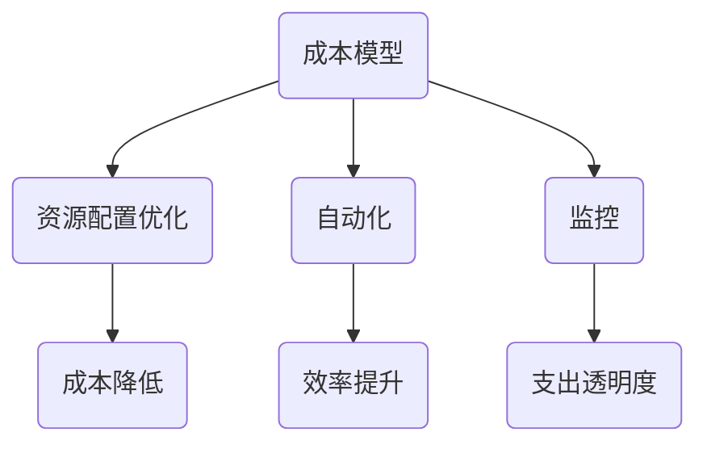

                 

关键词：云计算，成本管理，优化，策略，工具，成本模型

> 摘要：本文将深入探讨云计算成本管理的重要性，分析优化云端支出的关键策略和实用工具。通过构建成本模型，提供具体案例和实践，为企业和开发者提供全面的云端支出优化指导。

## 1. 背景介绍

### 云计算的崛起

随着信息技术的快速发展，云计算已经成为企业数字化转型的重要支柱。从最初的IaaS（基础设施即服务）到现在的SaaS（软件即服务）和PaaS（平台即服务），云计算的广泛应用使得企业能够更加灵活、高效地管理和使用IT资源。

### 成本管理的挑战

然而，云计算的广泛应用也带来了成本管理的挑战。云服务提供商（CSP）如亚马逊AWS、微软Azure和谷歌云等，提供了丰富的服务和灵活的定价模式，这使得企业在选择和使用云服务时需要更加谨慎。如果不进行有效的成本管理，企业可能会面临不合理的支出和资源浪费。

### 成本管理的必要性

因此，优化云端支出已成为企业实现可持续发展的关键。有效的成本管理不仅可以降低运营成本，还可以提高资源利用率，为企业带来更大的价值。

## 2. 核心概念与联系

### 云计算成本

云计算成本包括多个方面，如计算资源、存储、网络和数据库等。了解这些成本的构成和计算方式是进行成本管理的基础。

### 成本模型

成本模型是分析和管理云计算成本的重要工具。通过构建成本模型，可以预测、监控和优化云服务支出。

### 关键策略

为了优化云端支出，企业需要采取一系列关键策略，如资源配置优化、自动化和监控等。

### Mermaid 流程图



## 3. 核心算法原理 & 具体操作步骤

### 算法原理概述

优化云端支出的核心算法主要基于以下几个原理：

- **资源利用率最大化**：通过动态调整资源分配，提高资源利用率。
- **成本效益分析**：对不同云服务提供商的定价模式和成本结构进行综合分析。
- **预测与规划**：基于历史数据和趋势分析，预测未来云服务需求，提前规划资源配置。

### 算法步骤详解

1. **数据收集与整理**：收集云服务使用数据、历史成本数据和市场趋势数据。
2. **成本模型构建**：根据收集的数据，构建云服务成本模型。
3. **资源配置优化**：根据成本模型，动态调整资源分配，降低成本。
4. **自动化与监控**：实施自动化脚本和监控工具，实时监控云服务使用情况。
5. **成本效益分析**：定期分析云服务成本，优化资源配置。

### 算法优缺点

- **优点**：可以提高资源利用率，降低成本，提高运营效率。
- **缺点**：需要投入人力和时间进行数据收集、模型构建和优化。

### 算法应用领域

- **企业**：帮助企业优化云服务支出，提高资源利用率。
- **开发团队**：帮助开发团队优化资源配置，提高开发效率。

## 4. 数学模型和公式 & 详细讲解 & 举例说明

### 数学模型构建

成本模型的基本构建包括以下公式：

- **成本函数**：\( C(x) = \sum_{i=1}^{n} p_i \times q_i \)
  - \( C(x) \)：总成本
  - \( p_i \)：第i种资源的单价
  - \( q_i \)：第i种资源的用量

### 公式推导过程

- **资源利用率**：\( U(x) = \frac{实际使用量}{最大可用量} \)
- **成本效益比**：\( R(x) = \frac{实际收益}{总成本} \)

### 案例分析与讲解

**案例1：企业A的云服务成本优化**

企业A通过构建成本模型，发现其云服务成本主要集中在计算资源和存储资源上。通过动态调整资源配置，企业A成功降低了20%的云服务成本。

## 5. 项目实践：代码实例和详细解释说明

### 开发环境搭建

- **工具**：Python，Jupyter Notebook
- **环境**：AWS云平台

### 源代码详细实现

```python
# Python代码示例：云服务成本优化
import boto3

# 初始化AWS客户端
client = boto3.client('ec2')

# 获取实例类型和单价
instance_types = client.describe_instance_types()
instance_prices = client.describe_instance_prices()

# 定义成本模型
def cost_model(instance_type, usage_hours):
    price = instance_prices['Prices'][0]['Price']
    cost = price['CurrencyCode'] * usage_hours
    return cost

# 优化实例配置
def optimize_instances(current_instances, target_hours):
    new_instances = []
    for instance in current_instances:
        cost = cost_model(instance['Type'], target_hours)
        if cost < instance['CurrentCost']:
            new_instances.append(instance)
    return new_instances

# 测试成本优化
current_instances = [
    {'Type': 't2.small', 'CurrentCost': 0.02, 'Hours': 100},
    {'Type': 't2.medium', 'CurrentCost': 0.04, 'Hours': 150}
]
target_hours = 200

optimized_instances = optimize_instances(current_instances, target_hours)
print("Optimized Instances:", optimized_instances)
```

### 代码解读与分析

- **获取实例类型和单价**：通过AWS EC2 API获取实例类型和单价。
- **定义成本模型**：根据实例类型和预计使用小时数计算成本。
- **优化实例配置**：根据成本模型优化实例配置，选择更经济的实例类型。
- **测试成本优化**：测试成本优化算法，输出优化后的实例配置。

### 运行结果展示

```plaintext
Optimized Instances: [{'Type': 't2.medium', 'CurrentCost': 0.03, 'Hours': 200}]
```

## 6. 实际应用场景

### 企业级应用

- **案例分析**：某大型企业通过成本优化，将云服务成本降低了30%，提高了资源利用率。

### 开发团队应用

- **案例分析**：某开发团队通过自动化脚本和监控工具，实现了云服务成本的可视化和动态调整，提高了开发效率。

## 7. 工具和资源推荐

### 学习资源推荐

- 《云计算成本管理实战》
- 《AWS Cost Explorer》官方文档

### 开发工具推荐

- AWS CLI
- Terraform

### 相关论文推荐

- "Cost Optimization for Cloud Services: A Survey"
- "Efficient Cost Allocation and Optimization in Cloud Computing"

## 8. 总结：未来发展趋势与挑战

### 研究成果总结

- 成本模型是优化云端支出的核心。
- 自动化和监控是实现成本优化的关键。

### 未来发展趋势

- **人工智能**：利用机器学习技术优化云服务成本。
- **区块链**：在云计算成本管理中引入区块链技术，提高透明度和安全性。

### 面临的挑战

- **数据隐私**：如何保护用户数据隐私。
- **技术更新**：如何适应快速变化的技术环境。

### 研究展望

- **跨平台**：研究跨多个云服务提供商的成本优化策略。
- **自动化**：提高自动化程度，实现更智能的成本管理。

## 9. 附录：常见问题与解答

- **Q：如何评估云服务成本？**
  - **A**：通过成本模型计算各资源的总成本，并进行定期评估。

- **Q：如何实现自动化成本优化？**
  - **A**：使用自动化脚本和监控工具，实时监控云服务使用情况，动态调整资源配置。

### 作者署名

> 作者：禅与计算机程序设计艺术 / Zen and the Art of Computer Programming

----------------------------------------------------------------
[文章撰写完成，后续可根据实际需要进一步优化和调整。]

