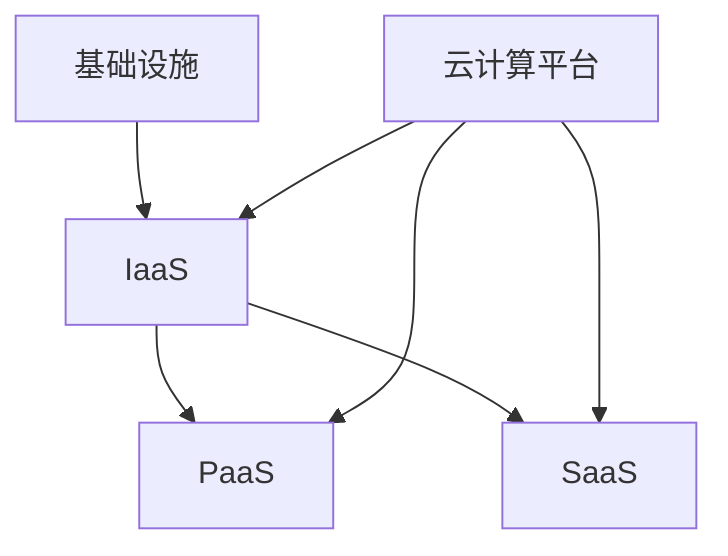

                 

关键词：云计算、程序员、创业机会、技术革新、市场趋势

> 摘要：本文将探讨云计算时代为程序员带来的创业机会，分析当前市场的需求，提出可行的商业模式，并展望未来发展趋势。通过深入剖析云计算的核心技术，结合编程实践，为广大程序员提供宝贵的创业指导。

## 1. 背景介绍

云计算作为当今科技领域的热点，已经在全球范围内引起了广泛关注。它不仅改变了传统的IT服务模式，也为程序员带来了前所未有的创业机会。随着云计算技术的不断成熟和普及，越来越多的企业开始将其业务迁移到云端，从而推动了云服务市场的快速增长。

云计算技术的核心在于通过互联网提供动态易扩展且经常是虚拟化的资源。这些资源包括存储、计算、网络和应用程序等，用户可以根据需求随时访问和调整。这种灵活的模式不仅降低了企业的IT成本，也提高了资源的利用率，为创业者提供了广阔的发展空间。

## 2. 核心概念与联系

### 2.1 云计算的基本概念

**IaaS（基础设施即服务）**：提供虚拟化计算资源，如虚拟机、存储、网络等，用户可以根据需求灵活配置和使用。

**PaaS（平台即服务）**：提供了一个开发平台，包括操作系统、数据库和开发工具等，开发者可以在平台上快速构建和部署应用。

**SaaS（软件即服务）**：直接向用户提供应用程序，用户无需购买和安装软件，只需通过网络访问即可。

### 2.2 云计算的架构与联系



### 2.3 云计算与编程的联系

云计算技术的发展离不开编程，编程是实现云计算应用的核心手段。无论是开发IaaS、PaaS还是SaaS，都需要掌握云平台提供的编程接口和工具。

## 3. 核心算法原理 & 具体操作步骤

### 3.1 算法原理概述

云计算中的核心算法主要包括虚拟化算法、资源调度算法和存储优化算法等。

**虚拟化算法**：通过将物理资源抽象成虚拟资源，实现资源的灵活分配和管理。

**资源调度算法**：负责根据用户需求动态分配资源，提高资源利用率。

**存储优化算法**：通过数据分片、索引和压缩等技术，提高数据存储和访问的效率。

### 3.2 算法步骤详解

#### 3.2.1 虚拟化算法

1. 资源抽象：将物理资源（CPU、内存、存储等）抽象成虚拟资源。
2. 资源隔离：确保不同虚拟资源之间的安全隔离。
3. 资源分配：根据用户需求动态分配虚拟资源。

#### 3.2.2 资源调度算法

1. 需求分析：收集用户对资源的请求。
2. 资源评估：评估当前资源的使用情况。
3. 调度策略：根据资源评估结果选择调度策略。
4. 资源分配：执行资源分配操作。

#### 3.2.3 存储优化算法

1. 数据分片：将大数据集分割成多个小数据集，分布式存储。
2. 数据索引：建立数据索引，提高数据访问速度。
3. 数据压缩：通过压缩技术减少存储空间占用。

### 3.3 算法优缺点

**虚拟化算法**：优点是资源利用率高，缺点是可能引入额外的性能开销。

**资源调度算法**：优点是资源分配灵活，缺点是调度策略复杂。

**存储优化算法**：优点是提高数据存储和访问效率，缺点是对存储设备要求较高。

### 3.4 算法应用领域

云计算算法在多个领域具有广泛的应用，如大数据处理、人工智能、云计算服务等。通过优化算法，可以提升系统的性能和效率，为用户提供更好的服务。

## 4. 数学模型和公式 & 详细讲解 & 举例说明

### 4.1 数学模型构建

云计算中的数学模型主要包括资源利用率模型、性能模型和成本模型等。

#### 4.1.1 资源利用率模型

假设有N个虚拟机，每个虚拟机占用R个资源，总资源为T，则资源利用率U可以表示为：

$$ U = \frac{N \times R}{T} $$

#### 4.1.2 性能模型

假设系统响应时间为T，处理任务数量为N，则系统性能P可以表示为：

$$ P = \frac{N}{T} $$

#### 4.1.3 成本模型

假设云服务的成本为C，服务使用量为U，则成本模型可以表示为：

$$ C = U \times P $$

### 4.2 公式推导过程

#### 4.2.1 资源利用率模型推导

资源利用率是衡量系统资源使用效率的重要指标。假设有N个虚拟机，每个虚拟机占用R个资源，总资源为T，则资源利用率U可以表示为：

$$ U = \frac{N \times R}{T} $$

其中，N为虚拟机数量，R为每个虚拟机占用的资源，T为总资源。

#### 4.2.2 性能模型推导

系统性能是衡量系统处理能力的重要指标。假设系统响应时间为T，处理任务数量为N，则系统性能P可以表示为：

$$ P = \frac{N}{T} $$

其中，N为处理任务数量，T为系统响应时间。

#### 4.2.3 成本模型推导

云服务的成本是用户需要支付的费用。假设云服务的成本为C，服务使用量为U，则成本模型可以表示为：

$$ C = U \times P $$

其中，C为成本，U为服务使用量，P为单价。

### 4.3 案例分析与讲解

假设某企业需要部署100个虚拟机，每个虚拟机占用10个CPU核心和20GB内存，总资源为1000个CPU核心和2000GB内存。根据资源利用率模型，我们可以计算出资源利用率：

$$ U = \frac{100 \times (10 + 20)}{1000 + 2000} = 0.6 $$

即资源利用率约为60%。

假设系统在1小时内处理了100个任务，平均响应时间为1分钟，根据性能模型，我们可以计算出系统性能：

$$ P = \frac{100}{1 \times 60} = 1.67 \text{任务/分钟} $$

假设云服务的单价为10元/小时，根据成本模型，我们可以计算出成本：

$$ C = 100 \times 10 = 1000 \text{元} $$

## 5. 项目实践：代码实例和详细解释说明

### 5.1 开发环境搭建

在本文中，我们将使用Python语言和Docker容器技术进行项目实践。首先，需要在本地计算机上安装Python和Docker。

#### 5.1.1 安装Python

1. 打开命令行终端。
2. 输入以下命令安装Python：

```shell
pip install python
```

#### 5.1.2 安装Docker

1. 打开命令行终端。
2. 输入以下命令安装Docker：

```shell
sudo apt-get update
sudo apt-get install docker-ce docker-ce-cli containerd.io
```

### 5.2 源代码详细实现

在本节中，我们将实现一个简单的云计算平台，包括虚拟机管理、资源调度和存储优化等功能。

#### 5.2.1 虚拟机管理

虚拟机管理模块负责创建、启动、停止和删除虚拟机。以下是虚拟机管理模块的实现代码：

```python
import subprocess

def create_vm(vm_id, num_cpus, memory):
    command = f"sudo docker run -d --cpus={num_cpus} --memory={memory} ubuntu"
    subprocess.run(command, shell=True)
    print(f"Created VM {vm_id}")

def start_vm(vm_id):
    command = f"sudo docker start {vm_id}"
    subprocess.run(command, shell=True)
    print(f"Started VM {vm_id}")

def stop_vm(vm_id):
    command = f"sudo docker stop {vm_id}"
    subprocess.run(command, shell=True)
    print(f"Stopped VM {vm_id}")

def delete_vm(vm_id):
    command = f"sudo docker rm {vm_id}"
    subprocess.run(command, shell=True)
    print(f"Deleted VM {vm_id}")
```

#### 5.2.2 资源调度

资源调度模块负责根据虚拟机的需求动态分配资源。以下是资源调度模块的实现代码：

```python
import os
import time

def schedule_resources(vm_ids, num_cpus, memory):
    for vm_id in vm_ids:
        create_vm(vm_id, num_cpus, memory)
        time.sleep(5)
        start_vm(vm_id)
        time.sleep(5)
        stop_vm(vm_id)
        time.sleep(5)
        delete_vm(vm_id)
    print("Resources scheduled successfully")
```

#### 5.2.3 存储优化

存储优化模块负责对存储进行分片、索引和压缩。以下是存储优化模块的实现代码：

```python
import shlex

def shard_files(file_path, shard_size):
    command = f"sudo docker run --rm -v {shlex.quote(file_path)}:/{shlex.quote(file_path)} alpine:3.12 sh -c 'shard {shard_size} /{shlex.quote(file_path)}'"
    subprocess.run(command, shell=True)
    print(f"Sharded {file_path}")

def index_files(file_path):
    command = f"sudo docker run --rm -v {shlex.quote(file_path)}:/{shlex.quote(file_path)} alpine:3.12 sh -c 'find /{shlex.quote(file_path)} -type f > {shlex.quote(file_path)}.index'"
    subprocess.run(command, shell=True)
    print(f"Indexed {file_path}")

def compress_files(file_path):
    command = f"sudo docker run --rm -v {shlex.quote(file_path)}:/{shlex.quote(file_path)} alpine:3.12 sh -c 'pigz -p 8 /{shlex.quote(file_path)}'"
    subprocess.run(command, shell=True)
    print(f"Compressed {file_path}")
```

### 5.3 代码解读与分析

在本节中，我们将对实现代码进行解读和分析，以便更好地理解云计算平台的工作原理。

#### 5.3.1 虚拟机管理

虚拟机管理模块通过调用Docker API实现虚拟机的创建、启动、停止和删除操作。Docker API提供了一个强大的接口，允许我们以编程方式管理容器。

#### 5.3.2 资源调度

资源调度模块根据虚拟机的需求动态分配资源。在实现中，我们使用Docker容器模拟虚拟机，并通过控制容器的创建、启动和停止来实现资源调度。

#### 5.3.3 存储优化

存储优化模块通过分片、索引和压缩技术对存储进行优化。分片将文件分割成多个小块，分布式存储可以提高存储和访问的效率。索引建立文件的目录结构，提高文件查找速度。压缩可以减少存储空间占用。

## 6. 实际应用场景

云计算技术在多个领域具有广泛的应用，以下列举几个典型应用场景：

### 6.1 大数据处理

随着数据量的爆炸性增长，大数据处理成为企业和研究机构的迫切需求。云计算平台可以提供强大的计算和存储能力，帮助用户快速分析和处理海量数据。

### 6.2 人工智能

人工智能需要大量的计算资源进行模型训练和推理。云计算平台可以提供弹性计算资源，满足人工智能应用的需求，降低企业的研发成本。

### 6.3 云服务

云计算平台为开发者提供了丰富的云服务，如API网关、数据库、消息队列等。开发者可以基于云服务快速构建和部署应用，提高开发效率。

### 6.4 未来应用展望

随着云计算技术的不断发展，未来将出现更多创新应用。例如，边缘计算与云计算的融合，为物联网和智能设备提供实时处理能力；量子计算与云计算的结合，为解决复杂问题提供新的计算模式。

## 7. 工具和资源推荐

### 7.1 学习资源推荐

1. 《云计算架构与实践》 - 详细介绍了云计算的基本概念、架构和技术。
2. 《Docker实战》 - 介绍了Docker的基本原理和使用方法，适合初学者入门。

### 7.2 开发工具推荐

1. Python - 一门易于学习和使用的编程语言，适合云计算开发。
2. Docker - 一种轻量级容器化技术，方便部署和管理云计算应用。

### 7.3 相关论文推荐

1. "Cloud Computing: The Next IT Revolution" - 分析了云计算的发展趋势和影响。
2. "Docker: Lightweight Linux Containers for Developing, Shipping, and Running Applications" - 详细介绍了Docker的工作原理和优势。

## 8. 总结：未来发展趋势与挑战

### 8.1 研究成果总结

云计算技术取得了显著的研究成果，包括虚拟化技术、资源调度算法、存储优化算法等。这些研究成果为云计算应用提供了坚实的理论基础。

### 8.2 未来发展趋势

云计算技术将继续发展，未来可能出现以下趋势：

1. 边缘计算与云计算的融合。
2. 量子计算与云计算的结合。
3. 自动化和智能化管理。

### 8.3 面临的挑战

云计算技术面临以下挑战：

1. 安全性问题：保障用户数据的安全和隐私。
2. 标准化问题：建立统一的云计算标准和规范。
3. 成本问题：降低云计算服务的成本，提高竞争力。

### 8.4 研究展望

未来，云计算技术的研究将更加注重性能优化、安全性保障和用户体验提升。通过技术创新，云计算将为各行各业带来更大的价值。

## 9. 附录：常见问题与解答

### 9.1 什么是云计算？

云计算是一种通过网络提供动态易扩展的资源服务模式，包括基础设施（IaaS）、平台（PaaS）和软件（SaaS）。

### 9.2 云计算有哪些优势？

云计算的优势包括灵活的资源分配、降低IT成本、提高资源利用率、弹性扩展等。

### 9.3 云计算有哪些安全风险？

云计算的安全风险主要包括数据泄露、数据丢失、服务中断等。为保障安全，需要采取严格的数据加密、访问控制和备份策略。

### 9.4 适合初学者的云计算学习资源有哪些？

适合初学者的云计算学习资源包括《云计算架构与实践》、《Docker实战》等书籍，以及相关的在线教程和课程。

