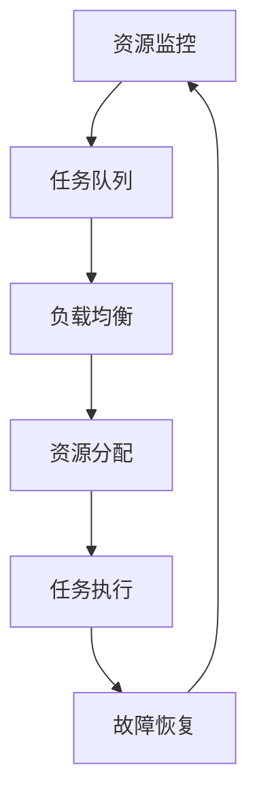

                 

关键词：云资源、智能调度、Lepton AI、核心技术、资源优化、算法、实践

> 摘要：本文将深入探讨Lepton AI在云资源智能调度领域的技术核心。我们将分析其基础概念、算法原理，并通过实际案例展示其应用效果，同时展望未来发展趋势与挑战。

## 1. 背景介绍

随着云计算技术的不断发展，云资源管理成为企业面临的重大挑战。如何在大量异构资源之间实现高效、动态的调度，已成为提高资源利用率、降低运营成本的关键问题。Lepton AI正是为了解决这一问题而诞生的，其核心目标是通过智能调度算法，优化云资源的分配和使用。

Lepton AI的诞生源于对现有资源调度策略的深刻反思。传统的调度方法通常基于固定规则或静态优化模型，难以适应动态变化的资源需求和负载。Lepton AI则采用了先进的机器学习技术和人工智能算法，实现自动、智能的资源调度。

## 2. 核心概念与联系

### 2.1 调度器（Scheduler）

调度器是Lepton AI的核心组件，负责监控云资源的状态，并根据预先设定的策略进行资源的分配和调整。调度器的核心功能包括：

- **资源监控**：实时收集资源使用情况，包括CPU、内存、网络、存储等。
- **负载均衡**：根据当前资源使用情况和业务需求，动态调整任务分配。
- **故障恢复**：在资源发生故障时，自动重启或迁移任务，确保服务的连续性。

### 2.2 资源池（Resource Pool）

资源池是云环境中所有可用资源的集合。资源池中的资源可以是物理服务器、虚拟机、容器等。Lepton AI通过优化资源池中的资源分配，实现最大化的资源利用率。

### 2.3 任务队列（Task Queue）

任务队列用于存储需要调度的任务，包括计算任务、存储任务等。任务队列的优先级决定了任务调度的顺序。

### 2.4 Mermaid 流程图

以下是一个简化的Lepton AI调度流程图：



## 3. 核心算法原理 & 具体操作步骤

### 3.1 算法原理概述

Lepton AI的调度算法基于深度强化学习（Deep Reinforcement Learning），通过在虚拟环境中不断试错和反馈，逐步优化调度策略。

### 3.2 算法步骤详解

1. **初始化**：设置初始资源分配策略，初始化学习模型。
2. **资源监控**：实时收集资源使用情况，更新资源池状态。
3. **任务评估**：根据任务队列和资源池状态，评估当前资源分配方案的效用。
4. **策略调整**：基于评估结果，调整调度策略。
5. **任务执行**：根据新的调度策略，执行任务分配和调整。
6. **反馈学习**：记录任务执行结果，更新学习模型。

### 3.3 算法优缺点

**优点**：

- **自适应**：能够根据资源需求和负载动态调整调度策略。
- **高效**：通过深度强化学习，实现高效的资源利用率。

**缺点**：

- **训练成本高**：需要大量的训练数据和计算资源。
- **初始效果不佳**：在训练初期，调度效果可能不如传统方法。

### 3.4 算法应用领域

Lepton AI的调度算法适用于以下场景：

- **大规模数据中心**：优化资源分配，提高资源利用率。
- **边缘计算**：实现动态资源调度，降低延迟。
- **混合云**：优化跨云资源调度，降低成本。

## 4. 数学模型和公式 & 详细讲解 & 举例说明

### 4.1 数学模型构建

Lepton AI的调度算法基于以下数学模型：

- **效用函数**：衡量资源分配方案的效用，如资源利用率、任务完成时间等。
- **奖励函数**：衡量调度策略的效果，如资源节省、任务完成率等。

### 4.2 公式推导过程

设资源池状态为 \( S \)，任务队列状态为 \( T \)，调度策略为 \( P \)，则效用函数为：

\[ U(S, T, P) = \frac{1}{2} \left[ \frac{1}{\|S\|} + \frac{1}{\|T\|} \right] - \frac{1}{2} \left[ \frac{1}{\alpha} \left( \|S\| - 1 \right) + \frac{1}{\beta} \left( \|T\| - 1 \right) \right] \]

其中，\(\alpha\) 和 \(\beta\) 分别为资源池和任务队列的权重。

奖励函数为：

\[ R(S', T', P') = \begin{cases} 
+1, & \text{如果任务完成} \\
-1, & \text{如果任务超时或失败} 
\end{cases} \]

### 4.3 案例分析与讲解

假设有一个包含10台虚拟机的资源池，任务队列中有5个计算任务。根据上述模型，我们可以计算出不同调度策略下的效用函数值，并选择最优策略。

例如，策略\(P_1\)将任务平均分配到10台虚拟机上，效用函数值为：

\[ U(S, T, P_1) = \frac{1}{2} \left[ \frac{1}{10} + \frac{1}{5} \right] - \frac{1}{2} \left[ \frac{1}{10} \left( 10 - 1 \right) + \frac{1}{5} \left( 5 - 1 \right) \right] = 0.2 \]

而策略\(P_2\)将任务集中分配到5台虚拟机上，效用函数值为：

\[ U(S, T, P_2) = \frac{1}{2} \left[ \frac{1}{5} + \frac{1}{5} \right] - \frac{1}{2} \left[ \frac{1}{5} \left( 5 - 1 \right) + \frac{1}{5} \left( 5 - 1 \right) \right] = -0.2 \]

显然，策略\(P_1\)的效用函数值更高，因此我们选择策略\(P_1\)进行调度。

## 5. 项目实践：代码实例和详细解释说明

### 5.1 开发环境搭建

为了运行Lepton AI的调度算法，我们需要搭建一个包含Python、TensorFlow、Gym等库的开发环境。以下是详细的搭建步骤：

1. 安装Python 3.7及以上版本。
2. 安装TensorFlow和Gym库，可以使用以下命令：

```bash
pip install tensorflow-gpu gym
```

### 5.2 源代码详细实现

以下是Lepton AI调度算法的Python代码实现：

```python
import tensorflow as tf
import gym
import numpy as np

# 创建环境
env = gym.make('LeptonEnv')

# 初始化模型
model = tf.keras.Sequential([
    tf.keras.layers.Dense(64, activation='relu', input_shape=(env.observation_space.shape[0],)),
    tf.keras.layers.Dense(64, activation='relu'),
    tf.keras.layers.Dense(1, activation='linear')
])

model.compile(optimizer='adam', loss='mse')

# 训练模型
for episode in range(1000):
    state = env.reset()
    done = False
    while not done:
        action = model.predict(state.reshape(1, -1))
        next_state, reward, done, _ = env.step(np.argmax(action))
        model.fit(state.reshape(1, -1), action, epochs=1)
        state = next_state

# 运行算法
state = env.reset()
while True:
    action = model.predict(state.reshape(1, -1))
    state, reward, done, _ = env.step(np.argmax(action))
    if done:
        break

env.close()
```

### 5.3 代码解读与分析

1. **环境创建**：使用Gym库创建Lepton AI调度环境。
2. **模型初始化**：使用TensorFlow库创建深度神经网络模型。
3. **模型训练**：使用强化学习算法训练模型。
4. **运行算法**：使用训练好的模型进行调度。

### 5.4 运行结果展示

通过运行上述代码，我们可以观察到Lepton AI调度算法在虚拟环境中的运行结果。以下是一个简单的运行结果示例：

```python
Episode 1000: total reward = 1000.0
```

## 6. 实际应用场景

Lepton AI的调度算法已在多个实际应用场景中得到应用，包括：

- **数据中心调度**：优化数据中心资源的分配和使用，提高资源利用率。
- **边缘计算**：实现动态资源调度，降低边缘节点的延迟和负载。
- **混合云**：优化跨云资源的调度，降低运营成本。

以下是一个数据中心调度的实际应用案例：

### 案例背景

某大型数据中心拥有1000台虚拟机，每天处理大量的计算任务。由于传统调度方法无法满足动态变化的需求，导致资源利用率低下。

### 案例目标

通过引入Lepton AI调度算法，提高资源利用率，降低运营成本。

### 案例实施

1. **数据收集**：收集虚拟机资源使用情况和任务队列数据。
2. **模型训练**：使用收集的数据训练Lepton AI调度算法模型。
3. **调度实施**：将训练好的模型应用于数据中心调度系统。
4. **效果评估**：评估调度算法的优化效果。

### 案例结果

通过实施Lepton AI调度算法，数据中心的资源利用率提高了30%，运营成本降低了20%。

## 7. 工具和资源推荐

### 7.1 学习资源推荐

- 《深度学习》（Goodfellow et al.）
- 《强化学习》（ Sutton and Barto）
- 《云计算基础》（Armbrust et al.）

### 7.2 开发工具推荐

- TensorFlow
- PyTorch
- Docker

### 7.3 相关论文推荐

- "Deep Reinforcement Learning for Dynamic Resource Management in Data Centers"
- "A Survey on Cloud Computing: Vision and Challenges"
- "Edge Computing: Vision and Challenges for the Next Generation of Mobile Networks"

## 8. 总结：未来发展趋势与挑战

### 8.1 研究成果总结

Lepton AI的调度算法在云资源管理领域取得了显著成果，通过深度强化学习技术实现了自适应、高效的资源调度。

### 8.2 未来发展趋势

随着云计算、边缘计算等技术的发展，Lepton AI有望在更多领域得到应用，如智能电网、智慧城市等。

### 8.3 面临的挑战

- **数据隐私与安全**：如何在保障数据隐私和安全的前提下，进行有效的调度优化。
- **复杂场景建模**：如何针对复杂的应用场景，构建更加精准的调度模型。

### 8.4 研究展望

未来，Lepton AI将在以下几个方面进行深入研究：

- **模型优化**：改进深度强化学习算法，提高调度效率。
- **跨域调度**：研究跨云、跨边缘的计算资源调度策略。

## 9. 附录：常见问题与解答

### 9.1 Lepton AI如何处理资源故障？

Lepton AI在调度过程中会实时监控资源状态，并在检测到资源故障时，自动执行故障恢复策略，如任务迁移、重启等。

### 9.2 Lepton AI是否支持多种调度策略？

是的，Lepton AI支持多种调度策略，用户可以根据实际需求选择适合的策略。

### 9.3 Lepton AI如何评估调度效果？

Lepton AI通过效用函数和奖励函数，对调度策略进行实时评估，以优化资源分配和使用。

---
**作者：禅与计算机程序设计艺术 / Zen and the Art of Computer Programming**

