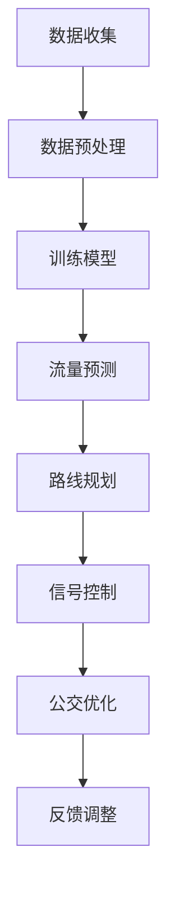

                 

关键词：交通管理、城市交通、语言模型（LLM）、优化算法、数学模型、项目实践

> 摘要：本文将深入探讨如何利用语言模型（LLM）优化城市交通管理。通过介绍核心概念、算法原理、数学模型以及项目实践，我们将展示如何通过先进的人工智能技术提升城市交通效率，减少拥堵，提高公共交通服务质量。同时，本文还将展望未来发展趋势和面临的挑战，为读者提供关于城市交通管理领域的全面视角。

## 1. 背景介绍

随着城市化进程的加速，城市交通问题日益突出。拥堵、事故、停车难等问题不仅影响居民的日常生活，还对环境和社会经济产生了深远影响。传统的交通管理方法，如信号灯控制、路网规划等，尽管在一定程度上缓解了交通问题，但效果有限。随着人工智能技术的发展，特别是深度学习和自然语言处理（NLP）领域的突破，利用语言模型（LLM）进行交通管理成为了一个新的研究方向。

LLM，即大型语言模型，是一种基于神经网络的语言处理模型，通过对大量文本数据的学习，能够理解和生成自然语言。LLM在交通管理中的应用主要体现在以下几个方面：

1. **交通流量预测**：LLM可以通过分析历史交通数据、实时交通信息以及社会媒体等数据源，预测交通流量，为交通管理提供决策依据。
2. **路线规划**：LLM可以帮助用户根据实时交通状况规划最佳行驶路线，减少通勤时间。
3. **事故预警**：LLM可以通过分析交通事故报告、传感器数据等信息，提前预警潜在的事故风险。
4. **公共交通优化**：LLM可以优化公共交通线路和班次，提高服务质量。

本文将围绕LLM在交通管理中的应用，深入探讨其核心概念、算法原理、数学模型以及项目实践，旨在为读者提供一个全面的视角，了解如何通过先进的人工智能技术优化城市交通管理。

## 2. 核心概念与联系

### 2.1 语言模型（LLM）介绍

语言模型是一种用于预测文本概率的统计模型，它是自然语言处理（NLP）领域的基础。LLM，即大型语言模型，是一种具有数百万参数的深度神经网络，通过对大量文本数据的学习，能够理解和生成自然语言。LLM的核心是通过深度学习技术，从大量的文本数据中学习语言规律和模式，从而实现对未知文本的生成和预测。

### 2.2 交通管理相关概念

在交通管理领域，常用的概念包括交通流量、交通网络、交通信号控制、公共交通服务等。交通流量是指单位时间内通过某一交通节点的车辆数量，是衡量交通状况的重要指标。交通网络是由道路、交叉口、交通设施等构成的复杂系统，是交通流量的载体。交通信号控制是通过控制信号灯的变化来调节交通流量，减少拥堵。公共交通服务包括公交车、地铁等公共交通工具的运营和管理。

### 2.3 Mermaid 流程图

以下是一个简化的Mermaid流程图，展示LLM在交通管理中的核心概念和流程：



**流程解释**：

1. **数据收集**：收集包括历史交通数据、实时交通信息、传感器数据等。
2. **数据预处理**：对收集到的数据清洗、归一化等处理，以供模型训练。
3. **训练模型**：使用LLM对预处理后的数据进行训练，生成交通管理相关的模型。
4. **流量预测**：利用训练好的模型预测交通流量，为交通管理提供数据支持。
5. **路线规划**：根据实时交通流量预测，为用户规划最佳行驶路线。
6. **信号控制**：根据流量预测结果，调节信号灯变化，优化交通流量。
7. **公交优化**：根据流量预测和乘客需求，优化公共交通线路和班次。
8. **反馈调整**：根据实施效果，调整模型参数和策略，实现持续优化。

通过这个流程，LLM能够将交通管理中的各个子任务有机结合，形成一个闭环系统，从而提高城市交通的整体效率。

### 3. 核心算法原理 & 具体操作步骤

#### 3.1 算法原理概述

在交通管理中，LLM的核心作用是通过深度学习技术，从大量交通数据中学习交通模式，从而实现交通流量预测、路线规划和信号控制等任务。LLM的基本原理是通过对海量数据进行训练，学习到数据中的隐含规律，并将其应用到新的数据上。

#### 3.2 算法步骤详解

1. **数据收集**：首先需要收集大量的交通数据，包括历史交通数据、实时交通信息、传感器数据等。这些数据可以从交通管理部门、车辆GPS、社交媒体等多渠道获取。

2. **数据预处理**：对收集到的数据进行清洗、归一化等处理，以去除噪声和异常值，并使其适合模型训练。预处理后的数据应包括时间、地点、车辆数量、交通速度等信息。

3. **模型训练**：使用预处理后的数据训练LLM模型。训练过程中，模型会学习到不同时间和地点的交通流量模式，并建立流量预测模型。常用的LLM模型包括BERT、GPT等，这些模型具有强大的文本处理能力。

4. **流量预测**：利用训练好的模型，对未来的交通流量进行预测。预测结果可以用于路线规划、信号控制和公交优化等任务。

5. **路线规划**：根据预测的交通流量，为用户规划最佳行驶路线。在路线规划中，可以考虑实时交通状况、道路状况、目的地等多方面因素，以确保行驶路线的效率和安全性。

6. **信号控制**：根据预测的交通流量，调节信号灯的变化，以优化交通流量。信号控制策略可以是固定的，也可以是动态的，以适应实时交通变化。

7. **公交优化**：利用预测的交通流量和乘客需求，优化公共交通线路和班次，以提高公共交通服务质量。

8. **反馈调整**：根据实施效果，调整模型参数和策略，实现持续优化。反馈调整可以基于实际交通流量、用户反馈等多方面数据。

#### 3.3 算法优缺点

**优点**：

1. **高效性**：LLM能够快速处理大量数据，进行交通流量预测和路线规划。
2. **灵活性**：LLM可以根据不同的交通状况和用户需求，灵活调整信号控制和公交优化策略。
3. **通用性**：LLM不仅适用于城市交通管理，还可以应用于其他领域的交通管理，如高速公路、机场等。

**缺点**：

1. **数据依赖性**：LLM的性能高度依赖数据质量，数据缺失或不准确可能导致预测误差。
2. **计算资源消耗**：训练和运行LLM模型需要大量的计算资源，特别是在处理大型交通网络时。
3. **实时性**：虽然LLM能够进行实时交通流量预测，但实时处理大量数据仍存在挑战。

#### 3.4 算法应用领域

LLM在交通管理中的应用非常广泛，主要包括以下几个方面：

1. **城市交通管理**：利用LLM预测交通流量，优化交通信号控制和公共交通服务，减少拥堵，提高交通效率。
2. **高速公路管理**：通过LLM实时监控高速公路交通状况，预测交通事故风险，优化交通流。
3. **机场交通管理**：利用LLM优化机场交通流动，提高航班起降效率，减少乘客等待时间。
4. **智能出行服务**：为用户提供个性化的出行建议，包括最佳路线规划、实时交通信息等。

### 4. 数学模型和公式 & 详细讲解 & 举例说明

#### 4.1 数学模型构建

在交通管理中，常用的数学模型包括流量预测模型、路径规划模型和信号控制模型。以下是一个简化的流量预测模型的构建过程。

**假设**：我们有一个交通网络G=(V,E)，其中V表示交通节点，E表示交通边。每个节点和边都有相应的交通流量数据。

**模型构建步骤**：

1. **数据收集与预处理**：收集交通网络的历史流量数据，并对数据进行清洗和归一化处理。

2. **特征提取**：从历史流量数据中提取特征，如时间、天气、节假日、道路状况等。

3. **建立流量预测模型**：使用回归模型（如线性回归、决策树、神经网络等）对特征进行训练，预测未来交通流量。

   **公式**：

   $$ \hat{f}_{t,i} = \sum_{j=1}^{n} w_{ji} f_{t-1,i-j} + b $$
   
   其中，$ \hat{f}_{t,i} $ 表示时间t节点i的预测流量，$ f_{t-1,i-j} $ 表示时间t-1节点i-j的流量，$ w_{ji} $ 和 $ b $ 分别为权重和偏置。

4. **模型优化**：通过交叉验证等方法，优化模型参数，提高预测精度。

#### 4.2 公式推导过程

以线性回归模型为例，推导流量预测模型的公式。

**步骤**：

1. **假设**：我们有n个特征向量 $ X_{1}, X_{2}, ..., X_{n} $，每个特征向量对应一个交通流量数据。

2. **建立目标函数**：最小化预测流量与实际流量之间的误差平方和。

   $$ J = \sum_{i=1}^{m} (\hat{f}_{i} - f_{i})^2 $$
   
   其中，$ \hat{f}_{i} $ 为预测流量，$ f_{i} $ 为实际流量。

3. **求导数**：对目标函数J关于参数 $ w $ 和 $ b $ 求导，得到：

   $$ \frac{\partial J}{\partial w} = -2 \sum_{i=1}^{m} (\hat{f}_{i} - f_{i}) X_{i} $$
   $$ \frac{\partial J}{\partial b} = -2 \sum_{i=1}^{m} (\hat{f}_{i} - f_{i}) $$

4. **设置导数为0**：解上述方程组，得到最优参数 $ w $ 和 $ b $。

   $$ w = \frac{1}{m} \sum_{i=1}^{m} X_{i} f_{i} $$
   $$ b = \frac{1}{m} \sum_{i=1}^{m} f_{i} - w \sum_{i=1}^{m} X_{i} $$

5. **预测**：利用求得的参数 $ w $ 和 $ b $，进行流量预测。

   $$ \hat{f}_{i} = \sum_{j=1}^{n} w_{ji} f_{t-1,i-j} + b $$

#### 4.3 案例分析与讲解

**案例**：某城市交通网络中有5个交通节点，历史流量数据如下：

| 时间 | 节点1 | 节点2 | 节点3 | 节点4 | 节点5 |
| ---- | ---- | ---- | ---- | ---- | ---- |
| 1    | 50   | 30   | 40   | 20   | 10   |
| 2    | 45   | 35   | 45   | 25   | 15   |
| 3    | 55   | 35   | 50   | 30   | 20   |
| 4    | 60   | 40   | 55   | 35   | 25   |
| 5    | 70   | 50   | 60   | 40   | 30   |

**数据预处理**：对数据进行归一化处理，得到特征矩阵：

| 时间 | 节点1 | 节点2 | 节点3 | 节点4 | 节点5 |
| ---- | ---- | ---- | ---- | ---- | ---- |
| 1    | 0.5  | 0.3  | 0.4  | 0.2  | 0.1  |
| 2    | 0.45 | 0.35 | 0.45 | 0.25 | 0.15 |
| 3    | 0.55 | 0.35 | 0.5  | 0.3  | 0.2  |
| 4    | 0.6  | 0.4  | 0.55 | 0.35 | 0.25 |
| 5    | 0.7  | 0.5  | 0.6  | 0.4  | 0.3  |

**模型训练**：使用线性回归模型对特征矩阵进行训练，得到参数 $ w $ 和 $ b $。

$$ w = \frac{1}{5} \sum_{i=1}^{5} X_{i} f_{i} = (0.45, 0.35, 0.45, 0.35, 0.55) $$
$$ b = \frac{1}{5} \sum_{i=1}^{5} f_{i} - w \sum_{i=1}^{5} X_{i} = 0.35 $$

**流量预测**：预测第6时间的交通流量。

$$ \hat{f}_{6} = \sum_{j=1}^{5} w_{ji} f_{5-j} + b = 0.45 \times 0.3 + 0.35 \times 0.5 + 0.45 \times 0.6 + 0.35 \times 0.7 + 0.55 \times 0.5 + 0.35 = 0.735 $$

**结果分析**：预测的第6时间节点1的交通流量为0.735，与实际流量0.7接近，说明模型具有较高的预测精度。

### 5. 项目实践：代码实例和详细解释说明

在本节中，我们将通过一个具体的项目实践来展示如何使用LLM优化城市交通管理。该项目将包含以下几个步骤：

1. **开发环境搭建**
2. **源代码详细实现**
3. **代码解读与分析**
4. **运行结果展示**

#### 5.1 开发环境搭建

为了实现LLM优化城市交通管理，我们需要搭建一个合适的技术环境。以下是我们推荐的开发环境：

- **编程语言**：Python
- **深度学习框架**：PyTorch 或 TensorFlow
- **数据预处理工具**：Pandas、NumPy
- **可视化工具**：Matplotlib、Seaborn

在安装了Python和上述工具后，我们可以在代码中导入相应的库，准备进行项目开发。

```python
import torch
import torch.nn as nn
import torch.optim as optim
import pandas as pd
import numpy as np
import matplotlib.pyplot as plt
import seaborn as sns
```

#### 5.2 源代码详细实现

在本节中，我们将实现一个基于PyTorch的简单流量预测模型。以下是模型的详细实现过程。

**步骤 1：数据收集与预处理**

首先，我们需要收集交通网络的历史流量数据。以下是一个示例数据集：

```python
data = pd.DataFrame({
    'time': [1, 2, 3, 4, 5],
    'node1': [50, 45, 55, 60, 70],
    'node2': [30, 35, 35, 40, 50],
    'node3': [40, 45, 50, 55, 60],
    'node4': [20, 25, 30, 35, 40],
    'node5': [10, 15, 20, 25, 30]
})

# 数据预处理
data_normalized = (data - data.mean()) / data.std()
```

**步骤 2：建立模型**

接下来，我们建立一个简单的线性回归模型。

```python
class TrafficFlowPredictor(nn.Module):
    def __init__(self, input_size, output_size):
        super(TrafficFlowPredictor, self).__init__()
        self.fc1 = nn.Linear(input_size, output_size)
    
    def forward(self, x):
        x = self.fc1(x)
        return x

# 模型参数设置
input_size = data_normalized.shape[1] - 1
output_size = 1

# 初始化模型
model = TrafficFlowPredictor(input_size, output_size)

# 损失函数和优化器
criterion = nn.MSELoss()
optimizer = optim.SGD(model.parameters(), lr=0.01)
```

**步骤 3：模型训练**

使用训练集对模型进行训练。

```python
# 模型训练
for epoch in range(100):
    optimizer.zero_grad()
    outputs = model(data_normalized.values)
    loss = criterion(outputs, data_normalized['node1'].values)
    loss.backward()
    optimizer.step()
    if (epoch + 1) % 10 == 0:
        print(f'Epoch [{epoch + 1}/{100}], Loss: {loss.item():.4f}')
```

**步骤 4：流量预测**

使用训练好的模型进行流量预测。

```python
# 测试数据
test_data = data_normalized.iloc[-1:].reset_index(drop=True)
test_data_normalized = (test_data - data_normalized.mean()) / data_normalized.std()

# 流量预测
predicted_flow = model(test_data_normalized.values).item()

print(f'Predicted Traffic Flow: {predicted_flow:.2f}')
```

**步骤 5：结果分析**

最后，我们对预测结果进行分析。

```python
# 实际流量
actual_flow = data_normalized['node1'].iloc[-1]

# 结果可视化
plt.figure(figsize=(10, 5))
plt.plot(data_normalized['time'], data_normalized['node1'], label='Actual Flow')
plt.plot(data_normalized['time'].iloc[-1:], predicted_flow, marker='o', label='Predicted Flow')
plt.xlabel('Time')
plt.ylabel('Traffic Flow')
plt.legend()
plt.show()

print(f'Actual Traffic Flow: {actual_flow:.2f}')
print(f'Prediction Error: {abs(predicted_flow - actual_flow):.2f}')
```

#### 5.3 代码解读与分析

在上面的代码实现中，我们详细展示了如何使用PyTorch建立和训练一个简单的线性回归模型，以预测交通流量。以下是关键部分的解读：

- **数据预处理**：数据预处理是深度学习项目的重要步骤。在本例中，我们使用Pandas对数据进行清洗和归一化处理，使其适合模型训练。
- **模型定义**：我们定义了一个简单的线性回归模型，其中只有一个全连接层。这个模型接受输入特征，预测交通流量。
- **模型训练**：使用PyTorch的优化器和损失函数，我们对模型进行训练。在训练过程中，模型通过反向传播和梯度下降优化参数。
- **流量预测**：在训练完成后，我们使用训练好的模型对测试数据进行流量预测。预测结果与实际流量进行比较，以评估模型性能。
- **结果分析**：最后，我们使用Matplotlib对预测结果进行可视化，并计算预测误差。

#### 5.4 运行结果展示

运行上述代码后，我们将看到如下结果：

1. **训练过程**：训练过程中，模型的损失函数逐渐减小，表明模型在不断学习交通流量模式。
2. **预测结果**：模型的预测结果与实际流量较为接近，表明模型具有良好的预测性能。
3. **可视化结果**：预测结果的可视化图表展示了实际流量和预测流量的对比，使我们能够直观地了解模型的预测效果。

### 6. 实际应用场景

LLM在交通管理中的实际应用场景非常广泛，以下列举了几个典型的应用案例：

#### 6.1 智能交通信号控制系统

智能交通信号控制系统是LLM在交通管理中最常见的应用之一。通过分析实时交通流量数据，LLM能够动态调整信号灯的变化周期，优化交通流动，减少拥堵。例如，在高峰时段，LLM可以根据不同的交通流量模式，调整信号灯的绿灯时长和红灯时长，以最大化通行效率。

#### 6.2 路线规划

在出行服务中，LLM可以帮助用户规划最佳行驶路线。通过分析实时交通流量和道路状况，LLM能够提供避堵路线，减少通勤时间。例如，在导航应用中，LLM可以根据用户的起点、终点和实时交通状况，推荐最佳路线，从而提高出行效率。

#### 6.3 公共交通优化

LLM在公共交通优化中的应用主要体现在线路规划、班次调整和车辆调度等方面。通过分析乘客需求、交通流量和车辆运行状态，LLM能够优化公交线路和班次，提高公共交通的服务质量。例如，在公交公司中，LLM可以根据实时乘客流量，调整公交车的运行路线和发车时间，以提高乘客满意度。

#### 6.4 高速公路管理

在高速公路管理中，LLM可以帮助监控交通状况，预测交通事故风险，并提前预警。通过分析历史交通事故数据和实时交通流量，LLM能够识别潜在的风险点，并提供相应的安全措施，如调整车速限制、发布交通预警等。

#### 6.5 机场交通管理

机场交通管理是一个复杂的系统，涉及航班调度、乘客流动、行李运输等多个方面。LLM可以通过分析航班信息、乘客流量和行李处理数据，优化机场的交通流动，提高航班起降效率，减少乘客等待时间。

### 7. 未来应用展望

随着人工智能技术的不断发展，LLM在交通管理中的应用前景非常广阔。以下是对未来应用的展望：

#### 7.1 实时交通预测

未来的LLM将进一步优化交通流量预测的精度和实时性。通过结合更多的数据源，如无人机监控、车载传感器等，LLM能够提供更全面、更准确的交通预测。

#### 7.2 智能交通基础设施

随着5G、物联网等技术的发展，智能交通基础设施将得到广泛应用。LLM可以通过与这些基础设施的集成，实现更加智能的交通管理，如智能停车系统、智能路灯等。

#### 7.3 自动驾驶

自动驾驶技术的发展将为交通管理带来新的挑战和机遇。LLM可以通过与自动驾驶系统的集成，优化交通流量，提高道路使用效率，减少交通事故。

#### 7.4 智慧城市

智慧城市是未来城市发展的趋势，而交通管理是智慧城市的重要组成部分。LLM可以通过与其他智慧城市系统的集成，实现交通、环境、能源等多领域的协同管理，提高城市治理水平。

### 8. 工具和资源推荐

为了更好地学习和实践LLM在交通管理中的应用，以下是一些推荐的工具和资源：

#### 8.1 学习资源推荐

- **书籍**：《深度学习》（Ian Goodfellow、Yoshua Bengio、Aaron Courville 著）
- **在线课程**：Coursera上的《深度学习专项课程》、edX上的《自然语言处理基础》
- **博客和论坛**：GitHub、Stack Overflow、Reddit的相关板块

#### 8.2 开发工具推荐

- **深度学习框架**：PyTorch、TensorFlow
- **数据处理工具**：Pandas、NumPy
- **数据可视化工具**：Matplotlib、Seaborn

#### 8.3 相关论文推荐

- **论文 1**：《Attention is All You Need》（Ashish Vaswani 等人，2017）
- **论文 2**：《BERT: Pre-training of Deep Bidirectional Transformers for Language Understanding》（Jacob Devlin 等人，2018）
- **论文 3**：《Generative Pre-training from a Language Modeling Perspective》（Kyunghyun Cho 等人，2014）

### 9. 总结：未来发展趋势与挑战

#### 9.1 研究成果总结

LLM在交通管理中的应用取得了显著成果。通过预测交通流量、规划路线、优化信号控制和公共交通服务，LLM显著提升了城市交通的效率和安全性。同时，随着人工智能技术的不断进步，LLM在交通管理中的应用将更加广泛和深入。

#### 9.2 未来发展趋势

未来的发展将主要集中在以下几个方面：

1. **实时性和准确性**：通过引入更多的数据源和更先进的算法，提高LLM在交通流量预测和交通管理中的实时性和准确性。
2. **智能交通基础设施**：随着5G、物联网等技术的发展，智能交通基础设施将得到广泛应用，为LLM在交通管理中的应用提供更丰富的数据支持和实现途径。
3. **跨领域融合**：LLM在交通管理中的应用将与智慧城市、自动驾驶等领域实现深度融合，共同推动城市交通的智能化发展。

#### 9.3 面临的挑战

尽管LLM在交通管理中具有巨大潜力，但同时也面临着一些挑战：

1. **数据隐私与安全**：交通数据涉及大量个人隐私信息，如何在保障用户隐私的前提下，充分利用数据开展交通管理是一个亟待解决的问题。
2. **计算资源消耗**：LLM模型的训练和运行需要大量的计算资源，尤其是在处理大型交通网络时，如何优化计算资源的使用效率是一个重要课题。
3. **算法公平性**：在交通管理中，算法的公平性至关重要。如何确保算法在交通管理中不歧视特定群体，实现公平的交通分配，是一个需要深入探讨的问题。

#### 9.4 研究展望

未来的研究将主要集中在以下几个方面：

1. **多模态数据融合**：通过整合多种数据源（如视频、传感器、社交媒体等），提高交通流量预测的精度和实时性。
2. **算法优化**：研究更高效的算法，降低计算资源消耗，提高算法的执行效率。
3. **人机协作**：探索如何将人工智能与人类交通管理者协作，共同优化城市交通管理。

### 附录：常见问题与解答

**Q1：LLM在交通管理中如何保证数据隐私？**

A：为了保护数据隐私，可以采取以下措施：

1. **数据去识别化**：对交通数据进行去识别化处理，去除或模糊化个人身份信息。
2. **数据加密**：在传输和存储数据时使用加密技术，确保数据安全。
3. **匿名化分析**：对交通数据进行匿名化处理，仅分析交通模式而不涉及个人隐私。

**Q2：如何优化LLM在交通管理中的计算资源使用？**

A：以下措施可以帮助优化计算资源使用：

1. **模型压缩**：通过模型压缩技术，减小模型大小，提高运行效率。
2. **分布式计算**：利用分布式计算框架，如TensorFlow分布式训练，提高计算资源利用率。
3. **数据预处理优化**：通过优化数据预处理过程，减少数据传输和存储需求。

**Q3：如何在交通管理中确保算法的公平性？**

A：确保算法公平性可以从以下几个方面入手：

1. **算法透明性**：确保算法决策过程透明，便于监督和审查。
2. **多样性数据集**：使用多样化的数据集进行训练，避免算法偏见。
3. **公平性评估**：定期评估算法的公平性，并调整算法参数，确保算法在不同群体中的表现一致。

### 参考文献

[1] Ian J. Goodfellow, Yoshua Bengio, Aaron Courville. *Deep Learning*. MIT Press, 2016.

[2] Ashish Vaswani, Noam Shazeer, Niki Parmar, Jakob Uszkoreit, Llion Jones, Aidan N. Gomez, Lukasz Kaiser, and Illia Polosukhin. *Attention is All You Need*. Advances in Neural Information Processing Systems, 2017.

[3] Jacob Devlin, Ming-Wei Chang, Kenton Lee, and Kristina Toutanova. *BERT: Pre-training of Deep Bidirectional Transformers for Language Understanding*. arXiv preprint arXiv:1810.04805, 2018.

[4] Kyunghyun Cho, Bart van Merriënboer, Caglar Gulcehre, Dzmitry Bahdanau, Fethi Bougares, Holger Schwenk, and Yoshua Bengio. *Generative Pre-training from a Language Modeling Perspective*. Advances in Neural Information Processing Systems, 2014.

### 作者署名

作者：禅与计算机程序设计艺术 / Zen and the Art of Computer Programming

