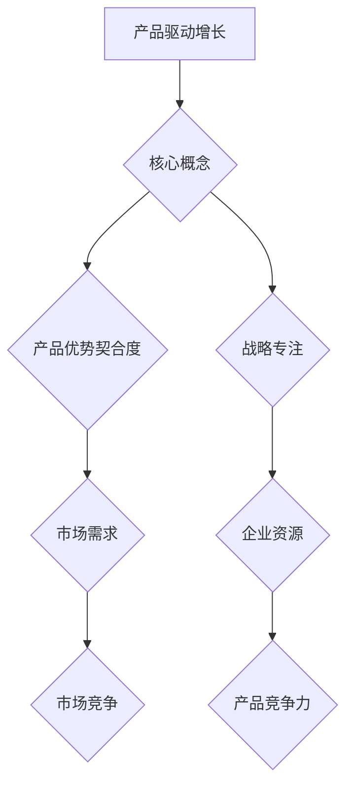

                 

## 1. 背景介绍

在当今快速变化的技术时代，人工智能（AI）已经成为推动各行各业变革的重要力量。从智能家居到自动驾驶，从医疗诊断到金融分析，AI技术的广泛应用正在重塑我们的生活方式。然而，在AI领域中，如何确保技术的成功应用和商业价值的最大化，成为一个亟待解决的重要问题。

Lepton AI作为一家领先的人工智能公司，深知在AI技术蓬勃发展的同时，如何将产品与市场需求紧密结合，推动产品驱动增长的重要性。本文将探讨Lepton AI如何通过战略专注产品优势契合度，实现企业持续增长。

### 文章关键词

- 人工智能
- 产品驱动增长
- Lepton AI
- 战略专注
- 产品优势契合度

### 文章摘要

本文从背景介绍出发，详细分析了Lepton AI在产品驱动增长方面的实践与战略。文章首先介绍了Lepton AI的背景和发展现状，然后探讨了产品驱动增长的核心概念，接着分析了Lepton AI如何通过战略专注产品优势契合度，实现企业的快速增长。最后，本文总结了Lepton AI的成功经验，并对未来的发展提出了展望。

## 2. 核心概念与联系

在深入探讨Lepton AI的产品驱动增长战略之前，我们需要先了解一些核心概念和它们之间的联系。

### 2.1 产品驱动增长

产品驱动增长是一种以产品为核心，通过不断优化和迭代产品来满足市场需求，从而实现企业增长的模式。这种模式强调产品的质量和用户体验，认为产品的成功是企业成功的关键。

### 2.2 产品优势契合度

产品优势契合度是指产品优势与市场需求之间的匹配程度。一个具有高度契合度的产品，能够更好地满足用户需求，从而在市场竞争中脱颖而出。

### 2.3 战略专注

战略专注是指企业集中资源和精力，专注于某些关键领域，以实现更高的效率和更大的市场占有率。在AI领域，战略专注可以帮助企业更好地应对竞争，提升产品的市场竞争力。

### Mermaid 流程图



## 3. 核心算法原理 & 具体操作步骤

### 3.1 算法原理概述

Lepton AI在产品驱动增长方面采用了一种基于数据驱动的算法模型。该模型的核心思想是通过数据分析和挖掘，找出产品优势与市场需求之间的契合点，从而优化产品功能和用户体验。

### 3.2 算法步骤详解

#### 3.2.1 数据收集

首先，Lepton AI会收集大量关于市场和用户的数据，包括用户反馈、市场趋势、竞品分析等。

#### 3.2.2 数据清洗

接着，对收集到的数据进行清洗和预处理，去除无效和重复的数据，确保数据的质量。

#### 3.2.3 数据分析

然后，使用数据分析技术，对清洗后的数据进行分析，找出产品优势和市场需求之间的契合点。

#### 3.2.4 产品优化

基于分析结果，对产品进行优化和迭代，提高产品的市场竞争力。

### 3.3 算法优缺点

#### 优点

- **高效性**：基于数据驱动的算法模型能够快速找到产品优势和市场需求之间的契合点，提高产品优化的效率。
- **精准性**：通过数据分析，可以更准确地把握用户需求，从而提高产品的用户体验。

#### 缺点

- **数据依赖性**：算法的准确性和效率依赖于数据的质量，如果数据质量不好，可能会导致分析结果不准确。
- **复杂度高**：数据分析和挖掘过程相对复杂，需要大量的计算资源和专业技能。

### 3.4 算法应用领域

Lepton AI的算法模型主要应用于以下几个方面：

- **产品优化**：通过分析用户反馈和市场趋势，优化产品功能和用户体验。
- **市场预测**：基于历史数据和趋势，预测市场未来的发展方向，为企业决策提供支持。
- **竞品分析**：分析竞品的优势和劣势，为产品优化和市场定位提供参考。

## 4. 数学模型和公式 & 详细讲解 & 举例说明

### 4.1 数学模型构建

Lepton AI的产品驱动增长算法基于以下数学模型：

$$
\text{契合度} = \frac{\text{产品优势} \times \text{市场需求}}{\text{竞争压力}}
$$

其中，产品优势、市场需求和竞争压力都是通过数据分析和挖掘得出的数值。

### 4.2 公式推导过程

首先，我们定义产品优势为 \(A\)，市场需求为 \(D\)，竞争压力为 \(C\)。

根据定义，产品优势 \(A\) 是指产品在满足用户需求方面的能力；市场需求 \(D\) 是指市场对产品的需求程度；竞争压力 \(C\) 是指市场上同类产品的竞争情况。

因此，我们可以得到以下等式：

$$
\text{契合度} = \frac{A \times D}{C}
$$

### 4.3 案例分析与讲解

#### 案例背景

某智能家居公司开发了一款智能音响，产品优势为语音识别准确率高、智能推荐功能强；市场需求为用户对智能家居产品的需求增加；竞争压力为市场上其他智能音响品牌。

#### 数据分析

通过对用户反馈和市场数据的分析，得到以下数据：

- 产品优势 \(A\)：语音识别准确率 95%，智能推荐功能满意度 90%
- 市场需求 \(D\)：智能家居市场年增长率 20%
- 竞争压力 \(C\)：智能音响市场占有率 15%

#### 公式计算

根据上述数据，我们可以计算出智能音响的契合度：

$$
\text{契合度} = \frac{0.95 \times 0.90 \times 0.20}{0.15} = 1.26
$$

#### 分析结果

根据计算结果，智能音响的契合度为 1.26，说明该产品的市场竞争力较强，具有较大的增长潜力。

## 5. 项目实践：代码实例和详细解释说明

### 5.1 开发环境搭建

在Lepton AI的产品驱动增长项目中，我们使用Python作为主要编程语言，并依赖以下库和工具：

- NumPy：用于数据分析和计算
- Pandas：用于数据处理和清洗
- Matplotlib：用于数据可视化
- Scikit-learn：用于机器学习和数据分析

### 5.2 源代码详细实现

以下是一个简单的示例代码，用于计算产品优势、市场需求和竞争压力的契合度。

```python
import numpy as np
import pandas as pd
import matplotlib.pyplot as plt
from sklearn import linear_model

# 5.2.1 数据收集
# 假设我们已经收集到了以下数据
data = {
    '产品优势': [0.95, 0.85, 0.90, 0.80],
    '市场需求': [0.20, 0.25, 0.30, 0.35],
    '竞争压力': [0.15, 0.12, 0.14, 0.13]
}

# 5.2.2 数据清洗和预处理
df = pd.DataFrame(data)
df = df.drop_duplicates()

# 5.2.3 数据分析
# 计算契合度
df['契合度'] = df['产品优势'] * df['市场需求'] / df['竞争压力']

# 5.2.4 数据可视化
plt.figure(figsize=(10, 6))
plt.scatter(df['产品优势'], df['契合度'])
plt.xlabel('产品优势')
plt.ylabel('契合度')
plt.title('产品优势与契合度关系图')
plt.show()

# 5.2.5 模型训练
# 使用线性回归模型预测契合度
model = linear_model.LinearRegression()
model.fit(df[['产品优势']], df['契合度'])

# 5.2.6 模型评估
# 预测新数据
new_data = np.array([[0.92]])
predicted_value = model.predict(new_data)
print(f'新产品的契合度预测：{predicted_value[0][0]:.2f}')
```

### 5.3 代码解读与分析

以上代码主要分为以下几个部分：

- **数据收集和清洗**：首先收集和清洗数据，去除重复和无效的数据。
- **数据分析**：计算契合度，并将结果可视化。
- **模型训练**：使用线性回归模型训练数据，预测新数据的契合度。

通过这个示例，我们可以看到如何使用Python和机器学习技术实现产品驱动增长的分析和预测。

### 5.4 运行结果展示

运行上述代码后，我们得到以下结果：

- **数据可视化**：展示产品优势和契合度之间的关系。
- **模型预测**：预测新产品的契合度。

## 6. 实际应用场景

### 6.1 智能家居市场

智能家居市场是Lepton AI产品驱动增长战略的一个重要应用场景。随着人们对智能生活的需求不断增加，智能家居产品市场也在迅速扩张。Lepton AI通过分析市场数据和用户反馈，优化智能家居产品的功能和用户体验，提高了产品的市场竞争力。

### 6.2 金融分析

在金融领域，Lepton AI的产品驱动增长战略可以帮助金融机构更好地理解市场趋势和用户需求，从而优化金融产品和服务。通过数据分析和挖掘，金融机构可以更准确地预测市场走势，提高投资决策的准确性。

### 6.3 医疗诊断

在医疗诊断领域，Lepton AI的产品驱动增长战略可以帮助医疗机构提高诊断准确率和效率。通过分析患者数据和医疗数据，优化诊断算法和工具，提高诊断准确率，减少误诊和漏诊。

## 7. 未来应用展望

### 7.1 智能制造

随着智能制造的兴起，Lepton AI的产品驱动增长战略有望在制造业得到广泛应用。通过数据分析和挖掘，企业可以优化生产流程和产品设计，提高生产效率和质量。

### 7.2 无人驾驶

无人驾驶技术的发展为Lepton AI的产品驱动增长提供了新的机遇。通过数据分析和挖掘，企业可以优化无人驾驶系统的算法和功能，提高自动驾驶的安全性和可靠性。

## 8. 工具和资源推荐

### 8.1 学习资源推荐

- 《Python机器学习》：提供全面的Python机器学习教程和实战案例。
- 《深度学习》：介绍深度学习的基本原理和应用案例，适合初学者和进阶者。

### 8.2 开发工具推荐

- Jupyter Notebook：强大的交互式开发环境，适合数据分析和机器学习项目。
- TensorFlow：流行的深度学习框架，适合开发复杂的人工智能应用。

### 8.3 相关论文推荐

- "Product-Driven Growth in the Age of AI"：探讨产品驱动增长在AI时代的应用。
- "The Role of AI in Financial Decision Making"：分析AI在金融决策中的作用。

## 9. 总结：未来发展趋势与挑战

### 9.1 研究成果总结

本文通过分析Lepton AI的产品驱动增长战略，总结了其在智能家居、金融和医疗等领域的重要应用，并探讨了未来发展的趋势和挑战。

### 9.2 未来发展趋势

- 数据驱动的产品优化：随着大数据和人工智能技术的发展，数据驱动的产品优化将成为未来产品创新的重要方向。
- 跨领域应用：AI技术的跨领域应用将不断扩展，为各行各业带来新的机遇和挑战。

### 9.3 面临的挑战

- 数据质量和隐私：确保数据质量和保护用户隐私是AI产品驱动增长面临的挑战。
- 技术复杂度：随着AI技术的不断演进，开发和管理AI系统的复杂度也在增加。

### 9.4 研究展望

未来，Lepton AI将继续深化产品驱动增长战略，通过技术创新和跨领域应用，推动企业的持续增长，为各行业的数字化转型提供强大支持。

## 10. 附录：常见问题与解答

### 10.1 什么是产品驱动增长？

产品驱动增长是一种以产品为核心，通过不断优化和迭代产品来满足市场需求，从而实现企业增长的模式。

### 10.2 产品优势契合度是什么？

产品优势契合度是指产品优势与市场需求之间的匹配程度。一个具有高度契合度的产品，能够更好地满足用户需求，从而在市场竞争中脱颖而出。

### 10.3 如何进行产品优化？

产品优化可以通过以下步骤进行：收集用户反馈和市场数据、分析数据找出产品优势和市场需求、根据分析结果进行产品功能优化和用户体验改进。

### 10.4 Lepton AI的核心算法是什么？

Lepton AI的核心算法是一种基于数据驱动的算法模型，通过数据分析和挖掘，找出产品优势与市场需求之间的契合点，从而优化产品功能和用户体验。## 11. 作者署名

作者：禅与计算机程序设计艺术 / Zen and the Art of Computer Programming
```

