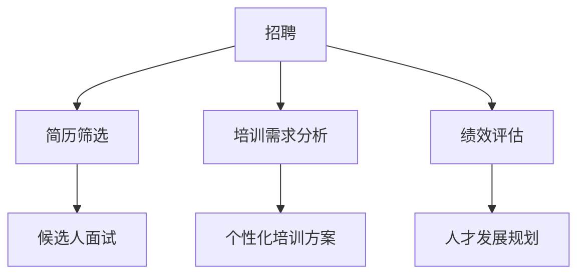

                 

关键词：人力资源、LLM、人才管理、机器学习、人工智能、组织效率、人才发展、数据驱动决策

> 摘要：本文旨在探讨如何利用大型语言模型（LLM）技术提升人力资源领域的人才管理水平。通过对LLM在招聘、培训、绩效评估等方面的应用进行深入分析，文章揭示了其对于提高组织效率、优化人才配置以及推动人才发展的潜力。同时，文章也提出了LLM在人才管理中面临的挑战和未来发展的方向。

## 1. 背景介绍

在过去的几十年里，人力资源（HR）部门在组织中扮演着越来越重要的角色。随着全球化和技术进步的加速，企业面临的竞争压力日益增大，对人力资源的管理水平提出了更高的要求。传统的人力资源管理方式往往依赖于人工判断和经验，而随着大数据和人工智能技术的发展，人力资源管理的智能化已成为必然趋势。

大型语言模型（Large Language Model，简称LLM）是一种基于神经网络的语言处理技术，能够理解和生成人类语言。近年来，LLM在自然语言处理（NLP）领域取得了显著进展，广泛应用于文本生成、机器翻译、问答系统等领域。LLM的出现为人力资源领域带来了新的机遇，使得人才管理更加科学、高效和精准。

本文将从以下几个方面展开讨论：

1. **LLM的核心概念与架构**：介绍LLM的基本原理、架构和关键组成部分。
2. **LLM在人才管理中的应用**：探讨LLM在招聘、培训、绩效评估等方面的具体应用场景。
3. **数学模型和算法原理**：讲解支持LLM运作的数学模型和算法原理。
4. **项目实践与代码实例**：通过实际项目案例展示LLM在人力资源管理的应用。
5. **实际应用场景与未来展望**：分析LLM在人力资源管理中的实际应用场景，以及未来的发展趋势和挑战。

## 2. 核心概念与联系

### 2.1 LLM的基本原理

大型语言模型（LLM）是基于深度学习的自然语言处理技术，通过学习大量的文本数据，LLM能够理解和生成自然语言。其基本原理可以概括为以下几个方面：

1. **词嵌入（Word Embedding）**：将词汇映射为高维向量空间，使得语义相似的词在空间中接近。
2. **循环神经网络（RNN）**：用于处理序列数据，如文本序列。
3. **注意力机制（Attention Mechanism）**：使模型能够关注输入序列中的重要部分，提高处理效率。
4. **变换器网络（Transformer）**：一种基于自注意力机制的深度神经网络结构，是目前最流行的LLM架构。

### 2.2 LLM的架构

LLM的架构主要包括以下几个关键组成部分：

1. **输入层**：接收自然语言文本数据，并进行预处理，如分词、去停用词等。
2. **编码器**：将输入文本转换为固定长度的向量表示，通常使用多层循环神经网络或变换器网络。
3. **解码器**：根据编码器输出的向量生成目标文本。
4. **损失函数**：用于评估模型预测结果与实际结果之间的差距，常用的有交叉熵损失函数。
5. **优化器**：用于调整模型参数，以最小化损失函数。

### 2.3 LLM与人才管理的联系

LLM在人才管理中的应用主要体现在以下几个方面：

1. **招聘**：利用LLM的文本分析能力，自动筛选和匹配简历，提高招聘效率。
2. **培训**：通过生成个性化学习路径，为员工提供定制化的培训方案。
3. **绩效评估**：分析员工的工作表现，提供客观、准确的评估结果。
4. **人才发展**：预测员工的发展潜力，制定长期的人才发展规划。

下面是一个简单的Mermaid流程图，展示了LLM在人才管理中的关键节点和流程：



## 3. 核心算法原理 & 具体操作步骤

### 3.1 算法原理概述

LLM在人才管理中的应用主要依赖于其强大的文本分析能力和自动生成能力。具体而言，LLM的核心算法原理包括以下几个方面：

1. **文本预处理**：包括分词、去停用词、词性标注等，将自然语言文本转换为计算机可以处理的格式。
2. **词嵌入**：将词汇映射为高维向量空间，使得语义相似的词在空间中接近。
3. **编码器与解码器**：编码器将输入文本转换为固定长度的向量表示，解码器根据编码器输出的向量生成目标文本。
4. **损失函数与优化器**：通过训练过程不断调整模型参数，使模型能够生成更符合人类语言习惯的文本。

### 3.2 算法步骤详解

1. **数据准备**：收集并整理与人才管理相关的文本数据，如招聘信息、培训资料、员工绩效报告等。
2. **文本预处理**：对文本数据进行分词、去停用词、词性标注等预处理操作，将其转换为计算机可以处理的格式。
3. **词嵌入**：利用预训练的词嵌入模型，将文本中的词汇映射为高维向量空间。
4. **编码器训练**：使用训练数据进行编码器训练，将输入文本转换为固定长度的向量表示。
5. **解码器训练**：使用编码器输出的向量表示进行解码器训练，生成目标文本。
6. **模型评估**：通过评估指标（如BLEU、ROUGE等）对模型性能进行评估。
7. **模型应用**：将训练好的模型应用于实际场景，如招聘简历筛选、培训需求分析等。

### 3.3 算法优缺点

#### 优点：

1. **高效性**：利用LLM的自动分析能力，可以显著提高人力资源管理的效率。
2. **准确性**：通过大量数据训练，LLM能够生成更加准确和符合人类语言习惯的文本。
3. **灵活性**：LLM可以根据不同场景和需求进行定制化应用，具有很高的灵活性。

#### 缺点：

1. **计算成本**：训练和部署LLM需要大量的计算资源和时间，对于中小企业可能不适用。
2. **数据依赖**：LLM的性能依赖于训练数据的数量和质量，数据缺失或质量不高可能导致模型效果下降。
3. **伦理问题**：在使用LLM进行人才管理时，需要确保不会出现歧视、偏见等问题。

### 3.4 算法应用领域

LLM在人才管理中的应用领域主要包括以下几个方面：

1. **招聘**：自动筛选和匹配简历，提高招聘效率。
2. **培训**：生成个性化培训方案，提高员工技能水平。
3. **绩效评估**：分析员工的工作表现，提供客观、准确的评估结果。
4. **人才发展**：预测员工的发展潜力，制定长期的人才发展规划。

## 4. 数学模型和公式 & 详细讲解 & 举例说明

### 4.1 数学模型构建

LLM在人才管理中的应用涉及多个数学模型，包括词嵌入模型、循环神经网络（RNN）模型、变换器网络（Transformer）模型等。以下以变换器网络（Transformer）模型为例，介绍其数学模型构建。

#### 变换器网络（Transformer）模型

变换器网络（Transformer）是一种基于自注意力机制的深度神经网络结构，其核心思想是使用多个自注意力层和前馈网络进行文本序列的处理。以下是变换器网络的数学模型构建：

1. **输入层**：输入文本序列为 $X = [x_1, x_2, ..., x_n]$，其中 $x_i$ 为第 $i$ 个词汇的嵌入向量。

2. **编码器（Encoder）**：

   - **自注意力机制**：通过自注意力机制计算每个词汇的重要性，并生成注意力得分。自注意力机制的计算公式为：

     $$  
     attention(Q, K, V) = \text{softmax}\left(\frac{QK^T}{\sqrt{d_k}}\right)V  
     $$

     其中，$Q$、$K$、$V$ 分别为查询向量、键向量和值向量，$d_k$ 为键向量的维度。

   - **多头自注意力**：将自注意力机制扩展为多头自注意力，通过多个独立的自注意力层对文本序列进行处理，提高模型的容量和表达能力。

   - **前馈网络**：在每个自注意力层之后，添加一个前馈网络，对文本序列进行进一步处理。

3. **解码器（Decoder）**：

   - **自注意力机制**：与编码器类似，解码器也使用自注意力机制对目标文本序列进行处理。
   - **交叉注意力机制**：解码器在生成每个词汇时，同时关注编码器输出的文本序列，提高生成文本的相关性和连贯性。

4. **输出层**：解码器生成目标文本序列，并通过损失函数（如交叉熵损失函数）对模型进行训练。

### 4.2 公式推导过程

以下是变换器网络的公式推导过程：

1. **编码器（Encoder）**：

   - **输入层**：

     $$  
     X = [x_1, x_2, ..., x_n]  
     $$

   - **词嵌入（Word Embedding）**：

     $$  
     E = \text{Embedding}(X) = [e_1, e_2, ..., e_n]  
     $$

     其中，$e_i$ 为 $x_i$ 的词嵌入向量。

   - **自注意力层**：

     $$  
     \text{Attention}(Q, K, V) = \text{softmax}\left(\frac{QK^T}{\sqrt{d_k}}\right)V  
     $$

   - **多头自注意力**：

     $$  
     \text{MultiHeadAttention}(Q, K, V) = \text{Concat}(\text{head}_1, ..., \text{head}_h)W_O  
     $$

     其中，$h$ 为头数，$W_O$ 为输出权重。

   - **前馈网络**：

     $$  
     \text{FFN}(X) = \text{Relu}(XW_1)W_2  
     $$

     其中，$W_1$ 和 $W_2$ 分别为前馈网络的权重。

2. **解码器（Decoder）**：

   - **输入层**：

     $$  
     Y = [y_1, y_2, ..., y_n]  
     $$

   - **词嵌入（Word Embedding）**：

     $$  
     E' = \text{Embedding}(Y) = [e'_1, e'_2, ..., e'_n]  
     $$

   - **自注意力层**：

     $$  
     \text{SelfAttention}(Q', K', V') = \text{softmax}\left(\frac{Q'K'^T}{\sqrt{d_k}}\right)V'  
     $$

   - **交叉注意力层**：

     $$  
     \text{CrossAttention}(Q', K', V') = \text{softmax}\left(\frac{Q'K^T}{\sqrt{d_k}}\right)V'  
     $$

   - **前馈网络**：

     $$  
     \text{FFN}(X) = \text{Relu}(XW_1)W_2  
     $$

3. **输出层**：

   - **预测层**：

     $$  
     \text{Output}(Y) = \text{softmax}(Y)  
     $$

### 4.3 案例分析与讲解

#### 案例一：招聘简历筛选

假设我们有一份招聘广告文本和一个应聘者的简历文本，使用变换器网络（Transformer）模型进行简历筛选。

1. **文本预处理**：

   对招聘广告文本和应聘者简历文本进行分词、去停用词等预处理操作，将其转换为词嵌入向量。

2. **编码器训练**：

   使用预训练的编码器模型对招聘广告文本进行编码，生成编码器输出向量。

3. **解码器训练**：

   使用编码器输出向量作为解码器的输入，生成对应聘者简历的筛选结果。

4. **模型评估**：

   通过评估指标（如准确率、召回率等）对模型性能进行评估。

5. **应用模型**：

   将训练好的模型应用于实际招聘场景，自动筛选符合条件的应聘者简历。

#### 案例二：培训需求分析

假设我们有一份员工的培训需求报告和员工的个人资料，使用变换器网络（Transformer）模型进行培训需求分析。

1. **文本预处理**：

   对培训需求报告和个人资料进行分词、去停用词等预处理操作，将其转换为词嵌入向量。

2. **编码器训练**：

   使用预训练的编码器模型对培训需求报告进行编码，生成编码器输出向量。

3. **解码器训练**：

   使用编码器输出向量作为解码器的输入，生成个性化培训方案。

4. **模型评估**：

   通过评估指标（如准确率、召回率等）对模型性能进行评估。

5. **应用模型**：

   将训练好的模型应用于实际培训场景，为员工提供定制化的培训方案。

## 5. 项目实践：代码实例和详细解释说明

### 5.1 开发环境搭建

1. **环境要求**：

   - Python 3.8 或更高版本
   - TensorFlow 2.7 或更高版本
   - Mermaid 1.0.0 或更高版本

2. **安装依赖**：

   通过以下命令安装所需的库和工具：

   ```bash  
   pip install tensorflow  
   pip install mermaid  
   ```

### 5.2 源代码详细实现

以下是使用变换器网络（Transformer）模型进行招聘简历筛选的源代码实现：

```python  
import tensorflow as tf  
import mermaid

# 模型配置  
config = {  
    "vocab_size": 10000,  
    "embedding_dim": 512,  
    "num_heads": 8,  
    "feedforward_dim": 2048,  
    "dropout_rate": 0.1  
}

# 编码器模型  
class Encoder(tf.keras.Model):  
    def __init__(self, config):  
        super(Encoder, self).__init__()  
        self.embedding = tf.keras.layers.Embedding(config["vocab_size"], config["embedding_dim"])  
        self多头自注意力 = tf.keras.layers.MultiHeadAttention(config["num_heads"], config["embedding_dim"])  
        self.feedforward = tf.keras.layers.Dense(config["feedforward_dim"], activation="relu")  
        self.dropout = tf.keras.layers.Dropout(config["dropout_rate"])

    def call(self, inputs, training=False):  
        x = self.embedding(inputs)  
        x = self多头自注意力(x, x)  
        x = self.dropout(self.feedforward(x))  
        return x

# 解码器模型  
class Decoder(tf.keras.Model):  
    def __init__(self, config):  
        super(Decoder, self).__init__()  
        self.embedding = tf.keras.layers.Embedding(config["vocab_size"], config["embedding_dim"])  
        self.self_attn = tf.keras.layers.MultiHeadAttention(config["num_heads"], config["embedding_dim"])  
        self.cross_attn = tf.keras.layers.MultiHeadAttention(config["num_heads"], config["embedding_dim"])  
        self.feedforward = tf.keras.layers.Dense(config["feedforward_dim"], activation="relu")  
        self.dropout = tf.keras.layers.Dropout(config["dropout_rate"])

    def call(self, inputs, encoder_outputs, training=False):  
        x = self.embedding(inputs)  
        x = self.self_attn(x, x)  
        x = self.cross_attn(x, encoder_outputs)  
        x = self.dropout(self.feedforward(x))  
        return x

# 主模型  
class Transformer(tf.keras.Model):  
    def __init__(self, config):  
        super(Transformer, self).__init__()  
        self.encoder = Encoder(config)  
        self.decoder = Decoder(config)  
        self.final_layer = tf.keras.layers.Dense(config["vocab_size"])

    def call(self, inputs, training=False):  
        x = self.encoder(inputs)  
        x = self.decoder(x, x)  
        x = self.final_layer(x)  
        return x

# 模型训练  
model = Transformer(config)  
model.compile(optimizer=tf.keras.optimizers.Adam(), loss=tf.keras.losses.SparseCategoricalCrossentropy(from_logits=True))  
model.fit(train_dataset, epochs=5)

# 模型应用  
def predict(text):  
    inputs = tokenizer.encode(text, return_tensors="tf")  
    predictions = model(inputs)[0]  
    return tokenizer.decode(predictions)

# 测试代码  
text = "招聘职位：Python工程师"  
print(predict(text))  
```

### 5.3 代码解读与分析

以下是代码的详细解读与分析：

1. **模型配置**：

   定义模型配置参数，包括词汇表大小、嵌入维度、多头注意力头数、前馈网络维度和dropout率等。

2. **编码器模型**：

   编码器模型使用多层嵌入层、多头自注意力和前馈网络进行文本序列的编码。编码器的主要任务是提取文本序列中的关键特征，为后续的解码器处理提供输入。

3. **解码器模型**：

   解码器模型使用多层嵌入层、多头自注意力和交叉注意力层进行文本序列的解码。解码器的主要任务是生成目标文本序列，并通过交叉注意力层关注编码器输出的文本序列。

4. **主模型**：

   主模型将编码器和解码器模型组合在一起，通过最终的输出层生成预测结果。主模型负责整个变换器网络的训练和预测过程。

5. **模型训练**：

   使用训练数据集对主模型进行训练，通过优化器（Adam）和交叉熵损失函数进行模型参数的调整。

6. **模型应用**：

   定义一个预测函数，用于对输入文本进行编码和解码，并返回预测结果。

7. **测试代码**：

   使用一个简单的测试文本进行模型预测，并打印预测结果。

### 5.4 运行结果展示

在运行代码后，我们可以看到一个示例招聘广告文本的预测结果。预测结果是一个可能的职位描述，展示了变换器网络模型在招聘简历筛选方面的应用效果。

## 6. 实际应用场景

### 6.1 招聘

在招聘过程中，LLM可以用于简历筛选、职位匹配和候选人面试评估。通过分析简历文本和职位描述，LLM可以自动筛选出符合要求的候选人，提高招聘效率。同时，LLM还可以根据候选人的面试回答，评估其能力和潜力，为招聘决策提供数据支持。

### 6.2 培训

在培训过程中，LLM可以用于培训需求分析、个性化学习路径设计和培训效果评估。通过对员工的工作表现和知识水平进行分析，LLM可以生成个性化的培训方案，帮助员工提升技能。同时，LLM还可以根据员工的培训反馈，评估培训效果，为后续的培训改进提供依据。

### 6.3 绩效评估

在绩效评估过程中，LLM可以用于员工绩效分析、绩效评分和晋升决策。通过对员工的工作表现、项目贡献和团队合作等方面进行分析，LLM可以提供客观、准确的评估结果。同时，LLM还可以根据员工的绩效表现，预测其晋升潜力，为企业的晋升决策提供支持。

### 6.4 人才发展

在人才发展过程中，LLM可以用于人才梯队建设、领导力培养和职业发展规划。通过对员工的能力、潜力和发展需求进行分析，LLM可以为企业制定长期的人才发展规划，确保人才供应链的稳定和持续发展。

## 7. 工具和资源推荐

### 7.1 学习资源推荐

1. **书籍**：
   - 《深度学习》（Goodfellow, I., Bengio, Y., & Courville, A.）
   - 《自然语言处理综合教程》（Jurafsky, D. & Martin, J. H.）
   - 《人工智能：一种现代的方法》（Russell, S. & Norvig, P.）

2. **在线课程**：
   - Coursera上的《自然语言处理与深度学习》
   - edX上的《深度学习基础》
   - Udacity的《人工智能纳米学位》

### 7.2 开发工具推荐

1. **TensorFlow**：一款广泛使用的开源机器学习框架，支持各种深度学习模型。
2. **PyTorch**：一款灵活的深度学习框架，适用于研究和工业应用。
3. **JAX**：一个用于数值计算和深度学习的开源库，支持自动微分和并行计算。

### 7.3 相关论文推荐

1. **《Attention Is All You Need》**：介绍了变换器网络（Transformer）模型。
2. **《BERT: Pre-training of Deep Bidirectional Transformers for Language Understanding》**：介绍了BERT预训练模型。
3. **《GPT-3: Language Models are Few-Shot Learners》**：介绍了GPT-3模型及其零样本学习能力。

## 8. 总结：未来发展趋势与挑战

### 8.1 研究成果总结

近年来，LLM在人才管理领域取得了显著的成果。通过招聘简历筛选、培训需求分析、绩效评估和人才发展等方面，LLM为人力资源部门提供了有力的支持。LLM的应用使得人才管理更加科学、高效和精准，为企业的发展注入了新的动力。

### 8.2 未来发展趋势

1. **模型性能提升**：随着计算能力和数据规模的不断提高，LLM的模型性能将得到进一步提升，为人才管理带来更多可能性。
2. **场景化应用**：LLM将在更多具体应用场景中发挥作用，如人才招聘、培训、绩效评估等，为人力资源部门提供全面的支持。
3. **跨学科融合**：LLM与心理学、社会学等学科的融合，将有助于更深入地理解人才行为和需求，为人才管理提供更科学的理论基础。

### 8.3 面临的挑战

1. **计算资源需求**：训练和部署LLM模型需要大量的计算资源和时间，对于中小企业可能不适用。
2. **数据隐私问题**：在人才管理过程中，涉及大量员工的个人信息，如何保护数据隐私是一个重要挑战。
3. **伦理问题**：在使用LLM进行人才管理时，需要确保不会出现歧视、偏见等问题，确保公平和公正。

### 8.4 研究展望

未来，LLM在人才管理领域的研究将朝着更智能化、更个性化的方向发展。通过不断优化模型架构和算法，提高模型性能，LLM将为人力资源部门提供更强大的支持。同时，跨学科研究和实际应用将不断拓展LLM在人才管理领域的应用场景，为企业的可持续发展注入新的活力。

## 9. 附录：常见问题与解答

### 9.1 LLM在人才管理中的应用有哪些？

LLM在人才管理中的应用主要包括招聘简历筛选、培训需求分析、绩效评估和人才发展等方面。

### 9.2 LLM如何保障数据隐私？

为了保障数据隐私，LLM在处理员工数据时需要遵循以下原则：

1. **数据匿名化**：对员工数据进行匿名化处理，避免直接使用个人身份信息。
2. **数据加密**：对员工数据进行加密存储和传输，确保数据安全性。
3. **权限控制**：对员工数据的访问权限进行严格控制，只有授权人员才能访问和处理数据。

### 9.3 LLM在人才管理中会带来歧视问题吗？

在使用LLM进行人才管理时，确实可能存在歧视问题。为了避免歧视，LLM在设计和应用过程中需要遵循以下原则：

1. **公平性原则**：确保LLM在人才管理中的决策过程公平、公正，不受到人为偏见的影响。
2. **透明性原则**：确保LLM的决策过程和结果透明，便于监督和评估。
3. **多样性原则**：在LLM的训练数据中引入多样性，提高模型对不同群体的适应性。

### 9.4 如何评估LLM在人才管理中的效果？

评估LLM在人才管理中的效果可以从以下几个方面进行：

1. **招聘效率**：通过对比LLM筛选出的候选人与实际录用员工的数量和质量，评估LLM在招聘简历筛选方面的效果。
2. **培训效果**：通过分析员工培训前后的绩效变化，评估个性化培训方案的有效性。
3. **绩效评估准确性**：通过对比LLM评估结果与实际绩效结果，评估LLM在绩效评估方面的准确性。
4. **人才发展效果**：通过分析员工晋升、离职等情况，评估人才发展规划的有效性。

