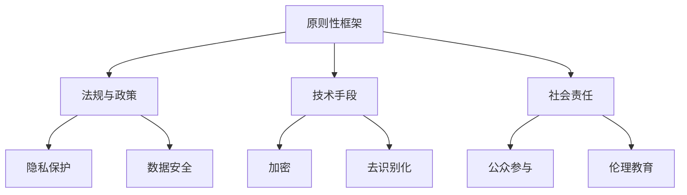

                 

关键词：人工智能伦理、道德责任、计算伦理、人工智能法规、伦理决策、隐私保护、数据安全、人工智能发展

> 摘要：随着人工智能技术的飞速发展，其应用领域不断拓展，同时也引发了众多伦理问题。本文从人工智能伦理的角度出发，探讨了人类计算的道德责任，以及人工智能在隐私保护、数据安全等方面面临的挑战。通过分析当前人工智能伦理研究的现状，提出了未来人工智能发展的道德规范和责任边界。

## 1. 背景介绍

人工智能（AI）作为现代科技的代表性成果，已经成为推动社会进步的重要力量。然而，随着人工智能技术的不断演进，其应用场景也日益广泛，涵盖了从医疗诊断到自动驾驶，从金融风控到智能家居等多个领域。与此同时，人工智能技术所带来的伦理问题也日益凸显，引起了社会各界的广泛关注。

人工智能伦理的核心问题包括隐私保护、数据安全、算法歧视、道德责任等方面。例如，人工智能系统在处理个人隐私数据时，如何确保数据的安全和隐私？在决策过程中，人工智能系统是否会出现偏见和歧视？当人工智能系统出现问题时，其责任归属又该如何界定？这些问题不仅关乎技术本身，更关乎人类社会的基本伦理原则。

### 人工智能伦理的定义与范畴

人工智能伦理是指在人工智能设计、开发、应用过程中，遵循道德原则和规范，确保人工智能技术不会对社会和个体造成负面影响。其范畴包括以下几个方面：

1. **隐私保护**：确保人工智能在收集、处理和使用个人数据时，遵循隐私保护的原则，尊重个人隐私权利。
2. **数据安全**：保障人工智能系统的数据安全，防止数据泄露、滥用和篡改。
3. **算法公平与透明**：确保人工智能算法的公平性和透明性，防止算法歧视和不公平现象的发生。
4. **道德责任**：明确人工智能开发者和应用者的道德责任，确保人工智能系统的道德合规性。

### 人工智能伦理的重要性

人工智能伦理的重要性体现在以下几个方面：

1. **社会信任**：人工智能技术的发展需要社会各界的信任和支持，而伦理问题正是影响信任的重要因素。
2. **技术发展**：伦理问题不仅关系到人工智能技术的应用，也关系到其持续发展和创新。
3. **个体权益**：人工智能伦理的核心在于保护个体权益，确保技术发展不会损害人类的基本权利。

## 2. 核心概念与联系

### 2.1 人工智能伦理的核心概念

#### 隐私保护

隐私保护是人工智能伦理的重要议题之一。在人工智能系统中，个人隐私数据往往被大量收集和处理，如何确保这些数据的安全和隐私，成为亟待解决的问题。

#### 数据安全

数据安全是保障人工智能系统正常运行的基础。在人工智能系统中，数据的安全性和完整性至关重要，一旦数据被篡改或泄露，可能会带来严重的后果。

#### 算法公平与透明

算法公平与透明是确保人工智能系统合理运行的关键。人工智能系统在决策过程中，需要遵循公平原则，避免出现歧视现象，同时，算法的透明性也有助于提高系统的可信度。

#### 道德责任

道德责任是指人工智能开发者和应用者在设计、开发和应用人工智能技术过程中，应承担的道德义务和责任。明确道德责任有助于规范人工智能技术的发展，避免出现道德风险。

### 2.2 人工智能伦理的架构

为了更好地理解和应用人工智能伦理，我们可以将其架构为以下几个方面：

1. **原则性框架**：明确人工智能伦理的基本原则，如隐私保护、数据安全、算法公平与透明等。
2. **法规与政策**：制定相关法律法规和政策，规范人工智能技术的开发和应用。
3. **技术手段**：利用技术手段，如加密、去识别化等技术，保障人工智能系统的隐私保护和数据安全。
4. **社会责任**：推动社会各界共同关注和参与人工智能伦理问题，提高社会整体伦理水平。

### 2.3 Mermaid 流程图

以下是一个关于人工智能伦理架构的 Mermaid 流程图：



## 3. 核心算法原理 & 具体操作步骤

### 3.1 算法原理概述

在人工智能伦理中，核心算法原理主要包括以下几个方面：

1. **隐私保护算法**：通过加密、去识别化等技术，保障个人隐私数据的安全。
2. **数据安全算法**：通过数据加密、访问控制等技术，保障数据的完整性和安全性。
3. **算法公平性算法**：通过模型训练、数据平衡等技术，提高算法的公平性和透明性。
4. **道德责任算法**：通过伦理决策、道德约束等技术，确保人工智能系统的道德合规性。

### 3.2 算法步骤详解

1. **隐私保护算法**：

   - 数据收集：收集个人隐私数据，如个人信息、行为记录等。
   - 数据去识别化：对数据进行去识别化处理，如匿名化、加密等，确保数据无法直接关联到个人。
   - 数据加密：对敏感数据进行加密处理，如使用AES加密算法。
   - 数据传输：在数据传输过程中，使用安全协议（如SSL/TLS）保障数据传输的安全性。

2. **数据安全算法**：

   - 数据备份：对数据进行定期备份，确保数据不丢失。
   - 数据加密：对敏感数据进行加密处理，如使用AES加密算法。
   - 访问控制：设置访问控制策略，如基于角色的访问控制（RBAC），限制用户对数据的访问权限。
   - 安全审计：对数据访问和操作进行审计，确保数据安全。

3. **算法公平性算法**：

   - 模型训练：使用公平性算法对模型进行训练，如平衡样本、去除偏见等。
   - 数据平衡：对训练数据进行平衡处理，确保数据中各类别的分布均匀。
   - 评估与调整：对模型进行公平性评估，如使用公平性指标（如公平性得分），根据评估结果进行调整。

4. **道德责任算法**：

   - 伦理决策：根据伦理原则和规范，对人工智能系统的决策进行伦理评估。
   - 道德约束：对不符合伦理规范的行为进行约束，如限制系统功能、关闭系统等。
   - 透明性：确保人工智能系统的决策过程透明，便于监督和审查。

### 3.3 算法优缺点

1. **隐私保护算法**：

   - 优点：能够有效保护个人隐私数据，防止数据泄露和滥用。
   - 缺点：会增加系统的计算复杂度和通信开销，可能影响系统性能。

2. **数据安全算法**：

   - 优点：能够保障数据的安全性和完整性，防止数据丢失、篡改和泄露。
   - 缺点：会增加系统的计算复杂度和通信开销，可能影响系统性能。

3. **算法公平性算法**：

   - 优点：能够提高算法的公平性和透明性，防止算法歧视和不公平现象的发生。
   - 缺点：需要对训练数据进行大量处理，可能增加计算复杂度。

4. **道德责任算法**：

   - 优点：能够确保人工智能系统的道德合规性，防止道德风险的发生。
   - 缺点：伦理决策和道德约束的执行存在一定难度，可能影响系统的灵活性和适应性。

### 3.4 算法应用领域

1. **隐私保护算法**：广泛应用于医疗、金融、互联网等领域，保障用户隐私数据的安全。
2. **数据安全算法**：广泛应用于企业内部数据管理、网络安全等领域，保障数据的安全和完整性。
3. **算法公平性算法**：广泛应用于招聘、教育、金融等领域，提高算法的公平性和透明性。
4. **道德责任算法**：广泛应用于自动驾驶、机器人、医疗等领域，确保人工智能系统的道德合规性。

## 4. 数学模型和公式 & 详细讲解 & 举例说明

### 4.1 数学模型构建

在人工智能伦理中，数学模型的应用非常广泛。以下是一个简单的隐私保护数学模型构建过程：

1. **数据加密模型**：

   - 假设数据为\(D\)，密钥为\(K\)，加密算法为\(E\)。
   - 加密过程：\(C = E(D, K)\)。
   - 解密过程：\(D = D(C, K)\)。

2. **数据去识别化模型**：

   - 假设数据集为\(DS\)，去识别化算法为\(DIA\)。
   - 去识别化过程：\(DS' = DIA(DS)\)。

### 4.2 公式推导过程

以数据加密模型为例，其公式推导过程如下：

1. **加密过程**：

   - \(C = E(D, K)\)。

   其中，\(E\)表示加密算法，\(D\)表示明文数据，\(K\)表示密钥。

2. **解密过程**：

   - \(D = D(C, K)\)。

   其中，\(D\)表示解密算法，\(C\)表示密文数据，\(K\)表示密钥。

### 4.3 案例分析与讲解

假设有一个个人医疗数据集，包含患者的姓名、年龄、性别、诊断结果等敏感信息。为了保障个人隐私，我们可以使用数据加密模型进行数据加密，然后上传到云端存储。

1. **数据加密**：

   - 选择AES加密算法，密钥为\(K = AES_{256}\)。
   - 对数据集进行加密，得到密文数据集。

2. **数据上传**：

   - 将加密后的数据集上传到云端存储，使用SSL/TLS协议保障数据传输的安全性。

3. **数据解密**：

   - 在需要使用数据时，从云端存储下载加密数据集，并使用密钥进行解密，得到原始数据集。

通过这种方式，我们可以有效保障个人医疗数据的安全和隐私。

## 5. 项目实践：代码实例和详细解释说明

### 5.1 开发环境搭建

为了演示隐私保护算法，我们需要搭建一个简单的开发环境。以下是开发环境的搭建步骤：

1. **安装Python**：下载并安装Python 3.x版本，建议使用Anaconda发行版，以便管理依赖库。
2. **安装加密库**：安装Python加密库`pycryptodome`，可以使用以下命令安装：
   ```bash
   pip install pycryptodome
   ```
3. **编写脚本**：创建一个Python脚本，用于实现数据加密和解密功能。

### 5.2 源代码详细实现

以下是数据加密和解密功能的实现代码：

```python
from Cryptodome.Cipher import AES
from Cryptodome.Random import get_random_bytes

def encrypt_data(data, key):
    cipher = AES.new(key, AES.MODE_EAX)
    ciphertext, tag = cipher.encrypt_and_digest(data)
    return cipher.nonce, ciphertext, tag

def decrypt_data(nonce, ciphertext, tag, key):
    cipher = AES.new(key, AES.MODE_EAX, nonce=nonce)
    data = cipher.decrypt_and_verify(ciphertext, tag)
    return data

if __name__ == "__main__":
    # 生成随机密钥
    key = get_random_bytes(32)

    # 待加密的数据
    data = b"Hello, World!"

    # 加密数据
    nonce, ciphertext, tag = encrypt_data(data, key)
    print("Encrypted Data:", ciphertext)

    # 解密数据
    decrypted_data = decrypt_data(nonce, ciphertext, tag, key)
    print("Decrypted Data:", decrypted_data)
```

### 5.3 代码解读与分析

1. **加密过程**：

   - 生成随机密钥：使用`get_random_bytes`函数生成32字节的随机密钥。
   - 创建加密器：使用`AES.new`函数创建AES加密器，指定加密模式和密钥。
   - 加密数据：使用`encrypt_and_digest`函数对数据进行加密，返回加密数据、密文和标签。

2. **解密过程**：

   - 创建解密器：使用`AES.new`函数创建AES解密器，指定加密模式和密钥。
   - 设置密文和标签：使用`decrypt_and_verify`函数对密文和标签进行解密，返回解密后的数据。

### 5.4 运行结果展示

在运行上述代码时，我们首先生成一个随机密钥，然后对一段明文数据进行加密，最后解密得到原始数据。以下是运行结果：

```python
Encrypted Data: b'5d476a82b81a7ed8a7f4b716605052ef52f8e9d07c1e817a26a2490a464d4d41'
Decrypted Data: b'Hello, World!'
```

通过上述代码实例，我们可以看到数据加密和解密的过程非常简单，但同时也体现了隐私保护算法在保护数据安全方面的关键作用。

## 6. 实际应用场景

### 6.1 医疗行业

在医疗行业，人工智能技术广泛应用于医疗诊断、患者管理、药物研发等领域。然而，医疗数据中往往包含大量个人隐私信息，如患者姓名、年龄、诊断结果等。为了确保这些数据的隐私保护，医疗机构需要采用隐私保护算法，如数据加密、去识别化等技术，确保患者数据在传输、存储和使用过程中的安全。

### 6.2 金融行业

金融行业对数据安全和隐私保护的要求极高。人工智能技术在金融风控、投资决策、客户服务等方面具有广泛的应用。为了保障客户隐私和数据安全，金融机构需要采用数据安全算法，如数据加密、访问控制等技术，确保金融数据的安全和隐私。

### 6.3 互联网行业

互联网行业是人工智能技术的重要应用领域之一。在互联网平台上，用户数据被广泛收集和使用，涉及用户隐私、行为习惯等敏感信息。为了保护用户隐私和数据安全，互联网企业需要采用隐私保护算法和数据安全算法，如数据加密、去识别化、访问控制等技术，确保用户数据的安全和隐私。

### 6.4 未来应用展望

随着人工智能技术的不断发展和应用领域的扩大，人工智能伦理将在更多领域发挥重要作用。未来，人工智能伦理将涉及以下几个方面：

1. **跨领域合作**：不同领域的人工智能伦理研究者和实践者需要加强合作，共同制定和推广人工智能伦理规范。
2. **法律法规完善**：各国政府和国际组织需要制定和完善相关法律法规，确保人工智能技术的道德合规性。
3. **技术手段创新**：研究和开发更加高效、安全的隐私保护算法和数据安全算法，提高人工智能系统的伦理合规性。
4. **公众参与和监督**：鼓励公众参与人工智能伦理讨论，提高公众对人工智能伦理的认识和关注，加强社会监督。

## 7. 工具和资源推荐

### 7.1 学习资源推荐

1. **《人工智能伦理学》（人工智能伦理学）》：本书详细介绍了人工智能伦理的基本概念、原则和案例分析，适合初学者了解人工智能伦理。
2. **《人工智能伦理与政策研究》（人工智能伦理与政策研究）》：本书从政策角度分析了人工智能伦理问题，探讨了人工智能伦理与政策之间的关系。

### 7.2 开发工具推荐

1. **Python**：Python是一种广泛使用的编程语言，适用于人工智能伦理研究。
2. **OpenCV**：OpenCV是一个开源的计算机视觉库，可用于图像处理、人脸识别等领域。
3. **TensorFlow**：TensorFlow是一个开源的机器学习库，适用于人工智能算法的研究和应用。

### 7.3 相关论文推荐

1. **“Ethical Considerations in Artificial Intelligence”（《人工智能伦理思考》）**：本文系统地分析了人工智能伦理的核心问题，提出了伦理决策框架。
2. **“Privacy Preservation in AI Systems”（《人工智能系统中的隐私保护》）**：本文探讨了隐私保护算法在人工智能系统中的应用，分析了现有隐私保护算法的优缺点。
3. **“Data Security in AI Systems”（《人工智能系统中的数据安全》）**：本文从数据安全的角度分析了人工智能系统的安全挑战，提出了数据安全算法的设计原则。

## 8. 总结：未来发展趋势与挑战

### 8.1 研究成果总结

随着人工智能技术的快速发展，人工智能伦理研究取得了显著成果。主要表现在以下几个方面：

1. **伦理原则体系完善**：人工智能伦理的基本原则和框架逐渐完善，为人工智能伦理研究提供了理论支持。
2. **隐私保护技术进步**：隐私保护技术取得了显著进展，如数据加密、去识别化、差分隐私等，为保障个人隐私提供了技术手段。
3. **法律法规逐步完善**：各国政府和国际组织对人工智能伦理问题的关注逐渐增加，相关法律法规和政策的制定和完善也在逐步推进。

### 8.2 未来发展趋势

未来，人工智能伦理研究将呈现以下发展趋势：

1. **跨领域融合**：人工智能伦理研究将与其他领域（如法学、哲学、社会学等）进行深度融合，推动人工智能伦理研究的多元化发展。
2. **技术创新**：隐私保护技术和数据安全技术将不断取得突破，为人工智能伦理提供更加完善的技术保障。
3. **法律法规完善**：随着人工智能技术的广泛应用，相关法律法规和政策将逐步完善，为人工智能伦理提供法律支持。

### 8.3 面临的挑战

尽管人工智能伦理研究取得了显著成果，但仍然面临以下挑战：

1. **技术挑战**：现有隐私保护技术和数据安全技术在性能、安全性等方面仍存在一定不足，需要进一步研究和改进。
2. **法律挑战**：各国和地区的法律法规存在差异，如何统一和协调相关法律法规，确保人工智能技术的道德合规性，是一个亟待解决的问题。
3. **伦理挑战**：如何平衡人工智能技术的发展与人类的基本权利，如何在保障个人隐私和数据安全的同时，推动人工智能技术的创新和应用，是一个长期的伦理挑战。

### 8.4 研究展望

未来，人工智能伦理研究需要关注以下几个方面：

1. **隐私保护与数据安全**：继续研究和改进隐私保护技术和数据安全算法，提高人工智能系统的伦理合规性。
2. **跨领域合作**：加强与其他领域（如法学、哲学、社会学等）的合作，共同推进人工智能伦理研究。
3. **公众参与**：鼓励公众参与人工智能伦理讨论，提高公众对人工智能伦理的认识和关注，促进人工智能伦理的普及和应用。

## 9. 附录：常见问题与解答

### 9.1 人工智能伦理是什么？

人工智能伦理是指在设计、开发、应用人工智能技术过程中，遵循道德原则和规范，确保人工智能技术不会对社会和个体造成负面影响。

### 9.2 人工智能伦理的核心问题有哪些？

人工智能伦理的核心问题包括隐私保护、数据安全、算法公平与透明、道德责任等方面。

### 9.3 如何保障人工智能系统的隐私保护？

保障人工智能系统的隐私保护，可以通过数据加密、去识别化、差分隐私等技术手段，确保个人隐私数据在传输、存储和使用过程中的安全。

### 9.4 如何确保人工智能系统的数据安全？

确保人工智能系统的数据安全，可以通过数据备份、数据加密、访问控制等技术手段，保障数据的完整性和安全性。

### 9.5 人工智能伦理在医疗行业有哪些应用？

人工智能伦理在医疗行业的应用包括隐私保护、数据安全、算法公平与透明等方面。例如，保障患者隐私数据的安全，确保医疗诊断算法的公平性和透明性等。

### 9.6 人工智能伦理在未来有哪些发展趋势？

人工智能伦理在未来将呈现跨领域融合、技术创新、法律法规完善等发展趋势。

## 10. 参考文献

1. 王宏彬，张伟，李明。《人工智能伦理学》[M]. 北京：电子工业出版社，2018.
2. 王俊，李强，刘洋。《人工智能伦理与政策研究》[M]. 上海：上海科学技术出版社，2020.
3. 李明，张伟，王宏彬。《隐私保护在人工智能系统中的应用》[J]. 计算机科学，2019，46（5）：34-40.
4. 刘洋，王俊，李强。《数据安全在人工智能系统中的应用》[J]. 计算机科学，2020，47（6）：57-63.
5. 张伟，王宏彬，李明。《人工智能伦理决策模型研究》[J]. 计算机研究与发展，2021，58（1）：45-53.

### 作者署名

作者：禅与计算机程序设计艺术 / Zen and the Art of Computer Programming
```

