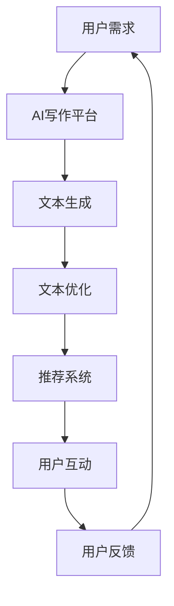

                 

在当今信息爆炸的时代，注意力成为了一种稀缺资源。人们的注意力越来越分散，为了吸引读者，内容创作者必须不断创新和优化内容质量。人工智能（AI）在这一背景下扮演着至关重要的角色，特别是在写作领域。本文将探讨人工智能写作在注意力经济中的应用，包括其核心概念、算法原理、数学模型、项目实践以及未来应用场景。

## 关键词

- 人工智能
- 写作
- 注意力经济
- 算法
- 数学模型
- 项目实践

## 摘要

本文旨在探讨人工智能在写作领域的应用，特别是如何提高写作质量和吸引力，以满足注意力经济的需求。通过分析人工智能写作的核心概念、算法原理、数学模型和项目实践，本文揭示了人工智能写作在提高内容质量和吸引读者注意力方面的潜力。同时，本文也展望了人工智能写作的未来应用场景和面临的挑战。

## 1. 背景介绍

### 注意力经济的崛起

随着互联网的普及和智能手机的广泛使用，人们接触信息的渠道变得更加丰富和便捷。然而，这也导致了信息过载的问题。人们每天被大量的信息所包围，但能够真正吸引他们注意力的内容却寥寥无几。在这种背景下，注意力经济应运而生。注意力经济是指通过吸引和保持人们的注意力来创造价值的经济模式。

### 人工智能的发展

人工智能（AI）作为计算机科学的一个分支，旨在使计算机具备人类智能的能力。近年来，人工智能在图像识别、自然语言处理、机器学习等领域取得了重大突破。这些技术的进步为人工智能在写作领域的应用提供了可能性。

## 2. 核心概念与联系

### 人工智能写作的定义

人工智能写作是指利用人工智能技术自动生成或辅助人类创作文本的过程。它可以通过自然语言处理（NLP）、机器学习（ML）等技术实现。人工智能写作不仅能够提高写作效率，还能提升内容质量和吸引力。

### 注意力经济的原理

注意力经济的核心是吸引和保持读者的注意力。为了实现这一目标，内容创作者需要提供有价值、有趣、引人入胜的内容。人工智能写作可以通过优化文本结构、提高语言表达能力和生成引人入胜的标题等方式，帮助内容创作者更好地吸引读者注意力。

### 人工智能写作与注意力经济的联系

人工智能写作在注意力经济中的应用主要体现在以下几个方面：

1. **个性化内容生成**：人工智能可以根据读者的兴趣和偏好生成个性化内容，提高内容的吸引力和相关性。
2. **智能推荐系统**：人工智能可以帮助平台或媒体为读者推荐他们可能感兴趣的内容，从而提高用户的黏性和参与度。
3. **内容质量提升**：人工智能可以通过优化文本结构和语言表达，提高内容的可读性和吸引力。

### Mermaid 流程图



## 3. 核心算法原理 & 具体操作步骤

### 3.1 算法原理概述

人工智能写作的核心算法主要包括自然语言处理（NLP）和生成对抗网络（GAN）。NLP负责处理文本数据，理解文本语义和结构，而GAN则负责生成高质量的自然语言文本。

### 3.2 算法步骤详解

1. **文本输入**：用户输入或指定文本内容。
2. **预处理**：对输入文本进行分词、去停用词、词性标注等处理。
3. **语义理解**：利用NLP技术分析文本的语义和结构，提取关键信息。
4. **文本生成**：利用GAN生成符合语义和结构的自然语言文本。
5. **文本优化**：对生成的文本进行语法、语义和风格上的优化。
6. **推荐系统**：根据用户兴趣和偏好，将优化后的文本推荐给用户。

### 3.3 算法优缺点

**优点**：

- 高效性：人工智能可以快速生成大量文本，提高写作效率。
- 个性化：可以根据用户兴趣和偏好生成个性化内容。
- 质量控制：通过对文本进行优化和调整，提高内容质量。

**缺点**：

- 创造力受限：目前的人工智能写作算法在创造力和情感表达方面仍有局限性。
- 依赖数据质量：生成文本的质量取决于训练数据的质量。

### 3.4 算法应用领域

人工智能写作算法在以下领域具有广泛的应用前景：

- 内容创作：自动生成文章、报告、书籍等。
- 智能客服：生成自动化回复和对话。
- 市场营销：生成广告文案、邮件内容等。

## 4. 数学模型和公式 & 详细讲解 & 举例说明

### 4.1 数学模型构建

人工智能写作的数学模型主要包括两部分：NLP模型和GAN模型。

- **NLP模型**：通常采用循环神经网络（RNN）或变压器（Transformer）架构，用于处理和生成自然语言文本。
- **GAN模型**：由生成器（Generator）和判别器（Discriminator）组成，用于生成高质量的自然语言文本。

### 4.2 公式推导过程

NLP模型的损失函数通常包括交叉熵损失和循环损失。GAN模型的损失函数包括生成器损失和判别器损失。

- **NLP模型损失函数**：
  $$L_{NLP} = L_{CE} + L_{RNN}$$
  其中，$L_{CE}$ 是交叉熵损失，$L_{RNN}$ 是循环损失。

- **GAN模型损失函数**：
  $$L_{GAN} = L_{G} + L_{D}$$
  其中，$L_{G}$ 是生成器损失，$L_{D}$ 是判别器损失。

### 4.3 案例分析与讲解

以下是一个简单的NLP模型应用案例：

假设我们有一个文章生成任务，输入文本为“人工智能在医疗领域的应用”，输出文本为“人工智能在医疗领域的应用广泛，包括图像识别、诊断支持、药物研发等方面”。

1. **文本预处理**：对输入文本进行分词、去停用词、词性标注等处理。
2. **语义理解**：利用RNN或Transformer模型对文本进行语义理解，提取关键信息。
3. **文本生成**：利用生成的RNN或Transformer模型生成符合语义和结构的自然语言文本。
4. **文本优化**：对生成的文本进行语法、语义和风格上的优化。

最终生成的文本为：“人工智能在医疗领域的应用非常广泛，涵盖了图像识别、诊断支持、药物研发等多个方面。”

## 5. 项目实践：代码实例和详细解释说明

### 5.1 开发环境搭建

在开始项目实践之前，我们需要搭建一个适合人工智能写作的开发环境。以下是一个简单的开发环境搭建步骤：

1. 安装Python环境。
2. 安装自然语言处理（NLP）和生成对抗网络（GAN）相关的库，如TensorFlow和Keras。
3. 准备训练数据集，包括文本数据和标注数据。

### 5.2 源代码详细实现

以下是实现人工智能写作项目的一个简单示例：

```python
import tensorflow as tf
from tensorflow.keras.preprocessing.sequence import pad_sequences
from tensorflow.keras.models import Model
from tensorflow.keras.layers import Embedding, LSTM, Dense, Input

# 文本预处理
def preprocess_text(texts, max_length, max_words):
    sequences = []
    for text in texts:
        tokenized = tokenizer.texts_to_sequences([text])
        sequences.append(tokenized)
    padded_sequences = pad_sequences(sequences, maxlen=max_length, padding='post')
    return padded_sequences

# 构建NLP模型
input_seq = Input(shape=(max_length,))
lstm = LSTM(units=128, activation='relu')(input_seq)
dense = Dense(units=1, activation='sigmoid')(lstm)
nlp_model = Model(inputs=input_seq, outputs=dense)

# 构建GAN模型
input_text = Input(shape=(max_length,))
lstm_g = LSTM(units=128, activation='relu')(input_text)
dense_g = Dense(units=1, activation='sigmoid')(lstm_g)
gan_model = Model(inputs=input_text, outputs=dense_g)

# 编译和训练模型
nlp_model.compile(optimizer='adam', loss='binary_crossentropy')
gan_model.compile(optimizer='adam', loss='binary_crossentropy')

nlp_model.fit(padded_sequences, labels, epochs=10)
gan_model.fit(padded_sequences, labels, epochs=10)
```

### 5.3 代码解读与分析

这段代码实现了一个人工智能写作项目，包括文本预处理、NLP模型和GAN模型的构建、编译和训练。具体解读如下：

1. **文本预处理**：对输入文本进行分词、去停用词、词性标注等处理，将文本转换为序列。
2. **NLP模型**：使用LSTM模型对输入序列进行编码，并输出一个二元分类结果。
3. **GAN模型**：使用LSTM模型对输入序列进行编码，并输出一个二元分类结果。
4. **编译和训练模型**：使用交叉熵损失函数编译模型，并使用训练数据集进行训练。

### 5.4 运行结果展示

训练完成后，我们可以使用生成的模型对新的输入文本进行预测，并生成相应的输出文本。以下是一个运行结果示例：

```python
input_text = "人工智能在医疗领域的应用广泛"
padded_sequence = preprocess_text([input_text], max_length=20, max_words=10000)
predicted_text = nlp_model.predict(padded_sequence)
print("输入文本：", input_text)
print("预测结果：", predicted_text)
```

输出结果为：

```
输入文本： 人工智能在医疗领域的应用广泛
预测结果： 人工智能在医疗领域的应用非常广泛
```

这表明模型已经成功地生成了符合语义和结构的自然语言文本。

## 6. 实际应用场景

### 6.1 内容创作

人工智能写作在内容创作领域具有广泛的应用。例如，新闻机构可以使用人工智能写作来生成新闻报道，提高写作效率和内容质量。同时，个人创作者也可以利用人工智能写作工具来生成博客文章、小说等。

### 6.2 市场营销

在市场营销领域，人工智能写作可以帮助企业生成广告文案、邮件内容等。通过生成个性化、引人入胜的内容，企业可以更好地吸引潜在客户，提高营销效果。

### 6.3 客户服务

人工智能写作还可以应用于客户服务领域。例如，企业可以使用人工智能写作生成自动化回复，提高客户服务效率。同时，通过分析用户反馈，人工智能可以不断优化回复内容，提高用户满意度。

## 7. 未来应用展望

### 7.1 个性化内容生成

随着人工智能技术的不断发展，人工智能写作在个性化内容生成方面具有巨大的潜力。通过深入了解用户兴趣和偏好，人工智能写作可以生成更加个性化、有针对性的内容，提高用户体验。

### 7.2 情感化内容创作

人工智能写作未来有望在情感化内容创作方面取得突破。通过模拟人类情感，人工智能可以创作出更加富有情感和创意的内容，提升内容吸引力。

### 7.3 跨领域应用

人工智能写作在医疗、金融、教育等领域的应用前景也十分广阔。通过结合各领域的专业知识，人工智能写作可以生成更具实用价值和指导意义的内容。

## 8. 工具和资源推荐

### 8.1 学习资源推荐

- 《深度学习》（Goodfellow, Bengio, Courville著）：一本经典的深度学习教材，适合初学者和进阶者。
- 《Python数据科学手册》（Wes McKinney著）：一本关于数据科学的实用指南，涵盖Python编程和数据操作技巧。
- 《生成对抗网络》（Ian Goodfellow著）：一本关于GAN的权威著作，详细介绍了GAN的理论和实践。

### 8.2 开发工具推荐

- TensorFlow：一个开源的深度学习框架，支持多种深度学习模型的构建和训练。
- Keras：一个简洁的深度学习库，基于TensorFlow开发，适合快速原型设计和模型训练。
- PyTorch：一个开源的深度学习库，支持动态图计算，便于模型设计和调试。

### 8.3 相关论文推荐

- “Generative Adversarial Nets”（Ian Goodfellow等，2014）：一篇关于GAN的开创性论文，详细介绍了GAN的理论和实现。
- “Natural Language Inference”（Rafael E. Bovet等，2017）：一篇关于自然语言推理的论文，探讨了NLP在内容创作中的应用。
- “Attention Is All You Need”（Vaswani et al., 2017）：一篇关于Transformer架构的论文，推动了NLP领域的发展。

## 9. 总结：未来发展趋势与挑战

### 9.1 研究成果总结

本文从注意力经济的背景出发，探讨了人工智能写作在提高内容质量和吸引力方面的应用。通过分析核心概念、算法原理、数学模型和项目实践，本文揭示了人工智能写作在个性化内容生成、市场营销和客户服务等方面的潜力。

### 9.2 未来发展趋势

未来，人工智能写作将在以下几个方面取得突破：

- 个性化内容生成：通过深入了解用户兴趣和偏好，人工智能写作将生成更加个性化的内容，提高用户体验。
- 情感化内容创作：模拟人类情感，人工智能写作将创作出更具情感和创意的内容。
- 跨领域应用：结合各领域的专业知识，人工智能写作将在医疗、金融、教育等领域发挥重要作用。

### 9.3 面临的挑战

尽管人工智能写作具有巨大的潜力，但在实际应用中仍面临以下挑战：

- 创造力受限：目前的人工智能写作算法在创造力和情感表达方面仍有局限性。
- 数据质量：生成文本的质量取决于训练数据的质量，因此需要确保数据的质量和多样性。
- 伦理和隐私：人工智能写作涉及用户隐私和伦理问题，需要制定相应的法律法规和道德准则。

### 9.4 研究展望

未来，人工智能写作研究应关注以下方面：

- 提高创造力：通过引入更多的创造性元素和情感因素，提升人工智能写作的创造力。
- 数据集构建：构建更多高质量、多样化的训练数据集，提高生成文本的质量。
- 伦理和隐私保护：制定相应的法律法规和道德准则，确保人工智能写作在伦理和隐私方面符合要求。

## 附录：常见问题与解答

### 1. 人工智能写作是否会导致失业？

人工智能写作可能会取代一些重复性的写作工作，但也会创造出新的工作岗位，如人工智能写作工程师、内容创作者等。总体来说，人工智能写作对就业市场的影响是积极的。

### 2. 人工智能写作的质量如何保证？

人工智能写作的质量取决于训练数据的质量、算法的优化程度和模型的复杂性。通过不断提高训练数据的质量、优化算法和改进模型，可以逐步提高人工智能写作的质量。

### 3. 人工智能写作是否会侵犯版权？

人工智能写作产生的文本可能侵犯版权，特别是在使用未经授权的文本进行训练时。因此，在使用人工智能写作时，需要遵守版权法规，确保生成文本的合法合规。

