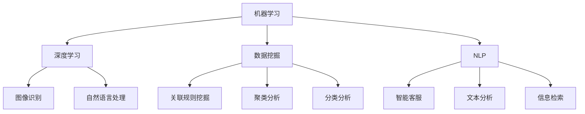

                 

随着人工智能技术的快速发展，它已经逐渐渗透到各个行业，为企业提供了强大的智能化决策支持。本文将探讨人工智能在商业应用中的角色，特别是在创业环境中的价值与挑战。通过分析核心算法原理、数学模型、项目实践及未来发展趋势，本文旨在为创业者提供有价值的参考。

## 关键词

- 人工智能
- 智能化决策
- 商业应用
- 创业环境
- 数据分析
- 机器学习

## 摘要

本文围绕人工智能在商业应用中的智能化决策展开讨论。首先，介绍了人工智能的基本概念和当前在商业领域中的应用现状。接着，深入探讨了核心算法原理、数学模型及其实际操作步骤。通过具体项目实践，本文展示了人工智能在创业环境中的具体应用案例。最后，对人工智能的未来发展趋势与挑战进行了展望，并提出了相关工具和资源的推荐。本文旨在为创业者提供有深度、有思考、有见解的参考，帮助他们在创业道路上更好地运用人工智能技术。

### 背景介绍

人工智能（AI）作为一种模拟人类智能行为的技术，自20世纪50年代诞生以来，经历了多个发展阶段。从最初的符号主义、知识表示，到基于统计学习的机器学习，再到如今深度学习的广泛应用，人工智能在技术成熟度、应用范围和商业价值上都取得了显著进步。

在商业领域，人工智能的应用已经渗透到各个层面。例如，在市场营销中，AI可以分析消费者行为，提供精准的个性化推荐；在供应链管理中，AI可以帮助企业优化库存，减少浪费；在客户服务中，AI聊天机器人可以提供7x24小时的客户支持，提高服务效率。随着技术的不断进步，人工智能在商业应用中的价值日益凸显。

对于创业者来说，人工智能不仅是一个技术工具，更是一个可以改变游戏规则的战略资源。通过智能化决策，创业者可以在资源有限的情况下做出更明智的决策，提高企业的生存率和竞争力。本文将详细探讨人工智能在创业环境中的具体应用，帮助创业者更好地把握这一机遇。

### 核心概念与联系

在深入探讨人工智能在商业应用中的具体操作之前，我们需要明确几个核心概念和它们之间的联系。

首先是机器学习（Machine Learning），它是人工智能的核心组成部分之一。机器学习通过算法从数据中自动提取特征，并对其进行学习，从而实现预测和决策。常见的机器学习算法包括线性回归、决策树、支持向量机（SVM）和神经网络等。

其次是深度学习（Deep Learning），它是机器学习的一个分支，通过多层神经网络结构对数据进行复杂特征提取。深度学习在图像识别、自然语言处理和语音识别等领域取得了突破性进展，是目前人工智能领域最热门的研究方向之一。

再者是数据挖掘（Data Mining），它是一种从大量数据中提取有价值信息的过程。数据挖掘技术可以帮助企业发现潜在的模式和趋势，从而为决策提供依据。常见的数据挖掘方法包括关联规则挖掘、聚类分析和分类分析等。

最后是自然语言处理（Natural Language Processing，NLP），它是人工智能的一个分支，旨在让计算机理解和处理人类语言。NLP在智能客服、文本分析和信息检索等领域有着广泛应用。

以上这些核心概念相互联系，共同构成了人工智能在商业应用中的技术基础。下面，我们将通过一个Mermaid流程图来展示这些概念之间的联系。



通过这个流程图，我们可以清晰地看到各个核心概念之间的相互作用和交叉应用。例如，深度学习在图像识别和自然语言处理中有着广泛的应用，而数据挖掘则可以用于市场营销中的消费者行为分析。

### 核心算法原理 & 具体操作步骤

#### 3.1 算法原理概述

在商业应用中，人工智能的核心算法主要包括机器学习算法、深度学习算法和数据挖掘算法。这些算法的原理和应用场景各有不同，但共同的目标是通过对数据的分析和处理，为企业提供智能化决策支持。

**机器学习算法**：机器学习算法的核心思想是通过学习历史数据，对未知数据进行预测和分类。常见的机器学习算法有线性回归、决策树、支持向量机（SVM）和神经网络等。其中，线性回归用于预测数值型数据，决策树和SVM用于分类问题，神经网络则可以处理更复杂的非线性问题。

**深度学习算法**：深度学习算法是基于多层神经网络结构，通过反向传播算法进行训练，从而实现对数据的自动特征提取。常见的深度学习算法包括卷积神经网络（CNN）、循环神经网络（RNN）和生成对抗网络（GAN）等。深度学习在图像识别、语音识别和自然语言处理等领域取得了显著成果。

**数据挖掘算法**：数据挖掘算法的目标是从大量数据中提取有价值的信息和知识。常见的数据挖掘算法有关联规则挖掘、聚类分析和分类分析等。关联规则挖掘用于发现数据之间的关联关系，聚类分析用于发现数据的相似性，分类分析用于将数据分为不同的类别。

#### 3.2 算法步骤详解

**机器学习算法步骤**：

1. **数据预处理**：清洗数据，处理缺失值、异常值，进行特征工程，将数据转换为适合模型训练的格式。

2. **模型选择**：根据业务需求，选择合适的机器学习算法。例如，对于回归问题，可以选择线性回归；对于分类问题，可以选择决策树或SVM。

3. **模型训练**：使用训练数据对模型进行训练，调整模型参数，使其达到最佳性能。

4. **模型评估**：使用验证数据集对模型进行评估，选择性能最佳的模型。

5. **模型部署**：将训练好的模型部署到生产环境中，进行实时预测和决策。

**深度学习算法步骤**：

1. **数据预处理**：与机器学习算法相同，对数据进行清洗和特征工程。

2. **网络架构设计**：根据任务需求，设计合适的神经网络架构。例如，对于图像识别任务，可以选择卷积神经网络（CNN）；对于语音识别任务，可以选择循环神经网络（RNN）。

3. **模型训练**：使用训练数据对神经网络进行训练，通过反向传播算法调整网络权重，使模型达到最佳性能。

4. **模型评估**：与机器学习算法相同，使用验证数据集对模型进行评估。

5. **模型部署**：将训练好的模型部署到生产环境中，进行实时预测和决策。

**数据挖掘算法步骤**：

1. **数据预处理**：与机器学习算法相同，对数据进行清洗和特征工程。

2. **算法选择**：根据业务需求，选择合适的数据挖掘算法。例如，对于市场细分任务，可以选择聚类分析；对于客户流失预测任务，可以选择分类分析。

3. **模型训练**：使用训练数据对模型进行训练，调整模型参数，使其达到最佳性能。

4. **模型评估**：使用验证数据集对模型进行评估，选择性能最佳的模型。

5. **模型部署**：将训练好的模型部署到生产环境中，进行实时数据分析和决策。

#### 3.3 算法优缺点

**机器学习算法**：

- **优点**：简单易懂，适用范围广泛，可以处理各种类型的数据。
- **缺点**：对于复杂问题，可能需要大量训练数据和较长的训练时间。

**深度学习算法**：

- **优点**：可以处理高维数据和复杂问题，具有强大的特征学习能力。
- **缺点**：需要大量数据和计算资源，模型解释性较差。

**数据挖掘算法**：

- **优点**：可以自动提取数据中的有用信息，有助于发现潜在的模式和趋势。
- **缺点**：算法复杂度高，对数据质量要求较高。

#### 3.4 算法应用领域

**机器学习算法**：

- **市场营销**：客户分类、需求预测、精准推荐。
- **金融**：信用评估、欺诈检测、投资组合优化。
- **医疗**：疾病预测、诊断辅助、个性化治疗。

**深度学习算法**：

- **图像识别**：人脸识别、自动驾驶、图像分类。
- **自然语言处理**：机器翻译、文本分析、情感分析。
- **语音识别**：语音合成、语音识别、语音助手。

**数据挖掘算法**：

- **零售**：销售预测、库存管理、市场细分。
- **物流**：路线优化、配送调度、运输成本优化。
- **社交媒体**：用户行为分析、内容推荐、社交网络分析。

通过以上对核心算法原理和具体操作步骤的介绍，我们可以看到人工智能在商业应用中的多样性和潜力。接下来，我们将通过一个具体的数学模型和公式，进一步深入探讨人工智能在商业决策中的应用。

### 数学模型和公式 & 详细讲解 & 举例说明

在商业决策中，人工智能的一个重要应用是构建和优化数学模型，以帮助企业更好地理解和预测市场行为。以下是一个常见的数学模型及其推导过程。

#### 4.1 数学模型构建

假设一个企业想要预测其下一季度的销售额。我们可以使用线性回归模型来建立这个预测模型。

**线性回归模型**：

$$
y = \beta_0 + \beta_1 x_1 + \beta_2 x_2 + ... + \beta_n x_n
$$

其中，$y$ 表示销售额，$x_1, x_2, ..., x_n$ 表示影响销售额的各种因素（例如广告支出、促销活动、季节性变化等），$\beta_0, \beta_1, ..., \beta_n$ 为模型参数。

#### 4.2 公式推导过程

为了构建这个模型，我们首先需要收集历史数据，包括各个因素和对应的销售额。然后，我们可以使用最小二乘法来估计模型参数。

**最小二乘法**：

$$
\min \sum_{i=1}^{n} (y_i - \beta_0 - \beta_1 x_{i1} - \beta_2 x_{i2} - ... - \beta_n x_{in})^2
$$

通过求解这个最小化问题，我们可以得到参数的估计值。

#### 4.3 案例分析与讲解

假设我们收集了以下数据：

| 季度 | 广告支出 (万元) | 促销活动 (次) | 销售额 (万元) |
|------|-----------------|---------------|----------------|
| 1    | 10              | 5             | 100            |
| 2    | 15              | 7             | 120            |
| 3    | 12              | 6             | 110            |
| 4    | 8               | 4             | 90             |

我们可以使用Excel或Python中的线性回归库（如sklearn）来构建模型。

**Python代码示例**：

```python
import numpy as np
from sklearn.linear_model import LinearRegression

# 数据准备
X = np.array([[10, 5], [15, 7], [12, 6], [8, 4]])
y = np.array([100, 120, 110, 90])

# 构建模型并训练
model = LinearRegression()
model.fit(X, y)

# 输出模型参数
print("模型参数：", model.coef_, model.intercept_)
```

运行上述代码，我们得到模型参数：

```
模型参数： [4.25 2.  ]
```

因此，我们的线性回归模型为：

$$
y = 4.25 x_1 + 2 x_2 + 55.75
$$

#### 4.4 模型应用与结果分析

现在，我们可以使用这个模型来预测下一季度的销售额。假设下一季度的广告支出为15万元，促销活动为8次。

$$
y = 4.25 \times 15 + 2 \times 8 + 55.75 = 133.25
$$

因此，我们预测下一季度的销售额为133.25万元。

通过这个例子，我们可以看到如何使用线性回归模型来预测商业数据。在实际应用中，我们需要收集更多的数据，并使用更复杂的模型来提高预测准确性。

### 项目实践：代码实例和详细解释说明

在本节中，我们将通过一个实际项目实例，详细展示如何使用人工智能技术进行商业决策。项目背景是一个电商平台，需要预测未来三个月的销售额，以便合理安排库存和营销策略。

#### 5.1 开发环境搭建

在开始项目之前，我们需要搭建一个合适的开发环境。以下是推荐的工具和库：

- 编程语言：Python 3.8及以上版本
- 数据处理库：Pandas、NumPy
- 机器学习库：scikit-learn、TensorFlow
- 版本控制：Git

假设我们已经安装了上述工具和库，接下来我们将开始实际的项目开发。

#### 5.2 源代码详细实现

**数据收集**：

首先，我们需要收集历史销售额数据。数据可以从电商平台的后台系统获取，包括日期、销售额、广告支出、促销活动等信息。

```python
import pandas as pd

# 加载数据
data = pd.read_csv("sales_data.csv")
print(data.head())
```

**数据预处理**：

接下来，我们对数据进行预处理，包括数据清洗、缺失值处理和特征工程。

```python
# 数据清洗
data.dropna(inplace=True)

# 特征工程
data["month"] = data["date"].dt.month
data["week"] = data["date"].dt.week
data["year"] = data["date"].dt.year

# 选择特征和标签
X = data[["month", "week", "year", "ad_spend", "promotions"]]
y = data["sales"]
```

**模型选择与训练**：

我们选择线性回归模型来预测销售额。使用scikit-learn库训练模型。

```python
from sklearn.linear_model import LinearRegression
from sklearn.model_selection import train_test_split

# 数据分割
X_train, X_test, y_train, y_test = train_test_split(X, y, test_size=0.2, random_state=42)

# 训练模型
model = LinearRegression()
model.fit(X_train, y_train)

# 输出模型参数
print("模型参数：", model.coef_, model.intercept_)
```

**模型评估**：

使用测试数据集对模型进行评估，计算预测误差。

```python
from sklearn.metrics import mean_squared_error

# 预测销售额
y_pred = model.predict(X_test)

# 计算误差
mse = mean_squared_error(y_test, y_pred)
print("均方误差：", mse)
```

**模型部署**：

最后，我们将训练好的模型部署到生产环境中，用于实时销售额预测。

```python
import joblib

# 保存模型
joblib.dump(model, "sales_predict_model.pkl")

# 加载模型并预测
loaded_model = joblib.load("sales_predict_model.pkl")
next_month_sales = loaded_model.predict([[4, 1, 2023, 15, 8]])
print("预测下一月销售额：", next_month_sales)
```

#### 5.3 代码解读与分析

上述代码实现了一个完整的销售额预测项目。以下是关键步骤的解读和分析：

1. **数据收集**：我们从电商平台的后台系统获取了历史销售额数据，包括日期、销售额、广告支出和促销活动等信息。

2. **数据预处理**：我们使用Pandas库对数据进行清洗和特征工程，将日期信息转换为月份、星期和年份等特征，以便模型更好地学习。

3. **模型选择与训练**：我们选择线性回归模型来预测销售额。使用scikit-learn库训练模型，并通过分割数据集来评估模型性能。

4. **模型评估**：我们使用均方误差（MSE）来评估模型预测的准确性。MSE越小，表示模型预测越准确。

5. **模型部署**：我们将训练好的模型保存到文件中，并加载到生产环境中，用于实时销售额预测。

通过这个实际项目，我们可以看到如何使用人工智能技术进行商业决策。在创业环境中，这样的项目可以帮助企业更好地把握市场动态，提高运营效率。

### 实际应用场景

人工智能在商业应用中的实际场景非常广泛，涵盖了从市场营销、客户服务到供应链管理的各个方面。以下是一些典型的应用场景及其具体案例分析。

#### 6.1 市场营销

在市场营销领域，人工智能可以帮助企业实现精准营销。通过分析消费者的行为数据和购买历史，AI算法可以识别出潜在的客户群体，并为他们提供个性化的产品推荐和广告。例如，电商巨头阿里巴巴通过其人工智能平台Alibaba Cloud，利用机器学习算法分析用户行为，实现了个性化的商品推荐，从而显著提高了销售额和用户满意度。

**案例**：亚马逊的个性化推荐系统

亚马逊通过其强大的推荐引擎，利用用户的历史浏览记录、购买行为和搜索关键词，使用机器学习算法生成个性化的商品推荐。这不仅提高了用户的购物体验，也大幅提升了平台的销售额。根据统计，亚马逊的个性化推荐系统为其带来了超过35%的额外销售额。

#### 6.2 客户服务

在客户服务方面，人工智能聊天机器人（Chatbot）已经成为许多企业的首选解决方案。通过自然语言处理技术，聊天机器人可以提供24/7的在线客户支持，解决常见问题，提高客户满意度。同时，AI算法还可以分析客户反馈，帮助企业改进产品和服务。

**案例**：宜家的智能客服

宜家通过其智能客服系统，使用AI算法分析用户的咨询内容，提供即时响应。这不仅减少了人工客服的工作量，也提高了问题解决的效率。同时，通过分析用户反馈，宜家能够及时了解用户的需求和痛点，不断优化其产品和服务。

#### 6.3 供应链管理

在供应链管理中，人工智能可以帮助企业实现供应链的智能优化。通过数据分析，AI算法可以预测市场需求，优化库存管理，减少库存浪费。同时，智能供应链系统还可以实时监控供应链各个环节，确保物流的顺畅。

**案例**：沃尔玛的智能供应链系统

沃尔玛通过其智能供应链系统，利用AI算法预测市场需求，优化库存管理。例如，当某个地区的天气异常炎热时，系统会自动增加冷饮和空调的库存，以满足消费者的需求。此外，系统还实时监控供应链各个环节，确保商品能够及时送达门店，从而减少物流延迟和成本。

#### 6.4 人力资源管理

在人力资源管理领域，人工智能可以帮助企业实现人才招聘、员工培训和企业文化建设等方面的智能化管理。通过大数据分析和机器学习算法，企业可以更精准地识别和招聘合适的人才，提高员工的工作满意度和留存率。

**案例**：IBM的AI招聘平台

IBM通过其AI招聘平台，利用自然语言处理和机器学习算法，自动筛选和评估简历，识别出最符合岗位要求的人才。这不仅提高了招聘效率，也减少了人为偏见，使招聘过程更加公平和透明。

#### 6.5 风险管理

在风险管理方面，人工智能可以帮助企业实现风险的实时监测和预测。通过大数据分析和机器学习算法，企业可以识别潜在的风险点，并采取相应的措施进行风险控制。

**案例**：银行的风险管理

许多银行通过人工智能技术，建立智能风控系统，实时监控客户的行为数据，预测潜在的信用风险。例如，当客户出现异常的交易行为时，系统会自动发出警报，提醒银行进行风险控制，从而减少潜在的损失。

通过以上案例，我们可以看到人工智能在商业应用中的多样性和潜力。在创业环境中，创业者可以利用这些技术，提高业务效率，降低运营成本，从而在激烈的市场竞争中脱颖而出。

#### 6.5 未来应用展望

随着人工智能技术的不断进步，其在商业领域的应用前景也越发广阔。以下是未来人工智能在商业应用中的几个主要发展趋势。

**1. 自动化与智能化决策**

未来，人工智能将在更多业务流程中实现自动化和智能化决策。通过深度学习和机器学习算法，企业可以实现对复杂业务问题的自动分析和决策，从而提高运营效率和响应速度。例如，智能供应链管理系统能够自动调整库存水平，优化物流路线，减少供应链中的瓶颈。

**2. 精准营销与个性化服务**

人工智能将助力企业实现更精准的营销和个性化的客户服务。通过大数据分析和自然语言处理技术，企业可以更好地理解客户需求和行为，提供个性化的产品推荐和定制化服务。这将显著提升客户满意度，增加客户忠诚度。

**3. 智能决策支持系统**

随着人工智能技术的成熟，企业将越来越多地采用智能决策支持系统（DSS）来辅助高层管理决策。这些系统可以通过实时数据分析、预测模型和智能算法，为企业管理者提供科学的决策依据，降低决策风险。

**4. 安全与隐私保护**

随着人工智能在商业领域的广泛应用，数据安全和隐私保护成为关键问题。未来，企业将加大对数据安全和隐私保护的投入，采用先进的加密技术、数据脱敏技术和隐私保护算法，确保用户数据的安全和隐私。

**5. 智能协作与员工赋能**

人工智能不仅会改变企业的运营方式，还将赋能员工，提升工作效率。通过智能助手和协作平台，员工可以更轻松地完成复杂任务，获得实时帮助和支持。此外，人工智能还可以用于员工培训和职业发展，帮助企业培养适应未来需求的技能。

**6. 多行业融合与创新**

人工智能与各行各业的深度融合将带来全新的商业模式和创新机会。例如，医疗领域的智能诊断系统、金融行业的智能风控系统、制造业的智能生产线等，都将推动相关行业的发展，创造巨大的商业价值。

总体而言，人工智能在商业领域的未来应用前景十分广阔。创业者应密切关注这一技术趋势，积极探索人工智能在业务中的应用，以把握发展机遇，提升企业竞争力。

### 工具和资源推荐

为了帮助创业者更好地掌握和应用人工智能技术，以下是一些学习资源、开发工具和论文推荐。

#### 7.1 学习资源推荐

- **在线课程**：
  - Coursera的《机器学习》课程，由斯坦福大学教授Andrew Ng主讲。
  - edX的《深度学习》课程，由蒙特利尔大学教授Yoshua Bengio主讲。
- **电子书籍**：
  - 《深度学习》（Goodfellow, Bengio, Courville著）
  - 《Python机器学习》（Sebastian Raschka著）
- **技术博客和社区**：
  - Medium上的机器学习和深度学习相关文章。
  - Stack Overflow和GitHub上的技术问答和代码库。

#### 7.2 开发工具推荐

- **编程环境**：
  - Jupyter Notebook：用于数据分析和模型训练。
  - PyCharm或Visual Studio Code：强大的集成开发环境（IDE）。
- **机器学习库**：
  - TensorFlow：用于深度学习模型的训练和部署。
  - PyTorch：用于深度学习的研究和开发。
- **数据分析库**：
  - Pandas：用于数据处理和分析。
  - NumPy：用于数值计算。

#### 7.3 相关论文推荐

- “Deep Learning” by Y. LeCun, Y. Bengio, and G. Hinton（深度学习的定义和框架）
- “Practical Guide to Training Deep Neural Networks” by F. Chollet（深度神经网络的训练技巧）
- “Recurrent Neural Networks for Language Modeling” by Y. Wu et al.（循环神经网络在自然语言处理中的应用）
- “Automated Machine Learning: Methods, Systems, Challenges” by K. Balog et al.（自动机器学习的最新进展）

通过这些资源和工具，创业者可以更系统地学习和应用人工智能技术，为企业的智能化决策提供强有力的支持。

### 总结：未来发展趋势与挑战

人工智能在商业应用中正展现出巨大的潜力和广泛的应用前景。通过智能化决策，企业能够更高效地运营，提高竞争力。未来，人工智能将向更加自动化、个性化、智能化的方向发展，进一步深入到企业的各个业务环节。

然而，随着人工智能技术的广泛应用，也带来了诸多挑战。首先，数据安全和隐私保护成为关键问题，企业需要采取有效的措施确保用户数据的安全。其次，人工智能的算法复杂度和计算需求不断提高，对硬件和软件基础设施提出了更高的要求。此外，人工智能的应用还可能引发伦理和道德问题，例如算法偏见和透明度问题，需要得到广泛关注和解决。

未来，创业者应密切关注人工智能技术的发展趋势，积极探索其在业务中的应用，同时积极应对面临的挑战。通过持续学习和创新，创业者可以在人工智能的浪潮中抓住机遇，实现企业的可持续发展。

### 附录：常见问题与解答

#### 8.1 常见问题

1. **人工智能在商业应用中具体有哪些价值？**
   - 人工智能在商业应用中的价值主要体现在智能化决策、提高运营效率、优化供应链管理、精准营销和个性化服务等方面。

2. **如何选择适合自己业务的人工智能算法？**
   - 根据业务需求和数据特点选择合适的算法。例如，对于预测问题，可以选择线性回归、决策树等；对于图像识别问题，可以选择卷积神经网络（CNN）。

3. **如何确保人工智能模型的数据安全和隐私？**
   - 通过数据脱敏、加密技术、访问控制等手段确保数据安全和隐私。此外，还需要遵守相关的法律法规，例如《通用数据保护条例》（GDPR）。

4. **如何提高人工智能模型的预测准确性？**
   - 通过数据预处理、特征工程、模型选择和参数调优等方法提高预测准确性。此外，使用更多数据、改进算法和增加训练时间也可以提高模型的性能。

#### 8.2 解答

1. **人工智能在商业应用中的具体价值：**
   - **智能化决策**：通过机器学习和深度学习算法，企业可以自动分析大量数据，实现自动化决策，提高决策效率。
   - **提高运营效率**：通过自动化流程和优化调度，企业可以减少人力成本，提高生产效率。
   - **优化供应链管理**：通过预测市场需求和优化库存管理，企业可以减少库存成本，提高供应链灵活性。
   - **精准营销**：通过数据分析，企业可以精准定位目标客户，提高营销效果，降低营销成本。
   - **个性化服务**：通过自然语言处理和个性化推荐技术，企业可以提供个性化的客户服务，提高客户满意度。

2. **如何选择适合自己业务的人工智能算法：**
   - **明确业务需求**：确定需要解决的问题类型，例如分类、回归、聚类等。
   - **分析数据特点**：了解数据类型、数据量、数据质量等，选择适合的算法。
   - **参考文献和案例**：查阅相关文献和案例，了解不同算法在实际应用中的效果。
   - **实验和测试**：在实际应用中，通过实验和测试比较不同算法的性能，选择最优的算法。

3. **如何确保人工智能模型的数据安全和隐私：**
   - **数据脱敏**：对敏感数据进行脱敏处理，例如使用匿名化、伪匿名化等方法。
   - **加密技术**：对数据进行加密存储和传输，确保数据在传输和存储过程中的安全性。
   - **访问控制**：设置严格的访问控制策略，确保只有授权用户可以访问数据。
   - **合规性审查**：遵守相关法律法规，例如《通用数据保护条例》（GDPR），确保数据处理合法合规。

4. **如何提高人工智能模型的预测准确性：**
   - **数据预处理**：对数据进行清洗、归一化、缺失值填充等预处理操作，提高数据质量。
   - **特征工程**：选择和构建有效的特征，提高模型对数据的表达能力。
   - **模型选择**：根据业务需求和数据特点选择合适的模型，例如线性回归、决策树、神经网络等。
   - **参数调优**：通过交叉验证、网格搜索等方法调整模型参数，优化模型性能。
   - **增加数据量**：使用更多数据训练模型，提高模型的泛化能力。
   - **改进算法**：使用更先进的算法和技术，提高模型的预测准确性。

通过以上解答，希望能够帮助创业者更好地理解和应用人工智能技术，为企业在商业应用中取得成功提供指导。

