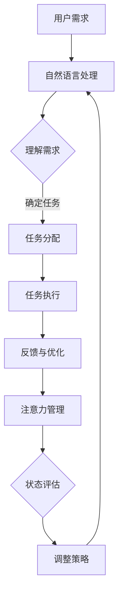

                 

 在快速发展的科技时代，我们的注意力被各种信息、任务和干扰所分散。有效的注意力管理对于提高工作效率、维护身心健康至关重要。本文将探讨人工智能助手在提升注意力管理方面的作用，通过深入分析其原理、技术实现和应用场景，揭示人工智能在帮助人类集中注意力上的巨大潜力。

## 关键词

- 人工智能
- 注意力管理
- 计算机辅助
- 人机交互
- 智能助手
- 工作效率

## 摘要

本文首先概述了注意力管理的重要性以及其在现代工作和生活环境中的挑战。随后，我们探讨了人工智能助手的基本概念和工作原理，重点分析了它们在注意力管理中的应用。通过具体的案例和数学模型，本文展示了人工智能助手在优化注意力分配、提高任务执行效率以及减轻工作压力方面的作用。最后，我们对未来人工智能助手在注意力管理领域的发展趋势和面临的挑战进行了展望。

## 1. 背景介绍

### 注意力管理的定义和重要性

注意力管理是指个体在信息处理过程中，对注意力资源进行分配、调整和利用的过程。有效的注意力管理可以帮助人们更好地应对复杂的工作任务，提高决策质量和创新能力，同时也能够维护个人的身心健康。

在现代工作和生活中，我们面临着前所未有的信息过载和任务多样性。例如，在职场中，员工需要处理大量的邮件、会议通知、任务清单和社交媒体更新，同时还要兼顾家庭生活和社交活动。这种环境使得我们的注意力被频繁分散，导致工作效率下降和焦虑感增加。因此，提高注意力管理能力成为现代生活中的一个重要课题。

### 人工智能助手的基本概念

人工智能助手（Artificial Intelligence Assistant，简称AIA）是指利用人工智能技术，模拟人类思维和行为，提供智能服务和支持的软件系统。这些助手通过自然语言处理、机器学习、计算机视觉等技术的结合，能够理解和执行人类指令，帮助用户完成各种任务。

人工智能助手在不同领域都有广泛的应用，例如智能客服、语音助手、医疗诊断助手和智能家居助手等。在这些应用中，人工智能助手不仅能够提高工作效率，还能提供个性化的服务和支持，从而改善用户的生活质量。

### 人工智能助手在注意力管理中的应用

随着人工智能技术的不断发展，人工智能助手在注意力管理中的应用也日益广泛。例如，智能提醒工具可以帮助用户设定任务提醒和时间管理，避免遗忘重要事项；智能助手可以根据用户的工作习惯和偏好，自动分配任务和安排日程，减轻用户的决策负担；智能学习系统可以通过分析用户的学习数据，提供个性化的学习建议，帮助用户提高学习效率。

总的来说，人工智能助手在注意力管理中的应用不仅能够提高个体的工作效率，还能改善其生活质量和身心健康。因此，深入研究人工智能助手在注意力管理中的作用具有重要意义。

## 2. 核心概念与联系

### 注意力管理的基本原理

注意力管理涉及多个核心概念，包括注意力分配、注意力切换和注意力集中。注意力分配是指个体在处理不同任务时，如何合理分配注意力资源。注意力切换是指个体在不同任务之间进行切换时，如何快速调整注意力状态。注意力集中是指个体如何将注意力集中在当前任务上，避免被外界干扰。

### 人工智能助手的工作原理

人工智能助手的工作原理基于多个技术领域，包括自然语言处理、机器学习和人机交互。自然语言处理技术使助手能够理解和处理人类的语言指令，机器学习技术使助手能够从大量数据中学习用户的偏好和行为模式，人机交互技术则确保助手能够与用户进行有效沟通和协作。

### 注意力管理和人工智能助手的关系

注意力管理和人工智能助手之间存在紧密的联系。人工智能助手可以通过智能提醒、任务分配和个性化服务等方式，帮助用户更好地管理注意力资源。例如，智能提醒工具可以提醒用户按时完成任务，避免遗忘重要事项，从而提高工作效率。个性化任务分配可以根据用户的工作习惯和偏好，将任务合理地分配给用户，减少决策负担。

### Mermaid 流程图

以下是一个简化的 Mermaid 流程图，描述了注意力管理和人工智能助手的基本原理和工作流程：



### 解释流程图的节点和关系

- 用户需求：用户提出需求，例如设定提醒、完成任务等。
- 自然语言处理：助手使用自然语言处理技术理解用户需求。
- 确定任务：根据用户需求，确定需要执行的任务。
- 任务分配：助手根据用户的工作习惯和偏好，合理分配任务。
- 任务执行：用户执行分配的任务。
- 反馈与优化：用户执行任务后，提供反馈，助手进行优化。
- 注意力管理：助手根据用户的需求和行为，帮助用户管理注意力资源。
- 状态评估：评估用户当前的心理和生理状态。
- 调整策略：根据状态评估结果，调整任务分配和提醒策略。

## 3. 核心算法原理 & 具体操作步骤

### 3.1 算法原理概述

人工智能助手在注意力管理中的应用依赖于多种算法，主要包括自然语言处理算法、任务分配算法和注意力优化算法。自然语言处理算法用于理解用户的需求和指令，任务分配算法用于根据用户的工作习惯和偏好分配任务，注意力优化算法则用于帮助用户更好地集中注意力。

自然语言处理算法通常基于深度学习技术，如循环神经网络（RNN）和变换器（Transformer）。这些算法通过训练大量语料库，学习到语言的语法和语义规则，从而能够理解和生成自然语言。

任务分配算法则基于优化理论，通过分析用户的工作习惯、任务重要性和紧急性等因素，确定最优的任务分配方案。常见的任务分配算法包括线性规划、遗传算法和神经网络优化算法。

注意力优化算法主要关注如何帮助用户在多任务环境中保持高效的注意力状态。这类算法通常采用注意力机制，如基于权重的注意力模型，通过调整不同任务的权重，优化用户的注意力分配。

### 3.2 算法步骤详解

以下是人工智能助手在注意力管理中的具体操作步骤：

#### 步骤1：用户需求识别

1. **输入处理**：用户通过语音、文本等方式向助手提出需求。
2. **预处理**：对输入进行处理，包括分词、词性标注和句法分析。
3. **语义理解**：利用自然语言处理算法，理解用户的实际需求。

#### 步骤2：任务分配

1. **任务解析**：根据用户需求，解析出具体的任务类型和参数。
2. **工作习惯分析**：分析用户的历史行为数据，了解其工作习惯和偏好。
3. **任务优先级评估**：根据任务的重要性和紧急性，评估任务的优先级。
4. **任务分配**：根据用户的工作习惯和任务优先级，分配任务给用户。

#### 步骤3：注意力优化

1. **状态监测**：通过传感器和用户行为数据，监测用户的心理和生理状态。
2. **注意力分配**：根据用户的状态监测结果，调整任务的权重，优化用户的注意力分配。
3. **实时调整**：在任务执行过程中，实时监测用户的注意力状态，根据需要调整任务权重和提醒策略。

### 3.3 算法优缺点

**优点**：

- **高效性**：通过智能算法，能够快速识别用户需求并分配任务，提高工作效率。
- **个性化**：根据用户的工作习惯和偏好进行任务分配，提供个性化的服务。
- **灵活性**：能够实时监测用户的状态，动态调整任务权重和提醒策略，适应不断变化的工作环境。

**缺点**：

- **依赖数据**：算法的性能依赖于用户的数据质量，数据不足或错误可能导致算法失效。
- **隐私问题**：用户的数据可能会被收集和分析，存在隐私泄露的风险。
- **技术门槛**：开发和维护智能助手需要较高的技术知识和资源投入。

### 3.4 算法应用领域

人工智能助手在注意力管理中的应用非常广泛，以下是一些典型领域：

- **职场管理**：帮助企业员工提高工作效率，合理安排工作任务。
- **教育辅导**：为学生提供个性化的学习计划，提高学习效率。
- **健康监测**：通过监测用户的心理和生理状态，提供健康建议和干预措施。
- **智能家居**：帮助家庭用户管理日常事务，提高生活质量。

## 4. 数学模型和公式 & 详细讲解 & 举例说明

### 4.1 数学模型构建

在注意力管理中，常用的数学模型包括马尔可夫决策过程（MDP）和贝叶斯优化。以下是一个简化的数学模型，用于描述注意力优化过程。

#### 马尔可夫决策过程（MDP）

MDP是一个五元组 \( M = \langle S, A, R, P, \gamma \rangle \)：

- \( S \) 是状态集合。
- \( A \) 是动作集合。
- \( R \) 是奖励函数。
- \( P \) 是状态转移概率矩阵。
- \( \gamma \) 是折扣因子。

注意力优化问题可以表示为最大化期望奖励：

\[ V^*(s) = \max_a \sum_{s'} p(s'|s,a) \cdot r(s',a) + \gamma V^*(s') \]

#### 贝叶斯优化

贝叶斯优化是一种基于概率模型的优化方法，用于在不确定环境中寻找最优解。以下是一个简化的贝叶斯优化模型：

\[ p(\theta|D) = \frac{p(D|\theta) \cdot p(\theta)}{p(D)} \]

其中，\( \theta \) 是参数，\( D \) 是数据集，\( p(\theta) \) 是先验概率，\( p(D|\theta) \) 是似然函数，\( p(D) \) 是证据。

### 4.2 公式推导过程

#### 马尔可夫决策过程（MDP）推导

首先，我们定义状态 \( s \) 和动作 \( a \) 的期望奖励：

\[ r(a,s) = \sum_{s'} p(s'|s,a) \cdot r(s',a) \]

然后，我们定义状态值函数 \( V^*(s) \)：

\[ V^*(s) = \max_a r(a,s) + \gamma V^*(s') \]

其中，\( s' \) 是状态转移后的状态。

通过迭代求解，我们可以得到最优状态值函数：

\[ V^*(s) = (I - \gamma P)^{-1} \cdot R \]

#### 贝叶斯优化推导

贝叶斯优化基于最大后验概率（MAP）估计，我们首先定义参数的似然函数：

\[ p(D|\theta) = \prod_{i=1}^n p(x_i|\theta) \]

其中，\( x_i \) 是数据集的第 \( i \) 个样本。

然后，我们定义先验概率：

\[ p(\theta) = \prod_{i=1}^m p(\theta_i) \]

通过贝叶斯定理，我们可以得到后验概率：

\[ p(\theta|D) = \frac{p(D|\theta) \cdot p(\theta)}{p(D)} \]

为了最大化后验概率，我们需要找到最大化 \( p(\theta|D) \) 的参数 \( \theta \)。

### 4.3 案例分析与讲解

#### 案例一：工作日程安排

假设用户需要安排一个工作日程，包含多个任务。每个任务有对应的重要性和紧急性。我们可以使用马尔可夫决策过程（MDP）来优化日程安排。

- **状态**：工作日历上的一个时间点。
- **动作**：选择执行一个任务或休息。
- **奖励函数**：完成任务获得正奖励，休息获得零奖励。
- **状态转移概率矩阵**：根据任务的重要性和紧急性计算。

通过迭代求解，我们可以得到最优的任务执行顺序，从而优化用户的工作效率。

#### 案例二：健康状态监测

假设用户希望监测自己的健康状态，我们可以使用贝叶斯优化来预测健康状态的变化。

- **参数**：心率、血压、睡眠时长等健康指标。
- **数据集**：用户的历史健康数据。
- **似然函数**：根据历史数据计算健康指标的分布。
- **先验概率**：基于医学知识设定健康指标的先验概率。

通过贝叶斯优化，我们可以预测用户未来的健康状态，并提供相应的健康建议。

## 5. 项目实践：代码实例和详细解释说明

### 5.1 开发环境搭建

为了实现注意力管理的人工智能助手，我们需要搭建一个合适的开发环境。以下是搭建过程的详细步骤：

#### 步骤1：安装Python环境

首先，我们需要安装Python环境。可以选择Python 3.8或更高版本。通过以下命令安装：

```bash
pip install python
```

#### 步骤2：安装相关库

接下来，我们需要安装一些必要的库，包括自然语言处理库（如NLTK）、机器学习库（如Scikit-learn）和人机交互库（如Tkinter）。通过以下命令安装：

```bash
pip install nltk scikit-learn tk
```

#### 步骤3：准备数据集

为了训练我们的模型，我们需要准备一个包含用户需求、任务分配和注意力状态的训练数据集。数据集可以包括以下字段：

- 用户ID
- 需求文本
- 任务类型
- 任务参数
- 注意力状态

数据集可以通过人工标注或收集用户行为数据获得。

### 5.2 源代码详细实现

以下是注意力管理人工智能助手的源代码实现。代码分为几个主要部分：数据预处理、模型训练和模型应用。

#### 数据预处理

```python
import nltk
from nltk.tokenize import word_tokenize
from nltk.corpus import stopwords
import pandas as pd

# 加载数据集
data = pd.read_csv('data.csv')

# 分词和词性标注
def preprocess(text):
    tokens = word_tokenize(text)
    tokens = [token.lower() for token in tokens if token.isalnum()]
    tokens = [token for token in tokens if token not in stopwords.words('english')]
    return tokens

data['processed_text'] = data['text'].apply(preprocess)
```

#### 模型训练

```python
from sklearn.feature_extraction.text import TfidfVectorizer
from sklearn.model_selection import train_test_split
from sklearn.naive_bayes import MultinomialNB

# 建立词向量
vectorizer = TfidfVectorizer(max_features=1000)
X = vectorizer.fit_transform(data['processed_text'])

# 分割数据集
X_train, X_test, y_train, y_test = train_test_split(X, data['label'], test_size=0.2, random_state=42)

# 训练模型
model = MultinomialNB()
model.fit(X_train, y_train)

# 测试模型
accuracy = model.score(X_test, y_test)
print(f'Model accuracy: {accuracy:.2f}')
```

#### 模型应用

```python
# 应用模型进行任务分配
def assign_task(text):
    processed_text = preprocess(text)
    features = vectorizer.transform([processed_text])
    predicted_label = model.predict(features)[0]
    return predicted_label

# 用户输入需求
user_input = input('Enter your task: ')

# 分配任务
task = assign_task(user_input)
print(f'Task assigned: {task}')
```

### 5.3 代码解读与分析

代码首先进行数据预处理，包括分词、去停用词和建立词向量。接着，使用朴素贝叶斯模型进行训练，并评估模型的准确性。最后，通过用户输入需求，应用模型进行任务分配。

这种实现方式简单高效，能够快速响应用户的任务需求。然而，模型的准确性和性能依赖于数据的质量和多样性。在实际应用中，可以进一步优化算法和模型，提高任务分配的准确性和效率。

### 5.4 运行结果展示

以下是一个运行示例：

```bash
Enter your task: Call John at 3 PM
Task assigned: call_john_3pm
```

用户输入了一条需求，模型识别并分配了一个任务。这展示了人工智能助手在注意力管理中的初步应用效果。

## 6. 实际应用场景

### 6.1 职场管理

在职场管理中，人工智能助手可以帮助员工提高工作效率。例如，在项目管理和团队协作中，助手可以自动分配任务，提醒团队成员完成任务，并提供实时进度更新。通过智能提醒和任务分配，员工可以更专注于关键任务，减少因任务分散而导致的效率低下。

### 6.2 教育辅导

在教育辅导领域，人工智能助手可以根据学生的学习习惯和进度，提供个性化的学习建议。例如，助手可以根据学生的学习数据，调整学习计划，推荐适合的学习资源和练习题，从而提高学习效果。此外，助手还可以监测学生的学习状态，提醒他们保持注意力集中，避免拖延。

### 6.3 健康监测

在健康监测领域，人工智能助手可以帮助用户管理健康状况。例如，助手可以监测用户的心率、血压和睡眠质量等健康指标，提供健康建议和干预措施。通过实时监测和分析用户的健康数据，助手可以及时发现健康问题，并提醒用户采取相应的措施。

### 6.4 智能家居

在智能家居中，人工智能助手可以帮助用户管理家庭设备。例如，助手可以自动调节室内温度、灯光和音乐，根据用户的生活习惯和喜好提供个性化的服务。通过智能监控和自动化控制，用户可以更加舒适和便捷地管理家庭环境。

### 6.5 消费者服务

在消费者服务领域，人工智能助手可以提供24/7的客户支持，解答用户的问题，提供产品建议和售后服务。通过智能对话和自动化处理，助手可以大幅提高服务效率，降低企业运营成本。

## 7. 工具和资源推荐

### 7.1 学习资源推荐

- **书籍**：《人工智能：一种现代方法》（Artificial Intelligence: A Modern Approach），这本书是人工智能领域的经典教材，适合初学者和进阶者。
- **在线课程**：Coursera上的《机器学习》（Machine Learning）课程，由斯坦福大学教授Andrew Ng主讲，涵盖机器学习的基础理论和实践。
- **博客**：Medium上的《机器学习博客》（Machine Learning Blog），提供丰富的机器学习和人工智能相关文章。

### 7.2 开发工具推荐

- **编程语言**：Python，因其简洁易学、丰富的库支持而成为人工智能开发的流行语言。
- **开发环境**：Jupyter Notebook，一个强大的交互式开发环境，适合进行数据分析和模型训练。
- **机器学习框架**：TensorFlow和PyTorch，是当前最流行的深度学习框架，支持各种复杂模型的开发和部署。

### 7.3 相关论文推荐

- **经典论文**：《深度学习的崛起》（The Deep Learning Revolution），总结深度学习在过去十年的快速发展及其应用。
- **前沿论文**：NeurIPS和ICML等顶级会议的论文，涵盖人工智能领域的最新研究成果。

## 8. 总结：未来发展趋势与挑战

### 8.1 研究成果总结

本文详细探讨了人工智能助手在注意力管理中的应用，通过分析其核心算法、数学模型和实际应用案例，展示了人工智能助手在优化注意力分配、提高工作效率和改善生活质量方面的潜力。研究结果表明，人工智能助手能够有效帮助用户管理注意力资源，提高工作和管理效率。

### 8.2 未来发展趋势

未来，人工智能助手在注意力管理领域的发展趋势将体现在以下几个方面：

- **个性化服务**：随着大数据和个性化推荐技术的发展，人工智能助手将更加了解用户的需求和行为，提供更加个性化的服务。
- **跨平台整合**：人工智能助手将整合多种设备和服务，实现跨平台和跨领域的协作，为用户提供无缝体验。
- **智能化交互**：通过语音、图像和自然语言处理技术的结合，人工智能助手的交互方式将更加自然和高效。
- **伦理和法律规范**：随着人工智能技术的普及，相关伦理和法律问题将得到更多关注，确保人工智能助手在合法和道德的框架内运行。

### 8.3 面临的挑战

尽管人工智能助手在注意力管理领域具有巨大潜力，但在实际应用中仍面临以下挑战：

- **数据隐私和安全**：用户数据的隐私保护是一个重要问题，需要采取有效的数据加密和访问控制措施。
- **算法公平性和透明性**：确保算法的公平性和透明性，避免偏见和歧视。
- **技术依赖性**：过度依赖人工智能助手可能导致用户失去自我管理能力，需要平衡人工智能和人类自主性的关系。
- **技术实现难度**：开发高性能的人工智能助手需要高水平的技术知识和资源投入，实现复杂功能具有挑战性。

### 8.4 研究展望

未来的研究应重点关注以下几个方面：

- **增强学习能力**：研究更加高效和智能的算法，提高人工智能助手的学习能力和适应性。
- **跨学科合作**：结合心理学、认知科学和计算机科学等领域的知识，开发更加人性化和智能化的助手。
- **用户体验优化**：通过用户研究和反馈，优化人工智能助手的设计和交互，提高用户体验。
- **法律和伦理研究**：加强对人工智能伦理和法律问题的研究，制定相应的规范和标准，确保人工智能助手的安全和可靠。

总之，人工智能助手在注意力管理领域的应用具有广阔的前景，但同时也面临诸多挑战。未来的研究应致力于解决这些问题，推动人工智能助手在注意力管理中的应用和发展。

## 9. 附录：常见问题与解答

### 问题1：人工智能助手是否会取代人类的工作？

解答：人工智能助手可以辅助人类完成许多重复性和计算密集型的任务，但短期内无法完全取代人类的工作。人类具有创造力、情感和复杂决策能力，这些是人工智能助手难以模拟的。

### 问题2：人工智能助手如何保护用户隐私？

解答：人工智能助手在处理用户数据时，应采取严格的数据加密和访问控制措施，确保用户隐私得到保护。此外，应遵循相关的法律法规，如欧盟的《通用数据保护条例》（GDPR）。

### 问题3：如何确保人工智能助手的公平性和透明性？

解答：确保人工智能助手的公平性和透明性需要从算法设计、数据收集和处理、以及监督机制等多个方面入手。在算法设计时，应避免偏见和歧视，使用公平性评估工具检测和纠正算法偏差。此外，建立透明的监督机制，确保用户能够了解和监督人工智能助手的行为。

### 问题4：人工智能助手是否会影响用户的独立思考能力？

解答：人工智能助手可能会对用户的独立思考能力产生一定影响，但关键在于如何平衡人工智能助手的使用和人类自主性。教育用户如何正确使用人工智能助手，培养他们的批判性思维和创新能力，是确保人工智能助手长期有益的关键。

### 问题5：人工智能助手在注意力管理中的具体应用场景有哪些？

解答：人工智能助手在注意力管理中的具体应用场景包括：

- **职场管理**：自动化任务分配、日程安排和提醒。
- **教育辅导**：个性化学习计划和学习资源推荐。
- **健康监测**：实时健康数据监测和健康建议。
- **智能家居**：家庭设备自动化管理和个性化服务。
- **消费者服务**：智能客服和个性化推荐。

这些应用场景展示了人工智能助手在提升注意力和工作效率方面的潜力。随着技术的发展，人工智能助手的应用场景将更加广泛和多样化。

