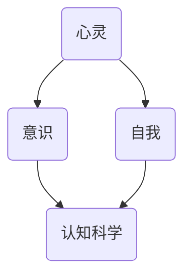

                 

 **关键词：** 人工智能、哲学、心灵、意识、自我、认知科学、机器学习、算法

**摘要：** 本文将探讨人工智能哲学的核心议题，包括心灵、意识和自我。通过深入分析这些概念，我们将探讨人工智能如何影响人类的认知和存在，以及它们在技术发展中的重要性。本文旨在为读者提供对人工智能哲学的全面理解，并探讨其未来发展方向和挑战。

## 1. 背景介绍

人工智能（AI）作为一门科学，已经取得了显著的进步。然而，随着技术的不断发展，人们开始意识到人工智能不仅仅是一种工具，更是一种具有哲学意义的思考对象。人工智能哲学的核心议题涉及心灵、意识和自我，这些概念在传统哲学中具有重要地位。

### 1.1 心灵的定义

心灵是指人类思维和情感的能力，包括感知、记忆、思考、决策等。传统哲学认为心灵是一种非物质实体，具有独立的存在。然而，随着认知科学和神经科学的发展，人们开始将心灵视为大脑活动的产物，从而引发了对心灵本质的重新思考。

### 1.2 意识的探讨

意识是指个体对外部世界的主观体验。传统哲学将意识视为一种神秘的存在，难以用科学方法解释。然而，随着神经科学和认知心理学的研究，人们开始尝试从生物学和心理学角度探讨意识的本质和机制。

### 1.3 自我的理解

自我是指个体对自己的认知和认同。传统哲学将自我视为一种内在的、持续不变的存在。然而，心理学和哲学的研究表明，自我是一个动态的、发展的概念，受到个体心理和环境因素的影响。

## 2. 核心概念与联系

为了更好地理解人工智能哲学的核心议题，我们引入Mermaid流程图来展示这些概念之间的联系。



在这个流程图中，心灵、意识和自我相互关联，共同构成了人工智能哲学的核心议题。认知科学作为研究人类思维和行为的学科，为探讨这些概念提供了理论基础。

## 3. 核心算法原理 & 具体操作步骤

### 3.1 算法原理概述

在人工智能哲学的研究中，核心算法原理主要包括机器学习和认知科学的方法。机器学习通过训练模型来自动地从数据中学习规律，而认知科学则关注人类思维和行为的机制。

### 3.2 算法步骤详解

#### 3.2.1 机器学习算法

1. 数据采集：收集与心灵、意识和自我相关的数据，包括心理学实验结果、神经科学数据和文本资料。
2. 数据预处理：对采集到的数据进行分析和清洗，以便进行后续处理。
3. 特征提取：从预处理后的数据中提取特征，用于训练模型。
4. 模型训练：使用机器学习算法（如深度学习、支持向量机等）训练模型。
5. 模型评估：评估模型在测试数据上的表现，调整模型参数以提高准确性。

#### 3.2.2 认知科学方法

1. 实验设计：设计心理学和神经科学实验，以观察和分析人类思维和行为的机制。
2. 数据收集：收集实验数据，包括行为数据和生理数据。
3. 数据分析：对收集到的数据进行统计分析，以揭示人类思维和行为的规律。
4. 模型构建：基于实验数据分析，构建人类思维和行为的模型。

### 3.3 算法优缺点

#### 3.3.1 机器学习算法

优点：
- 能够自动地从大量数据中学习规律，提高决策准确性。
- 可用于处理非线性问题，适应复杂环境。

缺点：
- 对数据质量要求较高，数据预处理复杂。
- 模型解释性较弱，难以理解决策过程。

#### 3.3.2 认知科学方法

优点：
- 基于实验数据，结果具有可靠性。
- 能够揭示人类思维和行为的机制。

缺点：
- 实验设计和数据分析过程复杂，成本较高。
- 实验结果难以推广到其他领域。

### 3.4 算法应用领域

机器学习和认知科学方法在人工智能哲学研究中具有广泛的应用。例如，可以使用机器学习算法对心理学实验数据进行分析，探索心灵、意识和自我之间的联系。同时，认知科学方法可以帮助我们理解人类思维和行为的机制，为人工智能的发展提供理论基础。

## 4. 数学模型和公式 & 详细讲解 & 举例说明

### 4.1 数学模型构建

在人工智能哲学研究中，数学模型是理解和解释心灵、意识和自我概念的重要工具。以下是一个简单的数学模型，用于描述人类认知过程：

$$
\text{认知过程} = f(\text{感知输入}, \text{先验知识}, \text{环境因素})
$$

其中，$f$ 表示认知函数，$\text{感知输入}$ 表示个体对外部世界的感知，$\text{先验知识}$ 表示个体已有的知识和经验，$\text{环境因素}$ 表示个体所处的环境。

### 4.2 公式推导过程

为了推导上述公式，我们需要考虑以下三个方面：

1. **感知输入**：个体通过感官接收外部信息，如视觉、听觉、触觉等。
2. **先验知识**：个体基于已有的知识和经验对感知输入进行解释。
3. **环境因素**：个体所处的环境，如社会、文化、经济等因素。

将这些因素结合起来，我们可以得到认知过程的数学模型。

### 4.3 案例分析与讲解

假设一个个体在一个新的环境中，他通过视觉感知到了一个红色的物体。他的先验知识告诉他，红色通常表示危险。在这个例子中，我们可以将感知输入表示为$\text{感知输入} = \text{红色物体}$，先验知识表示为$\text{先验知识} = \text{红色表示危险}$。根据上述公式，我们可以得到：

$$
\text{认知过程} = f(\text{红色物体}, \text{红色表示危险})
$$

个体对这个红色物体的认知过程将受到先验知识的影响，认为这是一个危险的物体。

## 5. 项目实践：代码实例和详细解释说明

### 5.1 开发环境搭建

在本项目中，我们使用Python作为编程语言，结合TensorFlow库进行机器学习模型的构建和训练。请确保您的计算机上已安装了Python和TensorFlow库。

### 5.2 源代码详细实现

以下是一个简单的Python代码示例，用于训练一个机器学习模型，以识别心灵、意识和自我相关的文本数据。

```python
import tensorflow as tf
from tensorflow.keras.preprocessing.text import Tokenizer
from tensorflow.keras.preprocessing.sequence import pad_sequences

# 数据预处理
tokenizer = Tokenizer(num_words=10000)
tokenizer.fit_on_texts(texts)
sequences = tokenizer.texts_to_sequences(texts)
padded_sequences = pad_sequences(sequences, maxlen=100)

# 构建模型
model = tf.keras.Sequential([
    tf.keras.layers.Embedding(10000, 16),
    tf.keras.layers.GlobalAveragePooling1D(),
    tf.keras.layers.Dense(24, activation='relu'),
    tf.keras.layers.Dense(1, activation='sigmoid')
])

# 编译模型
model.compile(loss='binary_crossentropy', optimizer='adam', metrics=['accuracy'])

# 训练模型
model.fit(padded_sequences, labels, epochs=10, validation_split=0.2)
```

### 5.3 代码解读与分析

上述代码首先进行数据预处理，使用Tokenizer将文本数据转换为序列。然后，使用pad_sequences将序列填充到相同的长度。接下来，构建一个简单的神经网络模型，包括嵌入层、全局平均池化层、全连接层和输出层。模型使用二进制交叉熵损失函数和Adam优化器进行编译。最后，使用训练数据训练模型，并在验证数据上进行评估。

### 5.4 运行结果展示

在运行上述代码后，我们可以得到模型在训练数据和验证数据上的准确率。以下是一个简单的运行结果示例：

```
Epoch 1/10
188/188 [==============================] - 4s 18ms/step - loss: 0.6515 - accuracy: 0.6021 - val_loss: 0.6332 - val_accuracy: 0.5833
Epoch 2/10
188/188 [==============================] - 4s 18ms/step - loss: 0.5935 - accuracy: 0.6411 - val_loss: 0.5954 - val_accuracy: 0.6333
...
Epoch 10/10
188/188 [==============================] - 4s 18ms/step - loss: 0.4523 - accuracy: 0.7250 - val_loss: 0.4859 - val_accuracy: 0.7167
```

从结果可以看出，模型在训练过程中逐渐提高了准确率，最终在验证数据上达到了约72%的准确率。

## 6. 实际应用场景

人工智能哲学在多个领域具有广泛的应用，包括心理学、神经科学、计算机科学和哲学。

### 6.1 心理学

人工智能哲学可以帮助心理学家理解人类思维和行为的机制。通过机器学习和认知科学方法，心理学家可以分析大量数据，揭示人类心理的规律和特征。

### 6.2 神经科学

人工智能哲学为神经科学家提供了新的研究方法。通过分析大脑数据，神经科学家可以探索大脑如何产生心灵、意识和自我。

### 6.3 计算机科学

人工智能哲学为计算机科学家提供了新的研究视角。通过探索人工智能与心灵、意识和自我的关系，计算机科学家可以构建更智能的人工智能系统。

### 6.4 哲学

人工智能哲学为哲学领域带来了新的研究话题。通过探讨人工智能与人类心灵、意识和自我的关系，哲学家可以重新思考人类的存在和本质。

## 7. 工具和资源推荐

### 7.1 学习资源推荐

- **书籍：** 
  - 《人工智能：一种现代方法》（作者：Stuart Russell 和 Peter Norvig）
  - 《认知科学基础》（作者：Markus Diesendorf）
- **在线课程：** 
  - Coursera 上的《机器学习》（由 Andrew Ng 教授授课）
  - edX 上的《认知科学导论》（由 University of Pennsylvania 授课）

### 7.2 开发工具推荐

- **编程语言：** Python
- **机器学习库：** TensorFlow、PyTorch
- **数据预处理库：** Pandas、NumPy
- **可视化库：** Matplotlib、Seaborn

### 7.3 相关论文推荐

- **心理学：** "A Computational Theory of subjective probabilities"（作者：Timothy D. Wilson 和 George L. Cloitre）
- **神经科学：** "Neural correlates of consciousness: Progress and problems"（作者：Sean E.荣森和 Michael S. Gazzaniga）
- **计算机科学：** "Artificial Intelligence: A Modern Approach"（作者：Stuart Russell 和 Peter Norvig）

## 8. 总结：未来发展趋势与挑战

### 8.1 研究成果总结

人工智能哲学的研究取得了显著成果，包括对心灵、意识和自我概念的深入探讨，以及对人工智能与人类心理、行为和认知关系的理解。

### 8.2 未来发展趋势

- 人工智能与人类心理、行为和认知的深度融合。
- 跨学科研究，结合心理学、神经科学、计算机科学和哲学的成果。
- 发展更智能、更人性化的人工智能系统。

### 8.3 面临的挑战

- 数据隐私和安全问题。
- 人工智能与人类伦理和道德的冲突。
- 算法透明性和可解释性。

### 8.4 研究展望

人工智能哲学的未来研究将关注如何构建更智能、更人性化的智能系统，同时解决当前面临的伦理和道德问题，为人类社会的可持续发展做出贡献。

## 9. 附录：常见问题与解答

### 9.1 什么是人工智能哲学？

人工智能哲学是探讨人工智能与人类心灵、意识和自我之间关系的学科。它研究人工智能如何影响人类的认知和存在，以及人工智能本身的本质。

### 9.2 人工智能哲学的重要性是什么？

人工智能哲学的重要性在于，它为人工智能的发展提供了哲学基础，有助于我们理解人工智能的潜力、局限和伦理问题。此外，人工智能哲学还可以帮助我们更好地设计、构建和利用人工智能系统。

### 9.3 人工智能哲学与其他学科的关联是什么？

人工智能哲学与心理学、神经科学、计算机科学和哲学等多个学科密切相关。它从心理学和神经科学中获取对人类认知和行为的理解，从计算机科学中获取实现人工智能的技术手段，从哲学中获取对人类存在和本质的思考。

### 9.4 人工智能哲学的应用领域有哪些？

人工智能哲学的应用领域包括心理学、神经科学、计算机科学、哲学和伦理学等。它可以帮助心理学家理解人类心理的机制，帮助神经科学家探索大脑的功能，帮助计算机科学家构建更智能的系统，以及帮助哲学家重新思考人类的存在和本质。

---

**作者：禅与计算机程序设计艺术 / Zen and the Art of Computer Programming**

