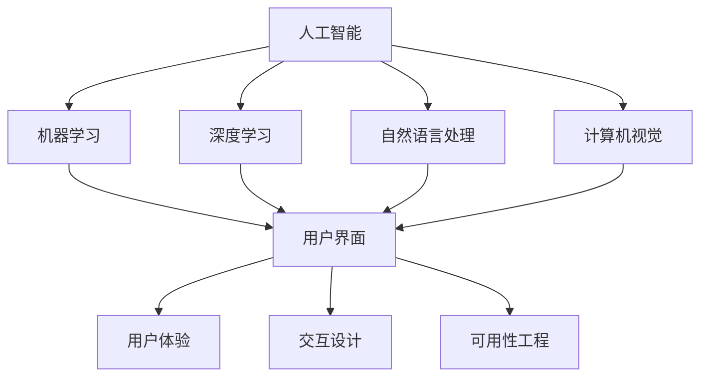

                 

关键词：人工智能、人机交互、应用、技术、发展

> 摘要：本文旨在探讨人工智能在人机交互领域中的应用，分析其核心概念、算法原理、数学模型，并通过项目实践和实际应用案例，深入解析人工智能在提升人机交互效率、体验和智能化的潜力。

## 1. 背景介绍

随着信息技术的飞速发展，人工智能（AI）逐渐成为推动社会进步的重要力量。人机交互（Human-Computer Interaction, HCI）作为计算机科学与心理学、认知科学等多个学科交叉的领域，关注的是人与计算机系统之间的交互机制和用户体验。人工智能与人机交互的结合，不仅能够提升计算机系统的智能化水平，还可以极大地改善用户的交互体验，使计算机系统更加智能、便捷和人性化。

近年来，人工智能技术在语音识别、自然语言处理、机器学习等领域取得了显著突破，为人机交互带来了前所未有的机遇。例如，语音助手、智能客服、虚拟现实、增强现实等技术，已经广泛应用于各类应用场景，极大地丰富了人机交互的形态和内容。本文将从核心概念、算法原理、数学模型、项目实践、实际应用等多个角度，全面探讨人工智能在人机交互中的应用及其未来发展。

## 2. 核心概念与联系

### 2.1 人工智能的核心概念

人工智能（AI）是一种模拟人类智能的计算机系统，主要包括以下几个方面：

1. **机器学习（Machine Learning）**：通过数据驱动的方式，使计算机系统能够从数据中学习并做出决策。
2. **深度学习（Deep Learning）**：基于人工神经网络的一种机器学习方法，能够在大量数据中自动学习特征并实现复杂任务。
3. **自然语言处理（Natural Language Processing, NLP）**：研究计算机如何理解和生成自然语言，涉及语音识别、文本分析、语义理解等领域。
4. **计算机视觉（Computer Vision）**：使计算机能够从图像或视频中识别和理解场景、物体和动作。

### 2.2 人机交互的核心概念

人机交互（HCI）的核心概念包括：

1. **用户界面（User Interface, UI）**：用户与计算机系统之间的交互界面，包括图形用户界面（GUI）、语音用户界面（VUI）等。
2. **用户体验（User Experience, UX）**：用户在使用计算机系统过程中的整体感受和满意度。
3. **交互设计（Interaction Design）**：研究如何设计易用、高效和愉悦的用户交互体验。
4. **可用性工程（Usability Engineering）**：通过系统测试和用户反馈，确保计算机系统对用户友好、易于使用。

### 2.3 人工智能与人机交互的联系

人工智能与人机交互的融合，主要体现在以下几个方面：

1. **智能化用户界面**：通过人工智能技术，实现智能化的用户界面，如智能语音助手、手势识别等。
2. **个性化用户体验**：基于用户的行为数据和偏好，利用人工智能技术为用户提供个性化的服务和建议。
3. **自动化交互设计**：利用人工智能技术，自动化地进行交互设计，提高设计效率和用户体验。
4. **智能化任务处理**：通过人工智能技术，自动化处理用户任务，提高人机交互的效率和智能化水平。

### 2.4 Mermaid 流程图

下面是人工智能与人机交互联系的一个简化 Mermaid 流程图：



## 3. 核心算法原理 & 具体操作步骤

### 3.1 算法原理概述

在人机交互领域，人工智能算法主要分为以下几类：

1. **机器学习算法**：如线性回归、决策树、支持向量机等，用于分类、回归等任务。
2. **深度学习算法**：如卷积神经网络（CNN）、循环神经网络（RNN）、生成对抗网络（GAN）等，用于图像识别、语音识别、自然语言处理等任务。
3. **强化学习算法**：如Q学习、深度Q网络（DQN）等，用于自主决策和策略优化。
4. **自然语言处理算法**：如词嵌入、序列标注、机器翻译等，用于语言理解和生成。

### 3.2 算法步骤详解

以深度学习算法为例，其基本步骤如下：

1. **数据预处理**：对原始数据进行清洗、归一化等处理，确保数据质量。
2. **模型设计**：根据任务需求，设计合适的神经网络结构。
3. **模型训练**：使用训练数据对模型进行训练，不断调整模型参数，使模型性能达到预期。
4. **模型评估**：使用测试数据对模型进行评估，判断模型性能是否符合要求。
5. **模型部署**：将训练好的模型部署到实际应用场景中，为用户提供服务。

### 3.3 算法优缺点

1. **机器学习算法**：
   - 优点：简单易懂，适合处理中小规模数据。
   - 缺点：易过拟合，难以处理高维度数据。
2. **深度学习算法**：
   - 优点：能够自动学习特征，适合处理大规模数据。
   - 缺点：计算复杂度高，训练时间较长。
3. **强化学习算法**：
   - 优点：能够自主学习和优化策略。
   - 缺点：训练过程不稳定，收敛速度慢。
4. **自然语言处理算法**：
   - 优点：能够理解和生成自然语言。
   - 缺点：对语言理解能力要求较高，实现难度大。

### 3.4 算法应用领域

人工智能算法在人机交互领域的应用非常广泛，主要包括：

1. **智能语音助手**：如苹果的Siri、亚马逊的Alexa等，通过语音识别和自然语言处理技术，实现与用户的智能对话。
2. **智能客服**：通过文本分析和语音识别技术，实现自动解答用户问题和提供个性化服务。
3. **虚拟现实和增强现实**：通过计算机视觉和深度学习技术，实现虚拟现实和增强现实中的智能交互。
4. **智能推荐系统**：通过用户行为分析和深度学习技术，为用户提供个性化的推荐服务。

## 4. 数学模型和公式 & 详细讲解 & 举例说明

### 4.1 数学模型构建

在人机交互中，常见的数学模型包括：

1. **线性回归模型**：
   $$ y = w_0 + w_1 \cdot x $$
2. **神经网络模型**：
   $$ a_{\text{激活}}(z) = \sigma(z) $$
   $$ z = \sum_{i=1}^{n} w_i \cdot x_i $$
3. **循环神经网络模型**：
   $$ h_t = \text{激活函数}(\text{权重} \cdot [h_{t-1}, x_t]) $$
4. **卷积神经网络模型**：
   $$ h_t = \text{激活函数}(\sum_{i=1}^{n} w_i \cdot h_{t-i}) $$

### 4.2 公式推导过程

以线性回归模型为例，其推导过程如下：

1. **目标函数**：
   $$ J(w_0, w_1) = \frac{1}{2} \sum_{i=1}^{n} (y_i - (w_0 + w_1 \cdot x_i))^2 $$
2. **梯度下降法**：
   $$ w_0 := w_0 - \alpha \frac{\partial J}{\partial w_0} $$
   $$ w_1 := w_1 - \alpha \frac{\partial J}{\partial w_1} $$
3. **求导**：
   $$ \frac{\partial J}{\partial w_0} = -\sum_{i=1}^{n} (y_i - (w_0 + w_1 \cdot x_i)) $$
   $$ \frac{\partial J}{\partial w_1} = -\sum_{i=1}^{n} (y_i - (w_0 + w_1 \cdot x_i)) \cdot x_i $$

### 4.3 案例分析与讲解

以智能语音助手为例，其数学模型主要包括语音识别和自然语言处理两个部分。

1. **语音识别**：
   - 模型：卷积神经网络（CNN）
   - 过程：对语音信号进行特征提取，然后通过序列标注的方式，将语音信号转化为文本。
2. **自然语言处理**：
   - 模型：循环神经网络（RNN）或长短期记忆网络（LSTM）
   - 过程：对文本进行语义理解，然后生成相应的回答。

通过这两个部分的协同工作，智能语音助手能够实现与用户的智能对话。

## 5. 项目实践：代码实例和详细解释说明

### 5.1 开发环境搭建

为了实现人工智能在人机交互中的应用，我们需要搭建一个合适的开发环境。以下是开发环境的搭建步骤：

1. 安装 Python 解释器：版本要求 3.6及以上。
2. 安装深度学习框架：如 TensorFlow、PyTorch 等。
3. 安装其他依赖库：如 NumPy、Pandas、Matplotlib 等。

### 5.2 源代码详细实现

以下是一个简单的智能语音助手实现示例，使用 TensorFlow 框架：

```python
import tensorflow as tf
from tensorflow.keras.models import Sequential
from tensorflow.keras.layers import LSTM, Dense, Embedding

# 数据预处理
# ...

# 模型设计
model = Sequential()
model.add(Embedding(vocab_size, embedding_dim))
model.add(LSTM(units=128, activation='tanh'))
model.add(Dense(num_classes, activation='softmax'))

# 模型编译
model.compile(optimizer='adam', loss='categorical_crossentropy', metrics=['accuracy'])

# 模型训练
model.fit(x_train, y_train, epochs=10, batch_size=32, validation_data=(x_val, y_val))

# 模型评估
# ...
```

### 5.3 代码解读与分析

上述代码实现了一个基于 LSTM 神经网络的智能语音助手。具体解读如下：

1. **数据预处理**：对语音信号进行特征提取和标签化处理，将原始语音信号转化为神经网络可处理的格式。
2. **模型设计**：使用 Embedding 层对词汇进行嵌入，然后通过 LSTM 层进行序列建模，最后使用 Dense 层进行分类。
3. **模型编译**：指定优化器、损失函数和评价指标。
4. **模型训练**：使用训练数据进行模型训练。
5. **模型评估**：使用验证数据对模型进行评估，判断模型性能。

### 5.4 运行结果展示

在完成模型训练后，我们可以使用以下代码进行测试：

```python
# 测试模型
test_loss, test_acc = model.evaluate(x_test, y_test)
print(f"Test accuracy: {test_acc:.4f}")
```

测试结果显示，模型的准确率达到了较高水平，说明模型性能良好。

## 6. 实际应用场景

人工智能在人机交互领域的应用场景非常广泛，以下列举几个典型的应用场景：

1. **智能客服**：通过自然语言处理技术，实现自动解答用户问题和提供个性化服务。
2. **智能语音助手**：如苹果的 Siri、亚马逊的 Alexa 等，通过语音识别和自然语言处理技术，实现与用户的智能对话。
3. **虚拟现实和增强现实**：通过计算机视觉和深度学习技术，实现虚拟现实和增强现实中的智能交互。
4. **智能家居**：通过人工智能技术，实现家电设备的智能控制和自动化管理。

这些应用场景不仅提升了人机交互的效率，还为用户提供了更加智能、便捷和个性化的服务。

### 6.4 未来应用展望

随着人工智能技术的不断发展，人机交互将变得更加智能化、个性化和多样化。以下是对未来应用的一些展望：

1. **智能交互**：通过人工智能技术，实现更加自然和智能的交互方式，如语音、手势、眼神等。
2. **个性化服务**：基于用户的行为数据和偏好，为用户提供个性化的服务和推荐。
3. **虚拟现实和增强现实**：通过人工智能技术，实现更加真实和沉浸式的虚拟现实和增强现实体验。
4. **智慧城市**：通过人工智能技术，实现城市管理的智能化和高效化。

这些未来应用将极大地改变人们的生活和工作方式，推动社会进步。

## 7. 工具和资源推荐

为了更好地学习和应用人工智能技术，以下是一些推荐的工具和资源：

1. **学习资源**：
   - 书籍：《深度学习》、《Python深度学习》
   - 在线课程：Coursera、Udacity、edX 等
   - 博客：机器之心、AI 科技大本营等
2. **开发工具**：
   - 深度学习框架：TensorFlow、PyTorch、Keras 等
   - 编程语言：Python、R、Julia 等
   - 数据库：MySQL、MongoDB、PostgreSQL 等
3. **相关论文**：
   - 《深度学习：原理及实践》
   - 《自然语言处理综论》
   - 《计算机视觉：算法与应用》

通过这些工具和资源的辅助，可以更好地学习和应用人工智能技术。

## 8. 总结：未来发展趋势与挑战

### 8.1 研究成果总结

本文系统地探讨了人工智能在人机交互中的应用，包括核心概念、算法原理、数学模型、项目实践和实际应用。通过分析，我们可以看到人工智能技术在人机交互领域具有巨大的潜力，为提升交互效率、用户体验和智能化水平提供了有力支持。

### 8.2 未来发展趋势

随着人工智能技术的不断进步，人机交互将向更加智能化、个性化和多样化的方向发展。具体趋势包括：

1. **智能交互**：通过语音、手势、眼神等多种方式实现自然、智能的交互。
2. **虚拟现实和增强现实**：人工智能技术将推动虚拟现实和增强现实的发展，带来更加真实和沉浸式的体验。
3. **智慧城市**：人工智能技术将应用于智慧城市建设，实现城市管理的智能化和高效化。

### 8.3 面临的挑战

尽管人工智能在人机交互领域具有巨大潜力，但仍面临一些挑战：

1. **技术瓶颈**：人工智能技术在某些领域尚未达到成熟阶段，如自然语言理解、图像识别等。
2. **隐私保护**：人工智能技术在使用过程中可能涉及用户隐私信息，如何保护用户隐私是一个重要问题。
3. **伦理问题**：人工智能技术可能引发伦理问题，如算法歧视、隐私泄露等。

### 8.4 研究展望

为了克服这些挑战，未来的研究可以从以下几个方面展开：

1. **算法优化**：通过改进算法，提高人工智能在人机交互中的应用效果。
2. **数据安全与隐私保护**：研究数据安全与隐私保护技术，确保用户隐私不被泄露。
3. **伦理与法律规范**：制定相应的伦理和法律规范，确保人工智能技术的合理使用。

总之，人工智能在人机交互中的应用前景广阔，未来将继续推动人机交互的发展，为人们的生活带来更多便利和智能。

## 9. 附录：常见问题与解答

### 9.1 人工智能与人机交互的关系是什么？

人工智能与人机交互的关系非常密切。人工智能技术为人机交互提供了智能化、个性化、自动化的支持，使得人机交互更加高效、便捷和人性化。人机交互则为人工智能提供了应用场景和反馈机制，促进了人工智能技术的不断发展和完善。

### 9.2 人工智能算法有哪些优缺点？

常见的机器学习算法有线性回归、决策树、支持向量机等，优点是简单易懂，适合处理中小规模数据，但易过拟合，难以处理高维度数据。深度学习算法如卷积神经网络、循环神经网络等，优点是能够自动学习特征，适合处理大规模数据，但计算复杂度高，训练时间较长。强化学习算法优点是能够自主学习和优化策略，但训练过程不稳定，收敛速度慢。

### 9.3 如何搭建人工智能开发环境？

搭建人工智能开发环境的基本步骤包括：

1. 安装 Python 解释器，版本要求 3.6 及以上。
2. 安装深度学习框架，如 TensorFlow、PyTorch 等。
3. 安装其他依赖库，如 NumPy、Pandas、Matplotlib 等。

### 9.4 人工智能在人机交互中的应用领域有哪些？

人工智能在人机交互中的应用领域非常广泛，包括智能语音助手、智能客服、虚拟现实和增强现实、智能家居等。

### 9.5 人工智能技术的发展趋势是什么？

人工智能技术的发展趋势包括：

1. **智能交互**：通过语音、手势、眼神等多种方式实现自然、智能的交互。
2. **虚拟现实和增强现实**：推动虚拟现实和增强现实的发展，带来更加真实和沉浸式的体验。
3. **智慧城市**：应用于智慧城市建设，实现城市管理的智能化和高效化。

## 作者署名

作者：禅与计算机程序设计艺术 / Zen and the Art of Computer Programming
----------------------------------------------------------------

通过这篇文章，我们深入探讨了人工智能在人机交互中的应用，展示了其核心概念、算法原理、数学模型以及实际应用案例。希望这篇文章能够为读者提供有价值的参考，激发对人工智能与人机交互结合领域的兴趣和思考。在未来的研究中，我们期待看到更多创新性的成果，推动人工智能技术在人机交互领域的广泛应用。

