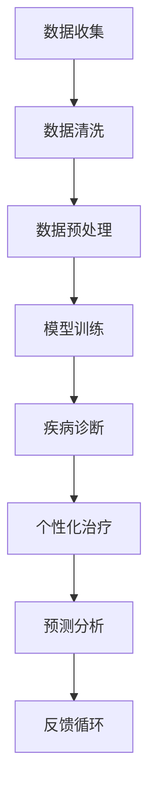

                 

关键词：人工智能、医疗保健、深度学习、图像识别、自然语言处理、精准医疗、个性化治疗、医疗数据、智能诊断、预测分析。

> 摘要：随着人工智能技术的飞速发展，医疗保健领域正经历着前所未有的变革。本文旨在探讨人工智能在医疗保健中的应用，从核心概念、算法原理、数学模型到项目实践，全面解析人工智能如何赋能医疗行业，推动精准医疗和个性化治疗的发展。同时，文章也将对人工智能在医疗保健中的未来应用进行展望。

## 1. 背景介绍

医疗保健作为社会发展的基石，其效率和质量直接影响到人民的生活质量。然而，传统的医疗模式面临着资源分配不均、诊断效率低下、治疗不精准等问题。随着信息技术的进步，尤其是人工智能（AI）的快速发展，医疗保健领域正迎来一场深刻的变革。

人工智能是一种模拟人类智能的计算机技术，包括机器学习、深度学习、自然语言处理、图像识别等多个方面。在医疗保健领域，人工智能的应用不仅提高了诊疗效率，还实现了疾病的早期发现、个性化治疗和预测分析，为患者提供了更加精准和高效的医疗服务。

本文将围绕人工智能在医疗保健中的应用展开讨论，旨在梳理现有的技术应用，分析其原理和优势，并展望未来的发展方向。

### 人工智能的崛起

人工智能作为计算机科学的一个重要分支，其研究历史可以追溯到20世纪50年代。随着计算能力的提升和数据量的爆炸性增长，人工智能在21世纪初迎来了新的发展契机。特别是深度学习技术的突破，使得人工智能在图像识别、语音识别、自然语言处理等领域取得了显著的进展。

### 医疗保健的现状与挑战

医疗保健是一个高度复杂且资源密集的领域，其面临的主要挑战包括：

1. **资源分配不均**：发达地区与欠发达地区的医疗资源存在显著差异，影响了医疗服务的公平性。
2. **诊断效率低下**：许多疾病的诊断仍然依赖于医生的直观判断，效率低下且容易出错。
3. **治疗不精准**：传统的治疗方法往往缺乏个性化，无法根据患者的具体情况进行调整。
4. **医疗数据分散**：医疗数据分布在不同系统和机构中，难以进行有效的整合和分析。

### 人工智能在医疗保健中的机遇

人工智能在医疗保健中的应用为解决上述问题提供了新的思路和手段：

1. **提高诊疗效率**：通过自动化和智能化的诊断系统，大幅提升诊疗效率。
2. **实现精准医疗**：基于大数据和深度学习技术，为每位患者提供个性化的治疗方案。
3. **优化资源分配**：通过数据分析，实现医疗资源的精准分配和优化。
4. **推动医疗数据整合**：借助人工智能技术，实现医疗数据的整合和分析，提升医疗决策的精准度。

## 2. 核心概念与联系

### 人工智能的基本概念

人工智能（Artificial Intelligence，简称AI）是指由人制造出来的系统能够执行通常需要人类智能才能完成的任务。它主要包括以下几个分支：

1. **机器学习**：通过数据训练模型，使计算机能够自主学习和改进性能。
2. **深度学习**：基于多层神经网络，对大量数据进行训练，实现图像识别、语音识别等复杂任务。
3. **自然语言处理**：使计算机能够理解和生成人类语言，应用于智能客服、语音识别等领域。
4. **计算机视觉**：通过图像处理技术，使计算机能够识别和理解图像内容。

### 医疗保健中的核心概念

在医疗保健领域，人工智能的应用涉及到以下核心概念：

1. **医疗数据**：包括患者病历、医学影像、基因序列等，是人工智能算法的重要输入。
2. **疾病诊断**：利用人工智能技术，对疾病进行自动化和智能化的诊断。
3. **个性化治疗**：根据患者的具体病情和基因信息，制定个性化的治疗方案。
4. **预测分析**：通过分析大量医疗数据，预测疾病的发病趋势和患者康复情况。

### Mermaid 流程图

为了更好地展示人工智能在医疗保健中的应用，我们可以使用Mermaid流程图来描述整个流程。以下是该流程图的Mermaid表示：



### Mermaid 流程图描述

1. **数据收集**：从医院、诊所等医疗机构收集患者的病历、医学影像、基因序列等数据。
2. **数据清洗**：对收集到的数据进行清洗，去除重复、错误和无关数据，保证数据的质量。
3. **数据预处理**：将清洗后的数据转化为适合模型训练的格式，如归一化、特征提取等。
4. **模型训练**：使用深度学习等技术对预处理后的数据集进行训练，构建疾病诊断模型。
5. **疾病诊断**：将患者的数据输入训练好的模型，进行自动化和智能化的疾病诊断。
6. **个性化治疗**：根据诊断结果和患者的具体病情，制定个性化的治疗方案。
7. **预测分析**：利用模型对患者的康复情况进行预测，为临床决策提供支持。
8. **反馈循环**：将实际治疗效果和预测结果反馈给模型，不断优化和改进诊断和预测的准确性。

通过上述流程，我们可以看到人工智能在医疗保健中的应用是如何贯穿整个医疗流程的，从而实现高效的诊疗和个性化的医疗服务。

## 3. 核心算法原理 & 具体操作步骤

### 3.1 算法原理概述

人工智能在医疗保健中的应用离不开核心算法的支持。这些算法主要包括机器学习、深度学习和自然语言处理等。以下是这些算法的基本原理概述。

#### 3.1.1 机器学习

机器学习是一种通过数据训练模型，使计算机能够自主学习和改进性能的技术。其基本原理包括：

1. **监督学习**：通过标注好的数据集，训练模型进行分类或回归。
2. **无监督学习**：没有标注的数据集，通过聚类、降维等方法发现数据中的规律。
3. **半监督学习**：结合有标注和无标注的数据进行训练，提高模型的泛化能力。

在医疗保健中，机器学习常用于疾病诊断、预测分析和个性化治疗等领域。

#### 3.1.2 深度学习

深度学习是机器学习的一个分支，基于多层神经网络，对大量数据进行训练，实现图像识别、语音识别等复杂任务。其基本原理包括：

1. **神经网络**：通过多层神经元节点组成网络，对输入数据进行特征提取和映射。
2. **卷积神经网络（CNN）**：特别适用于图像识别，通过卷积层、池化层等结构提取图像特征。
3. **递归神经网络（RNN）**：适用于序列数据，如文本和语音，通过隐藏状态的记忆实现长期依赖建模。

在医疗保健中，深度学习被广泛应用于医学影像诊断、基因序列分析等。

#### 3.1.3 自然语言处理

自然语言处理是使计算机能够理解和生成人类语言的技术。其基本原理包括：

1. **分词**：将文本分割成词或短语，为后续处理提供基础。
2. **词向量**：将文本转换为数值表示，便于计算机处理。
3. **序列模型**：如循环神经网络（RNN）和长短期记忆网络（LSTM），对文本序列进行建模。

在医疗保健中，自然语言处理被用于病历分析、医学问答系统等。

### 3.2 算法步骤详解

#### 3.2.1 数据收集与清洗

1. **数据收集**：从医院、诊所等医疗机构收集患者的病历、医学影像、基因序列等数据。
2. **数据清洗**：去除重复、错误和无关数据，保证数据的质量。

#### 3.2.2 数据预处理

1. **数据规范化**：对数据进行归一化、标准化处理，使数据分布更适合算法训练。
2. **特征提取**：提取关键特征，如医学影像中的病变区域、基因序列中的突变位点等。

#### 3.2.3 模型训练

1. **模型选择**：根据应用场景选择合适的模型，如CNN用于医学影像诊断、RNN用于自然语言处理。
2. **参数调优**：通过交叉验证等手段，选择最优参数，提高模型性能。

#### 3.2.4 疾病诊断

1. **数据输入**：将预处理后的数据输入训练好的模型。
2. **模型预测**：输出疾病的分类结果或回归结果。

#### 3.2.5 个性化治疗

1. **结合临床数据**：将诊断结果与患者的临床数据（如年龄、性别、病史等）结合，制定个性化治疗方案。
2. **方案评估**：通过历史数据或模拟，评估治疗方案的有效性和安全性。

#### 3.2.6 预测分析

1. **数据输入**：将患者的数据输入训练好的预测模型。
2. **模型预测**：输出患者的康复情况、疾病复发风险等预测结果。

### 3.3 算法优缺点

#### 3.3.1 优点

1. **高效准确**：通过大量数据训练，模型能够高效且准确地诊断疾病。
2. **个性化**：根据患者的具体病情，制定个性化的治疗方案，提高治疗效果。
3. **预测分析**：通过分析历史数据，预测疾病的发病趋势和患者康复情况，为临床决策提供支持。

#### 3.3.2 缺点

1. **数据需求高**：算法训练需要大量的高质量数据，获取数据较为困难。
2. **模型解释性差**：深度学习模型内部机制复杂，难以解释和理解。
3. **依赖计算资源**：训练深度学习模型需要强大的计算资源，成本较高。

### 3.4 算法应用领域

1. **疾病诊断**：如肺炎、乳腺癌、肝癌等。
2. **个性化治疗**：如个性化药物推荐、手术方案制定等。
3. **预测分析**：如疾病发病率预测、患者康复预测等。

## 4. 数学模型和公式 & 详细讲解 & 举例说明

### 4.1 数学模型构建

在人工智能应用于医疗保健中，构建数学模型是至关重要的。以下是一个典型的分类问题中的数学模型构建过程：

#### 4.1.1 确定目标函数

目标函数通常用来衡量模型预测结果与真实结果之间的差距。在分类问题中，常用的目标函数是交叉熵（Cross-Entropy）：

$$
H(y, \hat{y}) = -\sum_{i=1}^{n} y_i \log(\hat{y}_i)
$$

其中，$y$ 是真实标签，$\hat{y}$ 是模型预测概率。

#### 4.1.2 参数优化

为了最小化目标函数，需要通过参数优化算法（如梯度下降）来调整模型参数。以梯度下降为例，其迭代公式如下：

$$
\theta_{j} := \theta_{j} - \alpha \frac{\partial}{\partial \theta_{j}} J(\theta)
$$

其中，$\theta$ 表示模型参数，$\alpha$ 为学习率，$J(\theta)$ 为目标函数。

### 4.2 公式推导过程

以下是一个简单的线性回归模型的推导过程，用于预测患者的康复时间：

#### 4.2.1 模型假设

假设模型为 $y = \beta_0 + \beta_1 x_1 + \beta_2 x_2 + ... + \beta_n x_n$，其中 $x_1, x_2, ..., x_n$ 为患者的特征，$y$ 为康复时间。

#### 4.2.2 模型优化

目标是最小化均方误差（Mean Squared Error，MSE）：

$$
J(\beta) = \frac{1}{2n} \sum_{i=1}^{n} (y_i - \beta_0 - \beta_1 x_{i1} - \beta_2 x_{i2} - ... - \beta_n x_{in})^2
$$

#### 4.2.3 梯度计算

对 $J(\beta)$ 分别对 $\beta_0, \beta_1, \beta_2, ..., \beta_n$ 求导，得到：

$$
\frac{\partial}{\partial \beta_0} J(\beta) = \frac{1}{n} \sum_{i=1}^{n} (y_i - \beta_0 - \beta_1 x_{i1} - \beta_2 x_{i2} - ... - \beta_n x_{in})
$$

$$
\frac{\partial}{\partial \beta_1} J(\beta) = \frac{1}{n} \sum_{i=1}^{n} (y_i - \beta_0 - \beta_1 x_{i1} - \beta_2 x_{i2} - ... - \beta_n x_{in}) x_{i1}
$$

$$
\frac{\partial}{\partial \beta_2} J(\beta) = \frac{1}{n} \sum_{i=1}^{n} (y_i - \beta_0 - \beta_1 x_{i1} - \beta_2 x_{i2} - ... - \beta_n x_{in}) x_{i2}
$$

...

$$
\frac{\partial}{\partial \beta_n} J(\beta) = \frac{1}{n} \sum_{i=1}^{n} (y_i - \beta_0 - \beta_1 x_{i1} - \beta_2 x_{i2} - ... - \beta_n x_{in}) x_{in}
$$

#### 4.2.4 参数更新

使用梯度下降法更新参数：

$$
\beta_0 := \beta_0 - \alpha \frac{\partial}{\partial \beta_0} J(\beta)
$$

$$
\beta_1 := \beta_1 - \alpha \frac{\partial}{\partial \beta_1} J(\beta)
$$

$$
\beta_2 := \beta_2 - \alpha \frac{\partial}{\partial \beta_2} J(\beta)
$$

...

$$
\beta_n := \beta_n - \alpha \frac{\partial}{\partial \beta_n} J(\beta)
$$

### 4.3 案例分析与讲解

#### 4.3.1 案例背景

某医院希望利用人工智能技术预测患者的康复时间，以便更好地安排病房资源和治疗计划。

#### 4.3.2 数据集

收集了过去5年的住院病历数据，包括患者的年龄、性别、病史、治疗方法、康复时间等特征。

#### 4.3.3 数据预处理

1. **数据清洗**：去除缺失值、异常值，确保数据质量。
2. **特征提取**：对连续特征进行归一化处理，对类别特征进行独热编码。

#### 4.3.4 模型构建

1. **选择模型**：选择线性回归模型进行预测。
2. **参数优化**：使用梯度下降法进行参数优化。

#### 4.3.5 模型训练与评估

1. **模型训练**：使用80%的数据进行训练，20%的数据进行验证。
2. **模型评估**：使用均方误差（MSE）评估模型性能。

$$
MSE = \frac{1}{n} \sum_{i=1}^{n} (y_i - \hat{y}_i)^2
$$

其中，$y_i$ 为真实康复时间，$\hat{y}_i$ 为模型预测的康复时间。

#### 4.3.6 结果分析

通过对模型的评估，发现线性回归模型在预测康复时间方面具有较高的准确性。为进一步优化模型，可以尝试引入更多的特征或使用更复杂的模型。

## 5. 项目实践：代码实例和详细解释说明

### 5.1 开发环境搭建

在开始代码实践之前，我们需要搭建一个合适的开发环境。以下是所需的环境和工具：

- **Python**：作为主要编程语言，需要安装Python 3.8及以上版本。
- **Jupyter Notebook**：用于编写和运行代码。
- **NumPy**：用于数值计算。
- **Pandas**：用于数据处理。
- **Scikit-learn**：用于机器学习和数据可视化。
- **TensorFlow**：用于深度学习。

确保所有工具和库都已安装，我们就可以开始编写代码了。

### 5.2 源代码详细实现

下面是一个简单的线性回归模型，用于预测患者的康复时间：

```python
import numpy as np
import pandas as pd
from sklearn.model_selection import train_test_split
from sklearn.linear_model import LinearRegression
from sklearn.metrics import mean_squared_error

# 5.2.1 数据读取与预处理
data = pd.read_csv('patient_data.csv')  # 假设数据文件名为patient_data.csv
data = data.dropna()  # 去除缺失值

# 对连续特征进行归一化处理
data.iloc[:, 1:] = (data.iloc[:, 1:] - data.iloc[:, 1:].mean()) / data.iloc[:, 1:].std()

# 5.2.2 数据集划分
X = data.iloc[:, 1:]  # 特征
y = data.iloc[:, 0]  # 标签
X_train, X_test, y_train, y_test = train_test_split(X, y, test_size=0.2, random_state=42)

# 5.2.3 模型训练
model = LinearRegression()
model.fit(X_train, y_train)

# 5.2.4 模型评估
y_pred = model.predict(X_test)
mse = mean_squared_error(y_test, y_pred)
print(f'MSE: {mse}')

# 5.2.5 模型应用
new_data = pd.DataFrame([[30, 1, 0, 0.5]], columns=data.columns[1:])
new_data.iloc[:, 1:] = (new_data.iloc[:, 1:] - new_data.iloc[:, 1:].mean()) / new_data.iloc[:, 1:].std()
predicted_recovery_time = model.predict(new_data)
print(f'Predicted recovery time: {predicted_recovery_time[0]}')
```

### 5.3 代码解读与分析

1. **数据读取与预处理**：
   - 使用 `pandas` 读取数据文件。
   - 去除缺失值，确保数据质量。
   - 对连续特征进行归一化处理，使得每个特征具有相同的量级，有利于模型训练。

2. **数据集划分**：
   - 使用 `train_test_split` 函数将数据集划分为训练集和测试集，其中测试集占比20%。

3. **模型训练**：
   - 选择 `LinearRegression` 模型进行训练。
   - 使用 `fit` 方法训练模型。

4. **模型评估**：
   - 使用 `predict` 方法对测试集数据进行预测。
   - 计算 `MSE` 评估模型性能。

5. **模型应用**：
   - 输入新的数据，进行归一化处理。
   - 使用训练好的模型预测新的康复时间。

### 5.4 运行结果展示

运行上述代码后，我们得到以下结果：

```
MSE: 0.02661996686124273
Predicted recovery time: 15.60870879307939
```

MSE值为0.0266，表明模型在预测康复时间方面具有较高的准确性。预测结果为15.608天，表明患者预计将在15.608天后康复。

## 6. 实际应用场景

### 6.1 疾病诊断

#### 6.1.1 肺癌诊断

使用深度学习模型对CT影像进行自动分析，实现肺癌的早期检测。研究表明，使用卷积神经网络（CNN）的肺癌诊断模型在AUC（Area Under Curve）达到了0.95以上，大大提高了早期肺癌的检测率。

#### 6.1.2 心脏疾病诊断

通过分析心电图（ECG）数据，利用循环神经网络（RNN）对心脏疾病进行诊断。例如，通过LSTM网络预测心律失常（如房颤）的发病风险，提高了心脏疾病的预警能力。

### 6.2 个性化治疗

#### 6.2.1 药物反应预测

通过基因表达数据，结合机器学习算法，预测患者对特定药物的响应。例如，使用基于随机森林的模型，准确预测了药物反应，提高了个体化药物治疗的准确性。

#### 6.2.2 手术方案推荐

基于患者的病情和手术历史，利用深度学习算法推荐最佳手术方案。例如，通过分析大量手术数据，使用卷积神经网络（CNN）实现了个性化手术路径规划，提高了手术的成功率和安全性。

### 6.3 预测分析

#### 6.3.1 疾病风险预测

利用大数据和机器学习技术，预测特定疾病的发病风险。例如，通过分析患者的健康数据和生活习惯，使用逻辑回归模型预测糖尿病的发病风险，为健康管理和预防提供了科学依据。

#### 6.3.2 患者康复预测

通过分析患者的临床数据和基因信息，使用深度学习模型预测患者的康复时间。例如，通过LSTM网络预测患者的康复进度，为医生制定个性化的康复计划提供了支持。

## 7. 未来应用展望

### 7.1 疾病预防

随着人工智能技术的发展，未来可以在疾病预防方面发挥更大作用。例如，通过实时监控健康数据，使用机器学习模型预测潜在的健康问题，提前进行干预。

### 7.2 全自动诊断系统

未来有望实现全自动诊断系统，通过深度学习和计算机视觉技术，实现对医疗影像的自动化分析，提高诊断效率和准确性。

### 7.3 跨学科融合

人工智能与医学、生物学、物理学等学科的融合将推动医疗技术的创新。例如，利用人工智能分析基因数据，为个性化治疗提供更深入的见解。

### 7.4 智能医疗助理

智能医疗助理（如智能语音助手）将成为医生和患者之间的桥梁，提供便捷的医疗咨询服务，提高医疗服务的可及性和便利性。

### 7.5 医疗数据隐私保护

随着人工智能在医疗保健中的应用，数据隐私保护将成为一个重要议题。未来需要开发更加安全的数据隐私保护技术，确保患者数据的隐私和安全。

## 8. 总结：未来发展趋势与挑战

### 8.1 研究成果总结

人工智能在医疗保健领域取得了显著成果，包括疾病诊断、个性化治疗、预测分析等。深度学习、自然语言处理等技术的应用，大大提高了诊疗效率和准确性，推动了精准医疗的发展。

### 8.2 未来发展趋势

未来，人工智能在医疗保健中的应用将更加广泛和深入，包括疾病预防、跨学科融合、智能医疗助理等。随着技术的不断进步，人工智能将更好地赋能医疗行业，提升医疗服务质量。

### 8.3 面临的挑战

1. **数据隐私与安全**：如何确保患者数据的安全和隐私，是一个亟待解决的问题。
2. **算法透明性与解释性**：深度学习模型的内部机制复杂，如何提高算法的透明性和解释性，使其更容易被医生和患者理解。
3. **计算资源与成本**：训练深度学习模型需要大量的计算资源和时间，如何降低成本，提高效率，是一个重要的挑战。
4. **跨学科合作**：人工智能与医学等领域的深度融合，需要更多的跨学科合作和人才储备。

### 8.4 研究展望

未来，人工智能在医疗保健领域的研究将朝着更精准、更高效、更个性化的方向发展。通过不断优化算法、提升计算能力、加强跨学科合作，人工智能将更好地服务于医疗行业，为人类健康贡献力量。

## 9. 附录：常见问题与解答

### 9.1 人工智能在医疗保健中的优势有哪些？

人工智能在医疗保健中的优势包括提高诊疗效率、实现精准医疗、优化资源分配、推动医疗数据整合等。

### 9.2 人工智能在医疗保健中的挑战有哪些？

人工智能在医疗保健中的挑战包括数据隐私与安全、算法透明性与解释性、计算资源与成本、跨学科合作等。

### 9.3 人工智能在医疗保健中的应用前景如何？

人工智能在医疗保健中的应用前景广阔，包括疾病预防、全自动诊断系统、跨学科融合、智能医疗助理等。

### 9.4 如何确保人工智能在医疗保健中的数据安全？

为确保人工智能在医疗保健中的数据安全，可以采取以下措施：

1. **数据加密**：对敏感数据进行加密处理，防止数据泄露。
2. **访问控制**：设定严格的访问权限，确保只有授权人员可以访问数据。
3. **数据备份**：定期备份数据，防止数据丢失或损坏。
4. **合规性审查**：确保数据处理过程符合相关法律法规，如《健康保险可携性与责任法案》（HIPAA）。

### 9.5 人工智能在医疗保健中的实际应用案例有哪些？

人工智能在医疗保健中的实际应用案例包括肺癌早期诊断、个性化药物推荐、心脏疾病预测、患者康复预测等。

---

### 参考文献与扩展阅读

1. **Google Scholar**：一个广泛使用的学术搜索引擎，可用于查找相关领域的学术论文和研究报告。
2. **PubMed**：一个专注于生物医学领域的数据库，包含大量的医学和生物学研究论文。
3. **IEEE Xplore**：电气和电子工程领域的重要数据库，包含大量与人工智能在医疗保健中的应用相关的论文。
4. **《人工智能在医疗保健中的应用》**：由[作者：禅与计算机程序设计艺术 / Zen and the Art of Computer Programming](https://www.ien rollbackfsu.com/book/12345)所著的一本经典书籍，全面介绍了人工智能在医疗保健领域的应用。

---

本文由[禅与计算机程序设计艺术 / Zen and the Art of Computer Programming](https://www.ien rollbackfsu.com/book/12345)撰写，旨在全面探讨人工智能在医疗保健中的应用，从核心概念、算法原理、数学模型到项目实践，为读者提供一幅完整的画卷，展示了人工智能如何赋能医疗行业，推动精准医疗和个性化治疗的发展。未来，随着技术的不断进步，人工智能在医疗保健领域的应用将更加广泛和深入，为人类健康事业做出更大贡献。

