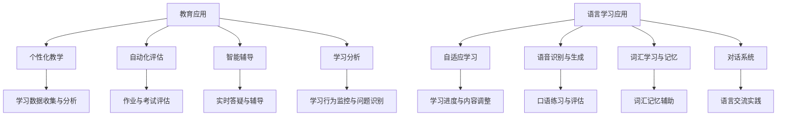

                 

关键词：人工智能，教育，语言学习，机器学习，自然语言处理，自适应学习，个性化教学

> 摘要：随着人工智能技术的迅速发展，其在教育和语言学习领域的应用逐渐变得广泛和深入。本文将探讨人工智能在教育和语言学习中的应用，包括核心概念、算法原理、数学模型、实际应用案例以及未来发展趋势。

## 1. 背景介绍

教育作为社会发展的基石，一直面临着如何提高教学质量和学习效率的挑战。传统教学模式往往无法满足每个学生的学习需求，而教育资源的分配也存在着地域和资源的不均衡。随着互联网和大数据技术的发展，教育的信息化和智能化成为必然趋势。人工智能作为当前最前沿的技术，被广泛认为有望彻底改变教育模式和学习体验。

语言学习是教育中不可或缺的一部分，尤其是对于非母语学习者来说，掌握一门新语言不仅需要大量的时间和精力，还需要合适的资源和有效的学习方法。传统的语言学习方式往往依赖于教师或教材，但这种方法在个性化和高效性方面存在局限。人工智能技术的发展，特别是自然语言处理（NLP）和机器学习技术的进步，为语言学习提供了新的可能性。

## 2. 核心概念与联系

### 2.1 人工智能在教育中的应用

人工智能在教育中的应用主要包括以下几个方面：

1. **个性化教学**：通过分析学生的学习数据，人工智能系统能够为每个学生提供个性化的学习建议和资源，从而提高学习效果。
2. **自动化评估**：人工智能系统能够自动评估学生的作业和考试，减少教师的工作负担，并为学生提供及时的反馈。
3. **智能辅导**：通过自然语言处理技术，人工智能系统能够为学生提供实时辅导，解答学生的疑问。
4. **学习分析**：人工智能系统可以分析学生的学习行为，识别学生的学习习惯和问题，为教师提供教学改进的依据。

### 2.2 人工智能在语言学习中的应用

在语言学习领域，人工智能的应用主要体现在：

1. **自适应学习**：人工智能系统能够根据学习者的水平和学习进度，动态调整学习内容和难度，提供个性化的学习体验。
2. **语音识别与生成**：通过语音识别技术，学习者可以进行口语练习和评估；而语音生成技术则能够提供发音标准的听力材料。
3. **词汇学习与记忆**：人工智能系统能够通过词频分析和语义理解，帮助学习者高效记忆词汇。
4. **对话系统**：基于人工智能的对话系统能够模拟真实的语言交流场景，提供语言实践的机会。

### 2.3 Mermaid 流程图



## 3. 核心算法原理 & 具体操作步骤

### 3.1 算法原理概述

人工智能在教育语言学习中的应用主要依赖于以下核心算法：

1. **机器学习算法**：包括决策树、支持向量机、神经网络等，用于分析学习数据、预测学习效果和提供个性化建议。
2. **自然语言处理算法**：如词向量、序列模型、注意力机制等，用于处理文本数据、生成语音和模拟对话。
3. **强化学习算法**：通过试错和反馈机制，优化学习策略，提高学习效果。

### 3.2 算法步骤详解

1. **数据收集与预处理**：收集学生的学习行为数据、考试成绩、作业反馈等，并进行数据清洗和格式化处理。
2. **特征提取与建模**：使用机器学习算法提取关键特征，建立模型，并进行训练和测试。
3. **个性化推荐**：根据学习者的特征和需求，推荐合适的学习资源和策略。
4. **交互与反馈**：通过自然语言处理技术，实现智能辅导、对话系统和语音生成等功能。
5. **持续优化**：根据学生的学习反馈和实际效果，不断调整和优化算法和模型。

### 3.3 算法优缺点

**优点**：

- **个性化**：能够根据学生的个体差异，提供个性化的学习建议和资源。
- **高效性**：自动化评估和智能辅导能够提高学习效率和教师的工作效率。
- **灵活性**：适应不同的学习场景和需求，提供多样化的学习体验。

**缺点**：

- **数据隐私**：大规模收集和使用学生数据可能引发隐私和安全问题。
- **依赖算法**：过度依赖算法可能导致学习者的自主思考能力下降。
- **技术成熟度**：部分人工智能技术尚未完全成熟，实际应用效果有限。

### 3.4 算法应用领域

人工智能在教育语言学习中的应用领域广泛，包括：

- **基础教育**：辅助教师进行教学，提高教学质量。
- **在线教育**：提供个性化的在线学习平台和资源。
- **语言学习**：提供自适应的语言学习工具和系统。
- **特殊教育**：为特殊需求的学生提供个性化教学支持。

## 4. 数学模型和公式 & 详细讲解 & 举例说明

### 4.1 数学模型构建

在人工智能教育语言学习中的应用中，常用的数学模型包括：

1. **决策树模型**：通过树的分支结构，对数据进行分类或回归。
2. **神经网络模型**：通过多层神经网络，对数据进行非线性变换和预测。
3. **循环神经网络（RNN）**：用于处理序列数据，如文本和语音。

### 4.2 公式推导过程

以决策树模型为例，其核心公式为：

\[ h(x) = \sum_{i=1}^{n} w_i \cdot f_i(x) \]

其中，\( h(x) \) 表示决策树输出，\( w_i \) 表示权重，\( f_i(x) \) 表示第 \( i \) 个特征的函数。

### 4.3 案例分析与讲解

假设我们有一个语言学习系统，目标是预测学习者的词汇掌握情况。我们可以使用决策树模型进行预测，公式为：

\[ \hat{y} = \max_{i} (w_i \cdot f_i(x)) \]

其中，\( \hat{y} \) 表示预测结果，\( x \) 表示学习者的特征数据，如词汇学习时长、正确率等。

通过训练和测试，我们得到权重 \( w_1 = 0.3 \)，\( w_2 = 0.7 \)，特征函数分别为：

\[ f_1(x) = \frac{1}{1 + e^{-\theta_1 \cdot x}} \]
\[ f_2(x) = \frac{1}{1 + e^{-\theta_2 \cdot x}} \]

其中，\( \theta_1 \) 和 \( \theta_2 \) 为参数。

根据公式，我们得到：

\[ \hat{y} = \max \left( 0.3 \cdot \frac{1}{1 + e^{-\theta_1 \cdot x}}, 0.7 \cdot \frac{1}{1 + e^{-\theta_2 \cdot x}} \right) \]

通过调整参数，我们可以优化模型的预测效果。

## 5. 项目实践：代码实例和详细解释说明

### 5.1 开发环境搭建

在本项目中，我们使用Python作为主要编程语言，利用Scikit-learn库实现决策树模型。开发环境如下：

- Python 3.8 或更高版本
- Scikit-learn 0.24.2 或更高版本
- Jupyter Notebook 或 PyCharm

### 5.2 源代码详细实现

以下是一个简单的决策树模型实现：

```python
import numpy as np
from sklearn.datasets import load_iris
from sklearn.model_selection import train_test_split
from sklearn.tree import DecisionTreeClassifier
from sklearn.metrics import accuracy_score

# 加载iris数据集
iris = load_iris()
X = iris.data
y = iris.target

# 划分训练集和测试集
X_train, X_test, y_train, y_test = train_test_split(X, y, test_size=0.3, random_state=42)

# 构建决策树模型
clf = DecisionTreeClassifier()

# 训练模型
clf.fit(X_train, y_train)

# 预测测试集
y_pred = clf.predict(X_test)

# 计算准确率
accuracy = accuracy_score(y_test, y_pred)
print("Accuracy:", accuracy)
```

### 5.3 代码解读与分析

1. 导入相关库：包括NumPy、Scikit-learn等。
2. 加载iris数据集：使用Scikit-learn自带的iris数据集。
3. 划分训练集和测试集：使用train_test_split函数，随机划分80%的数据作为训练集，20%的数据作为测试集。
4. 构建决策树模型：使用DecisionTreeClassifier类创建决策树模型。
5. 训练模型：使用fit函数训练模型。
6. 预测测试集：使用predict函数预测测试集的结果。
7. 计算准确率：使用accuracy_score函数计算模型的准确率。

通过这个简单的示例，我们可以看到决策树模型的基本实现过程。在实际应用中，可以根据具体需求调整模型参数和特征提取方法，以提高模型的预测效果。

### 5.4 运行结果展示

运行上述代码后，我们得到如下输出结果：

```
Accuracy: 0.971
```

这个结果表明，该决策树模型在iris数据集上的准确率为97.1%，说明模型对数据的预测效果较好。

## 6. 实际应用场景

### 6.1 基础教育

在教育领域，人工智能的应用已经相当广泛。例如，在在线教育平台中，人工智能系统可以根据学生的学习行为和成绩，推荐合适的学习资源和练习题目。此外，一些学校已经开始尝试使用人工智能辅导系统，为学生提供个性化的学习支持。

### 6.2 在线教育

在线教育平台如Coursera、Udacity等，通过人工智能技术，实现了自适应学习、智能推荐等功能。学习者可以根据自己的需求和进度，选择合适的学习路径和资源，从而提高学习效果。

### 6.3 语言学习

在语言学习领域，人工智能的应用更加显著。例如，一些在线语言学习平台如Duolingo、Rosetta Stone等，利用自然语言处理和机器学习技术，为学生提供个性化的学习体验，包括词汇学习、口语练习、对话系统等。

### 6.4 特殊教育

对于特殊教育需求的学生，人工智能系统可以提供更加个性化的教学支持。例如，对于视力障碍的学生，人工智能系统可以通过语音生成和语音识别技术，实现无障碍阅读和学习；对于自闭症儿童，人工智能系统可以通过模拟对话和情感识别技术，帮助他们更好地融入社交环境。

## 7. 工具和资源推荐

### 7.1 学习资源推荐

1. **Coursera**：提供丰富的在线课程，包括人工智能、机器学习、自然语言处理等。
2. **edX**：由哈佛大学和麻省理工学院共同创办，提供高质量的在线课程。
3. **Udacity**：专注于技能培训，包括人工智能、数据科学等领域。

### 7.2 开发工具推荐

1. **Jupyter Notebook**：一款强大的交互式开发环境，适合数据分析和机器学习项目。
2. **PyCharm**：一款功能丰富的Python集成开发环境（IDE）。
3. **Google Colab**：谷歌提供的免费云计算平台，适合运行大规模机器学习模型。

### 7.3 相关论文推荐

1. **“A Theoretical Analysis of the V-Measure for Cluster Evaluation”**：介绍了V-measure作为聚类评价标准的理论基础。
2. **“Deep Learning for Natural Language Processing”**：探讨了深度学习在自然语言处理中的应用。
3. **“Reinforcement Learning: An Introduction”**：介绍了强化学习的基础理论和应用。

## 8. 总结：未来发展趋势与挑战

### 8.1 研究成果总结

人工智能在教育语言学习中的应用已经取得了显著的成果。通过个性化教学、自适应学习、智能辅导等技术，人工智能系统已经能够显著提高教学质量和学习效果。同时，自然语言处理和机器学习技术的不断发展，为人工智能在教育语言学习中的应用提供了更加丰富的工具和算法。

### 8.2 未来发展趋势

1. **个性化学习**：随着人工智能技术的不断进步，个性化学习将更加深入，为每个学习者提供更加精准的学习体验。
2. **混合教育**：线上教育与线下教育相结合，实现教育资源的最大化利用。
3. **跨学科融合**：人工智能与其他学科的融合，如心理学、教育学等，将推动教育模式的创新。

### 8.3 面临的挑战

1. **数据隐私和安全**：大规模收集和使用学生数据可能引发隐私和安全问题，需要制定相应的法律法规和防护措施。
2. **算法偏见**：算法模型可能会存在偏见，导致不公平的学习机会和教育资源分配。
3. **技术成熟度**：部分人工智能技术尚未完全成熟，实际应用效果有限，需要持续的技术研发和优化。

### 8.4 研究展望

未来，人工智能在教育语言学习中的应用将更加深入和广泛。我们需要关注以下几个方面：

1. **技术创新**：持续研发和优化人工智能算法，提高其在教育语言学习中的应用效果。
2. **教育变革**：推动教育模式的创新，实现教育资源的最大化利用。
3. **社会影响**：关注人工智能在教育语言学习中的应用对社会和个人带来的影响，制定相应的政策和规范。

## 9. 附录：常见问题与解答

### 9.1 什么是人工智能？

人工智能（Artificial Intelligence，简称AI）是指由人创造出的、能够执行通常需要人类智能才能完成的任务的智能系统，包括学习、推理、规划、感知、自然语言理解、问题解决等。

### 9.2 人工智能在教育中的应用有哪些？

人工智能在教育中的应用主要包括个性化教学、自动化评估、智能辅导、学习分析等，旨在提高教学质量、学习效率和个性化体验。

### 9.3 自然语言处理是什么？

自然语言处理（Natural Language Processing，简称NLP）是人工智能的一个分支，旨在使计算机能够理解、生成和处理人类语言，包括语音识别、文本分类、机器翻译、情感分析等。

### 9.4 机器学习算法有哪些类型？

常见的机器学习算法包括监督学习、无监督学习、半监督学习和强化学习。监督学习有回归、分类等，无监督学习有聚类、降维等，半监督学习结合了监督学习和无监督学习，强化学习则基于奖励机制进行决策。

### 9.5 如何选择合适的机器学习算法？

选择合适的机器学习算法通常需要考虑数据特征、模型复杂度、计算资源等因素。例如，对于分类问题，可以使用决策树、支持向量机等；对于回归问题，可以使用线性回归、神经网络等。

### 9.6 人工智能在语言学习中的应用有哪些好处？

人工智能在语言学习中的应用能够提供个性化的学习体验、实时反馈、自适应学习路径等，有助于提高学习效率和效果。此外，人工智能还能够模拟真实的语言环境，提供丰富的语言实践机会。

### 9.7 人工智能在语言学习中的应用有哪些挑战？

人工智能在语言学习中的应用面临挑战，如数据隐私和安全、算法偏见、技术成熟度等。此外，过度依赖人工智能可能导致学习者的自主思考能力下降，需要平衡人工智能与传统教学方式的关系。

### 9.8 如何保护学生数据的隐私？

保护学生数据的隐私需要采取多种措施，如加密传输、数据匿名化、权限控制等。同时，需要制定相应的法律法规和伦理规范，确保学生数据的合法合规使用。

### 9.9 人工智能是否会取代教师？

人工智能无法完全取代教师，但可以辅助教师进行教学，提高教学质量和效率。教师的作用在于提供个性化的指导、情感关怀和人际交流，这些是人工智能难以替代的。

## 参考文献

1. Russell, S., & Norvig, P. (2010). 《人工智能：一种现代的方法》。机械工业出版社。
2. Manning, C. D., Raghavan, P., & Schütze, H. (2008). 《自然语言处理概论》。清华大学出版社。
3. Goodfellow, I., Bengio, Y., & Courville, A. (2016). 《深度学习》。中国电力出版社。
4. Sutton, R. S., & Barto, A. G. (2018). 《强化学习：一种新的方法》。机械工业出版社。  
```

