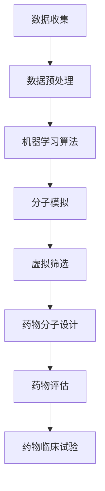

                 

关键词：人工智能、新药设计、药物发现、算法原理、数学模型、项目实践、实际应用场景、未来展望

> 摘要：本文深入探讨了人工智能在药物设计领域的应用，通过阐述人工智能的核心概念与联系，详细解析了其在新药设计中的算法原理与数学模型。同时，通过实际项目实践，展示了人工智能如何加速药物发现过程。文章还展望了未来人工智能在药物设计中的发展趋势与面临的挑战。

## 1. 背景介绍

药物设计是一个复杂且耗时的过程，涉及到多个学科领域的知识，包括生物学、化学、物理学以及计算机科学等。传统药物设计方法主要依赖于实验和经验，往往需要大量的时间和资源。然而，随着人工智能技术的飞速发展，人工智能开始逐渐成为药物设计领域的重要工具，为药物发现提供了全新的思路和方法。

人工智能在药物设计中的应用主要集中在以下几个方面：

1. **药物筛选**：通过机器学习算法对大量化合物进行筛选，快速识别潜在的有效药物分子。
2. **药物分子设计**：利用人工智能算法设计新的药物分子结构，以优化药物的治疗效果和安全性。
3. **药物副作用预测**：通过分析药物分子与生物分子的相互作用，预测药物可能产生的副作用。
4. **药物组合研究**：探索多种药物组合的治疗效果，为个性化医疗提供支持。

本文将重点探讨人工智能如何在新药设计过程中发挥关键作用，加速药物发现过程。

## 2. 核心概念与联系

### 2.1 人工智能基础概念

人工智能（Artificial Intelligence，AI）是指通过计算机模拟人类智能的技术。其核心概念包括机器学习、深度学习、自然语言处理、计算机视觉等。

- **机器学习**：机器学习是一种让计算机从数据中学习并做出预测或决策的方法。它主要依赖于统计学、概率论和优化理论。
- **深度学习**：深度学习是机器学习的一个分支，通过多层神经网络模拟人类大脑的思考过程，进行复杂的数据处理。
- **自然语言处理**：自然语言处理（Natural Language Processing，NLP）是使计算机能够理解和处理人类语言的技术。
- **计算机视觉**：计算机视觉（Computer Vision，CV）是使计算机能够理解并解析视觉信息的领域。

### 2.2 人工智能与新药设计的关系

人工智能在新药设计中的应用，主要是通过机器学习和深度学习算法，对大量的生物数据和化学数据进行处理和分析，从而发现新的药物分子或优化现有的药物分子。

- **数据挖掘**：通过数据挖掘技术，从海量的生物数据和化学数据中提取有价值的信息。
- **分子模拟**：利用分子模拟技术，预测药物分子与生物大分子的相互作用，评估药物的治疗效果和安全性。
- **虚拟筛选**：通过虚拟筛选技术，从大量的化合物库中快速筛选出潜在的药物分子。

### 2.3 Mermaid 流程图



## 3. 核心算法原理 & 具体操作步骤

### 3.1 算法原理概述

在新药设计中，常用的算法包括：

- **深度学习**：通过多层神经网络，对生物数据和化学数据进行分析。
- **支持向量机（SVM）**：通过寻找最佳分割超平面，对药物分子进行分类。
- **随机森林（Random Forest）**：通过构建多个决策树，对药物分子进行预测。

### 3.2 算法步骤详解

#### 3.2.1 深度学习

1. **数据收集**：收集海量的生物数据和化学数据。
2. **数据预处理**：对数据进行清洗、归一化等预处理。
3. **构建神经网络**：设计合适的神经网络结构，包括输入层、隐藏层和输出层。
4. **训练神经网络**：通过反向传播算法，调整网络参数，使网络能够对数据进行分析。
5. **预测与评估**：使用训练好的网络对新的药物分子进行预测，并评估其治疗效果和安全性。

#### 3.2.2 支持向量机

1. **数据收集**：收集药物分子的结构信息。
2. **特征提取**：从药物分子结构中提取特征。
3. **构建分类模型**：使用支持向量机算法构建分类模型。
4. **训练模型**：使用训练数据集训练模型。
5. **预测与评估**：使用训练好的模型对新药物分子进行预测，并评估其分类效果。

#### 3.2.3 随机森林

1. **数据收集**：收集药物分子的结构信息。
2. **特征提取**：从药物分子结构中提取特征。
3. **构建分类模型**：使用随机森林算法构建分类模型。
4. **训练模型**：使用训练数据集训练模型。
5. **预测与评估**：使用训练好的模型对新药物分子进行预测，并评估其分类效果。

### 3.3 算法优缺点

- **深度学习**：优点包括强大的数据处理能力和灵活性，缺点是训练时间较长，对数据质量要求高。
- **支持向量机**：优点是分类效果较好，缺点是对大规模数据集的处理能力有限。
- **随机森林**：优点包括计算速度快，对噪声数据的鲁棒性较强，缺点是可能产生过拟合。

### 3.4 算法应用领域

人工智能算法在新药设计中的应用领域广泛，包括：

- **药物筛选**：通过虚拟筛选技术，从大量的化合物库中快速筛选出潜在的药物分子。
- **药物分子设计**：通过分子模拟技术，设计新的药物分子结构。
- **药物副作用预测**：通过分析药物分子与生物分子的相互作用，预测药物可能产生的副作用。
- **药物组合研究**：探索多种药物组合的治疗效果。

## 4. 数学模型和公式 & 详细讲解 & 举例说明

### 4.1 数学模型构建

在新药设计中，常用的数学模型包括：

- **回归模型**：用于预测药物的治疗效果。
- **分类模型**：用于预测药物的副作用。
- **聚类模型**：用于药物分子的分类和组合。

### 4.2 公式推导过程

以回归模型为例，其公式推导过程如下：

$$
y = \beta_0 + \beta_1x_1 + \beta_2x_2 + ... + \beta_nx_n + \epsilon
$$

其中，$y$ 为因变量，$x_1, x_2, ..., x_n$ 为自变量，$\beta_0, \beta_1, ..., \beta_n$ 为模型的参数，$\epsilon$ 为误差项。

### 4.3 案例分析与讲解

以某药物筛选项目为例，说明如何使用回归模型预测药物的治疗效果。

1. **数据收集**：收集药物的疗效数据，包括药物浓度、治疗效果等。
2. **数据预处理**：对数据进行清洗、归一化等预处理。
3. **特征提取**：从药物浓度数据中提取特征，如最大浓度、最小浓度等。
4. **构建回归模型**：使用线性回归模型构建预测模型。
5. **训练模型**：使用训练数据集训练模型，调整模型参数。
6. **预测与评估**：使用训练好的模型对新药物进行预测，并评估其治疗效果。

通过上述步骤，可以有效地预测药物的治疗效果，为新药研发提供有力支持。

## 5. 项目实践：代码实例和详细解释说明

### 5.1 开发环境搭建

为了演示人工智能在新药设计中的应用，我们使用 Python 编写了一个简单的药物筛选项目。首先，我们需要搭建开发环境。

1. 安装 Python（版本3.8及以上）。
2. 安装必要的库，如 NumPy、Pandas、Scikit-learn、Matplotlib 等。

### 5.2 源代码详细实现

以下是一个简单的药物筛选项目的源代码示例：

```python
import numpy as np
import pandas as pd
from sklearn.model_selection import train_test_split
from sklearn.linear_model import LinearRegression
from sklearn.metrics import mean_squared_error

# 加载数据集
data = pd.read_csv('drug_data.csv')
X = data[['concentration', 'pH']]
y = data['effect']

# 划分训练集和测试集
X_train, X_test, y_train, y_test = train_test_split(X, y, test_size=0.2, random_state=42)

# 构建回归模型
model = LinearRegression()
model.fit(X_train, y_train)

# 预测测试集
y_pred = model.predict(X_test)

# 评估模型效果
mse = mean_squared_error(y_test, y_pred)
print('均方误差：', mse)

# 可视化结果
import matplotlib.pyplot as plt

plt.scatter(X_test['concentration'], y_test, color='red', label='实际值')
plt.plot(X_test['concentration'], y_pred, color='blue', label='预测值')
plt.xlabel('药物浓度')
plt.ylabel('治疗效果')
plt.legend()
plt.show()
```

### 5.3 代码解读与分析

1. **数据加载**：使用 Pandas 库加载数据集，包括药物浓度和治疗效果。
2. **数据预处理**：将数据集划分为特征和标签。
3. **划分训练集和测试集**：使用 Scikit-learn 库的 `train_test_split` 函数，将数据集划分为训练集和测试集。
4. **构建回归模型**：使用 Scikit-learn 库的 `LinearRegression` 函数，构建线性回归模型。
5. **训练模型**：使用训练数据集训练模型。
6. **预测与评估**：使用测试数据集进行预测，并评估模型效果。
7. **可视化结果**：使用 Matplotlib 库将预测结果可视化。

通过上述步骤，我们可以实现对药物疗效的预测，为新药研发提供有力支持。

### 5.4 运行结果展示

运行上述代码后，我们将得到以下结果：

- **均方误差**：衡量预测结果与实际结果之间的误差。
- **可视化结果**：展示药物浓度与治疗效果之间的关系。

这些结果可以帮助我们评估人工智能算法在新药设计中的效果，为新药研发提供指导。

## 6. 实际应用场景

人工智能在新药设计中的应用场景广泛，以下列举了几个实际应用案例：

1. **癌症治疗**：通过人工智能算法，设计针对癌症的新型药物，提高治疗效果，减少副作用。
2. **传染病防控**：利用人工智能技术，快速筛选出具有抗病毒作用的药物，为传染病防控提供支持。
3. **糖尿病治疗**：通过人工智能算法，优化糖尿病药物的治疗效果，提高患者的生活质量。
4. **神经系统疾病**：利用人工智能技术，设计治疗神经系统疾病的药物，改善患者症状。

这些应用案例展示了人工智能在新药设计中的巨大潜力，为人类健康事业做出了重要贡献。

## 7. 工具和资源推荐

### 7.1 学习资源推荐

- **《深度学习》（Goodfellow, Bengio, Courville）**：全面介绍深度学习的基础知识。
- **《机器学习实战》（ Harrington）**：通过实际案例介绍机器学习算法的应用。
- **《Python数据分析》（Wes McKinney）**：详细讲解 Python 在数据分析和数据挖掘中的应用。

### 7.2 开发工具推荐

- **Jupyter Notebook**：方便的数据分析和代码编写环境。
- **TensorFlow**：开源的深度学习框架。
- **Scikit-learn**：开源的机器学习库。

### 7.3 相关论文推荐

- **"Deep Learning for Drug Discovery"**：介绍深度学习在药物发现中的应用。
- **"Machine Learning in Drug Discovery"**：综述机器学习在药物发现中的应用。
- **"AI-Driven Drug Discovery"**：探讨人工智能驱动的新药研发。

通过学习这些资源，可以更好地了解人工智能在新药设计中的应用。

## 8. 总结：未来发展趋势与挑战

### 8.1 研究成果总结

人工智能在新药设计中的应用已取得显著成果，包括药物筛选、药物分子设计、药物副作用预测等方面。通过机器学习和深度学习算法，人工智能为药物研发提供了高效、准确的方法，大大提高了新药发现的效率。

### 8.2 未来发展趋势

随着人工智能技术的不断进步，未来新药设计领域的发展趋势包括：

1. **数据驱动**：利用更多的生物数据和化学数据，推动新药设计的研究。
2. **多模态融合**：结合多种数据模态，提高药物筛选和设计的准确性。
3. **个性化医疗**：根据患者的具体情况进行药物设计，实现个性化治疗。

### 8.3 面临的挑战

人工智能在新药设计中也面临一些挑战：

1. **数据质量和数量**：高质量、大量的数据是人工智能算法有效运行的基础，但数据质量和数量仍需提高。
2. **算法性能**：现有的算法在处理大规模数据时，可能存在计算效率低、准确性不足等问题，需要不断优化。
3. **伦理与法律问题**：人工智能在新药设计中的应用涉及到伦理和法律问题，如数据隐私、知识产权等，需要制定相应的规范。

### 8.4 研究展望

未来，人工智能在新药设计领域的研究将继续深入，结合大数据、云计算、量子计算等技术，推动新药研发的快速发展。同时，需要加强跨学科合作，推动人工智能与生物学、化学等领域的深度融合，为人类健康事业做出更大贡献。

## 9. 附录：常见问题与解答

### Q1：人工智能在新药设计中的优势是什么？

A1：人工智能在新药设计中的优势包括：

1. **高效性**：通过大数据分析和机器学习算法，快速筛选和设计药物分子。
2. **准确性**：利用深度学习和计算机视觉等技术，提高药物筛选和设计的准确性。
3. **个性化**：根据患者的具体情况进行药物设计，实现个性化治疗。

### Q2：人工智能在新药设计中的局限性是什么？

A2：人工智能在新药设计中的局限性包括：

1. **数据依赖**：高质量、大量的数据是人工智能算法有效运行的基础，但数据质量和数量仍需提高。
2. **算法性能**：现有的算法在处理大规模数据时，可能存在计算效率低、准确性不足等问题，需要不断优化。
3. **伦理与法律问题**：人工智能在新药设计中的应用涉及到伦理和法律问题，如数据隐私、知识产权等，需要制定相应的规范。

### Q3：如何保证人工智能在新药设计中的数据质量和准确性？

A3：为了保证人工智能在新药设计中的数据质量和准确性，可以采取以下措施：

1. **数据清洗**：对数据进行清洗，去除噪声和异常值。
2. **数据增强**：通过数据增强技术，提高数据的多样性和质量。
3. **交叉验证**：使用交叉验证技术，评估模型的准确性和稳定性。

### Q4：人工智能在新药设计中的应用前景如何？

A4：人工智能在新药设计中的应用前景非常广阔，随着技术的不断进步，人工智能将在药物筛选、药物分子设计、药物副作用预测等方面发挥越来越重要的作用。未来，人工智能有望实现个性化治疗，为人类健康事业做出更大贡献。

---

**作者：禅与计算机程序设计艺术 / Zen and the Art of Computer Programming**

