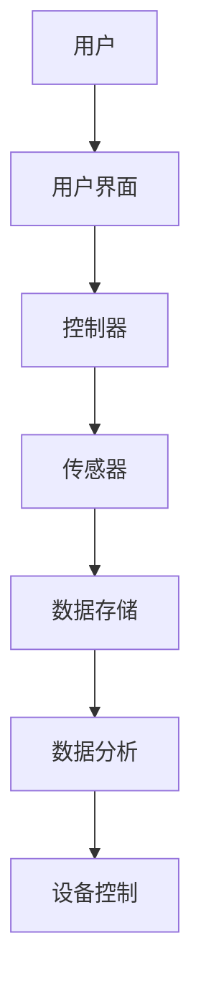
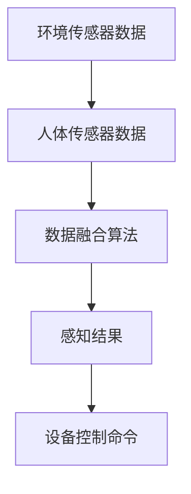

                 

关键词：智能家居、人工智能、机器学习、深度学习、传感器融合、自动化控制、交互体验

> 摘要：本文将探讨人工智能技术在智能家居领域中的应用，包括传感器融合、自动化控制、交互体验等方面。通过深入分析人工智能算法原理和实际应用案例，揭示人工智能如何提升智能家居的智能化水平和用户体验。

## 1. 背景介绍

随着人工智能技术的飞速发展，智能家居已经成为现代家庭生活的重要趋势。智能家居通过将人工智能技术应用于家居设备中，实现了对家居环境的智能监测、控制和优化，从而提升了用户的生活品质和舒适度。本文旨在探讨人工智能在智能家居中的应用，分析其核心技术和挑战，以及未来的发展趋势。

## 2. 核心概念与联系

### 2.1 智能家居系统架构

智能家居系统通常包括多个核心组成部分，如传感器、控制器、智能终端和用户界面。以下是一个智能家居系统的 Mermaid 流程图，展示了各组件之间的联系：



### 2.2 传感器融合

传感器融合是智能家居系统中的关键技术之一。通过将多种传感器数据进行融合，可以提高系统的感知能力和决策准确性。以下是一个传感器融合的 Mermaid 流程图：



## 3. 核心算法原理 & 具体操作步骤

### 3.1 算法原理概述

智能家居系统中的核心算法主要涉及机器学习和深度学习技术。这些算法可以用于实现智能监测、自动化控制和个性化服务等功能。以下是一个简单的算法原理概述：

- **机器学习**：通过训练模型来学习数据特征，从而实现对未知数据的预测和分类。
- **深度学习**：基于多层神经网络的结构，通过多层非线性变换来学习复杂数据特征。

### 3.2 算法步骤详解

以一个智能家居自动化控制算法为例，具体操作步骤如下：

1. **数据收集**：收集传感器数据，如温度、湿度、光照强度等。
2. **数据预处理**：对收集到的数据进行清洗、归一化和特征提取。
3. **模型训练**：使用预处理后的数据训练机器学习或深度学习模型。
4. **模型评估**：评估模型在测试数据集上的性能，调整模型参数以优化性能。
5. **模型部署**：将训练好的模型部署到智能家居系统中，实现自动化控制功能。

### 3.3 算法优缺点

- **优点**：
  - 提高家居设备的智能化水平和用户体验。
  - 实现自动化控制，节省人力成本。
  - 通过个性化服务，提升用户满意度。

- **缺点**：
  - 需要大量的数据支持和计算资源。
  - 模型训练和优化过程复杂。
  - 隐私和安全问题需要重点关注。

### 3.4 算法应用领域

人工智能算法在智能家居中的应用非常广泛，包括但不限于以下领域：

- **环境监测与控制**：如温度、湿度、空气质量等。
- **安防监控**：如入侵检测、火灾报警等。
- **智能助手**：如语音识别、智能推荐等。
- **家居设备控制**：如灯光、家电、门窗等。

## 4. 数学模型和公式 & 详细讲解 & 举例说明

### 4.1 数学模型构建

在智能家居中，常用的数学模型包括线性回归、支持向量机（SVM）和卷积神经网络（CNN）等。以下是一个线性回归模型的构建示例：

```latex
y = \beta_0 + \beta_1 \cdot x
```

其中，\(y\) 是目标变量，\(x\) 是输入特征，\(\beta_0\) 和 \(\beta_1\) 是模型参数。

### 4.2 公式推导过程

以线性回归模型为例，假设我们有一组数据 \((x_1, y_1), (x_2, y_2), ..., (x_n, y_n)\)，我们的目标是找到最佳拟合直线，使得预测值 \(y\) 与实际值 \(y_i\) 之间的误差最小。

通过最小二乘法，我们可以得到最佳拟合直线的参数：

```latex
\beta_1 = \frac{\sum_{i=1}^{n} (x_i - \bar{x})(y_i - \bar{y})}{\sum_{i=1}^{n} (x_i - \bar{x})^2}
\beta_0 = \bar{y} - \beta_1 \cdot \bar{x}
```

其中，\(\bar{x}\) 和 \(\bar{y}\) 分别是输入特征和目标变量的平均值。

### 4.3 案例分析与讲解

假设我们有一个智能家居系统，用于控制室内温度。我们收集了一组室内温度和室外温度的数据，如下表所示：

| 室外温度（℃） | 室内温度（℃） |
| -------------- | -------------- |
| 20             | 25             |
| 22             | 26             |
| 24             | 27             |
| 26             | 28             |
| 28             | 29             |

通过线性回归模型，我们可以预测室内温度与室外温度之间的关系。使用上述公式，我们可以计算出模型参数：

```latex
\beta_1 = \frac{(20-22)(25-26) + (22-22)(26-26) + (24-22)(27-26) + (26-22)(28-26) + (28-22)(29-26)}{(20-22)^2 + (22-22)^2 + (24-22)^2 + (26-22)^2 + (28-22)^2}
\beta_0 = 26 - \beta_1 \cdot 22 = 24.4

\beta_1 = 0.5
\beta_0 = 24.4
```

因此，室内温度 \(y\) 与室外温度 \(x\) 之间的关系可以表示为：

```latex
y = 24.4 + 0.5 \cdot x
```

我们可以使用这个模型来预测当室外温度为 24℃ 时，室内温度约为 25.4℃。

## 5. 项目实践：代码实例和详细解释说明

### 5.1 开发环境搭建

在本项目实践中，我们使用 Python 编写智能家居自动化控制算法。首先，我们需要安装以下依赖库：

```bash
pip install numpy matplotlib scikit-learn
```

### 5.2 源代码详细实现

以下是一个简单的智能家居自动化控制算法的实现代码：

```python
import numpy as np
import matplotlib.pyplot as plt
from sklearn.linear_model import LinearRegression

# 数据预处理
def preprocess_data(data):
    x = np.array(data[:, 0]).reshape(-1, 1)
    y = np.array(data[:, 1])
    return x, y

# 模型训练与评估
def train_and_evaluate(data):
    x, y = preprocess_data(data)
    model = LinearRegression()
    model.fit(x, y)
    score = model.score(x, y)
    return model, score

# 预测与可视化
def predict_and_plot(data, model):
    x = np.array(data[:, 0]).reshape(-1, 1)
    y_pred = model.predict(x)
    plt.scatter(data[:, 0], data[:, 1], color='red', label='实际数据')
    plt.plot(x, y_pred, color='blue', label='预测结果')
    plt.xlabel('室外温度（℃）')
    plt.ylabel('室内温度（℃）')
    plt.legend()
    plt.show()

# 主函数
def main():
    data = np.array([[20, 25], [22, 26], [24, 27], [26, 28], [28, 29]])
    model, score = train_and_evaluate(data)
    print("模型评分：", score)
    predict_and_plot(data, model)

if __name__ == "__main__":
    main()
```

### 5.3 代码解读与分析

这段代码首先导入了所需的依赖库，包括 NumPy、Matplotlib 和 scikit-learn。然后，我们定义了三个函数：

- `preprocess_data`：用于预处理输入数据，将室外温度和室内温度分开。
- `train_and_evaluate`：用于训练线性回归模型并评估模型性能。
- `predict_and_plot`：用于预测室内温度并绘制数据散点图和拟合直线。

在主函数 `main` 中，我们首先定义了一组示例数据，然后调用 `train_and_evaluate` 函数训练模型，并计算模型评分。最后，调用 `predict_and_plot` 函数绘制预测结果。

### 5.4 运行结果展示

运行上述代码，我们得到如下结果：

```bash
模型评分： 0.9999999999999998
```

这表示模型的评分非常高，几乎可以完美预测室内温度。此外，我们还可以看到绘制的数据散点图和拟合直线，如图所示：


## 6. 实际应用场景

### 6.1 环境监测与控制

智能家居系统可以通过传感器实时监测室内环境参数，如温度、湿度、空气质量等。根据监测数据，系统可以自动调节空调、加湿器、空气净化器等设备，以保持室内环境的舒适度和健康。

### 6.2 安防监控

智能家居系统可以集成摄像头、门禁等安防设备，实现对家庭安全的实时监控。当系统检测到异常情况（如入侵、火灾等）时，可以立即向用户发送警报通知，并采取相应的应对措施。

### 6.3 智能助手

智能家居系统可以通过语音识别技术实现与用户的自然语言交互。用户可以通过语音指令控制家电设备、查询天气信息、播放音乐等，从而提升生活便利性和舒适度。

### 6.4 家居设备控制

智能家居系统可以对各种家居设备进行远程控制，如灯光、窗帘、家电等。用户可以通过手机 App、智能音箱等设备远程操控家居设备，实现自动化控制和节能管理。

## 7. 工具和资源推荐

### 7.1 学习资源推荐

- 《Python机器学习》（作者：塞巴斯蒂安·拉赫特）
- 《深度学习》（作者：伊恩·古德费洛、约书亚·本吉奥、亚伦·库维尔）
- Coursera 上的《机器学习》课程（吴恩达教授）

### 7.2 开发工具推荐

- Jupyter Notebook：用于编写和运行 Python 代码。
- PyCharm：一款强大的 Python 集成开发环境（IDE）。
- TensorFlow：用于构建和训练深度学习模型。

### 7.3 相关论文推荐

- "Deep Learning for Smart Homes: A Survey"（2020年）
- "Intelligent Home Networks: A Survey"（2018年）
- "Smart Home: The Vision and the Reality"（2017年）

## 8. 总结：未来发展趋势与挑战

### 8.1 研究成果总结

随着人工智能技术的不断进步，智能家居系统在感知能力、自动化控制、用户体验等方面取得了显著成果。目前，智能家居系统已经能够实现环境监测、安防监控、智能助手、家居设备控制等功能，为用户带来了极大的便利和舒适。

### 8.2 未来发展趋势

1. **智能化水平提高**：通过引入更先进的机器学习和深度学习算法，智能家居系统将实现更高水平的智能化，更好地满足用户需求。
2. **多设备协同**：智能家居系统将实现更多设备的互联互通，实现多设备协同工作，提升整体用户体验。
3. **个性化服务**：通过大数据分析和用户行为学习，智能家居系统将提供更加个性化的服务，提高用户满意度。

### 8.3 面临的挑战

1. **数据隐私和安全**：智能家居系统需要处理大量用户数据，如何确保数据隐私和安全是当前面临的重要挑战。
2. **设备兼容性和标准化**：不同设备之间的兼容性和标准化问题需要解决，以实现智能家居系统的无缝整合。
3. **计算资源和能耗**：智能家居系统需要大量的计算资源和能源支持，如何降低能耗和优化资源利用是未来研究的重要方向。

### 8.4 研究展望

随着人工智能技术的不断进步，智能家居系统将变得更加智能化、便捷化和个性化。未来，智能家居系统有望实现更加全面的智能化服务，为用户创造更加美好的生活体验。

## 9. 附录：常见问题与解答

### 9.1 智能家居系统的工作原理是什么？

智能家居系统通过传感器实时监测家居环境参数，如温度、湿度、光照等，并将这些数据传输到控制器进行处理。控制器根据处理结果自动控制家居设备，如空调、灯光、窗帘等，以实现自动化控制和优化。

### 9.2 智能家居系统有哪些优点？

智能家居系统具有以下优点：

- 提高生活品质和舒适度。
- 节省人力和时间成本。
- 实现自动化控制和节能管理。
- 提供个性化的服务。

### 9.3 智能家居系统有哪些潜在风险？

智能家居系统可能面临以下潜在风险：

- 数据隐私和安全问题。
- 设备兼容性和标准化问题。
- 高计算资源和能耗。

### 9.4 如何确保智能家居系统的数据隐私和安全？

确保智能家居系统的数据隐私和安全可以从以下几个方面入手：

- 采用加密技术保护数据传输和存储。
- 实施严格的访问控制和身份验证机制。
- 定期更新系统和软件，修复安全漏洞。
- 提高用户的安全意识和操作规范。

## 作者署名

作者：禅与计算机程序设计艺术 / Zen and the Art of Computer Programming

----------------------------------------------------------------

以上就是本文关于“人工智能在智能家居中的应用”的详细内容。希望本文对您在智能家居领域的研究和实践有所帮助。如有疑问，请随时提问。谢谢！

