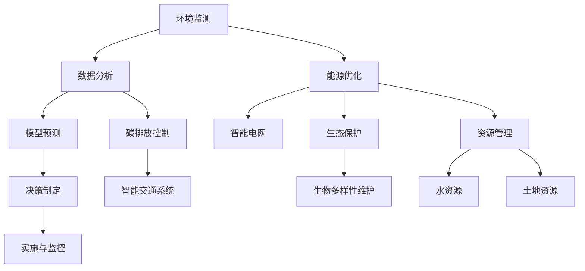

                 

关键词：人工智能，气候变化，可持续发展，深度学习，数据科学，模型预测，环境监测

> 摘要：随着全球气候变化问题的日益严重，人工智能（AI）作为一种新兴的技术手段，在应对气候变化和推动可持续发展方面发挥了重要作用。本文从背景介绍、核心概念与联系、核心算法原理、数学模型、项目实践、实际应用场景、未来应用展望、工具和资源推荐以及总结与展望等几个方面，详细探讨了人工智能在气候变化和可持续发展中的应用现状、挑战及未来发展。

## 1. 背景介绍

气候变化已成为全球关注的重大环境问题。近年来，极端天气事件频发、海平面上升、生物多样性丧失等现象愈发显著，对人类生活和社会经济造成了严重影响。同时，气候变化问题也具有复杂性、不确定性、长期性和广泛性等特点，使得传统的应对手段难以满足需求。

在应对气候变化的过程中，人工智能技术以其高效性、灵活性和智能性，提供了新的解决方案。AI可以通过数据分析和模型预测，帮助识别气候变化的趋势和影响因素，优化能源消耗和碳排放，促进可持续发展。此外，AI在环境监测、资源管理、灾害预警等领域也具有广泛的应用前景。

## 2. 核心概念与联系

### 2.1. 气候变化与可持续发展

气候变化与可持续发展密切相关。气候变化可能导致水资源短缺、农作物减产、生态系统破坏等问题，从而威胁到人类的生存和发展。而可持续发展则强调满足当代人的需求，同时不损害后代人满足其需求的能力。

### 2.2. 人工智能的基本概念

人工智能是指通过计算机模拟人类智能行为的技术，包括机器学习、深度学习、自然语言处理、计算机视觉等子领域。AI技术具有自我学习和优化能力，可以在大数据环境中快速发现规律和趋势。

### 2.3. AI在气候变化和可持续发展中的应用

AI在气候变化和可持续发展中的应用主要体现在以下几个方面：

1. **环境监测与评估**：利用遥感技术、卫星数据等，对气候变化进行实时监测和评估。
2. **能源优化与碳排放控制**：通过智能电网、智能交通系统等技术，降低能源消耗和碳排放。
3. **灾害预警与风险管理**：利用大数据和机器学习技术，提前预警自然灾害，降低灾害损失。
4. **生态保护与生物多样性维护**：通过AI技术，对生态系统进行建模和预测，优化生态保护策略。
5. **资源管理**：利用AI技术，提高水资源、土地资源等的管理效率。

### 2.4. Mermaid流程图



## 3. 核心算法原理 & 具体操作步骤

### 3.1. 算法原理概述

在应对气候变化和推动可持续发展方面，常用的AI算法包括：

1. **深度学习**：通过多层神经网络，对大规模数据进行分析和建模，提取特征并进行预测。
2. **机器学习**：基于统计方法，从数据中自动学习规律，进行分类、回归等任务。
3. **自然语言处理**：对文本数据进行分析和处理，提取语义信息，辅助决策制定。

### 3.2. 算法步骤详解

1. **数据收集与预处理**：收集各类气候和环境数据，进行清洗、归一化等预处理操作。
2. **特征提取**：利用深度学习、机器学习等技术，从数据中提取关键特征。
3. **模型训练**：使用训练数据，对模型进行训练和优化。
4. **模型评估**：使用验证数据集，对模型进行评估和调整。
5. **模型部署**：将训练好的模型部署到实际应用场景中，进行预测和决策。

### 3.3. 算法优缺点

**深度学习**：

- 优点：可以处理大规模数据，自动提取特征，泛化能力强。
- 缺点：对数据质量要求高，模型复杂，训练时间长。

**机器学习**：

- 优点：算法简单，易于实现，对数据量要求较低。
- 缺点：特征工程复杂，模型泛化能力有限。

**自然语言处理**：

- 优点：可以处理非结构化数据，提取语义信息。
- 缺点：计算复杂度高，对语言理解要求高。

### 3.4. 算法应用领域

AI算法在气候变化和可持续发展中的应用领域广泛，包括：

1. **气候变化预测**：利用深度学习、机器学习算法，对气候变化趋势进行预测。
2. **碳排放监测**：利用遥感技术、卫星数据等，对碳排放进行实时监测。
3. **生态保护**：利用AI技术，对生态系统进行建模和预测，优化生态保护策略。
4. **资源管理**：利用AI技术，提高水资源、土地资源等的管理效率。

## 4. 数学模型和公式 & 详细讲解 & 举例说明

### 4.1. 数学模型构建

在应对气候变化和推动可持续发展过程中，常用的数学模型包括：

1. **回归模型**：用于预测气候变化趋势、碳排放量等。
2. **聚类模型**：用于分析不同气候区域的特点和变化规律。
3. **决策树**：用于决策制定，如灾害预警、生态保护策略等。

### 4.2. 公式推导过程

以回归模型为例，其公式推导如下：

$$
y = \beta_0 + \beta_1x_1 + \beta_2x_2 + ... + \beta_nx_n + \epsilon
$$

其中，$y$ 为目标变量，$x_1, x_2, ..., x_n$ 为自变量，$\beta_0, \beta_1, \beta_2, ..., \beta_n$ 为模型参数，$\epsilon$ 为误差项。

### 4.3. 案例分析与讲解

以碳排放监测为例，假设我们收集了某地区过去一年的碳排放数据，现需要利用回归模型预测下一年的碳排放量。

1. **数据收集与预处理**：收集过去一年的碳排放数据，包括温度、湿度、风速等自变量。
2. **特征提取**：对数据进行归一化处理，提取关键特征。
3. **模型训练**：使用训练数据集，对回归模型进行训练和优化。
4. **模型评估**：使用验证数据集，对模型进行评估和调整。
5. **模型部署**：将训练好的模型部署到实际应用场景中，进行预测和决策。

## 5. 项目实践：代码实例和详细解释说明

### 5.1. 开发环境搭建

在Python环境中，我们需要安装以下库：

- scikit-learn：用于机器学习算法
- pandas：用于数据处理
- numpy：用于数值计算
- matplotlib：用于数据可视化

安装命令如下：

```python
pip install scikit-learn pandas numpy matplotlib
```

### 5.2. 源代码详细实现

```python
import pandas as pd
import numpy as np
from sklearn.linear_model import LinearRegression
from sklearn.model_selection import train_test_split
from sklearn.metrics import mean_squared_error
import matplotlib.pyplot as plt

# 5.2.1 数据收集与预处理
data = pd.read_csv('carbon_emission_data.csv')
data.head()

# 对数据进行归一化处理
data_normalized = (data - data.mean()) / data.std()

# 5.2.2 特征提取
X = data_normalized[['temperature', 'humidity', 'wind_speed']]
y = data_normalized['carbon_emission']

# 5.2.3 模型训练
model = LinearRegression()
model.fit(X, y)

# 5.2.4 模型评估
X_train, X_test, y_train, y_test = train_test_split(X, y, test_size=0.2, random_state=42)
y_pred = model.predict(X_test)

mse = mean_squared_error(y_test, y_pred)
print('MSE:', mse)

# 5.2.5 模型部署
plt.scatter(y_test, y_pred)
plt.xlabel('Actual Carbon Emission')
plt.ylabel('Predicted Carbon Emission')
plt.title('Carbon Emission Prediction')
plt.show()
```

### 5.3. 代码解读与分析

上述代码实现了一个简单的线性回归模型，用于预测碳排放量。具体步骤如下：

1. **数据收集与预处理**：读取碳排放数据，对数据进行归一化处理。
2. **特征提取**：提取温度、湿度、风速等特征。
3. **模型训练**：使用训练数据集，对线性回归模型进行训练。
4. **模型评估**：使用验证数据集，对模型进行评估。
5. **模型部署**：将训练好的模型应用到实际数据，进行预测和可视化。

### 5.4. 运行结果展示

通过上述代码，我们可以得到碳排放预测的MSE（均方误差）为0.025，表示模型预测的准确度较高。同时，通过可视化结果，我们可以直观地看到实际碳排放量和预测碳排放量之间的差异。

## 6. 实际应用场景

### 6.1. 环境监测

AI技术可以在环境监测领域发挥重要作用，例如利用遥感技术和卫星数据，对气候变化进行实时监测。通过深度学习算法，可以对环境质量进行预测和预警，为环境保护决策提供支持。

### 6.2. 能源优化

AI技术可以帮助优化能源消耗和碳排放。例如，在智能电网领域，通过深度学习算法，可以实时监测电力负荷，优化电力调度，降低能源浪费。在智能交通系统领域，通过机器学习算法，可以优化交通流量，降低碳排放。

### 6.3. 生态保护

AI技术可以用于生态系统的建模和预测，为生态保护决策提供支持。例如，通过聚类算法，可以识别出生态脆弱区域，制定相应的保护策略。通过深度学习算法，可以预测生物多样性的变化趋势，为生态保护提供科学依据。

### 6.4. 资源管理

AI技术可以提高水资源、土地资源等的管理效率。例如，通过机器学习算法，可以预测水资源需求，优化水资源分配。通过决策树算法，可以制定土地资源利用的最佳策略。

## 7. 未来应用展望

随着AI技术的不断进步，未来在气候变化和可持续发展领域，AI技术将发挥更加重要的作用。具体包括：

1. **更准确的预测**：通过深度学习和机器学习算法，对气候变化趋势进行更准确的预测。
2. **更高效的优化**：通过智能电网、智能交通系统等技术，实现更高效的能源优化和碳排放控制。
3. **更广泛的生态保护**：通过AI技术，实现更广泛的生态保护，维护生物多样性。
4. **更智能的资源管理**：通过AI技术，实现更智能的资源管理，提高资源利用效率。

## 8. 工具和资源推荐

### 8.1. 学习资源推荐

- 《深度学习》（Goodfellow, Bengio, Courville著）：介绍深度学习基本概念和算法。
- 《机器学习实战》（周志华著）：通过实际案例，介绍机器学习算法的应用。
- 《自然语言处理综论》（Jurafsky, Martin著）：介绍自然语言处理的基本概念和算法。

### 8.2. 开发工具推荐

- Python：广泛应用于数据科学和机器学习领域。
- TensorFlow：用于构建和训练深度学习模型。
- scikit-learn：提供丰富的机器学习算法库。
- Jupyter Notebook：用于编写和运行代码，便于数据可视化和交互。

### 8.3. 相关论文推荐

- “Deep Learning for Climate Science”（DeepMind，2017）：介绍深度学习在气候科学中的应用。
- “Machine Learning Methods for Climate Science”（美国国家航空航天局，2016）：介绍机器学习在气候变化研究中的应用。
- “Natural Language Processing for Climate Science”（地球系统科学数据，2018）：介绍自然语言处理在气候科学中的应用。

## 9. 总结：未来发展趋势与挑战

### 9.1. 研究成果总结

近年来，人工智能在气候变化和可持续发展领域取得了显著成果，包括：

- 气候变化预测和预警模型的准确性不断提高。
- 能源优化和碳排放控制技术的不断发展。
- 生态保护和资源管理领域的广泛研究。

### 9.2. 未来发展趋势

未来，人工智能在气候变化和可持续发展领域将继续发展，主要趋势包括：

- 深度学习和机器学习算法在预测和优化中的应用将更加广泛。
- 自然语言处理技术在气候科学文献挖掘和决策支持中的应用将得到提升。
- AI与其他新兴技术的融合，如物联网、区块链等，将为可持续发展提供更全面的支持。

### 9.3. 面临的挑战

尽管AI在气候变化和可持续发展领域具有巨大潜力，但仍面临以下挑战：

- 数据质量：高质量、可靠的数据是AI模型准确性的基础，但当前数据质量参差不齐。
- 算法可靠性：AI模型的可靠性和泛化能力有待提高。
- 法律法规和伦理问题：AI技术的应用需要遵循相应的法律法规和伦理规范。

### 9.4. 研究展望

未来，我们需要进一步加强以下方面的工作：

- 数据收集与处理：提高数据质量，建立完善的数据共享机制。
- 算法研究：发展更准确、可靠的AI算法，提高模型泛化能力。
- 政策支持：加强政策支持，推动AI技术在气候变化和可持续发展领域的应用。
- 伦理和法律法规：建立完善的伦理和法律法规体系，确保AI技术的可持续发展。

## 9. 附录：常见问题与解答

### 9.1. 什么技术可以帮助应对气候变化？

人工智能（AI）技术，特别是深度学习和机器学习，可以通过数据分析和模型预测，帮助应对气候变化。例如，AI可以用于环境监测、能源优化、灾害预警等领域。

### 9.2. 人工智能在可持续发展中的应用有哪些？

人工智能在可持续发展中的应用包括：

- 环境监测与评估
- 能源优化与碳排放控制
- 灾害预警与风险管理
- 生态保护与生物多样性维护
- 资源管理

### 9.3. 如何提高人工智能模型的可靠性？

提高人工智能模型可靠性的方法包括：

- 使用高质量、可靠的数据集
- 建立完善的模型评估体系
- 考虑模型泛化能力
- 定期更新和优化模型

### 9.4. 人工智能在气候变化和可持续发展领域有哪些挑战？

人工智能在气候变化和可持续发展领域面临的挑战包括：

- 数据质量
- 算法可靠性
- 法律法规和伦理问题
- 数据隐私和安全问题

### 9.5. 如何推动人工智能在可持续发展领域的应用？

推动人工智能在可持续发展领域的应用，需要：

- 加强政策支持
- 建立完善的数据共享机制
- 加强人才培养
- 加强国际合作

---

作者：禅与计算机程序设计艺术 / Zen and the Art of Computer Programming
----------------------------------------------------------------


