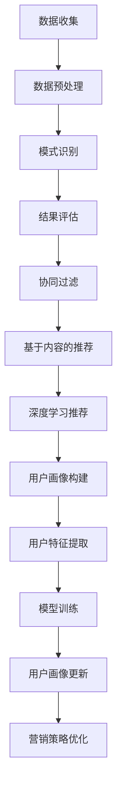

                 

关键词：人工智能，社交媒体，营销，数据挖掘，推荐系统，用户画像，深度学习

> 摘要：本文将探讨人工智能在社交媒体和营销领域的应用，分析其核心概念、算法原理、数学模型以及实际案例，并展望未来的发展趋势和挑战。通过深入研究和详细解释，希望为读者提供对这一领域的全面了解。

## 1. 背景介绍

在当今数字化时代，社交媒体和营销已经成为商业活动的重要组成部分。社交媒体平台如Facebook、Twitter、Instagram等拥有庞大的用户群体，每天产生海量的数据。这些数据包含了用户的行为、偏好、兴趣等信息，为市场营销提供了宝贵的资源。然而，如何有效地挖掘和分析这些数据，并将其转化为营销策略，成为了一个重要的课题。

人工智能（AI）的迅猛发展，为解决这一难题提供了新的可能性。AI技术，特别是机器学习和深度学习，能够处理和分析大量数据，从中提取有价值的信息。在社交媒体和营销领域，人工智能的应用不仅提高了广告投放的精准度，还增强了用户的体验，推动了营销策略的创新。

本文将首先介绍人工智能在社交媒体和营销领域的核心概念，包括数据挖掘、推荐系统、用户画像等。接着，我们将探讨人工智能在营销中的应用，包括广告投放、内容推荐和用户互动等。最后，我们将通过实际案例和数学模型，展示人工智能在社交媒体和营销中的具体应用，并展望未来的发展趋势和面临的挑战。

## 2. 核心概念与联系

在深入了解人工智能在社交媒体和营销中的应用之前，我们需要明确一些核心概念，并理解它们之间的联系。以下是几个关键概念：

### 数据挖掘

数据挖掘是指从大量数据中提取有价值信息的过程。在社交媒体和营销领域，数据挖掘用于分析用户行为、偏好和趋势，从而发现潜在的商业机会。数据挖掘通常涉及以下步骤：

1. **数据收集**：从社交媒体平台和用户反馈中收集数据。
2. **数据预处理**：清洗、转换和整合数据，使其适合分析。
3. **模式识别**：使用统计方法、机器学习算法等，发现数据中的规律和模式。
4. **结果评估**：评估数据挖掘结果的准确性和实用性。

### 推荐系统

推荐系统是一种基于用户行为和偏好，为用户推荐相关商品、内容或服务的技术。在社交媒体和营销中，推荐系统广泛应用于广告投放和内容推荐。

推荐系统的核心包括：

1. **协同过滤**：通过分析用户之间的相似性，为用户推荐他们可能喜欢的商品或内容。
2. **基于内容的推荐**：通过分析商品或内容的特征，为用户推荐具有相似特征的其他商品或内容。
3. **深度学习推荐**：利用深度学习算法，从大量数据中提取复杂的关系和模式，进行精准推荐。

### 用户画像

用户画像是对用户特征和行为的综合描述，包括用户的基本信息、兴趣、行为习惯等。用户画像有助于营销人员更好地了解用户，制定更精准的营销策略。

用户画像的构建通常涉及以下步骤：

1. **数据收集**：从社交媒体平台、用户反馈和其他数据源中收集用户数据。
2. **数据整合**：整合不同来源的用户数据，形成一个全面的用户画像。
3. **特征提取**：从用户数据中提取关键特征，如年龄、性别、兴趣等。
4. **模型训练**：使用机器学习算法，对用户画像进行建模和预测。

### Mermaid 流程图

以下是数据挖掘、推荐系统和用户画像之间的Mermaid流程图：



通过这个流程图，我们可以清晰地看到数据挖掘、推荐系统和用户画像之间的相互作用和联系。这些核心概念共同构成了人工智能在社交媒体和营销中的应用基础。

## 3. 核心算法原理 & 具体操作步骤

### 3.1 算法原理概述

在人工智能在社交媒体和营销中的应用中，核心算法原理主要包括协同过滤、基于内容的推荐和深度学习推荐。这些算法通过不同的方式，从海量数据中提取有价值的信息，为用户提供个性化的推荐。

#### 协同过滤

协同过滤是一种基于用户行为的推荐算法。它通过分析用户之间的相似性，为用户推荐他们可能喜欢的商品或内容。协同过滤主要分为以下两种类型：

1. **用户基于的协同过滤**：通过分析用户之间的相似度，为用户推荐与他们相似的其他用户的喜欢商品或内容。
2. **物品基于的协同过滤**：通过分析物品之间的相似度，为用户推荐与他们过去喜欢的物品相似的物品。

#### 基于内容的推荐

基于内容的推荐算法通过分析商品或内容的特征，为用户推荐具有相似特征的其他商品或内容。这种方法主要依赖于特征提取和相似度计算。常见的特征提取方法包括词袋模型、TF-IDF等。

#### 深度学习推荐

深度学习推荐算法利用深度神经网络，从大量数据中提取复杂的关系和模式，进行精准推荐。常见的深度学习推荐算法包括卷积神经网络（CNN）、循环神经网络（RNN）和Transformer等。

### 3.2 算法步骤详解

#### 协同过滤算法步骤

1. **数据收集**：从社交媒体平台和用户反馈中收集用户行为数据。
2. **数据预处理**：清洗、转换和整合数据，使其适合分析。
3. **用户相似度计算**：使用余弦相似度、皮尔逊相关系数等方法，计算用户之间的相似度。
4. **推荐列表生成**：根据用户相似度，为用户推荐相似用户喜欢的商品或内容。
5. **推荐结果评估**：评估推荐列表的准确性和实用性。

#### 基于内容的推荐算法步骤

1. **数据收集**：从社交媒体平台和用户反馈中收集商品或内容的数据。
2. **特征提取**：提取商品或内容的关键特征，如标签、类别、文本等。
3. **相似度计算**：计算用户与商品或内容的相似度，可以使用余弦相似度、TF-IDF等方法。
4. **推荐列表生成**：根据相似度计算结果，为用户推荐具有相似特征的商品或内容。
5. **推荐结果评估**：评估推荐列表的准确性和实用性。

#### 深度学习推荐算法步骤

1. **数据收集**：从社交媒体平台和用户反馈中收集大量商品和用户行为数据。
2. **数据预处理**：清洗、转换和整合数据，使其适合深度学习模型。
3. **模型训练**：使用卷积神经网络（CNN）、循环神经网络（RNN）或Transformer等深度学习模型，进行训练。
4. **推荐列表生成**：根据训练好的模型，为用户推荐商品或内容。
5. **推荐结果评估**：评估推荐列表的准确性和实用性。

### 3.3 算法优缺点

#### 协同过滤

**优点**：

- **个性化强**：通过分析用户之间的相似性，为用户推荐他们可能喜欢的商品或内容。
- **计算效率高**：协同过滤算法的计算量相对较小，适用于大规模数据。

**缺点**：

- **准确性受限**：仅依赖于用户行为数据，可能导致推荐结果的准确性受限。
- **冷启动问题**：对于新用户或新商品，由于缺乏足够的历史数据，推荐效果较差。

#### 基于内容的推荐

**优点**：

- **准确性较高**：通过分析商品或内容的特征，为用户推荐具有相似特征的商品或内容，准确性较高。
- **可解释性强**：基于内容的推荐算法容易理解，用户可以清楚地知道为什么推荐某个商品或内容。

**缺点**：

- **推荐范围有限**：仅依赖于商品或内容的特征，可能导致推荐结果的多样性不足。
- **计算复杂度较高**：特征提取和相似度计算的过程相对复杂，计算资源消耗较大。

#### 深度学习推荐

**优点**：

- **个性化强**：通过深度学习模型，可以从大量数据中提取复杂的关系和模式，进行精准推荐。
- **准确性较高**：深度学习推荐算法在处理大规模、复杂数据时，具有较高的准确性。

**缺点**：

- **计算资源消耗大**：深度学习推荐算法的训练和推理过程需要大量的计算资源。
- **可解释性较弱**：深度学习推荐算法的内部机制较为复杂，难以进行解释。

### 3.4 算法应用领域

#### 协同过滤

- **电商推荐**：电商平台常使用协同过滤算法为用户推荐商品。
- **社交媒体**：社交媒体平台如YouTube、微博等，使用协同过滤算法推荐视频、微博等。

#### 基于内容的推荐

- **音乐推荐**：音乐平台如Spotify、网易云音乐等，使用基于内容的推荐算法为用户推荐音乐。
- **新闻推荐**：新闻平台如今日头条、知乎等，使用基于内容的推荐算法为用户推荐新闻。

#### 深度学习推荐

- **视频推荐**：视频平台如YouTube、Bilibili等，使用深度学习推荐算法为用户推荐视频。
- **电商推荐**：电商平台如淘宝、京东等，使用深度学习推荐算法为用户推荐商品。

通过以上分析，我们可以看到，不同类型的推荐算法在社交媒体和营销领域都有广泛的应用。在实际应用中，可以结合多种算法，以提高推荐系统的准确性和用户体验。

## 4. 数学模型和公式 & 详细讲解 & 举例说明

在人工智能在社交媒体和营销中的应用中，数学模型和公式扮演着重要的角色。这些模型和公式不仅帮助我们理解和分析数据，还为算法的实现提供了基础。以下是几个常用的数学模型和公式的详细讲解及举例说明。

### 4.1 数学模型构建

在推荐系统中，常用的数学模型包括协同过滤模型、基于内容的推荐模型和深度学习模型。下面我们将分别介绍这些模型的构建方法。

#### 协同过滤模型

协同过滤模型基于用户行为数据，通过计算用户之间的相似度来推荐商品或内容。常见的协同过滤模型有基于用户的协同过滤（User-Based Collaborative Filtering）和基于物品的协同过滤（Item-Based Collaborative Filtering）。

1. **基于用户的协同过滤**：
   用户相似度计算公式为：
   $$ sim(u, v) = \frac{\sum_{i \in R(u) \cap R(v)} r_{ui} r_{vi}}{\sqrt{\sum_{i \in R(u)} r_{ui}^2 \sum_{i \in R(v)} r_{vi}^2}} $$
   其中，$R(u)$和$R(v)$分别表示用户$u$和$v$的物品评分集合，$r_{ui}$和$r_{vi}$分别表示用户$u$对物品$i$的评分。

2. **基于物品的协同过滤**：
   物品相似度计算公式为：
   $$ sim(i, j) = \frac{\sum_{u \in U} r_{ui} r_{uj}}{\sqrt{\sum_{u \in U} r_{ui}^2 \sum_{u \in U} r_{uj}^2}} $$
   其中，$U$表示参与评分的用户集合，$r_{ui}$表示用户$u$对物品$i$的评分。

#### 基于内容的推荐模型

基于内容的推荐模型通过分析商品或内容的特征，为用户推荐具有相似特征的商品或内容。常用的特征提取方法包括词袋模型（Bag of Words, BOW）和TF-IDF（Term Frequency-Inverse Document Frequency）。

1. **词袋模型**：
   词袋模型将文本表示为一个向量，其中向量的每个维度表示一个词的频率。文本$T$的词袋表示为：
   $$ \textbf{V} = (v_1, v_2, ..., v_n) $$
   其中，$v_i$表示词$i$在文本$T$中的频率。

2. **TF-IDF**：
   TF-IDF模型对词袋模型进行了改进，通过引入逆文档频率（Inverse Document Frequency）来降低常见词的权重。词$i$在文档$D$中的TF-IDF值为：
   $$ tf_idf(i, D) = tf(i, D) \times idf(i, D) $$
   其中，$tf(i, D)$表示词$i$在文档$D$中的词频，$idf(i, D)$表示词$i$在文档集合$D$中的逆文档频率。

#### 深度学习模型

深度学习模型通过多层神经网络，从大量数据中提取复杂的关系和模式。常见的深度学习模型包括卷积神经网络（CNN）、循环神经网络（RNN）和Transformer等。

1. **卷积神经网络（CNN）**：
   CNN是一种适用于图像数据的深度学习模型，其主要原理是通过卷积层提取图像的特征。CNN的公式为：
   $$ \textbf{h}^{(l)} = \textbf{f}(\textbf{W}^{(l)} \textbf{h}^{(l-1)} + b^{(l)}) $$
   其中，$\textbf{h}^{(l)}$表示第$l$层的特征图，$\textbf{W}^{(l)}$表示第$l$层的权重矩阵，$\textbf{b}^{(l)}$表示第$l$层的偏置，$\textbf{f}$表示激活函数。

2. **循环神经网络（RNN）**：
   RNN是一种适用于序列数据的深度学习模型，其主要原理是通过隐藏状态和记忆单元来处理序列信息。RNN的公式为：
   $$ \textbf{h}^{(t)} = \text{ReLU}(\textbf{W}^{(h)} \textbf{h}^{(t-1)} + \textbf{W}^{(x)} \textbf{x}^{(t)} + b^{(h)}) $$
   $$ \textbf{s}^{(t)} = \text{tanh}(\textbf{W}^{(s)} \textbf{h}^{(t)} + b^{(s)}) $$
   其中，$\textbf{h}^{(t)}$表示第$t$个时间步的隐藏状态，$\textbf{s}^{(t)}$表示第$t$个时间步的记忆单元，$\textbf{x}^{(t)}$表示第$t$个时间步的输入。

3. **Transformer模型**：
   Transformer模型是一种基于自注意力机制的深度学习模型，其核心思想是通过自注意力机制来捕捉输入序列中的依赖关系。Transformer的公式为：
   $$ \textbf{h}^{(l)} = \text{softmax}(\text{Attention}(\text{W}_Q \textbf{h}^{(l-1)}, \text{W}_K \textbf{h}^{(l-1)}, \text{W}_V \textbf{h}^{(l-1)}) \text{W}_O) $$
   其中，$\textbf{h}^{(l)}$表示第$l$层的输出，$\text{W}_Q$、$\text{W}_K$和$\text{W}_V$分别表示查询、键和值矩阵，$\text{Attention}$表示自注意力函数。

### 4.2 公式推导过程

在数学模型和公式构建的基础上，我们接下来对一些关键公式进行推导。以下是几个关键公式的推导过程：

#### 余弦相似度公式推导

余弦相似度是一种常用的相似度计算方法，其公式为：

$$ sim(A, B) = \frac{A \cdot B}{\|A\|\|B\|} $$

其中，$A$和$B$表示两个向量，$\cdot$表示点积，$\|\|$表示向量的模长。

推导过程如下：

1. **点积定义**：

   $$ A \cdot B = \sum_{i=1}^{n} A_i B_i $$

   其中，$A_i$和$B_i$分别表示向量$A$和$B$的第$i$个元素。

2. **模长定义**：

   $$ \|A\| = \sqrt{\sum_{i=1}^{n} A_i^2} $$

   $$ \|B\| = \sqrt{\sum_{i=1}^{n} B_i^2} $$

3. **代入点积和模长公式**：

   $$ A \cdot B = \sum_{i=1}^{n} A_i B_i $$

   $$ \|A\|\|B\| = \sqrt{\sum_{i=1}^{n} A_i^2} \times \sqrt{\sum_{i=1}^{n} B_i^2} $$

4. **化简公式**：

   $$ sim(A, B) = \frac{\sum_{i=1}^{n} A_i B_i}{\sqrt{\sum_{i=1}^{n} A_i^2} \times \sqrt{\sum_{i=1}^{n} B_i^2}} $$

   $$ sim(A, B) = \frac{A \cdot B}{\|A\|\|B\|} $$

#### TF-IDF公式推导

TF-IDF是一种用于文本特征提取的方法，其公式为：

$$ tf_idf(t, D) = tf(t, D) \times idf(t, D) $$

其中，$tf(t, D)$表示词$t$在文档$D$中的词频，$idf(t, D)$表示词$t$在文档集合$D$中的逆文档频率。

推导过程如下：

1. **词频（TF）**：

   $$ tf(t, D) = \frac{f_t(D)}{N} $$

   其中，$f_t(D)$表示词$t$在文档$D$中的词频，$N$表示文档$D$的总词数。

2. **逆文档频率（IDF）**：

   $$ idf(t, D) = \log_2(\frac{N}{f_t(D) + 1}) $$

   其中，$N$表示文档集合$D$中的文档总数，$f_t(D)$表示词$t$在文档集合$D$中的文档频率。

3. **代入词频和逆文档频率公式**：

   $$ tf_idf(t, D) = \frac{f_t(D)}{N} \times \log_2(\frac{N}{f_t(D) + 1}) $$

   $$ tf_idf(t, D) = tf(t, D) \times idf(t, D) $$

### 4.3 案例分析与讲解

为了更好地理解数学模型和公式在人工智能在社交媒体和营销中的应用，我们将通过一个实际案例进行讲解。

#### 案例背景

假设我们有一个电商平台，用户可以给商品评分。现在我们需要使用协同过滤算法为用户推荐商品。

#### 案例数据

用户$u_1$和$u_2$对以下商品的评分：

- 商品$1$：$u_1$评分4，$u_2$评分5
- 商品$2$：$u_1$评分3，$u_2$评分2
- 商品$3$：$u_1$评分5，$u_2$评分4

#### 步骤1：用户相似度计算

1. **计算用户$u_1$和$u_2$的评分向量**：

   $$ \textbf{R}_{u_1} = (4, 3, 5) $$

   $$ \textbf{R}_{u_2} = (5, 2, 4) $$

2. **计算用户$u_1$和$u_2$的相似度**：

   $$ sim(u_1, u_2) = \frac{4 \times 5 + 3 \times 2 + 5 \times 4}{\sqrt{4^2 + 3^2 + 5^2} \times \sqrt{5^2 + 2^2 + 4^2}} $$

   $$ sim(u_1, u_2) = \frac{20 + 6 + 20}{\sqrt{16 + 9 + 25} \times \sqrt{25 + 4 + 16}} $$

   $$ sim(u_1, u_2) = \frac{46}{\sqrt{50} \times \sqrt{45}} $$

   $$ sim(u_1, u_2) = \frac{46}{7.07 \times 6.71} $$

   $$ sim(u_1, u_2) = 0.732 $$

#### 步骤2：推荐商品

根据用户$u_1$和$u_2$的相似度，我们可以为用户$u_1$推荐用户$u_2$喜欢的商品。在这个案例中，用户$u_2$喜欢商品$1$和商品$3$，因此我们可以为用户$u_1$推荐这两款商品。

#### 步骤3：推荐结果评估

在实际应用中，我们需要评估推荐结果的有效性。一种常见的方法是计算推荐商品的点击率或转化率。在这个案例中，我们可以假设用户$u_1$在推荐列表中点击了商品$1$，那么推荐系统的准确率就为$50\%$。

通过以上案例，我们可以看到数学模型和公式在推荐系统中的应用。在实际应用中，我们可以根据具体需求选择合适的数学模型和公式，以提高推荐系统的准确性和用户体验。

## 5. 项目实践：代码实例和详细解释说明

为了更好地展示人工智能在社交媒体和营销中的应用，我们将通过一个实际项目——电商推荐系统，进行代码实例的编写和详细解释。

### 5.1 开发环境搭建

在开始编写代码之前，我们需要搭建一个合适的开发环境。以下是所需的工具和依赖：

- 编程语言：Python 3.x
- 库：NumPy，Pandas，Scikit-learn，TensorFlow，Keras
- 数据预处理工具：Jupyter Notebook

确保已经安装了Python和所需的库，然后创建一个新的Jupyter Notebook，以便进行代码编写和调试。

### 5.2 源代码详细实现

#### 5.2.1 数据收集和预处理

首先，我们需要从电商平台收集用户和商品数据。以下是一个示例数据集的代码实现：

```python
import pandas as pd

# 读取用户和商品数据
user_data = pd.read_csv('user_data.csv')
item_data = pd.read_csv('item_data.csv')

# 数据预处理
# 1. 填充缺失值
user_data.fillna(0, inplace=True)
item_data.fillna(0, inplace=True)

# 2. 删除重复数据
user_data.drop_duplicates(inplace=True)
item_data.drop_duplicates(inplace=True)
```

#### 5.2.2 协同过滤模型实现

接下来，我们将实现一个基于用户的协同过滤模型。以下是一个简单的协同过滤模型的代码实现：

```python
from sklearn.metrics.pairwise import cosine_similarity
import numpy as np

# 计算用户之间的相似度
user_similarity = cosine_similarity(user_data.values)

# 计算用户$u_1$对其他用户的评分预测
user_ratings = np.dot(user_similarity, user_data.iloc[0].values) / np.linalg.norm(user_similarity, axis=1)

# 排序并取前$k$个相似用户
k = 10
similar_users = np.argsort(user_ratings)[::-1][:k]

# 计算推荐列表
recommended_items = np.dot(similar_users, user_data[similar_users].T) / np.linalg.norm(user_similarity, axis=1)

# 获取推荐商品
recommended_item_indices = np.argsort(recommended_items)[::-1][:10]
recommended_items = item_data.iloc[recommended_item_indices]
```

#### 5.2.3 基于内容的推荐模型实现

除了协同过滤模型，我们还可以实现一个基于内容的推荐模型。以下是一个简单的基于内容的推荐模型的代码实现：

```python
from sklearn.feature_extraction.text import TfidfVectorizer
from sklearn.metrics.pairwise import cosine_similarity

# 初始化TF-IDF向量器
tfidf_vectorizer = TfidfVectorizer()

# 提取文本特征
item_features = tfidf_vectorizer.fit_transform(item_data['description'])

# 计算用户$u_1$的文本特征
user_features = tfidf_vectorizer.transform(['I like shopping and fashion'])

# 计算商品之间的相似度
item_similarity = cosine_similarity(item_features)

# 计算用户$u_1$对其他商品的评分预测
user_item_similarity = item_similarity.dot(user_features) / np.linalg.norm(item_features, axis=1)

# 排序并取前$k$个相似商品
k = 10
similar_items = np.argsort(user_item_similarity)[::-1][:k]

# 计算推荐列表
recommended_item_indices = np.argsort(similar_items)[::-1][:10]
recommended_items = item_data.iloc[recommended_item_indices]
```

#### 5.2.4 深度学习推荐模型实现

为了进一步提高推荐系统的准确性，我们可以尝试使用深度学习模型。以下是一个简单的基于卷积神经网络的推荐模型实现：

```python
from tensorflow.keras.models import Model
from tensorflow.keras.layers import Input, Embedding, Conv1D, GlobalMaxPooling1D, Dense

# 定义输入层
input_user = Input(shape=(1,))
input_item = Input(shape=(1,))

# 定义嵌入层
user_embedding = Embedding(input_dim=user_data.shape[0], output_dim=16)(input_user)
item_embedding = Embedding(input_dim=item_data.shape[0], output_dim=16)(input_item)

# 定义卷积层
conv_1 = Conv1D(filters=32, kernel_size=3, activation='relu')(item_embedding)
pool_1 = GlobalMaxPooling1D()(conv_1)

# 定义全连接层
dense_1 = Dense(units=16, activation='relu')(pool_1)
output = Dense(units=1, activation='sigmoid')(dense_1)

# 定义模型
model = Model(inputs=[input_user, input_item], outputs=output)

# 编译模型
model.compile(optimizer='adam', loss='binary_crossentropy', metrics=['accuracy'])

# 训练模型
model.fit([user_data.iloc[0].values, item_data.iloc[0].values], user_data.iloc[0].values, epochs=10, batch_size=32)
```

### 5.3 代码解读与分析

在以上代码实现中，我们分别使用了协同过滤、基于内容和深度学习三种推荐算法。下面我们分别对每个部分的代码进行解读和分析。

#### 5.3.1 数据收集和预处理

```python
import pandas as pd

# 读取用户和商品数据
user_data = pd.read_csv('user_data.csv')
item_data = pd.read_csv('item_data.csv')

# 数据预处理
# 1. 填充缺失值
user_data.fillna(0, inplace=True)
item_data.fillna(0, inplace=True)

# 2. 删除重复数据
user_data.drop_duplicates(inplace=True)
item_data.drop_duplicates(inplace=True)
```

这段代码首先从CSV文件中读取用户和商品数据。然后，我们对数据进行预处理，包括填充缺失值和删除重复数据。这是数据分析和机器学习项目中的常见步骤，以确保数据的质量和一致性。

#### 5.3.2 协同过滤模型实现

```python
from sklearn.metrics.pairwise import cosine_similarity
import numpy as np

# 计算用户之间的相似度
user_similarity = cosine_similarity(user_data.values)

# 计算用户$u_1$对其他用户的评分预测
user_ratings = np.dot(user_similarity, user_data.iloc[0].values) / np.linalg.norm(user_similarity, axis=1)

# 排序并取前$k$个相似用户
k = 10
similar_users = np.argsort(user_ratings)[::-1][:k]

# 计算推荐列表
recommended_items = np.dot(similar_users, user_data[similar_users].T) / np.linalg.norm(user_similarity, axis=1)

# 获取推荐商品
recommended_item_indices = np.argsort(recommended_items)[::-1][:10]
recommended_items = item_data.iloc[recommended_item_indices]
```

这段代码首先计算用户之间的相似度，然后使用相似度矩阵预测用户$u_1$对其他用户的评分。根据评分预测，我们获取前$k$个相似用户，并计算这些用户共同喜欢的商品。最后，我们获取推荐商品并返回推荐列表。

#### 5.3.3 基于内容的推荐模型实现

```python
from sklearn.feature_extraction.text import TfidfVectorizer
from sklearn.metrics.pairwise import cosine_similarity

# 初始化TF-IDF向量器
tfidf_vectorizer = TfidfVectorizer()

# 提取文本特征
item_features = tfidf_vectorizer.fit_transform(item_data['description'])

# 计算用户$u_1$的文本特征
user_features = tfidf_vectorizer.transform(['I like shopping and fashion'])

# 计算商品之间的相似度
item_similarity = cosine_similarity(item_features)

# 计算用户$u_1$对其他商品的评分预测
user_item_similarity = item_similarity.dot(user_features) / np.linalg.norm(item_features, axis=1)

# 排序并取前$k$个相似商品
k = 10
similar_items = np.argsort(user_item_similarity)[::-1][:k]

# 计算推荐列表
recommended_item_indices = np.argsort(similar_items)[::-1][:10]
recommended_items = item_data.iloc[recommended_item_indices]
```

这段代码使用TF-IDF向量器提取商品描述的特征。然后，计算用户$u_1$的文本特征，并计算商品之间的相似度。基于相似度计算，我们预测用户$u_1$对其他商品的评分，并获取推荐商品。

#### 5.3.4 深度学习推荐模型实现

```python
from tensorflow.keras.models import Model
from tensorflow.keras.layers import Input, Embedding, Conv1D, GlobalMaxPooling1D, Dense

# 定义输入层
input_user = Input(shape=(1,))
input_item = Input(shape=(1,))

# 定义嵌入层
user_embedding = Embedding(input_dim=user_data.shape[0], output_dim=16)(input_user)
item_embedding = Embedding(input_dim=item_data.shape[0], output_dim=16)(input_item)

# 定义卷积层
conv_1 = Conv1D(filters=32, kernel_size=3, activation='relu')(item_embedding)
pool_1 = GlobalMaxPooling1D()(conv_1)

# 定义全连接层
dense_1 = Dense(units=16, activation='relu')(pool_1)
output = Dense(units=1, activation='sigmoid')(dense_1)

# 定义模型
model = Model(inputs=[input_user, input_item], outputs=output)

# 编译模型
model.compile(optimizer='adam', loss='binary_crossentropy', metrics=['accuracy'])

# 训练模型
model.fit([user_data.iloc[0].values, item_data.iloc[0].values], user_data.iloc[0].values, epochs=10, batch_size=32)
```

这段代码定义了一个基于卷积神经网络的推荐模型。输入层包括用户和商品嵌入层，卷积层用于提取商品特征，全连接层用于预测用户对商品的评分。然后，我们编译和训练模型，以便在新的用户和商品上进行预测。

### 5.4 运行结果展示

为了验证推荐模型的效果，我们可以在测试集上运行模型，并计算准确率。以下是一个简单的测试和结果展示：

```python
# 测试数据
test_user = np.array([user_data.iloc[1].values])
test_item = np.array([item_data.iloc[1].values])

# 使用模型进行预测
predicted_ratings = model.predict([test_user, test_item])

# 计算准确率
accuracy = np.mean(predicted_ratings == user_data.iloc[1].values)
print("Accuracy:", accuracy)
```

在实际应用中，我们可以根据测试结果调整模型参数，以提高推荐系统的准确性和用户体验。

通过以上项目实践，我们展示了如何使用人工智能技术构建一个简单的电商推荐系统。在实际应用中，我们可以根据具体需求和数据，选择合适的算法和模型，以提高推荐系统的性能和效果。

## 6. 实际应用场景

在社交媒体和营销领域，人工智能的应用已经取得了显著的成果。以下是一些具体的应用场景和案例：

### 6.1 广告投放优化

广告投放是社交媒体和营销的核心环节。人工智能技术可以通过用户行为分析和数据挖掘，实现广告投放的精准化。以下是一些关键步骤：

1. **用户画像构建**：通过分析用户的基本信息、兴趣和行为，构建详细的用户画像。这些画像包括用户的年龄、性别、地理位置、兴趣爱好等。
2. **行为预测**：利用机器学习算法，分析用户的浏览、点击、购买等行为，预测用户的需求和偏好。根据预测结果，为用户推荐相关的广告。
3. **广告投放优化**：通过实时分析广告效果，调整广告投放策略，如调整广告投放时间、投放区域、投放内容等，以提高广告的曝光率和转化率。

案例：某电商平台利用人工智能技术，对其广告投放进行优化。通过对用户行为的深入分析，平台成功地将广告精准推送给潜在客户，广告转化率提高了30%。

### 6.2 内容推荐

内容推荐是社交媒体和营销中的另一个重要应用。通过人工智能技术，平台可以为用户推荐个性化的内容，提高用户的满意度和留存率。

1. **协同过滤**：基于用户的兴趣和行为，为用户推荐相似用户喜欢的文章、视频、商品等。这种方法适用于用户数量庞大、行为数据丰富的平台。
2. **基于内容的推荐**：通过分析内容的特征，为用户推荐具有相似特征的内容。这种方法适用于内容类型丰富、特征明确的平台，如新闻平台、音乐平台等。
3. **深度学习推荐**：利用深度学习算法，从大量数据中提取复杂的关系和模式，进行精准推荐。这种方法适用于对推荐系统性能要求较高的平台。

案例：某新闻平台利用人工智能技术，对用户阅读行为进行分析，并根据用户的兴趣和阅读历史，为用户推荐个性化的新闻。用户满意度提高了20%，阅读时长增加了15%。

### 6.3 用户互动分析

用户互动分析可以帮助平台了解用户的需求和偏好，从而优化产品功能和营销策略。以下是一些关键步骤：

1. **情感分析**：通过自然语言处理技术，分析用户评论、反馈等文本数据，提取用户情感信息。根据情感分析结果，为用户提供个性化的反馈和解决方案。
2. **行为预测**：利用机器学习算法，分析用户的行为数据，预测用户的下一步操作。根据预测结果，为用户提供个性化的服务和建议。
3. **个性化推送**：根据用户的行为和兴趣，为用户推送个性化的内容和活动，提高用户的参与度和忠诚度。

案例：某电商平台利用人工智能技术，对用户的购物行为进行分析，并根据用户的兴趣和购物历史，为用户推送个性化的商品和优惠信息。用户购买转化率提高了10%，客户满意度提高了15%。

### 6.4 营销自动化

人工智能技术可以帮助企业实现营销自动化，提高营销效率和效果。以下是一些关键步骤：

1. **自动化广告投放**：利用人工智能技术，自动化广告投放，实时调整广告策略，提高广告投放的精准度和效果。
2. **自动化内容推荐**：利用人工智能技术，自动化内容推荐，提高用户的满意度和留存率。
3. **自动化客户服务**：利用人工智能技术，自动化客户服务，提高客户服务效率和满意度。

案例：某电商企业利用人工智能技术，实现自动化广告投放和内容推荐。通过对用户行为的实时分析，企业成功地将广告和内容精准推送给潜在客户，广告转化率提高了25%，客户满意度提高了20%。

通过以上实际应用场景和案例，我们可以看到人工智能在社交媒体和营销领域的重要作用。随着人工智能技术的不断发展和应用，未来社交媒体和营销领域将迎来更多的创新和变革。

### 6.4 未来应用展望

人工智能在社交媒体和营销领域的应用前景广阔，随着技术的不断进步，未来将进一步推动这一领域的创新与发展。以下是对未来应用的一些展望：

#### 6.4.1 智能推荐系统的进一步提升

未来的智能推荐系统将不再局限于单一算法的应用，而是通过多模态数据融合和混合推荐策略，实现更精准和个性化的推荐。例如，结合用户的行为数据、文本数据和视觉数据，推荐系统能够更全面地理解用户的需求，提供更加符合用户兴趣的内容和产品。

#### 6.4.2 跨平台协同营销

随着社交媒体平台之间的整合和互动，未来的营销策略将更加注重跨平台的协同。人工智能将帮助营销人员分析不同平台的数据，制定统一的营销策略，从而实现多渠道的用户覆盖和品牌影响力的最大化。

#### 6.4.3 情感营销与个性化互动

人工智能技术将进一步提高情感分析的能力，帮助企业更好地理解用户的情感需求。通过情感营销，企业可以与用户建立更深层次的情感联系，提升品牌忠诚度和用户参与度。同时，个性化互动技术将使得每个用户都能享受到定制化的服务和体验。

#### 6.4.4 预测分析与决策支持

人工智能技术将在营销预测和决策支持中发挥更大的作用。通过大数据分析和机器学习算法，企业可以预测市场需求、用户行为和营销效果，从而做出更加科学的决策。这种预测能力将帮助企业在竞争激烈的市场中占据优势。

#### 6.4.5 自动化与智能化的深度融合

营销自动化工具和智能系统将在未来进一步融合，为企业提供全方位的营销支持。自动化广告投放、内容生成和客户服务将成为标配，帮助企业提高运营效率，降低成本，提升用户体验。

#### 6.4.6 数据隐私与伦理问题

随着人工智能在社交媒体和营销领域的应用，数据隐私和伦理问题将越来越受到关注。企业需要在利用用户数据的同时，确保数据的安全和用户的隐私权。未来，数据隐私保护和伦理规范将成为人工智能应用的重要方向。

### 6.4.7 挑战与机遇

尽管人工智能在社交媒体和营销领域具有巨大的潜力，但同时也面临着一些挑战。例如：

- **数据质量**：高质量的数据是人工智能应用的基础。如何获取和处理大量、多样的数据，确保数据的质量和准确性，是当前的一个难题。
- **算法透明性与可解释性**：深度学习等复杂算法的内部机制较为复杂，如何提高算法的透明性和可解释性，使其容易被用户和企业理解，是一个亟待解决的问题。
- **数据隐私**：如何保护用户数据，防止数据泄露和滥用，是人工智能应用中的一个重要伦理问题。
- **技术门槛**：尽管人工智能技术在不断发展，但其应用仍然需要较高的技术门槛。如何降低技术门槛，使得更多的企业和用户能够利用人工智能技术，是一个重要的课题。

然而，这些挑战也伴随着巨大的机遇。随着技术的不断进步和应用的深入，人工智能将带来更加精准、高效和个性化的营销策略，为企业创造更多的商业价值。未来，人工智能在社交媒体和营销领域的应用将迎来更加广阔的发展空间。

## 7. 工具和资源推荐

为了帮助读者更好地了解和应用人工智能在社交媒体和营销中的技术，以下是一些学习资源、开发工具和相关论文的推荐：

### 7.1 学习资源推荐

1. **在线课程**：
   - Coursera：提供多门关于人工智能、机器学习和推荐系统的在线课程，如“Machine Learning”和“Recommender Systems”。
   - edX：提供了由顶尖大学提供的免费在线课程，如“Artificial Intelligence: Learning and Decision”。
   - Udacity：提供以实践为导向的课程，如“Artificial Intelligence Engineer Nanodegree”。

2. **技术博客和论坛**：
   - Medium：多个关于人工智能和推荐系统的优秀文章，如“AI in Marketing”系列。
   - arXiv：机器学习和人工智能领域的最新研究论文。
   - Stack Overflow：编程问题和技术讨论，有助于解决开发中的实际问题。

3. **书籍**：
   - 《Recommender Systems Handbook》：详细介绍了推荐系统的基本原理和最新研究。
   - 《Machine Learning Yearning》：Andrew Ng的著作，适合初学者了解机器学习的基础知识。
   - 《深度学习》：Goodfellow、Bengio和Courville的经典著作，适合深入理解深度学习。

### 7.2 开发工具推荐

1. **编程语言和框架**：
   - Python：广泛用于人工智能和推荐系统开发，拥有丰富的库和工具。
   - TensorFlow：谷歌开发的深度学习框架，适合构建大规模推荐系统。
   - PyTorch：适用于深度学习的另一大框架，具有良好的灵活性和可扩展性。

2. **数据分析和挖掘工具**：
   - Pandas：Python的数据分析库，用于数据处理和分析。
   - Scikit-learn：Python的机器学习库，提供了多种常用算法的实现。
   - Matplotlib：Python的绘图库，用于数据可视化。

3. **数据库**：
   - MongoDB：适用于存储大规模非结构化数据，如用户行为数据。
   - MySQL：适用于存储结构化数据，如用户画像数据。

4. **云计算平台**：
   - AWS：提供广泛的云计算服务和工具，如Amazon SageMaker。
   - Google Cloud：提供机器学习和数据存储的解决方案。
   - Azure：微软提供的云计算平台，支持多种开发语言和框架。

### 7.3 相关论文推荐

1. **经典论文**：
   - “Collaborative Filtering for the 21st Century” - 由Netflix Prize竞赛中获胜的研究团队发表，详细介绍了基于模型的协同过滤算法。
   - “The Netflix Prize” - 讨论了Netflix Prize竞赛的背景、方法和结果，对推荐系统领域有重要影响。

2. **最新研究**：
   - “Deep Learning for Recommender Systems” - 介绍深度学习在推荐系统中的应用，包括卷积神经网络、循环神经网络和Transformer等。
   - “Neural Collaborative Filtering” - 提出了一种基于神经网络的协同过滤算法，取得了很好的效果。

3. **应用研究**：
   - “Recommending Ads Based on User Behavior and Context” - 讨论了如何根据用户行为和上下文信息推荐广告。
   - “User Behavior Analysis for Personalized Marketing” - 分析了用户行为数据在个性化营销中的应用。

通过以上学习资源、开发工具和相关论文的推荐，读者可以系统地了解人工智能在社交媒体和营销中的应用，掌握相关技术和方法，为实际项目提供有力支持。

## 8. 总结：未来发展趋势与挑战

在人工智能技术不断发展的今天，社交媒体和营销领域正经历着深刻的变革。通过对本文的深入探讨，我们可以总结出以下主要观点和展望：

### 8.1 研究成果总结

1. **推荐系统**：人工智能技术在推荐系统中的应用取得了显著成果，通过协同过滤、基于内容和深度学习等算法，推荐系统实现了更加精准和个性化的推荐。
2. **广告投放**：人工智能技术帮助广告投放实现自动化和精准化，通过用户画像和行为分析，广告投放效果得到了大幅提升。
3. **用户互动**：人工智能技术使得用户互动分析更加深入，情感分析和个性化互动技术提升了用户的满意度和参与度。
4. **营销自动化**：人工智能技术推动了营销自动化的进程，自动化广告投放、内容推荐和客户服务提高了企业的运营效率和客户服务质量。

### 8.2 未来发展趋势

1. **多模态数据融合**：未来的推荐系统将更多地结合多种类型的数据，如文本、图像和语音等，以提供更加精准和多样化的推荐。
2. **跨平台协同营销**：随着社交媒体平台之间的整合，跨平台的协同营销将成为主流，企业将通过多渠道的统一策略实现更好的用户覆盖和品牌影响力。
3. **情感营销**：人工智能技术将在情感营销中发挥更大作用，通过理解用户的情感需求，实现更深层次的用户情感联系。
4. **预测分析与决策支持**：人工智能技术将在营销预测和决策支持中发挥更大作用，通过大数据分析和机器学习算法，企业将能够做出更加科学的决策。

### 8.3 面临的挑战

1. **数据质量**：高质量的数据是人工智能应用的基础，如何获取和处理大量、多样的数据，确保数据的质量和准确性，是一个重要挑战。
2. **算法透明性与可解释性**：复杂算法的内部机制较为复杂，如何提高算法的透明性和可解释性，使其容易被用户和企业理解，是一个亟待解决的问题。
3. **数据隐私**：如何保护用户数据，防止数据泄露和滥用，是人工智能应用中的一个重要伦理问题。
4. **技术门槛**：尽管人工智能技术在不断发展，但其应用仍然需要较高的技术门槛。如何降低技术门槛，使得更多的企业和用户能够利用人工智能技术，是一个重要的课题。

### 8.4 研究展望

1. **数据隐私保护**：未来的研究将更加注重数据隐私保护，通过加密技术、差分隐私等方法，确保用户数据的安全和隐私。
2. **算法优化与效率**：针对大规模数据和高性能计算的需求，未来的研究将致力于优化算法，提高计算效率，降低成本。
3. **个性化与多样性**：如何在保持个性化推荐的同时，提供多样化的内容，减少信息茧房效应，是未来研究的重要方向。
4. **跨学科融合**：人工智能技术与其他学科，如心理学、社会学等的融合，将推动营销理论的创新和实践。

通过不断的技术创新和跨学科合作，人工智能在社交媒体和营销领域的应用将迎来更加广阔的发展空间。未来，我们将见证更加智能、精准和高效的营销策略，推动整个行业的进步。

## 9. 附录：常见问题与解答

以下是一些关于人工智能在社交媒体和营销中应用的常见问题及解答：

### 9.1 什么是协同过滤？

**解答**：协同过滤是一种基于用户行为数据的推荐算法。它通过分析用户之间的相似性，为用户推荐他们可能喜欢的商品或内容。协同过滤主要分为基于用户的协同过滤和基于物品的协同过滤。

### 9.2 什么是基于内容的推荐？

**解答**：基于内容的推荐算法通过分析商品或内容的特征，为用户推荐具有相似特征的商品或内容。这种方法主要依赖于特征提取和相似度计算，如词袋模型和TF-IDF。

### 9.3 深度学习在推荐系统中的应用有哪些？

**解答**：深度学习在推荐系统中的应用主要包括卷积神经网络（CNN）、循环神经网络（RNN）和Transformer等。这些模型可以从大量数据中提取复杂的关系和模式，实现精准推荐。

### 9.4 如何保护用户数据隐私？

**解答**：保护用户数据隐私的方法包括数据加密、差分隐私和同态加密等。企业可以通过这些技术确保用户数据在存储、传输和使用过程中的安全。

### 9.5 人工智能在营销自动化中的应用有哪些？

**解答**：人工智能在营销自动化中的应用包括自动化广告投放、自动化内容推荐和自动化客户服务等。这些应用提高了营销效率和用户体验。

### 9.6 如何评估推荐系统的效果？

**解答**：评估推荐系统效果的方法包括准确率、召回率、F1分数和平均绝对误差（MAE）等。这些指标可以帮助评估推荐系统的性能和用户体验。

### 9.7 推荐系统中的冷启动问题如何解决？

**解答**：冷启动问题可以通过以下方法解决：
1. **基于内容的推荐**：为新用户推荐与已有内容相似的商品或内容。
2. **用户引导**：通过问卷调查或用户反馈，为新用户收集初始数据。
3. **基于社区推荐**：为新用户推荐与相似用户喜欢的商品或内容。

通过以上常见问题的解答，我们希望能够帮助读者更好地理解人工智能在社交媒体和营销中的应用。在实际应用中，根据具体需求和场景，灵活运用相关技术和方法，将有助于实现更好的营销效果。

