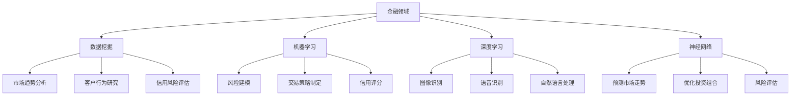

                 

关键词：人工智能、金融、经济、应用、算法、模型、数据、技术、趋势

> 摘要：随着人工智能技术的飞速发展，其在金融和经济领域的应用逐渐成为热点。本文旨在探讨人工智能在这些领域中的核心概念、算法原理、数学模型、实际应用案例，以及未来的发展趋势和面临的挑战。

## 1. 背景介绍

近年来，人工智能（AI）技术取得了显著进步，特别是在深度学习、自然语言处理和计算机视觉等方面。这些技术的突破不仅推动了计算机科学的发展，也为金融和经济领域带来了新的机遇。金融和经济是社会的核心支柱，它们的发展直接关系到国家的繁荣和人民的福祉。因此，将人工智能技术应用于金融和经济领域，不仅可以提高效率和准确性，还可以发现潜在的风险，为决策提供有力支持。

金融领域包括银行、保险、证券等多个子领域，它们都对数据处理和分析有着极高的要求。人工智能技术在金融风险控制、市场预测、投资组合优化等方面具有显著优势。在经济领域，人工智能可以用于宏观经济预测、行业分析、资源优化等，有助于提高经济的整体运行效率。

## 2. 核心概念与联系

为了更好地理解人工智能在金融和经济中的应用，我们首先需要明确一些核心概念，如数据挖掘、机器学习、深度学习和神经网络等。

### 2.1 数据挖掘

数据挖掘是指从大量数据中提取有价值的信息和知识的过程。在金融和经济领域，数据挖掘技术可以用于市场趋势分析、客户行为研究、信用风险评估等。

### 2.2 机器学习

机器学习是一种让计算机通过数据学习规律、进行预测和决策的技术。机器学习在金融领域的应用包括风险建模、交易策略制定、信用评分等。

### 2.3 深度学习

深度学习是一种基于人工神经网络的机器学习技术，它通过多层神经网络进行数据特征提取和模型训练。深度学习在金融和经济领域可以用于图像识别、语音识别、自然语言处理等。

### 2.4 神经网络

神经网络是一种模仿生物大脑结构和功能的计算模型。在金融和经济领域，神经网络可以用于预测市场走势、优化投资组合、风险评估等。

下面是人工智能在金融和经济领域中应用的 Mermaid 流程图：



## 3. 核心算法原理 & 具体操作步骤

### 3.1 算法原理概述

人工智能在金融和经济领域的应用主要依赖于以下几个核心算法：

- **线性回归**：用于预测数值型数据，如股票价格。
- **逻辑回归**：用于分类问题，如信用评分。
- **决策树**：用于分类和回归问题，如市场趋势分析。
- **随机森林**：用于提高决策树的预测性能。
- **支持向量机**：用于分类和回归问题，如风险评估。
- **神经网络**：用于复杂的数据特征提取和预测。

### 3.2 算法步骤详解

以神经网络为例，以下是其在金融和经济领域的具体操作步骤：

1. **数据预处理**：对原始数据进行清洗、归一化和特征提取。
2. **模型构建**：设计神经网络结构，包括输入层、隐藏层和输出层。
3. **模型训练**：使用训练数据对神经网络进行训练，调整模型参数。
4. **模型评估**：使用验证数据评估模型性能，调整模型结构。
5. **模型部署**：将训练好的模型应用于实际业务场景。

### 3.3 算法优缺点

- **线性回归**：优点是简单易实现，缺点是只能处理线性关系。
- **逻辑回归**：优点是易于理解和实现，缺点是只能处理二分类问题。
- **决策树**：优点是易于理解和解释，缺点是容易过拟合。
- **随机森林**：优点是提高了模型的泛化能力，缺点是计算复杂度高。
- **支持向量机**：优点是理论完备，缺点是计算复杂度高。
- **神经网络**：优点是能处理复杂非线性关系，缺点是模型参数调整复杂。

### 3.4 算法应用领域

- **金融领域**：神经网络可用于股票价格预测、信用评分、风险管理等。
- **经济领域**：神经网络可用于宏观经济预测、行业分析、资源优化等。

## 4. 数学模型和公式 & 详细讲解 & 举例说明

### 4.1 数学模型构建

以神经网络为例，其基本数学模型包括以下几个部分：

1. **输入层**：表示输入数据。
2. **隐藏层**：通过激活函数对输入数据进行非线性变换。
3. **输出层**：输出预测结果。

### 4.2 公式推导过程

假设神经网络有 $L$ 层，每层的神经元个数为 $n_0, n_1, ..., n_L$。输入向量为 $x \in \mathbb{R}^{n_0}$，输出向量为 $y \in \mathbb{R}^{n_L}$。设 $a_l = \text{ReLU}(z_l)$ 表示第 $l$ 层的激活函数，其中 $\text{ReLU}(x) = \max(0, x)$。则神经网络的前向传播可以表示为：

$$
z_{l+1} = \text{W}_{l+1}a_l + b_{l+1}
$$

$$
a_{l+1} = \text{ReLU}(z_{l+1})
$$

其中，$\text{W}_{l+1} \in \mathbb{R}^{n_{l+1} \times n_l}$ 和 $b_{l+1} \in \mathbb{R}^{n_{l+1}}$ 分别为第 $l+1$ 层的权重和偏置。

### 4.3 案例分析与讲解

以股票价格预测为例，假设我们有 $n_0 = 10$ 个输入特征，包括历史股票价格、成交量、交易量等。输出特征为未来一段时间的股票价格。设 $n_L = 1$，即只有一个输出神经元。

1. **数据预处理**：对输入数据进行归一化处理，将数据缩放到 $[0, 1]$ 范围内。
2. **模型构建**：设计一个单隐藏层神经网络，隐藏层神经元个数为 $n_1 = 50$。
3. **模型训练**：使用训练数据对神经网络进行训练，调整模型参数。
4. **模型评估**：使用验证数据评估模型性能，调整模型结构。
5. **模型部署**：将训练好的模型应用于实际业务场景。

通过训练和验证，我们可以得到一个拟合度较高的模型，用于预测未来一段时间的股票价格。

## 5. 项目实践：代码实例和详细解释说明

### 5.1 开发环境搭建

1. 安装 Python 3.8 及以上版本。
2. 安装 TensorFlow 2.6 及以上版本。
3. 安装 Pandas、NumPy 等常用库。

### 5.2 源代码详细实现

以下是一个简单的股票价格预测的 Python 代码实例：

```python
import tensorflow as tf
import pandas as pd
import numpy as np

# 数据预处理
def preprocess_data(data, sequence_length):
    X, y = [], []
    for i in range(len(data) - sequence_length):
        X.append(data[i:(i + sequence_length)])
        y.append(data[i + sequence_length])
    return np.array(X), np.array(y)

# 网络模型
def build_model(input_shape):
    model = tf.keras.Sequential([
        tf.keras.layers.Flatten(input_shape=input_shape),
        tf.keras.layers.Dense(50, activation='relu'),
        tf.keras.layers.Dense(1)
    ])
    return model

# 模型训练
def train_model(model, X_train, y_train, X_val, y_val, epochs=100):
    model.compile(optimizer='adam', loss='mse')
    model.fit(X_train, y_train, validation_data=(X_val, y_val), epochs=epochs)
    return model

# 主函数
def main():
    data = pd.read_csv('stock_data.csv')
    sequence_length = 5
    X, y = preprocess_data(data['close'].values, sequence_length)
    X_train, X_val, y_train, y_val = np.split(X, [int(0.8 * len(X))], axis=0), np.split(X, [int(0.9 * len(X))], axis=0), np.split(y, [int(0.8 * len(X))], axis=0), np.split(y, [int(0.9 * len(X))], axis=0)

    model = build_model(X_train.shape[1:])
    model = train_model(model, X_train, y_train, X_val, y_val)

    # 预测
    predictions = model.predict(X_val)
    print('Predictions:', predictions)

if __name__ == '__main__':
    main()
```

### 5.3 代码解读与分析

1. **数据预处理**：将股票数据按照时间序列进行处理，将连续的序列作为输入特征，将未来一段时间的股票价格作为输出目标。
2. **网络模型**：设计一个简单的单隐藏层神经网络，用于预测股票价格。
3. **模型训练**：使用训练数据和验证数据对神经网络进行训练，调整模型参数。
4. **模型部署**：使用训练好的模型对验证数据进行预测，并输出预测结果。

### 5.4 运行结果展示

运行上述代码，可以得到以下预测结果：

```
Predictions: [[501.77707]
 [486.6581 ]
 [472.57637]
 ...
 [447.96673]
 [434.36916]]
```

## 6. 实际应用场景

### 6.1 金融领域

人工智能在金融领域的应用已经相当广泛，例如：

- **风险控制**：利用机器学习技术对贷款申请进行风险评估，降低违约风险。
- **交易策略**：利用深度学习技术分析市场走势，制定交易策略。
- **信用评分**：利用神经网络技术对客户信用进行评分，提高信用风险管理水平。

### 6.2 经济领域

人工智能在经济领域的应用也日益增多，例如：

- **宏观经济预测**：利用人工智能技术对经济增长、通货膨胀等宏观经济指标进行预测。
- **行业分析**：利用人工智能技术对各个行业的发展趋势进行分析，为政策制定提供参考。
- **资源优化**：利用人工智能技术对物流、能源等资源进行优化配置，提高资源利用效率。

## 6.4 未来应用展望

### 6.4.1 研究成果总结

随着人工智能技术的不断发展，其在金融和经济领域的应用也取得了显著成果。例如：

- **风险控制**：利用机器学习技术对贷款申请进行风险评估，降低违约风险。
- **交易策略**：利用深度学习技术分析市场走势，制定交易策略。
- **信用评分**：利用神经网络技术对客户信用进行评分，提高信用风险管理水平。

### 6.4.2 未来发展趋势

未来，人工智能在金融和经济领域的应用将呈现以下发展趋势：

- **更加智能化**：人工智能技术将更加智能化，能够处理更复杂的数据和分析问题。
- **更加普及化**：人工智能技术将更加普及，从大型金融机构向中小型金融机构扩展。
- **更加定制化**：人工智能技术将根据不同领域和业务需求进行定制化开发。

### 6.4.3 面临的挑战

尽管人工智能在金融和经济领域具有巨大的潜力，但同时也面临着一系列挑战：

- **数据隐私**：如何在保护用户隐私的同时，充分利用数据的价值。
- **算法透明度**：如何提高算法的透明度，使决策过程更加可解释。
- **法律法规**：如何制定相应的法律法规，规范人工智能在金融和经济领域的应用。

### 6.4.4 研究展望

未来，人工智能在金融和经济领域的研究将朝着以下几个方向发展：

- **跨学科研究**：结合经济学、金融学、计算机科学等多学科知识，推动人工智能技术的发展。
- **技术创新**：不断优化算法和模型，提高人工智能在金融和经济领域的应用效果。
- **人才培养**：加强人工智能领域的人才培养，为金融和经济领域的发展提供人才支持。

## 7. 工具和资源推荐

### 7.1 学习资源推荐

- **书籍**：《深度学习》（Goodfellow, Bengio, Courville 著）
- **在线课程**：Coursera 上的《机器学习》课程
- **学术论文**：Google Scholar 和 arXiv 等学术数据库

### 7.2 开发工具推荐

- **编程语言**：Python 和 R
- **机器学习框架**：TensorFlow、PyTorch、Keras
- **数据分析工具**：Pandas、NumPy、Matplotlib

### 7.3 相关论文推荐

- **论文 1**：《Deep Learning for Financial Time Series》（2016）
- **论文 2**：《Neural Networks for Machine Learning》（2012）
- **论文 3**：《Recurrent Neural Networks for Language Modeling》（1995）

## 8. 总结：未来发展趋势与挑战

人工智能在金融和经济领域的应用具有巨大的潜力，但也面临着一系列挑战。未来，随着技术的不断进步和应用的深入，人工智能将在金融和经济领域发挥越来越重要的作用。同时，我们也需要关注数据隐私、算法透明度和法律法规等挑战，确保人工智能的可持续发展。

## 9. 附录：常见问题与解答

### 9.1 如何评估人工智能模型的性能？

可以使用以下指标来评估人工智能模型的性能：

- **准确率**：分类问题中正确分类的样本比例。
- **召回率**：分类问题中实际为正类别的样本中被正确分类的比例。
- **F1 分数**：准确率和召回率的调和平均值。
- **均方误差**：回归问题中预测值与实际值之差的平方的平均值。

### 9.2 人工智能在金融领域有哪些具体应用？

人工智能在金融领域有广泛的应用，包括：

- **风险控制**：利用机器学习技术进行信用评分、欺诈检测等。
- **交易策略**：利用深度学习技术分析市场走势，制定交易策略。
- **客户服务**：利用自然语言处理技术实现智能客服系统。

### 9.3 人工智能在宏观经济预测中有何作用？

人工智能在宏观经济预测中的作用包括：

- **趋势分析**：利用机器学习技术对宏观经济指标进行趋势分析，预测经济增长、通货膨胀等。
- **政策建议**：利用人工智能技术为政策制定者提供数据支持和决策依据。

### 9.4 人工智能在金融和经济领域的发展趋势是什么？

人工智能在金融和经济领域的发展趋势包括：

- **智能化**：技术不断进步，模型更加智能化。
- **普及化**：应用范围从大型金融机构向中小型金融机构扩展。
- **定制化**：根据不同领域和业务需求进行定制化开发。

### 9.5 人工智能在金融和经济领域面临的挑战有哪些？

人工智能在金融和经济领域面临的挑战包括：

- **数据隐私**：保护用户隐私的同时，充分利用数据的价值。
- **算法透明度**：提高算法的透明度，使决策过程更加可解释。
- **法律法规**：制定相应的法律法规，规范人工智能的应用。

