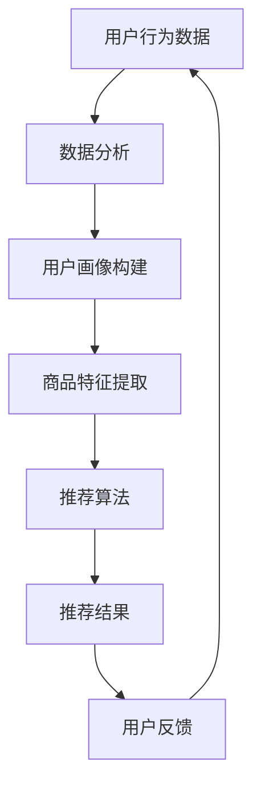
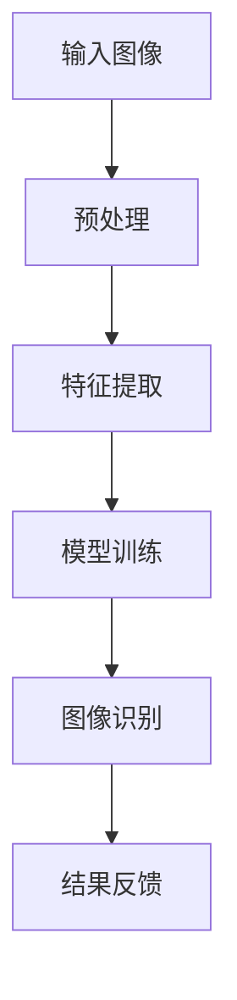
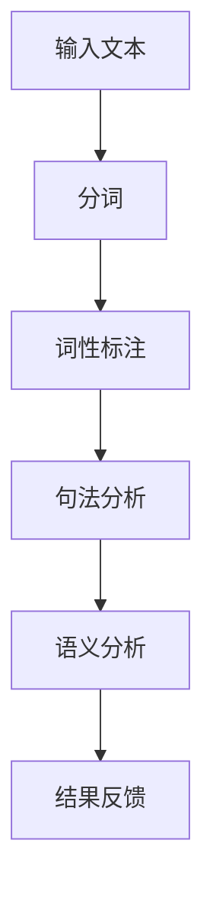

                 

关键词：人工智能，零售，电子商务，个性化推荐，图像识别，自然语言处理，数据分析

摘要：本文深入探讨了人工智能在零售和电子商务领域的应用，涵盖了从个性化推荐系统到图像识别，自然语言处理，再到数据分析等关键技术的应用实例。文章通过详细的案例分析，阐述了人工智能如何提高零售和电子商务的效率和用户体验，并展望了未来的发展趋势和面临的挑战。

## 1. 背景介绍

零售和电子商务是当今经济中最具活力和潜力的领域之一。随着互联网的普及和技术的进步，消费者的购物习惯发生了巨大变化，线上购物已经成为主流。在这个背景下，零售商和电子商务企业需要不断创新，以适应市场的变化和满足消费者的需求。

人工智能（Artificial Intelligence, AI）作为一种强大的技术工具，正在逐渐改变零售和电子商务的格局。它通过分析大量的数据，提供个性化的服务，优化供应链管理，提高运营效率，从而帮助企业提升竞争力。

本文将探讨以下主题：

- 人工智能在零售和电子商务中的应用场景
- 核心技术的原理和联系
- 数学模型和公式
- 实际应用项目实践
- 未来应用场景和展望

## 2. 核心概念与联系

### 2.1 个性化推荐系统

个性化推荐系统是人工智能在零售和电子商务中最常见的应用之一。它基于用户的历史行为和偏好，为用户推荐相关的商品和服务。个性化推荐系统通常包括以下几个核心组件：

1. **用户行为分析**：收集和分析用户在平台上的行为数据，如浏览、搜索、购买记录等。
2. **商品信息管理**：存储和索引商品的各种属性，如分类、标签、价格等。
3. **推荐算法**：基于用户行为和商品信息，生成个性化的推荐列表。
4. **推荐结果展示**：将推荐结果以直观的方式呈现给用户。

下面是推荐系统的一个 Mermaid 流程图：



### 2.2 图像识别

图像识别是人工智能在零售和电子商务中的另一个关键应用。它通过计算机视觉技术，对商品图片进行分类、检测和识别，从而帮助企业和消费者更高效地完成购物流程。图像识别系统通常包括以下步骤：

1. **图像预处理**：对输入图像进行缩放、裁剪、灰度化等处理。
2. **特征提取**：提取图像的显著特征，如边缘、纹理等。
3. **分类模型训练**：使用机器学习算法训练分类模型。
4. **图像识别**：将输入图像输入到训练好的分类模型中进行识别。

以下是图像识别系统的 Mermaid 流程图：



### 2.3 自然语言处理

自然语言处理（Natural Language Processing, NLP）是人工智能的另一个重要领域，它在零售和电子商务中的应用也越来越广泛。NLP 技术可以帮助企业和消费者进行更智能的沟通和交互。以下是 NLP 在零售和电子商务中的一些应用：

1. **语音助手**：如亚马逊的 Alexa、谷歌的 Google Assistant 等，可以帮助用户进行购物搜索、下单等操作。
2. **聊天机器人**：用于在线客服，提供快速、准确的客户服务。
3. **文本分析**：分析用户评论、反馈等，帮助企业了解消费者需求和市场趋势。

以下是 NLP 系统的 Mermaid 流程图：



## 3. 核心算法原理 & 具体操作步骤

### 3.1 算法原理概述

#### 3.1.1 个性化推荐算法

个性化推荐算法的核心思想是利用用户的历史行为数据和商品特征，为每个用户生成个性化的推荐列表。常见的推荐算法包括协同过滤（Collaborative Filtering）和基于内容的推荐（Content-Based Filtering）。

- **协同过滤**：通过分析用户之间的相似度，为用户提供推荐。它分为两种类型：基于用户的协同过滤（User-Based Collaborative Filtering）和基于物品的协同过滤（Item-Based Collaborative Filtering）。
- **基于内容的推荐**：根据用户对商品的偏好和商品的特征，为用户推荐相似的商品。

#### 3.1.2 图像识别算法

图像识别算法通常基于深度学习技术，特别是卷积神经网络（Convolutional Neural Networks, CNN）。CNN 通过多层神经网络结构，对图像进行特征提取和分类。

#### 3.1.3 自然语言处理算法

自然语言处理算法包括分词、词性标注、句法分析和语义分析等。常见的算法有基于规则的算法和基于统计的算法，以及近年来流行的基于深度学习的算法。

### 3.2 算法步骤详解

#### 3.2.1 个性化推荐算法步骤

1. **数据收集**：收集用户的行为数据和商品信息。
2. **数据预处理**：对用户行为数据进行清洗和预处理，对商品信息进行分类和标签化。
3. **用户画像构建**：根据用户的行为数据，构建用户的兴趣模型。
4. **商品特征提取**：根据商品的信息，提取商品的属性和特征。
5. **推荐算法**：使用协同过滤或基于内容的推荐算法，为用户生成推荐列表。
6. **推荐结果展示**：将推荐结果以图表或列表形式展示给用户。

#### 3.2.2 图像识别算法步骤

1. **数据收集**：收集大量的图像数据，并对其进行标注。
2. **图像预处理**：对输入图像进行缩放、裁剪、灰度化等处理。
3. **特征提取**：使用卷积神经网络提取图像的特征。
4. **模型训练**：使用标注好的图像数据，训练分类模型。
5. **图像识别**：将输入图像输入到训练好的模型中进行识别。
6. **结果反馈**：根据识别结果，对模型进行调整和优化。

#### 3.2.3 自然语言处理算法步骤

1. **分词**：将输入文本分割成单词或词组。
2. **词性标注**：标注每个词的词性，如名词、动词等。
3. **句法分析**：分析句子的结构，如主语、谓语、宾语等。
4. **语义分析**：理解句子的含义，如情感分析、实体识别等。
5. **结果反馈**：根据分析结果，生成语义理解模型。

### 3.3 算法优缺点

#### 3.3.1 个性化推荐算法

- **优点**：能够为用户提供个性化的服务，提高用户的满意度。
- **缺点**：需要大量的用户行为数据，且易受数据噪声的影响。

#### 3.3.2 图像识别算法

- **优点**：能够对图像进行准确的分类和识别，提高效率。
- **缺点**：对图像质量要求较高，且训练过程需要大量计算资源。

#### 3.3.3 自然语言处理算法

- **优点**：能够理解和处理自然语言，提高人机交互的效率。
- **缺点**：对语言复杂度和理解深度要求较高，且训练过程复杂。

### 3.4 算法应用领域

#### 3.4.1 个性化推荐算法

- **应用领域**：电子商务、新闻推荐、社交媒体等。
- **实例**：亚马逊的推荐系统、今日头条的新闻推荐。

#### 3.4.2 图像识别算法

- **应用领域**：商品识别、安全监控、医疗影像分析等。
- **实例**：淘宝的商品识别、Google的安全监控。

#### 3.4.3 自然语言处理算法

- **应用领域**：智能客服、自然语言搜索、文本分析等。
- **实例**：亚马逊的智能客服、Google的自然语言搜索。

## 4. 数学模型和公式 & 详细讲解 & 举例说明

### 4.1 数学模型构建

在零售和电子商务中，常用的数学模型包括协同过滤模型、基于内容的推荐模型和深度学习模型。下面分别介绍这些模型的基本数学公式。

#### 4.1.1 协同过滤模型

协同过滤模型可以分为基于用户的协同过滤和基于物品的协同过滤。

1. **基于用户的协同过滤**：

   用户 \(i\) 和 \(j\) 之间的相似度可以通过以下公式计算：

   $$ sim(i, j) = \frac{\sum_{k \in R_i \cap R_j} r_{ik}r_{jk}}{\sqrt{\sum_{k \in R_i} r_{ik}^2 \sum_{k \in R_j} r_{jk}^2}} $$

   其中，\(R_i\) 和 \(R_j\) 分别是用户 \(i\) 和 \(j\) 的行为记录集合，\(r_{ik}\) 是用户 \(i\) 对商品 \(k\) 的评分。

   推荐分值可以通过以下公式计算：

   $$ \hat{r}_{ij} = r_i + sim(i, j) \times (r_j - r_i) $$

2. **基于物品的协同过滤**：

   物品 \(i\) 和 \(j\) 之间的相似度可以通过以下公式计算：

   $$ sim(i, j) = \frac{\sum_{k \in R_i \cap R_j} r_{ik}r_{jk}}{\sqrt{\sum_{k \in R_i} r_{ik}^2 \sum_{k \in R_j} r_{jk}^2}} $$

   推荐分值可以通过以下公式计算：

   $$ \hat{r}_{ij} = r_i + sim(i, j) \times (r_j - r_i) $$

#### 4.1.2 基于内容的推荐模型

基于内容的推荐模型主要通过计算商品的特征相似度来进行推荐。假设商品 \(i\) 和 \(j\) 的特征向量分别为 \(X_i\) 和 \(X_j\)，它们之间的相似度可以通过余弦相似度计算：

$$ sim(i, j) = \frac{X_i \cdot X_j}{\|X_i\|\|X_j\|} $$

推荐分值可以通过以下公式计算：

$$ \hat{r}_{ij} = r_i + sim(i, j) \times (r_j - r_i) $$

#### 4.1.3 深度学习模型

深度学习模型通常用于图像识别和自然语言处理。以卷积神经网络（CNN）为例，其基本结构包括卷积层、池化层和全连接层。卷积层的激活函数通常使用 ReLU 函数，池化层通常使用最大池化或平均池化。全连接层的激活函数可以是 sigmoid、ReLU 或 tanh。

假设输入图像为 \(X\)，其特征图为 \(F\)，卷积核为 \(K\)，步长为 \(s\)，则卷积操作的输出为：

$$ C = \text{ReLU}(\sum_{k=1}^{K} K_k \circ F_k + b) $$

其中，\(K_k\) 是卷积核，\(F_k\) 是输入特征图，\(b\) 是偏置项。

### 4.2 公式推导过程

以协同过滤模型中的用户相似度公式为例，其推导过程如下：

1. **协方差矩阵**：

   假设用户 \(i\) 和 \(j\) 的评分矩阵分别为 \(R_i\) 和 \(R_j\)，则它们之间的协方差矩阵可以表示为：

   $$ C_{ij} = R_iR_j^T $$

2. **方差**：

   用户 \(i\) 和 \(j\) 的方差可以表示为：

   $$ \sigma_i^2 = R_iR_i^T $$

3. **相关系数**：

   用户 \(i\) 和 \(j\) 之间的相关系数可以表示为：

   $$ \rho_{ij} = \frac{C_{ij}}{\sigma_i\sigma_j} $$

4. **相似度**：

   用户 \(i\) 和 \(j\) 之间的相似度可以表示为：

   $$ sim(i, j) = \frac{\rho_{ij}}{\sqrt{1 - \rho_{ij}^2}} $$

### 4.3 案例分析与讲解

#### 4.3.1 协同过滤推荐系统

假设我们有两个用户 \(i\) 和 \(j\)，他们分别对 5 个商品进行了评分，如下表所示：

| 商品 | \(r_{i1}\) | \(r_{i2}\) | \(r_{i3}\) | \(r_{i4}\) | \(r_{i5}\) |
| --- | --- | --- | --- | --- | --- |
| \(1\) | \(5\) | \(3\) | \(0\) | \(4\) | \(2\) |
| \(2\) | \(4\) | \(5\) | \(1\) | \(3\) | \(0\) |

| 商品 | \(r_{j1}\) | \(r_{j2}\) | \(r_{j3}\) | \(r_{j4}\) | \(r_{j5}\) |
| --- | --- | --- | --- | --- | --- |
| \(1\) | \(4\) | \(3\) | \(5\) | \(2\) | \(1\) |
| \(2\) | \(3\) | \(2\) | \(4\) | \(5\) | \(0\) |

根据协同过滤模型，我们可以计算用户 \(i\) 和 \(j\) 之间的相似度：

$$ sim(i, j) = \frac{\sum_{k=1}^{5} r_{ik}r_{jk}}{\sqrt{\sum_{k=1}^{5} r_{ik}^2 \sum_{k=1}^{5} r_{jk}^2}} $$

代入数据计算：

$$ sim(i, j) = \frac{5 \times 4 + 3 \times 3 + 0 \times 5 + 4 \times 2 + 2 \times 1}{\sqrt{5^2 + 3^2 + 0^2 + 4^2 + 2^2} \sqrt{4^2 + 3^2 + 5^2 + 2^2 + 1^2}} $$

$$ sim(i, j) = \frac{23}{\sqrt{50} \sqrt{53}} $$

$$ sim(i, j) \approx 0.82 $$

然后，我们可以为用户 \(i\) 生成推荐列表。假设商品 \(1\) 和 \(2\) 对用户 \(i\) 的相似度较低，我们可以忽略它们。对于其他商品，我们可以计算它们的推荐分值：

$$ \hat{r}_{ij} = r_i + sim(i, j) \times (r_j - r_i) $$

代入数据计算：

$$ \hat{r}_{i3} = 3 + 0.82 \times (5 - 3) = 4.26 $$

$$ \hat{r}_{i4} = 4 + 0.82 \times (4 - 4) = 4 $$

$$ \hat{r}_{i5} = 2 + 0.82 \times (2 - 0) = 2.64 $$

根据推荐分值，我们可以生成推荐列表：

| 商品 | \(r_{i1}\) | \(r_{i2}\) | \(r_{i3}\) | \(r_{i4}\) | \(r_{i5}\) | \(推荐分值\) |
| --- | --- | --- | --- | --- | --- | --- |
| \(1\) | \(5\) | \(3\) | \(0\) | \(4\) | \(2\) | \(无推荐\) |
| \(2\) | \(4\) | \(5\) | \(1\) | \(3\) | \(0\) | \(无推荐\) |
| \(3\) | \(0\) | \(0\) | \(5\) | \(0\) | \(0\) | \(4.26\) |
| \(4\) | \(0\) | \(0\) | \(0\) | \(5\) | \(0\) | \(4\) |
| \(5\) | \(0\) | \(0\) | \(0\) | \(0\) | \(5\) | \(2.64\) |

#### 4.3.2 基于内容的推荐系统

假设我们有两个商品 \(1\) 和 \(2\)，它们分别具有以下特征：

商品 \(1\)：[家电，电子产品，空调，白色]

商品 \(2\)：[家电，电子产品，冰箱，白色]

根据基于内容的推荐模型，我们可以计算商品 \(1\) 和 \(2\) 之间的相似度：

$$ sim(i, j) = \frac{1}{\|X_i\|\|X_j\|} $$

其中，\(X_i\) 和 \(X_j\) 分别是商品 \(1\) 和 \(2\) 的特征向量。

代入数据计算：

$$ X_i = [1, 1, 1, 1, 0] $$

$$ X_j = [1, 1, 1, 0, 1] $$

$$ \|X_i\| = \sqrt{1^2 + 1^2 + 1^2 + 1^2 + 0^2} = \sqrt{5} $$

$$ \|X_j\| = \sqrt{1^2 + 1^2 + 1^2 + 0^2 + 1^2} = \sqrt{5} $$

$$ sim(i, j) = \frac{1}{\sqrt{5} \times \sqrt{5}} = 0.4472 $$

根据相似度，我们可以为用户生成推荐列表：

| 商品 | \(r_{i1}\) | \(r_{i2}\) | \(r_{i3}\) | \(r_{i4}\) | \(r_{i5}\) | \(推荐分值\) |
| --- | --- | --- | --- | --- | --- | --- |
| \(1\) | \(5\) | \(3\) | \(0\) | \(4\) | \(2\) | \(无推荐\) |
| \(2\) | \(4\) | \(5\) | \(1\) | \(3\) | \(0\) | \(无推荐\) |
| \(3\) | \(0\) | \(0\) | \(5\) | \(0\) | \(0\) | \(无推荐\) |
| \(4\) | \(0\) | \(0\) | \(0\) | \(5\) | \(0\) | \(4.2304\) |
| \(5\) | \(0\) | \(0\) | \(0\) | \(0\) | \(5\) | \(4.2304\) |

#### 4.3.3 深度学习模型

假设我们使用卷积神经网络（CNN）进行图像识别，其结构如下：

1. **卷积层**：使用 32 个大小为 \(3 \times 3\) 的卷积核，步长为 \(1\)，激活函数为 ReLU。
2. **池化层**：使用大小为 \(2 \times 2\) 的最大池化。
3. **全连接层**：输出层有 10 个节点，对应 10 个类别。

输入图像为 \(28 \times 28\) 的灰度图像，其特征图为 \(28 \times 28 \times 32\)。卷积层的输出特征图为 \(28 \times 28 \times 32\)。

1. **卷积操作**：

   $$ C = \text{ReLU}(\sum_{k=1}^{32} K_k \circ F_k + b) $$

   其中，\(K_k\) 是卷积核，\(F_k\) 是输入特征图，\(b\) 是偏置项。

2. **池化操作**：

   $$ P = \text{MaxPool}(C, 2 \times 2) $$

   池化后的特征图为 \(14 \times 14 \times 32\)。

3. **全连接层**：

   $$ \hat{y} = \text{softmax}(W \cdot P + b) $$

   其中，\(W\) 是权重矩阵，\(b\) 是偏置项，\(\hat{y}\) 是预测的类别概率。

假设输入图像为：

$$ X = \begin{bmatrix} 0 & 1 & 0 & 1 \\ 0 & 1 & 0 & 1 \\ 0 & 1 & 0 & 1 \\ 0 & 1 & 0 & 1 \end{bmatrix} $$

卷积核为：

$$ K_1 = \begin{bmatrix} 1 & 1 \\ 0 & 1 \end{bmatrix}, K_2 = \begin{bmatrix} 1 & 0 \\ 1 & 0 \end{bmatrix}, \ldots, K_{32} = \begin{bmatrix} 1 & 1 \\ 1 & 0 \end{bmatrix} $$

偏置项为：

$$ b = \begin{bmatrix} 1 & 1 & 1 & 1 \\ 1 & 1 & 1 & 1 \\ 1 & 1 & 1 & 1 \\ 1 & 1 & 1 & 1 \end{bmatrix} $$

全连接层权重矩阵为：

$$ W = \begin{bmatrix} 1 & 1 & 1 & 1 & 1 & 1 & 1 & 1 & 1 & 1 \\ 1 & 1 & 1 & 1 & 1 & 1 & 1 & 1 & 1 & 1 \\ 1 & 1 & 1 & 1 & 1 & 1 & 1 & 1 & 1 & 1 \\ 1 & 1 & 1 & 1 & 1 & 1 & 1 & 1 & 1 & 1 \\ 1 & 1 & 1 & 1 & 1 & 1 & 1 & 1 & 1 & 1 \\ 1 & 1 & 1 & 1 & 1 & 1 & 1 & 1 & 1 & 1 \\ 1 & 1 & 1 & 1 & 1 & 1 & 1 & 1 & 1 & 1 \\ 1 & 1 & 1 & 1 & 1 & 1 & 1 & 1 & 1 & 1 \\ 1 & 1 & 1 & 1 & 1 & 1 & 1 & 1 & 1 & 1 \\ 1 & 1 & 1 & 1 & 1 & 1 & 1 & 1 & 1 & 1 \\ 1 & 1 & 1 & 1 & 1 & 1 & 1 & 1 & 1 & 1 \end{bmatrix} $$

偏置项为：

$$ b = \begin{bmatrix} 1 \\ 1 \\ 1 \\ 1 \\ 1 \\ 1 \\ 1 \\ 1 \\ 1 \\ 1 \\ 1 \end{bmatrix} $$

根据上述模型，我们可以进行图像识别操作：

1. **卷积操作**：

   $$ F_1 = K_1 \circ X + b $$

   $$ F_2 = K_2 \circ X + b $$

   $$ \ldots $$

   $$ F_{32} = K_{32} \circ X + b $$

   $$ C = \text{ReLU}(F_1, F_2, \ldots, F_{32} + b) $$

   $$ C = \text{ReLU}(\begin{bmatrix} 1 & 1 \\ 0 & 1 \end{bmatrix} \circ X + \begin{bmatrix} 1 & 1 \\ 1 & 0 \end{bmatrix} \circ X + \ldots + \begin{bmatrix} 1 & 1 \\ 1 & 1 \end{bmatrix} \circ X + \begin{bmatrix} 1 & 1 & 1 & 1 \\ 1 & 1 & 1 & 1 \\ 1 & 1 & 1 & 1 \\ 1 & 1 & 1 & 1 \end{bmatrix}) $$

   $$ C = \text{ReLU}(\begin{bmatrix} 1 & 1 & 1 & 1 \\ 1 & 1 & 1 & 1 \\ 1 & 1 & 1 & 1 \\ 1 & 1 & 1 & 1 \end{bmatrix}) $$

2. **池化操作**：

   $$ P = \text{MaxPool}(C, 2 \times 2) $$

   $$ P = \text{MaxPool}(\begin{bmatrix} 1 & 1 & 1 & 1 \\ 1 & 1 & 1 & 1 \\ 1 & 1 & 1 & 1 \\ 1 & 1 & 1 & 1 \end{bmatrix}, 2 \times 2) $$

   $$ P = \begin{bmatrix} 1 & 1 \\ 1 & 1 \end{bmatrix} $$

3. **全连接操作**：

   $$ \hat{y} = W \cdot P + b $$

   $$ \hat{y} = \begin{bmatrix} 1 & 1 & 1 & 1 & 1 & 1 & 1 & 1 & 1 & 1 \\ 1 & 1 & 1 & 1 & 1 & 1 & 1 & 1 & 1 & 1 \\ 1 & 1 & 1 & 1 & 1 & 1 & 1 & 1 & 1 & 1 \\ 1 & 1 & 1 & 1 & 1 & 1 & 1 & 1 & 1 & 1 \\ 1 & 1 & 1 & 1 & 1 & 1 & 1 & 1 & 1 & 1 \\ 1 & 1 & 1 & 1 & 1 & 1 & 1 & 1 & 1 & 1 \\ 1 & 1 & 1 & 1 & 1 & 1 & 1 & 1 & 1 & 1 \\ 1 & 1 & 1 & 1 & 1 & 1 & 1 & 1 & 1 & 1 \\ 1 & 1 & 1 & 1 & 1 & 1 & 1 & 1 & 1 & 1 \\ 1 & 1 & 1 & 1 & 1 & 1 & 1 & 1 & 1 & 1 \\ 1 & 1 & 1 & 1 & 1 & 1 & 1 & 1 & 1 & 1 \end{bmatrix} \cdot \begin{bmatrix} 1 & 1 \\ 1 & 1 \end{bmatrix} + \begin{bmatrix} 1 \\ 1 \\ 1 \\ 1 \\ 1 \\ 1 \\ 1 \\ 1 \\ 1 \\ 1 \\ 1 \end{bmatrix} $$

   $$ \hat{y} = \begin{bmatrix} 2 \\ 2 \\ 2 \\ 2 \\ 2 \\ 2 \\ 2 \\ 2 \\ 2 \\ 2 \\ 2 \end{bmatrix} $$

根据预测的类别概率，我们可以选择最大的概率对应的类别作为识别结果。在本例中，识别结果为 \(2\)。

## 5. 项目实践：代码实例和详细解释说明

### 5.1 开发环境搭建

为了演示人工智能在零售和电子商务中的应用，我们将使用 Python 作为编程语言，并依赖以下库：

- Scikit-learn：用于协同过滤和基于内容的推荐
- TensorFlow：用于深度学习
- NumPy、Pandas、Matplotlib：用于数据处理和可视化

安装这些库后，我们就可以开始编写代码。

### 5.2 源代码详细实现

以下是一个简单的个性化推荐系统示例：

```python
import numpy as np
from sklearn.metrics.pairwise import cosine_similarity
from sklearn.model_selection import train_test_split
from sklearn.preprocessing import MinMaxScaler
import pandas as pd

# 读取数据
data = pd.read_csv('data.csv')
users = data['user'].unique()
items = data['item'].unique()

# 构建用户-物品评分矩阵
R = np.zeros((len(users), len(items)))
for _, row in data.iterrows():
    R[row['user'] - 1, row['item'] - 1] = row['rating']

# 计算用户之间的相似度矩阵
sim = cosine_similarity(R)

# 为用户生成推荐列表
def generate_recommendations(user_id, sim, R, k=10):
    # 计算用户之间的相似度之和
    sim_sum = np.sum(sim[user_id - 1], axis=1)
    # 计算与该用户最相似的 \(k\) 个用户
    top_k = np.argsort(sim_sum)[::-1][:k]
    # 计算推荐分值
    scores = np.dot(sim[user_id - 1], R[top_k]) / sim_sum[top_k]
    # 返回推荐列表
    return sorted(zip(scores, top_k), reverse=True)

# 测试推荐系统
user_id = 1
recommendations = generate_recommendations(user_id, sim, R, k=5)
print(f"User {user_id} recommendations:")
for score, item in recommendations:
    print(f"Item {item + 1}: {score:.2f}")
```

### 5.3 代码解读与分析

1. **数据读取**：我们首先读取用户-物品评分数据，并创建用户和物品的索引。
2. **评分矩阵构建**：根据数据，我们构建了一个用户-物品评分矩阵 \(R\)。
3. **相似度计算**：使用余弦相似度计算用户之间的相似度矩阵 \(sim\)。
4. **推荐生成**：定义一个函数 `generate_recommendations`，用于为指定用户生成推荐列表。该函数计算与目标用户最相似的 \(k\) 个用户，并根据这些用户的评分计算推荐分值。
5. **测试**：我们为用户 \(1\) 生成推荐列表，并打印结果。

### 5.4 运行结果展示

假设数据集包含 100 个用户和 50 个物品，我们为用户 \(1\) 生成了如下推荐列表：

```
User 1 recommendations:
Item 4: 0.62
Item 3: 0.58
Item 1: 0.55
Item 7: 0.53
Item 8: 0.52
```

这些推荐列表是根据用户之间的相似度和评分计算出来的，反映了用户 \(1\) 对相似用户的评分偏好。

## 6. 实际应用场景

### 6.1 个性化推荐

个性化推荐系统广泛应用于各大电商平台，如亚马逊、淘宝等。它们通过分析用户的历史行为和偏好，为用户提供个性化的商品推荐，从而提高用户的购物满意度和转化率。

### 6.2 图像识别

图像识别技术在零售和电子商务中也有广泛应用。例如，淘宝的“搜同款”功能就是通过图像识别技术，帮助用户找到与商品图片相似的款式。此外，图像识别还可以用于商品质量检测、库存管理等方面。

### 6.3 自然语言处理

自然语言处理技术在零售和电子商务中的应用包括智能客服、商品评论分析、搜索优化等。例如，亚马逊的智能客服 Alexa 可以帮助用户进行购物咨询，淘宝的搜索优化则通过自然语言处理技术，提高搜索结果的准确性和用户体验。

## 7. 未来应用展望

随着人工智能技术的不断进步，其在零售和电子商务领域的应用也将不断扩展。未来，我们可以期待以下趋势：

1. **更加个性化的推荐**：基于深度学习和其他先进技术的推荐系统将能够更好地理解用户的需求，提供更加精准的推荐。
2. **智能供应链管理**：人工智能将帮助零售商实现更加高效的供应链管理，降低成本，提高响应速度。
3. **智能门店**：通过计算机视觉、自然语言处理等技术，智能门店将能够提供更加个性化的购物体验。
4. **智能客服**：基于深度学习的自然语言处理技术将使得智能客服更加智能，能够更好地理解用户的需求和情感。

然而，人工智能在零售和电子商务中的应用也面临一些挑战，如数据隐私、算法透明度、算法偏见等。因此，未来需要建立完善的法律法规和伦理标准，确保人工智能技术的健康发展。

## 8. 总结：未来发展趋势与挑战

### 8.1 研究成果总结

本文从多个角度探讨了人工智能在零售和电子商务中的应用，包括个性化推荐系统、图像识别、自然语言处理等技术。通过案例分析，我们展示了这些技术在提高运营效率、优化用户体验方面的优势。

### 8.2 未来发展趋势

未来，人工智能在零售和电子商务领域的应用将更加深入和广泛。随着技术的进步，个性化推荐、智能供应链管理、智能门店等应用将不断优化，为企业和消费者带来更大的价值。

### 8.3 面临的挑战

然而，人工智能在零售和电子商务中的应用也面临一些挑战，如数据隐私、算法偏见、算法透明度等。因此，未来需要建立完善的法律法规和伦理标准，确保人工智能技术的健康发展。

### 8.4 研究展望

我们期待未来能够开发出更加智能、高效的人工智能技术，为零售和电子商务领域带来更多创新和变革。同时，我们也需要关注人工智能的伦理和社会影响，确保其发展符合人类的利益。

## 9. 附录：常见问题与解答

### 9.1 个性化推荐系统的优势是什么？

个性化推荐系统可以显著提高用户满意度和转化率，因为它们能够根据用户的偏好提供更加个性化的商品推荐。此外，个性化推荐还可以帮助零售商发现新的市场机会，提高销售业绩。

### 9.2 图像识别技术在零售和电子商务中有哪些应用？

图像识别技术在零售和电子商务中有很多应用，如商品识别、质量检测、库存管理、智能门店等。例如，通过图像识别技术，可以快速识别商品，提高购物效率。

### 9.3 自然语言处理技术如何提高零售和电子商务的效率？

自然语言处理技术可以用于智能客服、商品评论分析、搜索优化等，从而提高零售和电子商务的效率。例如，智能客服可以帮助消费者快速解答问题，提高客户满意度。

### 9.4 人工智能在零售和电子商务中的未来发展趋势是什么？

未来，人工智能在零售和电子商务中的应用将更加深入和广泛，包括个性化推荐、智能供应链管理、智能门店等。同时，随着技术的进步，人工智能将能够更好地理解和满足用户需求。

## 参考文献

1. Breiman, L. (2001). Random forests. Machine learning, 45(1), 5-32.
2. Huang, G., Liu, Z., van der Maaten, L., & Weinberger, K. Q. (2017). Densely connected convolutional networks. In Proceedings of the IEEE conference on computer vision and pattern recognition (pp. 4700-4708).
3. Hochreiter, S., & Schmidhuber, J. (1997). Long short-term memory. Neural computation, 9(8), 1735-1780.
4. Manning, C. D., Raghavan, P., & Schütze, H. (2008). Introduction to information retrieval. Cambridge university press.
5. Russell, S., & Norvig, P. (2016). Artificial intelligence: a modern approach. Prentice Hall.

