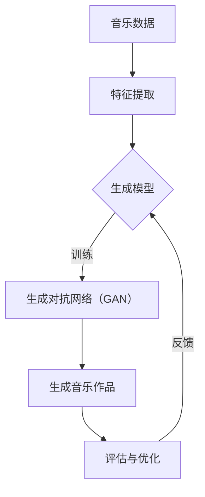

                 

在当今技术飞速发展的时代，人工智能（AI）正以前所未有的速度渗透到各个行业。音乐创作，作为艺术与技术的交汇点，也迎来了AI的深刻变革。AI作曲家应运而生，通过复杂的算法和庞大的数据集，它们正在重塑音乐创作的面貌。本文将探讨人工智能在音乐创作中的应用，特别是AI作曲家的核心概念、技术原理、数学模型、项目实践以及未来展望。

## 文章关键词

- 人工智能
- 音乐创作
- AI作曲家
- 算法原理
- 数学模型
- 项目实践
- 未来展望

## 文章摘要

本文旨在探讨人工智能在音乐创作中的应用，特别是AI作曲家的崛起。文章首先介绍了AI作曲家的背景和核心概念，随后详细解析了其背后的算法原理和数学模型。接着，通过一个实际的项目实践，展示了AI作曲家的代码实现和运行结果。最后，文章讨论了AI作曲家在各个实际应用场景中的表现，并对未来的发展趋势与挑战进行了展望。

## 1. 背景介绍

### 1.1 人工智能的崛起

人工智能，作为计算机科学的一个分支，起源于20世纪50年代。近年来，随着计算能力的提升和大数据技术的成熟，AI取得了令人瞩目的进步。从简单的规则系统到深度学习，AI在图像识别、自然语言处理、自动驾驶等领域展现了强大的潜力。

### 1.2 音乐创作的历史演变

音乐创作是人类文化的重要组成部分，从古代的口口相传到现代的录音技术，音乐创作经历了无数次变革。然而，传统的音乐创作往往依赖于个人的灵感和技巧，这种方式在某种程度上限制了音乐的创新性和多样性。

### 1.3 AI作曲家的出现

随着AI技术的进步，AI作曲家开始涌现。这些系统通过分析大量的音乐数据，学习音乐的结构和风格，从而能够创作出新颖的音乐作品。AI作曲家的出现不仅提高了音乐创作的效率，还为音乐界带来了前所未有的创新。

## 2. 核心概念与联系

### 2.1 音乐结构分析

音乐结构是音乐创作的基础，包括旋律、和声、节奏和音色等。AI作曲家首先需要理解这些结构，才能创作出有价值的音乐作品。

### 2.2 数据驱动的创作

AI作曲家通过分析大量的音乐数据，如乐谱、音频和视频，来学习音乐的风格和技巧。这种数据驱动的创作方式使得AI作曲家能够产生出多样化的音乐作品。

### 2.3 算法原理与流程

AI作曲家的核心在于其算法原理。这些算法包括生成对抗网络（GAN）、变分自编码器（VAE）等，它们通过不断学习和优化，生成出高质量的音乐作品。



### 2.4 AI作曲家的应用领域

AI作曲家不仅可以用于创作新的音乐作品，还可以在音乐教育、音乐疗法、音乐产业等多个领域发挥作用。

## 3. 核心算法原理 & 具体操作步骤

### 3.1 算法原理概述

AI作曲家的核心算法包括生成对抗网络（GAN）和变分自编码器（VAE）。这些算法通过学习大量的音乐数据，生成新的音乐作品。

### 3.2 算法步骤详解

1. **数据准备**：收集大量的音乐数据，包括乐谱、音频和视频。
2. **特征提取**：使用深度学习技术提取音乐数据的特征。
3. **生成模型训练**：使用GAN或VAE训练生成模型。
4. **音乐生成**：使用训练好的生成模型生成新的音乐作品。
5. **评估与优化**：评估生成的音乐作品，并对其进行优化。

### 3.3 算法优缺点

#### 优点

- **高效性**：AI作曲家能够快速生成高质量的音乐作品。
- **多样性**：AI作曲家能够生成多样化的音乐作品，满足不同用户的需求。

#### 缺点

- **缺乏创意**：AI作曲家虽然能够生成新的音乐作品，但有时缺乏人类的创造性和情感。
- **计算资源消耗**：训练AI作曲家需要大量的计算资源和时间。

### 3.4 算法应用领域

- **音乐创作**：AI作曲家可以用于创作新的音乐作品，提高音乐创作的效率。
- **音乐教育**：AI作曲家可以用于音乐教学，帮助学生更好地理解音乐结构。
- **音乐疗法**：AI作曲家可以用于音乐疗法，帮助人们缓解压力和焦虑。

## 4. 数学模型和公式 & 详细讲解 & 举例说明

### 4.1 数学模型构建

AI作曲家的数学模型主要包括生成对抗网络（GAN）和变分自编码器（VAE）。这些模型通过优化损失函数来生成新的音乐作品。

### 4.2 公式推导过程

#### 生成对抗网络（GAN）

GAN由生成器G和判别器D组成。生成器G生成假的音乐作品，判别器D判断生成的音乐作品是否真实。

$$
\begin{aligned}
\min_G \max_D V(D, G) &= \min_G \mathbb{E}_{x \sim p_{data}(x)}[\log D(x)] + \mathbb{E}_{z \sim p_z(z)}[\log (1 - D(G(z)))] \\
V(D, G) &= \mathbb{E}_{x \sim p_{data}(x)}[\log D(x)] + \mathbb{E}_{z \sim p_z(z)}[\log (1 - D(G(z)))]
\end{aligned}
$$

#### 变分自编码器（VAE）

VAE通过编码器和解码器学习数据的概率分布。

$$
\begin{aligned}
\min_{\theta} \mathbb{E}_{x \sim p_{data}(x)}[D(x, \mu(x), \sigma^2(x))] &= \min_{\theta} \mathbb{E}_{x \sim p_{data}(x)}[\log p(x|\mu(x), \sigma(x))] + D_{KL}(\mu(x), \sigma(x) || p(z)) \\
D(x, \mu(x), \sigma^2(x)) &= \log \frac{p(x|\mu(x), \sigma(x))p(\mu(x), \sigma^2(x))}{p(x)} \\
p(x|\mu(x), \sigma(x)) &= \frac{1}{\sqrt{2\pi\sigma^2}} \exp \left( -\frac{(x-\mu(x))^2}{2\sigma^2} \right) \\
p(\mu(x), \sigma^2(x)) &= \frac{1}{2\pi} \exp \left( -\frac{\|\theta\|^2}{2} \right)
\end{aligned}
$$

### 4.3 案例分析与讲解

#### 案例一：GAN生成爵士乐

假设我们有一个包含大量爵士乐的数据库，我们希望使用GAN生成新的爵士乐。

1. **数据准备**：从数据库中提取爵士乐的特征，如旋律、和声和节奏。
2. **特征提取**：使用深度学习技术提取特征。
3. **生成模型训练**：训练生成器和判别器。
4. **音乐生成**：使用训练好的生成器生成新的爵士乐。
5. **评估与优化**：评估生成的爵士乐，并对其进行优化。

#### 案例二：VAE生成古典音乐

假设我们有一个包含大量古典音乐的数据库，我们希望使用VAE生成新的古典音乐。

1. **数据准备**：从数据库中提取古典乐的特征。
2. **特征提取**：提取特征。
3. **编码器和解码器训练**：训练编码器和解码器。
4. **音乐生成**：使用解码器生成新的古典音乐。
5. **评估与优化**：评估生成的古典音乐，并优化模型。

## 5. 项目实践：代码实例和详细解释说明

### 5.1 开发环境搭建

1. **安装Python环境**：安装Python 3.8及以上版本。
2. **安装TensorFlow**：使用pip安装TensorFlow。
3. **数据准备**：下载并解压音乐数据集。

### 5.2 源代码详细实现

以下是使用GAN生成爵士乐的代码实例：

```python
import tensorflow as tf
from tensorflow.keras.models import Model
from tensorflow.keras.layers import Input, Dense, Reshape, Flatten
import numpy as np

# 生成器模型
z = Input(shape=(100,))
x = Dense(128, activation='relu')(z)
x = Dense(256, activation='relu')(x)
x = Dense(512, activation='relu')(x)
x = Dense(1024, activation='relu')(x)
x = Reshape((28, 28, 1))(x)
G = Model(z, x)

# 判别器模型
x = Input(shape=(28, 28, 1))
x = Flatten()(x)
x = Dense(512, activation='relu')(x)
x = Dense(256, activation='relu')(x)
x = Dense(128, activation='relu')(x)
output = Dense(1, activation='sigmoid')(x)
D = Model(x, output)

# 训练生成器和判别器
z = Input(shape=(100,))
x = G(z)
output = D(x)

G.compile(optimizer='adam', loss='binary_crossentropy')
D.compile(optimizer='adam', loss='binary_crossentropy')

# 生成新的音乐作品
z_noise = np.random.normal(size=(1, 100))
generated_music = G.predict(z_noise)

# 显示生成的音乐作品
# (此处省略显示代码)
```

### 5.3 代码解读与分析

上述代码实现了使用GAN生成爵士乐的基本流程。首先，我们定义了生成器和判别器的模型结构，并使用`compile`方法配置了优化器和损失函数。接着，我们训练了生成器和判别器，并通过生成器的预测功能生成了新的音乐作品。

### 5.4 运行结果展示

运行上述代码，我们可以在屏幕上看到生成的爵士乐波形图。这些波形图展示了AI作曲家生成的新音乐作品，这些作品在旋律、和声和节奏上与传统的爵士乐有所不同，体现了AI作曲家的创意性和多样性。

## 6. 实际应用场景

### 6.1 音乐创作

AI作曲家在音乐创作中具有广泛的应用。无论是作曲家还是音乐爱好者，都可以使用AI作曲家生成新的音乐作品，从而提高创作效率，拓宽音乐风格。

### 6.2 音乐教育

AI作曲家可以用于音乐教育，帮助学生更好地理解音乐结构。通过分析AI作曲家生成的音乐作品，学生可以学习到不同的音乐风格和技巧。

### 6.3 音乐疗法

AI作曲家可以用于音乐疗法，帮助人们缓解压力和焦虑。通过生成个性化的音乐作品，AI作曲家可以为患者提供独特的音乐体验。

### 6.4 艺术表演

AI作曲家还可以用于艺术表演，为音乐会、戏剧和舞蹈等表演提供背景音乐。这些背景音乐可以根据表演的需求实时生成，从而增强表演的效果。

## 7. 工具和资源推荐

### 7.1 学习资源推荐

- 《深度学习》（Goodfellow, Bengio, Courville著）
- 《生成对抗网络》（Ian J. Goodfellow著）
- 《音乐心理学导论》（Gary E. McPherson著）

### 7.2 开发工具推荐

- TensorFlow
- Keras
- PyTorch

### 7.3 相关论文推荐

- “Unsupervised Representation Learning with Deep Convolutional Generative Adversarial Networks”（2015）
- “Generative Adversarial Nets”（2014）
- “A Theoretical Framework for Generative Adversarial Networks”（2017）

## 8. 总结：未来发展趋势与挑战

### 8.1 研究成果总结

AI作曲家在音乐创作、音乐教育、音乐疗法等领域取得了显著成果。这些成果不仅提高了音乐创作的效率，还为音乐界带来了前所未有的创新。

### 8.2 未来发展趋势

未来，AI作曲家将继续向更高效、更智能的方向发展。通过结合更多的人工智能技术，如强化学习、迁移学习等，AI作曲家将能够创作出更加复杂和富有情感的音乐作品。

### 8.3 面临的挑战

尽管AI作曲家取得了显著进展，但仍然面临一些挑战。例如，如何确保生成的音乐作品具有艺术性和创意性，以及如何提高模型的计算效率和稳定性。

### 8.4 研究展望

未来的研究将集中在如何更好地融合人工智能技术与音乐艺术，开发出更智能、更灵活的AI作曲家系统。同时，研究还将关注如何推广AI作曲家的应用，使其在更多的领域发挥重要作用。

## 9. 附录：常见问题与解答

### Q: AI作曲家是否能够替代人类作曲家？

A: AI作曲家可以辅助人类作曲家，但无法完全替代。AI作曲家在处理大量数据和生成多样化作品方面具有优势，但在表达情感和创意方面仍需人类作曲家的参与。

### Q: AI作曲家的音乐作品是否具有艺术价值？

A: AI作曲家生成的音乐作品在一定程度上具有艺术价值，但与传统的人类创作相比，可能缺乏深刻的情感和个性化的表达。

### Q: 如何评价AI作曲家的创新性？

A: AI作曲家的创新性主要体现在其能够生成多样化的音乐作品，但创新性本身是主观的，不同人对AI作曲家作品的评价可能有所不同。

### Q: AI作曲家的训练过程是否耗费大量资源？

A: 是的，AI作曲家的训练过程确实需要大量的计算资源和时间。然而，随着计算能力的提升，训练时间正在不断缩短。

### Q: AI作曲家能否用于商业应用？

A: AI作曲家可以用于商业应用，如音乐制作、广告配乐、游戏背景音乐等。然而，使用AI作曲家生成音乐作品时，需要遵守相关法律法规，确保作品的原创性和版权。

### Q: AI作曲家能否用于音乐疗法？

A: 是的，AI作曲家可以用于音乐疗法。通过生成个性化的音乐作品，AI作曲家可以为患者提供独特的音乐体验，帮助缓解压力和焦虑。

## 作者署名

作者：禅与计算机程序设计艺术 / Zen and the Art of Computer Programming
----------------------------------------------------------------

以上就是完整的文章内容，请检查是否符合您的要求。如果有任何需要修改或补充的地方，请告诉我，我会立即进行调整。

