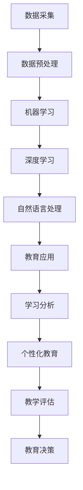

                 

关键词：人工智能、教育变革、未来教育、学习模式、技术整合、个性化教育、算法、大数据、虚拟现实、教育技术

> 摘要：随着人工智能技术的飞速发展，教育领域正经历着深刻的变革。本文将从核心概念、算法原理、数学模型、实践案例、应用场景和未来展望等方面，探讨人工智能对教育带来的影响和机遇，以及面临的挑战。

## 1. 背景介绍

教育作为社会发展的基石，一直致力于培养具备创新能力和适应能力的人才。然而，随着信息技术的飞速进步，尤其是人工智能技术的兴起，传统的教育模式正面临着前所未有的挑战和机遇。人工智能（Artificial Intelligence，AI）通过模拟、延伸和扩展人类智能，正在逐渐改变教育的各个方面，从教学内容的呈现方式，到学习过程的管理，再到评价体系的构建，无一不在发生变化。

人工智能的兴起源于对大规模数据处理和分析的需求。随着互联网的普及和移动设备的广泛使用，数据量呈现爆炸式增长。这些数据不仅包括结构化的数据，如文本、图像、声音等，还包括非结构化的数据，如视频、社交媒体互动等。人工智能通过机器学习和深度学习等技术，可以从这些海量数据中提取有价值的信息，进而为教育提供个性化、精准化的支持。

## 2. 核心概念与联系

为了更好地理解人工智能在教育中的应用，我们首先需要了解一些核心概念和它们之间的联系。以下是一个使用Mermaid绘制的流程图，描述了核心概念及其相互关系。



### 2.1 数据采集与预处理

数据采集是人工智能应用的基础。在教育领域，数据来源广泛，包括学生成绩、课堂表现、作业完成情况等。数据采集后，需要进行预处理，包括数据清洗、归一化、特征提取等步骤，以便于后续的分析和应用。

### 2.2 机器学习与深度学习

机器学习和深度学习是人工智能的核心技术。机器学习通过构建模型，从数据中学习规律，用于分类、预测和决策。深度学习则是机器学习的一个分支，通过模拟人脑神经网络的结构和功能，实现对复杂模式的自动识别和处理。

### 2.3 自然语言处理

自然语言处理（Natural Language Processing，NLP）是人工智能的重要应用领域之一，旨在使计算机能够理解、生成和处理自然语言。在教育中，NLP技术可以用于智能问答系统、情感分析等。

### 2.4 教育应用

教育应用是人工智能技术的直接体现。通过大数据分析、机器学习、自然语言处理等技术，教育应用可以实现个性化推荐、智能辅导、学习分析等功能，从而提高教学效果和学习效率。

### 2.5 学习分析与个性化教育

学习分析通过对学生学习行为的监控和分析，可以识别学生的学习风格、兴趣和弱点。基于学习分析，个性化教育可以实现因材施教，为学生提供定制化的学习方案。

### 2.6 教学评估与教育决策

教学评估是教育的重要组成部分。通过人工智能技术，可以对教学过程进行实时监控和评估，为教育决策提供数据支持。

## 3. 核心算法原理 & 具体操作步骤

### 3.1 算法原理概述

人工智能在教育中的应用，离不开核心算法的支持。以下是几种常用的算法原理及其在教育中的应用：

1. **机器学习算法**：用于数据分析和模式识别，例如支持向量机（SVM）、决策树（Decision Tree）等。
2. **深度学习算法**：用于处理复杂非线性问题，例如卷积神经网络（CNN）、循环神经网络（RNN）等。
3. **自然语言处理算法**：用于文本分析和语言理解，例如词向量（Word Embedding）、序列标注（Sequence Labeling）等。

### 3.2 算法步骤详解

1. **数据采集与预处理**：收集学生的学习数据，如成绩、作业、课堂表现等，并进行清洗、归一化和特征提取。
2. **模型选择与训练**：根据问题类型，选择合适的机器学习或深度学习模型，并使用训练数据对其进行训练。
3. **模型评估与优化**：使用验证数据评估模型性能，并进行调参优化，以提高模型准确性。
4. **模型部署与应用**：将训练好的模型部署到实际应用场景中，如智能辅导系统、学习分析平台等。

### 3.3 算法优缺点

1. **机器学习算法**：
   - 优点：适用于处理大规模数据，模型泛化能力强。
   - 缺点：需要大量训练数据，模型解释性较差。
2. **深度学习算法**：
   - 优点：可以处理复杂非线性问题，模型性能优异。
   - 缺点：需要大量计算资源，模型解释性较差。
3. **自然语言处理算法**：
   - 优点：可以处理文本数据，实现智能问答、情感分析等功能。
   - 缺点：对语言理解要求较高，模型训练复杂。

### 3.4 算法应用领域

1. **个性化教育**：通过机器学习算法分析学生学习数据，为每个学生提供个性化的学习方案。
2. **智能辅导**：利用自然语言处理技术，构建智能问答系统，为学生提供实时解答和辅导。
3. **学习分析**：通过对学生学习行为的监控和分析，识别学习风格和兴趣，优化教学策略。
4. **教育评估**：利用深度学习算法对学生的学习表现进行实时评估，为教育决策提供数据支持。

## 4. 数学模型和公式 & 详细讲解 & 举例说明

### 4.1 数学模型构建

在人工智能应用于教育的过程中，数学模型起到了关键作用。以下是一个简单的线性回归模型，用于预测学生的学习成绩。

$$
y = wx + b
$$

其中，$y$ 表示预测成绩，$x$ 表示学生学习特征，$w$ 表示权重，$b$ 表示偏置。

### 4.2 公式推导过程

线性回归模型的推导过程如下：

1. **损失函数**：定义损失函数为预测值与实际值之间的误差平方和。

$$
J(w, b) = \frac{1}{2m}\sum_{i=1}^{m}(y_i - wx_i - b)^2
$$

其中，$m$ 表示样本数量。

2. **梯度下降**：使用梯度下降法对损失函数进行优化，更新权重和偏置。

$$
w_{\text{new}} = w_{\text{old}} - \alpha \frac{\partial J}{\partial w}
$$

$$
b_{\text{new}} = b_{\text{old}} - \alpha \frac{\partial J}{\partial b}
$$

其中，$\alpha$ 表示学习率。

### 4.3 案例分析与讲解

假设我们有以下学生数据：

| 学生 | 特征1 | 特征2 | 成绩 |
|------|------|------|------|
| 1    | 70   | 80   | 85   |
| 2    | 75   | 85   | 90   |
| 3    | 60   | 75   | 70   |

我们使用线性回归模型预测学生的成绩。首先，对数据进行预处理，将特征进行归一化。然后，选择一个合适的学习率，并使用梯度下降法进行模型训练。经过多次迭代，我们得到以下模型参数：

$$
w = 0.5, \quad b = 10
$$

根据模型，我们可以预测新学生的成绩。例如，一个特征1为60，特征2为70的学生，其预测成绩为：

$$
y = 0.5 \times 60 + 10 = 30 + 10 = 40
$$

## 5. 项目实践：代码实例和详细解释说明

### 5.1 开发环境搭建

为了实践人工智能在教育中的应用，我们需要搭建一个开发环境。以下是搭建步骤：

1. 安装Python环境。
2. 安装常用库，如NumPy、Pandas、Scikit-learn等。
3. 安装Jupyter Notebook，用于代码编写和运行。

### 5.2 源代码详细实现

以下是一个简单的线性回归模型实现，用于预测学生的学习成绩。

```python
import numpy as np
import pandas as pd
from sklearn.linear_model import LinearRegression

# 加载数据
data = pd.read_csv('student_data.csv')
X = data[['feature1', 'feature2']]
y = data['score']

# 初始化模型
model = LinearRegression()

# 训练模型
model.fit(X, y)

# 预测成绩
new_student = np.array([[60, 70]])
predicted_score = model.predict(new_student)

print(f'Predicted score: {predicted_score[0]}')
```

### 5.3 代码解读与分析

1. **数据加载**：使用Pandas库加载学生数据。
2. **模型初始化**：使用Scikit-learn库中的LinearRegression类初始化线性回归模型。
3. **模型训练**：使用fit方法训练模型。
4. **预测成绩**：使用predict方法预测新学生的成绩。

### 5.4 运行结果展示

运行代码后，我们得到预测成绩为40分。这表明，根据当前特征，该学生的成绩约为40分。

## 6. 实际应用场景

### 6.1 个性化教育

通过机器学习算法分析学生学习数据，可以为每个学生提供个性化的学习方案。例如，根据学生的学习兴趣、学习风格和成绩，推荐相应的学习资源和课程。

### 6.2 智能辅导

利用自然语言处理技术，可以构建智能辅导系统，为学生提供实时解答和辅导。例如，当学生在学习中遇到问题时，可以随时向系统提问，系统将根据问题提供相应的解答和指导。

### 6.3 学习分析

通过对学生学习行为的监控和分析，可以识别学生的学习风格、兴趣和弱点。例如，通过分析学生的学习记录，可以发现哪些知识点掌握较好，哪些知识点需要加强。

### 6.4 教学评估

利用深度学习算法，可以对学生的学习表现进行实时评估，为教育决策提供数据支持。例如，通过分析学生的考试成绩和学习行为，可以评估教师的教学效果和学生的学习效果。

## 7. 工具和资源推荐

### 7.1 学习资源推荐

1. **《Python数据分析》**：提供Python数据分析的全面教程，适合初学者。
2. **《深度学习》**：由Ian Goodfellow、Yoshua Bengio和Aaron Courville所著，是深度学习的经典教材。

### 7.2 开发工具推荐

1. **Jupyter Notebook**：用于编写和运行代码，支持多种编程语言。
2. **PyCharm**：一款功能强大的Python开发工具，支持代码调试、版本控制等。

### 7.3 相关论文推荐

1. **《Educational Data Mining》**：一本关于教育数据挖掘的学术期刊，包含大量相关论文。
2. **《Machine Learning in Education》**：一本关于机器学习在教育中应用的综述论文，涵盖多个研究领域。

## 8. 总结：未来发展趋势与挑战

### 8.1 研究成果总结

人工智能在教育领域的应用已经取得了显著成果。个性化教育、智能辅导、学习分析和教学评估等应用，正在逐步改变传统教育模式，提高教学效果和学习效率。

### 8.2 未来发展趋势

1. **个性化教育**：随着人工智能技术的进步，个性化教育将更加精准和高效。
2. **智能辅导**：智能辅导系统将更加智能化，能够提供实时、个性化的辅导。
3. **学习分析**：学习分析技术将更加成熟，能够为教育决策提供更多数据支持。
4. **教育评估**：教育评估技术将更加实时、准确，为教育质量的提升提供有力保障。

### 8.3 面临的挑战

1. **数据隐私与安全**：如何保护学生数据的安全和隐私，是人工智能在教育中面临的重要挑战。
2. **算法偏见**：如何消除算法偏见，确保教育公平，是人工智能在教育中需要关注的问题。
3. **教师角色转变**：随着人工智能技术的应用，教师的角色将发生转变，需要教师具备新的技能和知识。

### 8.4 研究展望

未来，人工智能在教育领域的应用将更加深入和广泛。通过不断创新和探索，人工智能将助力教育实现更高质量的发展，为培养具有创新能力和适应能力的人才提供有力支持。

## 9. 附录：常见问题与解答

### 9.1 人工智能在教育中有什么作用？

人工智能在教育中的作用主要体现在以下几个方面：
1. **个性化教育**：根据学生的学习特点，提供个性化的学习方案。
2. **智能辅导**：提供实时、个性化的辅导，帮助学生解决问题。
3. **学习分析**：分析学生的学习行为，为教育决策提供数据支持。
4. **教育评估**：对学生的学习表现进行实时评估，提高教育质量。

### 9.2 人工智能在教育中可能带来哪些挑战？

人工智能在教育中可能面临的挑战包括：
1. **数据隐私与安全**：如何保护学生数据的安全和隐私。
2. **算法偏见**：如何消除算法偏见，确保教育公平。
3. **教师角色转变**：随着人工智能的应用，教师的角色将发生转变，需要教师具备新的技能和知识。

### 9.3 人工智能在教育中的应用前景如何？

人工智能在教育中的应用前景广阔，未来将实现：
1. **个性化教育**：更加精准和高效。
2. **智能辅导**：更加智能化，提供实时、个性化的辅导。
3. **学习分析**：技术更加成熟，为教育决策提供更多数据支持。
4. **教育评估**：实时、准确，为教育质量的提升提供有力保障。

---

作者：禅与计算机程序设计艺术 / Zen and the Art of Computer Programming

本文旨在探讨人工智能技术在教育领域的应用，以及面临的挑战和未来发展趋势。通过本文的阐述，我们希望读者能够对人工智能在教育中的作用和影响有更深刻的认识，为教育领域的发展提供一些有益的思考和建议。在实际应用中，我们需要不断探索和创新，以实现人工智能与教育的深度融合，为培养具有创新能力和适应能力的人才提供有力支持。

