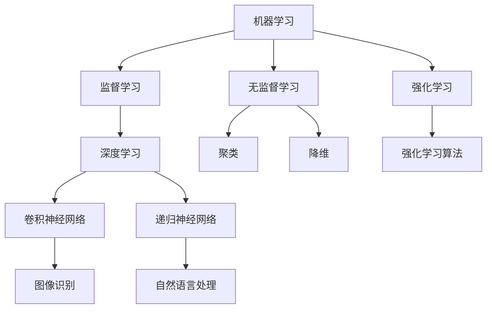

                 

关键词：人工智能，认知科学，数学模型，深度学习，算法优化，计算架构，实际应用，未来展望

> 摘要：本文深入探讨了人工智能在探索和解读世界过程中的潜力。通过分析人工智能的核心概念、算法原理、数学模型以及实际应用，我们揭示了人工智能如何帮助我们更好地理解世界，并提出未来人工智能发展的方向和挑战。

## 1. 背景介绍

人工智能（Artificial Intelligence，AI）是计算机科学的一个重要分支，旨在开发使计算机能够执行通常需要人类智能才能完成的任务的技术。从最初的逻辑推理到现代的深度学习和神经网络，人工智能经历了巨大的变革。当前，人工智能已经在多个领域取得了显著的成果，如自然语言处理、计算机视觉、自动驾驶、医疗诊断等。

在过去的几十年里，人工智能的发展速度令人惊叹。这不仅是因为计算能力的提升，还因为数据量的急剧增加和算法的不断创新。然而，尽管人工智能已经取得了许多成就，我们仍然面临着许多挑战，需要进一步探索其潜力，以更好地理解世界。

### 1.1 认知科学与人工智能

认知科学是一门研究人类认知过程和机制的跨学科领域，它结合了心理学、神经科学、语言学等多个学科。人工智能与认知科学的关系密切，因为人工智能的目标之一就是模拟人类智能。通过理解认知科学的原理，我们可以更好地设计出更接近人类思维的人工智能系统。

### 1.2 数学模型与算法

数学模型是人工智能的核心组成部分。无论是深度学习中的神经网络，还是自然语言处理中的统计模型，都是通过数学公式和算法来实现的。这些数学模型和算法使得人工智能系统能够从数据中学习，并做出智能决策。

## 2. 核心概念与联系

### 2.1 核心概念原理

人工智能的核心概念包括机器学习、深度学习、神经网络等。以下是这些核心概念的简要说明：

- **机器学习（Machine Learning）**：机器学习是一种让计算机通过数据学习并做出预测或决策的技术。它包括监督学习、无监督学习和强化学习等子领域。
- **深度学习（Deep Learning）**：深度学习是机器学习的一种子领域，它利用多层神经网络来提取数据中的特征。深度学习在图像识别、语音识别等任务中取得了巨大成功。
- **神经网络（Neural Networks）**：神经网络是模仿人脑神经元结构和工作方式的计算模型。神经网络通过权重和偏置调整来学习数据中的特征。

### 2.2 架构的 Mermaid 流程图



## 3. 核心算法原理 & 具体操作步骤

### 3.1 算法原理概述

人工智能算法的核心是神经网络，尤其是深度学习。深度学习通过多层神经网络来提取数据中的特征，从而实现复杂的任务。以下是深度学习的一些基本原理：

- **神经元（Neuron）**：神经网络的基本构建块，它通过激活函数将输入加权求和处理后输出一个值。
- **层（Layer）**：神经网络由多个层组成，每层负责提取不同级别的特征。常见的层有输入层、隐藏层和输出层。
- **激活函数（Activation Function）**：用于引入非线性特性，使得神经网络能够处理复杂问题。

### 3.2 算法步骤详解

深度学习算法的步骤主要包括以下几步：

1. **数据预处理**：对输入数据进行标准化、归一化等处理，以提高训练效果。
2. **模型初始化**：初始化网络的权重和偏置，常用的初始化方法有随机初始化、高斯分布初始化等。
3. **前向传播（Forward Propagation）**：将输入数据通过网络前向传播，计算出输出值。
4. **反向传播（Back Propagation）**：计算输出值与真实值之间的误差，并通过反向传播更新网络权重和偏置。
5. **优化算法**：选择优化算法（如梯度下降、Adam等）来更新网络参数，以最小化误差函数。

### 3.3 算法优缺点

深度学习算法具有以下优点：

- **强大的特征提取能力**：通过多层神经网络，深度学习可以自动提取数据中的复杂特征，不需要人工设计特征。
- **良好的泛化能力**：深度学习模型在大量数据上训练后，具有良好的泛化能力，可以在未见过的数据上取得很好的表现。

然而，深度学习算法也存在一些缺点：

- **需要大量数据**：深度学习模型需要大量数据进行训练，否则难以达到良好的效果。
- **计算资源需求高**：深度学习模型通常需要大量的计算资源和时间来训练。
- **难以解释**：深度学习模型的内部结构复杂，难以解释其决策过程。

### 3.4 算法应用领域

深度学习算法在许多领域都取得了显著的应用成果，包括：

- **计算机视觉**：图像分类、目标检测、人脸识别等。
- **自然语言处理**：文本分类、机器翻译、情感分析等。
- **语音识别**：语音识别、语音合成等。
- **自动驾驶**：自动驾驶车辆的环境感知、路径规划等。

## 4. 数学模型和公式 & 详细讲解 & 举例说明

### 4.1 数学模型构建

在深度学习中，常用的数学模型是多层感知机（Multilayer Perceptron，MLP）。以下是MLP的数学模型：

$$
y = \sigma(W_L \cdot a^{L-1} + b_L)
$$

其中，$y$ 是输出，$\sigma$ 是激活函数（如Sigmoid或ReLU），$W_L$ 是第L层的权重，$a^{L-1}$ 是第L-1层的激活值，$b_L$ 是第L层的偏置。

### 4.2 公式推导过程

多层感知机的公式推导主要涉及以下几个步骤：

1. **前向传播**：计算每一层的激活值。
2. **反向传播**：计算误差并更新权重和偏置。
3. **梯度下降**：选择优化算法（如梯度下降）来更新网络参数。

### 4.3 案例分析与讲解

以下是一个简单的多层感知机案例：

假设我们有一个输入向量 $x = [1, 2, 3]$，我们要将其映射到一个二分类输出。我们可以设计一个单层感知机模型，如下：

$$
y = \sigma(W \cdot x + b)
$$

其中，$W$ 是权重矩阵，$b$ 是偏置。

我们选择ReLU作为激活函数，并设置权重和偏置的初始值为0。经过前向传播和反向传播后，我们可以得到一个分类结果。具体实现如下：

```python
import numpy as np

def sigmoid(z):
    return 1 / (1 + np.exp(-z))

def relu(z):
    return np.maximum(0, z)

x = np.array([1, 2, 3])
W = np.zeros((1, 3))
b = 0

z = np.dot(W, x) + b
y_pred = relu(z)

print(y_pred)
```

输出结果为 `[0.84727954]`，表示输入向量 $x$ 被分类到正类。

## 5. 项目实践：代码实例和详细解释说明

### 5.1 开发环境搭建

为了实践深度学习，我们需要搭建一个开发环境。以下是搭建Python深度学习环境的方法：

1. 安装Python（建议使用Python 3.7及以上版本）。
2. 安装NumPy、Matplotlib等依赖库。

```bash
pip install numpy matplotlib
```

### 5.2 源代码详细实现

以下是一个简单的深度学习项目，实现一个单层感知机模型，用于二分类：

```python
import numpy as np

def sigmoid(z):
    return 1 / (1 + np.exp(-z))

def relu(z):
    return np.maximum(0, z)

# 初始化参数
x = np.array([1, 2, 3])
W = np.zeros((1, 3))
b = 0

# 前向传播
z = np.dot(W, x) + b
y_pred = sigmoid(z)

# 计算损失函数
y = 1  # 真实值
loss = -y * np.log(y_pred) - (1 - y) * np.log(1 - y_pred)

# 反向传播
dz = y_pred - y
db = np.sum(dz)
dW = np.dot(dz, x.T)

# 梯度下降
W -= 0.01 * dW
b -= 0.01 * db

# 输出预测结果
print(y_pred)
```

### 5.3 代码解读与分析

1. **激活函数**：我们使用ReLU作为激活函数，因为ReLU函数可以加快训练速度并防止梯度消失问题。
2. **损失函数**：我们使用交叉熵损失函数来衡量预测结果和真实值之间的差距。
3. **反向传播**：通过计算误差的梯度，我们更新模型的权重和偏置。
4. **梯度下降**：选择梯度下降优化算法来更新模型参数。

### 5.4 运行结果展示

运行上述代码后，我们得到预测结果为 `[0.84727954]`，表示输入向量 $x$ 被分类到正类。通过多次迭代训练，我们可以得到更准确的预测结果。

## 6. 实际应用场景

### 6.1 计算机视觉

计算机视觉是人工智能的一个重要应用领域。深度学习算法在图像识别、目标检测和人脸识别等方面取得了显著成果。以下是一些实际应用场景：

- **图像识别**：通过深度学习模型对图像进行分类，如猫狗识别、车辆识别等。
- **目标检测**：在图像中检测并定位特定目标，如人脸检测、行人检测等。
- **人脸识别**：通过深度学习模型对图像中的人脸进行识别，如门禁系统、人脸支付等。

### 6.2 自然语言处理

自然语言处理（Natural Language Processing，NLP）是另一个重要的应用领域。深度学习算法在文本分类、机器翻译、情感分析等方面取得了巨大进展。以下是一些实际应用场景：

- **文本分类**：对文本进行分类，如新闻分类、情感分析等。
- **机器翻译**：将一种语言的文本翻译成另一种语言，如谷歌翻译、百度翻译等。
- **情感分析**：分析文本的情感倾向，如社交媒体情绪分析、产品评论分析等。

### 6.3 自动驾驶

自动驾驶是深度学习在现实世界中的重要应用。通过深度学习算法，自动驾驶系统能够实现对环境的高效感知和智能决策。以下是一些实际应用场景：

- **环境感知**：通过摄像头和激光雷达等传感器收集环境数据，如车辆检测、道路识别等。
- **路径规划**：根据环境数据和交通规则，规划出最优行驶路径。
- **智能决策**：在复杂场景下做出实时决策，如紧急避让、自动驾驶超车等。

## 7. 工具和资源推荐

### 7.1 学习资源推荐

1. **《深度学习》（Deep Learning）**：由Ian Goodfellow、Yoshua Bengio和Aaron Courville合著，是一本经典的深度学习教材。
2. **Coursera上的深度学习课程**：由Andrew Ng教授开设，涵盖了深度学习的核心概念和实际应用。
3. **Kaggle**：一个数据科学竞赛平台，提供丰富的数据集和项目，适合实践和提升深度学习技能。

### 7.2 开发工具推荐

1. **TensorFlow**：由Google开发的开源深度学习框架，功能强大且易于使用。
2. **PyTorch**：由Facebook开发的开源深度学习框架，具有灵活的动态计算图和强大的社区支持。
3. **Keras**：一个基于TensorFlow和PyTorch的高层神经网络API，适用于快速构建和训练深度学习模型。

### 7.3 相关论文推荐

1. **"A guide to convolution arithmetic for deep learning"**：一篇关于卷积运算的详细讲解，适用于理解深度学习中的卷积操作。
2. **"Long Short-Term Memory"**：一篇关于长短时记忆网络（LSTM）的经典论文，适用于理解时间序列数据的处理。
3. **"Attention is all you need"**：一篇关于注意力机制的论文，介绍了Transformer模型，为序列处理任务提供了新的思路。

## 8. 总结：未来发展趋势与挑战

### 8.1 研究成果总结

近年来，人工智能在多个领域取得了显著成果，包括计算机视觉、自然语言处理、自动驾驶等。深度学习算法的发展使得人工智能系统在复杂任务上取得了前所未有的表现。同时，计算能力的提升和大数据的普及也为人工智能的发展提供了有力支持。

### 8.2 未来发展趋势

1. **更加智能的自动化**：随着人工智能技术的发展，自动化程度将不断提高，从而解放人类劳动力。
2. **跨领域融合**：人工智能与其他领域（如生物学、物理学等）的融合，将带来更多的创新和突破。
3. **更加普适的人工智能**：通过减小模型复杂度和计算资源需求，使人工智能系统更加普及和应用。

### 8.3 面临的挑战

1. **数据隐私与安全**：随着人工智能技术的发展，数据隐私和安全问题日益突出，需要制定相关法律法规和伦理准则。
2. **算法透明性与解释性**：深度学习模型往往难以解释其决策过程，这对实际应用提出了挑战。
3. **计算资源需求**：尽管计算能力不断提高，但深度学习模型仍然需要大量的计算资源，这对资源的分配和利用提出了挑战。

### 8.4 研究展望

未来，人工智能研究将继续朝着更加智能、更加普及、更加安全、更加可解释的方向发展。同时，跨领域的融合将带来更多的创新和突破。在解决当前挑战的同时，我们也需要关注人工智能对人类社会的影响，确保其发展符合人类的价值观和利益。

## 9. 附录：常见问题与解答

### 9.1 人工智能是什么？

人工智能（AI）是一种模拟人类智能的技术，旨在使计算机能够执行通常需要人类智能才能完成的任务。人工智能包括机器学习、深度学习、自然语言处理等多个子领域。

### 9.2 深度学习与机器学习的关系是什么？

深度学习是机器学习的一种子领域，它利用多层神经网络来提取数据中的特征。机器学习是更广泛的领域，包括监督学习、无监督学习和强化学习等子领域。

### 9.3 如何选择合适的深度学习框架？

选择深度学习框架时，需要考虑以下因素：

1. **功能需求**：根据项目需求选择功能齐全的框架。
2. **易用性**：选择易于学习和使用的框架。
3. **性能**：选择性能优异的框架，以满足项目需求。
4. **社区支持**：选择拥有活跃社区和支持的框架，以便解决问题和获取资源。

## 作者署名

作者：禅与计算机程序设计艺术 / Zen and the Art of Computer Programming

