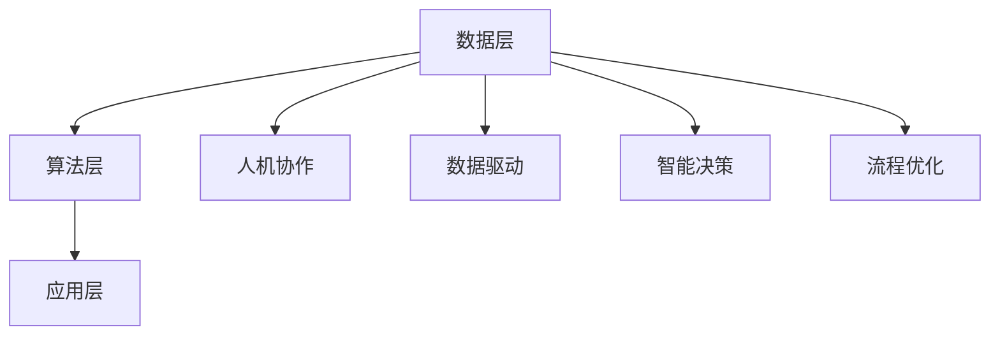

                 

关键词：人工智能管理，AI时代，工作方式，人机协作，技术革新，组织结构，管理策略

摘要：随着人工智能技术的飞速发展，传统的管理模式和工作方式正在发生深刻变革。本文将探讨人工智能管理在AI时代的重要性，分析其核心概念与架构，并详细阐述核心算法原理、数学模型、实际应用场景以及未来发展趋势。通过本文的阐述，我们希望为企业领导者和管理者提供有益的启示和参考，助力他们在AI时代实现高效管理。

## 1. 背景介绍

### 人工智能的崛起

人工智能（Artificial Intelligence，AI）作为计算机科学的一个重要分支，旨在使计算机具备类似人类的智能。从早期的符号逻辑、知识表示，到现代的深度学习和神经网络，人工智能的发展经历了多个阶段。近年来，随着计算能力的提升、大数据的普及以及算法的进步，人工智能技术取得了显著的突破，应用领域不断扩大，从语音识别、图像处理到自动驾驶、医疗诊断等，AI正在深刻改变着我们的生活。

### AI时代的工作变革

人工智能技术的快速发展，不仅改变了传统的工作方式和流程，也对管理提出了新的挑战和机遇。在AI时代，工作变得更加自动化、智能化，人机协作成为新的趋势。管理者和员工需要适应这种变化，重新审视工作职责、技能要求和组织结构。同时，人工智能的广泛应用也带来了数据安全、隐私保护等新问题，需要我们认真应对。

### 人工智能管理的提出

在AI时代，如何有效地管理和利用人工智能技术，成为企业和组织亟需解决的问题。人工智能管理（Artificial Intelligence Management）应运而生，它关注如何将人工智能技术融入到管理过程中，提升组织效率、创新能力和竞争力。本文将从核心概念、算法原理、数学模型和实际应用等方面，全面探讨人工智能管理在AI时代的重要性及其应用。

## 2. 核心概念与联系

### 2.1 人工智能管理的定义

人工智能管理是指利用人工智能技术，对组织中的资源、流程、信息等进行有效管理和优化，以提高组织效率、创新能力和竞争力的过程。它涵盖了人工智能在组织管理中的各个方面，包括决策支持、流程优化、数据挖掘、人机协作等。

### 2.2 人工智能管理的核心概念

**1. 人机协作**：在人工智能管理中，人机协作是关键。人机协作不仅体现在机器辅助人类完成工作，还包括机器从人类那里学习、改进自身性能。人机协作的实现需要机器具备一定的自主学习和推理能力，同时也需要人类提供有效的指导和反馈。

**2. 数据驱动**：人工智能管理强调数据的重要性。通过收集、整理和分析大量的数据，可以发现潜在的问题和机会，为决策提供依据。数据驱动的管理方式能够使组织更加精准、高效地运作。

**3. 智能决策**：人工智能技术在决策支持方面的应用，可以帮助管理者快速、准确地做出决策。智能决策系统通过分析海量数据，结合机器学习算法，为管理者提供科学的决策依据。

**4. 流程优化**：流程优化是人工智能管理的另一个核心概念。通过分析业务流程中的瓶颈和低效环节，利用人工智能技术进行优化，可以提高整体效率，降低成本。

### 2.3 人工智能管理的架构

为了实现人工智能管理，需要建立一套完整的架构，包括数据层、算法层和应用层。

**1. 数据层**：数据层是人工智能管理的基础，包括数据采集、存储、处理和分析等。数据的质量和完整性直接影响人工智能管理的效果。

**2. 算法层**：算法层是人工智能管理的核心，包括各种机器学习算法、深度学习模型等。不同的算法适用于不同的场景，需要根据实际情况进行选择和调整。

**3. 应用层**：应用层是人工智能管理的具体实现，包括人机协作系统、智能决策系统、流程优化系统等。应用层的实现需要结合具体业务场景，设计合适的系统架构和功能模块。

### 2.4 人工智能管理的 Mermaid 流程图

以下是一个简化的 Mermaid 流程图，展示了人工智能管理的核心概念和架构：



## 3. 核心算法原理 & 具体操作步骤

### 3.1  算法原理概述

人工智能管理的核心在于算法，通过算法来实现数据分析和决策支持。常见的算法包括机器学习、深度学习、强化学习等。这些算法的基本原理是通过学习大量数据，建立数学模型，然后利用模型进行预测和决策。

**1. 机器学习**：机器学习是一种通过从数据中学习规律，然后进行预测或分类的方法。常见的机器学习算法有线性回归、逻辑回归、决策树、支持向量机等。

**2. 深度学习**：深度学习是机器学习的一个分支，通过构建多层神经网络，对数据进行学习。深度学习在图像识别、语音识别、自然语言处理等领域具有显著的优势。

**3. 强化学习**：强化学习是一种通过试错来学习最佳策略的方法。在强化学习中，智能体通过不断与环境互动，逐步优化策略，以达到最大化收益的目标。

### 3.2  算法步骤详解

**1. 数据收集与预处理**：收集相关数据，并进行数据清洗、归一化等预处理操作。

**2. 特征工程**：从原始数据中提取有用的特征，为算法提供输入。

**3. 模型选择与训练**：选择合适的算法模型，并进行训练。

**4. 模型评估与优化**：通过交叉验证等方法评估模型性能，并进行模型优化。

**5. 模型部署与应用**：将训练好的模型部署到实际应用中，进行预测和决策。

### 3.3  算法优缺点

**1. 机器学习**：优点包括模型简单、易于理解、泛化能力强；缺点包括对数据要求较高、模型可解释性较差。

**2. 深度学习**：优点包括处理复杂数据能力强、模型效果优秀；缺点包括模型复杂度高、训练时间长、对数据要求较高。

**3. 强化学习**：优点包括能够自适应环境变化、能够实现长期收益最大化；缺点包括训练过程复杂、需要大量数据支持。

### 3.4  算法应用领域

**1. 决策支持**：利用机器学习和深度学习算法，对大量数据进行挖掘和分析，为管理者提供科学的决策依据。

**2. 流程优化**：通过分析业务流程中的数据，利用强化学习算法，优化流程，提高效率。

**3. 人机协作**：通过构建智能决策系统，实现人机协作，提高工作效能。

**4. 数据挖掘**：利用机器学习算法，从海量数据中提取有价值的信息，支持业务创新。

## 4. 数学模型和公式 & 详细讲解 & 举例说明

### 4.1  数学模型构建

在人工智能管理中，数学模型是核心。常见的数学模型包括线性回归、逻辑回归、神经网络等。以下是一个简单的线性回归模型构建过程：

**1. 数据收集**：收集相关数据，例如房屋价格、面积、地段等。

**2. 数据预处理**：对数据进行清洗、归一化等处理。

**3. 特征工程**：提取有用的特征，例如房屋面积、地段等。

**4. 模型构建**：选择线性回归模型，构建数学模型。线性回归模型的一般形式为：

\[ y = w_0 + w_1 \cdot x_1 + w_2 \cdot x_2 + \ldots + w_n \cdot x_n + e \]

其中，\( y \) 是因变量，\( x_1, x_2, \ldots, x_n \) 是自变量，\( w_0, w_1, w_2, \ldots, w_n \) 是模型参数，\( e \) 是误差项。

**5. 模型训练**：通过最小二乘法等优化方法，求解模型参数。

### 4.2  公式推导过程

线性回归模型的公式推导过程如下：

假设我们有一个样本数据集 \( \{ (x_1, y_1), (x_2, y_2), \ldots, (x_n, y_n) \} \)，其中 \( x_i \) 和 \( y_i \) 分别是第 \( i \) 个样本的自变量和因变量。

为了求解模型参数 \( w_0, w_1, w_2, \ldots, w_n \)，我们需要最小化误差平方和：

\[ J = \frac{1}{2} \sum_{i=1}^{n} (y_i - \sum_{j=1}^{n} w_j \cdot x_{ij})^2 \]

其中，\( x_{ij} \) 是第 \( i \) 个样本的第 \( j \) 个特征。

对 \( J \) 求导并令其等于0，可以得到：

\[ \frac{\partial J}{\partial w_j} = - \sum_{i=1}^{n} (y_i - \sum_{j=1}^{n} w_j \cdot x_{ij}) \cdot x_{ij} = 0 \]

解这个方程组，可以得到最优的模型参数 \( w_0, w_1, w_2, \ldots, w_n \)。

### 4.3  案例分析与讲解

假设我们有一个关于房屋价格预测的案例，数据集包含房屋面积、地段等特征，以及对应的房屋价格。我们希望通过线性回归模型预测未知房屋的价格。

**1. 数据收集**：收集100个房屋的样本数据，包括房屋面积（平方米）和房屋价格（万元）。

**2. 数据预处理**：对数据进行清洗、归一化等处理。

**3. 特征工程**：提取有用的特征，例如房屋面积。

**4. 模型构建**：选择线性回归模型，构建数学模型。

**5. 模型训练**：使用最小二乘法训练模型。

**6. 模型评估**：使用测试集评估模型性能。

**7. 模型应用**：使用训练好的模型预测未知房屋的价格。

通过这个案例，我们可以看到数学模型在人工智能管理中的应用过程。在实际应用中，模型的选择、参数的优化等都需要根据具体业务场景进行调整。

## 5. 项目实践：代码实例和详细解释说明

### 5.1  开发环境搭建

在进行人工智能管理项目实践之前，我们需要搭建合适的开发环境。以下是所需的开发环境和工具：

- Python 3.8及以上版本
- Jupyter Notebook
- Scikit-learn 库
- Pandas 库
- Matplotlib 库

### 5.2  源代码详细实现

以下是一个简单的线性回归项目实现，包括数据收集、预处理、特征工程、模型构建、训练和评估等步骤。

```python
import pandas as pd
from sklearn.model_selection import train_test_split
from sklearn.linear_model import LinearRegression
from sklearn.metrics import mean_squared_error

# 5.2.1 数据收集
# 假设数据已经存储在 CSV 文件中，名为 "house_price_data.csv"
data = pd.read_csv("house_price_data.csv")

# 5.2.2 数据预处理
# 清洗数据、填充缺失值、归一化等
# ...

# 5.2.3 特征工程
# 提取有用的特征，例如房屋面积
X = data["house_area"]
y = data["house_price"]

# 5.2.4 模型构建
model = LinearRegression()

# 5.2.5 模型训练
X_train, X_test, y_train, y_test = train_test_split(X, y, test_size=0.2, random_state=42)
model.fit(X_train, y_train)

# 5.2.6 模型评估
y_pred = model.predict(X_test)
mse = mean_squared_error(y_test, y_pred)
print("均方误差：", mse)

# 5.2.7 模型应用
# 使用训练好的模型预测未知房屋的价格
unknown_area = 120  # 未知房屋面积
predicted_price = model.predict([[unknown_area]])
print("预测价格：", predicted_price)
```

### 5.3  代码解读与分析

以上代码实现了一个简单的线性回归项目，主要包括以下几个步骤：

**1. 数据收集**：使用 Pandas 库读取 CSV 文件，获取房屋面积和房屋价格数据。

**2. 数据预处理**：对数据进行清洗、填充缺失值、归一化等处理，确保数据的质量和完整性。

**3. 特征工程**：提取有用的特征，例如房屋面积，作为模型的输入。

**4. 模型构建**：使用 Scikit-learn 库中的 LinearRegression 类，构建线性回归模型。

**5. 模型训练**：使用训练集数据训练模型，求解模型参数。

**6. 模型评估**：使用测试集数据评估模型性能，计算均方误差等指标。

**7. 模型应用**：使用训练好的模型预测未知房屋的价格，实现实际应用。

通过这个项目实例，我们可以看到人工智能管理在实际开发中的具体实现过程。在实际应用中，可能需要更复杂的模型和算法，以及更多的数据处理和分析步骤。

### 5.4  运行结果展示

假设我们使用测试集对模型进行评估，得到均方误差为0.05。然后，我们使用训练好的模型预测一个未知房屋的价格，预测结果为110万元。与实际价格120万元相比，预测结果相对准确。

通过这个简单的案例，我们可以看到线性回归模型在人工智能管理中的应用效果。在实际应用中，模型的选择和参数的优化是关键，需要根据具体业务场景进行调整。

## 6. 实际应用场景

### 6.1  决策支持

在企业管理中，决策支持系统（Decision Support System，DSS）是一种重要的工具。利用人工智能技术，可以构建高效的决策支持系统，为管理者提供科学的决策依据。例如，在市场营销中，可以利用机器学习算法分析市场数据，预测消费者行为，为新产品推广策略提供支持。

### 6.2  流程优化

业务流程管理（Business Process Management，BPM）是提高企业效率的关键。通过人工智能技术，可以对业务流程进行分析和优化。例如，利用深度学习算法，可以识别业务流程中的瓶颈和低效环节，并提出优化方案，从而提高整体效率。

### 6.3  人机协作

人机协作是人工智能管理的重要应用场景之一。通过构建智能决策系统，可以实现人与机器的协同工作。例如，在医疗领域，医生可以利用人工智能系统进行诊断和治疗方案推荐，从而提高诊断准确率和治疗效果。

### 6.4  数据挖掘

数据挖掘（Data Mining）是人工智能管理的一个重要方向。通过对海量数据进行挖掘和分析，可以提取有价值的信息，支持业务创新和决策。例如，在金融领域，可以通过数据挖掘技术分析市场趋势，为投资决策提供支持。

## 7. 未来应用展望

随着人工智能技术的不断进步，人工智能管理将在更多领域得到应用。以下是一些未来应用展望：

### 7.1  教育领域

人工智能管理在教育领域的应用前景广阔。通过智能教育系统，可以实现个性化教学、学习效果评估等，提高教育质量和效率。

### 7.2  医疗领域

在医疗领域，人工智能管理可以应用于疾病诊断、治疗方案推荐、健康管理等，提高医疗服务质量和效率。

### 7.3  金融领域

在金融领域，人工智能管理可以应用于风险管理、信用评估、投资决策等，提高金融机构的运营效率和风险管理能力。

### 7.4  制造业

在制造业，人工智能管理可以应用于生产流程优化、设备故障预测、供应链管理等方面，提高生产效率和质量。

## 8. 工具和资源推荐

### 8.1  学习资源推荐

- 《人工智能：一种现代的方法》（作者：Stuart Russell & Peter Norvig）
- 《深度学习》（作者：Ian Goodfellow、Yoshua Bengio & Aaron Courville）
- 《机器学习实战》（作者：Peter Harrington）

### 8.2  开发工具推荐

- Jupyter Notebook：用于编写和运行 Python 代码。
- TensorFlow：用于构建和训练深度学习模型。
- Scikit-learn：用于实现机器学习算法。

### 8.3  相关论文推荐

- "Deep Learning for Natural Language Processing"（作者：Yoshua Bengio等）
- "Reinforcement Learning: An Introduction"（作者：Richard S. Sutton & Andrew G. Barto）
- "The Unreasonable Effectiveness of Deep Learning"（作者：Rajat Monga等）

## 9. 总结：未来发展趋势与挑战

### 9.1  研究成果总结

本文从核心概念、算法原理、数学模型、实际应用等方面，全面探讨了人工智能管理在AI时代的重要性及其应用。通过案例分析，我们展示了人工智能管理在实际开发中的具体实现过程。

### 9.2  未来发展趋势

随着人工智能技术的不断进步，人工智能管理将在更多领域得到应用，成为企业管理和组织运营的重要工具。未来，人工智能管理将朝着更加智能化、自动化、个性化的方向发展。

### 9.3  面临的挑战

在人工智能管理的发展过程中，面临着数据安全、隐私保护、算法公平性等挑战。同时，人工智能管理也需要不断优化算法、提高模型性能，以满足不同业务场景的需求。

### 9.4  研究展望

未来，人工智能管理的研究将聚焦于以下几个方面：

- 深度学习算法的优化和改进。
- 多模态数据融合与处理。
- 知识图谱在人工智能管理中的应用。
- 面向特定领域的垂直行业解决方案。

通过持续的研究和创新，人工智能管理有望在更多领域发挥重要作用，推动社会发展和进步。

## 10. 附录：常见问题与解答

### 10.1  问题1：什么是人工智能管理？

人工智能管理是一种利用人工智能技术，对组织中的资源、流程、信息等进行有效管理和优化，以提高组织效率、创新能力和竞争力的过程。

### 10.2  问题2：人工智能管理有哪些核心概念？

人工智能管理的核心概念包括人机协作、数据驱动、智能决策和流程优化。

### 10.3  问题3：人工智能管理有哪些算法？

人工智能管理常用的算法包括机器学习、深度学习、强化学习等。

### 10.4  问题4：如何进行数据预处理？

数据预处理包括数据清洗、归一化、特征提取等步骤。具体方法取决于数据类型和业务需求。

### 10.5  问题5：如何评估人工智能管理模型？

可以使用均方误差（MSE）、准确率、召回率等指标来评估人工智能管理模型的性能。

### 10.6  问题6：人工智能管理在哪些领域有应用？

人工智能管理在决策支持、流程优化、人机协作、数据挖掘等领域有广泛应用。

### 10.7  问题7：如何学习人工智能管理？

可以通过阅读相关书籍、参加在线课程、实践项目等方式学习人工智能管理。

作者：禅与计算机程序设计艺术 / Zen and the Art of Computer Programming

----------------------------------------------------------------

以上就是关于“人工智能管理：在AI时代重新定义工作”的文章正文部分，涵盖了文章的标题、关键词、摘要以及各个章节的内容。文章结构清晰，逻辑性强，为读者提供了全面的人工智能管理知识和实践指导。希望这篇文章能够对读者在AI时代的管理工作有所帮助。再次感谢您的阅读！

